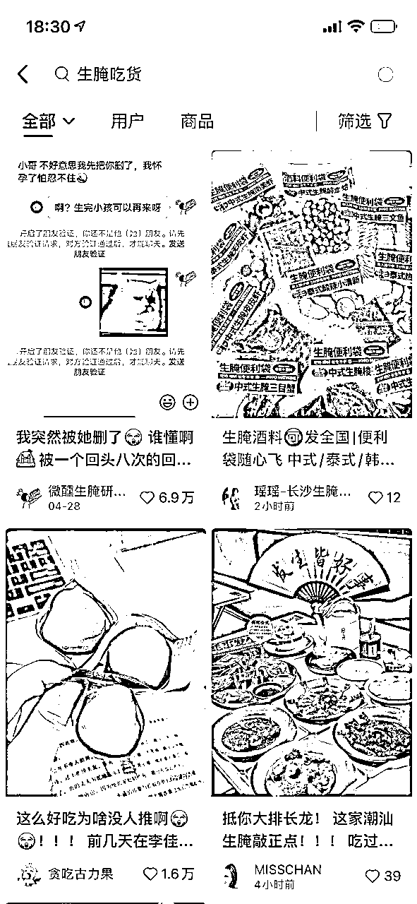

# 「勿传」小红书引流丨70后母亲从0开始做小红书，月入5位数

> 来源：[https://bmy4tfqyf1.feishu.cn/docx/IhOmdAlrXoLKUqx0uiecc778nnd](https://bmy4tfqyf1.feishu.cn/docx/IhOmdAlrXoLKUqx0uiecc778nnd)

小小的里程碑：

22年10月29日：母亲发小红书的第二天，开始有人咨询

23年1月12日：母亲深夜爆单

23年4月1日：母亲小红书发布超1000篇

原本只是在朋友圈记录下老妈的战绩，今天在群里给小伙伴们分享的时候，大家都听的津津有味，也纷纷问我，能不能带他们的父母也做做小红书，觉得此事值得复盘，所以赶紧码下了这篇文章。

如果你想带着长辈一起做自媒体，或者本身对自媒体一无所知的圈友，也许这篇文章能带到你灵感。

# 一、母亲的自媒体升级打怪之旅

我妈是个传统的家庭主妇，本以为按照结婚生子带娃的路径，过着一眼就望得头的生活，想不到在临近50岁的时候，从零开始做小红书，不到2个月的时间，就跑通了项目，收入突破5位数，如今已经开始上矩阵扩大收益了。

22年10月，母亲来广州住一段时间，总说外面哪里哪里在招工，不想天天待在家里，也想出去外面干活赚点钱，不过她身体不好，手也动过手术，我就一直没同意。有一天，我刷小红书的时候，看到一个项目，感觉门槛低，也有机会赚钱，我就跟她说，要不试试，万一做起来了，一个月顶得上她去外面做一年，失败了也没啥损失。（造梦+减低失败恐惧感）。

说干就干，当晚我就注册了账号，按照同行爆款笔记的样式，发了一条笔记，主要是让她看看效果。兴许是老天眷顾，这条笔记刚发不久，就开始有人咨询怎么找我们，一炮打响！

母亲看到效果这么好，信心biu的一下就涨起来了，对于普通人来讲，真的是让他看见比相信更重要。

教长辈做自媒体确实心累，她平时最多就刷刷抖音，甚至都没有下载过小红书，手机的操作也不灵活，我手把手教她怎么复制爆款标题、怎么找图片、怎么修改文案，忙活了很久，她的第一条小红书笔记终于也发布成功了。

由于笔记效果出的特别快，在后台有几个人咨询的时候，我们还没有找到后端供应商，所以我马不停蹄的抖音/小红书/淘宝找供应商，第二天我们出了第一单，成功让老妈赚到了第一笔钱。

后来的故事就像一篇爽文，粉丝突破1000了，成交数突破100了，佣金突破1w了，于是老妈就这样开启了她的自媒体升级打怪之路。

当然了，看着行云流水的变现经历，实际上现实中会碰到各种各样的难题，请调整好预期，任何赚钱的事情都不容易。

# 二、如何从0开始做一个小红书项目

看完故事，会不会心痒痒的也想带着父母去实操一遍，哈哈哈，干货来了。

我做自媒体比较久，有一套成型的方法论，如果你感兴趣，可以看看这一篇：

《日语线上培训，小红书日引流100学员加微信》https://t.zsxq.com/0euVr7I0S

## 1、选品与找对标账号

由于母亲做的是一个小蓝海的项目，不方便直接拿账号给大家讲，不过为了能够让大家能够更有获得感，我从生财的风向标里找了一个项目，按照我们操作的路径来讲一遍。

首先，我们打开生财的风向标库（yyds！再说一遍，yyds！），在项目库这一列里，仅筛选小红书这个平台，然后我发现了「小红书高客单价生腌食品，购买的人很多」。因为都是亦仁大大标注过「中标」的内容，可信度很高。

打开小红书，搜索「生腌」相关的关键词，发现右上有一篇2小时前发布的笔记。

点进该篇笔记，发现有人咨询，博主定位是湖南，咨询用户的定位是内蒙古，初步判断可信度较高，不像自己刷的。

进入该博主主页，看看她的账号和笔记数据，粉丝8000+，置顶的爆款笔记7966点赞，咨询很多。

点开获赞数，我们可以判断该博主发布了95篇笔记，拉到最开始的第一条，是22年5月发布的真人出镜的视频，而近期都调整为图文笔记，初步判断图文笔记的效果很好，暂时不需要通过真人出镜这种制作成本较高的笔记来引流。

## 2、判断项目是否可行的方式：

因为初步判断这个项目是可复制的，所以忽略了怎么判断是否可行的。

判断方式：

①看最新笔记，看看有没有低粉高赞的近期作品。建议新手按照第一点来判断，只有该项目有人做，近期有小号发的笔记，有人咨询，并且生产内容的方式、成本、难度是你能接受的，那你就可以开始做号尝试了。

②通过千瓜数据等平台看看该项目的流量，竞争度怎么样。

## 3、爆款笔记分析：

### ①封面&图片分析：

在网页版打开该篇笔记的链接，通过谷歌浏览器的插件「图片助手」可快速查看/下载小红书图片（有时候有水印，此举主要是方便截图该笔记所有图片，方便展示）

分析：首先是包装做的特别好，大字，颜色清爽，看起来很有高级感，然后将不同风味的产品摆在一起拍，图片的审美一下子就拉起来了。好看+主题明确=小红书封面的流量密码。

### ②文案分析：

文案的结构比较简单，介绍自家的生腌产品+亮眼的emoji表情包+产品的色香味文字描述+相关话题堆积。

### ③标题分析：

刚好看到该博主的笔记都带了一个「#长沙合适酒料」的话题，于是我利用后羿采集器，将该话题的笔记都采集下来，总共204篇，小惊喜是又发现了2个同类型账号（@长沙合适酒料小老板、@长沙合适酒料 生腌外卖），研究了一下发现是该博主的矩阵账号。（拜托大家不要去骚扰他们，求求你们了。）

（小提示：在小红书复制某话题链接，将该链接粘贴进后羿采集器里，可以直接采集该话题下的大部分笔记，包含账号昵称，笔记链接，笔记标题，点赞数，对于分析同行账号是个很有用的方法）

在小红书里，封面和标题的作用特别大，因此爆款笔记的标题有一定的参考价值，我们如果做的话，可以模仿下述的标题来写。例如我们如果做广州的生腌生意，我们可以将第2条改成《广州生腌吃货看过来🎁超好看的生腌便利袋》。

同时，从标题里，我们也发现了有很多内容可以写，例如介绍自家的团队，介绍自己产品的生产理念，展示客户售前售中售后的聊天截图、展示自己的生产线、生产流程等等，任何跟生腌相关的都可以发，提前解决产品单一没啥好发的窘境，而且爆过的笔记我们都可以重复在同一个账号上面发，又一个流量密码。

## 4、联系供应商

太阳底下没有新鲜事，任何项目都有人想过做过，更何况我们是根据风向标选品，所以供应商其实是很多的。

我们可以通过小红书、抖音、淘宝等方式，通过搜索关键词，找到对应的厂家，跟他们聊是否可以合作，初期我们的目标是跑通流量-成交-交付的流程，所以赚少一点也不要太在意。等我们流量大了，自然就有能力去拿到更低价格的产品和服务。

## 5、开始行动

最重要的一步终于来了，不管我们分析的多好，做了一份多完美的方案，最重要的是我们要投入生产。

①准备一个小红书账号，不用在意手机型号、wifi/流量、什么时候注册的、有没有发布过笔记，初期没有流量大概率都是内容的问题。

②根据我们分析出的方法，通过抖音、小红书、淘宝的买家秀、直接联系商家拿物料等方式，拿到第一批笔记的物料，使用美图秀秀、黄油相机、创客贴等方式为图片加滤镜、加标题。

特别重要的提示：生财里有非常多保姆级实操教程，搜一搜都是有的。

生财搜索网址：https://search01.shengcaiyoushu.com/

③根据我们找到的文案模板，模拟着来写，最新的玩法是直接使用chatgpt来仿写。

④多更新，多测试：我们要做的是不断的发布笔记，跑出有人咨询的笔记，然后快速的自我复制。（我母亲刚开始甚至尝试过，一天发了10多条笔记，因为她发现每发一条，就有人咨询，这种感觉贼爽。一般账号一天发布3条笔记左右）

⑤小步快跑，快速迭代，通过小红书，获得第一个加微，第一个成交，第一个交付，赚到第一笔钱，然后尝试上矩阵吧。

# 三、带长辈做自媒体的5点心得

## 1、讲人话，不要讲理论，多举例子

如果一上来就给我妈什么底层逻辑，推流算法，她可能听完一脸懵逼，也会因为难度高而抗拒做这件事。

但我基本上没给她讲太多理论的东西，比方说找笔记怎么发，直接搜索「关键词」，然后看同行怎么发的，我们就怎么发，千万不要有太多自己的想法，这样起步也容易，数据反馈也更好，一边说，一边演示给她看。

## 2、先从最简单的做起

先打爆单平台单账号，不要急着一鱼多吃，一鱼多吃是没错的，但如果一开始就做太多平台，太多账号，反而会因为工作量过多，学习成本过大，导致新手直接放弃。

我们要识别最重要的事情，然后只让他们做最重要的事情，例如找图片怎么找，只给一个有效的方法，让他们用一个方法就够了，太多的方法反而会加重他们的负担。我们要自己把任务拆解的足够详细，然后把每一步告诉他应该怎么做。

## 3、要耐心，不要急

小时候父母教我们的时候多有耐心，我们对父母就要回报以更大的耐心，毕竟他们不是沉浸在互联网里的一代，很多我们觉得是常识的事情，他们不一定懂，比方说左滑屏幕就是返回，很多人甚至都不知道。

我22年在开课吧担任教研负责人时，负责短视频科目的2w多学员的交付，当时我的体感就非常深，举个例子，70岁的人连手机拍摄怎么放大画面都不懂，我们需要教他用双指捏着手机屏幕，然后把双指打开，才能放大画面，要细致到这种程度。

对于年纪大的人，我们教学的时候，每一步操作一定是揉碎了讲，而不是大大咧咧的过。就像《可复制的领导力》里讲的一样，我说你做，我做你看，你做我看，确保每一步都掌握了再进行下一步。

## 4、调整双方的预期

我们不要指望着长辈一开始就能取得多好的成绩，我们和他们都要树立合理的目标，例如我看到有人说「只发了两条就有爆款」，这种语言模式的背后，是好简单，我也想只发两条就爆。

所以，如果带着咱们父母去做的话，一定要调整好我们和长辈的预期，告诉他们这事可行，但不要太着急，同时我们也要相信，他们能做起来，但可能没那么快。（一夜暴富的事情梦里都有。）

## 5、正反馈很重要

我的母亲没有做过生意，所以她的思维是停留在我干一份活就要拿一份钱的心态，很难一开始就有先做个账号，前期不求回报，然后等后期收入的心态，所以我们需要前期不断的跟他们说，这项目不错的，能赚到钱的，给他们信心，然后帮助他们尽快的拿到正反馈，讲的再多，不如让他们赚到一块钱，甚至咱们可以来个骚操作（例如教父母做抖音带货，然后我们自己下单之类的哈哈哈）。

所以一开始我已经做好准备，如果没什么人咨询，我就找朋友帮忙咨询，下单，让老妈感受到成交的感觉。培养自信很好的方法就是「积小胜，成大胜」，从一点一滴的成功中，获得自信，推动着我们去尝试更多的东西，获得更多的成就，这是个非常了不起的良性循环。

小红书流量真的很香，如果你也是做生意的，开工厂的，或者说你拥有某项独特的技能，都强烈建议你试试，认真做上个3个月，相信你也会有所收获，加油！

郑韩微信：zh474560985