# 淘宝模特AI换装的保姆级教程

> 来源：[https://ciw2i24cl6.feishu.cn/docx/IysYdFRYKoqbqdxeNSGcxr0Qnkb](https://ciw2i24cl6.feishu.cn/docx/IysYdFRYKoqbqdxeNSGcxr0Qnkb)

# 一 、环境搭建

使用的软件是SD,SD全称为Stable Diffusion。是当下非常流行的开源AI图片生成框架。

SD的图形化界面我们称为Web-UI。通常我们所说的大部分AI跑图就是在Web-UI上实现的。那么我们如何安装SD和Web-UI呢？

## 1.1 硬件要求：

不管我们需要注意的是，并非所有电脑都可以使用SD的。

SD是一种AI应用，因此是需要显卡的。

使用SD和Web-UI的最低电脑配置为16G内存+40G硬盘+显存为4G以上的显卡。

## 1.2软件安装：

这里我们建议刚入门的大家使用整合包进行安装。

在满足上述基本条件后，我们就可以开始安装整合包啦！这里我们推荐B站UP主秋叶制作的整合包https://www.bilibili.com/video/BV1iM4y1y7oA，百度网盘的提取地址为https://pan.baidu.com/s/1_ibEk2OpKHxmEg4AnFOpSA 提取码为c132。下载完成后解压既可使用。具体的安装步骤可以参考链接里的视频，因为该整合包是最简单的一站式安装包，解压即用。本教程将不再赘述环境搭建的方法。

# 二、 模型选取

## 2.1 模型介绍

SD的模型主要有两个大类，

1.  .Stable Diffusion 模型

1.  外挂 VAE 模型

Stable Diffusion 模型是最重要的模型，SD大部分的AI生成功能都依赖Stable Diffusion 模型来实现。

外挂 VAE 模型可以简单理解为风格化滤镜，在一些特定的Stable Diffusion 模型上，想要实现最好的效果，使用正确的外挂 VAE 模型是不可或缺的一步。

## 2.2 选择好用的模型，下载安装

一般我们会在C站，也就是https://civitai.com 上寻找适合我们生成目标的Stable Diffusion 模型和外挂 VAE 模型。

本教程中使用到的模型为beautifulRealistic_brav5

这是一个适合于生成亚洲人的模型，更适合日韩风格的服装模特。这个模型并没有明确指出使用哪个VAE模型，因此我使用的是orangemix.vae模型。注意，在C站下载模型需要科学上网，文末附上了本篇教程中所有使用到的模型的百度网盘链接。

#### 1）.下载beautifulRealistic_brav5模型

#### 2）. 当我们下载完模型后，需要打开SD的安装目录，找到modules文件夹。

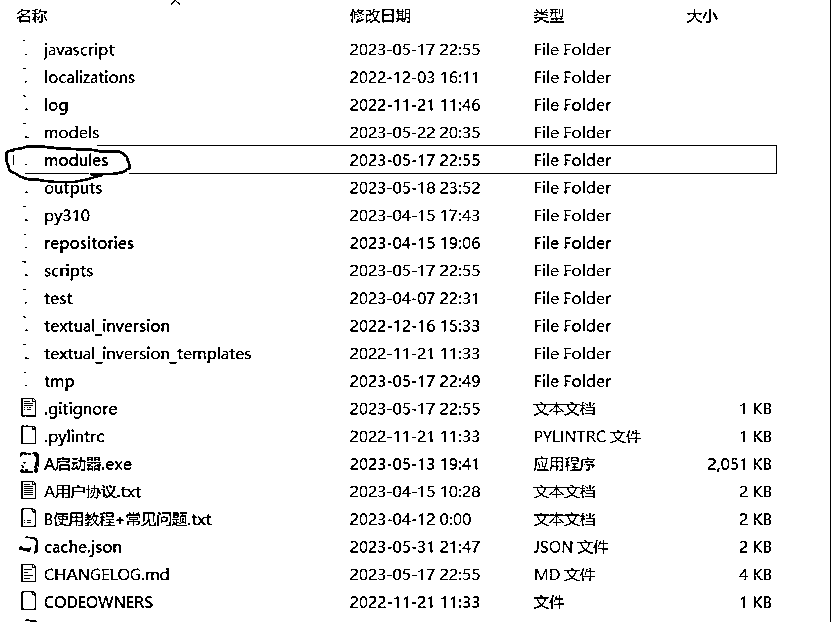

#### 3) 进入后找到Stable-diffusion文件夹，将beautifulRealistic_brav5模型放入该文件夹内。

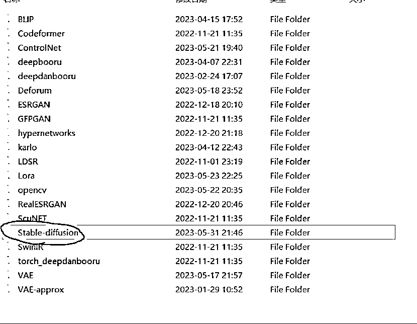

#### 4）接着我们返回modules文件夹，找到VAE文件夹，将orangemix.vae模型放入。

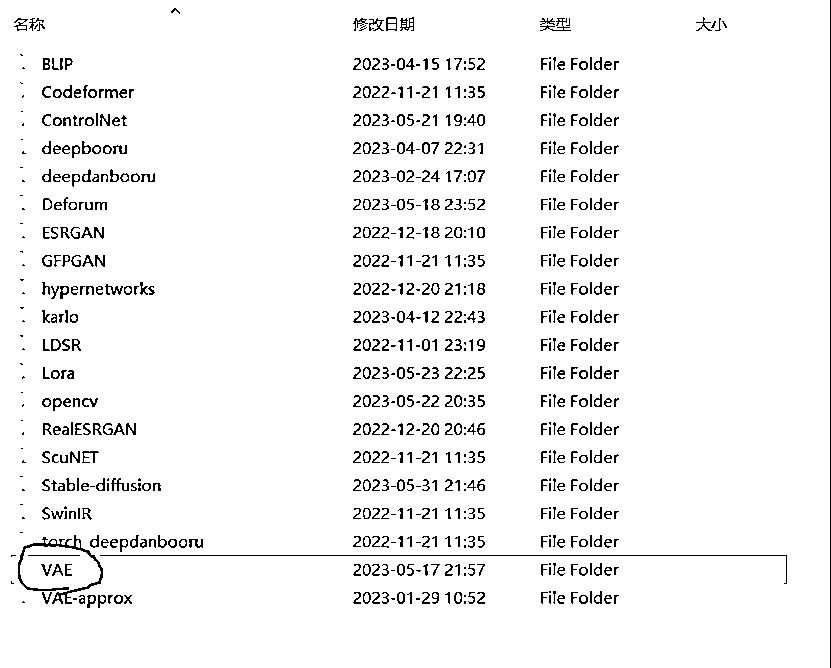

## 2.3这样我们就完成了模型的下载和安装，最后我们只需要在Web-UI中加载模型即可。

方法如下：

###### 1）打开Web-UI，找到下图位置，点击蓝色的刷新按钮。

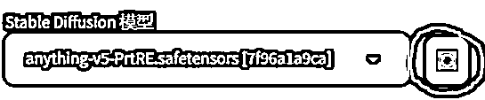

###### 2）点击箭头，打开模型列表

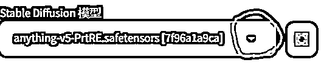

###### 3）找到我们的模型名称，点击模型

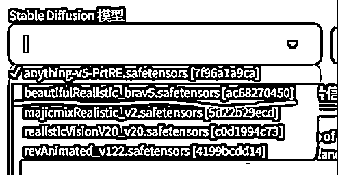

###### 4）等待加载

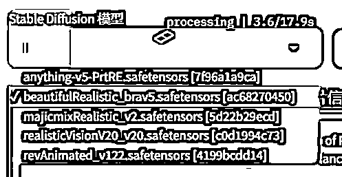

###### 5) 加载成功

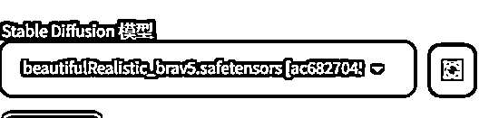

VAE模型也使用相同的方法即可加载。

# 三 、生成原始模特

生成原始模特需要用到SD的文生图功能。文生图是SD最常用也是最基本的功能。在各类SD的进阶操作中，往往都需要使用文生图来实现基础图像的生成。

下面我们将使用文生图功能生成我们的基础模特图像

## 3.1 首先我们需要找到Web-UI中的文生图字样并点击

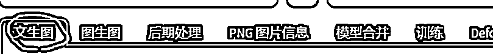

接着我们会看到下面出现了很多选项

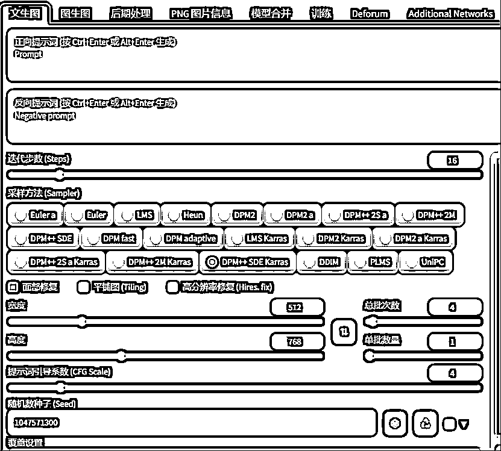

这些就是文生图的基本页面了，我们主要需要调整的就是这些参数。

## 3.2 输入关键词

这里我们先选择生成一个穿着毛绒外套的女生模特，因此需要在正向提示词内写入以下关键词：

输入正向关键词为(8k, best quality, masterpiece, ultra highres:1.2)

Photo of Pretty Japanese woman in the (style of paul rubens and rebecca guay:1.1) (melancholy winter snow:1.4),(shot hair:1.3)

反向关键词为(worst quality:2.0)

这里的正向关键词是指我们希望AI将图片画成什么样，反向关键词指我们不希望AI把图片画成什么样。括号中的数字我们通常使用1~10，表示我们希望括号内的关键词对AI画图的影响有多大。

## 3.3 面部修复

我们接着往下看，在提示词的下面是三个可选项：面部修复、平铺图 (Tiling)、高分辨率修复 (Hires. fix)。这三个选项里，我们一般只勾选面部修复。高分辨率修复虽然方便，但如果你的显卡较差，使用高清修复会导致爆显存，无法生成图像。因此我们一般都采用先生成图像，再单独进行高清修复，以此来避免爆显存的问题。

在完成以上设置后，我们只需要点击右边的生成按钮，等待片刻，就能生成属于自己的AI模特啦。

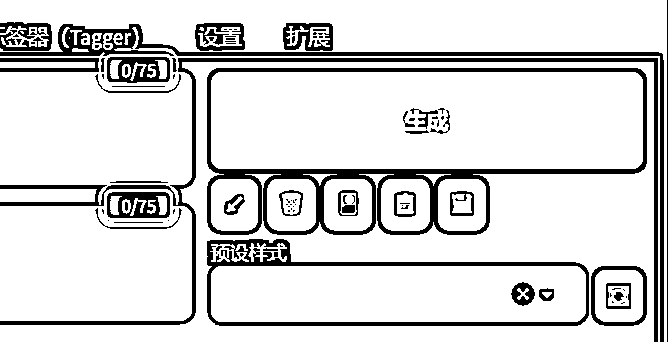

在正常运行结束后，我们就可以看到预览框中的AI模特啦。我生成的是这样的。

# 四、生成新服装

在前面的教程里，我们成功生成了一名AI模特，接下来我们将带你实现对这名AI模特的换装。

## 4.1 首先点击预览框下面的图生图按钮。

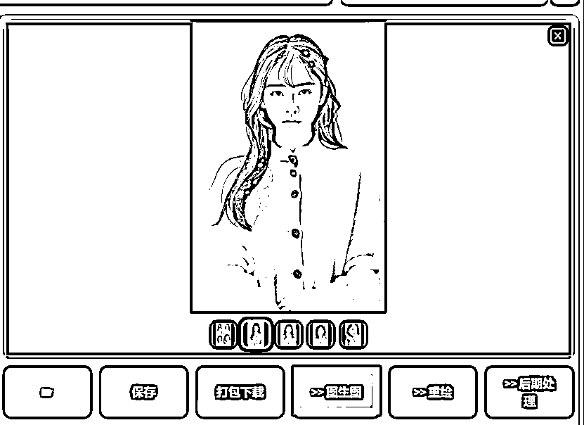

## 4.2 重绘功能

接着我们就会跳转到图生图的页面，在页面左侧是我们刚刚生成的AI模特图。我们在图上找到重绘按钮，点击后我们能够在图片右侧找到一支画笔。点击画笔后我们就可以发现鼠标变成了一个黑色的圆形。这表明我们已经可以开始绘画了。

## 4.3 绘制图片模板

我们画图的目标是将模特图身上的衣服全部用画笔涂黑，同时尽量不涂出界。我们将这一过程称为绘制图片蒙版。蒙版能够实现指定AI生成区域的功能，借助这一特点，我们得以实现使用蒙版来告诉AI，我们需要重新生成的是衣服，而非模特身上的其它部分。将图片涂成我这样就可以了。

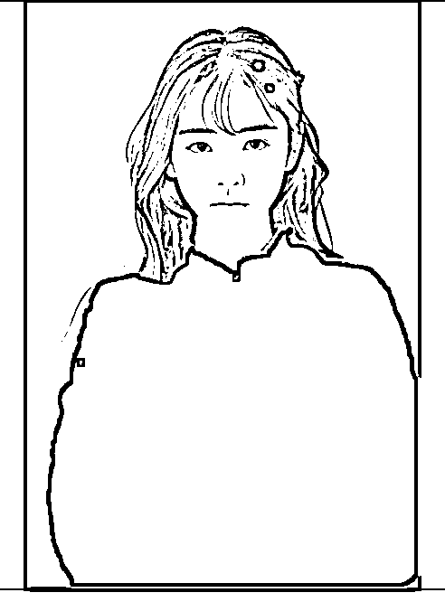

## 4.4 修改关键词

接下来我们需要修改关键词。这里需要注意的是，如果你的关键词里已经有了指定AI模特的服装的关键词，我们需要将这个关键词先删除。随后我们需要在关键词里添加你需要AI模特换上的衣服，这里我选择让AI模特穿上碎花长裙，因此添加关键词a long skirt printed with flowers。

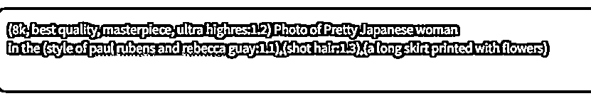

然后我们只需要像文生图一样，点击右边的生成按钮即可实现AI换装。我生成的结果是这样的。

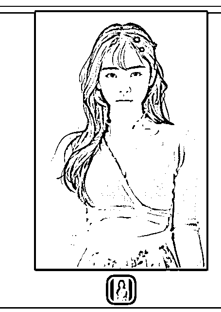

可以看到，新服装与原服装的差异还是很明显的，并且在裙摆出也生成了碎花图案。下面我们来讲讲如何提高画质

# 五、提高画质

## 5.1 提高分辨率

不知道大家是否还记得，我们在文生图的时候将分辨率设置成了512x768，这是因为如果大家的显卡不是很好，生成大图会需要很久的时间。因此我们通常的做法是先生成小图，然后再通过后期处理来提高分辨率。

首先我们要点击图片预览框下面的后期处理。

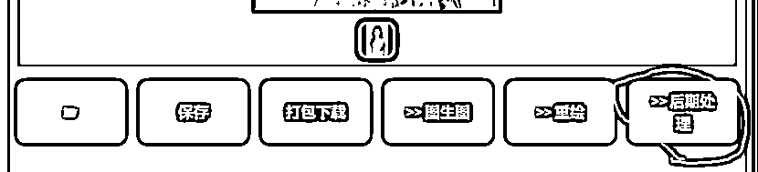

将下面的放大参数调节成我这样即可。这里我们将缩放比例设置成4，表示我们希望将图片放大4倍，upscaler1和upscaler2分别表示我们使用什么样的算法来实现放大的功能。大家也可以自行尝试各种放大算法之间的不同。设置完成后，我们点击生成就能实现图片分辨率的提升了。

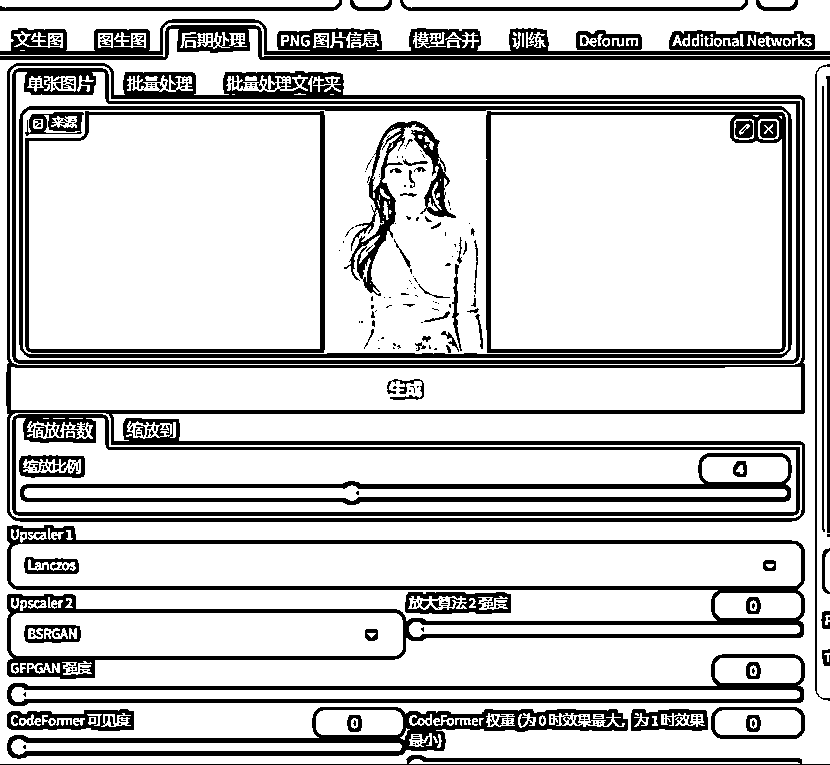

## 5.2 预览图片

高清化后的图像也会显示在右侧的预览窗口中。我们点击文件夹图标，就能打开这张高清化后的图片在文件夹中的位置。

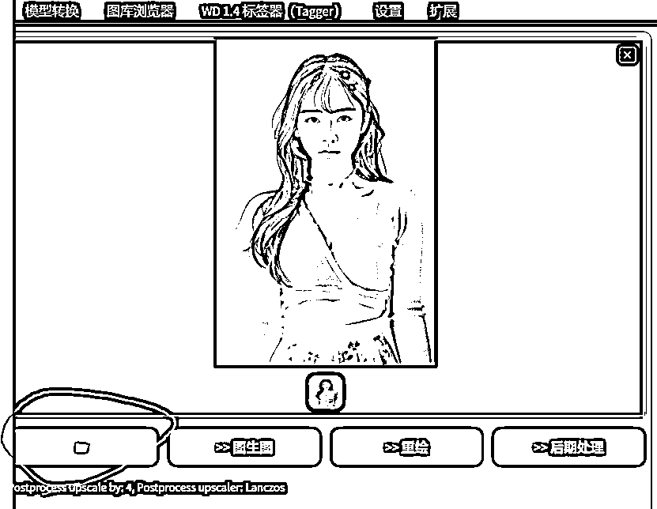

我们查看图片的属性，可以看到新生成的图片的分辨率已经变成2048x3072了。已经实现了低分辨率的图片的高清化。

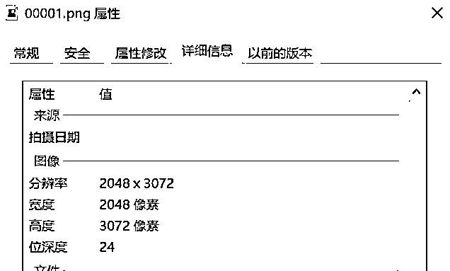

# 六、模型链接

VAE模型

链接：https://pan.baidu.com/s/1g7ydaAvW0SNNR3g71_mS3Q

提取码：ucz3

SD模型

链接：https://pan.baidu.com/s/1SKK8GGWFLNB14BBBkJBqLQ

提取码：2bot