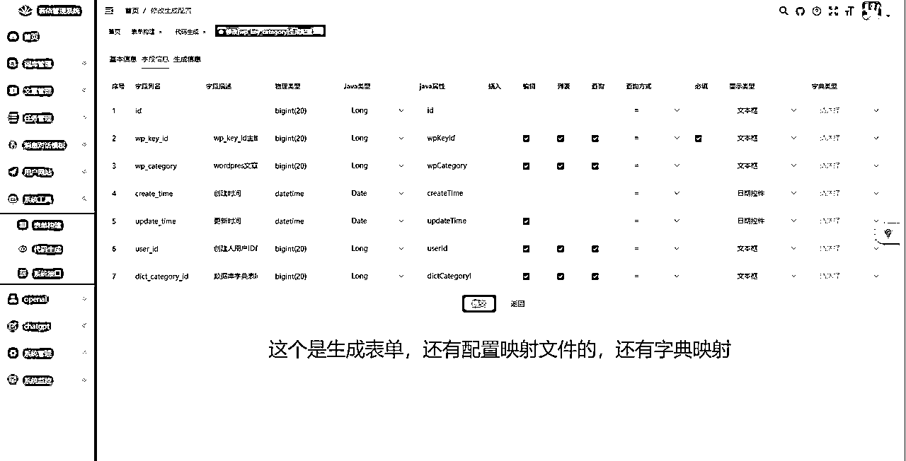

# 实战使用GPT辅助开发一款自动化程序经验分享

> 来源：[https://vchmk6v2g8.feishu.cn/docx/JZvYd2Qv0oEJsPxcmoXcb13wnsb](https://vchmk6v2g8.feishu.cn/docx/JZvYd2Qv0oEJsPxcmoXcb13wnsb)

前几个星期有点想法，立马实战，利用GPT辅助开发了一款程序，只要我给关键词，然后GPT自动写标题+自动写文章的程序+自动发布到wordpres博客，实现自动化SEO+自动发布。

程序目前可以跑，但是大部分功能还待开发，我会把这款程序源码放在本文章最后，有需要的直接拿走继续二开即可。

技术栈是Java+Vue+PHP+Wordpres，技术栈的使用选型我也会写在本文里面，有兴趣的，可以直接拿去进行学习使用。

简单做个自我介绍，我是侠狼，一名00后，在Java开发这个行业呆过两年，经验不多，望前辈勿喷，分享码字不易，免费的文章给我点点赞就好，谢谢！

搬运可耻！请勿搬运，转载请联系本人！

## 一、项目介绍

之前看到有朋友聊这个事情，然后我觉得门槛不高，就打算自己玩玩，十来天就开发好了。

为什么自己开发呢？

就是觉得就是同行卖的贵了，同行用的是GPT3.5，写一万篇文章大概是一千块钱，一毛钱一篇。

质量不太行，然后自己也不能训练，只能完全由GPT书写，质量不太行，所以就有自己写的想法了。

关于这个项目更多的思路想法，我后面会单独写一个大纲章节来介绍后续的思路，这里就先做简单介绍了，口水文太多了不太好。

## 二、技术实现与选型

### 1、技术实现

我自认为自己技术不太行，一开始想过这件事情，但是我本人并不会PHP，而且刚开始也尝试用过GPT3.5写代码，3.5写出来的代码大概率是有问题的，不能直接用，需要二次修改，只能做参考。

但是好处就是，我有了一个人工助理，我可以让他帮我去干活。

比如，我不会PHP，我直接告诉PHP我要干啥。

（我用的是别人第三方的GPT对接的4.0的，原聊天记录我清空了，找不到了，下面的仅供参考。）

同样的需求，我给4.0，4.0的答案如下

3.5的回答如下

简单可以看出来，4.0的好非常多，并不是说3.5不好，而是说，4.0更强，更准。

我本身属于一个技术小菜鸟，根本没开发过PHP也没有过wordpres相关的经验知识，然后就一直跟GPT沟通交流，慢慢的把架构搭建起来了。

PHP搭建起来后，我开始搭建部署本地环境，我这边用到了小皮面板(phpstudy_pro)，然后按照GPT教我的，我在本地运行并且安装了wordpres，本地的安装方便调试使用。

以上的部分代码是由GPT提供的，更多的还是要深度的，一直去问。

你问的越多，GPT对你的需求了解的也就越多，GPT的使用本来也就是，一直问，有问题一直改，与人交流其实也是这样的。

### 2、选定技术

一个人的精力跟经验是有限制的，我开发这款程序选的是懒人开发，用的已经搭建好的若依框架，都已经有集成好的，curd的活还有复杂的前端页面，就丢给一键生成了。

如果你还沉醉在curd重复造轮子的话，那你一定要意识到，你是可以随时被替代的，AI的出现，还有技术的迭代更新，都是如此。

然后我也没有对接过GPT我想，应该有大神开发过对接个GPT的程序吧，我照搬就好。

果然打开github，就搜到了，有很多的案例库，我只获取Java的就行，然后就找到了专门对接GPT的Java的jar。

然后就是看文档交流了，我还给这个大佬打赏了一杯奶茶钱。

毕竟，有现成的东西，给我节省了很多时间。

如果你也想开发程序，可以先去github找找看看，多半是有人已经开发过的了，切勿重复造轮子。

## 三、遇到的问题

### 1、技术问题

我这是第一次使用若依框架开发，还有第一次对接GPT，还有有两年多没写过vue代码了，经常会遇到一些错误信息。

对于部分技术不熟悉，我直接把错误问题抛给GPT，如果你的错误信息越多，GPT给你的答案也就越是准确。

比如版本前端代码启动的时候经常会提示什么版本包，不兼容，这类型问题你抛给GPTGPT会直接给你答案，而不是去百度搜索，或者谷歌搜索，毕竟我菜，英语也不好，看不懂太多英文，知识认知词汇有限。

### 网络问题

Openai的接口访问不稳定，且慢，并且还不一定能访问，所以，可以去找资料做反向代理。

这个资料我在github也找到了，有兴趣的可以自己玩玩，在这再次感谢大神们的无私奉献！

### 数据库设计问题

做项目其实设计数据库是很麻烦的一件事情，这里可以使用GPT去辅助开发，前提是需要把你的需求说清楚，越清楚越好。

比如我跟GPT聊天都是很长一段话，因为每一次都要请求GPT还是比较麻烦的，要是请求出来的东西不满意，还要GPT再改改二次修改的。

你问的越多，GPT懂的东西也就越多。

### 关于Linux问题

我本地有一个环境一直安装不起来，RabbitMQ，后来听了GPT的建议，我就装了一个VMware Workstation Pro，然后搭建了一个本地的Linux。

搭建途中也遇到一些问题，比如说，网络问题，还有Linux防火墙问题，还有安装的建议，这些GPT都是可以给出提示，比百度的好用的一批。

### 发布问题

因为标题是GPT写的，我还要自己写提示词，提示词写出来还要二次处理，这些非常的消耗时间，提示词优化也可以去问GPT的回复的。

其次就是请求限制了，要配置key池。

其次就是发布到PHP，一开始我是打算用对称加密的，请求PHP那边保证数据安全，但是因为我是真不会PHP，然后一直让GPT，写，解密加密方法都是GPT写的，但是一直有问题。

后面就换思路了，不做加密，只做了参数请求密码校验。

GPT写逻辑校验的时候是有问题的，GPT写的东西，最终还是要自己审计，参考使用，估计等4.5来了这一块就会被优化很多。

## 四、关于项目

### 1、思路

一开始是看到有同行用GPT写内容，然后发布到网站去做百度SEO，最近百度传出打击Ai内容，我这项目也就耽搁没继续写了。

目前市面上还没有支持导入训练好的对话，然后出内容的。

前面我也说过，GPT的对话是聊得越多，GPT懂的也就越多。

我们可以直接把自己训练好的一些词汇，然后做成对话记录导入给GPT设定好，然后批量请求不同的就会出现不同的结果。

比如说，我在一些圈子就经常看到，GPT训练好的关键词分享，还有思路分享。

而这些训练好的，都是可以直接拿来导入聊天记录，也就是等于别人对话了十几条，几百条训练好的，我们可以直接批量出。

### 内容编写

GPT如果同一个key请求过多，会拒绝的，在这里可以直接使用RabbitMQ，抛出异常，然后直接重新回到消息队列，做好次数校验，还是很香的。

并且，有时候，GPT请求不一定能返回结果，有时候会出错，有时候也会出现一些未知错误，比如说，余额不足了，这些都是还没做的功能。

GPT一次性返回的文本是有限制的，并且返回的东西越多也就越慢，GPT是一个字一个字的吐出来的，所以我们要等上一个访问完毕了，才进行下一个。

这个刚好也符合RabbitMQ，一条处理完毕，然后处理下一条，不需要担心数据出太多问题，这里的具体实现可以看代码部分，查询部分我都放在发MQ之前，如果你要创建一百篇文章，那么我会一次性发送一百条MQ，然后就是等MQ慢慢执行了。

### 拓展做大

因为我比较懒，没有完全做到自动化，这里如果有朋友想要开发这个机会的话，我这给个更大的思路，我的能力与时间与个人未来成长并不想继续捣鼓开发，所以有兴趣的老哥可以沿着我的代码继续去做开发。

比如说，去某些平台爬取数据，比如某乎，某书，这些平台，自动爬取高赞回答，点赞，爆款标题内容。

你投喂一个关键词后，调用相对应的爬虫搜索，然后爬取数据，然后把爬取出来的数据告诉GPT，帮我简单分解一下这些关键词元素有哪些，然后再将这些关键词重新组合投喂给GPT。

比如说，这样的，你的数据越多，投喂的内容越多，GPT写出来的东西就越是像人写的。

我目前用GPT4写出来的文章目前还没有遇到没检测出来的，只要你投喂的够多，训练的够好，效果绝对嘎嘎好。

## 五、程序源码与运行

运行需要安装RabbitMQ，如果你不知道怎么安装的话，可以参考这篇文章资料，也可以问GPT4，不建议用3.5。

RabbitMQ安装地址：https://zhuanlan.zhihu.com/p/498356616

运行还需要redis，还有Nodejs，如果你对于这些技术不了解的话，自己可以先看看若依开发文档手册。

至于设计，为什么我选择MQ，就是因为我菜，只会这个。

这款程序我放在码云了，地址是：https://gitee.com/caochanga/gpt

我给的程序数据库部分不一定全对，建议二次开发的，先自己看一下结构，并且删除一下定时任务的所有表。

至于表结构，你可以对照若依的，可以看出来那些是我创建的，那些是系统创建的。

程序如果你打算商用，或者有创业的想法，都欢迎来找我交流讨论一起赚钱。

如果你在运行这款程序的时候遇到问题，建议不要白嫖我的时间来咨询我，你可以先自己学一下。

## 六、结论

看完这篇文章，不知道你的感想有多少？

我是一个全栈(全都会一点点的)程序员，借助这些外力，我开发一款程序非常的快速，并且很轻松。

如果是没有GPT辅助，我要一个人独立开发这些程序，所需要消耗的精力无疑是大幅增加的。

如果你还没有拥抱AI的话，那么一定要记得用起来。

项目二次修改一下，再加一个支付系统就可以直接卖钱了。

目前做好了key轮训，自定义多个分组对话请求GPT还未测试。

批量写文章，写标题，写内容的都写好了，还有自动发布的定时任务也写好了。

在这个数据库里面我放了两个key，后期自己增加，建议是不低于十个120美金的。

我有开源精神，但不多，不喜勿喷谢谢！

转载请联系本人，请勿直接复制搬运，谢谢。