# “微信版知乎”，微信问一问怎么申请，现在、未来有哪些机会

> 来源：[https://riodtlbegu.feishu.cn/docx/JcEEdG3REoCSaVx079Dc8EoznXb](https://riodtlbegu.feishu.cn/docx/JcEEdG3REoCSaVx079Dc8EoznXb)

## 自我介绍：

15年高三毕业之后就一直研究微信生态内引流。

之前是自己引流做自己的项目，还有引流卖产品等。

目前准备做自媒体知识付费，还是小白一枚，希望能跟大家伙一起学习交流。

## 背景：

在2023微信公开课PRO提到，目前搜一搜月活用户达8亿。

2023年第一季度微信月活13.19亿，在如此庞大的用户体系下，任何一个入口都是流量的聚集地

比如之前的：搜一搜、看一看、游戏里面的游戏圈等等

应该还有很多小伙伴不知道，QQ里面的QQ小世界里面，流量也非常大，有朋友在里面几个账号操作

每天能引流一百多个精准粉丝。

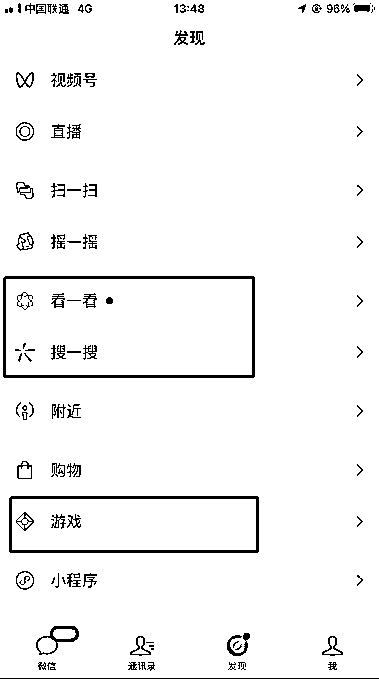

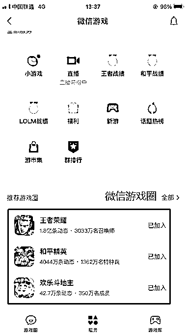

## 一、什么是问一问

2023年3月28日晚间，2023微信公开课PRO・微信之约直播开讲说到:微信“搜一搜”团队推出了一个新的功能——“问一问”

据官方回答：在首页，用户可以看到我们为你推荐的优质有趣的问答。在浏览别人回答的过程中，欢迎你对感兴趣的问题也发表自己的看法、分享自己的经验。你还可以直接进入问题广场，直接找到自己感兴趣的问题进行回答。优质的答案，除了在问一问首页被推荐，还会在用户搜索相关问题时进行展现，帮助更多人解答问题。

目前问一问仅支持视频号账号登录，没有视频号的创建一个账户登录即可开通。

目前回答问一问的问题可以通过文字、图片、视频号中传的视频来回答问题，也可以通过文字+视频号中的视频，暂时不支持图片+视频的形式

微信问一问跟微信搜一搜都是搜索流量，搜索流量又是最精准的流量，所以大家可以试着在问一问提前布局，以便未来吃肉。

## 二、为什么要推出问一问

为什么微信要推出这样的一个功能，它能带来什么样子的改变

1、微信要加强公众号与粉丝之间的互动，虽然之前公众号可以推送内容给粉丝，但是公众号主不容易了解到粉丝真正喜爱什么内容，所以“问一问”功能就来了，让公众号主向粉丝提问，真正了解粉丝的需求和反馈，优化自己的内容。

2、对于任何一款社交媒体来说，真正了解粉丝的需求和喜爱是很有必要的，问答数据可以帮助产品团队更准确的把握用户的需求，进一步优化产品服务。

3、随着越来越多的社交媒体的产生，并试图从微信体系中夺取用户，为了保持领先地位，微信需要不断优化自己的产品，不断提高用户体验，才能保持和增长市场占有率。

## 三、为什么要做问一问：

### 1.用户多

搜一搜月活量高达八亿，随着问一问产品的迭代更新，新产品的日活和热度会越来越高，是微信生态连接新流量的重要机会。

### 2.搜索权重高

有的关键词的搜索页面问一问排在最前面，比公众号文章和视频号和小程序都要高。

如果有做微信生态引流的人，应该知道这个意味着什么。

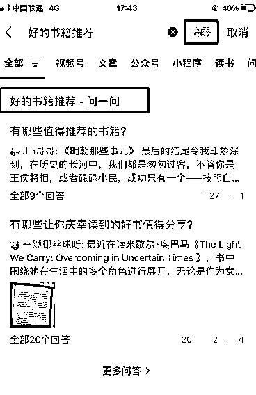

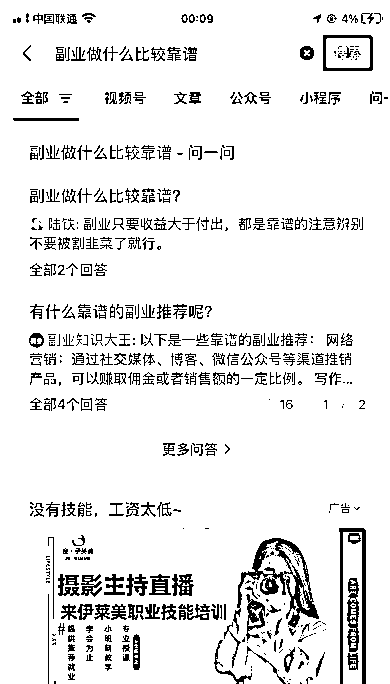

### 3.站内引流：

问一问就是微信生态里面的一个产品，全部都在微信生态内引流，问一问连接视频号，视频号链接公众号和企业微信!不用夸平台，都是在官方允许的规则下进行没有像别的平台封号、限流等站外引流的问题，不过注意的是，问一问肯定也有自己的一套规则，我们还是要基于官方的规则下进行营销。

总是，问一问对做私域的人是一个重大利好。

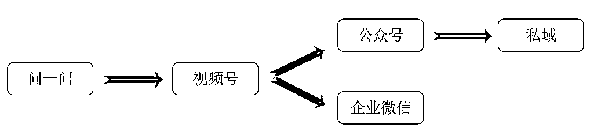

## 四、申请问一问资格：

### 1、有问一问入口

目前很多人都没有看到问一问的入口，可以通过微信搜一搜，随便搜索一个问题，导航栏往右划，就能看到问一问了，随便点击一个问题，点击写回答，按照步骤走就可以申请问一问资格的，这个前几个月是内测的，现在都放开了。第一次申请通过之后，每次打开发现页点击搜一搜，就能看到问一问的入口。

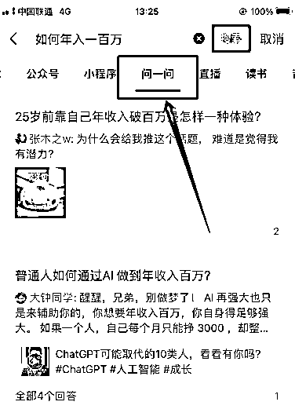

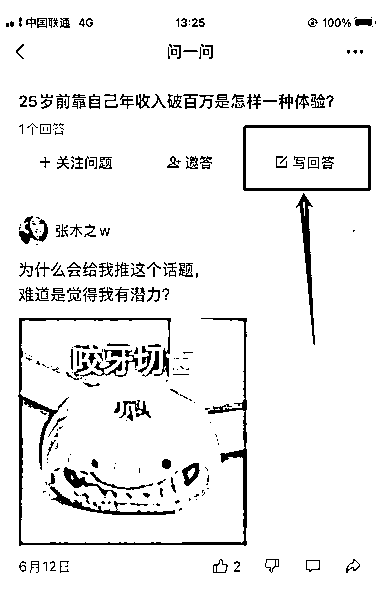

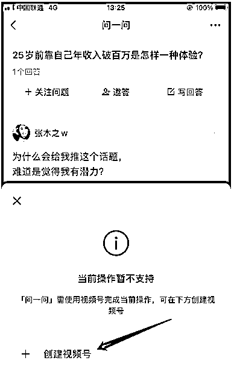

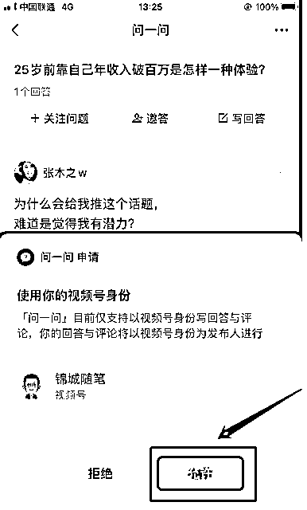

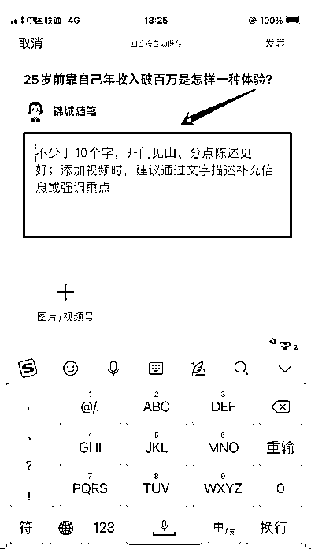

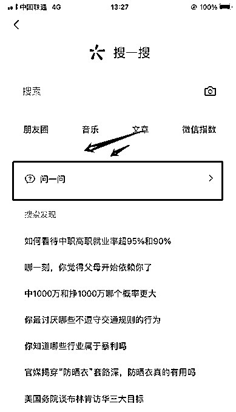

### 2、没有问一问入口

还有一种情况是搜一搜右滑，发现没有问一问入口，这种情况也很简单，直接更新微信版本就可以看到了！问一问的基本数据，包括提出的问题，回答的问题，答案的曝光量、点赞数量等等，都可以在右上角点击这个小人查看！

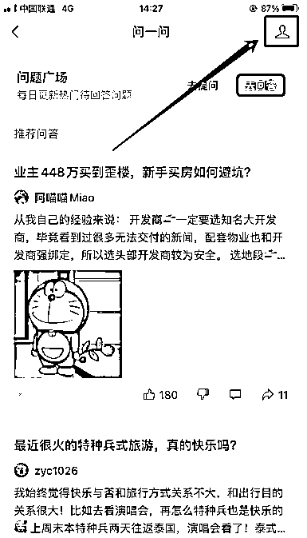

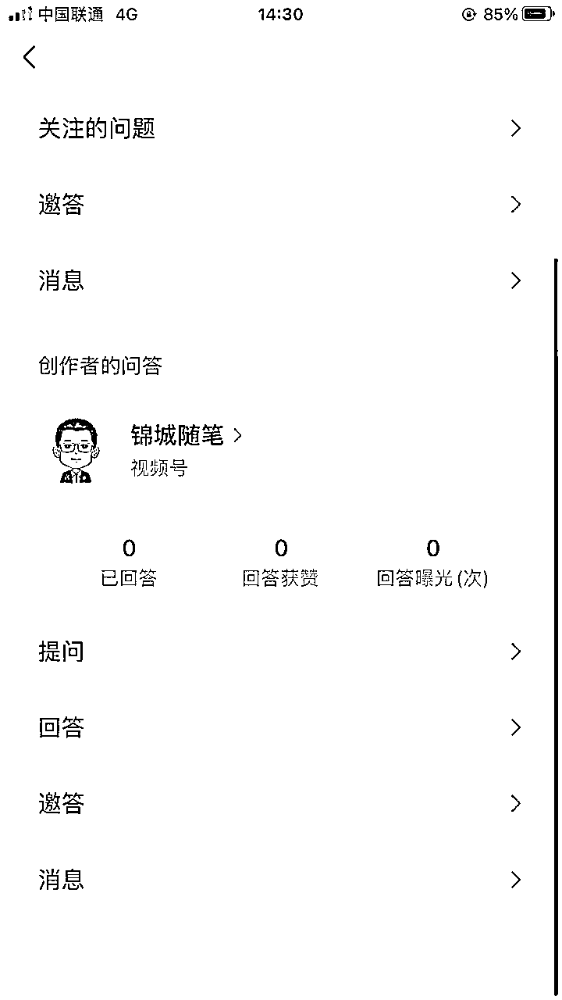

## 五、问题的排名机制

目前来看是点赞，评论，分享量越高，问题的排名就越前面！

不过我观察了很多问题，几乎都是这样的！估计未来可能会还有别的规则的！评论占比，点赞赞比，创作等级等等。

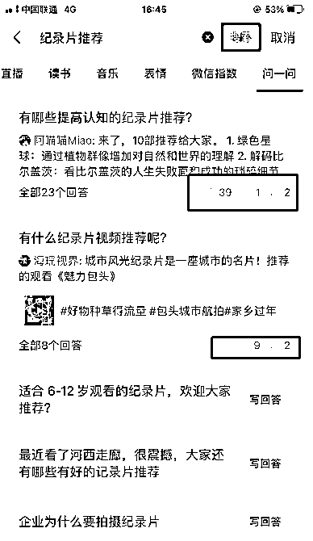

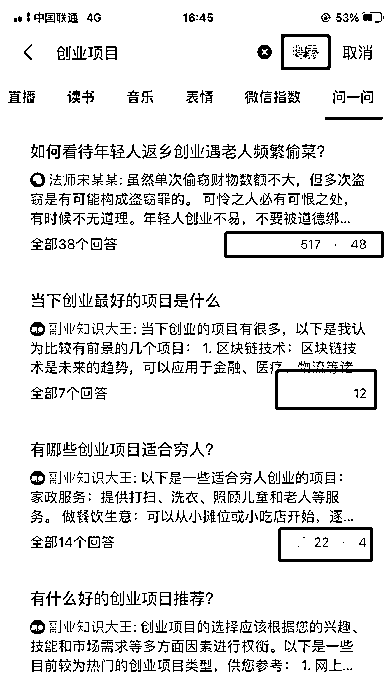

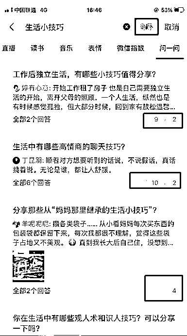

## 六、目前有哪些机会

### 1.自问自答

现在的问一问有很多领域的问题可以说是空白，缺少很多问题，我们可以做的就是在自己的领域找几个账号自 己提问，回答也可以使用Chatgpt回答，目前据朋友反馈说现在用Chatgpt回答暂时没有问题，个人推测未来如果是用AI写的答案，未来会被提示。

据官方介绍，高质量的回答的会在首页获得更多的曝光，回答的内容支持用户点赞，转发。同时也可以为视频号带来流量，是一个吸引粉丝的新渠道。

尽量还是要写优质的内容，避免被系统识别搬运，AI创作等等。

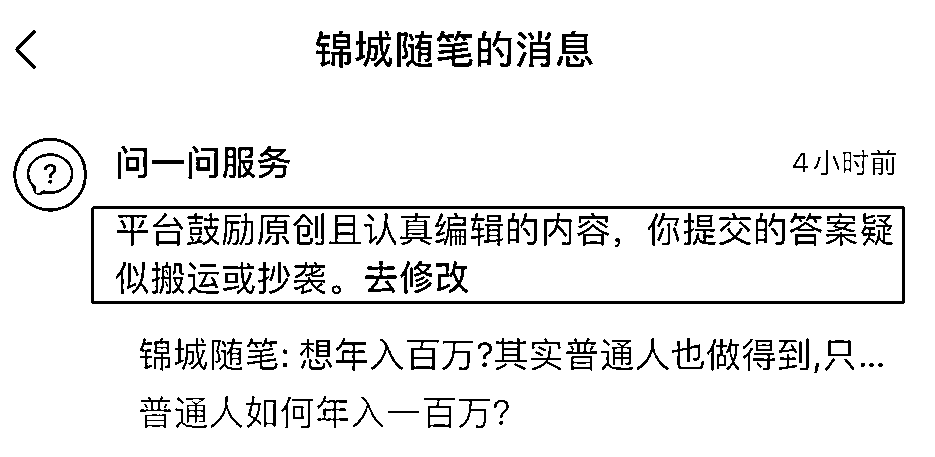

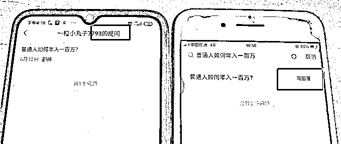

### 2.评论区引流、截流

把视频昵称和头像改成自己领域相关的，在去领域下的热门答案下面留言，不过要注意的是，目前回答也可以被投诉，不知道这个严格不严格。也有刷到过直接留公众号名称的，不知道后期会不会被删除等等，目前刚出来的可能不是很严格，后面可能会被清理。

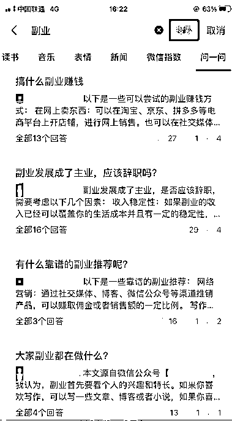

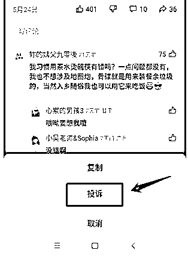

### 3.高质量回答

高质量的回答永远可以吸引用户，可以提前布局高质量的回答，根据知乎来看，高质量的回答都排在前面，我们可以提前发布带有领域关键词的问题，在发布高质量的回答。

目前问题数量和回答数量都比较少，可以提前做好布局，建议矩阵化操作，好的问题可以给视频号倒流，视频号可以关联公众号，也可以关联企业微信。所以，问一问也链接着微信生态，可能是未来很大的流量入口。

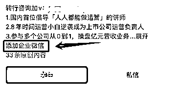

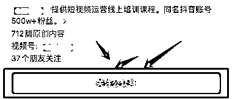

### 4.视频号橱窗带货

微信问一问跟知乎好物有一些不同，知乎好物是直接在回答的内容里面插入好物链接，用户点击链接下单获得佣金，微信问一问是回答相关领域的内容，引导用户到视频号橱窗下单。

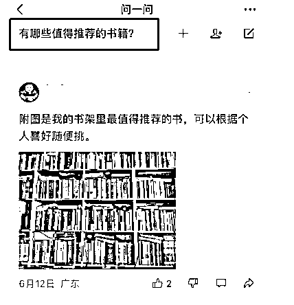

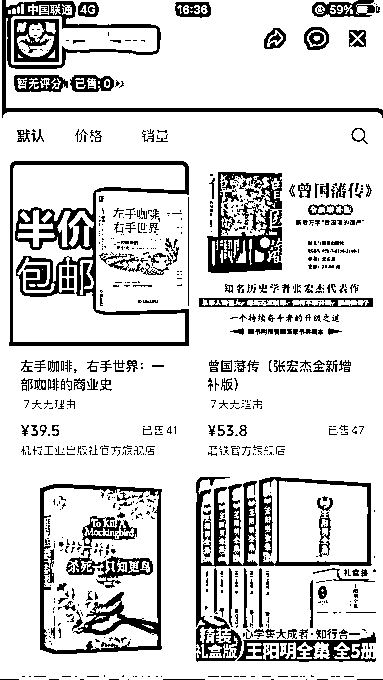

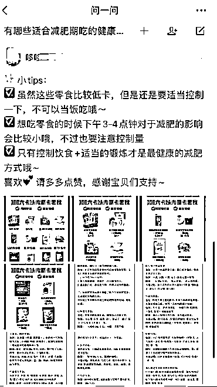

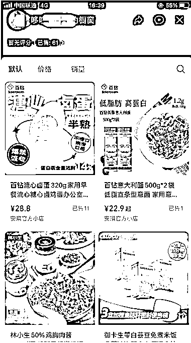

### 5.提前布局热点：

那些在搜一搜或者小红书每年布局的热点，都可以在问一问再来一次！比如每年的考试、节日、或者某天又有某个明星塌房了，或者近期又有什么超级大瓜等等，都可以在问一问里面布局。

比如最近高考刚考完，有很多细分的小众利润又大的领域，比如出国留学。

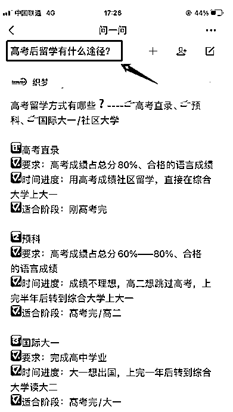

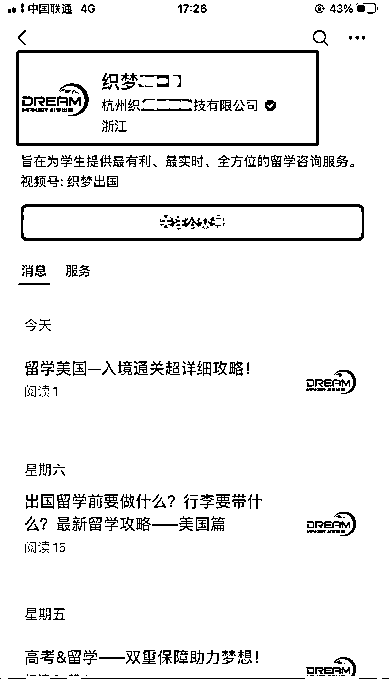

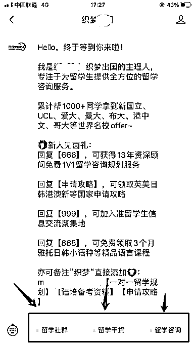

## 六、未来可能有哪些机会

微信问一问可以说是微信版的知乎，微信版的悟空问答，知乎有的商业模式可能问一问可能也会有，比如付费提问，好物推荐，专栏，甚至付费推广等等。

### 1.回答的问题或者问题可能会被百度收录

跟公众号文章一样，微信问一问的回答内容可能会被百度收录，尽量提前做好SEO优化，提前布局好自己领域的关键词，长尾关键词，包括问题和答案都需要做好优化！

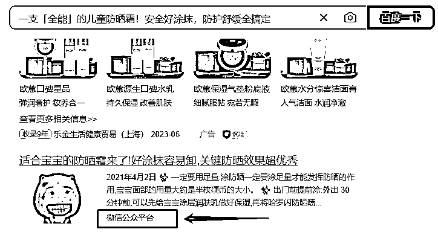

### 2.可能会有创作等级产生

可能问一问也会有创作者等级的产生，会有一些细分领域的标签。目前问题的标签还不是很多，也不是非常的细致，我们可以提前布局好我们自己相关领域的问题，如果后面这些领域在不断的细分或者增加，可能我们提前布局的问题和答案就可以有比较好的曝光。

### 3.越来越完善的机制

因为是新产品，所以很多机制还不是非常完善，随着产品的迭代升级，会越来越完善，跟知乎一样，趋向于商业化。也可以对标微信搜一搜，去年11月份搜一搜广告也上线了，也诞生了一些的机会！

### 4.趋向于商业化

知乎的商业化为用户和平台带来更多的机会

不仅为知识分享者提供了更多的机遇，也为广告主和品牌方带来了更多的营销资源，成为链接品牌和用户的一道桥梁。

### 5.可以尝试本地流量

根据我之前做搜一搜的经验来看，微信问一问完全可以拿来做本地流量，不过要提前布局，现在正是提前布局的好时候。本地生活业务包括本地通下水道，本地开锁，本地维修电器等等。

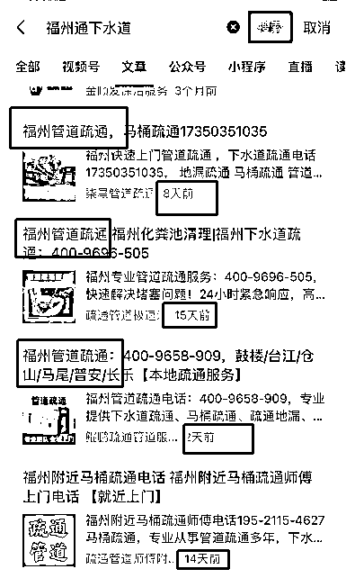

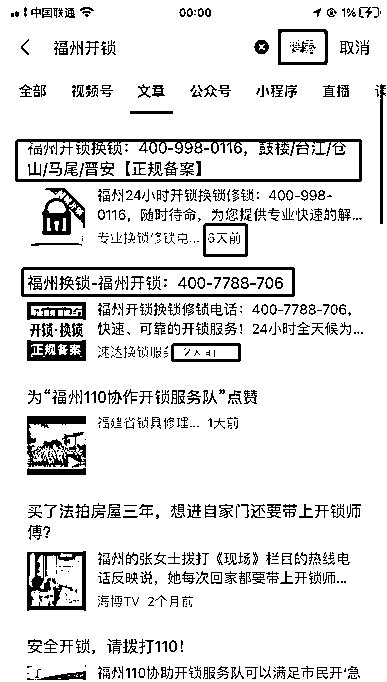

### 6.流量新入口，创作者的新平台

其实现在已经是一个新的入口了，也已经涌入了很多新的创作者

不过这跟微信的体量比起来，真的是太少了

可能会跟悟空问答、百度问答一样，前期可能会有问答的奖励等，以便吸引更多的创作者进入

## 总结：

一个新的平台，一个新的流量入口都可能是一个机会，每个人都值得去尝试一下

优质的内容可以吸引用户，尽量写一些优质的内容

我也看到很多人从知乎复制答案到问一问，尽量避免这种情况

不过微信问一问是否能成为下一个知乎

谁也不知道，我们现在能做的就是尽量布局自己的领域关键

等待流量的爆发，毕竟谁也不想错过精准的搜索流量!

我也在公众号文章看到有人现在已经开始做微信问一问的培训了

个人觉得完全没有必要，自己多琢磨，多实践，完全就可以掌握了

好的问题+好的回答+多账号操作=流量

