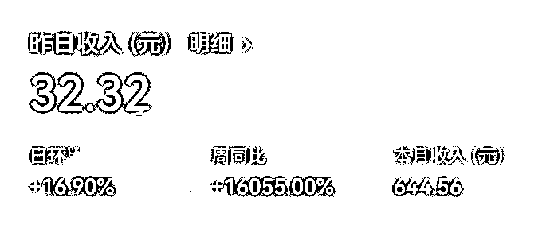
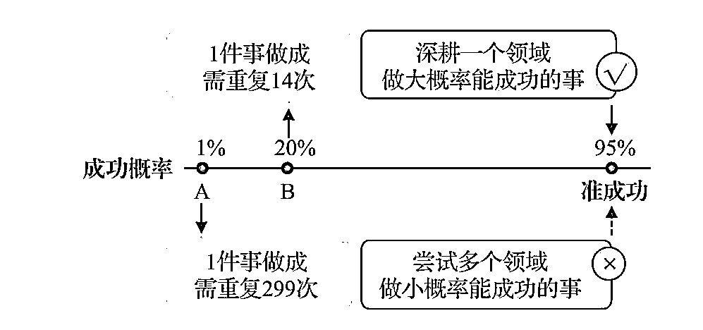

# 原因很少在结果附近——写在航海续航前

> 来源：[https://vr05r707r7.feishu.cn/docx/K4KJdAFyHokbEvxc9yXcf1STn1c](https://vr05r707r7.feishu.cn/docx/K4KJdAFyHokbEvxc9yXcf1STn1c)

原因很少在结果附近，结果=行为*概率——写在航海续航前

大家好，我是Cris，作为生财新人，今天分享下，该如何快速的把手弄脏？

先说航海成绩，参加公众号爆文写作，在航海马上结束的时候，一个号入池了，截止到6月15号累计收益600+，和那些日入三位数甚至4位数的大佬没法比，也没达到赚回门票的目标，但是在预料之内，为什么预料之内呢，接着往下看就知道了。

作为第七期的生财新人，也是一名产品经理，刚一进来的时候，那叫一个兴奋呀，被这里的帖子喂的消化不良了，心里想：”哇塞，这也可以呀。“”这个不错，好像可以试试“，”这个也不错，我好像也行。“

刷了半个月多帖子，发现自己不兴奋了，看到很多人新人都有了正反馈，反而开始焦虑了。

焦虑的本质是什么呢？就是自己想得到的，但是却没那能力，或者不行动。

于是我冷静了一下，再次打开了进入星球第一天看到的那本名叫《亦仁益语》的pdf，我一直相信，向拿到结果的人学习肯定没错。

里面的这句话触达了我，“弱化教程，实战下场。”成年人的世界，哪有既要又要，再详细的教程，也要自己实操，你不可能走上和别人一样的路，你的经历、环境、思维、甚至设备、时间都和别人不一样。

所以，赶紧把手弄脏，下场干就完了，知道航海马上就来了，接下来我是这么做的。

首先，看着航海的项目，选出一个最合适自己的，为什么是一个呢？我的原则是，首先我知道最近工作确实很忙，进入了一个比较大的项目组，经常加班到10点多，会投入很多精力，所以只上一条船，因为工作肯定是不能耽误的，主次必须分清楚；

所以就选择了公众号爆文，至于为什么选公众号爆文呢？因为我自己也日更公众号一年多，对于公众号相关的内容和流程算是比较了解了，这样就能更好的驾驭这条船。从自己擅长和合适的方向出发，会减少很多阻力，也容易拿到正反馈。

但是，我最后选了两个，是公众号爆文和ChatGPT+自媒体，大家能看出来，其实这两个项目正好可以合在一起搞，工欲善其事，必先利其器，不得不说，ChatGPT真香！

毕竟，其实每一个项目并不简单，都是需要付出精力和坚持的，并不是轻轻松松就能拿到结果的。你在这个生财有术的圈子里看到别人分享的成功，可以理解成幸存者偏差，因为分享的人90%以上是拿到正反馈的，会让你产生一种只要下场就有收获的错觉。

我不了解星球有没有这个统计，项目失败和成功的人次统计，盲猜一波，应该是失败远多于成功的，所以在开始之前，认真评估，找到适合自己擅长的或者是真正热爱的，是非常重要的。

毕竟副业这个东西就是要有差异化，建立起强大的护城河，为别人提供更多的价值，成功的概率更大。

接下来就简单分享下作为新人，第一次参加航海的心得和收获吧，希望能给需要的人带来一些帮助。

### 1、失败找自己的原因，成功找外界的原因

我自己开了两个号，其中一个一周多就入池了，当时我心想，原来这玩意还真的这么简单，但是过了5天，掉出来了，到现在还没重新进入。

另外一个号坚持了32天才入池，也就是上面截图的，每天几十到100多的收益不等。

那我这算是一半成功，一半失败了?

很多人总喜欢把成绩归于自身能力突出，甚至包括我自己，但是这次航海的经历给我上了一课，你突然没流量了，那为什么人家还有流量呢？你突然有流量了，原来别人也有，那是不是因为运气刚好，踩中了某个热点呢？

所以你看，无论环境好与不好，都有人依旧能够写出爆款文章，也有人持续的拿到收益。

其实，竞争对手太过凶残，我们无法改变；大家面对的环境也一样，没法改变。

所以，就拿公众号爆文的项目来说，如果你没有流量，反思下按照手册像素级操作了吗？搭建素材库了吗？每天原创还是洗稿？每天发满8篇了吗？如果没有，先试试看。

所以你还不错，拿到了流量，也别自满，总结经验，找到真正的原因是什么？把这个原因复制到每一篇文章里，才能获得持续的成功。

### 2、原因通常不在结果附近

举个前几天星球讨论的例子，985难还是赚100万难，今天不说谁难，就说无论你考上985还是赚100万，是因为你考上或者赚到那一刻的原因吗？

答案是否定的。

考985，可能是你天资聪慧，少不了十年的寒窗苦读；赚100万，可能你选对了一条路，但也少不了你的决策和持续的坚持。

所以，你现在做的事，运气好可能过几天就看到结果了，也可能是1个月，3个月，1年，甚至5年。

所以，你看到别人写公众号日入四位数，但你看到他们在这个之前做了哪些事情吗？

所以，要正确的学会归因，不要忽略了成功要走过漫长的那条路。

### 3、简单点，别搞的太复杂

刘润老师说过这一句话，”一切商业的本质，都是消费者获益，而赚钱从来不是商业的起点，而是终点“。

换句话说，极致的利他就是利己，生财不正是这样一个社区嘛？一直在极致的利他。

所以，把复杂的事情简单化，找到真正的本质。

就拿公众号爆文来说，本质就是为读者提供情绪价值和认知价值，可能更大的情绪价值。

作为一名产品经理，我时刻思考一个问题，为什么客户需要这款产品，客户为什么现在买这款产品，客户为什么买我们的产品？

所以，换个思路想一下，不要想着如何获取阅读量，而是要思考如何为读者提供价值，读者爱看什么，读者为什么要在这个时候看，读者为什么看你的文章，搞清楚这三个问题，就知道我们的文章应该怎么做才能更好了，改善之后，阅读量自然就上去了。

### 4、正确的事情反复做

先来看个图，从这个图里，各位有什么想法呢？

第一点，如果一件事的成功概率是20%，那你做14次，成功的概率就能到95%。那么问题来了，如果这个号没能入池，那你再开一个号，还不成功，再开一个，直到第14个，看看结果如何？

第二点，按照概率的话，无论多少次，也不会达到100%的成功，但是只要这件事有成功的概率，重复做，坚持做，成功是早晚的事！

### 5、分清主次，懂得精力分配

你看到的是别人月入几万，但你知道ta每天投入的时间是多少吗？你知道ta是全职搞这个，还是每天原因下班之后投入几个小时熬夜肝呢？

这一个多月，我经常问自己这几个问题，第一个是每天投入的时间是多少？第二个是有没有认真研究航海手册和高手分享？第三个有没有定期复盘？

这三个问题，就能回答我开篇所说的了，为什么只赚了几百块，还在预期之内呢？

因为我投入的精力确实不够多。

这里我也有自己的看法，也不知道对不对，如果你在工作里，受到领导信任、做着有挑战也有成长的事情、也有好的前景，那我觉得应该还是以主业为主，不要本末倒置。

如果你在工作中做着不喜欢的事情、经常被pua，一眼望去看不到希望，那不妨在副业上多花些心思，学学生财高手搞搞钱，何尝不是一条通往罗马的道路。

### 6、相信时间的力量

我非常喜欢的一句话，五、六月份做的事，九、十月份自有答案。

当然这里就是个比喻，和亦仁大大说的类似，“正如我们往往高估了一年生财有术带来的价值，又大大低估了三年生财有术带来的价值。”

我们这一生，其实看的是永恒的耐力和终身学习的渴望，并非是一时爆发力。

航海续航不也是这个目的嘛，不让大家躺平，接着把自己“卷”起来，持续行动，做一个长期主义者。

### 说在最后

搞钱这件事，最慢的步伐不是跬步，而是徘徊；最快的脚步不是冲刺，而是坚持。

只要我们能够“会跟”，坚持做正确的事情，上天不帮你，概率也会帮你的。

最后祝大家，一起生财有术！