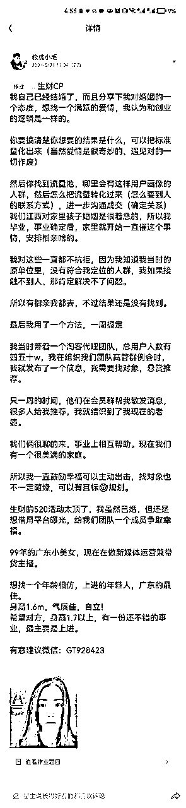

# 如何利用好生财有术找对自己另一半

> 来源：[https://fcf4a0devm.feishu.cn/docx/KBlWdtwzOo1B2hxB11BcXoeGnJc](https://fcf4a0devm.feishu.cn/docx/KBlWdtwzOo1B2hxB11BcXoeGnJc)

大家好，我是小毛

一个90后，自媒体公司小老板，《小毛聊创业》主理人。

之前写文都是项目、创业认知相关的分享文，所以用的这些title

~but

今天的主题，请忘记掉这些，我重新给一个title,再来一遍介绍

大家好，我是小毛

一个23岁恋爱，24岁结婚，25岁生有第一小孩，26岁生有第二个小孩（三年抱俩）的幸福男人。

今年我29岁，另一半和我一起经营着当下的公司，是我事业上的得力助手，如果只是用本金和欲望的公式来计算，对于欲望值不高，满足现在小日子的我们来说，在某种程度上，也属于财富自由了。

昨两天，520，生财有个发对象的活动，我也打卡参加了，写下了一段我对于找对象的一种观点，同时也借助平台，为我团队的小姑娘广告了一波，之后还挺多人加她的。

看到这情形，我这“月老”的第二人格已经按捺不住了，想马上分享一篇“交友观点文”，鼓励大家积极交友。

接下来，我会从以下几个点展开分享（比写项目文，激动多了）

1.找对对象抵得过3次创业成功

2.为什么说建议利用一个赚钱圈子找对象

3.如何有计划的实现

以下正文

# 一、找对对象抵得过3次创业成功

我认为最靠谱的创业项目，就是找到一个合适的对象，我们能在普通创业这个事情上花费无数个日日夜夜，为什么要在“婚姻”这个创业项目上，草草了事呢？

我从两个方面来论证下我这个观点：

## 首先我们先思考，我们创业的目的是什么，一般来说，分为两种：

第一种：是为了最大程度去获取经济效益，让自己物质生活得到更大的满足

第二种：说起来更“高尚”些，是为了获得成就感，满足感，也是我们常说的“渴望伟大”，我们可以把称为获取一种情绪价值。

## 而找到一个好的对象，有一份满意的婚姻，在一定程度上，可以很好的实现以上两种目的

### 1.经济效益上

如果对方家庭，经济条件好，那么资产直接翻番，直接起步高一个台阶（这并不是在宣扬不正的价值观，也不是喊你去傍大款哈，一切内容基于在有感情的基础上）

举例一个现状：

有人说一个单身网红，事业再上一个台阶最好的方式之一，就是找一个粉丝量相当的网红做另一半。

当然还有第二种情况，对方经济条件并不好，但是一个好的对象，可以和你相互扶持，给你出谋划策，最不济也能鼓励鞭策你。不是有那么一句老话嘛：好女人 旺三代。

我自己的情况，就是这种，我们双方的家庭都一般，但是三观一致，也是愿意努力奋进，她做了我的贤内助，在事业上也提供了很多帮助。

2016年，华盛顿大学的研究人员做过一项调查，他们分析了数千对伴侣的个性特质对工作表现的影响,性格数据涵盖五个方面:外向性、宜人性、尽责性、情绪稳定性和开放性。研究人员发现:伴侣特质中唯一对工作表现有重大影响的是责任心。无论性别为何,伴侣责任心越强,你的收入越高、晋升可能性越大、工作满意度越高。

### 2.情绪效益上

人生这么长，能把一份事业做到底的人很少，但是这个漫漫人生路，有一件是你要用大半生去践行的，那就是和你的另一半好好相处。

按照时间长度来算，绝大多数人的一生，让你情绪受影响最大的应该就是你的另一半。

在电影《万箭穿心》中，丈夫马学武是个性格懦弱的知识分子，而妻子李宝莉却是个生性火辣的市井妇女，电影开始，马学武是个单位干部，而且还刚升职，从事业角度来说算是成功了。但是每次回家就接受家庭压抑的气氛，最后走向出轨离婚，事情闹大后，下岗跳桥自杀。

这里，观众对男女谁对谁错上面存在有争议点，但是对于这种压抑的家庭氛围，糟心的情绪，都一致认同太过难熬。这样的人生，一定是走向悲剧。

所以不管从哪个角度来讲，找对伴侣绝对都抵得上创业成功。

# 二、为什么说建议利用一个赚钱圈子找对象

如果我们把找对象，比喻成做项目。（事实也确实有共同点）

那你首先你要确定你的目标群体是谁，有什么特征，把他的用户画像描绘出来

第二你要思考汇集这些目标群体的流量池在哪

## 根据这两点来分析

### 1.用户画像

每个人对另一半的样貌、家庭条件、知识背景要求会不尽相同。

但是对于绝大多数人来说，我觉得对另一半的要求普遍都会涵盖几点：聊得来、看对眼、同频共振。

而同处在一个付费圈子里，最起码应该是有几个共通点的，比如：渴望上进、愿意为价值买单、有一定的共同话题

我自己的另一伴也是当时同做一个项目时认识的，我们有共同的话题，一样的奋斗方向，所以很快就确立关系了。

我在朋友圈也发现，生财，好像也已经成就了好几对圈友。

生活中，对另一半很尴尬的一个点：你的圈子我融不进

那在这找的就不担心这个问题了，对外说起来都是：我们是一个圈子里认识的。

### 2.流量池

知乎上面曾经有过这样一个问题：人这一辈子会认识多少人

有回答从幼儿园算起到工作生活，全部算起来2000以内。

这个答案也受到比较多人的认同

那也就是说，如果我们单纯靠线下，靠缘分去在有交集的人中，找到合适的另一半，其实这个流量池是很小的。

现在自媒体时代，诞生了很多交友网站，其实也正是解决了这个“流量池”的问题

而生财作为一个拥有4w人的大流量池，关键官方还提供了一个自我展示的入口，我看生财公众号都还推了一波，这数以万计的免费流量曝光，那我想真不应该错过。

# 三、如何有计划的实现

用户画像明确，流量池也找到了。

那营销转化，自然得自主跟上。

因为江西的普遍对结婚比较着急，我们家那一块基本毕业工作后，父母就是开始不停地催促找对象的事，我自己对这事的想法也是大大方方的，既然决定要找，那就主动找。

父母安排的相亲去，场场不落。

没有满意的，就发动自身资源找，所以也不怕大家笑话，我的另一半确实是散发征婚帖找到的。

当时的我做着社交淘客，也是几十万人的团队长，就发动了团队的力量帮我找，只一个星期，就通过介绍结识了我现在的另一半。

我觉得既然是内心想要达到的结果，那就在可行范围内尽量去做，我到现在依旧感谢当初那个放荡不羁的自己。

说回执行，我觉得有几个方式：

### 1.利用航海自我介绍环节曝光

大家都知道在参加航海时，有一个自我介绍环节，一般介绍大家都会把现状和过往履历写进去，这个时候我们在介绍中多加一句，把自己单身的现状加入进去。

一个航海群400人，一次参加2场，一年参加24场，那曝光数就是400*24=9600人次

说不定其中就有对你感兴趣的。

## 2.利用发贴

在生财发帖一般发的都是成功经验，搞钱认知等，一篇好的帖子，其实也能够看出来一个人做事的态度，每篇帖子我们好好写，多写。

那在帖子的开头，或者结尾依旧可以插入自己单身的现状。

妥妥的软文植入。要是被评精华帖，你这个软文广告的曝光，那可就更高了。

### 3.利用线下

每个同城圈友会，龙珠见面会，年度大会，有条件都参加，本身就是学习交流嘛，参加都受益匪浅。

在此还能面对面看到很多人，长相这关就好把控了，不得不承认，很多人都是颜控，线下看到对眼的，圈友交流的名义，去加个好友，没有人会拒绝。

有了联系方式，后面慢慢了解。

### 4.官方组织的交友一定参加

520 七夕这种官方会组织的交友活动，那自然是更不能错过了，能够获得官方的流量曝光，好好地把自己的情况展示出去，挑出最好看的那张照片。

这可是最最精准的流量，没有之一。

分享到这就结束了，也不知道会不会被人吐槽，有点扯。但是发心是好的。

最后送大家两句话：

一生之重不过饱餐与被爱

一生所求不过温暖与良人

祝各位单身圈友，有情人终成眷属！