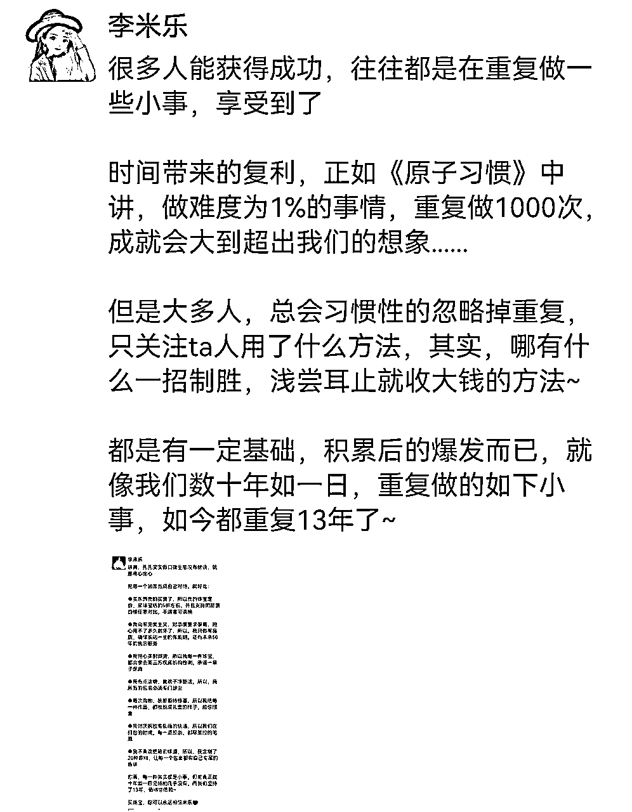
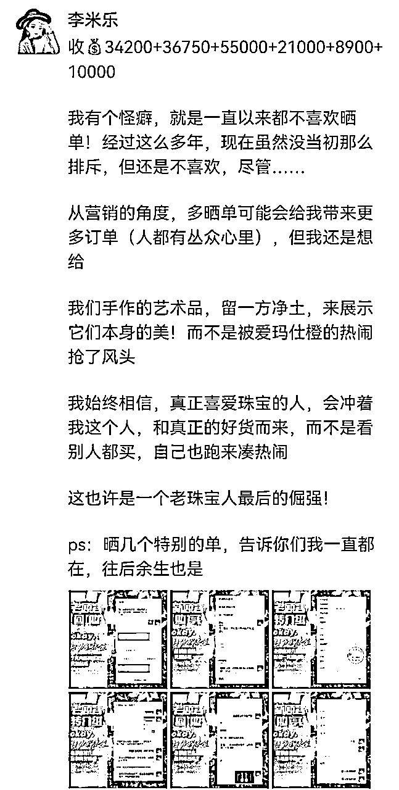

# 珠宝高客单，如何打造好私域，静默成交高客单产品

> 来源：[https://n28vbku1px.feishu.cn/docx/KX97dT9bGoffn2xVdEucHeiYnaf](https://n28vbku1px.feishu.cn/docx/KX97dT9bGoffn2xVdEucHeiYnaf)

大家好，见贴欢喜，我是李米乐，扎根珠宝领域13年，副业个人IP孵化服务。从疑惑做私域能不能变现，到只会写装逼文案，乱发，到信手拈来；从最初朋友圈0成交，到断断续续成交费劲，到客户主动打钱，转介绍，并且积累了一帮老客户，经历了从新手期，到成长期，到放大期三个阶段，算是成功跑出来了。

我知道有很多人做公域很历害，但却没有做私域，几万甚至几十万的粉丝承接不住，不懂如何在私域变现，就只能不断做流量来缓解焦虑。也有人还在纠结，担心朋友圈没人看，想发圈又怕被亲友同事说，以及朋友圈没东西发，或者发的多却成交不理想等等。

也有很多朋友看了我上一篇的贴子珠宝高客单，从小红书引流到私域，300粉变现20w+我做对了什么，跑来问我如何做好私域。当你想做，却一直没行动；当你纠结迷茫的时候；很多人靠私域年入七位八位数，所以，不是不朋友圈没人看，而是你的朋友圈没人看，不是朋友圈不变现，而是你方法没用对。其实，很多人天赋很好，如果不赚多点钱，真的就很可惜。

为此，我结合朋友圈属性，朋友圈成交的底层逻辑，以及打造私域方法论，复盘我做私域的全套打法，也适合新人做私域，承接流量，提升复购和转化率，目录如下：

一，为什么要做私域

二，朋友圈成交的底层逻辑

三，产品规划

四，朋友圈打造

五，朋友圈文案撰写

六，朋友圈静默成交

七，私域打造的核心

八，不断验证，优化，迭代

一，为什么要做私域

朋友圈可以说是我们的根据地，流量只有留存到自己的地盘，才能挖掘客户的终身价值。我们开厂初期，都是走线下传统销售模式，2013年微商萌芽阶段，也没太敢尝试，怕珠宝这样的高客单，在线上缺少信任基础，不好做；

到后来微商野蛮发展期，朋友圈刷屏炫富晒单，这对于审美高要求，有精神洁癖的我们来说，打心底里看不上。直到越来越多的老客户问说，能不能微信交易，方便一点，我们才被动开始发圈。

那时候发圈写文案，还不懂用「用户思维」，纯属自嗨，也不懂现在自媒体这种口语表达方式，文案完全是飙文采，俗称装逼文案，真的没眼看，但就是这样的文案，慢慢帮我们积累了一批忠实老客户，也正是这批老客户不断复购，转介绍，新客户再复购，转介绍，让我们在口罩期活了下来。

所以，不要担心你写的不好，只要你敢写，就有人敢看，只要你坚持发，就一定能吸引到同频的人靠近你，进而向你付费。

现在回头看，我们很庆幸当时抓住了机会，及时做了私域，并且一直在这条路上深耕，才能在口罩三年活下来，并且还略有增涨。咱们普通人无论是创业还是副业，大多数爆发都是被机会选择的结果，做好私域，让你的每一个流量都变成留量，沉淀在你的朋友圈，挖掘用户终身价值，是我们普通人离钱最近的地方。

二，做私域的底层逻辑

微信的属性是社交，而朋友圈就相当于是我们的微公司，是我们普通人离钱最近的地方，你是自己的CEO，你只要经营管理好自己的微公司，把你自己先卖出去(具体我们后面说)，用户才会买你的产品，你的微公司就能持续盈利，拥有一台提款机。要做到其实不难，学习，实践，总结，优化，迭代，就能出结果。

第1，没有所谓真正的秘笈

这个世上，没有学了就可以立即改变命运的方法/课程，但凡一项硬本领，都需要持续不断习得，研究表明，在学习一种全新技能的时候，至少要重复训练144次，才有可能将这种技能，融入到长期记忆里，当你经过长时间专注练习，大脑会改变原先的结构，形成自动化反应，就能信手拈来。

这就好比你学开车，学做饭，新手通常是手脚忙乱的，而老手，下一步要做什么再做什么，都是下意识的自动化反应，根本不需要去想，一切行云流水。

所以，千万别被一些噱头吸引，盲目追随，东学一榔头，西学一棒槌，那只会让你越学越焦虑越迷茫，心里越慌。别人一天赚几千几十万的背后，都是日积月累的结果。

这也是为什么，有的人复制大佬的成交文案，自己发却没有效果的原因，因为你没有积累，你的势能还没达到她那样的程度，专注在自己的赛道上持续深耕，拿到结果就只是时间问题。

第2，丢掉你所有的包袱

成年人创业其实挺孤独的，难免会和周边的人产生分歧，发个圈都担心成为异类，如果你真在意，就把熟人，把不想让他知道的人分组，屏敝，自己悄悄干，然后惊艳所有人。要么就搞定「屁事」：

我做什么，我文案写的好不好

关你屁事

你怎么看

关我屁事，你又不给我付钱

当一个人成功了，哪怕他说一句废话，别人都觉得有道理。反之，哪怕你说的再有道理，也没人会在意，实力才是最好的反击。所以，不要管别人怎么看，做好自己，比什么都强，任何一个时代都是胜者为王，专注让自己变强才是硬道理。

第3，多为自己发声多曝光自己

很多朋友说，我还没做出成绩不知道发什么，其实相对于历害的人，大家更喜欢看逆袭故事，不要等你有结果了才输出分享，而是越分享越成功，你完全可以打造一个养成系IP，把你努力的过程发在朋友，让大家见证你一路的成长，多为自己发声，不然你再历害，别人都不知道你，又怎么可能给你付费，不缺好酒的时代，你不发声，就不会发生。

有的小伙伴以为，一天发两三条圈，别人就会关注到自己，就是在做副业了，但事实上别人可能压根都看不到你，更别说你所谓的，担心别人怎么看你了，其实纯属是——自作多情。所以，越是没结果的时候，就越要去分享，去宣传自己，做人你可以低调，但做个人IP一定要高调。

第4，学会看见自己的成长

我们很多时候，容易拿自己的弱项，和别人的强项去比，从而怀疑否定自己，一件事还没开始，就想很多，越想问题越多越难越不敢开始，然后还没去做，就自己先把自己干爬下了。

不要拿别人的结果，跟自己正在努力、正在学习的东西去比较，允许自己一口一口吃成胖子，如果前方有障碍物，你选择了绕行，那你一辈子都会选择绕行。学会看见自己的成长，要相信人生是圆球体，持续在自己的赛道上深耕，总会转动到另一面，拿到你想要的结果。

第5，干货只有重视了才有用

很多人报了很多课，学了很多方法，但依然没赚到钱，是因为只停留在学的层面，甚至只停留在买的层面，觉得只要买了这个课就会了，学到和做到是两回事，再有用的方法，你不重视都没用。学习的核心不在于你学了多少，而在于你用了多少，你只有「用出来」，你才算学到手了，才能成为真正属于你的东西，你不去「用出来」，再好的方法，再好的老师，一切都等于0。

三，产品规划

做私域变现，你选择什么样的产品，很大程度上决定了你的变现速度，以及有没有复购，有没有积累。我一直做中高端珠宝，在做产品设计的时候，也做了一些差异化。

这一届年轻人，对传统文化都有着极高的认可度，产品只要融入国潮，都会非常受欢迎，2022年小红书跟国潮有关的东西都火了，所以，在产品规划部分做了如下设计：

数量有限的产品：价格做阶梯式上涨，像我9年前给家人做的宝宝手镯，一路从280一路涨到现在420，卖完为止。原本是给家人做的，在朋友圈爆光后，立马就有老客户说，要送同事送亲朋好友的娃，比包几百块的红包有面子，有意义。

数量不限的产品：像故宫黄金，普通黄金价格透明利润低，故宫黄金作品每一款，都取自中华五千年传统文化，有大国文化加持，审美、工艺要求都更高，款式好看高级，市面上少见，不挑人群，自戴，个人送礼，商务送礼，市场需求大，国风又是这两年很火的元素，适合作引流款。

利润款：这部分大多都是需要订货的产品，像钻戒，彩宝，奢侈品大牌珠宝等，中等价位市场主流款式，销量高，利润空间大，需要筛选人群。

形象款：像彩宝，彩钻，翡翠等，几十上百上千万的奢华大货，这块的产品一看就知道很贵，发出来的主要目的不是为了销售，一是为了提高朋友圈的档次，用户会觉得你几十上百上千万的货都卖，那买个几千几万的东西，就没什么好担心的了，二是起到锚定效应，卖中等价位的主流销售款式。

四，朋友圈打造

第1，朋友圈人设

确定好赛道方向后，要确定好你的目标人群，然后匹配相应的发圈格调，看自己跟同行有什么不一样的地方，比如我：

| 别 人 | 米 乐 |
| 晒单 | 晒生活方式 |
| 发硬广 | 发生活日常 |
| 生意难做 | 生意好做 |

我是谁，我是做什么的，我为什么选择做珠宝，我做的如何(成长)，用户为什么要找我买，创业者为什么要做我的合伙人，思考清楚这些点，持续不断的，反复的去输出内容，你的人设自然就出来了。

第2，朋友圈4架马车

朋友圈的基础设置，相当于是你微公司的门面，开门做生意，门面装修好，才能吸引你的潜在客户记住你：

|  | 好听好记易传播，忌生辟字，非行业需要不建议用英文名，中国人还是习惯叫中文名字，如果一定要用，建议括符备注中文名，方便用户搜索 |
| 头 像 | 一张能体现你个人形象/定位/职业的头像，一眼就能提升信任感，比如医生穿白大褂，其次是动画头像，最好不要用风景动物花卉类 |
| 封 面 | 展示你综合实力的地方，可以是个人照，或经专业设计，包含个人形象照，个人介绍，成果展示，权威证明等的个人名片背景 |
| 简 介 | 展示自己价值，价值观的地方，让别人一看就知道你是做什么的 |

第3，朋友圈布局

不同人的朋友圈，能量场是不一样的，而成交的本质是能量场的博弈，能量高的人成交能量低的人，而朋友圈发什么，如何发，才能让每一条圈相互支撑发力，让客户主动给你付钱，通常来讲，朋友圈分生活圈和专业圈：

| 生活圈「辅助打造个人IP，卖自己」 | 专业圈「展示自己的专业，卖产品」 |
| 学习工作生活：吃喝玩乐，兴趣爱好，衣食住行，见闻感受感悟，过往经历，学习工作、推荐好书等，「拉近与用户之间的距离」 | 产品圈：产品卖点，优势，功效，产品的前世今生，创始人情怀/故事，公司文化，初心，咨询，转帐，反馈，好评，使用前后对比，关系，转介绍，活动福利，售后，包装，传承····· |
| 人际关系：亲情，友情，爱情，婚姻，同事，贵人等，写你跟他们的故事，对未来的畅想等，「展示自己有情有义有血有肉的一面」 | 代理圈：代理成长故事，团队长情怀/结缘/故事，团队文化，代理招幕，培训，活动，关系····· |
| 价值观：通过你对某一现象，某一事件，或某一观点等的思考/看法，让用户了解你对事件的态度，你的三观，你的思维认知，吸引同频「吸引用户持续关注」 | 行业信息：行业前沿动态，行业内幕，行业思考 |

有人可能会奇怪说，我不就卖个东西嘛，还要全方位展示自己的生活？但其实生活圈比专业圈要重要100倍，因为，你不一定一辈子卖同一个产品，但如果你是一个靠谱的人，当你活出自己的人设，你可以把自己卖一辈子，就不管你卖什么，你都卖的出去。

朋友圈只发生活圈，没产品就变不了现；只发产品，没生活就没你这个人设，成了冷冰冰的货架。以上内容穿插去发，全方位的展示你自己，生活圈让你显得真实可靠，容易让用户产生信任，专业圈让你显得专业可信赖，所以，人设不是打造出来的，而是活出来的。

看娱乐圈那些明星人设崩塌事件，就知道，打造出来的人设不靠谱，崩塌只是时间问题而已。所以，于其说是布局朋友圈，不如说是布局你的生活，甚至是人生，真实的展示自己，主打就是一个「真实」。把粉丝当成朋友一样去交流、分享、互动，提供价值，帮他们挖掘自己没意识到的潜在需求，成为一个有料、有趣，有情，有义的人，一个有影响力的人。

但真实，不是让你事无巨细的展示自己的「真实」，不要把你的吃喝拉撒，孩子的喜怒哀乐，自己的悲欢离合，啥都毫无遮拦的发在朋友圈，就算你要发负面的东西，结尾也一定要转念，升华到积极的一面，自媒体人都要把情绪用来搞钱。

要知道，转化都是高能量成交低能量，如果你的人设不是比别人更精彩更有料，让人抬起头来仰望，成交就会很难，人都是慕强的。《霍金斯能量表》同样适用于写文案，不要让你的文案，让你的朋友圈能量场处在200以下。

第4，朋友圈形象定位

朋友圈形象，就好比你跟陌生人见面时，留给他人的第一印象，决定了别人要不要跟你进一步链接，你的形象走在能力前面。你朋友圈的4架马车，以及你朋友圈相册，视觉上给人的第一眼，决定了用户要不要翻你的圈。

所以，要给自己的朋友圈设定一个，符合自己产品调性的定位，就比如米乐是做珠宝的，我的圈就不能太接地气，不符合我产品调性的我不会发朋友圈，但如果是去高大上的地方，我就会发。如果你的朋友圈一眼看上去，全是产品和花里胡哨的晒单，脏乱差的生活，新用户瞄一眼就会关闭，甚至被关进小黑屋，老用户也没兴趣去翻你的圈，找自己想要的产品，朋友圈的形象走在内容前面。

第5，定期清理朋友圈

我们平时发圈可能会有促销，拉新，上新活动，或出去玩什么的，难免会发很多，甚至是刷屏，这些信息一是有时效性，二是没啥营养，就需要定期回看朋友圈，及时删掉。

因为你不知道什么时候，新客户会去翻你的圈了解你，老客户会翻你的圈去找她想要的内容或产品。如果没营养的内容太多，一是用户翻阅要很久，二是用户一看没营养的东西多，没收获，就直接放弃了，最关键的是你啥时候丢了个客户你都不知道。

其次就是，检视你发圈方向有没偏离，行动有没出现偏差，比如你发现前两天产品圈发的有点多，那就及时调整，发一些生活圈，和价值输出的圈，定期自检，诊断，迅速做出调整。

清理掉过期的活动圈，和不够优质的圈，只保留高质量的朋友圈，帮他人节省翻阅成本，为自己留住新老用户的关注力，让他人像进入你家后花园一样，愿意花时间去翻你的圈，始于颜值（朋友圈形象），忠于才华（专业/价值观圈），陷于人品（生活圈），进而主动向你付费。

五，朋友圈文案撰写

万物本源，万法归一，一切术层面的东西，到最后都会回归到一个字「真」，文案写到最后你会发现，所有的套路到最后只有一个，就是「真诚」，做到真诚，优质客户自会被你吸引而来。

第1，生活圈

文案基本上分为标题，内容，结尾三部分，像生活圈/价值观圈，你甚至都不需要提炼标题，用倒叙的方式，把结尾一句话放在开头，或把观点放在开头就可以了：

写生活圈我不建议单纯的晒美食，晒旅行，那样只是让用户当下看个乐子，记不住什么。别忘了我们写生活圈的目的是——卖自己，生活圈加上你的感悟，用户就会多了解你一点，就像你线下的好朋友了解你一样，让用户先了解你，喜欢你，信任你，成交的前提是信任。

如果不知道结尾怎么写，想一想这件事，生活教会了你什么，生活要告诉你什么，有标题、有内容、有结尾，就是一条卖自己的生活圈了，要让自己的每一次出场，都自带价值。

第2，专业圈

专业圈基本上有两个方向：

一是痛点状态：用户想摆脱xx痛点状态，要用你的产品

二是理想状态：用户想达到xx理想状态，要用你的产品

具体写法，高手可略过：

第1步写流水帐：拿到素材后，想到什么先写出来，who，when，where，how，why，谁，在哪，什么时间，说了干了啥，最后怎么样了

是不是很熟悉？小学学过的，时间，地点，人物，起因，经过，结果，当然，你不一定每次都是5w，也可以是4w或3w~

第2步加入场景：加工你刚写的流水帐，增加场景，调动用户的「5感」视觉，听觉，嗅觉，味觉，触觉

一个人为你付费，是由感性决定的，而情感的决定需要感觉去来调动。

第3步植入痛点/好处：用户痛点/好处，是跟客户聊出来的，了解让客户痛苦纠结的是什么，客户想达到什么理想状态，并把痛点/好处前置，放在文案第一段

实在不知道用户痛点，看后面素材部分。痛点/好处前置，能帮你吸引成交有同样痛点/好处的客户群体。

第4步提炼标题：用痛点，用好处，或用客户的提问作为标题开头

通过痛苦或理想状态精准吸引同类客户，才是我们写文案成交的目的。

第5步下行动指令：专业圈的两个方向，用痛点或理想状态结尾，想摆脱**痛苦，或想达到**理想状态，来找你，获得解决方案/好处

专业圈结尾的下指令，就像是踢球时的临门一脚，缺了那一脚，球就白踢了。

新手通过以上5步，基本上就能写出一条还不错的产品圈文案，一条文案只写一件事。还有一些销售，发圈技巧，比如：零风险承诺，稀缺性，设计赠品，一件事情写连续剧式文案，事件关联发圈等，根据实际情况用就行。前期不太会写，也可以模仿你喜欢的高手的文案，写多了自然就能信手拈来。

还有一点需要注意的是，每个人都会觉得自家产品是最好的，所以，很多人写产品圈，就容易王婆卖瓜式自卖自夸，俗称自嗨式文案，所以，一定是我们前面说过的，用户思维，从「买」的角度去写，做一个「买」的高手。

第3，文案排版

专注力稀缺的时代，如果你的文案密密麻麻一片，用户瞄一眼就翻过去了，那你的文案就白写了，圈就白发了，所以，一定要给用户一个好的阅读体验感：

1，语言简炼：尽可能口语化，专业术语用口语表达，多用动词，少用形容词

2，断句：用短句，超10个字，最好用逗号断开

3，断行：每段不超过4行，超过最好空一行断开

4，标点符号：一般用逗号，问号，感叹号，省略号（每条1~2个足够）

5，不加太多表情：只在加强情绪时用，多了增加用户阅读难度，尤其是有密集恐惧症的人，会疯，也不高级

第4，发圈素材从哪来

很多人说，自己生活一尘不变，没东西发，那是因为你没有在生活，一天到晚都在忙，但是你不知道在忙什么？为什么而忙？所以，当你发现没有素材发圈的时候，就需要去布局你一天的生活，给自己布置作业了：

| 没有生活圈素材 | 没有产品圈素材 |
| 生活圈需要：展示你生活，学习，工作的日常，图片，视频等，需要你的所见所闻所做，所思所想所感 | 专业圈需要：客户的痛点，好处，付款截图，咨询截图，成功案例，客户反馈，硬广，行业内幕，行业风向等 |
| 素材从哪来：养成平时不管干什么，不干什么，都拍下来，记录下来的习惯。 | 素材从哪来：1，把客户的每一次咨询都展示在朋友圈，没有下单，没有付款的，也可以展示，可以通过发圈逼单；如果没有，就主动去找人聊，主动去回访老客户，去服务客户，创造素材，也可以利用团队成员的素材，养成随手收集的习惯，分类保存以便二次使用。 |

一个素材并不是只能用一次，是可以反复使用的，一个素材也不是只能写一条文案，发散思维，过去，现在，将来，时间，场景，人物，事件等不同视角，一张图片，一个素材，至少可以写3-10条文案，就看你如何发挥了。

六，朋友圈销售

商业，交易，生意，都有一个俗称，就是我们常说的「买卖」，营销的本质也是买卖，为什么是「买卖」，而不是「卖买」？我们得先研究清楚，顾客在什么情况下买，再以他想要的方式卖给他。

第1，成交高手都是「买」的高手

想成为「卖」的高手，一定要先成为「买」的高手，了解「买」的心理，一字之差，天壤之别，因为重要的不是你想给客户什么，而是客户想要什么。

「卖」做的是推销的工作，而「买」做的是专家的工作，前者会让客户躲远你，后者会让客户信赖你，所以，想要成为「卖」的高手，就一定要把帮客户「买」当作是天职，简称用户思维，利她思维，人只会关注自己喜欢，和跟自己有关的东西。

第2，异业合作

很多人有创业，搞副业的需求，也有的比如像做女性保养品，做形象管理，服装定制，高端旅游等，拥有女性群体的人，想嫁接珠宝，做为第二第三收入曲线，因为客户群体是同一群人，跟自己的主业又不冲突，顺带就把诗和远方的门票钱赚了。

跟这部分人异业合作，培养其成为合伙人，直接去复制自己跑通的闭环，合伙人再招募代理，形成裂变，另一方面，也是培养自己的忠实客户。

第3，筛选客户

不管是招募合伙人，还是卖产品，筛选客户都超级重要，个人IP，价格，渠道，服务，甚至长文案等，客观存在的一些问题，都会筛选掉一部分人。另一部分需要在售中交流过程中去筛选，比如我选珠宝合伙人，不够信任我，信念不够坚定的我不会选。卖产品，问题太多太挑剔，没有支付能力的我不会卖。

不管是合作，还是买卖，都是双向选择，都是双向奔赴，收喜悦的金钱，跟对的人一起，才能相互成就，成人达己，彼此滋养。你若是不作筛选，收了悲伤的金钱，后续会有一连串的麻烦，非常的消耗，甚至会带走你更多的钱。做好自己，在路上去遇见对的人，而不是去找人。

第4，提升复购和转化率

这一块我们从产品制作，品控，用户体验的细节方面，做了很多工作，比如对信任我的客户，会免费做钻石参数升级，从源头上把控品质，挑选品质好收藏价值高的宝石，视频记录高货制作过程，新朋友有首次历史最低体验价，老朋友有内部价，每一个包裹都有属于自己的香味，给到用户拆礼物的惊喜等等。

不管大单小单，把每一个细节都做到极致，超值交付，一是省去售后麻烦，二是用好的产品，好的体验，吸引用户复购和转介绍。把这些过程，和客户可能会问到的问题，以及顾虑，好处，都展示在朋友圈，是提升复购和转化率的最直接有效的方式。

第5，售后

珠宝的售后周期很长，通常都发生在一两年，甚至更长时间之后，我们自己的客户基本上没什么售后，因为我们的产品那么娇气，只要不接触化学物品就没事，但我们承诺客户，终身售后，其实是给客户一种确定性，打消客户心中买了不喜欢，过后出现问题怎么办等疑虑。

退货在我这边基本上就没怎么发生过，因为我们一直用查看钻石的14倍放大镜做品控，这在整个珠宝圈都少见。售后的一般是改款（换款式），或改尺寸。

有时也会帮老客户维修以前在其它地方买的首饰，因为珠宝店/专柜维修，要做检测，要送去工厂各种，一是花钱多，二是等待周期长，还有可能因为当初的销售离岗换人，而产生扯皮推诿等，有的客户嫌劳民伤财，就直接找我帮忙了，但我们只服务自己的客户和合作商。

像大牌珠宝，我们承诺客户专柜对比不满意退，后期客户有需求会进行免费保养；其它珠宝首饰黄金，因为是私人定制款，非质量问题不退换，但都是终身售后，有什么问题微信几句话告诉我，剩下的就都交给我了。只做高品质珠宝，超值交付，给到客户确定性，也是提升复购率和转介绍的因素之一。

第6，流量端，避坑，高客单客户运营

我的流量来源分为三类：其1是老客户转介绍+朋友推荐，这部分人成交后，我会给介绍（推荐）人发CPS；其2是私域引流，其3是小红书引流到微信

小红书引流部分，以及如何避坑，和高客单客户运营部分，我上一篇贴子有写，有兴趣的朋友可以戳链接：珠宝高客单，从小红书引流到私域，300粉变现20w+我做对了什么，这里就不再重复了。

七，私域打造的核心

没粉不谈运营，没量不谈变现，做生意最忌讳的是，在无人的街道上开店，朋友圈是我们的根据地，但如果流量上不来，你把朋友圈打造的再高级再有料也没用。

流量大了，朋友圈稍为差一点不影响你成交，反之，你朋友圈若没啥人，你把朋友圈打造好，成交基数就那么点，增长有限。所以，打造好朋友圈的同时，要把重心放在获客上，得流量者，得天下。

八，不断验证，优化，迭代，成为你想成为的人

从知道到做到，再到成为高手，都需要不断去验证，优化，迭代，一点点积累，起步阶段，慢就是快，因为这个阶段，是你爬坡积蓄能量的阶段，很难，但一旦爬上去，轮子快速转起来后，就会起飞。

反之，如果你爬坡阶段求快，就很容易翻车，磨刀不误砍柴功，是有道理的，都需要沉下心来深耕，心态放稳，学最好的别人，做最好的自己。

我是李米乐，感谢你看到这里，我们一起生财有术！