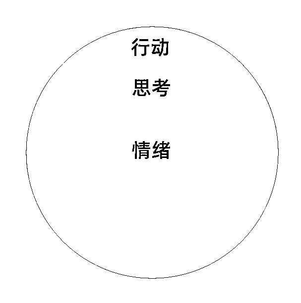

# 自己独自做项目，如何消除内耗、焦虑

> 来源：[https://jy0ck0ftw5.feishu.cn/docx/KnCAd0j20oC81ZxjQ6jctoFVnpb](https://jy0ck0ftw5.feishu.cn/docx/KnCAd0j20oC81ZxjQ6jctoFVnpb)

大家好，我是木婉，5期圈友，在生财收获最大的是开阔了眼界，以及随之而来的焦虑。可能你会疑惑，为什么焦虑也是收获，我能从这个收获中学到什么，怎么才能让焦虑成为我的动力呢？那么，你可以接着看下去。

# 本篇的核心思想：情绪——思想——行动

亦任大佬说过，焦虑是好事，是能促使你向上的动力。而且，有焦虑是一件很正常的事情，他也天天焦虑，他所 知道的身价几十亿的老板也天天焦虑，这个时代，不焦虑是不正常的。并不是罗振宇贩卖焦虑，也不是互联网贩卖焦虑，而是，你只要想成长，想赚钱，想要突破现状，必然是会感受到痛苦。

## *假如一个人，他不焦虑

我身边看到的不焦虑的人，有这样的：

### 1）年复一年的给公司打工的大姐。

她一点也不焦虑，只会抱怨。今天这个菜价又涨了，这个油钱又涨了，但老板给我的工资还没涨，哎，还是体制里好啊，体制里涨工资。

### 2）体制内岗。

“今天xxx局又要我写这个报告，又得加班了，烦死了。这个内网系统又卡的用不成，真痛苦啊。活还没干完，又得去开会了，哪这么多会开”。“每天看一看股市，哎，我上次买的这个股票涨了，又有几百块零花了”。“xxx来视察了，赶紧把手机里该清的清，值班表安排好”。有些上了年纪的，闲的没事干，到处办公室找人唠嗑的。

### 3）年轻打工仔。

当一天和尚撞一天钟，就要稳定的不会倒闭的公司。工作嘛，先干着呗，未来的事情未来再考虑。及时行乐，和朋友吃喝玩乐，不想未来，之过当下。当然，她这种专注当下，是专注享受的当下。

以上都是我看到的不焦虑的人，我好奇他们为什么不焦虑，所以问了他们。回答大概意思都是，人生就这样了，凑合过着呗。

仔细回想了一下，我以前也是不焦虑的，每天无忧无虑，在学校有什么安排我就做什么。每天打游戏，看剧，看小说。真正开始恐惧的时候是要去找实习的时候，猛然发现，自己居然还没有方向。只知道自己讨厌父母给定的方向，不想被局限住，总觉得自己人生有无限可能，但这个可能，所要具备的条件，需要的是5，我却连1 都没有。

眼界被打开了，开始考虑到未来了，就会一直焦虑。有些人焦虑，沉浸在思维，想法里，一直没有行动；有些人焦虑后，他行动了，但是有完美主义倾向，要做就要做到最好，我先准备，或者发了一个没费他多少时间的东西，正反馈不足，期待过高，让他自己觉得自己是个垃圾，进而产生畏难心理。于是这些人中，会产生一批人，屏蔽信息源，我不看，焦虑就追不上我，我逃避，安心打工，安心刷短视频娱乐，焦虑就追不上我。

还有一些人，由于以往的人生，存在的正反馈很多，对于项目一时的失败不在意，反而认为这是很正常的事情，他对于情绪的处理很有经验，于是，产生焦虑——做出行动——优化行动——赚到钱——组建团队——向有经验的人学习——赚到大钱。

## 一、什么是内耗、焦虑？

内耗，焦虑用书面用语就是，不满足于现状，脑子里一堆想法，却没有付诸行动，或者说，有各种各样的原因，无力改变现状所带来的情绪体验。

举个例子，有一个评分体系是从1-10分，这个评分体系可以让你对自身有一个评估。假如你现在处于2的水平，但是你想当5，想当10，甚至想当100，这种时刻，你就是处于不满足现状的。但如果你一直在2里面绕圈圈，是不是就会很不开心，会很自责，我怎么还是个2 啊，我好痛苦啊，我想变成5，有没有人来救救我，或者理解我的痛苦，我感觉自己真是个废物啊，有个同样是2的跟我一块吐槽，我还能好受一点，但是即便这样还是不能阻止我认为自己是垃圾的心。

ok，这是当自己认识到自己时，先开始的自责。好了，今天上午自责完了，心情沉重，一整天都心情不好。晚上了，感觉这个这样状态不行啊，死气沉沉的。为了让自己心情好一点，去搓了一顿火锅，感觉到了一时的开心，吃好吃的快乐。结果第二天，又看到一个明面上看起来2的人，他，三天赚1w、宅家三年赚1000w，看到别人奋斗，别人有成绩，为做项目吭哧吭哧花三四个小时研究的时候，他又刺激到你了，他们时刻在提醒你，你是个废物，对不对？你想改变，但是你又做不到，然后你就一直在这里面绕圈圈，这就叫内耗。

## 二、为什么会出现内耗、焦虑？

因为你想改变，但你又做不到。

为什么你做不到？

你以为是你智商不够吗？你以为是你意志力不够，坚持不下来一个事吗？

都不是。

记住，只要是别人能做到的，我们也能做到。

但凡是我们没做到的，一定意味着我们的前提中间缺着某些东西。就是1+1，只能等于2，人家等于5的，中间加了几个环节，但你不知道这几个环节，你没有摸到这个事物的本质。

还记得我文章开头放的那个大图吗？

人的行为，由三个部分构成。第一个是情绪，最核心的。情绪上面是什么？是思想。在思想的最外面一层，是行为。

那我们的内耗发生在什么层面？

是中间吧？你见过有人在现实行动中内耗的吗？没有吧？

因为你一直在脑子里想，哎呀，我今天没准备好，这个项目得需要手机号，得需要垫资，得需要一天三四个小时，我哪有那么多时间啊，我也没那么多手机号去注册账号呀，我还没准备好呢，等准备好了我再做这个项目。

你一直想等你准备好，所以一直迈不开步子去做事，行为上就是0 。

永远在脑子里想，然后你就很奇怪，为什么啊，我到底为什么会这样，于是你开始去搜索了。

搜了一大圈，发现市面上没几个人说这个的，看了好多文章，心里还是不得劲，感觉自己不像是那个文章里面说的情况，还是找不到答案。

我就是这么走过来的，很幸运，我找到答案了。

我告诉你，因为你没有挖到问题的本质，不在思想，不在行为，而是在最内层的，情绪！

对，就是这个情绪，这个世界是由情绪构成的，每个人的任何一个行为是由情绪构成的，和思想、行为，一点关系都没有。

是不是有点懵？这和情绪有什么关系，难道不是思想？

那，思想的作用是什么呢？人类的思想并不能改变命运，改变命运的是人的欲望和情绪。思想只能去描述世界，认识世界，它是一种描述，不等于现实。比如说我脑袋里面想200块，不等于我现在口袋里有200块。

我说，木婉今天上午吃了个鸡蛋灌饼，这是一种语言描述，但是我当时确实发生了，我吃了这个饼，确实让我吃饱了。当我说出这句话的时候，木婉吃了个鸡蛋灌饼，你自己感觉到你吃到鸡蛋灌饼了吗？没有，你什么都没吃到。

现在世界普遍的一种环境，一种价值观，潜移默化的影响你，让你感觉你的一切不如意都是因为你脑子不够，智力不够，思想不够，等等。它是一种理性，永远让你觉得你不够理性，意志力不够强，你在思想和行为的层面来回找原因，绕圈。但你没有往更深一层去找，这个问题世界的本质还在最里面的一层，情绪。

为什么问题世界的本质是情绪？

因为你的情绪决定思维，思想只能描述世界。

我们，作为一个人不能靠想象活着，他是靠胃的，他有一个饥饿的胃，他要靠吃东西才能活着。人是双脚立在大地上，不是立在空中的。理性，在这里面只能描述，只能认识，不能代替。

否则，你说，我跟你讲，人就是活着，然后为了去死。那你这么说了，为什么还活生生站在这呢？你不还是想感受不一样的情绪吗？说是体验人生，其实就是想有不一样的情绪变化。

再举个例子，你为什么想谈恋爱？是不是想得到开心的情绪？有个喜欢你的人，是不是很开心。

人们常说，女生的情绪生物，男生何尝不是呢？

女生的流程是，情绪——思想——诉说——行动。

男生的流程是，情绪——思想——行动。

男生没有诉说的流程，女生根据诉说的结果制定行动，所以导致了两个人的差异。

女生怪男生，为什么不跟她讲思想。男生怪女生一直总是说说说，不行动，或者说不给男生讲希望他做到的行动。尤其是最后一点，给男生讲希望他做到的行动，很重要。

女生以为把想法给男生说了，男生就会意识到女生想要的行动，主动去做，女生由于社会大环境的影响，羞于说自己的需求，或者说，不想让自己的形象在喜欢的男生心中不好，就会导致这种现象的发生。

再比如说，一个正常普通女生，为什么她不跟男网红谈恋爱？

因为她预感到自己未来可能会有伤心的情绪在，这个男网红鱼塘遍地，出轨没有一点难度，可选择的鱼很多。尽管会有享受到颜值的快乐，但还有伤心的风险。

如果男网红给她花的钱多，那快乐的情绪大于伤心的情绪，感情就还能维系，这就是为什么有些人被出轨，还不愿意分手的原因。本质就是情绪。

接下来讲，情绪怎么影响你的。

你为什么想改变？你不一定是基于什么？会是基于思想吗？用逻辑论证出来的吗？

错，是基于你的情绪，你痛苦的情绪，你对现状很不满意的情绪。

你看着别人都牛逼，就你自己一天苦哈哈的，是吧？上班上的苦哈哈，上学成绩又不好，这样的一种情绪。

就是因为这样的痛苦情绪，逼着你，自然产生了一个思想，就是，我要改变。

然后你就想，我要怎么改变呢？于是，脑子里面开始想了，我要像我们班的那个学霸一样，变成第一名；我创业要像马云一样多牛逼。

然后我们在脑子里面想象，想的非常完美，想到未来自己的期望，现在你是2，你期望自己未来能够实现100，这个期望很大。

然后你说，嗯，我现在有目标了，我要像xxx一样，我要改变我痛苦的现状，我要变成100分。

这个时候，当你要迈出第一步行动的时候，甚至是还没有迈出来的时候，你突然问自己，如果我要达到100分，按我现在这个2的水平，我有好多东西都不会啊。

如果让我去做那些事情，我完全没有头绪啊，还要花大量的时间去研究。

当你想到你要做那么复杂的事情的时候，你的情绪，立马就出来，就感觉，我丢，这玩意我做不了吧，太痛苦了，那个东西太复杂了，我现在还没准备好呢。

这个时候，你的情绪就阻止了你去做出行动。因为你的情绪感觉这太复杂了，我做不到，如果做不到的话，我就会失败，而如果失败了，我就是个废物。

每个人都恐惧失败，这是一种情绪，一种恐惧情绪阻挡了你成功。

为什么会这样？

第一个原因：我们长久以来的教育，让我们变成了一种静止型思维。

什么意思？

就是，如果要做事，就要一步到位，一步登天，一步就做100分，如果一步做不到100分，我就是个废物，它是一种静止型思维。

可仔细想想，世界上有那一个人能一步登天？马斯克是一步登天的吗？马云是一步登天成为首富的吗？生财的创办者亦任是一步登天的吗？最近声势浩大的航海是一步登天的吗？

尤其是航海，在航行的过程中发现各种各样的问题，一年年优化，才有了今天到的样子。就连一开始的志愿者，没什么能力的我都应聘不上的，一开始没有流程化，遇到各种各样的问题是要志愿者自己跟生财团队克服。

所有的人、事都是一步一步走的，这就说明我们很多人缺乏一种思维，迭代思维。

你要成为100，首先要明白100是怎么构成的？也是从简单的12345一步一步走上去的。

这里面就是要迭代，要有成长性思维，要加入时间这个因素。

也就是说，我们不能期望自己一下就像脑海里想象的那么完美。这是不可能的，要有时间，去慢慢的走。也就是说，你一开始是2，然后慢慢成为3，成为4，是一步一步走上去的。

但我们很多人的想法是，要么一下就成功，到100，如果不能一下成功，我就是个废物，这样自己pua自己。

可，你的人生很长，你着急明天就成功，成为亿万富翁，后面的日子咋办？后面的快乐难道要进行无聊的钱权交易、黄赌毒交易吗？这大概就是赚钱很容易的那些人的情绪快乐方式吧，因为赚钱容易，快乐容易，不满足于轻松的事情，就去找更刺激的事了。

第二个原因：你没有注意到是情绪的问题

阻挡人往前走到的是情绪，同样，这个阻挡人前进的情绪也是让人前进的东西。

恐惧情绪会让我们止步向前，也会让我们往前走。

为什么恐惧会让我们后退，因为你做不到，你害怕。那，怎么让我们前进？很简单，只要不是恐惧，是快乐情绪就可以。

那么，怎么才能让自己快乐的去改变，而不是痛苦的去改变呢？

秘籍就是：不要给自己太大压力，不要想从2一下到100。

一步登天，天才也做不到。你想啊，我现在一个月入5,6千的人，一下要月入100万，异想天开吧？什么东西都不会，在那讲月入100万。

那怎么行动呢？

首先有迭代思维，先把自己的目标设定的比较近，你轻松就能做到，不要想着自己能一步登天，而是告诉自己，要让自己失败10次，100次。

1次的失败概率是90%，10次的失败概率是34%，成功概率就变成了66%，那100次呢？你可以自己算一下。

我们要先成为3的人，在成为4，然后是5，一步一步往上走，就像傅超人的朋友圈签名，每天进步一点点。

再举个例子，读书这件事。很多人都很痛苦，对吧？总觉得离开了学校，就读不进去了，没时间读了，宁愿去听书，也不愿意去读，不愿意跟读者的思维产生碰撞。

有些人说，我愿意读啊，我看网络小说来着。这个不算哈，它没有知识的增量，它带给你的只有想象的多元化以及情绪的爽，你没有从中学到任何生活或者学习或者其他社会经验。

我从19年到现在，4年的时间，看了有300本，没有很多，比起一些大佬，一年300本的成绩，我不算什么。重点是，我以前没有读书的习惯。导致我一开始看书的时候很痛苦。

20年8月开始，完成第一本书的阅读。我记得很清楚，当时看一篇短篇小说集，《王考》，这本书在b站纪录片里看到，然后20年读书节的时候买的书。

一篇短篇，看了5分钟，脑子发蒙，没看懂第一页，继续看，看了30分钟，脑子还是蒙的，刚这个小说讲了什么？我怎么什么也不记得。

当时因为付费学习的一个课里面说，不要有完美主义心态，实实在在去做了，比什么都强，所以我当时候没觉得自己失败。

就一篇小说，看不懂就看不懂，放过自己，看下一篇，市面上主流的说法也不会说你一本书读不进去就失败。

然后我就发现，喔，下一篇我看懂了，好像看书也没那么难。然后不知不觉，这本书看完了。花了大概有三四天，我每天读一篇，甚至有一天我懒得读，第二天仅仅只是翻开，就一下读了两篇。

当我看完的那一刻，我觉得自己很厉害，那种成就感，不是东读一本书的一章，西读一本书的一章所能比拟的，是自己终于完成一件事的开心。

自那之后，我读的书，就是一本一本的累加了，在没让我操心过，我也再没有羡慕别人会读书了。当然有羡慕别人开始的早的想法，哈哈哈。

再比如，写知乎这件事。当时我大三，从没有公开发布过我自己言论，甚至朋友圈都不发，就是害怕发表自己言论以后，被人抨击。

后来发现那些能赚到钱的人，闪闪发光的人，从来不会不展现自己，他们很自信的展示自己的生活，不论精彩或伤痛，或是一些令他感到启发的点。

可以明显的看到，自从我意识到，公开发表言论以后，自己才能更好的成长之后，朋友圈发表的动态都更多了些，机会也更多了一些。

再后来，看到涛哥的《目前最完整的微信朋友圈神操作》，以及辉哥的自身经历，透过每天发朋友圈，写长文，吸引了一大批喜欢他的人。这些更加印证了，只要坚持发，终有一天有成效，不论这个成效是精神上的，还是物质上的。

我认识个朋友也是，她问我怎么赚钱，我就跟她说，去写知乎，只要去写就好，写了就能赚到。

然后她咨询我应该怎么写，写哪个方面。综合我对她的了解，我找了一些曝光率大，但是回答少的问题，拍给她，让她先把这些回答写了。我都没有对她抱很大的希望，就想着她先练练手，结果她写的第一篇就700多赞，一大堆的人留言给她，希望她继续写。

这对于当时三年考研，一直没成功，还负债好几万的她而言，是很大的惊喜。甚至于，我当时甚至都不知道她一直有贷款，我以为她家里一直资助她去考研。

就这么写着写着，她的小说被知乎盐选收录了，她每个月都有被动收入，由此，她也进入了文案这个行业，并朝着编剧的方向发展。

但是很多人是这样，一下就想到完美。

那很复杂，一旦做不到，情绪就会阻止你，让一步都迈不开，因为我曾经这样有半年了，一步都没迈开，成天在脑子里空想，在想象未来要成为什么样，过什么样的生活，要成为 100 ，结果现在才2，就痛苦。

后来我就告诉自己，我现在能力确实不足，但我允许自己失败 50 次， 100 次。咱就先失败着看看，不抱期望的去行动，有了一点小收获后就会很惊喜。

得到的脱不花沟通训练营中第一课，也是在强调情绪的重要性，第一步是要听懂别人的情绪，别人的情绪会给你方向，知道你要接下来采取的行动，感兴趣的可以去听一听。

## 三、怎么去解决内耗、焦虑？

### 1）学会制造“垃圾”

做自媒体视频，把文字一扔，然后先做个垃圾出去，不要期望第一次就成功，先让自己失败 100 次，你有100次失败的机会，所以，你有什么压力？

你做一个垃圾出来，他起码比你不做强，你本来是2，现在做一个，起码是3分了，比那个2强了。把那个视频做了，结果花了多少时间？ 可以自己试试看。

你只要行动它就不累，一旦迈出行动的时候就不恐惧了。去行动，期望值低，你不是要做一个百万粉丝的那种视频。发出去之后，别想着它能火。一发出去就知道这视频做的有漏洞，但已经发出去了，没关系，已经总结了一个经验了。

发出去之后忘记它，这样等后面，突然发现越来越多的人开始点赞的时候，就会觉得，哎？这么一个垃圾还有人点赞，想不到，实在想不到。这样就对你的情绪就是个正向反馈。

### 2）允许自己的失败

你在想象中想的那个完美，实际上到了现实中一实践，好多好多地方都是你曾经想过的，各种困难就会出来。

但是你迈出行动之后，你不断是有一个正向的情绪反馈。什么情绪？就是，这个东西没那么难，你不再恐惧了，于是这个人就开始迈向了行动之路，这就是万物的本质。

很多人从来没意识到阻挡他前进的，他以为是他的思考，错，是他的思想错，是他的情绪，所以，而且他是一种静止思维，想一步登天。我们现在要允许人生的失败。这 100 次是不断迭代的100次失败。

我们常说的失败一次，实际上不叫失败一次。我们可以更改个称呼，100 次的修正，一个在2水平的人，从3 开始往 4567走，慢慢的往100走。

### 3）给自己制定容易的目标

比如说一个上班的人，你要做项目，然后你在生财里面挑，你看到那么多人一写文章就是月赚5w，10w，甚至50w的，然后你说，我也要做到月入5w。然后你就开始仔细看文章了，看完以后你发现，啊这个东西，好复杂呀，好麻烦呀，要搞这么多东西，我搞不来搞不来，算了吧，我还是换个项目吧。

这是不是你？其实，一下子看到所有复杂的东西，谁都会立马跪下。你让一个人，一天把一个项目的所有细节跑通，这不可怕么。就那些写文章的，也是每天处理好了一个小问题，最后汇总成文字，展现在我们面前的。

你看到这个项目还挺复杂，挺麻烦的，你还想通过这个项目一下就赚到人家花几个月研究做到的事情，一下就想到100分，然后你一看自己，自己就是个废物，是个垃圾，现在就是2，啥也不会，引流引流不会，私域私域没有，视频视频不会剪辑，这么一想就很痛苦。

然后就想，算了，打把游戏吧，看个剧吧。你就一直躲避，逃避。那怎么才能不这样呢？

#### 具体做法

第一：有迭代思维

第二：照顾自己的情绪，不要让自己的情绪感到害怕。

你只要照顾情绪，让情绪开心，那情绪就会让你开心。

把这个目标给拆成，x+y+...... =z， z 就等于做项目。

这就是为什么有些人在打工的时候能把成绩做出来，自己做项目的时候焦虑的缘故。自己做项目，没有把大目标拆卸成小目标的意识，一股脑的想把所有事都做好，就会导致焦虑，内耗的现象产生。

比如说你在参加短剧cps航海，不要想要一下子把航海手册看完，刷的一下，就要今天把视频做出来，不做出来自己就是个废物。

或者说你一下花三四个小时，整了几个视频出来，结果播放量才500，点赞寥寥无几，评论也没有，是不是很挫败？怎么你花这么久的时间，成绩这么低。

这种就是你用力过猛，导致你对自己做出的东西期待很高。

如果你能保持自己现在做的就是垃圾的心态去看待，就能持续坚持的发视频。

如果做不到，这个项目就搁浅了。

你会觉得，自己这么努力了，居然还赚不到钱，肯定是这个赛道饱和了，赚不到钱跟我自身没什么关系，都是这个航海的关系，赚不到钱还开航海。

人体的防御机制，开始保护你的内心，会促使你这么想，这么想的结果就是，下次航海你不会特别想参加，下次碰到好项目，又是一开始用力过猛，期待过高，成绩平平，循环往复。

我们应该做到的是，跟着手册一步一步的来。首先通体看一遍，知道这里面有多少个步骤。

第一步、账号

第二步、平台

第三步、选剧

第四步、剧情

第五步、去重

第六步、发布

我们一步一步的来，对吧？一天就只干这一件事情。今天先把账号的事情，解决了，注册好。注册账号你会把？你觉得难吗？不难吧？明天你在把要用的平台注册好，这也不难把？

里面就剧情和去重会需要你多花点时间，再把这个大步骤，按照航海手册里面的东西，细化一下目标任务。

不要想着一下就到100分，一下就做到那种播放量20w的视频。

你说剪辑太麻烦了不想剪？ok，你不会剪，不想剪，导入素材会吧？你别管其他的东西，先把素材导入进去。然后拿着剃刀工具，随便那么划拉几次，就随便这么划，划完以后再播放一下这个素材。

咱先不剪视频，先点点鼠标，尝试用一下剪辑软件，难吗？不难吧？

好了，今天划完这个之后就去玩。

然后明天的任务是什么呢？熟悉去重的方法？一看，也觉得好难啊，得整好多东西。

不，我们就整个最简单的，贴个蒙版，就你上传个纯色图片，然后透明度调成2%，3%，随便你，设置完以后，你又可以去休息了。

你觉得难吗？不难吧。然后你第三天再这么做，换个别的简单的去重小技巧，或者剪辑小技巧。

你就每天，完成其中的一个小点。

实际上，当你第一天打开剪映，划视频素材的时候，划着划着，你就觉得这个时候，你的情绪变了。

你一行动，你的情绪就变了，你就想着好像也没那么难，你可能还多剪一会。

同样，你熟悉去重的时候，你不可能只熟悉一个蒙版去重。

你这蒙版熟悉完，发现，唉？还挺有意思的，多整几个，不知不觉，去重方法你就都给熟悉完了，还觉得挺简单。

这个没那么难，就是你的情绪就变了，要不我多试一下，反而是激励你不断往前走。

而且你越做，你给自己的期望没那么高的时候，你越做越兴奋，越做越觉得一切不过如此。

就像有些工作的人一直懒得收拾屋子，对吧？

就成一个猪圈了，还不收拾，一直想着我要收拾，一想到，哇，这么复杂的屋子，要收拾起来多麻烦对吧？

但往往你发现最后你是实在忍不了，你说算了，我也不收拾，我就把这几个明显的这几个垃圾我随便弄一下，其他地方先不收拾。

结果你发现，你把这几个垃圾一一收拾之后，你这已经变成一种行为了，他不在他脑子里面纠结，不内耗了，不就变成行为之后，这个行为会立马给你一种情绪的感受。你说，诶，收拾这点垃圾好像没那么难，好轻松啊。

那不如我把这些剩下的垃圾也收拾了。于是你会发现，你最后把这个垃圾反而把整个屋子给打扫了。

因为你的情绪在起作用，这个东西没难的嘛，不是自己想象中那么难吗？

所以为什么万事开头难？

因为很多人没把握住这个原理，就是他一想到他要走的那个路，他一下就想到 100 的份上去了，而他现在水平只有2，根本达不到 100 这种。只要是个人，有点脑子，不是弱智，都能知道自己是 2 的话，是不可能到 100 的。所以这个路还没走就已经输了，就不可能实现，就把你吓死了。

#### 人生的核心是什么？

都是情绪，这是人生每个人的核心，而这个社会是由人组成的，所以也是这个社会国家用心的基础是欲望，这个世界是一团欲望，根本不是理性，思想就是理性。

我们传统教育，一直在理性的层面去走，所以你永远会失败。

真正牛逼的人是看透本质，是在情绪，要照顾自己的情绪， 情绪就是快乐和痛苦。

你没做到，是因为你恐惧情绪，而那些成功的人是因为他有快乐的情绪。

怎么快乐？就是让事情做起来容易一点。

那怎么容易？我们就不能想一步登天，我们要让自己成为一个迭代的、成长性的人，不要是一个静止型的人。

成长性就意味着我要有自己有 100 次， 1000 次，1万次的什么修正的机会，我每次只进步一点点，你不要想一下到 100 。

传统的认知是理性，这个框架里面，无形之中就让你绕在里面，你从来都没意识到，实际上下面是情绪。

很多人说，我们要理性，不要情绪。扯淡，这个世界是由欲望造成的，就是由情绪造成的，这才是本质。

理性只是实现欲望的工具。

早晨肚子饿得，尿憋得不行，这是一种情绪，痛苦，然后你才想着，我要赶快去上个厕所，你是不是这样想了，想了之后立马去行动了。

思想是为欲望服务的，理性是为欲望服务的，欲望才是世界的本源。

而这个东西是谁发现的？是马克思。

马克思说：这个世界就是非理性的，是为了利益在争斗的。

什么思想？

人不靠思想活着，人靠什么实打实的生存是第一要务，这就马克牛逼的地方。

你不要看高中课本里面的那个，那不是真正的马克思，要听马克思去找王德峰老师。

## 四、总结

你想改变，想成功，想成为一个优秀的人，这是每个人的追求。

向上的本质，每一个人都想成功，没有一个人想当垃圾，这是人的本质，这是一种什么情绪在推着你往上走，所以你才不满足你现在的现状，然后你一想到要自己现在，还是个小菜鸟，才 2 分，想成为 100 分，你一想到那个，脑子里面想的多美好。

当你想迈出一步的时候，一想，哇，那么多的东西我都不会，瞬间你的情绪就是巨大的恐惧情绪就淹过来了。因为你想如果我真的迈了，达不到我想象中那么完美，我就是个垃圾，我就失败了，怎么怎么样的。

具体你要做到的：

#### 第一个，抛弃失败情绪。

承认我们自己是垃圾，而且我们想成功一定要经过 100 次、 1000 次的修正、迭代。有这种思维

#### 第二个，一定要认识到情绪是万物的本质。

人的生命情感是人存在的基础，人为什么要生存，是怕死的情绪，包括我们为什么要跟别人交朋友，是因为我们跟他交朋友一种爱的感觉。

抓住情绪是万物的本质，这个世界是非理性的，抓住这一点本质之后，你只需要做到一件，就是照顾情绪。

什么叫照顾情绪？就是不要让你的情绪太难，让他痛苦。

为什么痛苦？就是因为你给他的任务太难了。

那我们给自己任务小一点，每次完成一丢丢，把这个害怕的情绪转化为快乐的情绪。

迈出第一步，这个第一步一定是非常弱智的，允许自己，试 1000 次才能成功，所以你这，第一次对吧？你就已经预知了自己失败了，你还怕啥？

你都觉得我第一步肯定失败，那你做了，你没任何期望了，反而你做出一步之后获得的是一种什么？

万事开头难，这第一步好像没那么难。

## 五、结语

加油鸭~

本篇文稿是我自己的思考结合看过的一个视频写出来的，文章很多地方都用到了原视频的说法，因为有些东西特别触动我，字数就没怎么改变，感兴趣的可以听视频版。

看到这个视频的时候，我特别兴奋，感觉好多东西，都有了说法，为什么自己会痛苦，为什么自己会有行动，仿佛世界明朗了，所以想整理成文字版，结合我们自己的实际情况，分享给大家，希望能对你有帮助。

【《改变人生命运》第一课】https://b23.tv/rMwvQGp