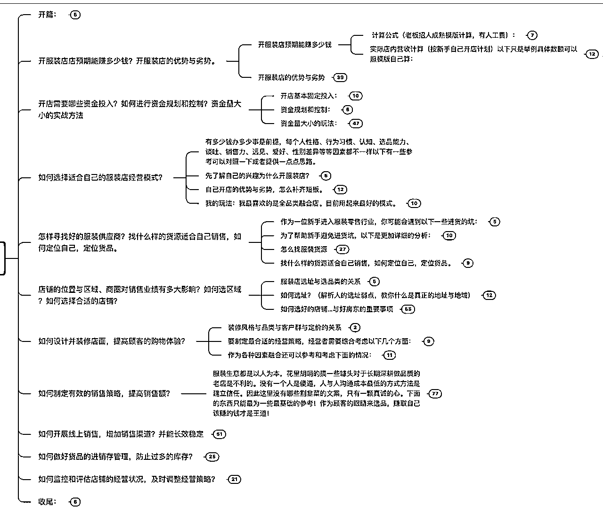

# 都说风口过了，知识付费还值得做吗？

> 来源：[https://fs4xcvw5u9.feishu.cn/docx/KxuIdMr5noo7oexcna1cbpgRnlh](https://fs4xcvw5u9.feishu.cn/docx/KxuIdMr5noo7oexcna1cbpgRnlh)

风口过了，知识付费还值得做吗？

大家好，我是亚萨。

距离我发上一篇文，一年多了。当时离京去昆明，但没过多久就又决定出国，所以这段时间一直倒腾这个事。

现在全家在加拿大刚安顿下来。

我一直在做知识付费相关的业务。

但最近有不少人问到我，说大家都在说知识付费的风口已经过去了，还值得做不？

我认为是能做的，这个话题从三个方面来聊一下：

1、为什么还能做？

2、可以怎么做？

3、还能有哪些想象空间？

## 1、为什么还能做？

首先知识付费确实不如前两年好做了，一方面经济环境不好，另一方面是市场趋于成熟了，同质化产品多，用户对内容品质的要求变高。所以行业内也是唉声叹气。

回到上面的问题。

不好做的第一个原因，是所有行业要面对的，不仅是知识付费不好做，其他领域你去做一样会遭遇这个问题，用户花钱更谨慎了。没办法。

第二个原因，任何一个赛道趋于成熟，都会产生类似的情况。但衡量这件事该不该继续做的点，核心根本不在于竞争和品质。而在于需求。除非需求彻底消失或转变成其他形式，否则只要需求还在，那么就有生意在。

刚需的业务，进入成熟期，一定是高度竞争的。

所以，知识付费能不能做？可以做，但因为成熟了，所以不像之前那么容易做了。

就像餐饮、服装一样，这些领域能不能做？能做，但不容易做。

所以，知识付费有机会吗？

有，但要把它和其他成熟领域一样看待：

你能不能确定刚需？

能不能找到精准客群？

能不能把产品推销出去？

能不能把交付做好？

把市场最本质的东西做好，知识付费依然是一门好生意。

没风口了，只是回归正常，也无风雨也无晴。

为什么说它依然是一门好生意呢？

知识付费其实核心的逻辑是教育。是会一直伴随社会存在的事。它在近一些的时代，可以叫加盟；更远一些叫拜师学艺。

未来会有新的科技、新的场景、新的媒介。但对高品质信息的需求，一直会有。在这一点上，它做的也是刚需。

同时在当下还有几个看得见的优势：

低成本：

就个体而言，除了时间精力，知识付费的产品，几乎没有其他成本。

同时，对于整体环境下行的时期，极低的启动资金成本，对项目的启动、试错到迭代跑通，都是一个非常大的优势。

规模效应：

我们知道互联网有规模效应，业务体量越大，边际成本越低。

但这种业务，在之前往往需要研发技术的支持。

而知识付费的出现，是少有的，不需要研发技术就可以撬动互联网规模效应的产品。

这种形态，是比传统行业+互联网来做线上业务还要有优势的——所有可复用的环节，都不会因为销售端的压力，影响产能。

市场认知：

3年特殊时期，让大多数的用户接受了可以为知识付费。

现在买课，对大家而言是很正常的事了。

我在2014年就开始接触当时的知识付费业务，包括非常小众的收费群、直播课、以及做在线咨询的先驱“在行”。当时身边几乎没有人付费。

2016年被称为知识付费元年，用户的基本认知还是不太能接受为知识付费的。付费的用户，是在2020年开始暴增。

用户的认知，对行业的发展是决定性的。即便是同为内容的领域，认知上的不一样，也会导致结果有非常大的差异。

就拿知识付费课程和公众号付费文章来举例，同样是提供内容，前者在当下已经普遍被接受，而后者，除了小部分作者的粉丝有这个习惯，其实大部分人是不认可花钱买公众号文章读的。

原因在于，在用户的认知里，为“课程”交钱，是理所应当的，为“图文”交钱，则不然。

虽然二者本质上都是信息，只不过形式上有所差异罢了。

但这就是认知的威力。

总体来说，知识付费可以做，成本优势依然在，但商业上的要求变高。

产品要有质量，客户要够精准，销售要够专业。

## 2、可以怎么做？

说完能不能做，我再说一下，从我个人的视角来看，可以怎么做？

### 1）贴合行业做解决方案

在新的阶段，之前热门的知识付费主题，普通人就不要尝试去碰了。

比如像商业思维等认知类的，还有软件使用技巧这种基础教学，以及各个领域偏理论的主题。

一方面是这些主题已经有很多同类型产品和团队在做了，另一方面，是整体经济下行的趋势下，不是刚需的主题，转化率有可能低到发指。

那么什么主题可以做？具体的行业解决方案。

这么说有点抽象，我举具体的例子来说。

我一个陪跑的项目，学员是在5线城市开服装店的哥们。做服装13年了，在当地开了两家服装店，一个男装一个女装，单店利润大概30w/年，佛系了5年，天天钓鱼。

深度沟通后，准备做小城市小规模的开店教学和1对1服务，找我陪跑。

课程刚做出大纲来，就预定了7 8个1对1的服务名额。

卖点就在于，他能够搞定，在4 5线小城市如何从0开好一家服装店，并且提供供应链支持。

现在的定价是8000元，1对1。看一下大纲，设想一下你是有需求的用户，有多大概率愿意花钱买这个服务？

从大纲的内容上来看，不是线上的风格，措辞各方面都很接地气。

而且一旦融合行业做解决方案，引流获客的内容也顺带着就搞了。

他现在已经在筹备第三家店，整个启动流程，核心的内容收集整理下来，做成内容的切片投放。

这个老哥也是佛不动了，想深耕一下本行业的事。这个事启动之后，几十万的钓鱼设备全送了。

这就是我要说的。

知识付费可以下沉、回归到更原始的形态，去赋能。这个模式有点加盟的影子对吧。

下文还会将另外一种更深度的衍生玩法。

同时，这位老哥其实在公域引流上，需要补强的。这又是一个绝对的刚需。只要有产品能做好交付，成交不是什么问题。

所以，不管是经济下行、还是风口已过。都绕不过市场规律啊！有需求，就有业务。

接下来要谈的，就是抓需求的问题。

### 2）不是刚需不要做

这个阶段，一定要认清形势，放弃幻想。只做刚需！只做刚需！只做刚需！

怎么判断什么是刚需？

如果你做过一定时间的销售，那么你就一定会对哪些产品好卖有感知；也会知道如何和客户沟通推进销售流程。

但假设你没做过销售，想要定需求，千万别拍脑门，照抄是个不容易出错的思路，但大概率会抄个形似神不似，而且最重要的是，你如果对需求没有清晰的分析，你很难营销到点上，也很难完成成交。

所以，用产品设计常用的笨办法——用户访谈，去找刚需。与其说是找刚需，更贴切点是，从0开始去仔细认真的了解你要服务的群体。

之前的精华文推过做访谈的书。今天给大家一个我整理的工具表。供参考。

访谈10个用户，一定会对你自己最初的设想带来巨大冲击。

为了工具表能更直观的使用，我没清空案例。

具体怎么用这个表做访谈，参照下面的说明去做。一定要记住，如果你没有定准刚需的经验和直觉，最好还是用笨办法去做好访谈。因为现在没风口！没风口！没风口啦！刚需才能活下来。

一、访谈设计阶段的注意事项

1.  问题要结合用户习惯的场景开始谈，可以首先安排用户简单自我介绍；

1.  问题先从简单的开始，逐渐深入，要合适的过渡；

1.  问题设计不能含有暗示或诱导的方式，问题要保持客观中立，不带情绪；

1.  问题的表述要符合用户的认知，尽量避免专业词汇；

1.  问题将你想获得的信息都覆盖之后，就可以收尾结束，常规访谈15-30个问题的篇幅是比较合适的；

1.  要写好访谈开篇介绍，和结束的感谢，让用户感受到重视和尊重；

二、邀约访谈用户注意事项

1.  访谈对象的情况，要和你将来预期的用户是差不多的，不能毫不沾边，也尽量要涵盖更多类型；

1.  邀约时，将访谈的目标、大概过程、要占用的时间告知对方，优先选择感兴趣、愿意配合的用户，尽量不要态度勉强的，提升访谈效率；

1.  提前告知一些要点，比如采用的方式是线上or线下；为了方便整理过程会有录音；访谈结果会去掉敏感信息等因素，让用户提前知道受访的权利和义务；

1.  如果是相对陌生的用户，可以在邀约时，收集一些该用户的基本信息，职业、年龄、相关习惯等，作为采访之前提前了解的背景知识；

1.  和用户约定好时间后，最好有一个提前提醒的机制，避免用户忘记约定；

1.  一个主题邀约6-10人即可，新手可以过程中持续优化访谈稿；

三、访谈前的准备

1.  看资料

对访谈对象的信息，要有基本的了解；

1.  看设备

提前准备好录音设备，方便结束后整理；

如果线上，提问者最好开视频表示尊重，以及可以用画面让对方更专注；

1.  看环境

保证环境的安静和稳定，不让访谈受到干扰；

1.  看状态

正式开始前，简单介绍自己的目标和访谈流程，帮助用户放松心情；

如果用户状态不好，可以沟通延期，不要勉强进行；

四、访谈开始后的注意事项

1.  访谈要严格遵守规定时间，如果需要超时，提前征询意见

1.  尽量不要对用户的回答进行评论

1.  过程中不要带有预设的立场，尊重用户的任何反应

1.  专注聆听，注意用户的回答，做好信息的确认或者追问

1.  对于容易跑题的用户，要控场，及时提醒并问清楚问题

1.  注意自己的语气和情绪，让过程更轻松和自然

1.  确认信息时，重复用户的原话确认，尽量避免自己调整内容

1.  用户流露的情绪和感受，在录音中无法体现时，要做好笔记

1.  在现状、目标、卡点这三个部分，注意对用户痛点要敏感，且恰当追问到了解清楚。

（大多数情况下，我们预设的用户痛点是不足的，所以要格外敏锐于用户自己提及的痛点内容，尽量多的收集。收集到的痛点越多，你的课程会越容易被他们识别出价值。）

以上就是找刚需的方法

### 3）要开始筛选你的学员

第三个，之前热门的知识普及类，轻交付的课程，用户是比较泛的，交付一般也都通过录播课就完成了。

现在想深耕行业做重交付的话，一定要注重筛选你的学员。

因为你要和学员合作去成事，所以要对学员是否能够符合合作需求做判断。不要做无用功。

至于如何筛选，不同的行业有不同的标准和门槛，大家根据自身情况界定即可，我就不赘述了。

## 3、还能有哪些想象空间？

做完行业的解决方案，类似1对1服务这种产品，在知识付费领域还有哪些想象空间呢？

我想到的是两个维度去拓展。

### 1）广度-枢纽化，建平台

当你开始做行业解决方案的时候，你吸引来的一定是行业内的伙伴。只要持续做，就会以你为枢纽形成一个行业平台。

不论规模大小，这个平台都可以获得给你提供更大的势能，和更多的可能。

简单设想一下，从产业链条的角度，你整合了某些环节，那么针对上下游就会获得更大的议价权和收益。或者更简单粗暴一些，就是做供应链走量的利润，也是一个方向。

如果嫌运营平台太累，也可以换一个方向，做深度。

### 2）深度-师徒制，做合作

深度拓展的模型，是之前提到的有别于加盟的，更古老的关系模型：师徒制。

在1对1的服务中，你会和学员建立一个实际的关系，就是师徒。

有了这种关联，业务拓展的过程中，就可以有更多的可能性。

比如针对优秀的学员提供更深度的合作空间，以投资占股的方式选择优质种子，做联营。

只要在股权的设计上做好充分的规划，其他的经营共识实际是一脉相承的。

合作风险会降到很低。会是非常香的一个模式。

## 总结

风口过去，知识付费回归常态。我认为它的价值优势依然是在的。

首先是在系统知识的传递效率上，依然还是优选。

其次是在传统行业的应用，还远远没有饱和，包括最近也和忻忻一起合作搞了保险销售方面的课程，广阔天地，大有可为的。

但要求确实变高了，会劝退一些赶潮的人。

对我而言，知识付费是表现，它的内核是教育。值得坚持。