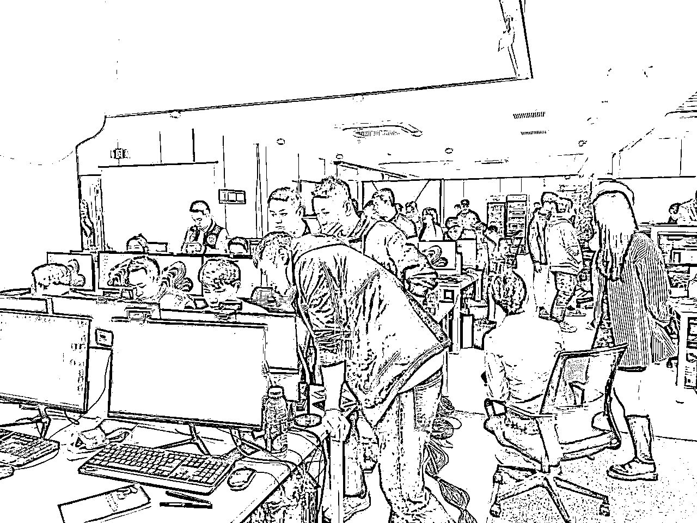
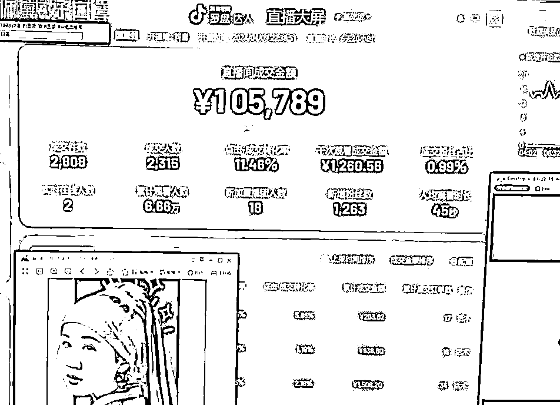
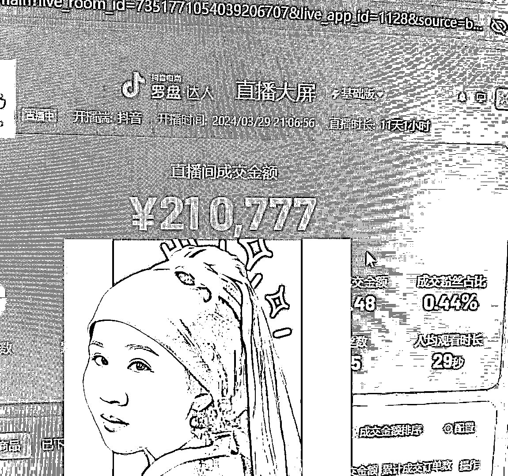
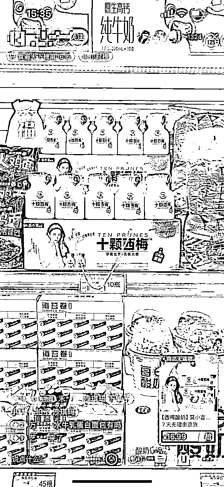
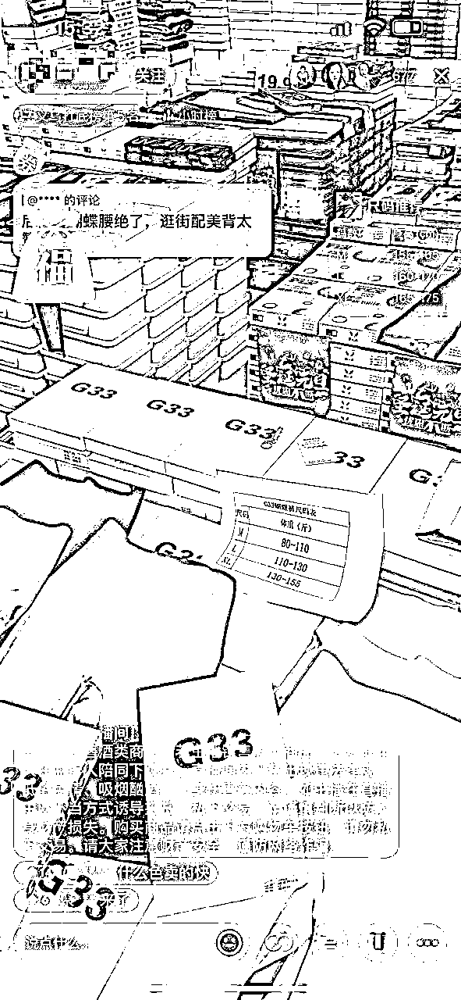
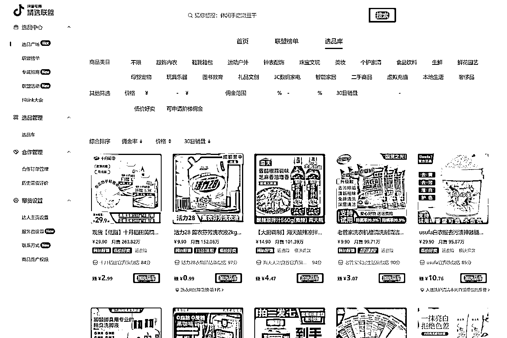
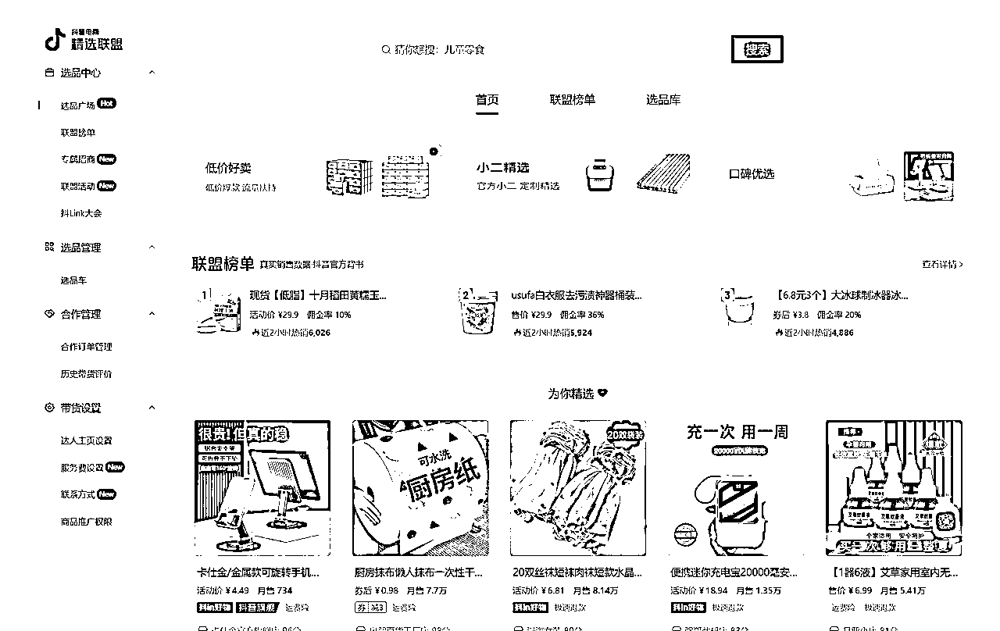
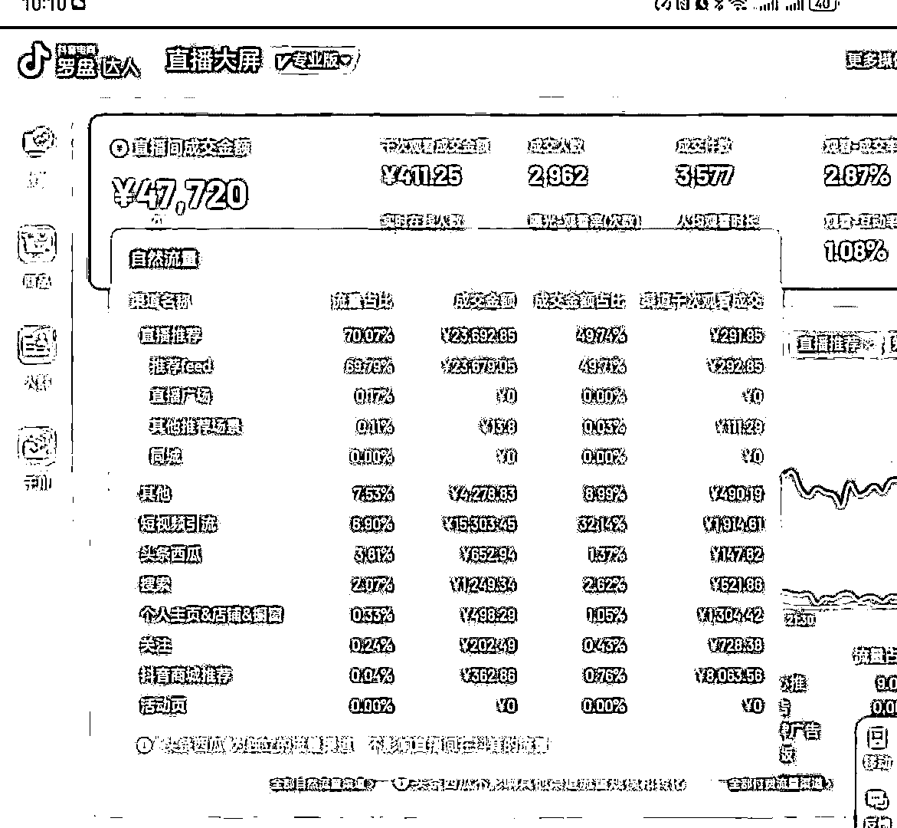

# 4年无人直播电商经验，累计1个亿GMV的我告诉你：今年一定要做抖音无人！无人直播小白必看的7问7答！

> 来源：[https://r7weuqivm5.feishu.cn/docx/L4OodPeJRoXlJWxPfyjcaq57ndd](https://r7weuqivm5.feishu.cn/docx/L4OodPeJRoXlJWxPfyjcaq57ndd)

# 我是如何开启无人直播赛道的

现在是人人副业的时代，很多人感觉自己的主业风雨飘摇，想要搞个副业增加可能性和安全感，我自己2020年入场做无人直播，一直是工作室模式运营，去年才成立公司，请了一些运营，至今毛估有1个亿的营业额，净营收800万左右吧

先做个自我介绍呢，本人 贾璐，可以叫我luca，生财4年的会员了，90 后，广外中文系毕业10年了，一直是正职混头衔，副业各种折腾赚钱，以前正职是连续2家香港上市公司的品牌总监，在广深地区的该行业还是有一定影响力的。

极其热衷于搞副业，这几年做过营地，和朋友一起开高端日料店，月子中心、亲子餐厅，各种实体店（陆陆续续倒闭中），在广州有3套房出租，父母给的2套，1套是自己真正买的。2020年才开始把正职辞了，把副业转正的原因是无人直播太香了！

我做了几年实体，在2019年才意识到真正低成本赚钱的还是得靠电商啊，一开始做过真人，运营成本很高，大费周折结果不赚钱，陆续找了几个无人直播大佬学习，一晃也做了4年，一开始一个人后来成立工作室，一发不可收拾，去年在杭州成立了1千方的公司，自播＋代运营为主

很多人会觉得无人直播会违规，封号，但我们真的几乎没遇到过，或者说千分之五的封号概率吧。我们运营的技术还是很过硬的，嘻嘻！

稍微展示2个号的直播大屏截图哈，一个号10万GMV，播了6天，一个号21万GMV，播了11天

说到无人直播，应该很多人听过，毕竟也发展好几年了，也刷过不少无人直播间，

大部分的电商直播一直都是真人主播，真人直播成本高，起号慢，对主播的形象、口才、反应要求都很高，成本高，起号也慢，并不适合所有人，而平台也需要更多的直播内容，所以给了我们做无人直播的机会

# 针对无人直播小白的7问7答

今天以问答形式整理出来，帮大家理解无人直播的底层逻辑和无人直播的操作方法。

## 第一问：什么是无人直播

答：无人直播是使用几款直播黑科技软件结合，通过技术⼿段，播放事先准备好的视频，音频，在精选联盟上选好品，加入橱窗，点开播，这样平台用户进入直播间，受内容和产品的吸引，下单购买，操盘人就能拿佣金了。因为是在精选联盟上选品，我们只是达人，不用管发货、售后，一切都在抖平台的官方体系内完成。

## 第二问： 无人和真人直播的区别是什么？

答：从操作层面，没有区别，都是找能爆，能热销的商品，通过直播间的内容吸引用户的观看，促进成交，赚取佣金。

从对人的要求层面，真人直播需要一直在线，而且真人主播的要求很高，颜值、形象、发声吐字，说服力，感染力、体力、反应快、嗓子好、创造力缺一不可。而无人直播是播放录好的视频，对人没有要求。

从效率层面，真人直播很难长期坚持，主播会疲劳会累，需要请不同的人轮流上，无人直播可以 24 小时在线，不需要人一直看着，只是在成交暴涨的时候进行管理和操作就好，其他时候想玩就玩，想睡就睡。

从玩法层面，搞真人主播的人太多，内卷严重，主播需要不停的创新，在活动、内容上想新办法吸引眼球，引导成交；大V的直播都那么拼何况我们小玩家，而且流量不稳定，平台不允许主播吃老本，数据一旦下滑就会过气。而无人直播就是薅平台的流量羊毛，能做就做，不能做就撤，我们的创新主要是找蓝海空间，找品类空间，内容上不用太折腾，数据不行了就换新号，没什么好留恋的。

## 第三问：为什么无人直播能赚钱？

答：抖音的平台变现，2019年以前主要靠广告，几大广告主互联网贷款，游戏，教育，这些行业都被监管重锤，需要新的收入增长点；电商直播是平台非常重要的收入来源，抖音可以直接从交易里抽成，这也是为什么抖音会给直播电商专门的流量支持，无人直播只是借助这样的趋势，搭抖音直播电商的快车，我一直是想着最快变现，所以带货赚佣金是最好的选择。

## 第四问：无人直播能赚多少钱？

答：无人直播操盘的收入 = （成交金额-退货）X 佣金率，一般来说佣金率20%，选品和内容合理的情况下，退货率不超过30%；一个直播号平均一天的GMV是8k，能拿到2k每天的佣金收入，前年我做工作室时，我一般一天就开2-3个号。去年年底成立公司后，找了几个同行的操盘大神做合伙人，每天都研究选品，研究最新技术，踩流量热点，同时30多台电脑矩阵操作的情况下，每天的佣金达到3W以上。

选品怎么选，我会在下面详细讲，下图是抖音精选联盟的页面，让带货变得更加简单高效，每个产品也都写好了佣金多少，有引流款，利润款，根据 人、货、场进行相对应的选品即可。

## 第五问：为什么要做抖音无人直播？

答：可以做无人直播的平台有很多，抖音、快手、小红书、淘宝，拼多多，甚至还有支付宝，京东。为什么我要做抖音的原因：流量最大，消费力最强！

用数据说话，从日活、使用时长，gmv市场占有率来看这几大平台

2024年Q1的排序：

第一名：抖音——日活7.5亿——人均日使用时长128分钟

第二名：快手——日活3.83亿——人均日使用时长124.16分钟

第三名：视频号——日活2亿——人均日使用时长35分钟

第四名：小红书——日活1亿——人均日使用时长72.67分钟

市占率：根据隐马数研，24年1~2月计算GMV市占率：阿里淘天44.7%/京东19.6%/拼多多20.0%/抖音小店9.1%/快手6.7%，抖音小店+第三方平台成交额计算市占为11.4%。较23年同期GMV市占率，阿里淘天-1.5pct/京东+1.4pct/拼多多-2.6pct/抖音小店+1.8pct/快手+1.0pct/抖音小店+第三方平台+1.9pct

## 第六问：怎么做无人直播？

### （一）基础设施

一台电脑，一部手机，抖音账号（1个身份证可以实名1个抖音号），最好是用个体户营业执照来实名，这样可以绑定多个抖音账号，佣金到法人账号里

### （二）技术软件

1.  直播伴侣

1.  OBS推流软件

1.  防违规检测的防封软件组合

1.  处理素材软件(比如：剪映)

### （三）操作步骤

#### 养号

*   注册的时候，尽可能一机一卡一号，养号期间先不要实名，等账号准备直播的时候再开始实名认证；

*   刷一小时推荐视频，点赞 3-10 条视频

*   修改成对应的直播所需要的账号名称，如XX工厂店、XX批发之类

#### 选品

*   从精选联盟选品广场进行选品，会有爆款榜单，低价好卖，口碑优选等页面，如果体量大，最好使用蝉妈妈付费软件。大逻辑依然是符合下沉市场人群需求，符合激情冲动消费场景需求

#### 素材和内容

1.  采集或者拍摄原始素材，通过各种手段和方法采集即将原始的视频、图片，我们一般做的品类是女装，童装，零食里的单品，比如小衬衫，瑜伽裤。

1.  优化素材内容，把一些敏感词或者质量不高的部分切除掉，提升素材质量

1.  防平台识别处理，调整图像和声音，使其具备独特性，降低被算法识别的几率

#### 如何开播

前面几步完成后，在软件上操作，通过OBS输出，直接模拟真人直播。

#### 开播后操作

直播期间，需要根据直播推流数据做实时调整，提升直播间停留时长、转化率、查看商品数量和最终消费；会分析不同的入口的数据、不同商品停留的数据，进行对应的调整和优化。

除此以外，更重要的是素材曝光点击率，如果数据不好，又需要重新调整素材，或者换用新的视频素材

## 第七问：无人直播有什么风险

1、在法律和合规方面没有任何风险，唯一的可能风险是赚的多了需要依法交税。

2、平台方面，抖音本身非常强调对主播的控制，无论真人直播还是无人直播，在这个原则上都受到制约，如果技术没操作到位，账号很容易被限流，所以需要一直寻找新的账号来做无人直播；