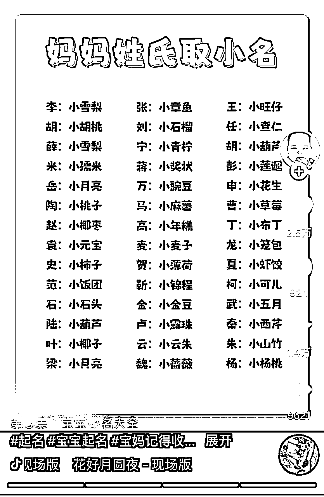
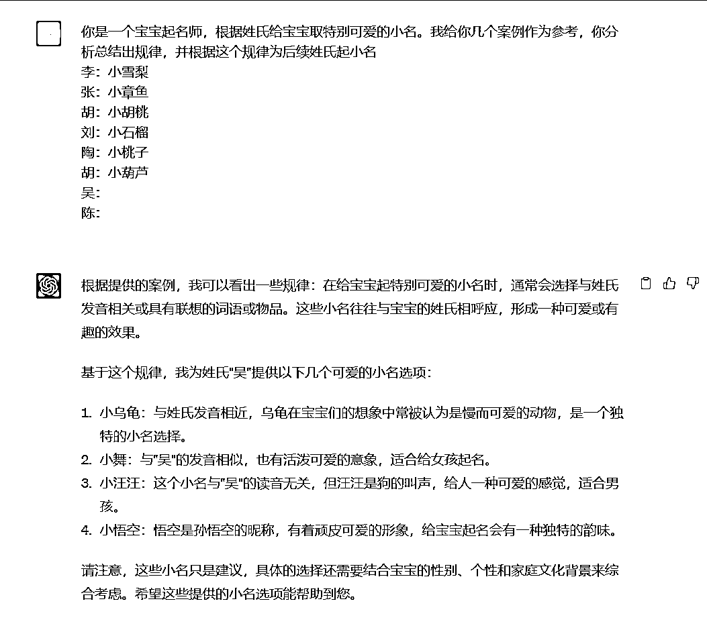
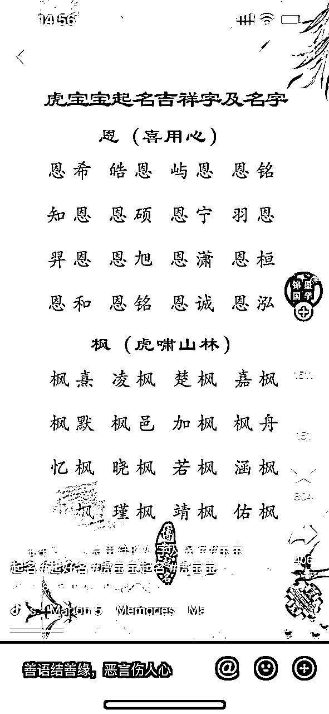
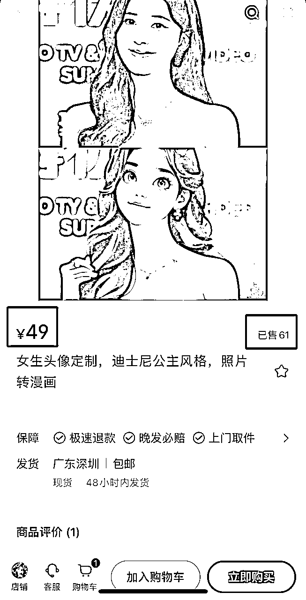
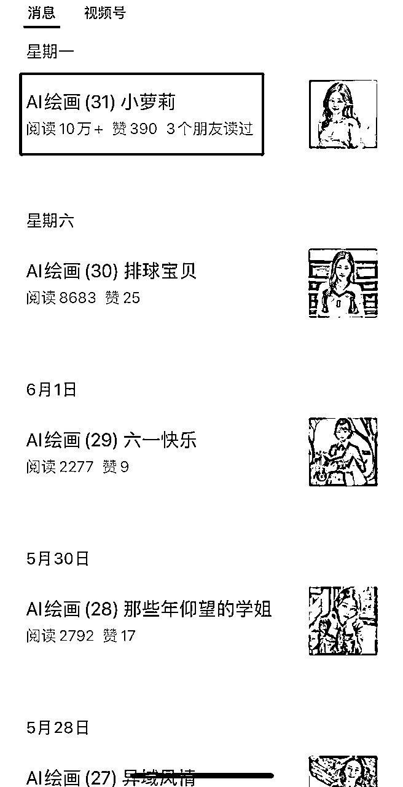
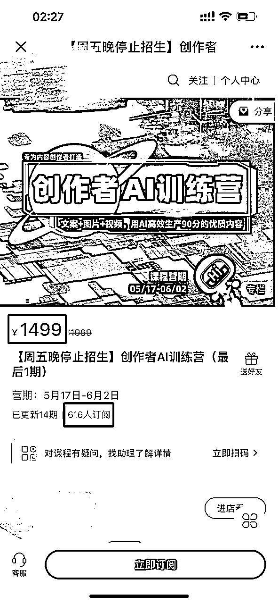

# 《AI变现异常值案例库》——第1期

> 来源：[https://ry5hwpuf7b.feishu.cn/docx/LLvLdO3s8oHRoTxniOscOKDanEd](https://ry5hwpuf7b.feishu.cn/docx/LLvLdO3s8oHRoTxniOscOKDanEd)

《AI变现异常值案例库，5种方向10个案例，副业项目灵感启发》

第一期先分享5种方向，10个案例

1.宝宝起名号

2.AI热点资讯号

3.头像壁纸号

4.小说推文号

5.流量收益号

大家好，我是吴东子

我的所有资料都在公众号「吴东子AI」

本来想写一篇AI变现方法论，把AI现有的技术方向，应用场景，变现案例都整理出来

但实际写的时候发现难度太大了，因为人工智能这个话题太大了

小到把文字排版成PPT好像也能叫AI，大到汽车领域的无人驾驶技术，以及苹果前些天发布的眼镜用到的视觉追踪技术也叫AI

做不到相互独立和完全穷尽，就算强行用一个分类把他们分类了，也会失去“分类”本身所具备的指导意义

所以只好把AI变现方法论这个大话题先放一放，等我具备足够多的信息时再给大家补上

于是我转变为写【AI变现异常值案例库】，侧重于副业项目这款

把我观察到的案例分享给大家，不会做过多的拆解和分析，更多的是偏向于灵感启发

思考这里面的案例有没有你能做的，能复制的，能放大的

可能啥用没有，也可能黄金万两

不知道大家会不会对这个感兴趣，如果感兴趣的人多的话会继续做第二期

严禁抄袭搬运，势必追诉到底！

# 宝宝起名号

用ChatGPT把原有的起名号再做一遍

东子的思考：

1.  了解起名号这个项目的玩法

1.  如何用ChatGPT做起名号的内容

1.  如何用ChatGPT做起名号的产品

# AI热点资讯号

通过“素人视角”（用第一人称手机拍摄屏幕）

讲AI今天又有多牛逼，又怎么怎么样了

一定程度上引发观众焦虑，然后吸引关注

东子的思考：

这种视频类型和账号，是目前AI账号里流量最大的

可以用来快速起号，结合自己或者别人的后端产品去变现

# 头像壁纸号

教程可以看这个

东子的思考：

小白可以直接上手做的副业项目，变现路径清晰，简单易上手，不需要占用过多时间，但上限相对较小

如果你手上没项目的话，不妨先干起来，总好过天天观望

## 萌娃头像定制

## 职业头像收徒

## 头像平台挂载

# 小说推文号

以前的小说推文基本都是通过放解压素材和游戏素材来呈现

现在通过SD文生图，做到声画匹配，让观众体验更好一点

东子的思考：

1.清楚小说推文项目的玩法，自己做账号

2.本身有团队在跑这个项目，是不是可以给团队做内容升级

3.素人是不是可以掌握SD技术，然后做外包，帮别人的文案生成对应的图片

（用SD做小说推文的教程正在写，后续写完会分享出来）

# 流量收益号

## 百家号AI共创计划

百家号新推出的活动，鼓励用AI写作，并且有创作激励

可以利用GPT和AI绘画大量产出薅流量收益

圈友的文章

东子的思考：

百度最近的声量很大，但不是说话大声就有用的，百家号这个产品流量还是太小了

但也许大家都是我这个狭隘的想法，反而说不定里面可以挖掘出一些很好的赚钱机会

## 公众号流量主

东子的思考：

微信生态可能会成为一个很大的趋势

我前段时间用视频号橱窗的体验也很好

如果觉得微信生态会是一个风口的朋友，不妨试着先从公众号入局

1.最直接的就是用GPT和AI绘画去写公众号，因为产出飞快，所以可以搞多个号薅流量收益

2.骚操作一点的还可以在已有内容的基础上不变，但把封面变成各种美女

（因为最近公众号放出了部分流量，让内容变成了推荐形式，所以利用美女图片吸睛获得更高的阅读量，直接用网红图也不是不行，怕风险的话可以用AI美女）

# 知识付费

不过这里面最赚钱的，还得是卖课啊

左为私域卖课，右为公域卖课

东子的思考：

在卖一件产品之前，一定要思考清楚用户真正的需求

绝大多数人卖AI的课都以为是用户要学AI

用户真的要学AI吗？

扯蛋，目前AI很多应用还没法“真正”结合到自己的工作中

注意我说的是真正，不是以为是，感觉是，而是真正应用

用户以为的需求：AI很火，我要学AI，驾驭AI，成为人上人

用户真正的需求：AI很火，我很TM焦虑啊，我要买一个课来解决自己心中的焦虑

用户有时候甚至意识不到他们自己真正需求是什么

所以为什么“李”的人工智能课，讲得全是偏理论的东西，还那么多人愿意买

大家都说他割韭菜，真的是如此吗？我不这么认为

我觉得其实是 韭菜们自己都想要被割，“李”只是把镰刀放在了那里罢了

以上这段话很真实，至少我现在还愿意写一些真话，大伙听得进就听，听不进的话一定是我说错了

好了，这就是这篇文章的内容，如果AI变现异常值案例库感兴趣的话

可以点赞或者评论让我知道大众的反馈，反响好的话会继续做第二期

# 结尾

好了，以上就是我们这篇文章的全部内容

如果你对AI感兴趣的话，可以关注我的公众号：吴东子AI，也欢迎分享给你身边想学AI技术的朋友

里面有我之前发过的所有文章，之后也会持续给大家更新实用的AI干货教程

我是吴东子，用奶奶都能听懂的方式，分享可以落地实操的干货，我们下篇文章再见！