# 《炼丹Lora终极攻略》

> 来源：[https://ry5hwpuf7b.feishu.cn/docx/LUmKdLd0AofzbcxFRkQcg56Rnnf](https://ry5hwpuf7b.feishu.cn/docx/LUmKdLd0AofzbcxFRkQcg56Rnnf)

《保姆级Lora炼丹教程，一站式整合包，让你实现真人模特定制》

大家好，我是吴东子，用奶奶都能听懂的方式分享可以落地实操的干货

我的所有资料都在公众号「吴东子AI」

最近发现很多朋友学会了Stable Diffusion后，都是停留在“玩”的层面。但我觉得让大家“用”起来，才是关键

于是我思考了很久，找出了SD在“应用”层面，最重要的两个功能：Lora和ControlNet

Lora负责把自己生活中有关联的人或物炼制成模型

ControlNet负责更好地“控制”这个“模型”

两者结合，你就能真正把SD用起来，无论是定制自己的真人模特，还是给某个商业产品做成模型，都可以实现

我自己跑了一遍全流程，确保每一步都是经过我自己验证之后，写了一个教程分享给大家

今天这篇是Lora的炼丹教程篇

后续会再出ControlNet的教程，但难度较大，可能需要耐心等待，希望大家理解

文章包含了Lora的功能介绍，炼丹方法，实操案例，大家只要跟着一步一步操作，一定能学会

另外，需要用到的整合包和模型也都给大家打包好放在网盘（链接在文章末尾）

花了很多时间才整理出来，希望对你有帮助

严禁抄袭搬运，势必追诉到底！

# 视频教程

视频是新版赛博丹炉的教程，建议看这个

https://www.bilibili.com/video/BV1H14y197Mv/

以下是基于旧版赛博丹炉写的文字教程👇

界面会有些不一样，但原理都是一样的

# 一、炼Lora能做到什么

## 1.云旅游

通过用自己的Lora可以做出各种各样的照片

可以看到自己穿上各种好看的衣服，出现在世界各地的著名景点

我的女朋友云旅游巴黎铁塔👇

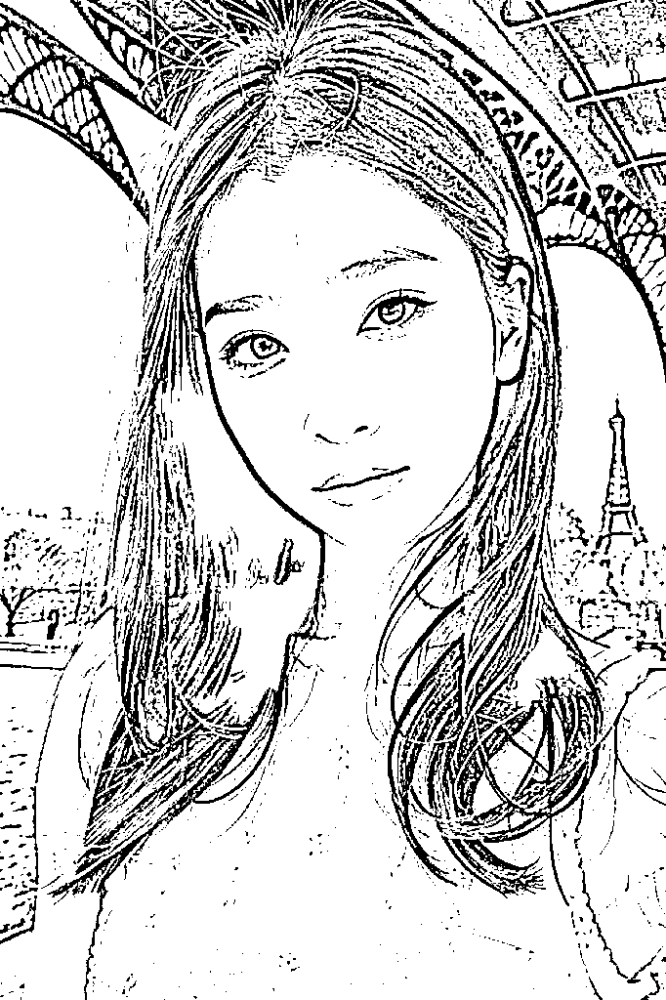

## 2.AI模特

炼出一个自己的模特，让这个模特穿上自己的商品

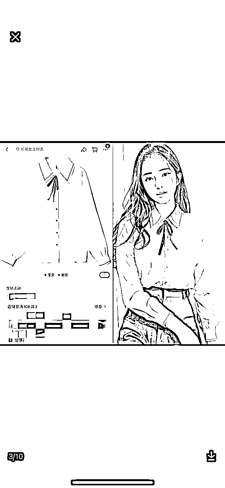

## 3.炼衣服Lora

添加一个衣服的Lora，就可以让人物穿上特定的衣服

## 4.改变画风

通过添加Lora改变照片的画风，这个画风可以自己去训练

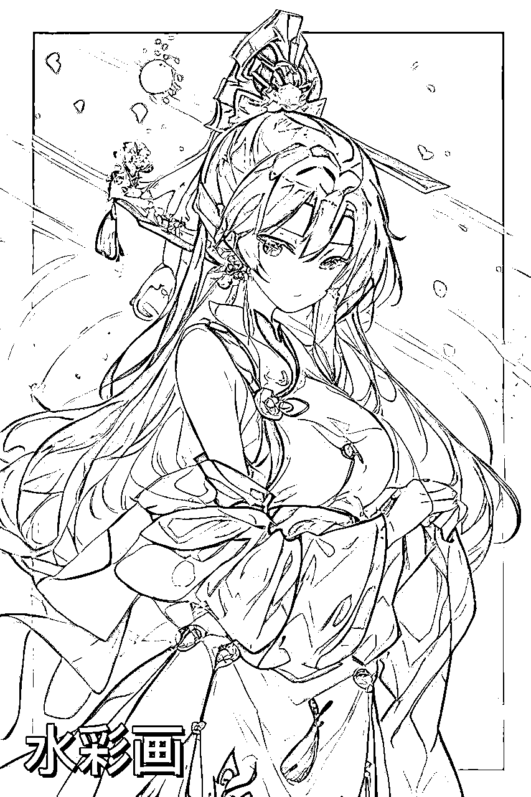

那Lora究竟是什么？

Lora可以复刻人物和物品的特征，固定人物动作，改变照片画风

而且Lora只需要少量的数据就可以训练出来，比训练大模型要简单很多

所以大家可以通过训练自己的Lora，做出定制的图片

但不得不说的是，目前的Lora还不能做到100%相同，尤其是细节方面

但是相信随着之后的技术发展，万物皆可Lora的时代是不远的

给大家看看我自己训练的Lora复刻真实的程度

真人Lora👇

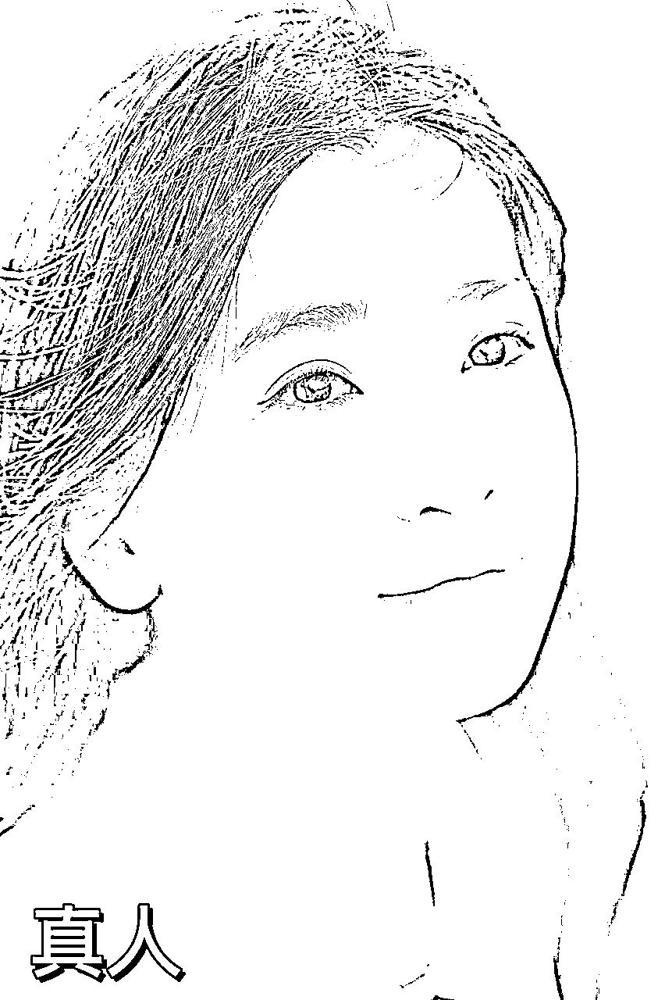

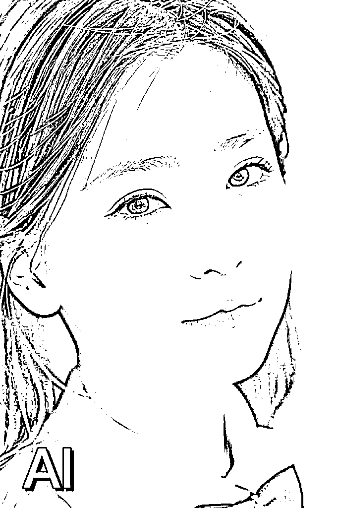

衣服Lora👇

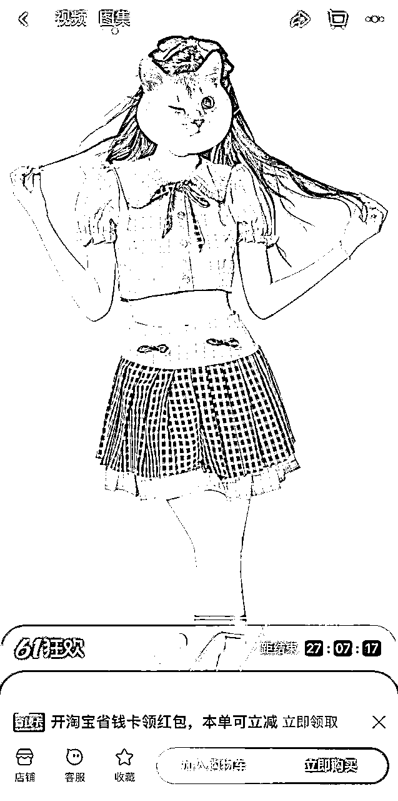

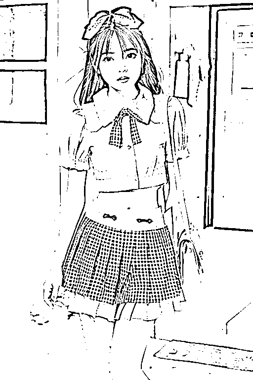

# 二、4个步骤炼制Lora

炼制Lora的方式有很多种

有用脚本训练的，也有在网站界面上训练的，最近还有很多朋友做出来了训练Lora的整合包

它们的训练逻辑都是一样的

所以我们选择整合包就可以了

整合包就是把炼丹所需要的所有工具都整合到一个软件里

炼丹分为以下几步：

1.下载整合包

2.准备素材

3.测试Lora

4.优化Lora

接下来我就用女朋友的照片炼一个Lora

详细的给大家展示具体的操作

# 三、炼丹前的准备

在炼Lora之前，需要大家先确认一下自己的电脑配置：

1.需要N卡，并且6G显存以上

2.A卡和Mac系统，或者电脑配置不太行的小伙伴建议用云平台

现在讲云平台的使用方法和本地安装整合包

## 1.A卡和Mac系统的福音，云平台炼丹

这里我们用到的云平台是青椒云

下面内容是没有广告的噢，如果大家有其他更好的方法也可以分享出来

在这个平台上面就相当于我们远程控制别人配置更好的电脑

点击链接注册账号，然后下载青椒云

https://account.qingjiaocloud.com

下载好了之后登录账号

先在上面选择“华南4”

然后点击“新增云桌面”

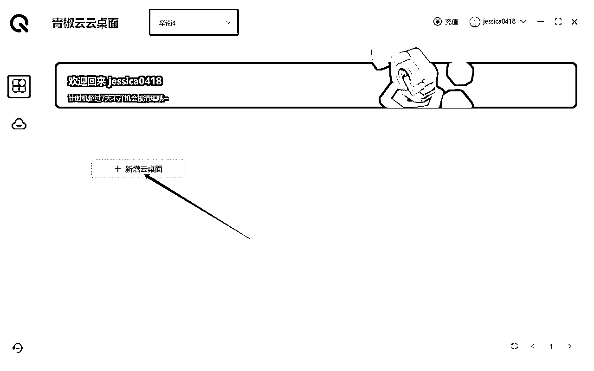

先选择“定制产品”

找到“赛博丹炉”，点击右边的“立即添加”

2.5元一个小时，一般新注册的用户会有优惠券，可以免费试用几个小时

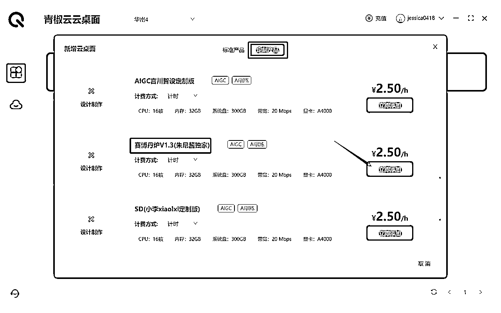

这时候会多出来一个选项框，点击“开机”

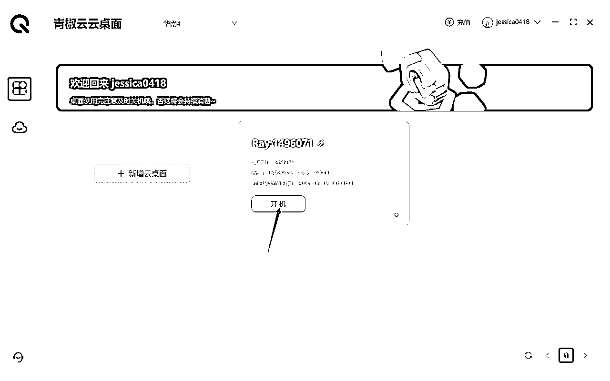

进入云桌面之后，双击“赛博丹炉”的图标就可以开始炼丹啦

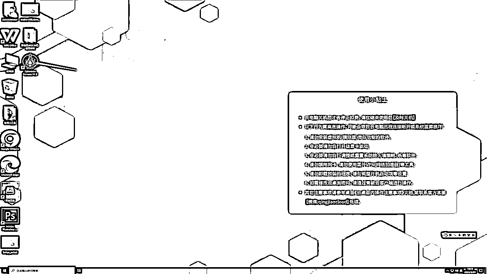

训练完之后，主页最上面有一个下拉按钮，然后点击“断开链接”就可以退出云桌面

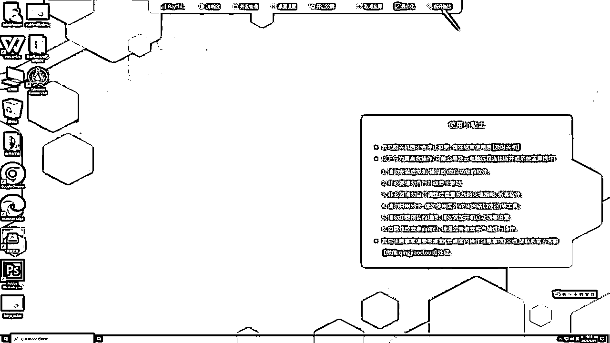

退出之后记得给云平台关机，不然会一直计费

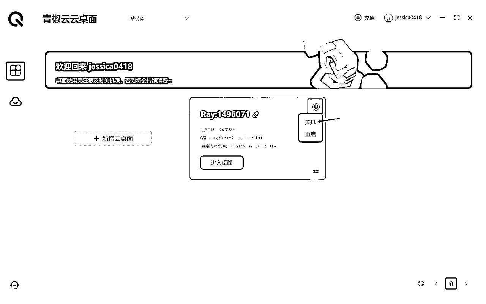

## 2.本地下载整合包，解压即用

如果电脑配置可以的朋友们，还是建议在本地下载整合包（云平台会有一点点卡）

我这里用的是B站up主朱尼酱的整合包

秋叶的整合包我也试过炼Lora，两个对比下来，我觉得朱尼酱的整合包会更适合小白

在我分享的网盘链接里面可以下载整合包（链接在文章末尾）

下载好了之后把它解压到D盘或者E盘，不要放在C盘！！

打开解压之后的文件夹，在“cfurnace_ui”文件夹里面找到“赛博丹炉”的应用程序

双击打开

可以创建一个桌面快捷方式，这样就不用每次都要打开文件夹来找了

看到这个页面就安装好了，点击“开启炼丹炉”就可以开始炼Lora啦！

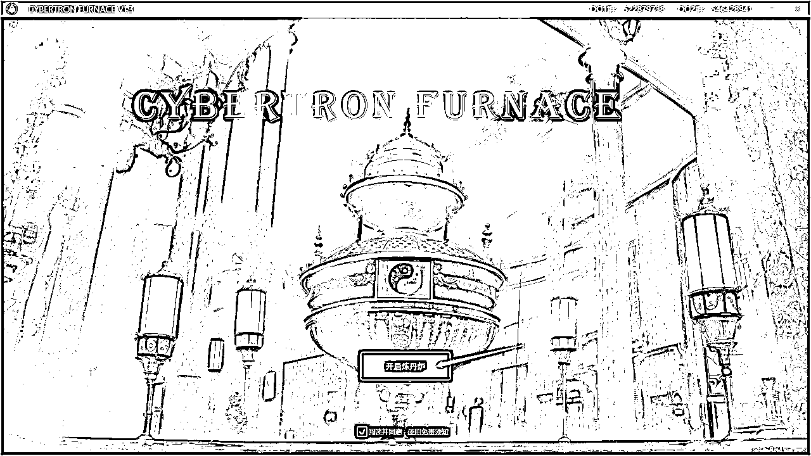

# 四、选择合适的大模型

跟画图一样，炼Lora之前也要先选一个大模型，确定Lora的画风

点击可以直接打开文件夹，找到SD的文件夹调用里面的模型

我这里打算炼一个真人模型，所以选用“chilloutmix”的大模型

如果是炼二次元模型就可以选“anything”

如果你的Stable Diffusion里面没有模型，那就要先去下载模型噢！

网盘里面已经给大家放了这两个大模型

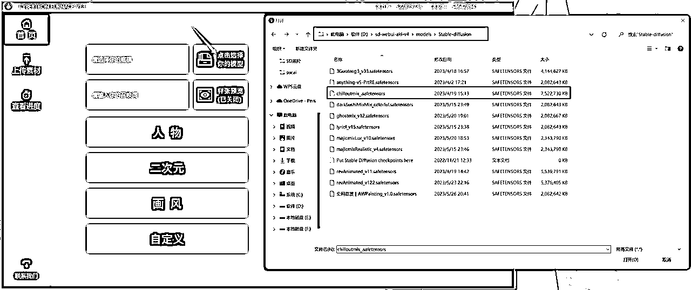

第二个框框就是输入这个Lora的名字

右边的“样张预览”可以打开，这样我们等一下在训练Lora的过程中就可以实时看到照片

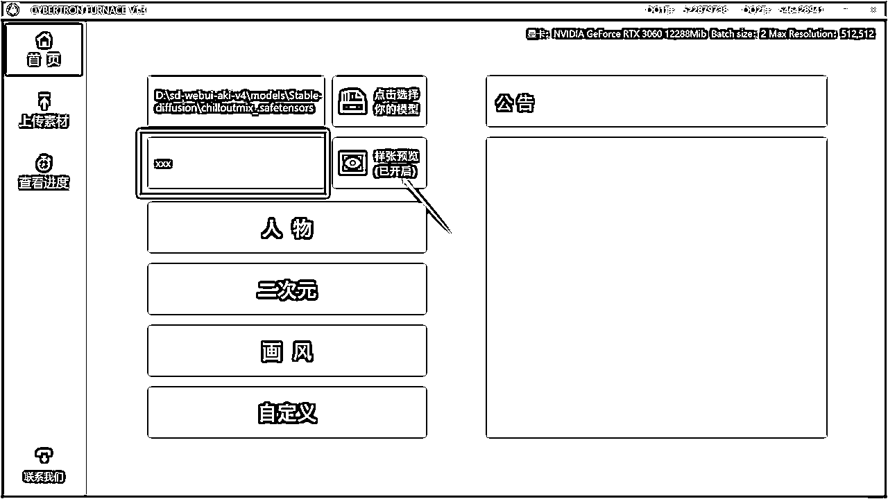

再往下就可以选择一个我们要训练的Lora的类型

选择之后就会帮我们选择默认的参数

训练真人Lora就选“人物”

训练二次元就选“二次元”

如果想炼绘画的风格可以选画风

除此之外还可以自定义去炼平面设计图或者建筑之类的

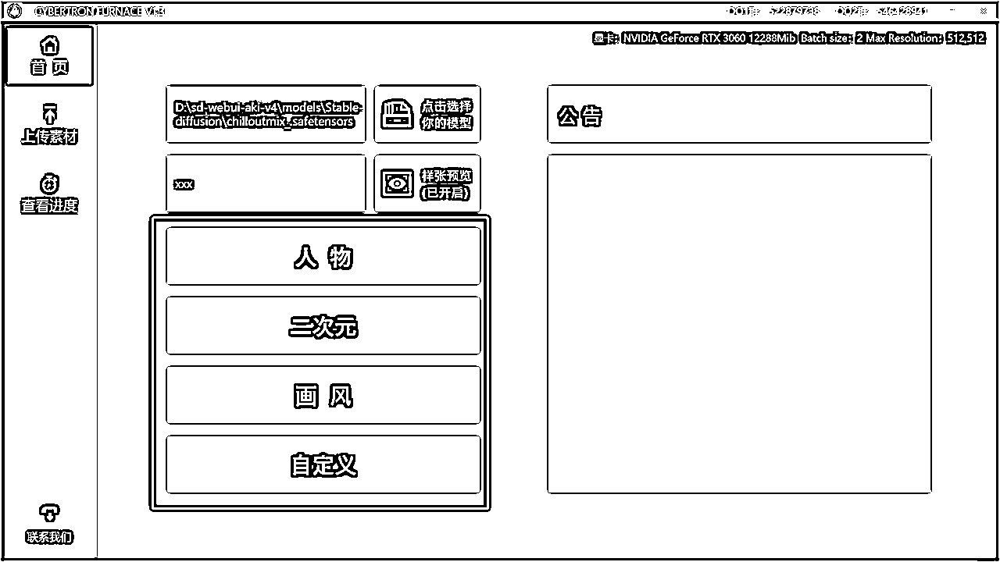

# 五、高质量素材的制作

设置好参数之后，我们就可以上传照片素材了

这些素材就是我们要喂给AI学习的素材

素材的质量非常重要！！

它直接影响最后出来的Lora的质量

我们的素材需要满足几个点：

1.上传20~30张照片

2.素材要高清！！！

3.多角度照片

这里我就以炼真人Lora为例子，上传真人的照片

点击“删除全部”把默认的素材删掉

然后点击“上传素材”，上传自己的照片

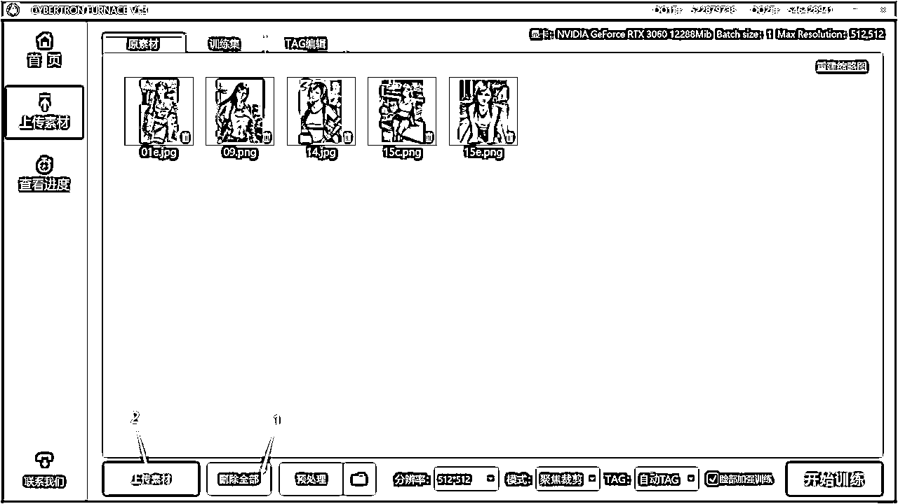

一般情况下，下面的参数默认就可以了

不要选择太高的分辨率，容易爆显存

另外，如果训练真人Lora，可以勾选最右边的“脸部加强训练”

勾选了之后就会再多裁剪出来一组只有脸的照片，这样AI能学到更多的脸部细节

接着点击“预处理”

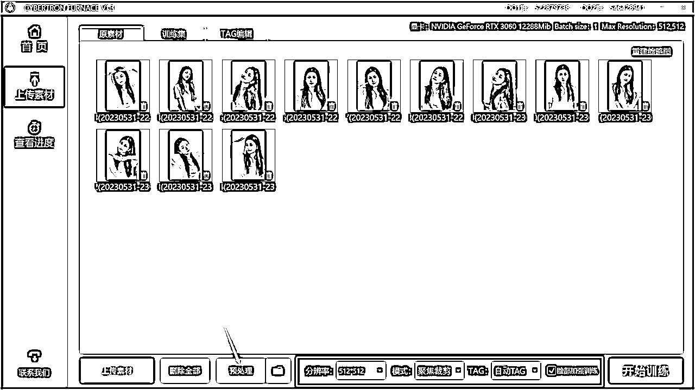

处理完之后训练集里面就会有两组素材

一组是原素材，还有一组就是裁剪的只有脸的素材

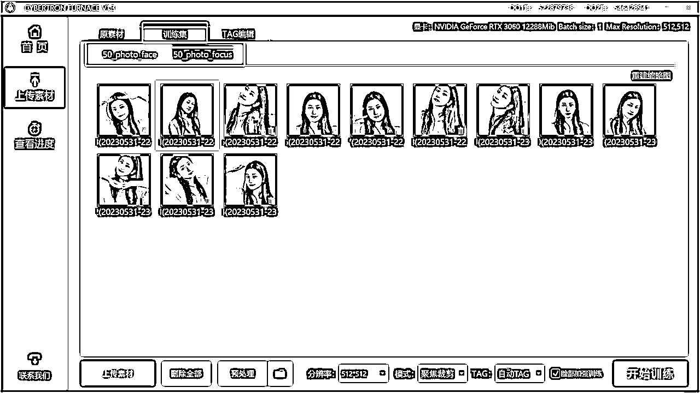

人脸素材里面会有些识别不准确的照片

我们点击照片右下角的图标把照片删掉

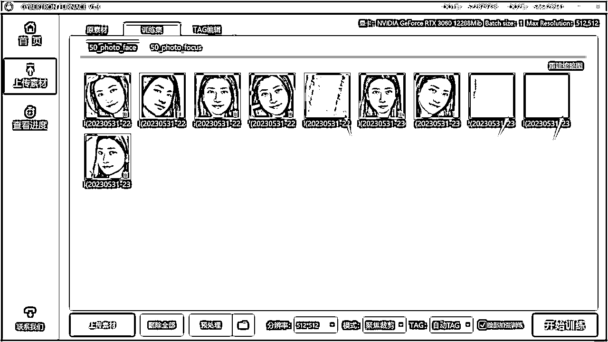

再看到“TAG编辑”

这里面就是形容照片的一些标签

右边是所有照片的标签

单独点击某一张照片就可以看到这张照片的标签

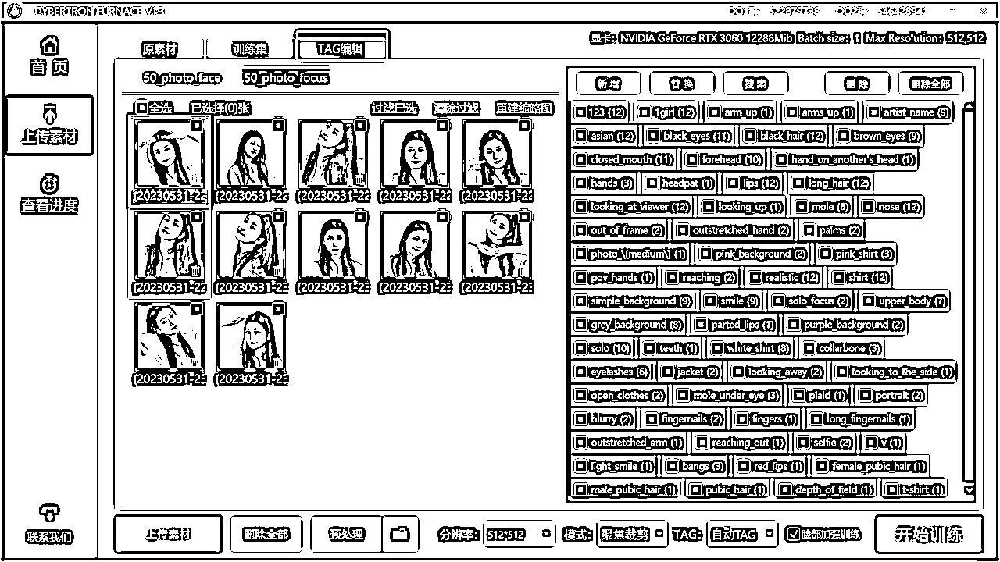

这里我们需要把照片大概检查一下

手动删掉或者增加标签

标签和照片对不上，AI就会学错了

比如这张照片的标签里的“夹克”和“白色衬衫”就是错的

把这两个标签勾选上，点击“删除”

然后新增一个“粉色衬衫”

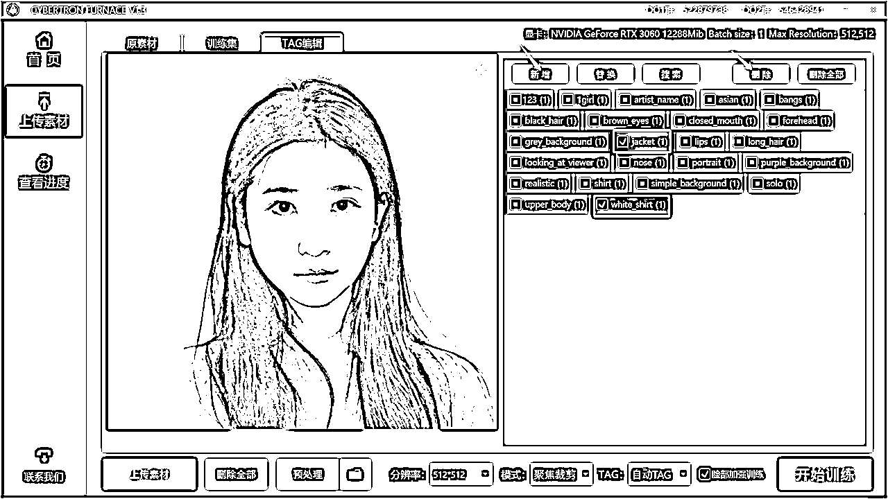

对于标签还有一个一定要知道的点！

如果你想保留人物的某个特征，那就要把对应的标签删掉，这样AI就会默认这个人就是有这个特征

如果你想灵活调整某个特征，那就要把这个特征打上标签

举个例子：

假如现在我要训练这个动漫人物的Lora

粉色头发和绿色眼睛就是这个人物的特征

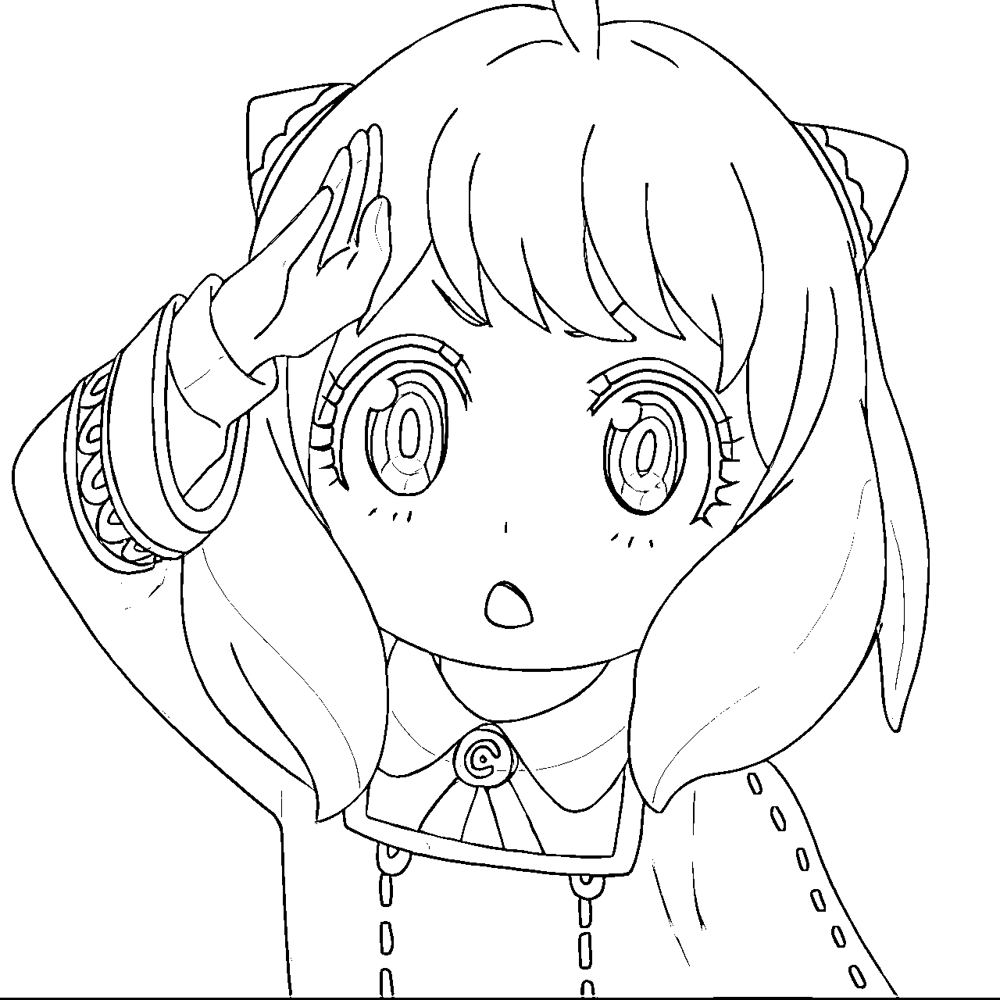

如果你后续在SD里做这个动漫人物的照片希望可以保留她的特征

那我们就要把粉色头发和绿色眼睛的标签删掉

这样不管我们输入的关键词是白头发或者黑头发，出来的都会是粉色头发

如果你想在SD里自定义头发的颜色，那这里的标签就要打上“粉色头发”

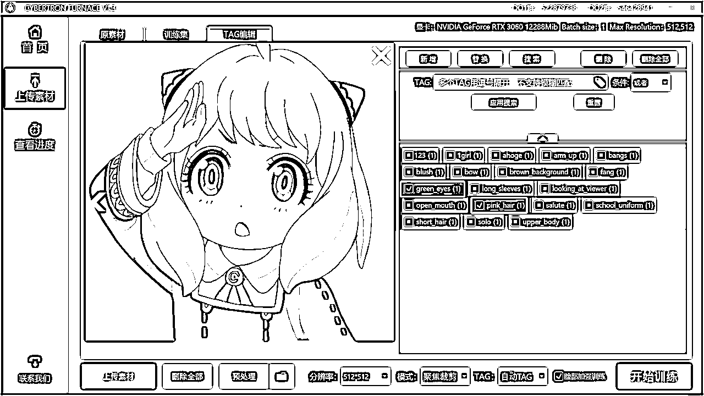

好啦回归正题！

所有标签处理好了就可以点击右下角的开始训练啦

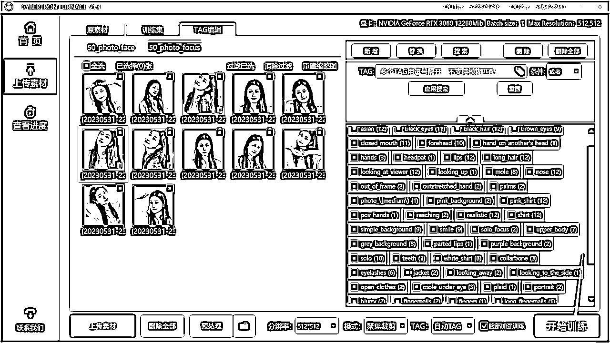

# 六、耐心等待的训练过程

看到这个页面就是模型正在训练中

到这一步只要耐心等待就可以了，没什么需要操作的

我们可以看一下下面的参数是什么意思

“Steps”就是训练步数

每训练50步右下角就会出现一张图片

那样就可以实时看到Lora的样子

这个白头发和红裙子是后台加上去的关键词

可以测试Lora的泛化性

泛化性就是看这个Lora能不能自由的去更换照片里的东西，比如发型、发色、服装之类的

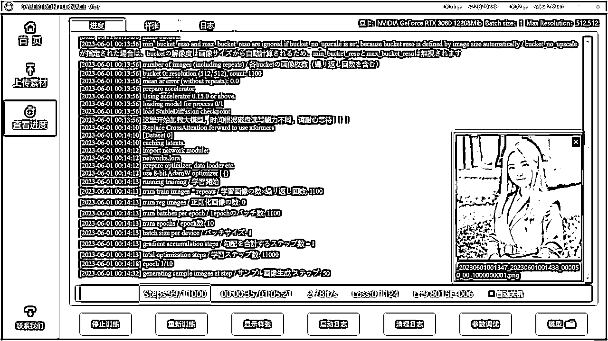

Loss可以用来参考模型的好坏

一个好的模型Loss值在0.07~0.09之间

具体好不好还是要在Stable Diffusion实际测试才知道

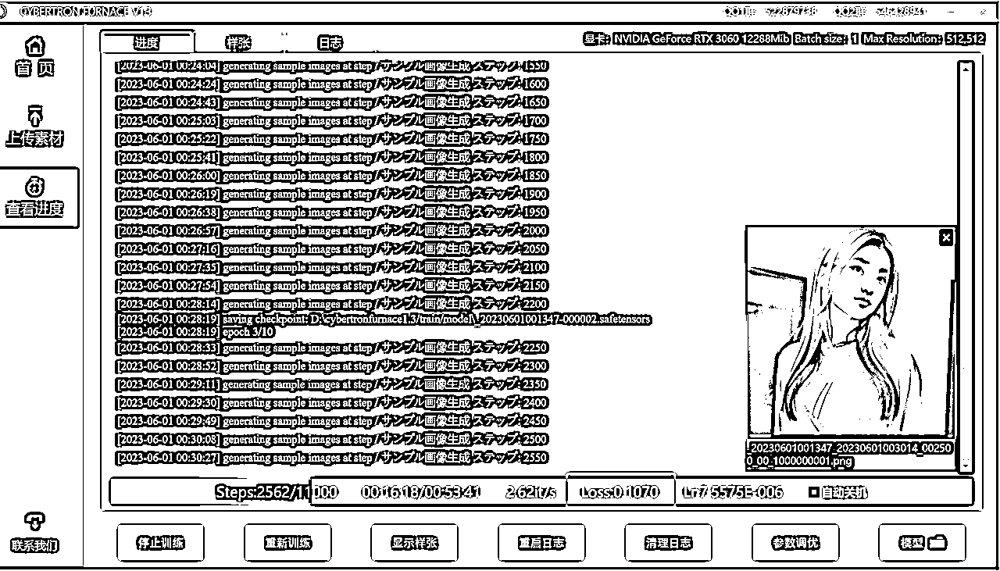

等训练完了之后，点击“模型”

就可以看到生成出来模型

按照默认参数训练会出来10个模型，但不是说最后一个模型就是最好的

有可能炼到第六第七个模型就已经够了，再往后的模型就已经训练过度了

所以这些模型还要实际在SD测试一下，才知道哪个是最好的

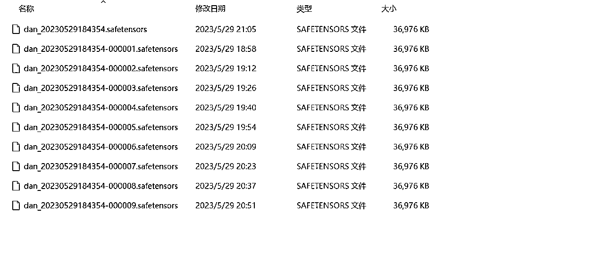

# 七、如何测试Lora的好坏

模型生成出来之后就可以到Stable Diffusion（简称SD）里面生成图片

在SD里面可以生成这么一张大图，可以直接看到所有模型在不同权重下出来的效果

比较一下哪个模型更好，就只保留那个模型就可以了

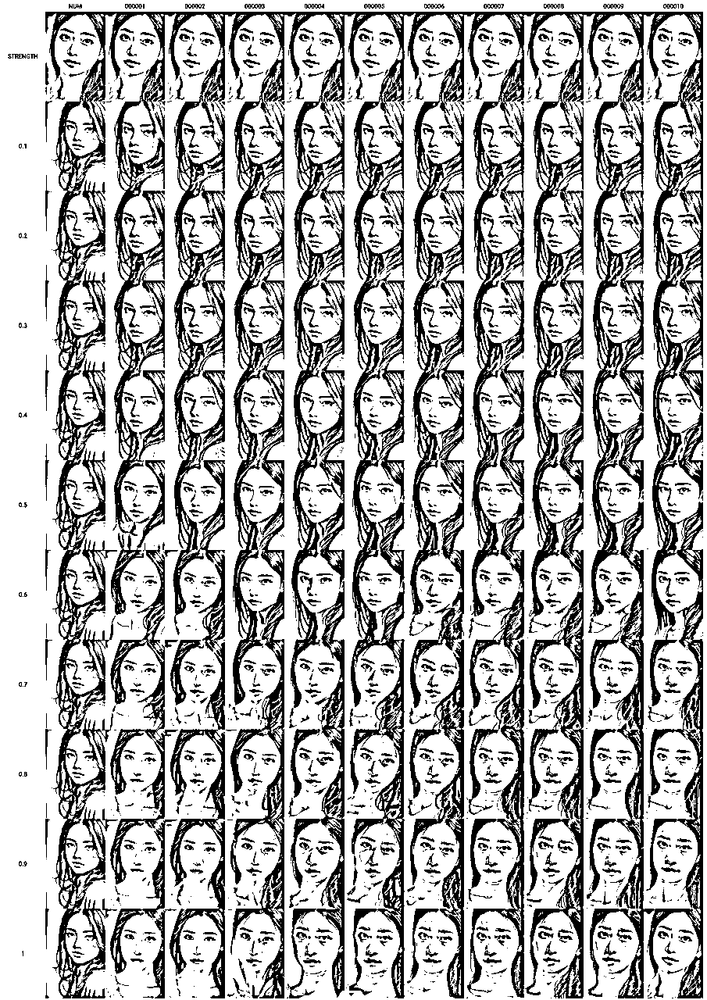

接下来我们就看看怎么生成这张大图

首先把新生成的10个模型复制到SD的models文件夹，放到Lora文件夹里面

可以在Lora文件夹里新建一个文件夹来存放

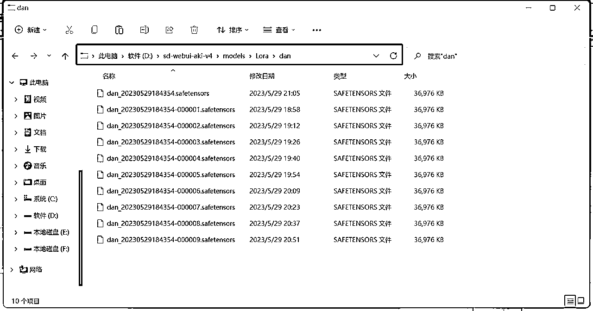

然后把没有序号编码的那个Lora重命名

没有序号编码的Lora就是最后生成出来的一个模型

为了方便进行测试，统一一下所有模型的名称

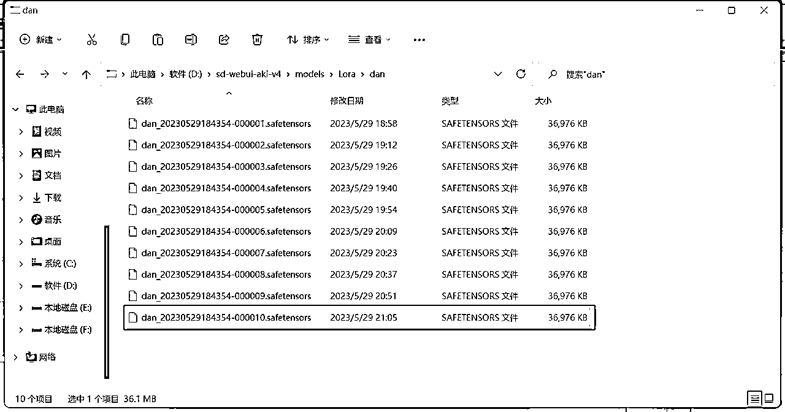

保存好模型之后就可以打开SD进行测试了

首先先选一个大模型

你用哪一个大模型来训练lora就选哪个大模型

然后输入正面关键词和负面关键词

正面关键词可以输入一些质量词，比如最高质量、高清画质、大师杰作等等

负面关键词直接复制我们以前用过的就可以

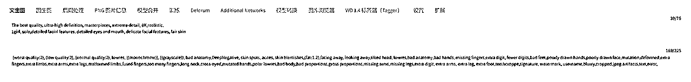

接下来就是选用我们刚刚炼好的Lora

随便选一个都可以

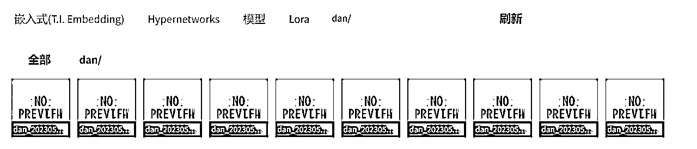

选了Lora之后，我们就会在关键词的文本框里看到这串Lora的编号

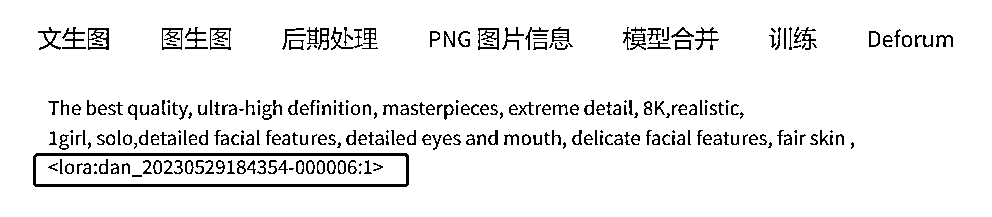

然后把“000006”那段数值改成“NUM”

把最后的数字“1”改成“STRENGTH”，也就是权重的意思

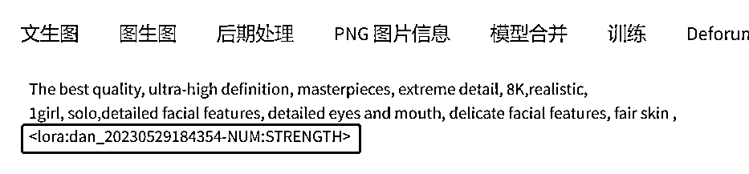

迭代步数，采样方法这些参数大家可以按照自己的习惯去修改

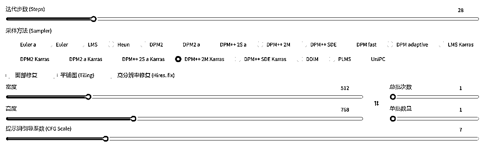

然后滑到最下面找到“脚本”

在脚本里面选择 “X/Y/Z图表”

X轴、Y轴类型都选择 “提示词搜索/替换”

X轴的值输入：NUM,000001,000002,000003,000004,000005,000006,000007,000008,000009,000010

这里的序号对应的就是我们10个Lora的编号

Y轴值输入：STRENGTH,0.1,0.2,0.3,0.4,0.5,0.6,0.7,0.8,0.9,1

这里的序号代表的是Lora的权重

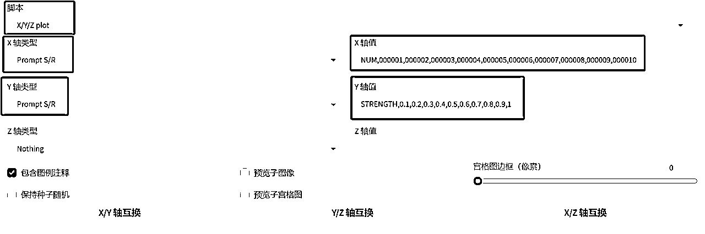

全部参数设置好了之后就可以点击“生成”

生成出来就是这么一张大图，可以看到10个Lora在不同强度下的表现

在这些图里面找到一张跟本人最像，效果最好的图

就可以知道哪个Lora在多少强度的时候效果是最好的

像我可能就会选第七个Lora，在权重0.7的时候的照片

接下来我们就可以测试一下这个Lora的泛化性

在关键词里面输入一些照片里没有的东西

比如原来图片是黑色头发，那就在关键词里面输入一个白色头发

原来图片是粉色衣服，那就可以让它变成黑色衣服

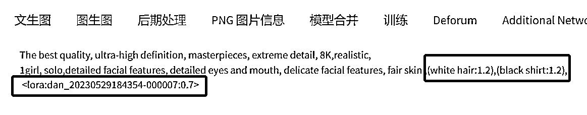

点击“生成”，看一下出来的照片

头发一半白一半黑，衣服变成黑色

那我觉得这个Lora就已经合格了

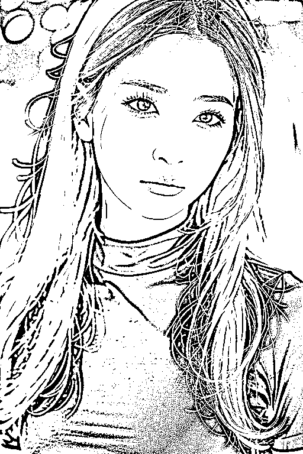

来看看真人和AI的对比

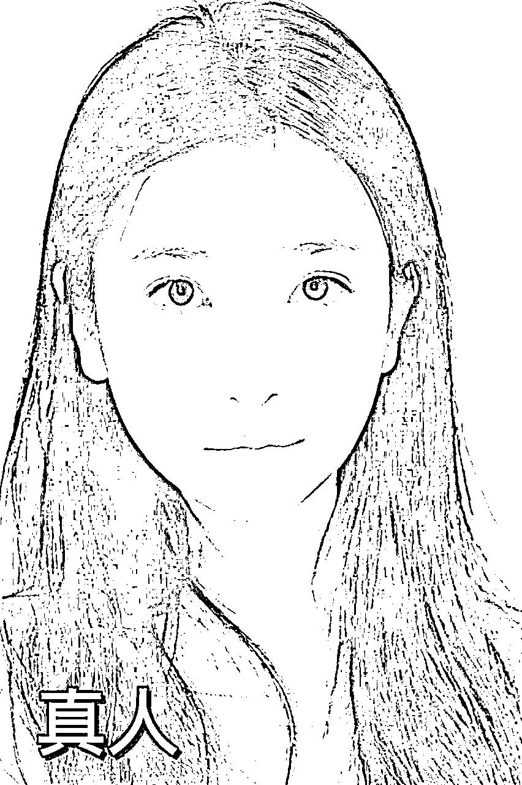

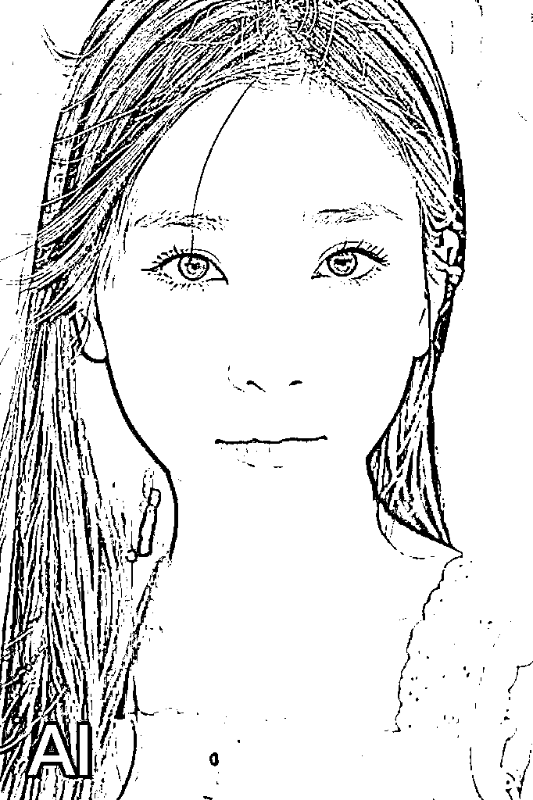

# 八、如何优化Lora

实际上，炼丹是一件比较玄学的事

有的人可能一次性就能炼出自己满意的Lora

但有的人可能要炼好几次才出来一个好的Lora

这时候我们可以通过调整训练的参数再重新炼一个

前提是 确保我们的喂给AI的素材是高质量的！

不然不管怎么修改参数，出来的Lora都是不合格的

这里我们就把炼Lora会遇到的问题分成两种情况

1.Lora出来的照片不像本人：AI没学好

2.Lora过拟合，甚至出来的照片崩了：AI学过头了

过拟合就是不管输入什么关键词，出来的照片都是你喂给AI的照片

没办法自由控制人物的服装、发型、发色等

点击“参数调优”我们就可以自行设置参数

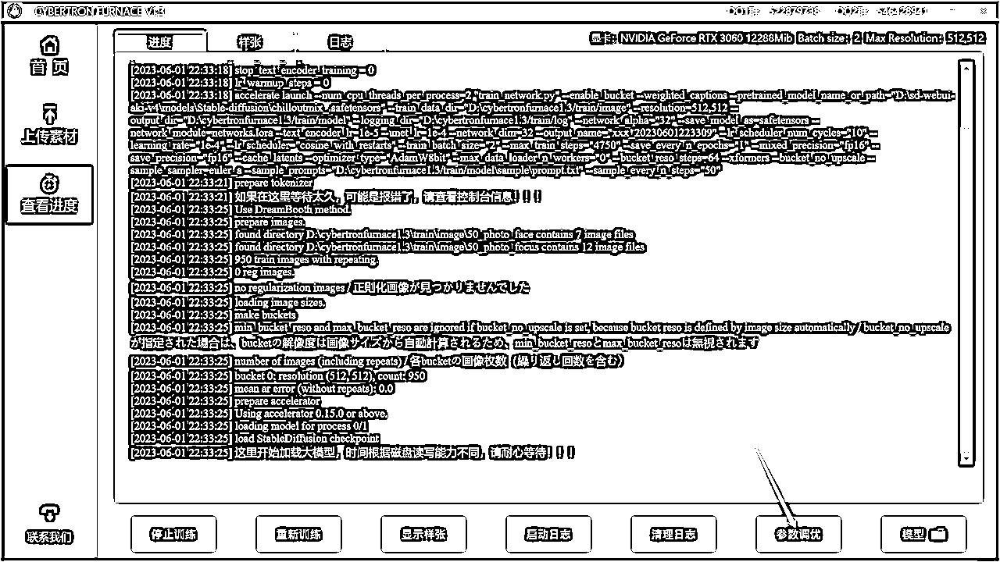

如果生成的照片不像本人，那就可以适当增加Repeat（学习步数）值

如果照片过拟合了，那就减少Repeat值

其他参数都可以不用调，因为默认的参数就差不多是最优值了

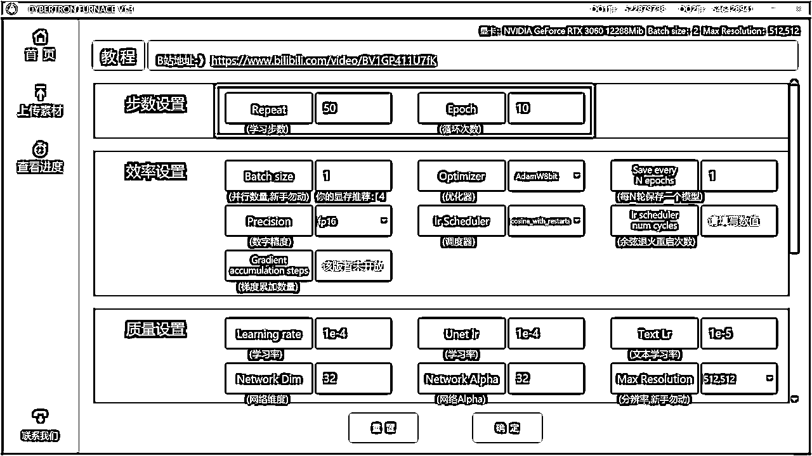

# 九、训练衣服Lora

除了训练人物Lora以外，还可以训练物品的Lora

具体的操作方法其实跟炼人物是一样的

这里我就在淘宝随便找了一套衣服，把这套衣服炼成Lora

SD生成出来的照片👇

还做不到完全一模一样，不过大致上可以还原了，需要后期再用PS修整

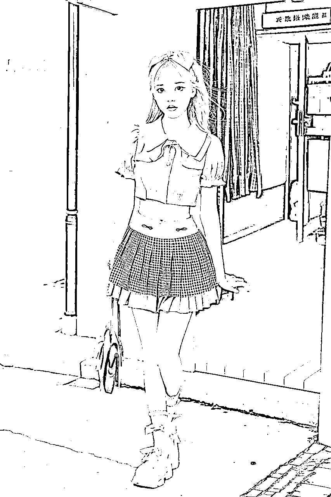

# 十、结尾

好了，以上就是我们这篇文章的全部内容

如果你对AI感兴趣的话，可以关注我的公众号：吴东子AI，也欢迎分享给你身边想学AI技术的朋友

里面有我之前发过的所有文章，之后也会持续给大家更新实用的AI干货教程

我是吴东子，用奶奶都能听懂的方式，分享可以落地实操的干货，我们下篇文章再见！

整合包、模型：

链接：https://pan.baidu.com/s/1dzhkZc3Hdj9EFcwfeFg2Ag?pwd=wdz6

提取码：wdz6

吴东子AI账号简介：https://ry5hwpuf7b.feishu.cn/wiki/space/7283841978071072772?ccm_open_type=lark_wiki_spaceLink