# 《瞬息全宇宙——平行宇宙终极教程》

> 来源：[https://ry5hwpuf7b.feishu.cn/docx/Lfjedtd4QoCkBhxkgTfcBsG1np0](https://ry5hwpuf7b.feishu.cn/docx/Lfjedtd4QoCkBhxkgTfcBsG1np0)

《瞬息全宇宙终极教程，手把手教你做出百万点赞视频》

大家好，我是吴东子，用奶奶都能听懂的方式分享可以落地实操的干货

我的所有资料都在公众号「吴东子AI」

最近一种叫“瞬息全宇宙”的视频火了，抖音一期视频百万赞，各个博主视频都在带瞬息全宇宙这个标签，于是就有很多朋友催我出教程了，在琢磨了几天之后，终于整出来了

教程包含了插件的安装，界面的讲解，基本看完之后是能做出来和爆款一样的效果的

如果你想定制化操作，也有进阶的知识点让你玩出花样

另外，模型和预设也给大家准备好了，放在文章的末尾，希望能帮助到大家

严禁抄袭搬运，势必追诉到底！

# 一、瞬息全宇宙

最近这段时间，一种叫瞬息全宇宙的视频火了

抖音一期视频百万赞，各个博主视频都在带瞬息全宇宙这个标签

瞬息全宇宙分两种：

一种是【穿越之旅】，另一种是【平行宇宙】

“穿越之旅”就是这种画面不断变化，变成新场景，看起来像一个穿越旅途一样的视频

“平行宇宙”就是固定着原来的照片轮廓，变成不一样的风格的视频

就像是一个人在平行宇宙，平行时空的形态

制作穿越之旅，用到的是Stable Diffusion里面的deforum插件

制作平行宇宙，用到的则是一个叫runway的网站里的功能

两种视频都叫“瞬息全宇宙”，但做法是完全不同的

于是你会发现网络上很多文章，其实都没搞懂两者的区别就教别人做了，甚至很多是教大家用做“穿越之旅”的方式去做“平行宇宙”的效果，结果最后观众其实做不出自己心中想要的效果

所以希望这篇文章能带给大家更准确一点的认识，如果我有说错的地方也欢迎大家指正

这篇文章主要是跟大家分享“平行宇宙”的制作方法

如果想简单的也可用手机剪映APP制作简易版“平行宇宙”

穿越之旅的制作方法可以看这里

# 二、“平行宇宙”怎么做

平行宇宙用的是runway里面 视频生成视频 的一个功能

具体可以分为三个步骤：

1.用剪辑软件裁剪原始视频

2.用runway转换视频

3.将转换的视频拼接到一起

接下来我们一起去做这个坤坤的实际案例！

# 三、处理原始视频

在用runway进行视频转换之前

我们要先处理一下视频素材，把它切成一个个4秒内的小片段

因为runway的免费版本只能处理4秒内的视频

我们需要用到PR或者剪映之类剪辑软件

这里我就用剪映给大家做示范了，因为剪映会更适合新手小白上手使用

没有下载剪映的朋友们可以点击下面的链接下载

https://www.capcut.cn/

下载好了之后打开剪映，导入我们要处理的视频素材

这里我就借用一段坤坤的视频作为示范啦

然后把我们需要进行视频转换的片段全部切成4秒内的小片段

我这里只切成了2秒左右的片段

接下来我们就要把这些小片段全部分别保存下来

选中一个片段，把指针放到片段的开头，按键盘上的“I”

再把指针拉到片段的结尾，按键盘上的“O”

这样就会选中这个区域

这时候就按右上角的“导出”，导出来的视频就是一个1秒钟左右的小片段

导出一个片段之后，我们用同样的方法把其他片段也导出

先点击“取消选定区域”

然后重复上一步的操作，保存其他片段

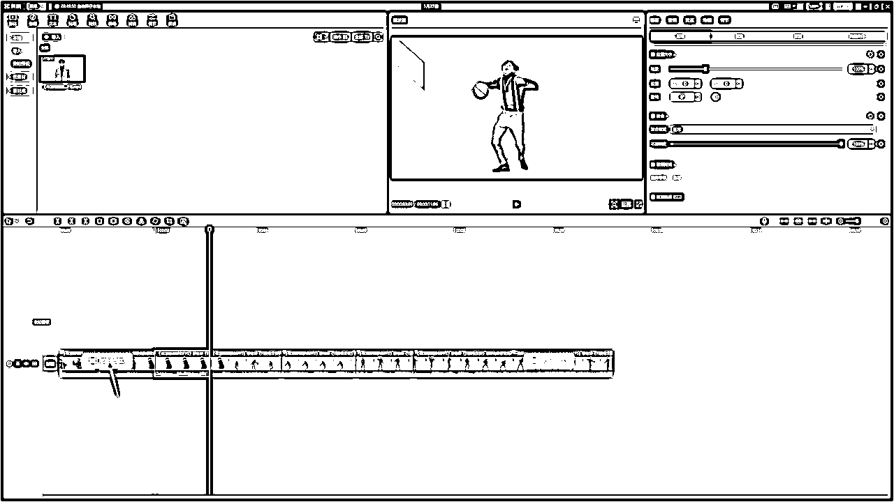

把我们要进行转换的片段全部导出，这一步就完成啦！

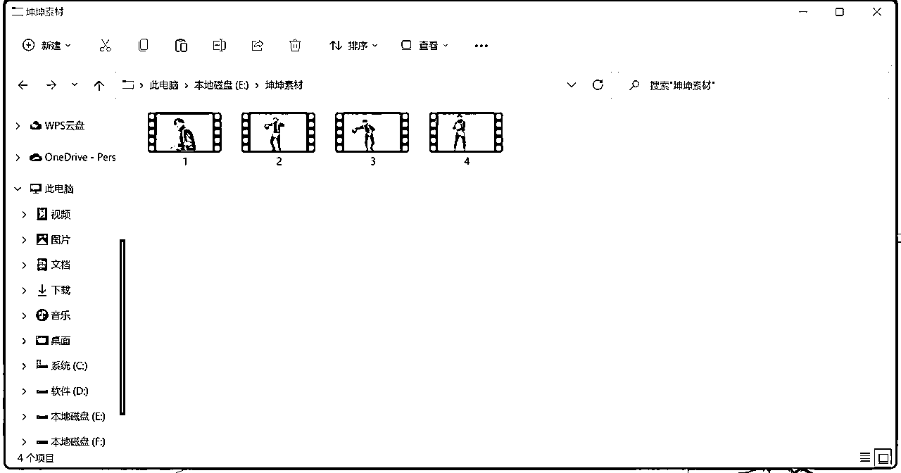

# 四、制作不同风格的视频

接下来我们就要用到runway这个网站进行视频的转换

## 1.注册账号

在搜索网站上搜“runway”，也可以直接点击下面链接打开

https://runwayml.com/

点击进入，然后用邮箱注册一个账号

如果你已有谷歌或苹果账号直接登录也可以

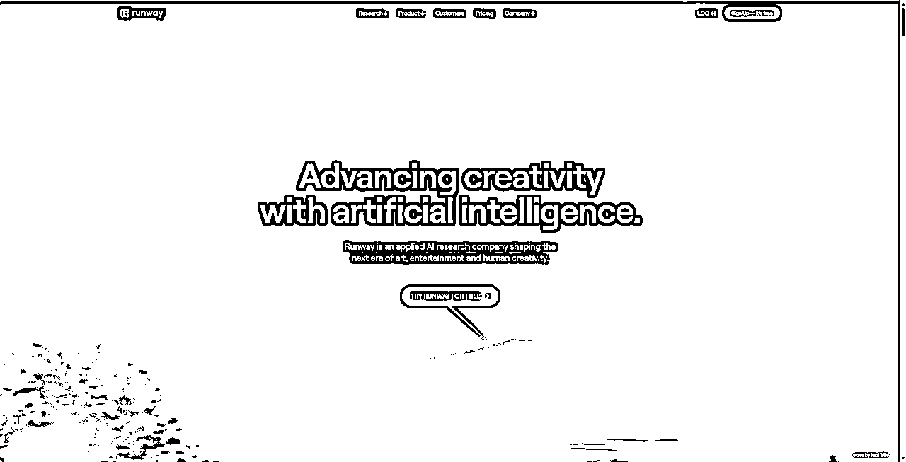

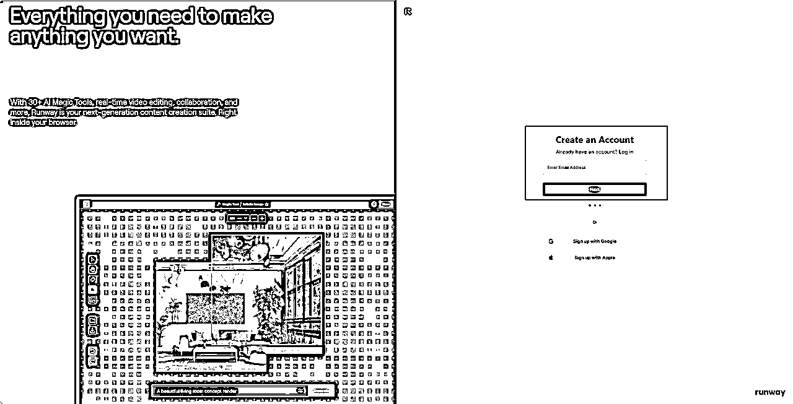

按照网站上面的提示输入用户名和密码

当看到下面这个页面，就去邮箱里面复制一个验证码填上去

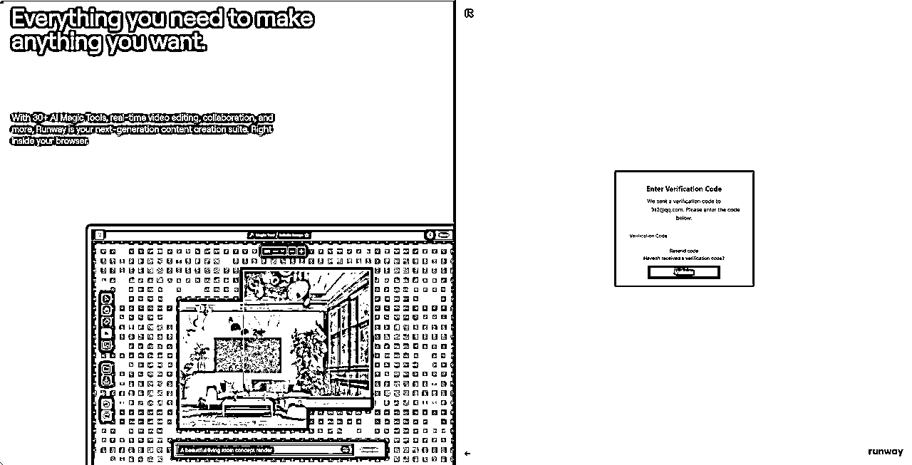

这样我们的账号就注册好啦！

## 2.进行视频转换

我们接下来用到的就是runway里面视频转换成视频的一个功能

在runway里面，有三种转换视风格的方法：

1.导入照片，按照图片风格转换视频

2.用里面已经有的预设

3.输入关键词转换视频

导入刚刚保存的视频片段，右边可以进行照片风格的设置

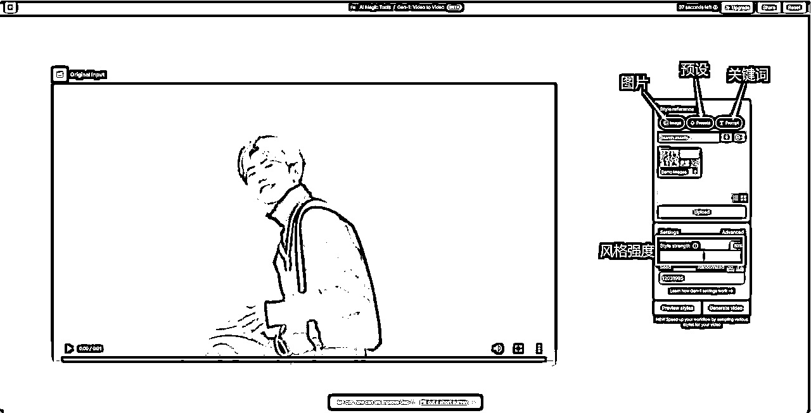

我们先看到图片风格设置

里面有默认的几张照片风格可以选择

还可以点击“Upload”自己上传照片

我这里上传了一张奥特曼的照片，点击选用

然后把风格强度设置到30%左右

左边的按钮可以点击看看是什么效果，如果可以的话就可以点击右边生成视频

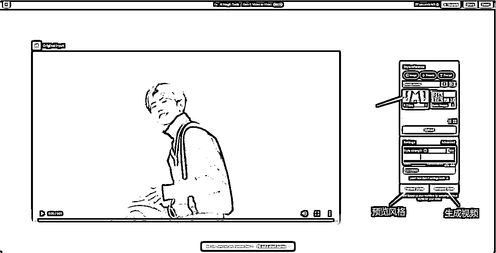

视频生成出来之后，点击右上角就可以保存视频

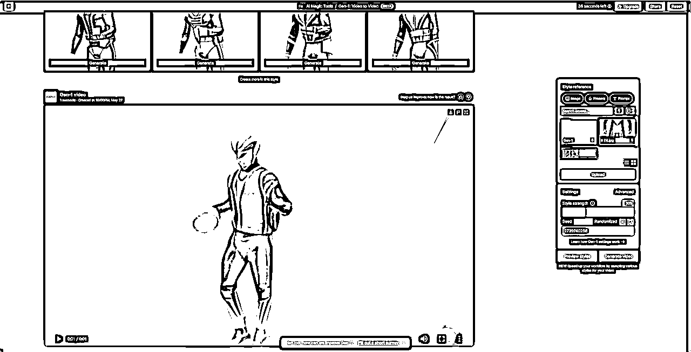

每个片段可以转换三、四个风格，保存视频

然后把所有片段都进行同样的处理

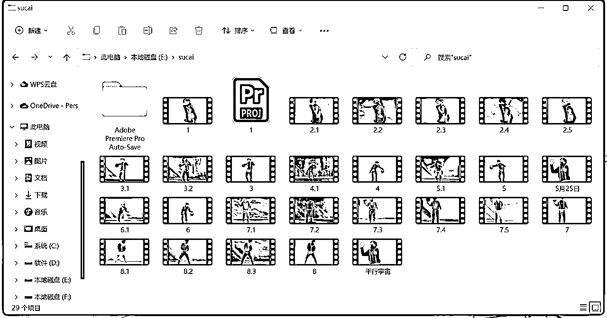

这样我们这一步就完成啦！

# 五、拼接组合，玩转视频

视频素材全部转换了风格之后，我们就可以把这些素材给拼接起来，成为一个新的视频

把刚刚保存的视频导入到剪映

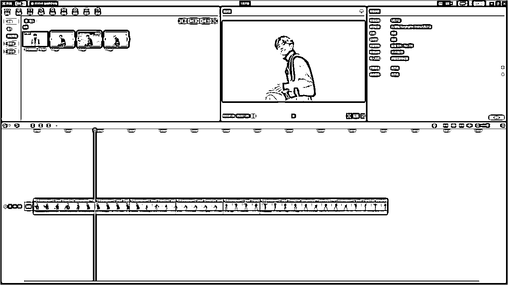

因为runway生成出来的视频会比原来的视频时长稍微长了一点

所以我们要把这些视频整体加速一下，让它们的时长一样长

一般加速到1.5倍就可以了

然后把这三段视频缩短按顺序排，这样一个片段就剪好啦！

接下来把其他片段都这样剪辑好，然后加上BGM

如果有想法的话，还可以给视频做一些变速、卡点之类的处理

让视频看起来更加炫酷！

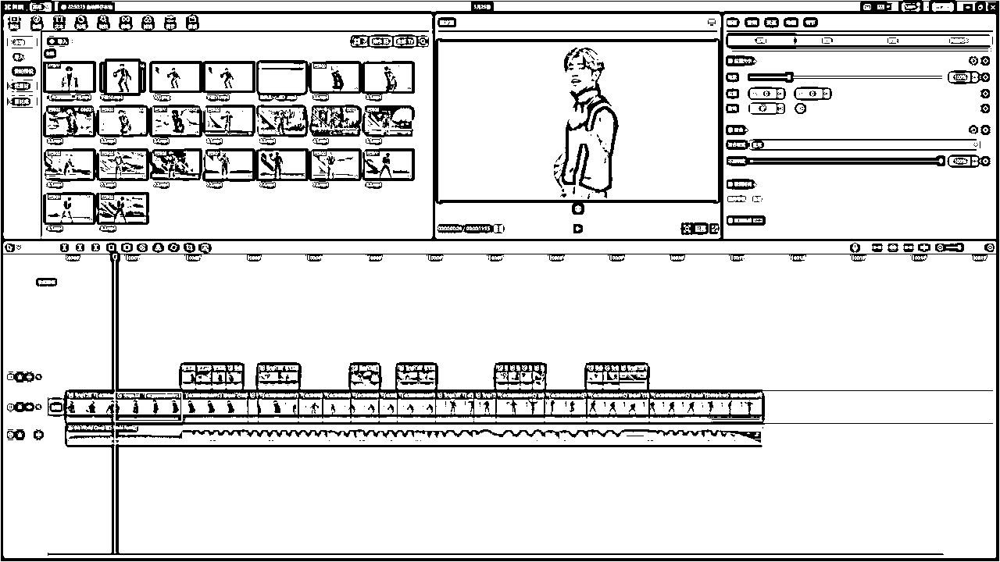

大家一起看看最后的效果吧！

# 六、白嫖runway时长

runway的免费账号是有时长额度的

每个账号可以生成37秒的视频（右上角可以看自己剩下多少秒）

如果大家有几个邮箱的，可以用完时长就换一个邮箱注册

如果邮箱不够用，东子我这里分享一个创建邮箱很快的网站

https://smailpro.com/advanced

点击链接进入网站，然后点击加号新建一个邮箱

然后在弹出来的文本框里面随便输入一些数字或者字母

往下滑找到这些免费的邮箱

随便点一个，然后点击右边的绿色按钮

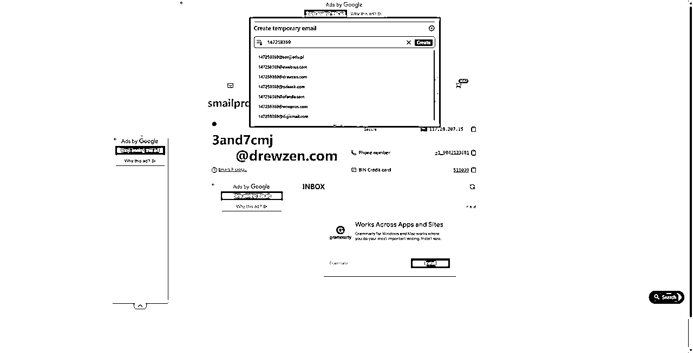

这里就会出现刚刚选择的邮箱

再点击这个邮箱就会复制下来

这时候就可以去注册新的runway账号

等需要在邮箱接受验证码的时候，回到这个网站

点击刷新按钮

就会看到新的邮件

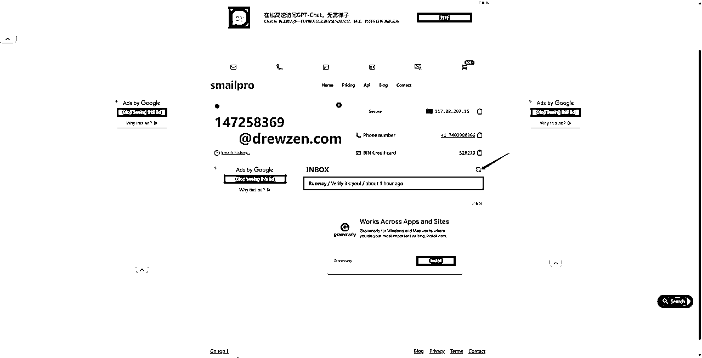

点击邮件就可以看到验证码啦

复制到runway就可以继续注册账号了！

# 七、剪映版瞬息全宇宙

手机上的剪映APP有一个一键制作瞬息全宇宙的模板

只要导入一张照片就可以自动生成视频

打开剪映APP，点击下面的状态栏的“剪同款”

然后在搜索框里面输入“瞬息全宇宙”

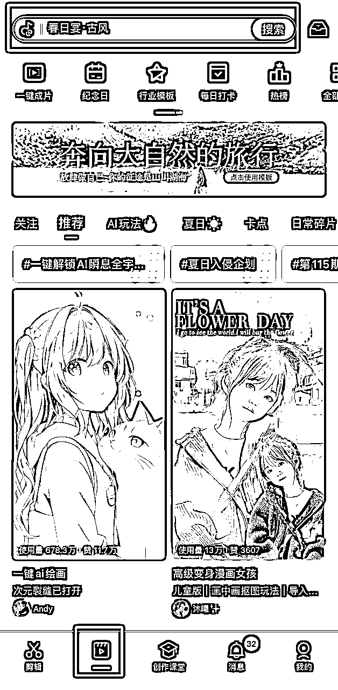

选一个视频点进去，在右下角有一个“剪同款”

每个账号可以免费制作3次

然后导入一张照片，就会自动生成视频啦

最后点击右上角的“导出”就可以保存视频

大家可以看一下最后的效果，但是剪映做出来的视频风格会比较有限

# 八、结尾

好了，以上就是我们这篇文章的全部内容

如果你对AI感兴趣的话，可以关注我的公众号：吴东子AI，也欢迎分享给你身边想学AI技术的朋友

里面有我之前发过的所有文章，之后也会持续给大家更新实用的AI干货教程

我是吴东子，用奶奶都能听懂的方式，分享可以落地实操的干货，我们下篇文章再见！