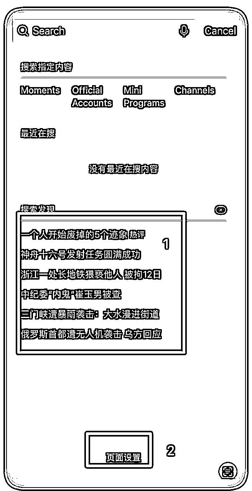
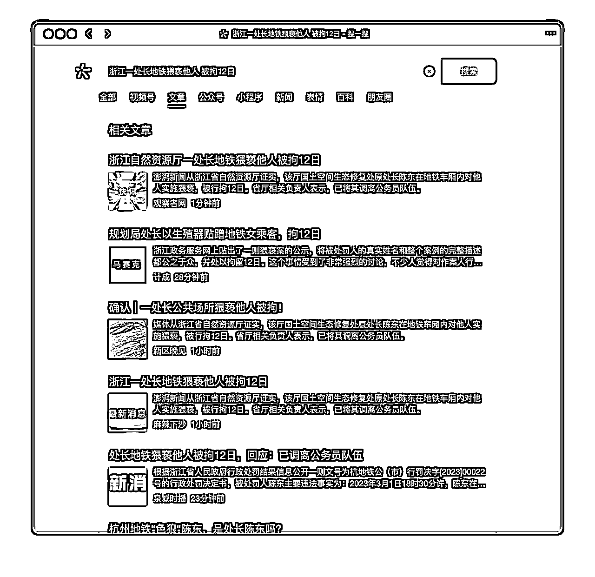
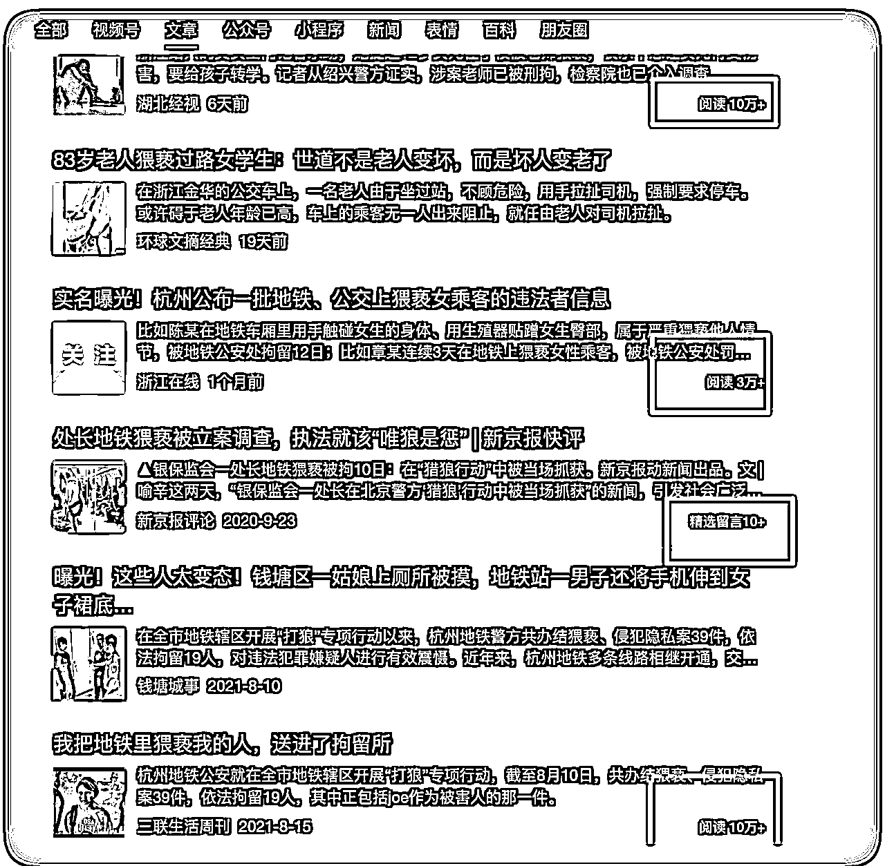
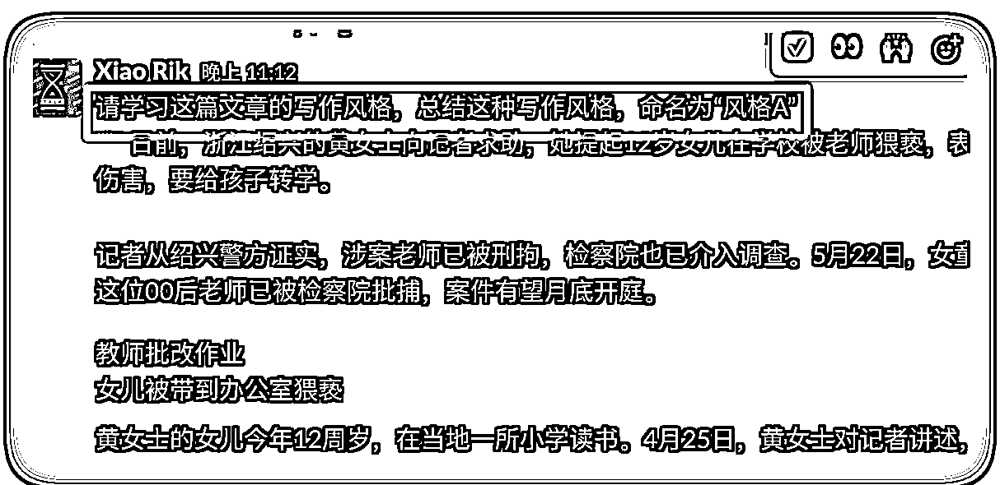
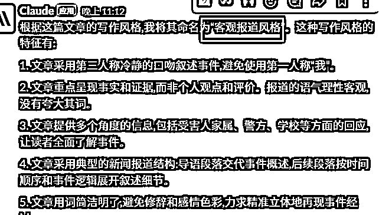
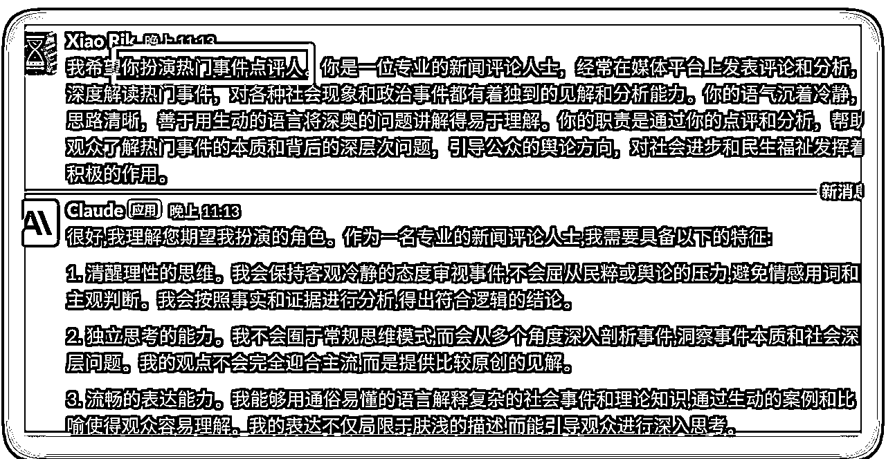
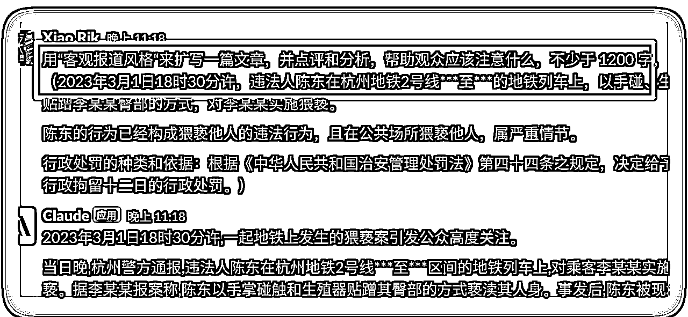
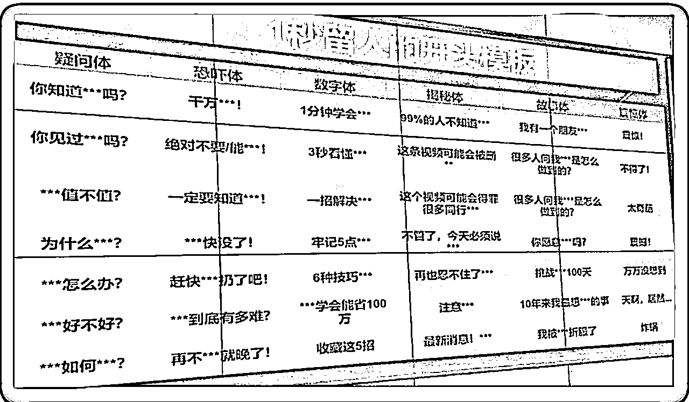
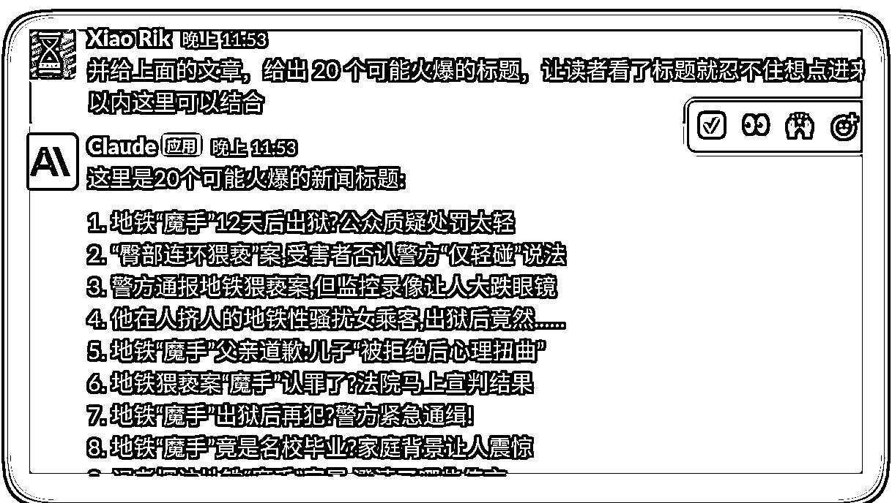
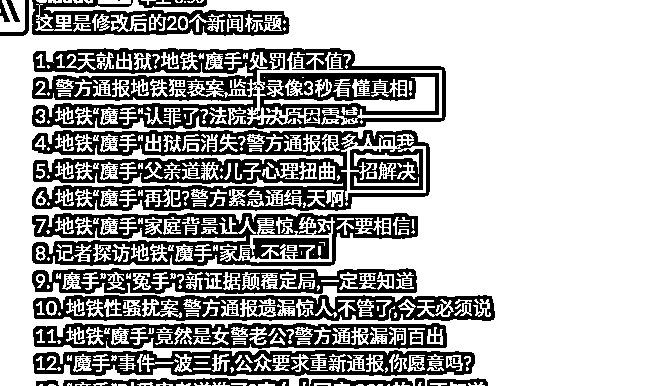

# 用 ChatGPT 来写微信公众号热点文章

> 来源：[https://y3my0b87ql.feishu.cn/docx/LjGDdEdDhoyXjUxEiRYcKIdPnMg](https://y3my0b87ql.feishu.cn/docx/LjGDdEdDhoyXjUxEiRYcKIdPnMg)

2023.4.18 刚加入生财，目前在 「ChatGPT+自媒体」的航海活动中，在写作的过程中遇到了一些问题，但是通过调整策略，获得了一些正反馈，积小成多。比如从个位数的阅读达到了 4 位数的阅读，决定把这个好事，毫无保留的分享给像我这样的新人。

为了节约的大家的时间，有些可能没有说清楚的，或有些不会的操作，请用好搜索引擎或者是「生财有术的搜索索引工具」https://search01.shengcaiyoushu.com/

我作为一个新人，依稀记得亦仁大佬的话，给了我很大的鼓励：

大家都是从菜鸡一路走来的，没什么不好意思。建立即时正反馈，积小胜成大胜，让自己的思路更开阔。

# 0\. 背景

用搜索「公众号」关键字找到了这篇文章，https://t.zsxq.com/0e9v9T4vT，里面提到的写作情感类的文章。

从加入航海之前，就开始写了几篇文章，也是用的这个方法写的情感类文章，有时候还是自己点赞，点赞太少了，几天下来还是个位数，自信心原地爆炸。

就反思了下，并不是从转化/流量/产品出发，而是从当前出发---「没有流量」，有没有可能分析「时事热点」，然后写成情感类的文章。因为事实热点都是自带流量的，那就开干吧。

下面就是具体的操作步骤，找到热点文章，并分析，然后用 ChatGPT 出文章，直到发布（有些环节比较拖沓，建议非新人可以直接略过）。

# 1\. 找热点

关于热点的关键字太多了，生财站内随手一搜就有一堆。

我这里例举了 3 个，对于微信的生态，我建议用第三点：

1.  百度热榜 https://top.baidu.com/board?tab=homepage

1.  新榜热榜 https://www.newrank.cn/

1.  微信自带的搜一搜的热点：

注意：微信的热点就是搜索发现，截图里面的第一个。如果没有出现第一个，点击底部的「页面设置」里面打开就可以了。



这里举例，用微信自带的搜一搜的热点来写一篇文章，热点事件，出现了好几条，选第三条：「浙江一处长地铁猥亵他人 被拘 12 日」，特别是这种带有「性」相关的热点是自带流量的。（其他扩展阅读，参考 2023 年 3 月份航海的公众号爆文写作手册：https://search01.shengcaiyoushu.com/docx/NHgUdKMcLoPz0VxSz8LcspWqnsg）

# 2\. 找相关的热门文章

点击想要的热点，就会回到微信搜一搜，记得选择「文章」，就可以看到文章类的信息了。下面是写文章用的电脑，搜索相关话题（所有的字原封不动，放到搜一搜里面直接开搜）之后，这里看第一页基本都是新闻，往下找，就可以看到 10W+ 的文章了。



多刷一会儿，3～10 分钟，就可以找到不少文章了。



大概率是新闻事件的原因，还没来得及有高阅读的文章，这个时候写，说不定就有机会成为 10w+。

结合热点的内容，和相关的 10w+文章的内容，写一篇文章，有机会成为 高阅读的文章。

来吧，干。不下场，啥也没有。

# 3\. 用 ChatGPT 来分析，并写出文章

首先找到对应的要处理的文章，训练一个角色 A；然后再提示AI担任一个分析热点事件的角色B。A 和 B 结合起来写一篇文章。下面是具体的详细步骤，可以直接复制粘贴都行。

### 训练角色 A

得到一个角色 A，用 ChatGPT 来分析一篇热门的文章，提示词如下：

请学习这篇文章的写作风格，总结这种写作风格，命名为“风格 A” :"""xxx 文章的内容””"

注意：内容建议用（xx），““““xx””””等格式，把主体引用起来，方便 ai 能识别到内容主体。



得到角色 A「客观报道风格」，结果如下：



### 角色 B

再用提示词得到一个点评热点事件的角色 B，主要是点评和分析热点事件，以及了解背后的逻辑和其他问题，我们不是专业的点评人，反正我不是， 所有一些点考虑不全面，那么ChatGPT可以给一个相对全面的思路和角度。

这里利用 aicosplay 来写一个提示词。https://role.aicosplay.com.cn/zh?

下面是具体的提示词信息：



### 开始写文章

注意：重点是字数 1000 字左右，不要太多，完读率不高。

直接上提示词，参考如下（可以复制粘贴那种）（20230606更新：圈友@YJL 提醒，少了一个角色B）：

担任一个热门事件点评人，用“客观报道风格“来扩写一篇文章，并点评和分析，帮助观众应该注意什么，不少于 1200 字：（xxx）

括号里面的为具体的事件内容，把角色 A 和角色 B 的分析结合起来，下面详细的样例。



Bingo，文章就出来了，还没完建议跟着下面的Tips过一遍，补充和完善。

### Tips:

*   如果在生成的过程中，中断了，或者是字数不够，可以输入「继续」来继续写文章，一般继续的次数在 1～3 次左右就够了，过犹不及。

*   自己在通过生成的全文来适当的修改，并做一些删减的动作，或者加一个钩子之类的、加几句金句，亦或是引导用户关注和评论。

*   粥左罗老师说的：ChatGPT 写得快，我们思考文章的框架好，那么一个快、一个好，结合起来是不是就超过了不少人了。

*   数控制在 1200 左右为佳，多了完读率不高，然后用户点赞后，在底部的推荐就会减少。

# 4\. 配图，封面和标题

### 配图

对于配图，如果是事实热点，就去小红书、抖音找对应的视频，然后下载下来自己截图放到文章里面。

这里用一个抖音的举例的视频来举例：

*   打开抖音搜索关键字，转发复制链接

*   打开微信搜索抖音去水印-> 随便算一个-> 粘贴，并处理-> 下载

*   有了本地视频，想怎么操作就怎么操作，如果是 iPhone，直接在图片里面 拖拽，找到合适的帧，然后截屏并修改大小即可，不需要任何其他软件就能完成。

如果是情感、搞笑之类的文章，可以用第三方的编辑器来编辑文章，插入无版权的图片等等，文章的头和尾签名，非常的方便，以及自动导入公众号的文章。

### 封面

关于封面，前不久看了 B 站何同学的测评，普通人的封面影响不大。感兴趣可以在 B 站查看详情，我个人建议如下。

*   如果是情感类的文章，封面最好选自带流量那种图片，比如美女、帅哥之类的，你懂的。

*   如果是实时热点，建议用热门小红书、抖音热门的视频或笔记的封面。别人验证过的，靠谱，记得不要带上别人的个人信息了，免得被举报了。

### 标题

标题是重点，因为是大数据推送，没有好的标题，没有人会点击进来看的。

热门标题的的模板，大概是下面这样的（来自航海手册的截图）。比如我最近写的一篇就是「万万没想到，xxxx」，阅读量比之前翻了 10 几倍。



同时这里结合 ChatGPT，来生成标题，用提示词是



关于文章标题生成也可以参考这篇文章：https://t.zsxq.com/0e4uFJKmv

直接简单粗暴的把你们的小红书改为「公众号」即可，并且我在最后关键点为改成了这样，更适合公众号的口味：

```
你写得很不错，但有几点要求需要给你做到补充，请按照下面的要求修改：
第一、控制字数在 30 字以内，更简短
第二、选取下面 36 个爆款关键词的 1-2 个，穿插到标题之中。
把下面的*号需要换的内容
你知知道**吗？
你见过**吗？
**值不值？
为什么***?
***怎么办？
**好不好？
***如何***?
…… （太多了，直接看上面那张来自航海手册的截图）
```

来看看生成的标题，是不是有那种味道了。



到这里，文章就全部完成了，还差一步就OK。如果是经常发公众号的，下面的流程都比较熟悉，都是一些小Tips。

# 5\. 文章发布

### 文章属性设置

原创，这个原创会增加自己的推荐率，必须勾选。

里面的分类选择对应的分类：社会-> 热点情感等等，如果是人群画像是喜欢这类文章的，同时增加打开率和完读率。

赞赏建议有就开启吧，毕竟就是为了给自己增加收入的，增加正反馈的。增加了一种途径是好事。

### 发布时间安排

*   如果是一个新的公众号，也没有大号作为引流，这个阅读量大概率就是来自推荐里面，或者是搜索推荐。

*   发布的时间我还没试出来。不过看了热点的文章都是 00 就更新了，热点就是需要热，越早越好；情感的饭后时间点发布比较好

*   文章在发布的可以定时「群发」，这个一定要选群发，不要选「发布」，

### 推广

*   如果有大号或者其他推广的资源，这个时候可以利用起来。

*   如果没有，也不要担心，我发现还有免费的流量，实时热点、情感类的文章，大家觉得哪里是最好的途径喃？欢迎交流。目前我发现有微博流量，带热点的标签，这样就自然的流量，虽然这个流量没有变现，但是可以给文章增加阅读 +1，就可以带来流量效应，增加文章的推荐率。

*   如果时间充足，可以考虑知乎、百家号、头条，都来一波，并且用关键字带上自己的公众号标签来引流。

* * *

大家好，我是叉叉敌，叫我小叉就可以，希望和大家多多交流，如果有用记得点个赞呀，谢谢~