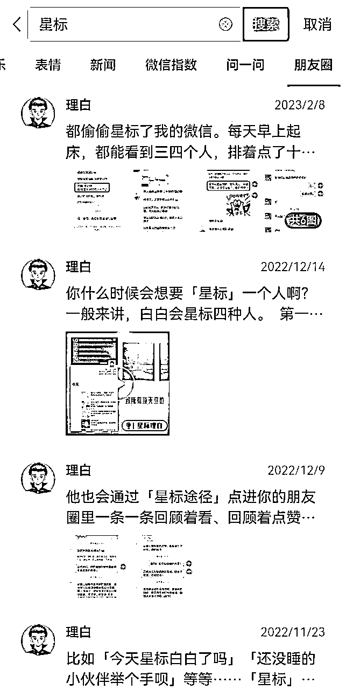
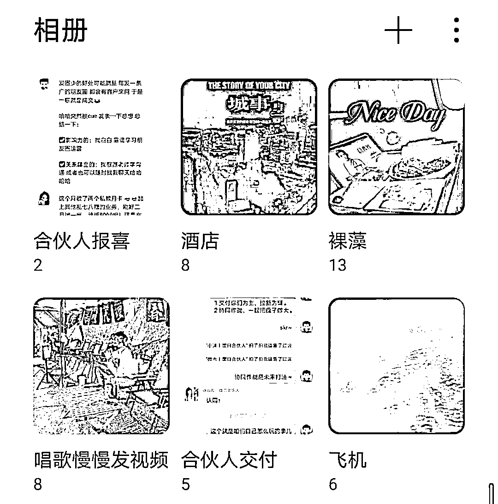

# 零基础，如何从 0 到 1 打造朋友圈自动成交系统，撬动5位数收益

> 来源：[https://fcjmogm9bc.feishu.cn/docx/Lq6jdKMoOolvwZxS4s3cmCqMnbf](https://fcjmogm9bc.feishu.cn/docx/Lq6jdKMoOolvwZxS4s3cmCqMnbf)

大家好，见贴欢喜，我是生财龙珠圈友理白，本月初，应官方邀请，在「朋友圈运营大航海」中作为嘉宾分享《朋友圈自动成交系统》，给非常多零基础小白从0到1打造朋友圈的实操方法论。

在担任教练期间，借由群内疯狂输出、答疑，80%以上的小伙伴都启动了自己的朋友圈日更计划，并在航海作业中反复CUE到我，谢谢大家的抬爱。

当教练航行过程中，我回答了近1000个问题，总结发现，咱们的很多小伙伴，做项目多，做流量多，做产品多，但是转化上存在卡点，几百个优质流量进来，转化率不到5%，私域明明沉淀了上万意向，却迟迟无法搅动他们的付费欲望。深耕内容，却不懂如何更好地展示实力，只知道一味地发成交截图或晒单，浪费了朋友圈最宝贵的位置，封号风险大不说，还容易被屏蔽。

那些让人看了就想打钱的朋友圈，有没有什么内在逻辑？

看起来不营销，却又可以让人产生付费意愿的朋友圈，到底有什么规律？

这篇文章，将以更系统地方式，梳理零基础发圈小白的朋友圈布局模式，全文9000余字，案例配图50余张，可以说，只要看完这篇帖子，任何人都可以立刻发好一组成体系的朋友圈，打造自动成交系统，让自己原有的收入，再提升30%。

发好朋友圈，为什么重要？

首先，朋友圈是你最容易和你的潜在客户以及目标人群触达的窗口和媒介，在这里，你可以畅所欲言地表达自己的干货，生活和美好。

其次，朋友圈运营对小白而言非常友好，朋友圈是我们生活中正在使用的，是我们非常高频就会去操作的，只要做出一个简单的改变，就能带来非常不一样的变化。

最后，哪怕自己现在没有产品，哪怕现在完全是一个小白，看完帖子，至少你懂了发朋友圈的底层逻辑，哪怕分销咱们生财星球，都是很好的营收机会。

首先，要先讲一个大概念，所谓的朋友圈营销，本质上就是把你自己的观点，认知，态度，生活，分享给你的用户，在分享的过程当中形成与用户的对话感，进而让他们为你付费。

其次，真正的朋友圈营销高手是没有什么框架或模板的，他已经内化成了自己肌肉记忆，带有独特个人风格和属性，别人复制了之后，也会变得非常奇怪的，所以我们鼓励大家原创，就是这个道理。

但是，对于新手来说，我们需要一些简单的框架或模板，来规范我们的朋友圈营销动作，让大家既能不那么累，用一种相对轻松的状态发好朋友圈，又能带来实际的收益和效果。

所以我今天给大家提供的就是一个非常实用的、简单的框架，大家可以先实现从 0 到 1，再慢慢从 1 到 10，修炼基本功，进而实现飞跃。从以下几个话题，展开分享。

一、朋友圈的宏观布局

二、朋友圈的微观策划

三、硬广要打出差异化

四、软广要埋得有水平

五、自动成交的小技巧

# 一、朋友圈的宏观布局

从数量上，我个人建议，每天发 4～8 条。

内容太少，你的曝光量就不够，不要觉得自己很重要，有人会天天盯着你的朋友圈看，发三条朋友圈，有可能你 80%的好友一条都看不到。

但是如果超过了 8 条，你朋友圈的刷屏感就会非常重，因为你要发的多，需要投入的成本就多，没有成本的事情就是去晒单或者去晒截图，可这种行为有恶意营销感，会让别人很不爽的。

所以要精准地发好每一条朋友圈，控制量，要让你的每一条朋友圈能够有足够高的质量。

新手，就按照 4 条朋友圈为例，告诉大家每天你需要发的 4 条内容分别是什么。

## 1.1 位置一：打卡

每天的一个固定位置是打卡位，打卡什么内容不重要，每日早起打卡、每日睡前打卡、每日复盘打卡、每日吃青蛙打卡、每日运动打卡、每日读书打卡都可以，但你要在每天的朋友圈里，固定做好一件事：

这种打卡生成就比较简单，是利用小程序自动生成的打卡记录，市面上有非常多的这样的小程序，我就不再特别举例了。

比如我的合伙人淼哥是一位健身教练，他每天发运动打卡就很合理：

比如我的另外一位合伙人菲比是思维导图教练，她的固定打卡位就是每日复盘。让别人知道思维导图可以用来做什么事情：

打卡位的价值在于，让你的好友知道你每天固定会做同一件事情，主要目标是传递出你是一个自律的人。

而自律和坚持这样的正能量属性，本身就很值钱。

## 1.2 位置二：场景

一般而言，我们的第 2 类朋友圈营销内容，做的是软营销，也就是输出你的价值。我建议大家要么配单图讲干货，输出你的强价值干货。

要么就把你的交付社群或交付训练营或交付星球的部分内容进行截图打码，在朋友圈里进行晾晒。

比如这条朋友圈（上图 2），我就是截图了小群里进行交付的内容，把它截图配上了我的干货输出，这就是把我的日常的工作和交付场景进行了一个转化和输出。

软营销的目的不是为了直接打广告，而是让你的用户知道你在做的这件事情是对他有价值的。

如果截图或干货输出的某一个观点打动了他，他就会自己找到你的产品入口为你付费，或者直接来跟你进行链接，在评论区表达出想要购买的欲望，这就是很好的留钩子的行为。

所以请大家珍惜自己的每一次干货分享和每一次互动，这些都有可能成为你软营销的一部分，构建你的个人价值使用场景。

## 1.3 位置三：广告

每天的第 3 个固定位置一定要留给广告，但是大家要注意发广告也并不是只有一种形式的。

比如说晒收账截图是一种广告。

比如说晒客户好评是一种广告。

比如说晒客户成绩是一种广告。

比如说晒你的涨价策略是一种广告。

广告的位置每天要保证有一条，但每天不要全是广告。

广告的形式可以多样，根据当天的实际状况和你手边有的素材随机去发就行了。

这样的话，你的朋友圈一眼看过去就不会全是广告，但其实每天都有广告（关于广告怎么发，后面专门会讲）。

## 1.4 位置四：生活

我曾经说过一句话，一个人为你付费，普通人是想要学你的知识，但有认知的一定是想要成为你，为了靠近你才会为你付费，我们要赚的是这部分人的钱。

所以我们的生活要对别人有吸引力，你要大胆真诚地分享你的生活。

分享生活，可从这三个方面入手。

第一是分享你的态度：

第二是分享你的关系：

第三是分享你的美好：

你的态度决定了你是一个什么调性的人，有调性的人才有溢价权，让别人知道你的底线和边界。

你的关系决定了你和什么样的人在一起，有一个理论叫做你身边玩得最好的 5 个人，收入的平均数就是你的收入水平，所以通过你介绍你和朋友的关系，也能进而印证你是一个怎样的人。

你的生活状态决定了这个人是否想要靠近你，分享越多生活中精彩的层面，哪些渴望成为你，渴望拥有像你一样的生活，就会自动地靠拢你。

我没有过多的去做营销，但我的朋友圈就展示了：你渴望成为什么样的自己。

当然，如果你的输出能力很强，4 条朋友圈打不住，我建议的分布为：

位置一：打卡 1

位置二：场景 1-3

位置三：广告 1-3

位置四：生活 1-2

如果你每天只发 4 条朋友圈，就各发一个位置，如果你每天要发七八条朋友圈，就可以自动组合。

总之你的朋友圈要让别人觉得：不看会错过，会可惜。

让更多的人星标你，让更多的人每天主动地去翻看你的朋友圈，让更多的人被你删掉之后会觉得遗憾，让更多的人想要抄你的朋友圈，你的朋友圈势能基本上就成型了。

大家看，我甚至会专门发朋友圈，引导别人星标我：

# 二、朋友圈的微观策划

聊完了布局，我们来聊聊具体一条朋友圈的写作思路。

特别是，没有素材没有灵感，不知道该怎么写，咋办？

## 2.1 朋友圈灵感从哪里来

我之前做过一次分享，聊到我去泡温泉，去按摩，看到这个商场前面的小摊，所带来的营销思考：

把你的产品和你的交付内容融入你生活当中，带着双重视角，去看你体验过的一切。

比如说，以前看到商场门口发红包会去扫码领钱，觉得自己捡到便宜了。

现在就会去想这是商场的拉新措施，它背后代表的流量的基础价格以及流量的转化和变现通道。

比如说春节档的时候流浪地球和满江红在热映，我就在群里分享了这两部电影相关的票房内容，它背后折射出的我们的价值观以及营销需求。

当你带了一种新的视角，当你带着一种新的思维去回看你走过的路的时候，你会发现：明明是同样的一条路，却看到了完全不同的风景。

于是你外出可以获得灵感和素材，刷小红书可以看看到灵感和素材，你做的任何一件与生活有关的事情，都可以转化为你的养料，进而进行输出。

## 2.2 朋友圈素材该怎么整

各个群里的聊天记录截图，你在网上看到的好看的图片，专业的图片网站上的一些美图，以及收款截图等等，都可以作为你的素材来源。

给大家提供一些无版权的图片网站

1.  MaterialUp —— 每日 Material Design 设计案例

http://thestocks.im/

1.  Pexels—— 同样集中了最好的免费图片

https://www.pexels.com/

1.  All The Free Stock —— 免费的图片，图标，和视频

http://allthefreestock.com/

1.  Designers Pics —— 免费提供个人及商业用途图片

http://www.designerspics.com/

1.  Splashbase —— 搜索和发现免费高清图片及视频

http://www.splashbase.co/

1.  Startup Stock Photos —— 去做点了不起的事吧！

http://www.splashbase.co/

1.  Unsplash —— 免费（定制）高清图片

https://unsplash.com/

1.  Death yo the Stock Photo —— 每个月将免费图片发送给你

http://deathtothestockphoto.com/

1.  Foodie’s Feed —— 免费高清食物图片

http://foodiesfeed.com/

1.  Life Of Pix —— 高分辨率的免费大图体验，每周更新。

http://www.lifeofpix.com/

1.  Getrefe —— 网站图库全都来自于手机，个人商用都可以。

http://getrefe.tumblr.com/

1.  DesignersPics —— 一个高质量的图库网站，分类做得很好。

http://www.designerspics.com/

1.  Kaboompics —— 日添一图，顶部有搜索栏，在图库中也是佼佼者。

http://kaboompics.com/

1.  Jeshoots —— 一个图库搜索引擎，类别齐全，资源丰富，界面干净，很值得收藏。

http://jeshoots.com/

1.  Magdeleine —— 通过选择一个主色来搜索图片

http://magdeleine.co/

我的朋友圈素材库，就是我的相册：

每天跟合伙人的交付记录有一部分我会截下来，每天的一部分回答问题我会截下来，看到一些好的图片我会存下来，看到了好的风景我会拍下来。

我每时每刻都在收集素材，收集完就顺便裁好剪好，打上马赛克，并且分门别类归纳在一个合适的文件夹当中。

这个文件夹我就是随便弄一个名字，告诉我这些内容可以归类发一条什么样的朋友圈，写一个什么样的主题。

有一些实效性强的内容，我可能就随手裁随手剪随手 p 随手发了，有一些我觉得可以等一等的内容，我就会把它放在相册里，一般来说发一张删一张，所以我的相册里的照片并不多，它当做素材发出去了，它的使命就完成了，我就不会把它存下来了，所以我的手机空间也很大。

为什么说有些内容需要先放到相册里面存起来不能随手发呢？

因为有可能今天你的所有素材刚好都全部是硬广，或刚好全部是生活，那有可能你今天一天同样的一种主题就撞了，我们不是跟大家规范了发圈的时候要注意适当的铺排嘛，所以就会需要存起来。

## 2.3 案例分析

从「术」和「道」两个方面来跟大家拆解一下我的朋友圈的文案。

### 先说「术」的层面。

#### 第1段写的是最近比较火的「你要写什么，就不要只写什么」体。

如果不知道这个最近在火，说明你的互联网网感不是很强，你要去补一补你的网感了，要靠互联网赚钱，是要具备基本的网感的。

#### 第2段写的是场景。

场景，全部都是我们在生活中非常容易遇到的情况，半夜凌晨加班吃泡面、早高峰挤地铁、被上司骂、被亲戚阴阳怪气。

场景就是一个大套，要套住非常典型的情况，这个是唤醒用户的「憋屈感」。

#### 第3段写的是人物。

人物上我选择了一个家庭关系当中最简单的三角关系，爸爸妈妈和孩子。

说白了，在中国社会当中最稳固、最小的关系单元，永远是家庭关系。

所以，在你不知道要用什么人物的时候，从这三个视角出发准没错。

宝妈的痛点，很简单。

要么就是在家伸手要钱，没有工作；要么就是要平衡职场和生活的关系；要么就是带娃很忙之余，自己还要做副业搞钱。

总之宝妈的痛点在：时间的零落感和切碎感。

而男人的痛点一般来源于责任感。

一般一个有责任心的男人都会有这样的痛点的：不敢袒露自己软弱的一面，只能在车里默默抽一根烟；在外边受尽了委屈，回家之后还要装作没事人一样说，孩子没事，爸爸可以撑住。

孩子没啥痛点，孩子是快乐的，你针对孩子写痛点没意义，因为孩子有痛点他也不会为你付费。

所以我们要借孩子还是要写到父母上：孩子对你的期盼，孩子对你的期待。

要给孩子一个更好的生活，是所有家长的共同痛点。

如果说套场景只是简单的观察，所有人都可以做的话。套人群，你就要学会捕捉人性了，捕捉痛点就是发现需求的过程，如何发现别人的需求？

多观察、多共情、多思考。

#### 第4段是往绝望的层面更延伸了一步。

你看，前面场景那一块还只是一些琐碎的点，人物那一块也是一些零碎的线。

但是到第4段，扑面而来的是绝望感，病床前的嚎哭和欢乐场的假面，这一正一反，写得是小人物的悲哀。

其实这一段的衍生含义就是：我们作为小人物，我们作为普通人，就只能这样绝望下去吗？是提出了这样一个问题。

所以，该喘口气了。

我的下一段就是一句话，就是要开始往好的方向发展了，这个文案要开始往希望的方向给了。

因为如果你的文案全程都是绝望的话，别人会被这份负面情绪吞噬掉的，别人在你的文案当中看不到希望，别人就不会相信你能帮助他改变。

#### 所以下面两段我就是给希望。

第一段：是从自己的角度出发给希望。

也就是说你自己被击倒了要站起来，你自己要给自己在绝望中有期待，你自己要有不断向前的动力，也要有忆苦思甜的本领。

第二段：是就写旁观者视角。

有的人在圈圈圆圆，有的人在年复一年，就是跟你们说：你这个前进的路上是注定会有看客和庸人的，他们会给你很多评价，会给你很多信息，会给你很多的阻碍，但这些人都无关紧要，因为他们现在在嘲笑你，最后被嘲笑的一定是他们。

自己的视角，旁观者的视角都讲完之后，接着上面的最后一句话就是：

你要相信你的明天一定会是好的，明天一定是个艳阳天。最后一句话给足了希望，给足了别人期待感和价值感，然后从「术」的层面，我们就解读完毕了。

### 再聊聊「道」的层面。

首先，这样一套文案是百搭的，因为它可以匹配任何跟赚钱或者是帮人变更好的所有的产品。

大家可以把这样的能力迁移到自己的产品上面，如果没有自己的产品，分销生财的产品，或者是其他小伙伴的产品也是OK的。

其次这样的一套文案其实是好写的。

大家觉得这套文案很有文采，但实际上就是找意象，找场景，找人物，套逻辑，套人性，最后用一个韵脚把所有的末位词，用一个韵脚熨平就好了。

第三，像这样的文案就完全没有任何营销味，就算发出来是个广告，大家也喜欢看。

最后，这样的文案，哪怕没有成交，你的用户也会夸你有才，也是增加一个你在用户身上的心智锚点。

像这样的文案，就不是直观的一定要卖货的文案，而是铺垫性文案，是帮助你增加人设的文案，是帮助你经营你在用户心中形象的文案，是一个软文案。

# 三、硬广要打出差异化

要记住，你发朋友圈的目的，不是为了吸引更多的人点赞。而是让更多的人知道你在做这件事，你在这件事上是专业的，仅此而已。

那么，当有一天，他需要相关的资讯或方法，或者他的朋友需要的时候，他就能第一时间想起你。

## 3.1 教学过程

当你在教学过程中提到了一些干货知识，或分享了部分内部消息的时候，用半马赛克的形式发圈，让好友对你的专业程度和耐心细致程度有判断：

## 3.2 教学成果

有了典型性成果，在征得同意情况下发圈，或完全打码发圈，让好友知道你是有实力把人带出来的：

## 3.3 教学理念

适当宣传自己的教学理念，自己的心路历程、经过了哪些大坑，你本人的故事，能吸引到同频、同理念、同三观的人：

## 3.4 收入成绩

收款截图刷屏发起来，这是引导消费不可多得的强刺激。

但是，要注意，秀晒收入，不要变得很高频、很刻意，一是怕被举报，二是影响调性：

## 3.5 学员评价

顾客证言一次，远胜卖力推广一百次：

# 四、软广要埋得有水平

硬广可以发晒单截图，比如说客户评价等等等等。也聊聊软广。

就用我这一条朋友圈来举例吧：

我来说一下我发这条朋友圈当时的完整想法。

起因就是最近公众号一直在改版，然后各个大大小小的号主圈号主群都在骂，当然也有夸的。

我就觉得这是一个还比较热的话题，是可以蹭热度的，所以这是灵感的来源。

那用的配图，我在评论区也写得很清楚了，这是一张我之前存的一张图，我觉得刚好跟我要表达的主题是相吻合的：我们看待一个新事物的眼光，如果戴着彩色滤镜就是彩色的，如果戴着黑白滤镜就是黑白色的。

定好了主题找好了配图，就是开始写内容。

写内容的时候，就是先把我自己的真实的直观感受表达出来，我认为这对小号主是一个利好，同时我认为无所谓政策的好坏，只有我们是否享受到了政策而已。

我分析了一下对小号主力好的理由，就立刻给出了我认为可能出现的风向标。

我跟大家以前聊过「框架」这件事情，你的所有的干货的输出，都要跟你的产品线相吻合。

我的风向标讲了四件事情：

① 利好小红书/公众号训练营讲师；

② 利好小号主；

③ 利好原创作者；

④ 利好 AI。

这 4 个点分别对应了：

① 我手里有合作的公众号和小红书导师；

② 我手里有大量的号主资源；

③ 我手里有大量的原创作者资源；

④ 我手里有最近热火的 chat GPT 大师课。

我们之前跟大家聊品牌营销的时候讲过，我们需要做的是占领用户的心智，这才是我们实现超级个体的护城河。

以上 4 点就是我的软广位，当未来的有一天，看过我这条朋友圈的人，想到了任何一个方向的可能性，都也许会向我咨询相关的产品，这就是一个埋下一颗种子，期待未来一朵花的软广。

# 五、自动成交的小技巧

## 5.1 少就是多

所有的聊天记录素材，要尽可能减少「冗余信息」。

比如说我在处理一张截图的时候呢，会从这几个角度考虑问题：

这个头像要不要打码或者干脆直接裁掉？

某一些对话，是不是没必要留出来，干脆把聊天记录删一删？

有一些内容是不是可以适当用红笔圈出来突出一下重点？

我的群名是否要裁掉？这个人的昵称是否要裁掉？

想方设法的把无关信息裁掉，是为了让重点信息更好地暴露。

因为看你朋友圈的人并不一定是你的铁粉，也并不都是你爹妈，他们不会逐字逐句逐个图片认真翻阅，如果你的信息量过分庞大，结果就是随便看一眼就关掉了。

我们要知道，用户的理解成本是有限的，他们处理信息的能力也是有限的，我们只有把我们最想表达的信息，精准投放到他们的眼前，他们才会知道你想要做什么 ——所以，请不要再给自己本就冗余的信息再增加负担了。

放一张多出信息的聊天记录截图，并不能够为你带来实际的营收，只会分散用户的注意力。

所有会对其他人造成干扰的，都是应该舍弃的，品味是流量的敌人，你认为的美，有可能就是对别人的信息量造成的干扰，所以自己回家美，赚钱的时候，要克制。

个人品牌的塑造并不需要在这种微脉之处过分纠结，战略上宏观上的胜利，才是大胜利。

## 5.2 有对话感

所谓的对话感啊，就是你的每一条朋友圈，都一定有具体的目标客户群体。

我发现很多人写朋友圈，我看了之后不知道他是写给谁看的。

你不能跟全世界对话，你跟全世界对话，全世界不搭理你啊。

比如这条朋友圈，就是写给瞻前顾后，想做自媒体，却迟迟不肯起步的人看的。同时也给其他的知识付费老师提供了朋友圈文案素材，让他们可以直接抄我这条文案，给他的目标客户看：

比如这一篇就是那些在主业赛道上受尽了气，累到不行的人，看了之后会有期待感的：

比如这条朋友圈引发了大量的被白嫖的，被撩闲的，我的朋友圈好友的共情。这条朋友圈是我目前成交量很大的一条朋友圈，直接成交了 6 单：

而当我发现那条朋友圈成交量很高的时候，我就立刻补发了一条朋友圈，引导大家去看我的上一条朋友圈，又额外成交了两单：

所以你需要明确的知道，你的朋友圈写给的是谁，谁容易被他打动，谁容易共情，而当你发现某一条朋友圈有很好的转化趋势的时候，可以补发一条朋友圈，引导没有看到的人再去看一遍，大概率还会有新的流量转化进来。我们不要对全世界说话，我们只对一小撮人说话就够了。

## 5.3 图文协调

这个概念很好理解啊，就是当你要发九宫格的时候，你的文字就可以配少一点，因为你图片的信息量太大了，大家再去看一个长信息量的文字，就会比较累，比较有压力。

当你的文字素材很长的时候，你配的图就可以少一点，或者用美图来代替你的聊天记录截图，信息量主要集中在文本区。

比如这张文本很长，我配的图就比较少，而且是纯图片，没有什么其他的文字信息量：

但大家看我在配这种九宫格的时候呢，我的文本就会相对比较短，因为九宫格体现出的信息量已经很庞大了，我就不希望让我的文本内容更多侵占这些空间：

总之，不要给你的用户压力，你的用户就会给你钱：

如果你这一整屏全是聊天截图，或者全是链接，有可能别人点到你的主页里边，想要翻一翻你的朋友圈，就失去了继续翻的欲望了。

你的每一条朋友圈之间，排版方式不要太过于重复，让别人觉得看着眼晕。保护好读者的注意力，也是成交的关键。

这个方法就相对比较灵活，大家根据图片的数量，信息量的程度，以及你文本的字数，去宏观调控就行了，这已经属于发圈的高阶技巧了。

## 5.4 巧用排版

比如大家看看这个截图的评论区，两段内容有什么不同：

这是我给我的合伙人的一个小的修订啊，在评论区写价格体系的时候，特别是这种对仗整齐的情况，在第一行中放一个空格或者是一个字符，便于让读者更整齐看到你的信息。

因为你自己在给自己的评论区留言的时候，因为你自己的昵称也会占字符，所以势必会导致每一行的字数不统一。

可以通过空行的形式让格式更统一，让线条更鲜明。

## 5.5 精简好友

最后，聊聊精简朋友圈列表好友的小技巧。

### 1/不要把「删好友」当成负担。

要把「删好友」当成一个长期战略去养成。

就算是10000个好友，每天过掉50个，也只是需要200天。

但这200天的时间，你可以每天对50个隐藏人脉产生新的链接。

### 2/不要只做「删好友」这一个动作。

我的习惯是，先看「对方有没有屏蔽我的朋友圈」，再看「最近有没有聊天记录」，最后看「有没有白嫖我资源不说谢谢的情况」。

删掉白嫖党、营销党、消失党和屏蔽党之后，再做另一个动作：打标签。

根据近期的聊天记录和对方的朋友圈动态，判断对方的需求，不用直接私信，打上标签心中有数，相当于对手头闲置资源的一次重新整合。

这样，一些已经被遗漏的老客户，会成交新单子。 这样，一些已经被你遗忘的潜在用户，会重新焕发出价值。

### 3/可以建立自己的「SOP」。

我的习惯是，从通讯录「A→Z」的顺序来一遍，每天一般会翻50个人的朋友圈，打上新标签，然后删掉不符合我期待的群体。

一般，每50个人就能删掉10-20个人，一天天过去，利用吃饭、敷面膜、刷剧、排队等核酸的功夫，就能完成一次新的人脉洗牌。

### 4/不要不舍得删人。

相信我，凡是半年之内不理你的，没给你点过赞的，也不跟你互动的，更屏蔽你的——一定不会是你的客户。

这些人有一部分是老朋友（老朋友可以自己判断），但一定不是潜在客户。

所以，大胆删掉，把位置留给更多相互需要的人。

### 5/防止误伤的办法。

平时发圈聊天，要及时给他们打标签。

有人点赞了，翻过去看看标签；有人留言了，翻过去写写标签。

平时没事干，「微信标签」里面专门有一栏「未分组标签」可以给你研究。

这样，删人的时候，通过标签来判断需求和方向，比较不容易误伤。

多删几天你就会发现：哎呀，我好友少了一半，点赞互动和成交，竟然多了一倍诶！

以上5个小技巧，可以帮助大家实现信息的有效触达。

# 结语

朋友圈运营，运营的是细水长流，是你这个人不断培植在用户心中的信任度和美誉度，所以你需要做的，就是尽可能多的展示你的实力、个性和风格，让他们对你产生好奇心，对你产生信赖度，进而为你付费。

短平快和简单粗暴的打法，可能利于在极短时间内快速组建一个训练营，但为了维护个人品牌的长尾效应，我们需要：慢慢来。

最后，送给大家一句鸡汤：

文毕，感谢我的爱人@比比 ，让我的朋友圈，可以因为你的出现而多姿多彩；感谢我的良师益友@靠谱 ，你的朋友圈给了我非常多的启发和帮助，正是在你的影响下，才开启了我的自动成交之路；感谢范磊领队、子冯教练、思念教练，以及大航海所有的志愿者，因为所有船员的共同努力，才有了咱们这艘船的乘风破浪、披荆斩棘。

祝我们，生财有术，发圈成交，亦有术。

理白

2023.6.9