# 我是如何从零开始，挖掘到蓝海小众需求，半年赚到40万的？

> 来源：[https://c6ti72phuk.feishu.cn/docx/MBm6dkcOQoEHHLx5u6ecHpaTngu](https://c6ti72phuk.feishu.cn/docx/MBm6dkcOQoEHHLx5u6ecHpaTngu)

## 前言

去年 7 月，我通过挖掘出一个不起眼的小众需求，一步一步打造成全自动赚钱机器，公众号精准吸粉 6w，半年变现了 40W 利润。

今天，将这个项目从发现需求、挣到第1块钱，再放大到六位数的全过程，以及我的思考、实操细节，真诚、毫无保留地分享给大家，也是我对这个项目的一次全面复盘。

前辈们好，我是陈予希_：生财第七期新人，02年，目前在长沙。

初入生财，受益良多，这是我在生财发布的第一篇长文，有幸给大家分享一点浅薄经验，感恩遇见。

## 导读

这是一个信息爆炸、注意力宝贵的时代。考虑到这个原因，我将文章初稿12000 字 ，精简浓缩到了 8000 字左右，尽量只保留干货。

本项目涉及一些编程技术，但为了兼顾所有朋友，不聊过深的技术原理，如果你对其中具体的技术细节感兴趣，欢迎找我交流。

提示：建议电脑端阅读，体验更佳。

话不多说，进入正题。

## 一、项目简介

首先，上图，上数据。

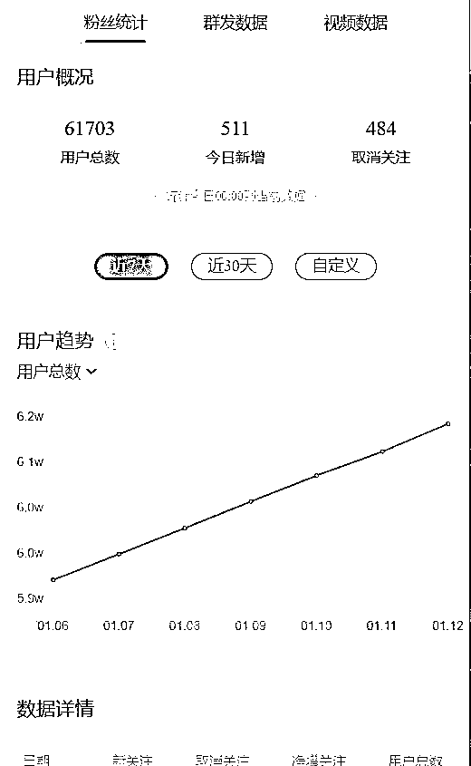

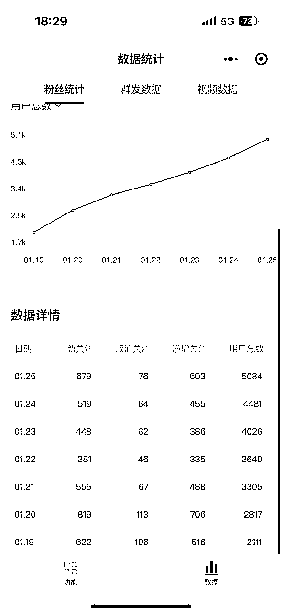

总销售额70万，利润46.9万。

钱不多，对于很多大佬微不足道。

但整个过程收获不少，可能对新手期、正在迷茫的朋友可以带来一点启发，这就够了。

这个项目本质上是信息差，或者说是技术差。其中一些特征可能也是大部分人喜欢的：暴利，躺赚，空手套白狼。

那么到底是个啥项目？

一句话概括：帮想用 Spotify 的人用上

「Spotify」是啥玩意？

可能一些人知道，但大部分人应该没听说过，简单解释：

1.  QQ 音乐、网易云音乐、酷狗音乐，这些你肯定耳熟能详

1.  他们，都是音乐平台，是国内的

1.  Spotify 也是音乐平台，是国外的

1.  Spotify 在国内不够知名，但在全球是 top 级别（还有 Youtube Music，Apple Music 等）

简单说：国外比较火的一个音乐软件，但在国内知名度相对不高。

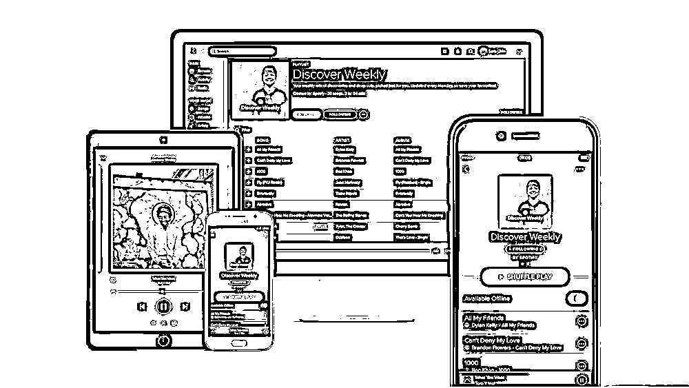

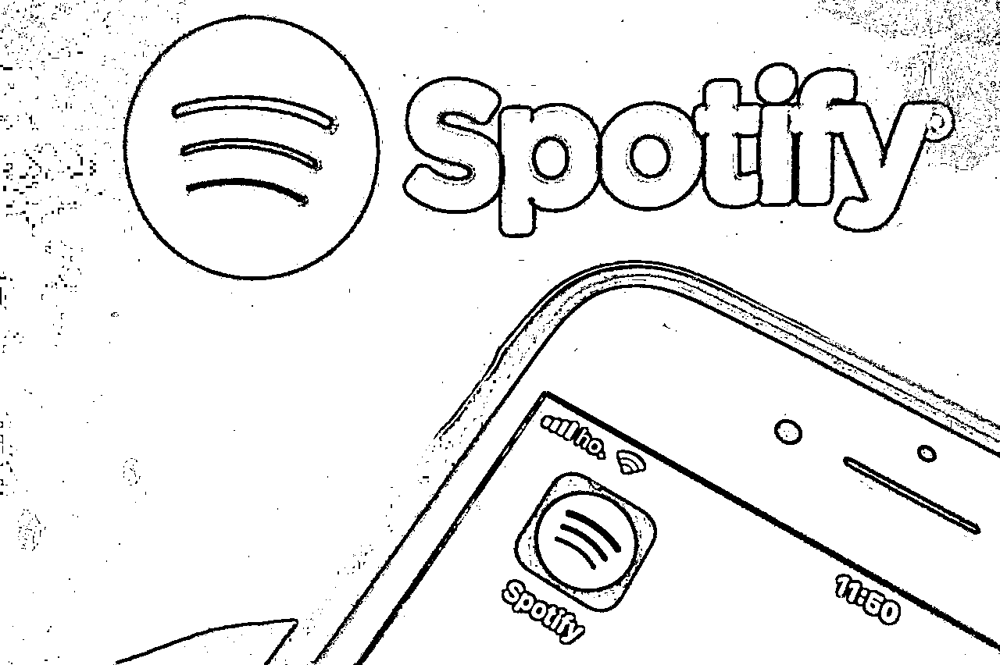

其实在国内，字节也模仿出了个类似的，叫做「汽水音乐」，界面都差不多。

做跨境、出海、独立站的朋友，大多知道Shopify ，但这俩不是同一个玩意哈。

我不评价什么哪个音乐软件好，我日常也不用这玩意，我只在意：有没有需求、有没有商机，能不能搞钱。

那这玩意有啥需求，有啥商机？

点一根，且听老弟慢慢道来

## 二、需求挖掘与验证

### 1.我是怎么挖掘出这个项目的？

其实很偶然。当时想赚钱，在找项目做，有次想着，看看自己电脑装了些啥应用，从这上面出发。

随即，看到自己一年前下载、却没用过几次的听歌软件——Spotify

就是如此简单且随意。

我瞅着这玩意，兴许存在一些商机

就拿它开刀，我做了以下两个事情，简单的分析一下较为普遍的需求：

1.  百度下拉词：「Spotify 怎么」

1.  丢到 5118 进行需求分析

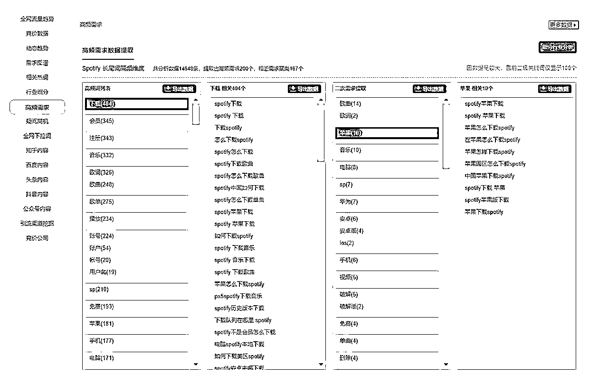

看图片可以知道，基于这个软件，可能延伸出一些机会。

较高的几个需求是：

*   怎么 注册

*   怎么 下载（安卓/苹果）

*   怎么 充值会员

*   怎么 解除 14 天限制

记住这几个需求。这个项目，基本就是从这几个需求延伸出来的。

关于 5118 如何使用的简单补充：

### 2.具体需求的分析

仅仅看这几行字，对于这些需求的理解，还在最浅层。

接下来，详细分析一下。

* * *

首先是：Spotify 怎么注册

在此之前，先说说，今年最火的 ChatGPT。

问你个问题：你认为注册 ChatGPT 账号难吗？

如果你说不难，我非常理解，因为我这是在生财里面提问。

航海、风向标、保姆级教程、无数精华帖...，作为最前沿顶级的赚钱社群之一，生财有术沉淀了大量的信息，就算你没主动关注AI领域，耳濡目染地、你应该也被动接收不少信息。

所以，对于你这肯定不是什么新鲜事。

但你千万不要以为，所有人都认为简单，这就像是「幸存者偏差」了。

实际上，时至今日， ChatGPT 发布大半年了，绝大部分人还是没用过、且用不了原版。

为什么 ChatGPT 注册难，使用难？

你知道的，说白了，有「门槛」，所以才有卖号、镜像站 这种项目，他们解决的就是这个「门槛」。

话说回来，

Spotify 同样，存在不低的使用门槛。因为目前未进入大陆市场，所以官方也限制了大陆 ip 访问。

普通用户不用说注册了，连下载都很难。

注册 Spotify 账号，不仅需要「魔法上网」，而且必须要「原生 ip」。

普通人官网都打不开。

就算「魔法上网」后，仍然显示检测到代理服务，导致无法注册账号。

这是一种「 IP 质量检测 」，并不罕见。

近年，海外各种平台，都或多或少，采用了「 IP 质量检测 」。

我所知道较为严格的有 Tiktok：不仅检测 ip 质量，还有设备环境、语言等一大堆。

而其他的，例如：Steam、Instagram ... 等等，都是有检测的。

* * *

不过，这种「门槛」对我是轻而易举的。找个 IP 质量高一点的魔法，即可解决。

某些事情，你知道，不代表别人知道；

你觉得简单，但别人可能觉得难如登天。特别是你较为擅长领域的某些事。

你可以理解成所谓 信息差 或 信息不对称，事实上，「不知道的人」这一方通常占多数甚至绝大多数。

这是客观事实，但你若非刻意，并不一定时时刻刻都察觉到这一点。

导致这一现象的原因，可以了解下：专家盲点、知识的诅咒

引用亦仁推荐过的「飞书出品《认知偏差手册》」：知识的诅咒 Curse of Knowledge

另附 Wiki：知识的诅咒 - Wiki

* * *

简单来说，Spotify 注册，和 ChatGPT 注册差不多，你可以这么理解。

不同的是，解决注册和下载问题后，用户是不需要「魔法上网」，也可以使用 Spotify 听歌的。

这么一个很简单的事情，最终占了这个项目利润的 54 %，即 25.2万，就纯纯的代注册。

注册方面的需求分析说完了，篇幅有限，尽量简单的讲下其他的几个需求：

*   怎么解除 14 天限制

*   相对不重要，后面再讲

*   怎么下载

*   Spotify 在一般国内应用商店也没上架，安卓需要去谷歌市场、IOS 需要苹果商店外区账号。

*   怎么充值会员

*   因为是国外软件，不支持微信支付宝，需要海外银行卡付款，和 ChatGPT 一样。

### 3.简单的市场调研

具体需求分析了，但还没完，我得知道需求量级有多大，市场份额有多大，够不够我吃？

看看 百度指数、微信指数、5118、知乎问题浏览人数

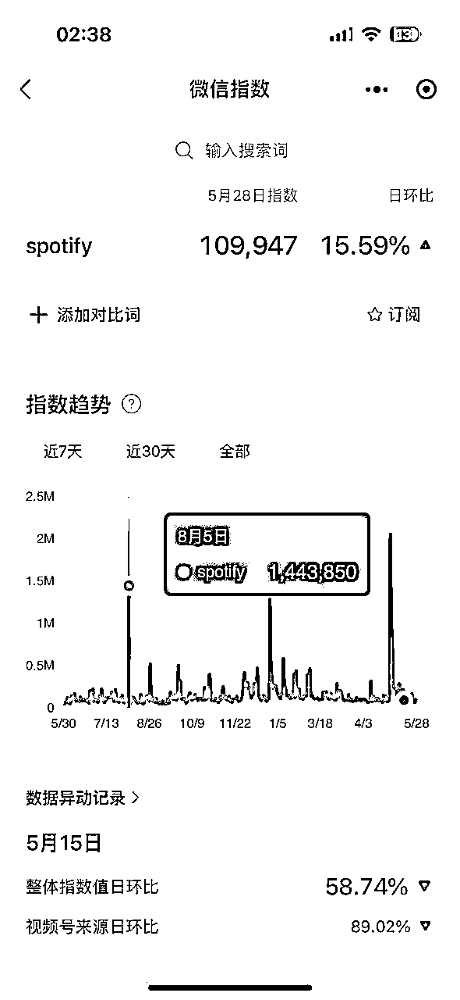

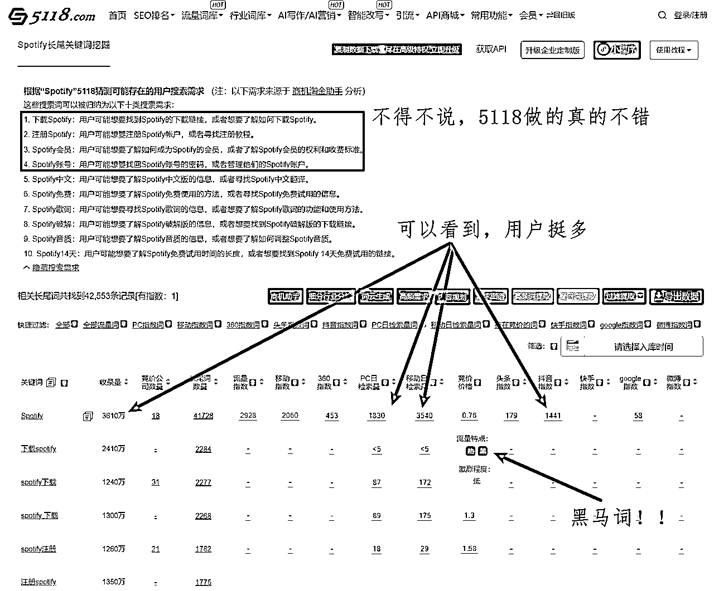

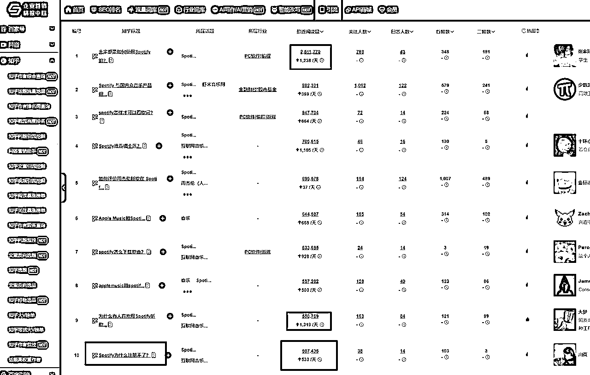

有较稳定、且不小的需求量。

我还记得，我当时刚看到这些数据时，内心是极度兴奋的，日入四位数的画面，脑袋里面已经不模糊了。

简单算个糊涂账：

假设人均客单利润6元，市场流量我能分到20%，就仅按照百度平均指数来看，每天：

3421*0.2*6=4105.2元。

一天4k，已经是年入百万的生意了。

如果分到60%，则一天1w，年入300w，完全没问题。

亦仁：业务能力强的人，强在什么地方？ 一个新的赚钱的业务告诉他，他能大概算出来能赚多少钱，在整个路径上的指标大概是多少，可能有偏差，但只要经过几次执行，立即能迭代出准确的值。

海程：对话小白：算不清账，多少钱都照样慌

* * *

那这么好的项目，看看有人做么？

拼多多、闲鱼 搜一搜。

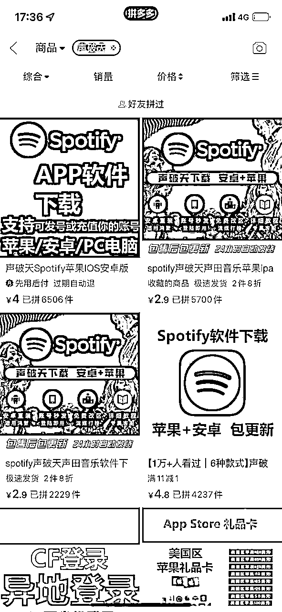

确实是有人在做的。

好，小白最担心的问题：有人做了，我还能做么？进场是不是晚了？还剩口汤么？

但我看来，这就是妥妥的蓝海呀。

盗坤：在我眼里【打得过的】都可以称之为蓝海。结合中小卖家的情况来说，具体就是指【对手弱】【对手少】，我们可以轻松地实现【降维打击】。

稍微分析了一下这些同行，我的自信就来了，说降维打击显得我过于自负，但自认为扳一扳手腕还是没问题。

过于饱和我不喜欢，但没有一个人做的赛道，背后也可能存在一些问题。

像这种，需求大，但对手不多且不强，正是好赛道。

## 三、通过最小 MVP 进行验证

通过上面的分析，市场和需求，看上去都没问题，

理论可行，但「实践是检验真理的唯一标准」。

天下事，在局外呐喊议论，总是无益，必须躬身入局，挺膺负责，方有成事之可冀。 ——曾国藩

因为是简单验证需求，所以只搞定注册、下载就行，让客户先用上，会员之类的需求暂时省略。

说干就干，

找好哥们 @涂白 用 PS 做了张海报，准备去引流然后发给客户，替代一部分话术，比较直接明了也稍显专业，

@涂白 是我同学，初中开始玩网络，非常牛逼的一位小伙子，我会的他都会，我不会的他也会，之前一起合作过，非常靠谱

当时刚起步，没拿到正反馈，不敢定价太高，试探性定价 4.99

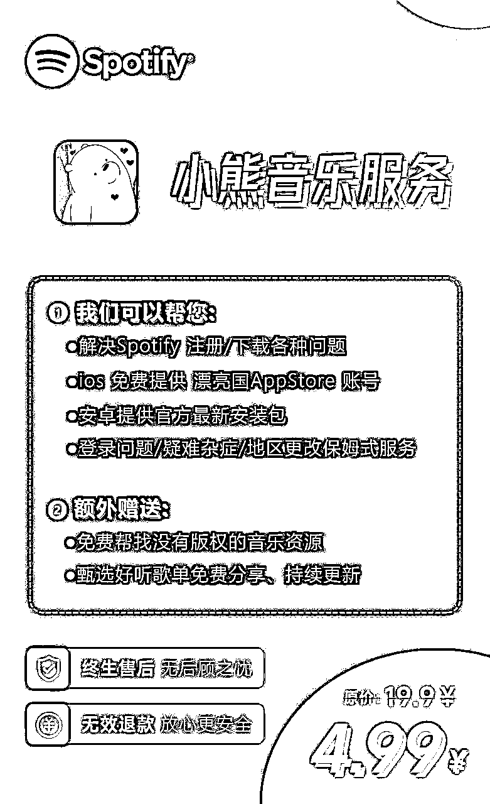

* * *

### 1.最小交付

那怎么给用户注册呢？

抄起 易语言（一个中文编程语言），用 Charles 抓了个网络数据包，套个代理，简单写了个注册器，省点打开官网的时间。

用易语言是因为以前用的久，最熟悉，写的最快 （当时没有 ChatGPT，不然直接丢给它来段 Python 完事。

OK，怎么注册，搞定。

* * *

怎么给用户下载？

谷歌搜索，

找到了一家 IOS 外区账号的自动售货网站，花 1.5 元买了个号。

IOS 用户解决。

到 apkpure 下载 Spotify 安卓的 APK（安装包）

上传到 国内网盘 ，发给客户，打开就可以下载安装，

安卓用户解决。

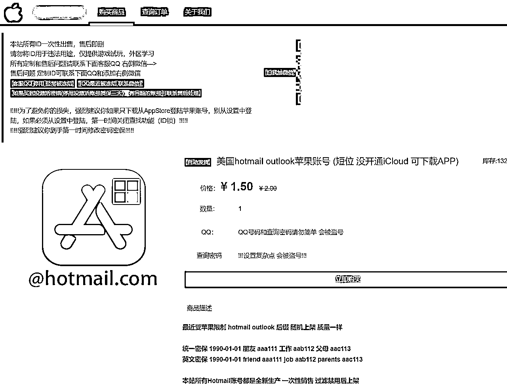

* * *

### 2.第一块钱

产品搞定，得去找客户了。

我目光瞄向小红书，原因有三：

第一，随便选的，先找个平台试试，

第二，之前调研需求发现小红书有不少关于 Spotify 的内容，

第三，平台群体，很符合我的目标客户调性，微博也是

然后发了小红书第一篇帖子，

我以前从没发过，没有技巧，就硬写，写完再抄（对比别人的进行修改，取精去粕）

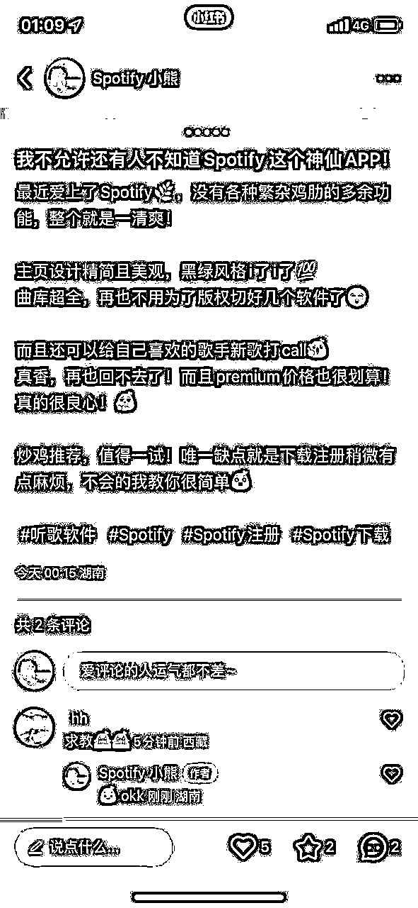

刚发布

几天后

没想到，小红书这平台机制真好，真大方，数据还不错，

而且，还是精准流量，

结果就是，当天 20 多人加我，纯利 100 多，手工话术聊天，帮注册下载，累死了

这篇小红书持续曝光接近一周，然后停止增长了，一共加了100多个客户，挣了几百块

这已经远超我预期了，我的期望是很低的，能成交一个就不错了。

要知道，

可口可乐第一年才卖 25 瓶（可能传闻，我未考证，但这碗鸡汤好喝）

而我仅仅随便发个帖测试一下，第一天就挣100多。

我不否认运气是一部分因素，但这给我带来了极大的正反馈。

## 四、打造成全自动化

最小 MVP 跑通，0-1 完成，用屁股想，接下来要做的都是放大。

@涂白 当时正好项目空窗期，有好事当然不能忘记兄弟，于是拉来一起做，两人五五开，两人齐心协力，比单打独斗要强很多。

我这人最大的毛病就是懒，但 「懒是推进科技进步第一生产力」。

所以我准备打造成全自动化：售前、成交、交付、售后全自动。

### 1.流量的承接池

首先大胆想，如果我真的每天引流到了 1000 个客户，我该如何承接这一笔流量？

个人微信号肯定不满足要求，诸多问题：

*   好友总上限、每日添加好友上限

*   风控限制、开小号也麻烦：养号、防封、设备一堆问题，也没这方面经验

*   功能太少，无法批量发消息，管理麻烦，第三方工具不敢用也没经验

*   ....

淘宝行不行？

还行，但我没有选择淘宝，原因有以下几点：

*   没有私域积累。当然，是有同行以一些手段再引流到私域的，但这样链路还是长了，而且有点对抗平台规则。

*   避开竞争。淘宝此类目有不少同行做，价格相对透明，利润空间小，蛋糕本不大，分的人却不少。

*   对于此项目场景，交付不够方便。

想了想，

公众号（服务号）完美满足要求。

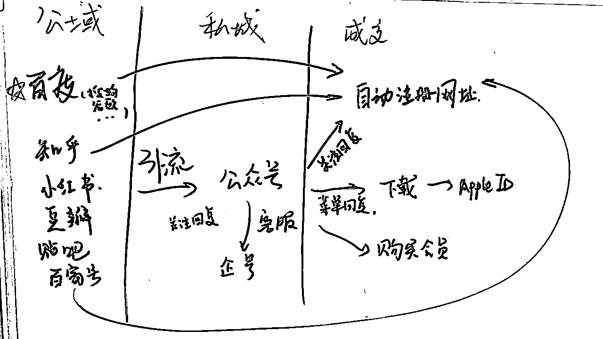

### 2.自动化成交 和 交付

之前的交付方式：

客户加了微信，话术引导成交后，手动给客户发下载链接，根据客户提供的信息，帮忙手工注册账号。

这样效率太低，上限太低。

#### 2.1 自动代注册账号

注册账号这种事情，其实完全是不用人工的。

简单做个「在线自助注册 Spotify 账号」的 h5 网页

除了在官方注册账号界面，包含的必填的几个选项外（邮箱昵称密码...)

还加了一个「注册码」选项，用户必须购买注册码，才可以使用这个网页进行注册。

←点击展开，技术原理

其实很简单，前端 JQuery 一把唆，后端拿 Java 写的，买了点「原生 ip 代理」，然后模拟 http 请求，将用户提交到我们服务器的注册数据，转发到官方服务器，可以抽象理解为「中间人攻击」。

但其中走了一些弯路，

*   一开始走的网页注册协议，需要过谷歌 ReCapthcha 验证码，这个玩意还是比较恶心的，找了打码平台对接，后来发现移动端的注册是不需要验证码的，然后脱壳、逆向 apk 扒出另外一套注册协议，成本大大降低，速度大大提高，属于是降本增效了。

*   一开始是使用的魔法工具的内核（V*ray），单独运行在服务器上，开放端口给 Java 程序做代理，导致 ip 重复且不稳定一段时间，后来才知道有「原生 ip」可以直接买，稳定性和质量大大提高。

所有的一切注册障碍，我们都帮客户扫的干干净净，客户创建 Spotify 账号，就如同创建 QQ 号一般简单。

人之初，性本懒。

先不说绝大部分人搞不定这事；就算搞的定的，也要琢磨不少时间。这就是痛点。

而我能一分钟给客户搞定，这就是价值。

#### 2.2 自动发货

OK，不用我手工帮用户注册账号了，那怎么给付款后的用户这个网址呢？

在 Github 上找了一套，虚拟产品自动发货的，商城网站源码

简单修改后，在腾讯云买个域名、服务器后，部署上去就行了

用户在网站下单后，会得到一个「包含了注册码的链接」，下载同理，只是换成了安装包链接。

支付渠道一开始对接的虎*椒，后来改为对接了微信官方渠道。

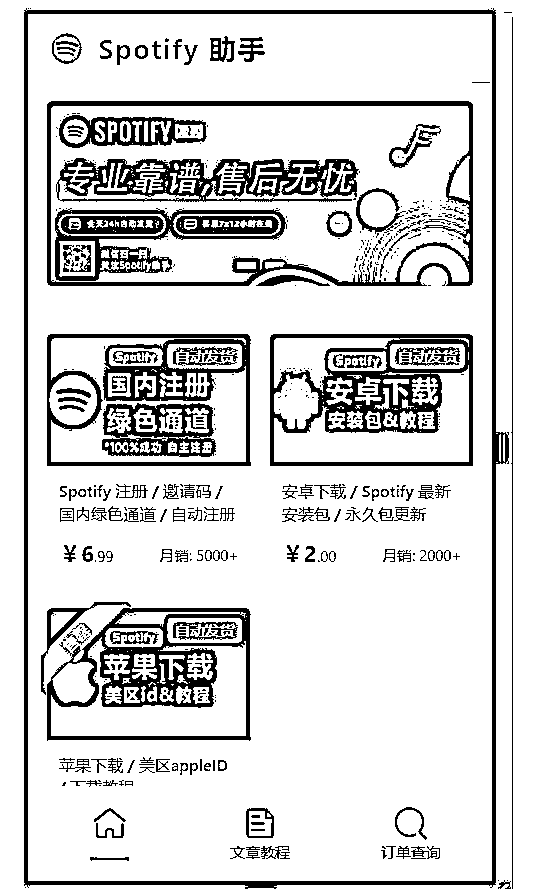

#### 2.3 关于会员 和 解除14天 两个需求

一直在讲注册和下载，但前面的需求分析，还提到了会员和解除14天。

简单说说会员服务的背景：

Spotify 每个地区的音乐曲库、会员价格都有差别。

不开会员，不能指定播放某一首歌，只能随机，就像听电台； 也不能完整听歌，只能听试听片段 ；还有广告。

其实当时很多同行都是只做会员代充，因为这是比较明显的商机，大家都知道可以赚差价。

但这同时也是一个「思维陷阱」，自己将更多可能性束缚了。

而如果我一开始没做需求量级分析的话，我也不会发现：

盲区之外的，注册账号的需求量才是最大的，很多人虽然想用 Spotify 听歌，但连用都用不上。

而帮客户解决了账号问题，顺理成章的他们会再次遇到「会员充值」的问题。

这时候自然而然就再找上门来，因为有了第一次成交，只要交付没毛病，有了信任基础，之后也更加顺利。

会员充值比较麻烦，需要外币银行卡，我们当时没找到好的渠道，直接找了几个同行，让利合作。

定价是 69 半年/129 整年，利润在 40%左右。

然后和注册账号整个路径相似，写了个网站，帮用户自动充值。

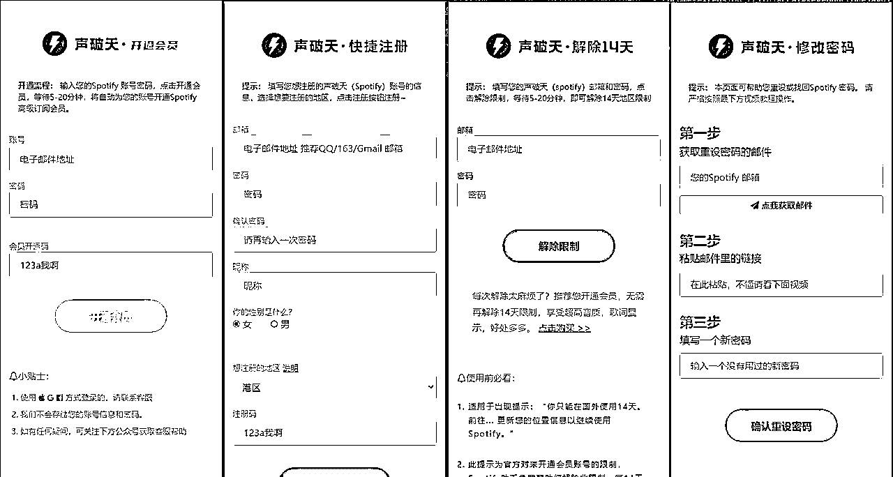

←点击展开，技术原理

会员开通这块业务，比注册账号要复杂一些。

Spotify 的会员（Premium），有好几种开通套餐：单人、双人、家庭组.....

家庭组是最优惠的套餐，主账号付费开通后，有个邀请链接，可以拉入5个子账号，子账号不需要再付费也有会员权益。

所以我们只需要准备，已经付费的主账号，然后将客户的账号拉入家庭组，就可以了。

但是自动将客户的号拉入家庭组，已经管理主账号家庭组，等等等等，还是有些麻烦的

这是当时的程序流程设计图，其中克隆号部分，因为会员不稳定，放弃了，主要还是通过协议来实现

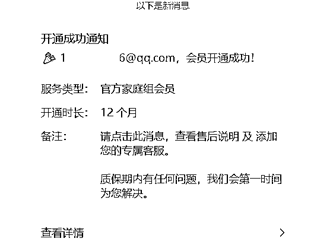

成功开通会员后，我们会向客户推送微信模板消息，并引导添加专属客服

关于解除14天限制

前面多次提到，14天限制，那么到底是个什么东西？

简单解释就是：

*   Spotify 不能在大陆注册，必须海外 ip 注册。

*   账号属地，自动根据 ip 属地决定。

*   所以，用户在国内直接使用，就相当于「国外旅游中使用 Spotify」。

*   官方允许你旅游，但只允许两周，超过两周不回国， 就禁止登陆账号

*   开通会员没有这个限制

说实话我不理解， 听歌软件整这么麻烦。。

这个是很多用户的痛点，也给我们售后带来了麻烦，因为总有不愿意开通会员的客户。

后来我们就做了一个，在线解除限制的网页（上图），

但是这个我们没有进行收费变现，只是用来处理售后问题

←点击展开，技术原理

用户输入账号密码，我们会自动帮他「回国登陆」一次，即可延长14天「国外旅游时间」

怎么自动帮他「回国登陆」呢？

我拿 Auto.js 写了一个安卓脚本，部署在云手机上，用户提交账号密码后，Java 后端使用 WebSocket 和安卓脚本进行通讯，将任务推送下发，脚本自动通过代理登陆Spotify。完成后给用户推送微信模板消息。

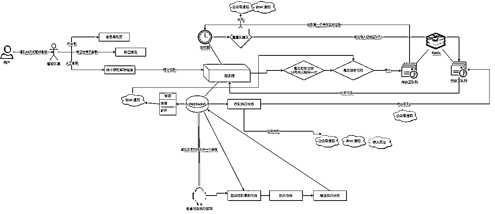

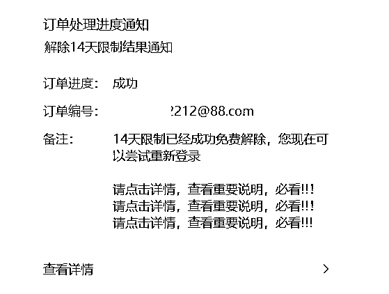

后来，随着客户越来越多，这么一套流程有点吃力了。就逆了一套APK的协议，直接通过网络请求进行登陆，不再需要脚本，大大提高效率。这个花了很多精力，因为 Spotify 走的是 Protobuf，不是普通的Http，搞过逆向的朋友应该都了解，确实挺麻烦。

#### 2.3 监控订单和网站

另外这里再分享个好玩的，因为商城代码可以自己修改，其他代码也是自己写的，灵活度高。

于是我对接了一个 Bark，可以在 IOS 上推送通知，效果如视频

用户下单我可以马上知道，

程序出故障了我可以马上知道，

代理 ip、打码平台资源耗尽了，库存不足了，，等等等等，都有 IOS 系统级推送

就和微信消息的级别一样，还可以设置不同的分组，图标，铃声。

后来我逐步添加了十几项监控，一切尽在掌控之中的感觉，非常爽。

自动收款和发货方面，重点就这么多，

做完这些事情，一天 1000 单，都能完美承接了，

### 3.售前优化

讲讲售前，

成交的关键是信任，售前是决定转化率的一大重要因素。售前做的烂，收钱收的慢。

首先是公众号的关注自动回复（欢迎语）

公众号作为流量入口，而欢迎语又是用户关注公众号后看到的第一个信息。重要性不言而喻。

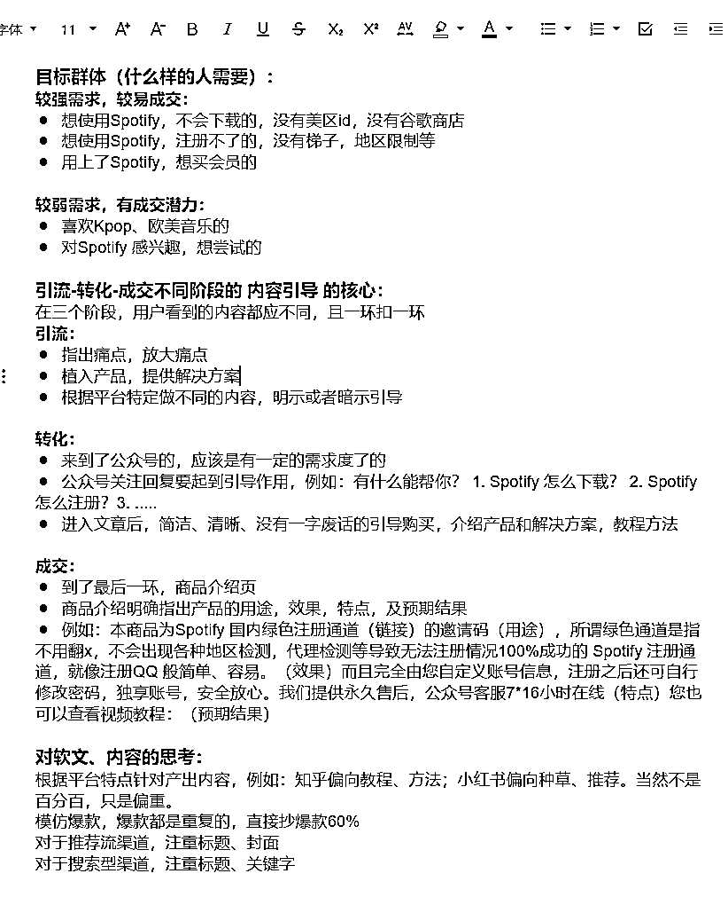

当时想的是，之后引流可能会做多个渠道，所以得想个文案，无论用户从哪里来，都完美承接，引导进入下一环节。

最后欢迎语我们是这么做的，效果还行，仅供参考：

（事实上连这段话都被后来多个同行直接抄用了....

上面文字内蓝色的链接，都是自己公众号的文章。

是为每个需求单独写的导购文章（如图）

事无巨细地教用户，如何一步一步的解决他们的问题（促进顺利的走完交易环节）。

然后我们还在商城的每一个商品下方，除了商品介绍，还做了一个视频，清晰展示购买全过程和购买后得到什么东西，有什么效果，甚至教用户如何微信付款。

其实这些都很简单，却让我们的转化率一直保持在 70%以上

林大鸟子多，客户基数一上去，形形色色客户都会有

有些客户真的什么都不懂，最好把客户全部想象成小白，想象成三年级的小朋友

换位思考，模拟用户走一遍全流程，进行优化。

关于售前的几个思考：

*   降低客户的决策成本和理解成本，降低下单压力，更不要设阻。

*   用户路径要短。不断做减法，删去所有无效步骤。无效步骤越多，客户流失越多。

### 4.售后

这个项目的售后，主要分为四个部分：

一、是上面说的14 天限制，

二、Spotify 还有风控机制，新账号注册后几天内，会被官方随机重置密码，客户必须重设密码才能继续使用。

三、会员代开相关的售后

四、另外一些、各种各样的琐碎的售后

对于第一、二点，都是做了个在线小工具，引导客户自己去使用，自动解决了，无需人工。

其他的大部分都是人工处理，使用的企业微信的「微信客服」接入到公众号，并配置一些智能回复，过滤掉一些常见问题，然后人工回复。

到这，整个项目的重点流程已经拆解的差不多了。

## 五、引流放大

接下来就是引流环节。

前期我们是想在全平台进行引流。包括百度SEO、贴吧、微博、豆瓣、小红书、抖音...等

后来，主要阵地选择的是小红书，其他的碰的就少了。

公众号我们一共做了 7 万多订阅。看起来你可能会觉得我们在引流方面投入不少功夫。

但其实我们自己从头到尾，只发了不到 5 个笔记加 2 个视频。

除了刚开始发布了几个小红书笔记，很长一段时间内我们都没做引流。

但是，流量没怎么断过，公众号每天都有200-300个关注，这非常反常识。

后来经过分析和问卷调查，才发现这些流量的构成是这样的：

*   不断有用户自发分享推荐我们公众号，在抖音、小红书、微博各大平台

*   他们发的小红书帖子多了、量上去了。引起质变，一搜Spotify，我们给霸屏了

*   用户自发推荐好友，老带新，大约占24%左右

当时我们都惊讶了，没做任何引导、奖励、激励，有这么多人愿意自发帮我们宣传，并推荐他们的朋友

我们知道后，主动给用户发红包表示感谢，

之后的每一次流量小爆，都争取找到发帖的客户，给他发红包

后来红包越发越多，我们干脆直接弄了篇文章，激励分享，裂变返利，四两拨千斤

发帖就给12元（等于白嫖注册+下载），然后奖励金额也设置了非常高，但我们仍然是赚的。

这样一来，效果更好了，甚至有用户在某篇笔记下评论是不是买广了...

其实我们确实还尝试过小红书付费投流，但没搞定一堆繁琐的手续，放弃了...

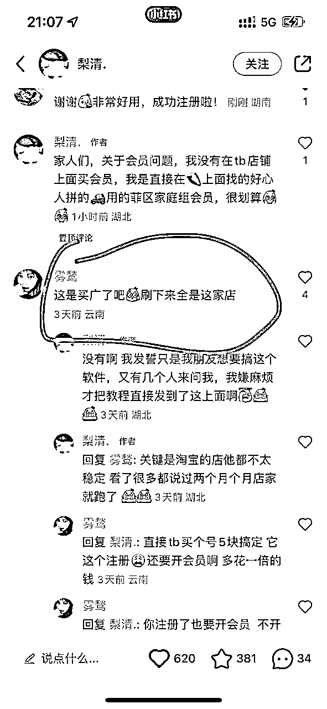

以上这些，大概就是我们在引流上做的，所有事情。

说实话很惭愧，这方面真没下功夫，其实一直知道，要想放大项目，在这个阶段，引流这个节点是非常重要的，

但还是主次不分的都花在了别的地方，醒着醉，不然数据还能好看不少，深刻反省。

## 六、风来了

那个新订单提示，刚弄上的时候还是蛮好玩的

最开始频率不高，一小时来个一两单，每次响起都开心的要死。

后来也多次小爆过，好的时候，每一分钟都要提示一两单，逐渐的也有点脱敏习惯了。

前文，已经将项目拆解的差不多了。这个时候，真的就是「万事俱备，只欠东风」。

项目已经跑了三四个月了，终于，在12月14日，

起风了。

那天下午，我手机上的订单推送响个不停，大概不到10秒就提醒一次新订单。

我习以为常，让他响了两个小时，后来觉得不对劲，因为它根本就没停下的意思，而且频率越来越高！

后来干脆就是，订单连着不停了，一个订单都没播完，下一个就来了，像加特林一样。

再到后面订单太多，服务器都给搞爆了一段时间，损失了不少

放点聊天记录给大家感受一下当时心情，

这一波流量，持续了两三天，到最后的数据：

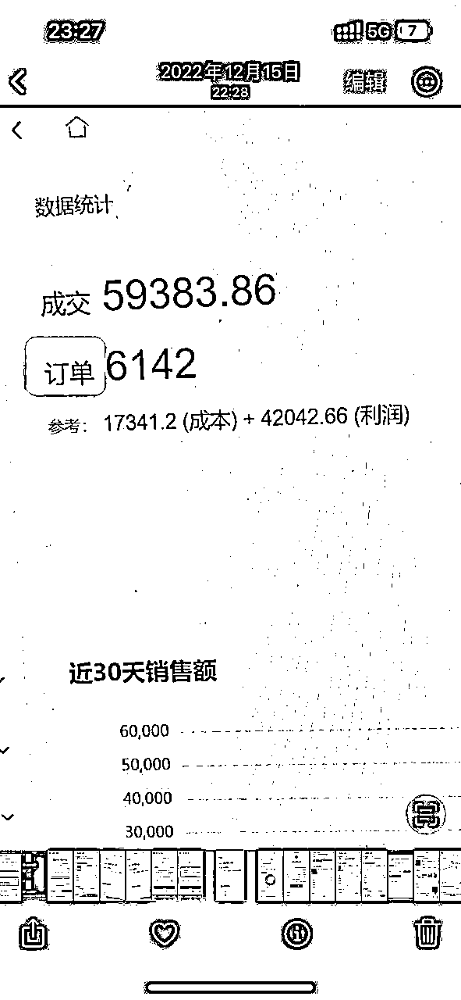

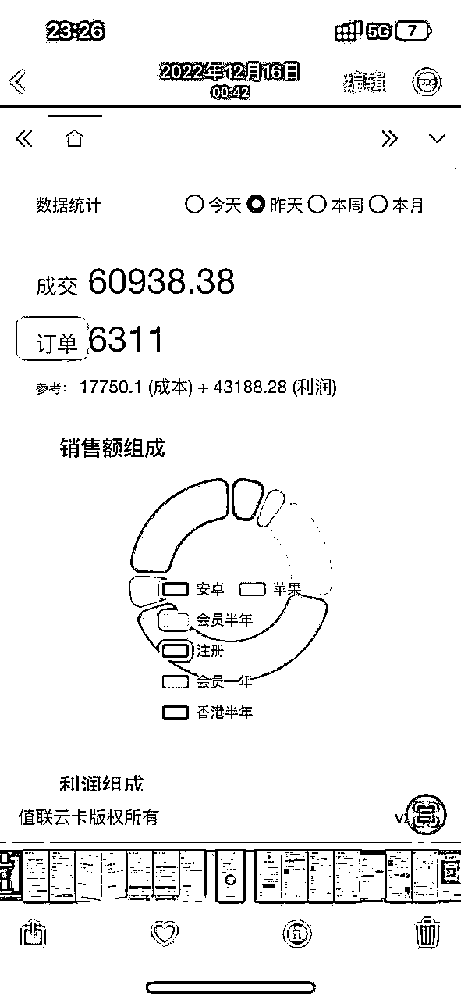

三天时间，加起来具体数字我记不清了，反正顶了之前一个月的gmv可能还不止

钱真是大风刮来的

和我还调侃之前的最高记录1w，

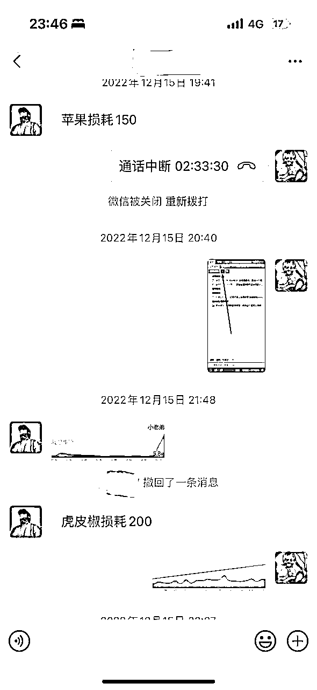

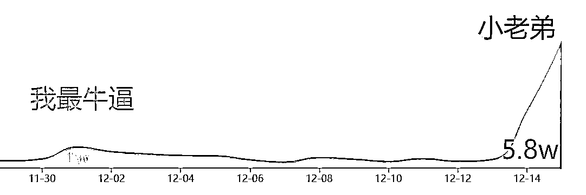

事后复盘，才搞清楚，这波流量的来源：

某位艺人 当时在Spotify发布了一首新歌，粉丝都想给偶像来打榜。

某位大v 发了个微博，推荐粉丝来我们公众号，粉丝蜂拥而至。

思考：

*   「赚钱是指数级增长的。开始赚得少，赚得慢，很正常。未来可能会有一天，赚到你之前一年的收入。」

*   「领袖效应」，这种流量是可以主动再造的。

*   「水能载舟，亦能覆舟」

*   再小的需求，也不要轻视

## 七、背后的事

「传统功夫，以点到为止」

项目到这拆解的也差不多了，已经很啰嗦了，不能再细了。

但别急，其实这事，实际上比我上面写的要麻烦不少

有句话可能你听过：你所看到的都是别人想让你看到的。

不能只见贼吃肉，不见贼挨打。

今天，给你扒一扒这看似简单的项目，实操过程中遇到的困难与踩过的坑：

*   在第一步需求挖掘，其实我不是第一个就直接挖到 Spotify，在此之前，我挖了七八个软件的相关需求，花了一周左右进行分析、测试和验证，全都无果。

*   折腾备案，等待审核、CDN调试、对接支付渠道和公众号各种（以后要准备好）

*   网站因为部分元素和Spotify官网相似，被谷歌认定钓鱼欺诈，进而所有ios用户都因此爆红无法访问，修改后，申诉审核了一两周才恢复。

*   网站程序修改更新总计400余次

*   新注册的域名被微信拦截，上官方论坛找微信团队申诉，发了四五篇邮件，反反复复折腾了一周才彻底解除。

*   同行抄袭，辛辛苦苦写的文案、做的图片素材，原封不动照搬拿走，然后和我们打价格战，截流

*   ...

这些还只是信手拈来，脱口而出的一小部分，冰山一角，更多的我也懒得细想了。

甚至有些坑还是因为经验不足，自己挖的，

这些困难和坎，我一开始也不知道，干起来后，才接踵而至，

如果真的在一开始，就有人摊开全部困难摆在我面前，我还可能真的会被吓退

有些问题，不是空想能想到的。想的问题，和干起来才遇到的问题，往往并不是一回事。

回头看，好像也没啥感觉，都是垫脚石罢了，

不是么，「杀不死你的都会让你更加强大」。

所以前期不用想太多，什么小问题，大问题，都是常态。

出现一个解决一个，神挡杀神，佛挡杀佛

* * *

话是这么说，但后面来了一尊大佛，真杀不动了。

1月10日左右，公众号因举报被永久封停，我们急了10分钟，启用了备用公众号。

2月16日，备用公众号也被封。想了想，第二天放弃了，主动退场，不再折腾。

Spotify 只是一个听歌软件，未进入大陆的市场。可能是政策收紧吧，也有可能就是被恶意举报，或者因为其他原因。

既然封号就肯定有原因，不和政策、平台对着干。

虽然之前的同行，闲鱼、淘宝、或者公众号，现在还在做

但我仍然选择退场。

为什么？不破不立，直接开始下一个，没什么好惋惜的。不挣最后一个铜板，落袋为安。

## 复盘和总结

这篇文章是我对这个项目的复盘拆解文，是写给大家的，也是写给自己的。

最后给自己来个反思总结：

*   完美主义陷阱：应该将大部分精力用于重点、效果明显的地方，而不是一些细枝末节上。 应该抓住重点，分清主次。

*   事必躬亲：没有用好人力杠杆，客服没早请，精力有限，应该只干最擅长最重要最核心的部分。

扩展思考，欢迎交流：

*   这个项目操作思路，举一反三，还可以怎么变通？变成一个新的项目？

*   这个项目如果你来做，你打算怎么做？或者某个小环节你是否有更好的方案？

*   这个项目如果你来做，你会如何进一步放大？

*   矩阵？

*   放大重要环节？

*   跟同行合作，做上游？

*   来的是客，也是盟友。发展客户？

如果你耐心的看到了这里，首先给你点个赞，

能耐下心来读完一篇长文，我认为在这个时代已经超过了90%以上的人。

读文不易，写文也不易，都辛苦，希望你也可以返回生财帮我点一个赞，谢谢。

最后，感谢几位兄弟帮忙审稿（不分先后）：@J森、@白龙、@涂白、@曹铁锤；感谢生财有术，祝生财越来越好，祝圈友们年入小目标！

感谢阅读。

欢迎指导批评，评论区有问必答