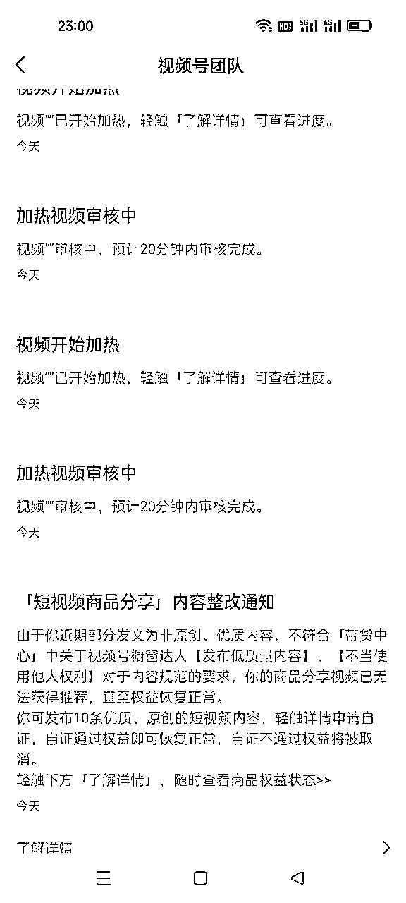
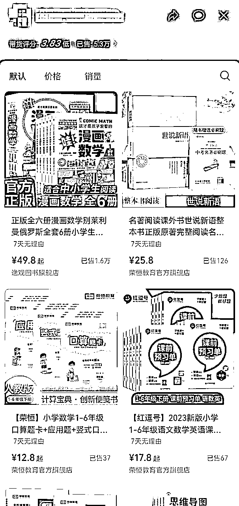
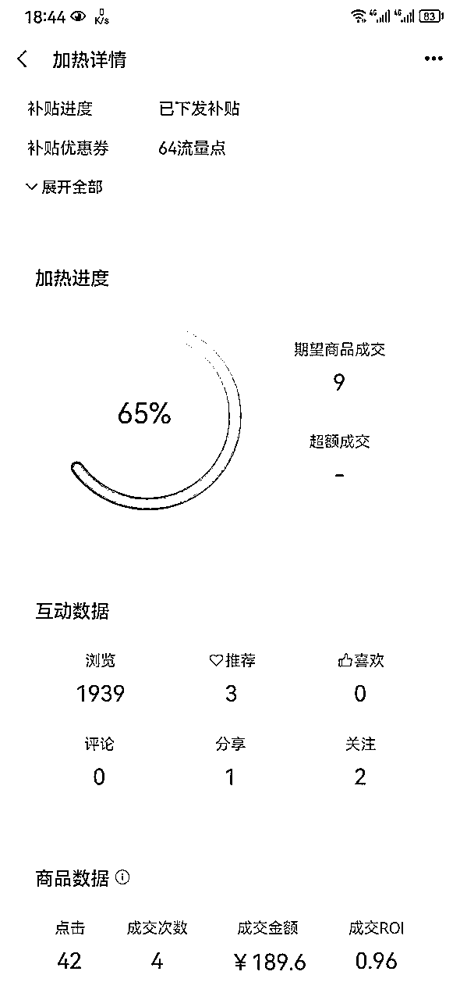

# 《视频号短视频挂车投流常见问题和解决方案》

> 来源：[https://md8vbz6pkh.feishu.cn/docx/MU24dKNZ0otgnlxzOmbcPyJLnzf](https://md8vbz6pkh.feishu.cn/docx/MU24dKNZ0otgnlxzOmbcPyJLnzf)

大家好，我是纸壳，之前写了一篇关于视频号短视频挂车投流的帖子，里面只写了大致流程，很多细节没有写太详细。很多朋友看过后找我问了很多问题，交流后发现大部分人遇到的问题都差不多，结合我在实操过程中遇到的各种情况，给大家总结一下挂车投流过程常见的问题和解决方案。

短视频挂车流程见：从0到1全流程跑通，目前视频号最稳定的带货玩法--短视频挂车投流

# 一、帐号问题

## 1：如何开通购物车权限

随着5月16号新规实施，以前0粉强挂车的玩法成为历史，现在想要挂车就必须开通购物车权限，好多朋友就卡在这一步，开通权限的要求是

1、1000粉丝或者开通小店

2、符合内容规范的

3、发表公开视频内容>10条

最近经过大量测试，总结出一套开通购物车权限的方法

第一条，如果没有千粉，两个方案

1、搬运婆媳关系、剧情、社会百态等内容涨粉，有几个号直接爆了几百万播放量，一晚涨粉两三千

2、开个体店，只点击开店，不填资料不交保证金，目前主要用这个方法，快省事

第二条，符合内容规范

这个也很简单，经过我们测试，直接到抖音找画面精美的直播间录屏，然后切成20秒一条的片段，上传到视频号，间隔半小时定时发送，10-15条，一般一到两天就能符合规范

更新：最近这个方法也不太好用了，新方法，用手机版视频号点拍摄，用系统自带的贴纸特效等功能，拍摄10条以上内容发布，连怼两天，大概率能过

第三条，完成第二条就够了

## 2：帐号被限制加热，如何解决

最近平台对挂车素材的审核又严格了一些，很多人都遇到账号被限制加热的情况，要求发10条原创优质素材，然后7-10个工作日审核通过后解封。

之前的方法，是拍10条风景或抖音搬运冷门素材，按流程上传，然后等结果，有一定概率解封，但是效率很低，账号要很长时间用不了

最近研究了一个方法，可以当天解封，而且不需要发10条原创，就是申诉，如下图，上午收到提醒被限制加热要求整改，下午就解封了，正常加热。

同样方法用到其它两个账号也解封了，目前100%通过率，方法就是去申诉，为避免雷同，话术大家自己想，站在平台的角度想，什么样的申诉能过

更新：用了几天之后发现这个方法能卡bug，在购物车权限的位置显示还让我传10条原创，但是实际的挂车权限已经恢复了。然后这几天使用的过程中，发的很多视频被判搬运了，但是都没有处罚。举个例子，我在路边违停，被贴了一张罚单，通过申诉系统把违停记录删掉了，但是车窗上的罚单没撕，其他交警看到违停车上已经有罚单了，没有再次做出处罚。

## 3：带货号橱窗分过低，不能加热怎么办

账号的橱窗分过低会被限制加热功能，我的一个账号带货5.3w单，橱窗分掉到了3.75。如果用刷单刷好评的方法，需要刷几千单才能到4.1分以上，还会有很大可能被系统惩罚。

在仔细研究规则后发现，涨分的方法除了刷单刷好评之外，还有一个更好的办法，那就是橱窗内添加高分店铺的商品

橱窗分的考核维度是

1、橱窗内商品所属店铺评分

2、橱窗内商品好评率

1的店铺评分只需要将商品添加至橱窗就算，2的商品好评率需要在橱窗内出单才算，所以添加高分店铺的商品，是最简单的涨分方法

橱窗分计算的是（T-1到T-90）的数据，每天12点更新。经过实践测试，我3.75分的橱窗在添加高分商品后，第二天提高到3.79分，第三天提高到3.83分。方法有效，配合微刷单会更快，把分提高，再配合出单量，会给用户更强的信任度，提高转化率。

# 二、选品选素材问题

## 1：什么样的素材适合挂车投流

根据爆品素材的相同特征，总结了挂车素材的几个基本要素

1、画面清晰，语言流畅，画面不清晰的素材不仅影响转化，甚至都影响消耗

2、有字幕，字体要大，这个很好理解，字体小了老年人看不清楚，甚至看着难受

3、有讲解，声音有亲和力，语速要慢，这点很重要，有讲解的素材比没有讲解的转化高很多

4、广告性要足，拒绝泛娱乐，泛娱乐的素材适合自然流，不适合付费流

5、产品卖点要足，使用效果展示明显甚至夸张，最核心的点，最好能颠覆用户认知，比如手电筒还能这么亮？？去油污效果这么夸张？？

满足上面的只是基础

## 2：爆款素材的底层逻辑

做视频号最核心的部分就是品和素材。二流的品+一流的素材，依然能打爆；但是一流的品+二流的素材却不一定能爆，从这个角度看，素材的重要性要高过品

那到底什么样的素材是一流素材，根据过往经验和对市面上爆款素材的研究，我们内部提出了一个“三级信任”的概念。

在用户看完视频后，促使用户下单的最核心因素是什么？痛点？产品效果？逼单话术？在我们研究了大量素材后，得出一个结论，促使用户下单的最核心因素是信任。

想象一下，如果你的亲朋好友向你推销一样产品，你会不会更容易下单，为什么呢，就是基于信任。视频号用户下单首先是基于对平台的信任，然后才是对于内容的认可。

为什么现在有些品的素材发出去，很多人会评论不好用，骗人之类的，是因为信任被破坏了。其它因素都是建立在信任的基础上，没有了信任效果展示再牛逼，用户也不会下单。

那从信任的角度，我们为素材做了分级

一级信任：普通展示介绍产品，优点、效果、实用性等，大多数素材都处在这个级别

二级信任；真人出镜，直接使用，让用户看到更直观效果，增强信任度。如美妆类素材

三级信任：人设，通过场景、服装、造型以及口播话术塑造出人设（当了十年化妆师，发现很多人都不会涂口红；咱们正宗的草原牛肉干啊，都是这样风干晾晒的），信任度拉满

好的素材一定是先获取用户信任，让用户放心，再用效果让用户动心。信任解决凭什么在你家买的问题，效果解决为什么要买的问题。理解了这一点，选素材爆的几率更高，并且不再单纯靠运气

满足这个是核心

## 3： 适合视频号的选品方法

之前的选品方法一般是从蝉妈妈考古家等榜单中筛选，再一个是跟带货达人的品，还有跟同行品或者刷到的爆品

除了这几个还有一个比较适合视频号平台的选品方法，就是跟抖音测评号的品

测评号发的视频一般分两种，

一是智商税产品，博主测评之后提醒用户不要买，吸粉并强化信任度；

二是他们带的品，测评之后说很好，粉丝们可以买。

因为他们发的品都是经过筛选的爆品或容易爆的品，从而能更好的给他们带来流量

所以这两种品都很适合视频号，智商税的品，老年人很吃这一套；效果好的品，更适合了，容易展示效果，更好转化

这个方法需要做的就是关注足够多的测评博主

# 三、过审和投放问题

## 1： 挂车短视频不过审的常见原因及解决方案

1、混剪拼接博眼球，这个问题主要是三个维度，不同场景过多、出镜人过多或前后不一致、音画不同步、视频中有极限词。解决方案，根据视频内容对应修改即可

2、推广内容与商品无相关性，两个原因，一是视频中的产品品牌样式和链接中对不上，二是产品露出过少。解决方案，1.统一产品样式，素材内遮挡或链接里换图片；2.提高素材内产品曝光比例，提高不了的在视频角落放产品图片

3、过度营销恶意营销，主要原因是话术脚本中夸大功效、虚假承诺。最好换素材，这类查的很严，发多了会限制加热功能

4、无资质发表，一般是素材中出现或疑似主持人、律师、医生等需要资质的人物。换素材，发多了限制加热

5、预计不能达到加热效果，原因是素材重合度太高，重新处理或者换素材

## 2：低客单怎么卡赔付

高客单品打起来之后可以用大额计划卡赔付，基本能保证不亏钱。但是低客单品一般都是小额多笔投放，因此很难做到卡赔付。

之前的卡赔付标准是6单6点击6赞6关注，最近调整为4单6点击4赞4关注，经过我们测试，点赞和关注实际上不影响赔付标准，只要达到4单和6个点击，同时出单成本＞出价成本20%就能触发赔付

因此低客单卡赔付的两个核心点

1、投放金额足够达到出4单和6个点击，如：出价400豆，100块预计出3单，很难出到4单，那么提高到500块预计13单，就大概率能卡到赔付

2、出价足够低，如：出价400豆，100块预计出3单，很难出到4单，那么压低出价到150豆预计出7单，就大概率能卡到赔付

1和2要结合起来用

以我卡上赔付的一条计划为例，出价330豆，金额3000豆，预计成交9单，实际成交4单，成功卡上赔付640豆，赔付前roi0.96，赔付后roi1.46，这个品1.1保本，从亏钱到赚钱

## 3：一测二测都出单且赚钱，放量就亏钱的原因及解决方案

这个情况很多朋友都遇到过，一测二测出单而且roi还不错，自信满满放量，roi直接拉胯，为什么会这样

先说为什么一测出单且roi很高，虽然目前平台的用户标签不精准，但是电商人群和娱乐人群的标签已经被打上了，当一条挂车视频第一次出现在平台上，并且被加热，平台不知道哪些人群符合该素材需求，看在钱的份上，多给一点电商人群看看数据，因此一测往往出单且roi高。

然后为什么放量就拉胯，假设平台有1万电商人群，100万娱乐人群，每条计划出100元，推送给1000人，电商娱乐比例2:8。

放量后，因为同一条素材不会给同一个人推两次，所以每条计划给分配的人是不同的，随着计划增多，圈定的人群越来越多，娱乐人群也越来越多，这时候如果内容不够优质，roi不可避免降低

如何解决

1、核心点提高素材质量，这个不行后面都无效

2、提高计划购买力，从100元买1000人，提高到2000人，降出价

3、提高电商人群比例，2:8变成3:7，通过计划调整人群标签

4、优化sku，变相拉高客单价，增设高价sku，但要想办法凸显性价比，引导用户购买

# 四、记录一些心得感悟

## 1、快钱里面藏着陷阱。

视频号能不能赚快钱？能！一条视频或者一场直播卖几万几十万都有，而且成功案例不少。可是这成功的背后，是付出大量时间精力，去研究去测试去积累的结果，不是随随便便就能捡钱的。有运气好的，误打误撞赚一些钱，相信我，凭运气赚的钱一定会凭实力还回去

最近很多朋友，看到有人在视频号赚到快钱，也想进来“捡钱”。但是只看到别人赚快钱的果，不去深究别人能赚快钱的因，甚至都不想了解。就是我来找你了，你给我一根金手指，让我点石成金，让我捡钱就好了。千万别让我努力更别让我动脑子。

可能描述的有点夸张，但是大差不差，做项目浮于表面急于求成，刚开始做的时候想的好好的要如何如何，但是一个星期一个月拿不到结果就开始心浮气躁逐渐放弃

不忘初心，能做到者寥寥无几

所以说快钱里面有陷阱，看不透的人兜兜转转求而不得，最后在各种快钱之间来来回回一事无成

## 2、有的人活该成功，有的人注定失败。

我观察过很多人，相同的资源相同的项目，有的人一个星期上手，有的人半个月了还在纠结于某个快捷键怎么用。

区别在哪，是否主动且能否吃苦，不仅是身体上的苦，还有精神上。

主动的人会动脑子思考，遇到问题会到处查资料，会快速试错，找到核心点，快速解决问题。做难而正确的事，不找借口，不达目的誓不罢休；

被动的人遇到问题会抛出去，扔到群里，等别人投喂。遇到困难，或在细枝末节低水平重复，或原地躺平。善于安慰自己、欺骗自己和原谅自己。

最后的结果天差地别，一个打到最后一关辛辛苦苦砍BOSS爆装备；另一个在新手村快快乐乐捡药瓶。

知行合一，能做到者寥寥无几

所以说有的人活该成功，有的人注定失败。想逆天改命你能吃那个苦吗？被BOSS砍一刀多疼啊