# 小红书电商 单人月入6k实战sop

> 来源：[https://wxm1taza3m.feishu.cn/docx/MZdRdgP8ToYBJ3xH2eacRtzgnrh](https://wxm1taza3m.feishu.cn/docx/MZdRdgP8ToYBJ3xH2eacRtzgnrh)

大家好，我是行一，是小红书引流私域教练，同时也是个喜欢上科技的电商玩家，小红书电商两个月纯利10w＋。

先上来给大家看看我团队这两个月的战绩

这些都是我这边的数据，所以一定要看着文档一起行动做内容！

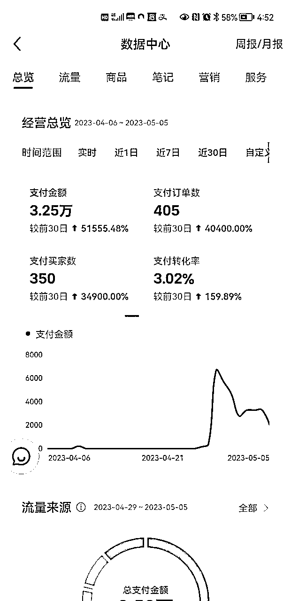

接下来，开始实战的分享

# 目录（更清晰）

熟悉小红书开店流程

产品批量上架产品发货教学

小红书账号三天快速养号

小红书用户群体爆款产品发掘

批量制作小红书爆款笔记教学

小红书账号运营运营及数据分析

# 熟悉小红书开店流程

## 小红书电商开店流程

个人身份证只能开一个个人店店铺，然后营业执照可以开三个专业号（专业号需要600），然后开通三个个体店店铺，目前平台是这样规定的。

### 1.电脑端店铺注册

小红书商家端（店铺）https://ark.xiaohongshu.com/app-system/home

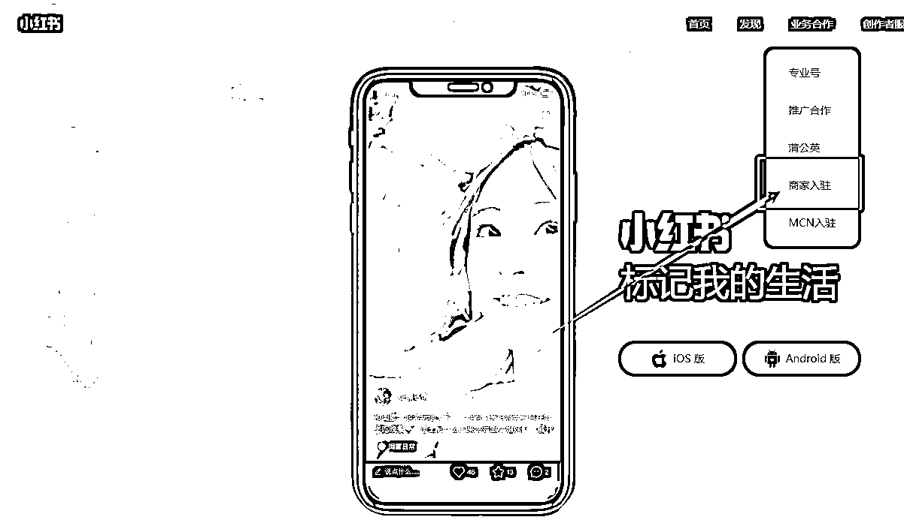

1.手机上下载好小红书APP，注册好账号

注：小红书账号名也是店铺名，可修改，刚开始要去搜搜看看有没有同名店铺，防止注册不了，一般名字＋字母比较好

2.小红书账号名和头像，介绍等开店前先设置，或者开店后再修改设置都可以，如果实在没任何想法就上传个美女照片头像，名字找个词➕字母

3.然后走流程注册好就可以，微信扫脸认证审核，开通微信和支付宝收款

目前改了规则，开通微信和支付宝均需要交1000保证金，可以不开通，等提现再开通，不影响你发视频出单

注：微信和支付宝认证的时候，在设置主体信息有一个选择经营类目之类的，选择零售经营这些就可以，它不是店铺经营类目，而是商户开通收款的验证而已，不用担心影响店铺实际经营类目，小红书和淘宝店一样是可以做多类目店铺的

### 2.手机端店铺注册

小红书APP，右下角【我】-左上角三道杠-创作中心

进去后有个【更多服务】下方就能看到【开通店铺】按钮了

进去填写个人信息就可以开通了，营业执照需要先开通专业号再开通店铺，个人店已经开通再需要开个体营业店，个人店需要升级为个体店。

## 小红书店铺基础设置

### 1.店铺基础设置

手机端下载一个【小红书商家版】，主要是日常处理客服消息和查看数据

店铺后台审核通过后，需要设置两个地址，一个发货地址，还有一个退货地址，记住是新建两个地址，不要搞一个地址

【物流模板】也要设置，模板那个名字随便写

退货地址选择台湾或者国外（美国），详细地址填写退货联系客服要地址，这个重要的点要记得设置

因为现在大部分订单会有极速退货，也就是系统自动同意买家退货，然后会把默认地址给到买家。

如果是做无货源的话，那我们在详细地址这里可以参考我的设置，这样的话买家会找我们要退货地址，我们再把上家的退货地址给买家就可以。

信息公示这个不要忘记，不然之后上不了架

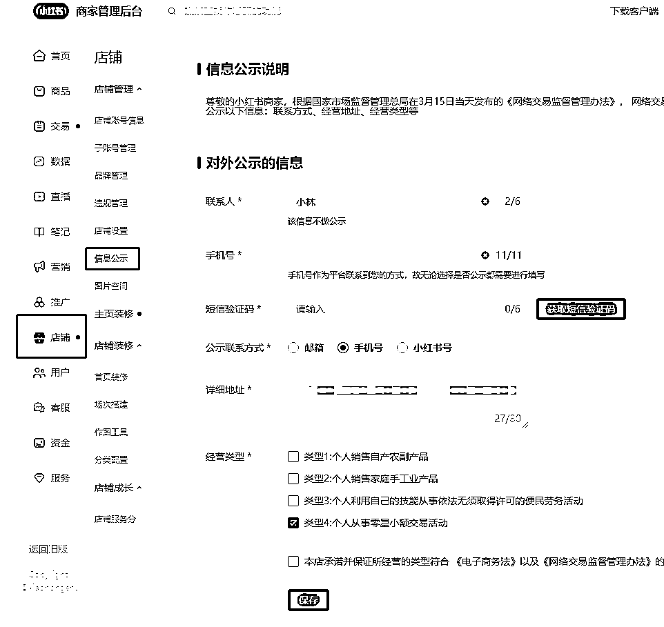

售后设置为商家自主提供退货服务，运费宝建议开通，不开通也可以，但可能用户更喜欢运费险，不开影响转化率，建议前期不要开，等赚钱了再开，当然退货率高的品可以开通。

### 2.保证金问题

店铺保证金可以暂时先不交，另外月营业额超过1万后平台会扣5%的服务费，如果达不到1万的营业额，会退还服务费。

保证金也是阶梯波动的，营业额高了后，需要增加保证金，具体是根据上个自然月的营业额为周期上调或者下调，最高为2万保证金，具体可以查看后台保证金管理规则。

# 产品批量上架产品发货教学

记住，上品建议【服务市场】找蚂蚁搬家，拍单建议【服务市场】找逸淘

## 上品

蚂蚁搬家http://xhs.gege5.cn/zkXiaoHongShu/copy#

看一下软件实操文档

然后记住一个点，不要选品牌

价格设置

价格设置为X【200】%+2，市场价设置为X【300】%+3，选择【四舍五入】，只有价格是重点，价格也可以直接从蚂蚁搬家点击编辑进去改或者去商家版后台商品编辑里改

商品上传不要带别人店铺logo的图片，上传成功要去商家版后台【商品】中【商品列表】上下架中上架所有sku，不然商店不显示商品

## 拍单

逸淘

http://xhsweb.yzcsoft.com/pages/home.html

看一下操作视频，具体操作视频都有讲

建议大家选择关联那种，发货很快

# 小红书账号三天快速养号

准备至少一两个账号，开始养号，保持好心态，我这边目前测试数据来看养号的比不养号爆的快

## 养号第一天：

1.注册好账号，尽量一卡一机一号，如果是批量起号，不要连接wifi。

2.注册时会有一个页面让你选择年龄和兴趣爱好，尽量选择自己要做的类目，方便系统给你手动打标签的机会。

3.刷对标账号

（在小红书的搜索栏里输入你做的品领域关键词比如：夏季短袖，拖鞋等）早中午各刷10分钟。

（找粉丝越多的账号关注点赞，收藏多互动，后续容易让系统推荐）

## 养号第二天：

1.确定账号定位，完成基础设置

2.进行浏览同领域的对标，早中晚各刷10分钟

（早中晚各自10分钟即可，浏览时不要刷的太快）

## 养号第三天：

1.继续浏览同领域的对标（早中晚各自10分钟即可，浏览时不要刷的太快）

2.关注薯管家

3.编辑好明天的发布视频（图文）准备发布

养号结束的一个月内需要天天发，保证输出质量，有利于系统推荐

注：发布后不要自己频繁浏览自己作品，不要过度解读数据！发内容只为提高账本号权重，观察数据可以在商家后台观看

# 小红书用户群体爆款产品发掘

## 如何找到小红书的爆款产品

### 一是小红书搜索最近选品

我们需要了解小红书的搜索功能，我们选择做一个账号一定是要垂直的账号，需要做能爆的账号，爆的前提是账号要垂直，内容要好。

这样我们就可以通过搜索相关品类关键词，看最近的一个月流量如何，来判断这个品适不适合做

然后要想找到爆款的品类，可以搜一下这个品的内容看个30min，然后退回到主页去刷推荐，多刷刷慢慢你就发现可以做的品了

刷推荐进去看看视频的评论区是不是都是意愿购买评论，还有看看店铺的品是不是一个高销量的品（大于100销量，百单很吉祥）

如果都符合就可以直接跟款上架输出内容，有很大的几率为爆款。跟款的同时要多刷刷自己的主页并且记录下来也是找爆款的关键

### 二是电商平台热门选品

现在目前小红书的电商很多品类都是来自于其他电商平台，很多博主的无货源也是来自其他平台，常见的有拼多多，1688，还有的在抖音上

我们拿女装举例

这些排行版类的多看看

接下来是抖音和1688的入口，去看看最近热销的女装排行版，1688的数据是最能看出哪个比较火

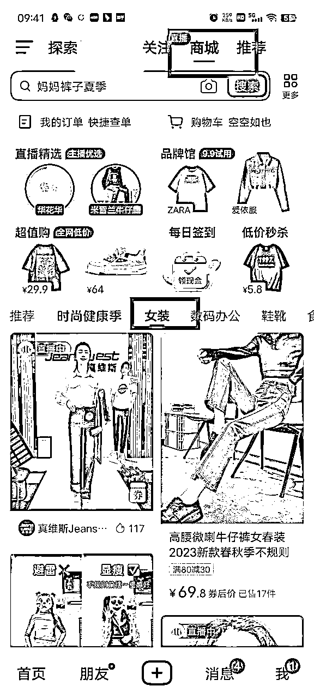

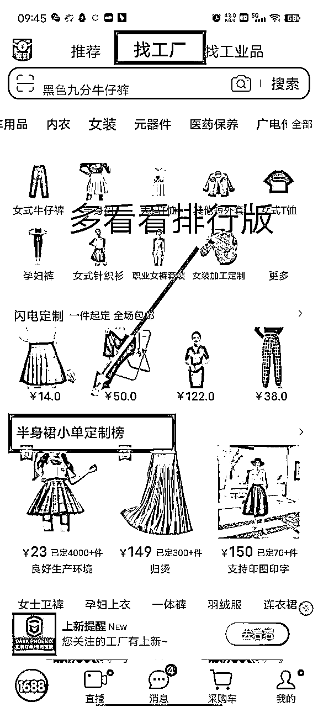

以上是我们需要了解的入口，可以找到好的爆款产品

## 如何找对标账号

这是我最可以拿出手的东西，我总结就是四句话，大家一定要仔细研读

行一找对标四句话

### 1.低粉 一万粉以内，高的不要看

### 2.高赞 赞数大于粉丝数

### 3.最近的 看最近一个月，因为周末看的人多，选一周参考没意义

### 4.多次出现 当你刷的主页推荐，这个封面多次出现，说明这个账号就是好的对标，抄就完了

用爆款品类搜索的品类关键词或者商品的标题然后去小红书搜，用这套方法从上到下翻，找到适合自己的对标

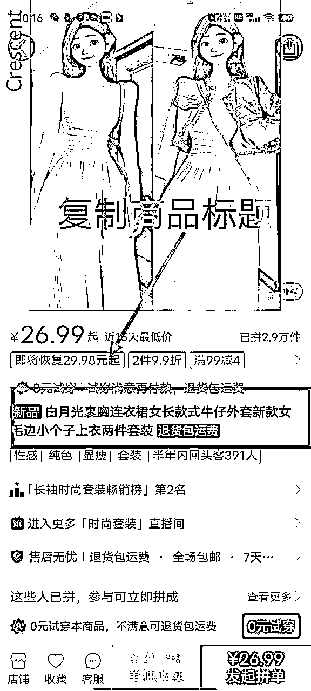

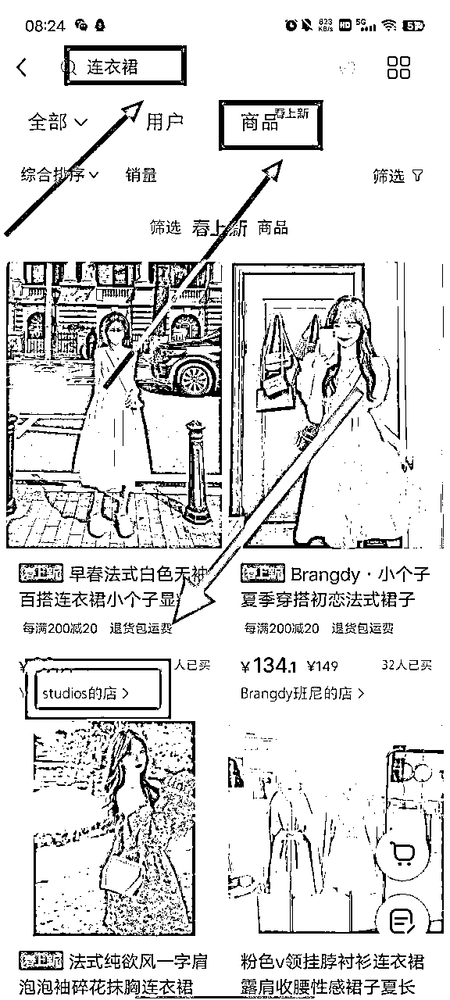

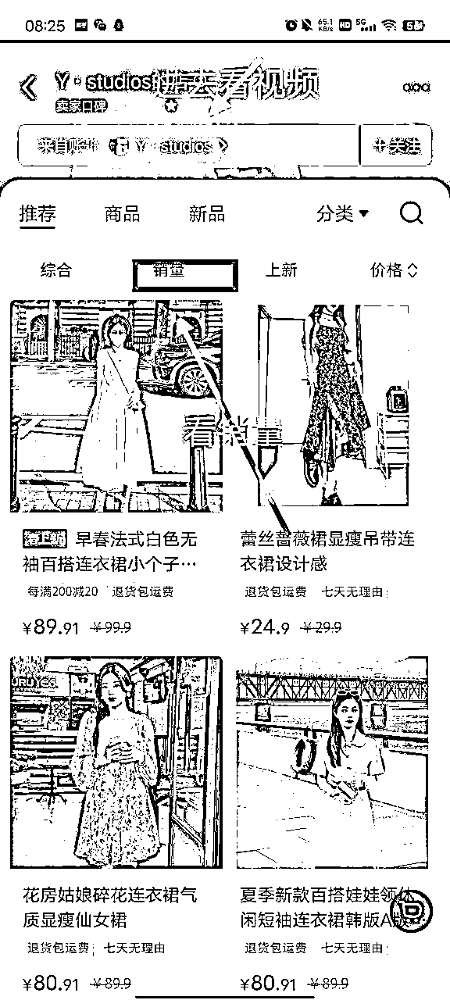

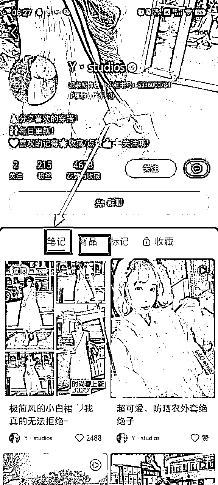

通过别人销量看她们产品是什么，然后看笔记的内容，来分析哪款内容爆了，同时按照找对标四句话来判断适不适合对标

记住，好的对标决定我们接下来账号的垂直度和爆款，接下来一定要去找自己好的对标账号，然后去模仿创作

批量制作小红书爆款笔记教学和小红书账号运营运营及数据分析

# 批量制作小红书爆款笔记教学

## 小红书带货视频创作全过程

我会把我录制的课程分享出来

因为剪辑不是用打字就可以说清楚的

### 剪辑视频教程

### 手机剪映

手机版剪映一键成片，这个效率高

### 电脑剪映视频笔记

A抖音最新视频+A或BCDE来源买家秀

A抖音最新视频+淘宝主图视频+A来源详情图+买家秀

找来的视频进行优化，重点提高原创度，扬长避短

注：给新手的建议是前期用微信小程序去水印下对标视频，然后把别人视频混剪，抖音视频可以以标签形式找

图片封面和视频内容都是相通的道理，重点重点就是提高原创度，把素材运用到极致，一套买家秀可以有多种随机性创作，可以各种形式各种方案。

注：以上只是逻辑整理，要学会举一反三，迁移思维，多看同行视频风格总结内容找到他们爆款视频的点子，直接混剪着抄

这是视频例子

### 最后分享一下剪辑教程

https://wxm1taza3m.feishu.cn/docx/SPJTdzjERowTEwxoRIAcYANHn9N

## 小红书图文和视频素材寻找

这里我想说，小红书笔记最花时间的就是找素材

我们怎么找到混剪的素材呢

### 1.站内本身素材

想要什么品素材直接搜索

按照选品讲的找到爆款素材去下载下来

图文的素材可以混剪成视频

视频的素材可以截图做图文

### 2.站外素材

第一是淘宝

淘宝的识图不要忘了

看看商品详情还有商品视频

还有评论区的好评图片

这些都可以下载或者截图下来作为混剪素材

淘宝这样，拼多多和1688也是如此

这里也是搜图

也可以搜索，但不咋好找

抖音短视频平台我来讲讲

这里就不讲数据软件找素材了

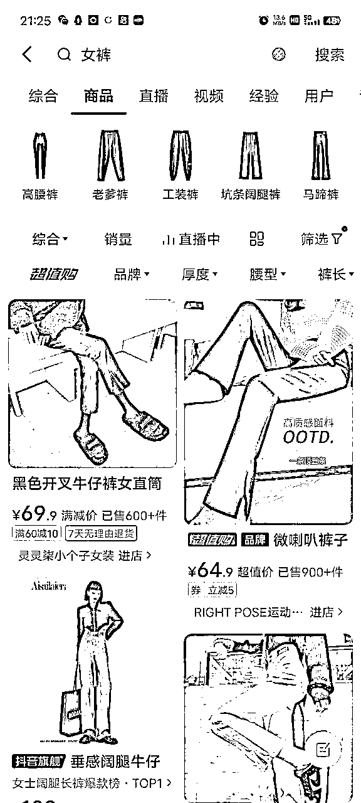

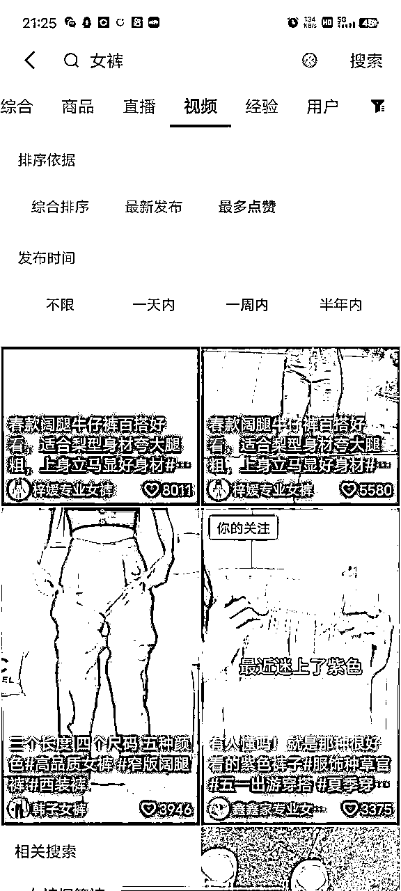

就这样去搜索，商品可以识图，也可以搜索关键词，关键词也详细越精准

其他短视频平台一样，学会举一反三

## 如何快速批量矩阵做号

1.学会一次性扒素材

对于大多数人就是素材不够用

所以我们就要上脚本去爬素材

手机小程序去水印

多去下点素材

2.学会建立自己素材库

素材下好了，需要我们去整理规划每个素材

一定要整理起来，搭建分类好

3.学会建立自己的文案库

发视频最烦的就是文案，这个我们只要把同行的文案群一次性扒出来，然后复制粘贴在飞书文档上

像这种

可以直接改着用

这样我们不缺文案

4.一定要学会素材多样化利用

素材有图片和视频

图片可以混剪

视频可以混剪

图片➕视频也可以混剪

学会多样化利用

# 小红书带货账号运营及数据分析

带货账号运营

带货账号是哪个

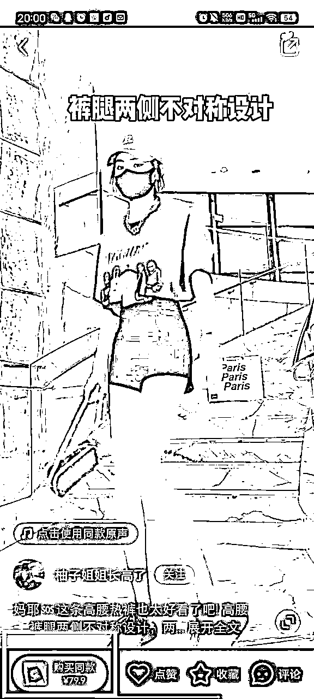

就是这种账号

就是互联网其他平台找素材混剪

我们对账号的运营就多怼素材，封面和视频内容是我们需要注意的点

这种多看看同行

关于数据分析

刚开始不要看小眼睛

大概50以上都是正常的

怼多了

之后小眼睛就上来了，说明权重起来了，账号标签有了

小眼睛平时100多，可能很快破了1000多

这种就很好

接下来就是优化自己的账号内容，等待爆单

发布时间

中午12点，下午3点，晚上5点，晚上8点，晚上11点

中间最少间隔1个小时

# 真诚利他分享我的实战sop，接下来，干就完了