# 公众号公域流量爆发+新流量入口

> 来源：[https://c75rzod2h6.feishu.cn/docx/NSJLdjAUUosmAixOHIWcFI93nob](https://c75rzod2h6.feishu.cn/docx/NSJLdjAUUosmAixOHIWcFI93nob)

大家好，我是张柯Ker，

被亦仁老板抓过来分享了，

本来是快闪付费内容，在这里公开分享了，群不进人，我也不培训，纯分享，

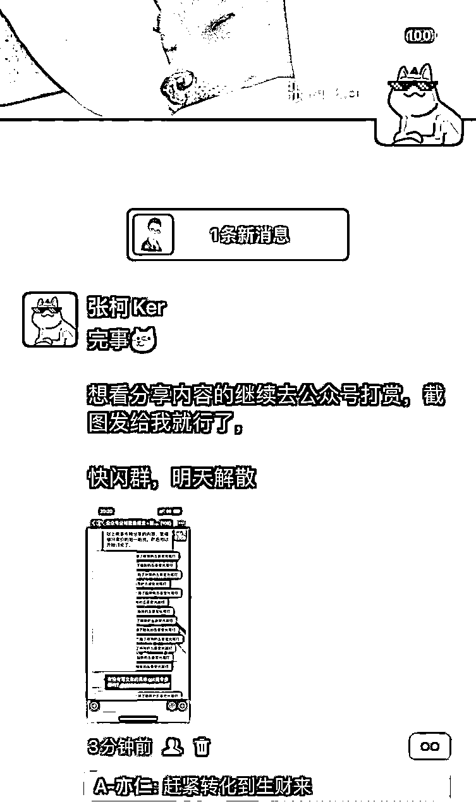

最近关于公众号流量主收益的项目层出不穷，不管是生财的爆文写作航海也好，最近的AI绘画热点也好，

核心要点就是文章的阅读量会突然爆发，但又不知道这流量是哪来的，主流打法就是，更新，等自然流，外面收费都很高，纯交个朋友来分享一下，内核都是一样的，

我看到最牛逼的人，是用chatgpt批量写狗血情感文，月入8w，纯流量主收益，

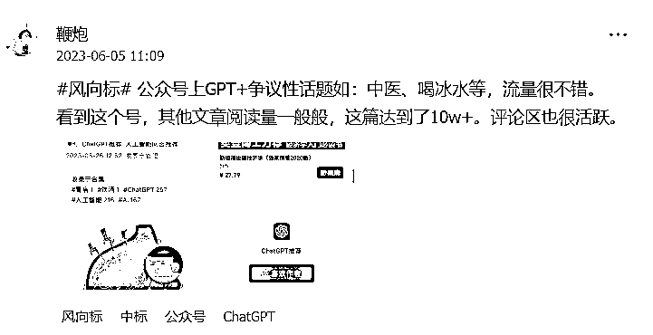

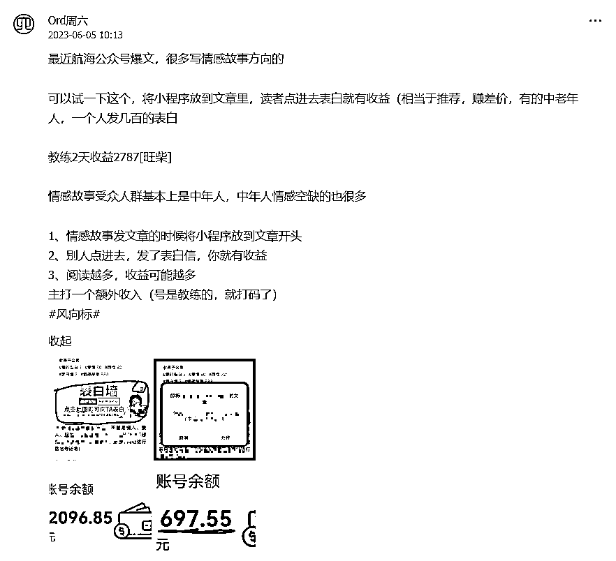

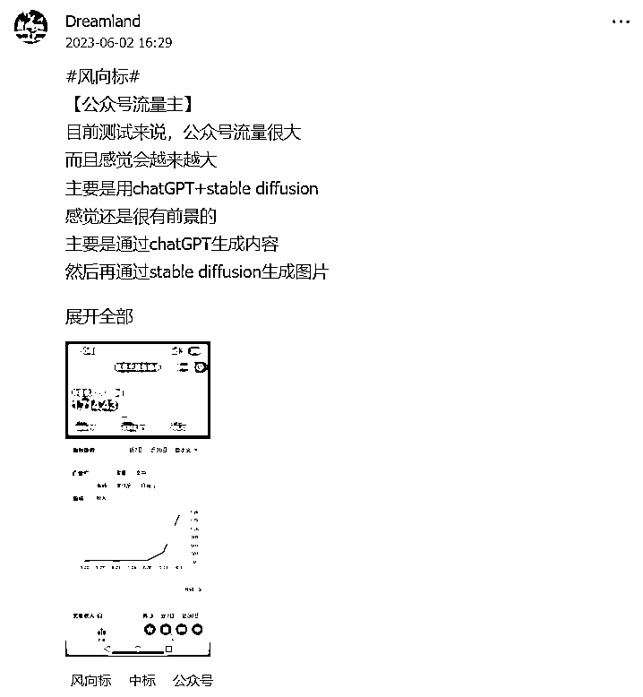

一开始我以为流量是通过SEO来的，

但通过分析多位大佬的后台截图后发现不像，因为如果不是超级热点事件，不会突然爆发那么大的搜索流量，所以这个流量来源，只可能是推荐流量，

中国有多少人，就有多少个微信号，这个庞大的流量池，要放出来了，

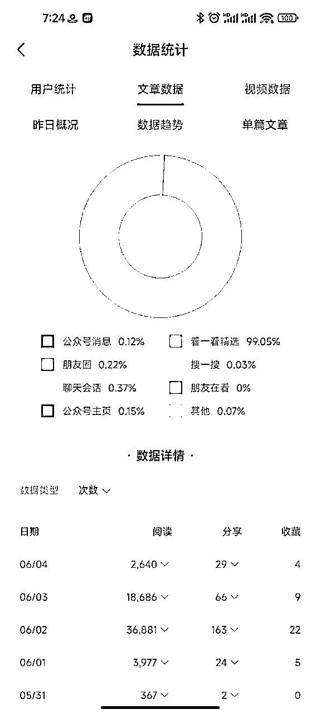

可以看到，99%的流量来源，是一个叫「看一看精选」的地方，所以这就是流量爆发的异常值所在，通过研究，我发现这个入口在三个地方出现，

1、最普通的，可能是这个入口，在看完公众号点赞/在看后，有的内容会刷出下面这个推荐，

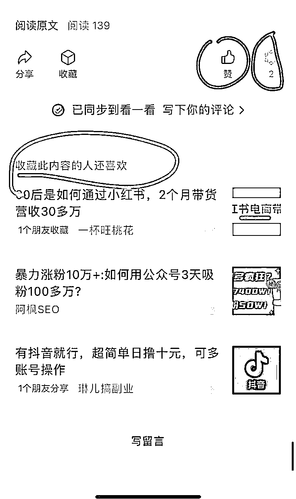

2、新更新出来的，在订阅号消息中，看着看着，有时候会刷新出你没关注过的公众号内容，我的号前段时间就有，最近又没了，应该还在内测阶段，

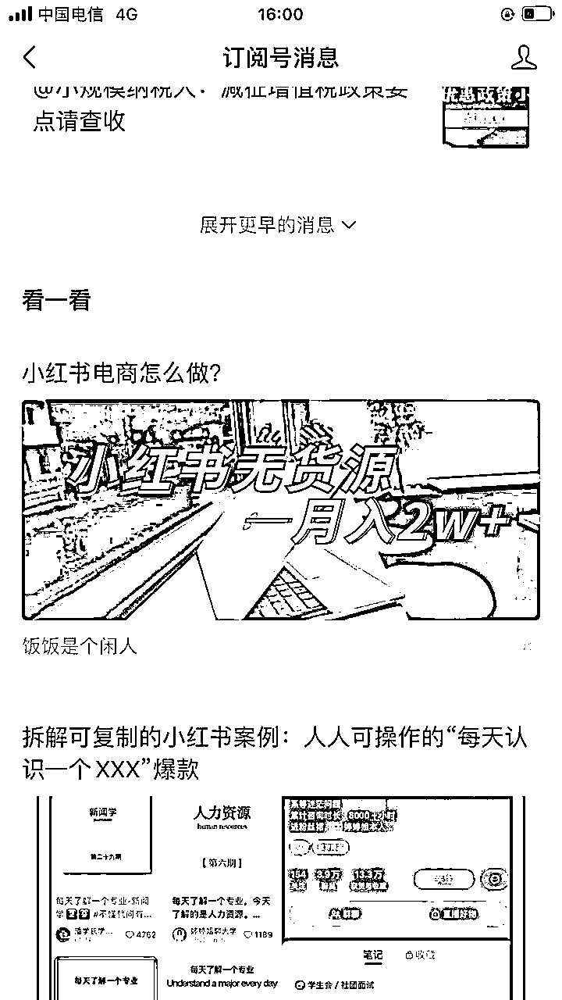

3、这个应该是本次爆发式流量来源最大的因素，位于微信一级菜单栏中的「看一看」，我之前一直好奇看一看精选中的精选是什么意思，如何精选的，现在我推断，只要内容进了这个入口，那他就是精选，

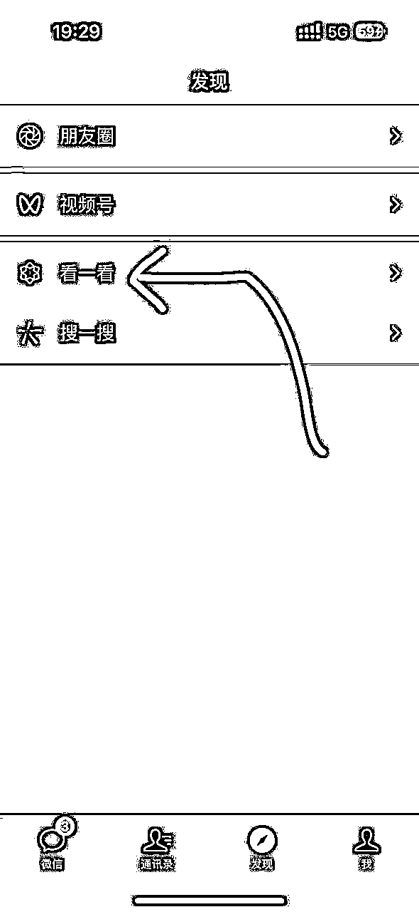

但这个精选，我感觉是AB test，因为我通过大量的刷内容发现，

1、他不进行内容审核，

2、新号老号都在流量池中，

3、文章阅读量高低都有，

4、不管是不是原创文都会进流量池，

所以不管你是什么内容，不管你是新号老号，不管你有没有粉丝量，不管是不是原创，

他都有可能把你的文章挂上去，然后通过点击率等因素判断，要不要留下你这篇文章继续推送，因此才造就了流量大爆文章的出现，也只有系统一直公域推流，才有可能这样大爆，而不是通过所谓的「在看」社交链，

我朋友圈举例的账号都是在看一看里刷出来的，

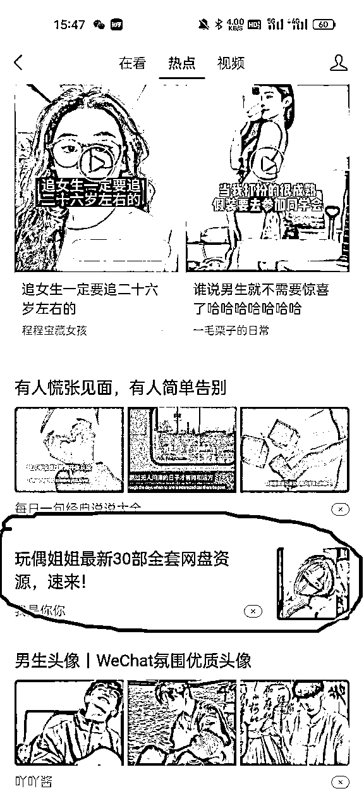

1、👆

且，有一定的学习算法，一开始进去就是什么都推，当你定向去点击一些固定内容后（比如美女），就会大量给你推同类型内容，相当于系统已经帮你优化好了目标用户，

所以，这是一个具有相当大机会的流量入口，任何属性的粉丝都可以做，注意，是任何属性，

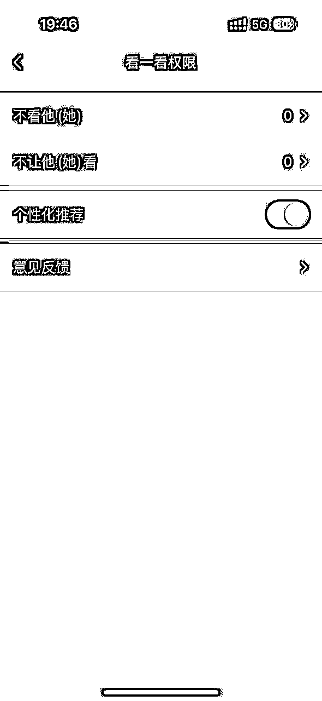

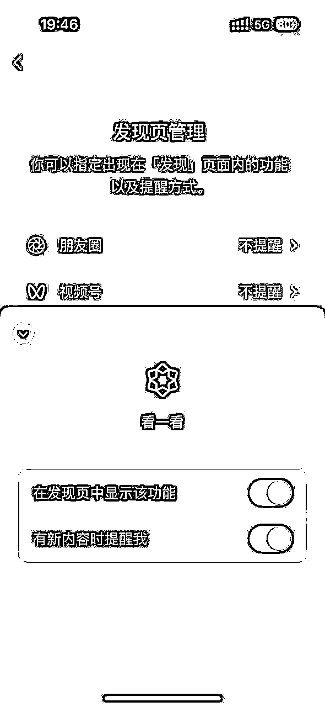

这也就可以解释，为什么爆文写作和AI绘画能爆阅读量，

1、标题党，目前流量最大的内容无非就是婆媳关系，狗血男女关系，中医养生这类常青树，所以爆文写作能爆，

2、当文章中的配图大于等于三张后，系统会随机选择三张图片显示在信息流中，因为AI绘画基本上都是美女图，不仅占据的屏幕空间大，还吸睛，所以点击率自然就高，

3、大部分教程说的是坚持更新一星期，基本上会进流量池，我推断是看一看中，会推送近七天内更新的文章，当你连续更新七天后，因为每一篇文章都有可能被放进流量池进行AB test，所以更新七天自然也就是七倍概率，在只更新一篇文章的情况下，

账号举例：

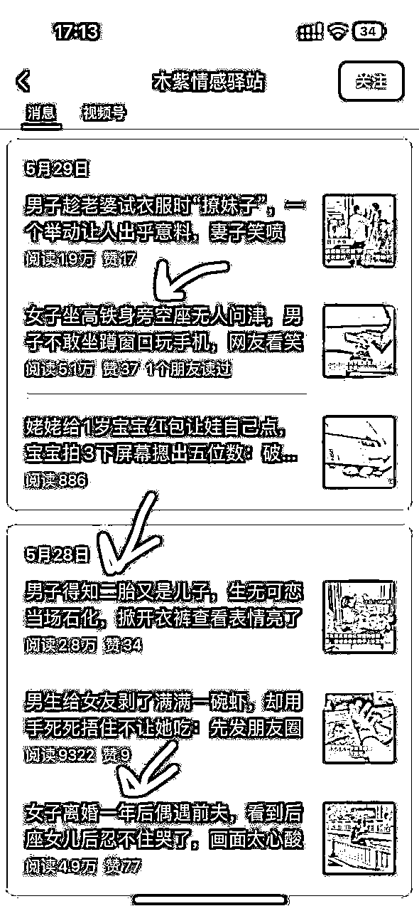

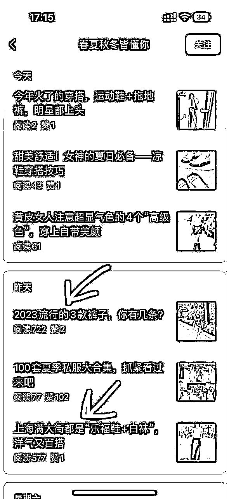

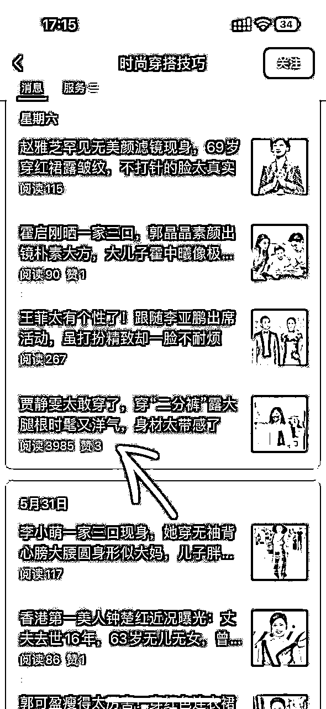

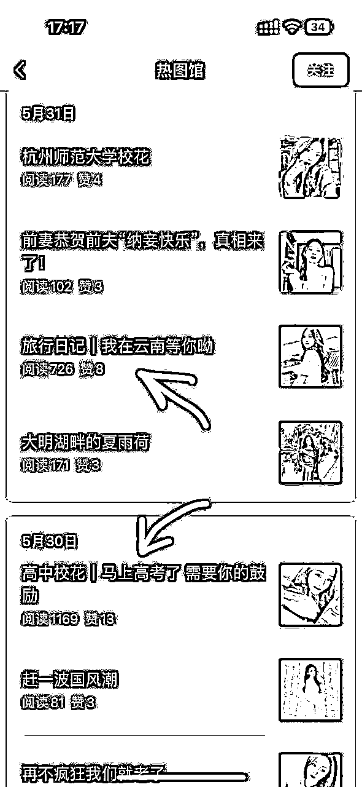

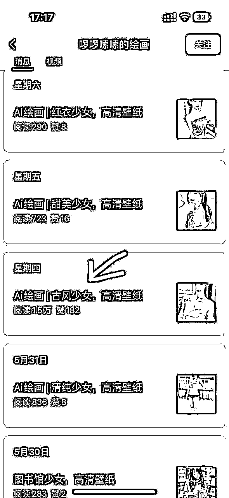

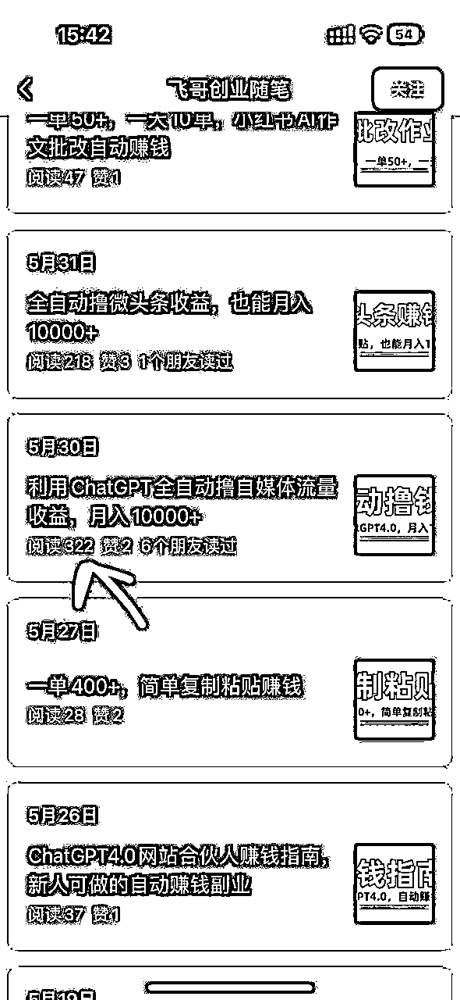

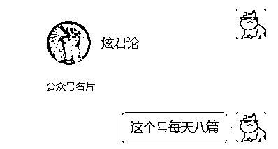

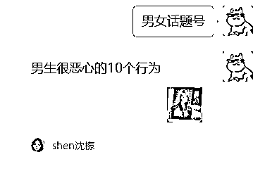

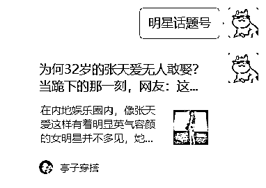

AI绘画吸精+标题党：

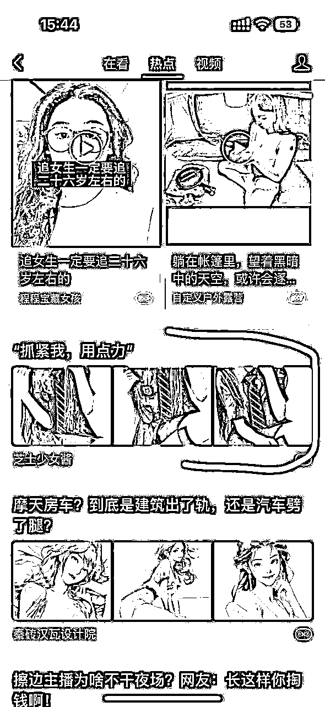

大家可以去看一看里面，刷一刷，很多商业机会在里面，唯一的要求，只是更新而已，

目前已经发现很多账号在批量操作撸流量主收益了，而且导私域也是很香的，

不标原创，直接去复制粘贴，一天八篇批量操作，

标原创，直接用chatgpt洗稿，再配美女三张以上美女图片，

这就是近期很火的流量主项目全过程，难点只剩内容产出，大家自行发挥，

另外一个新的流量入口，是微信版「知乎」，问一问，

前段时间在内测，回答还要申请资格，现在已经放开了，

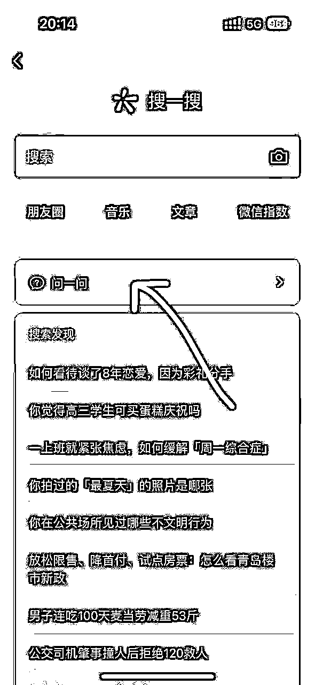

入口在搜一搜里面，如果你的微信没有开通这个入口，找人要个问一问链接点进去就开通了，

目前是完全和知乎一样，但极度缺内容，我们可以直接去知乎照搬内容，复制粘贴一波，

因为答题的主体是用视频号，视频号又可以关联公众号，公众号又可以导私域，所以整个过程是非常丝滑的，

值得深耕，相当于几年前的知乎，还能吃到seo流量，目前还是一片空白，

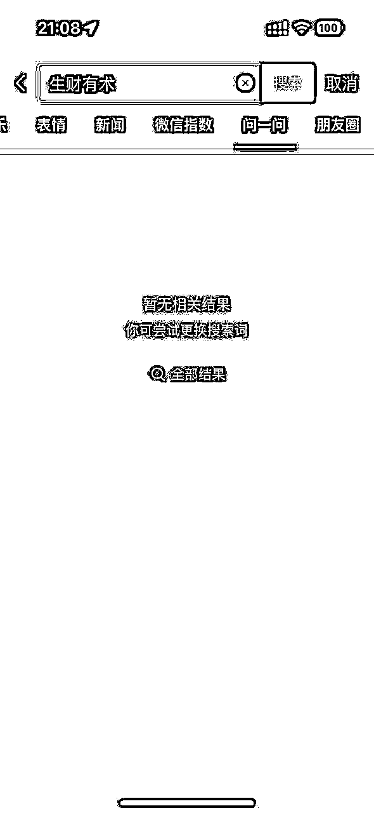

目前我已经看到有账号在批量铺内容了，任何领域的都在回答，

流量密码放这了，大家自行发挥，

具体参考生财爆文写作航海，全新的流量入口代表着全新的机会，这是趋势，趋势是不可阻挡的，

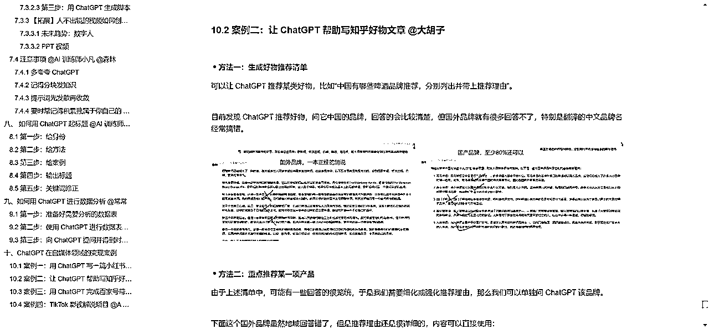

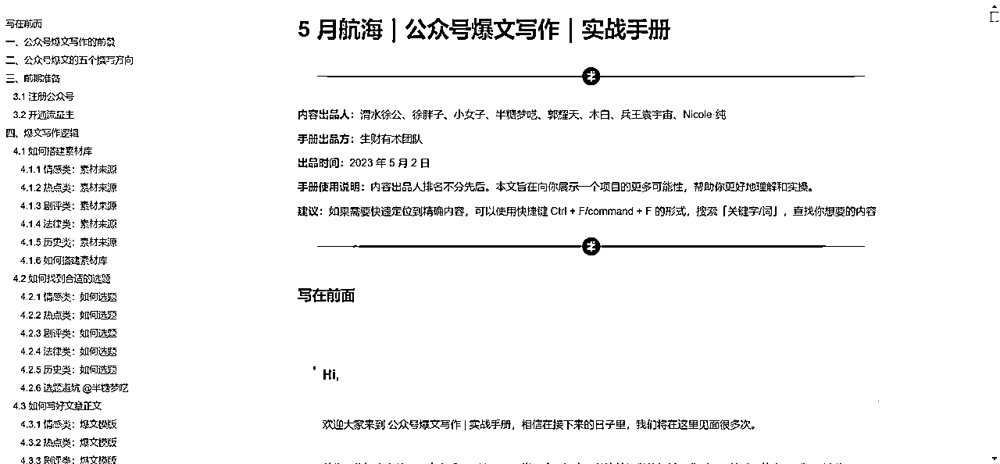

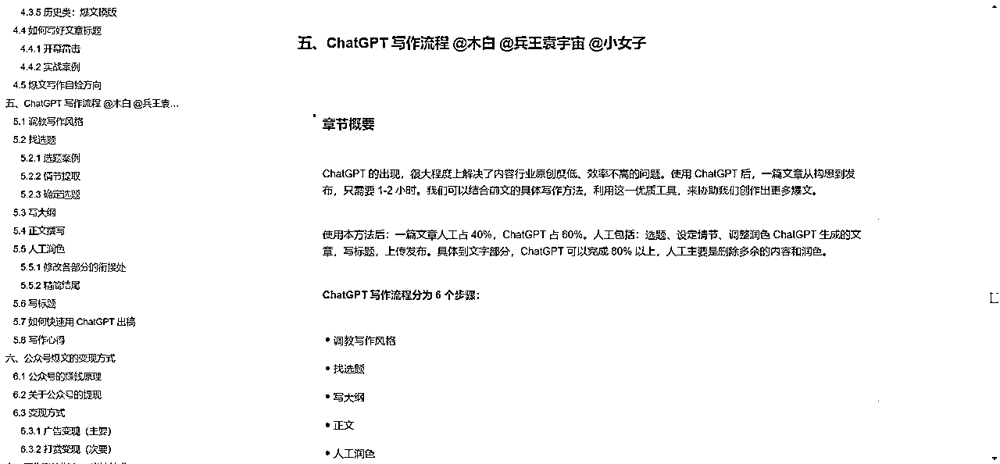

生财的内容，一般都领先业内半年，希望大家抓住机会，

以上，