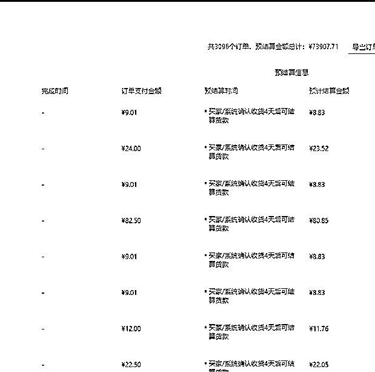
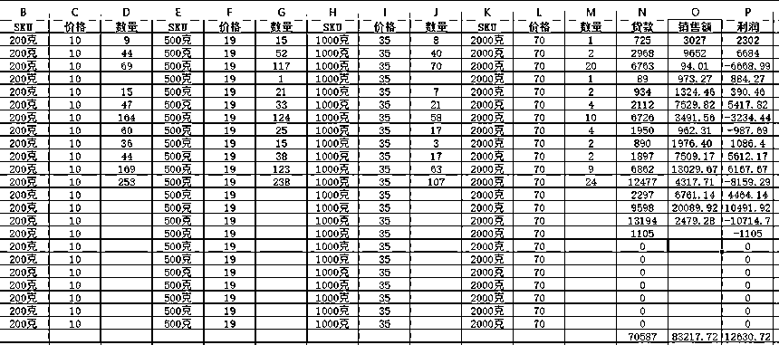
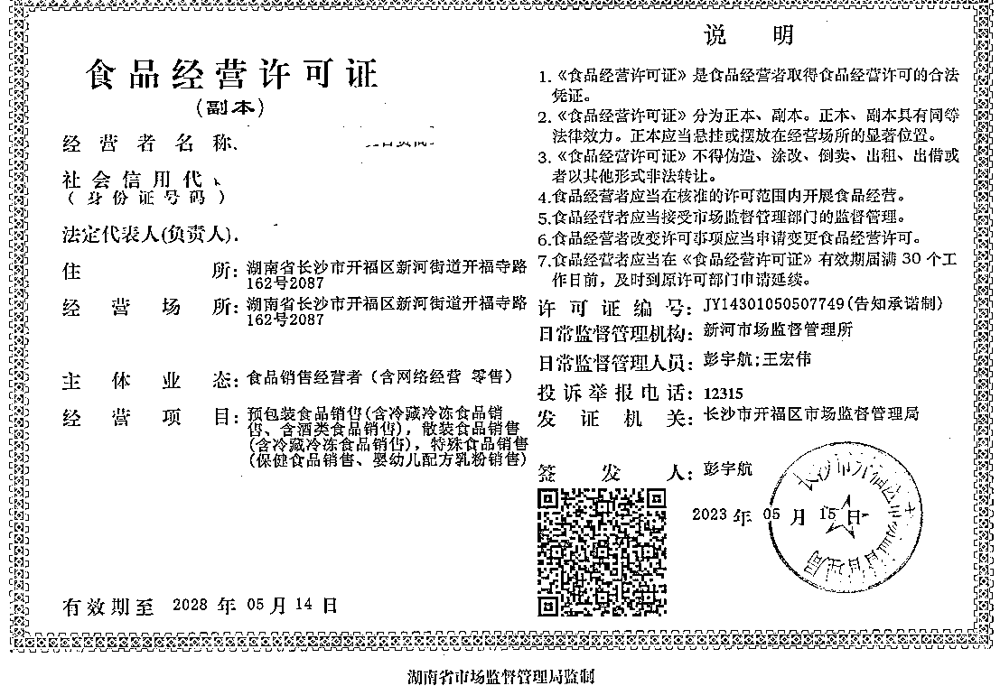
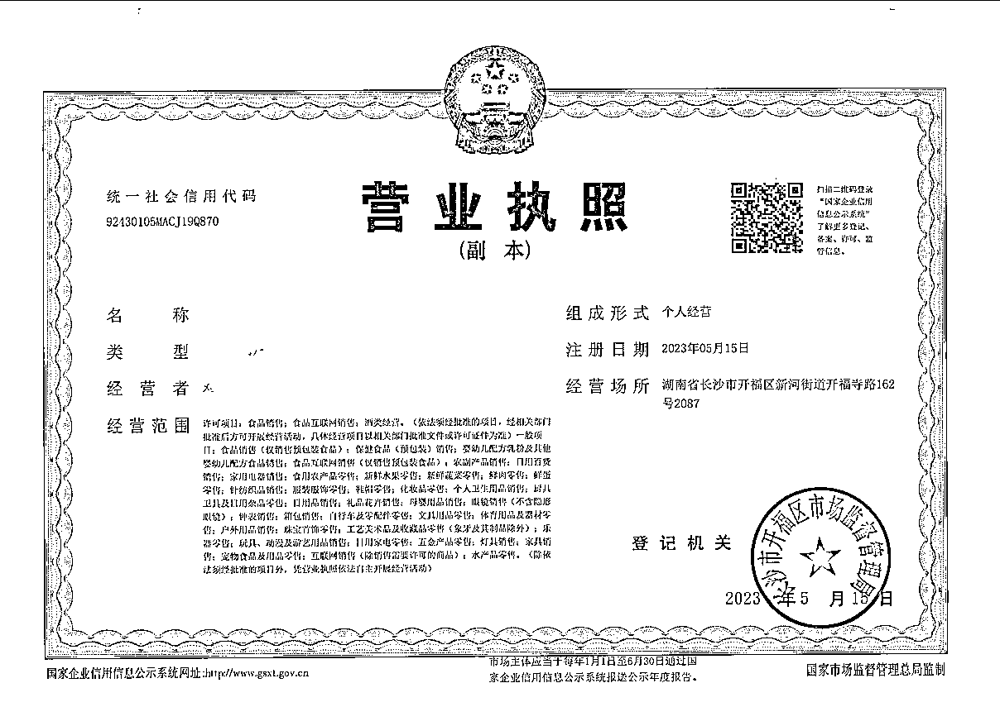
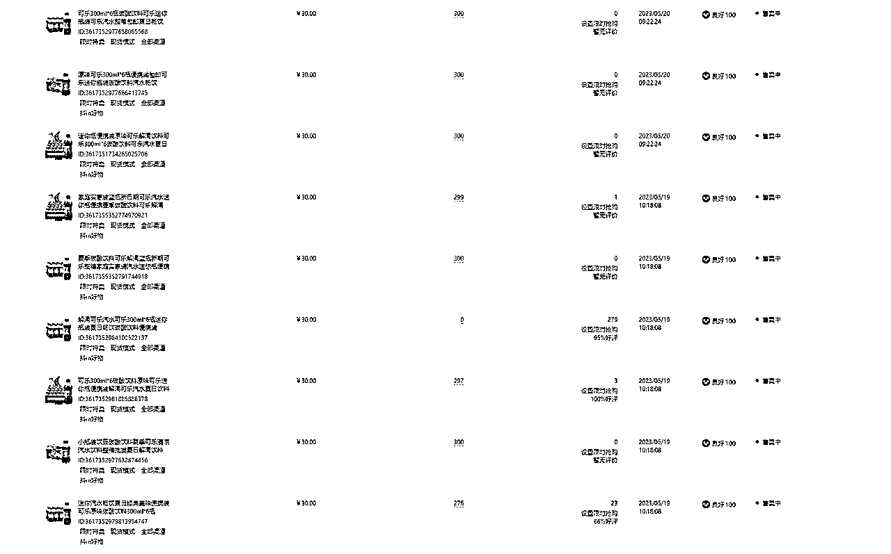
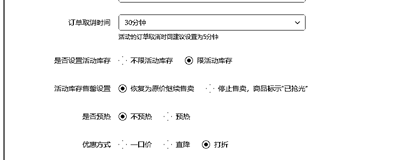
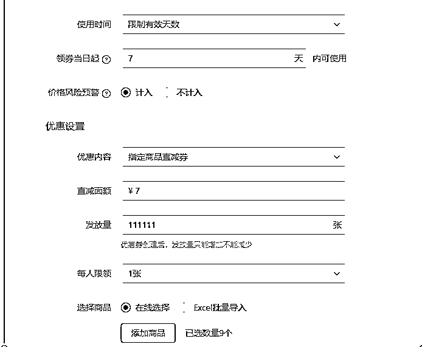
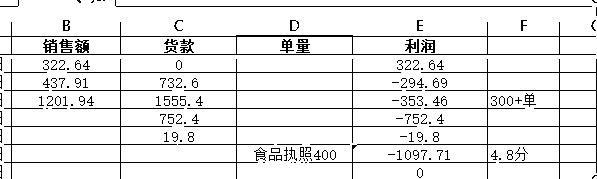
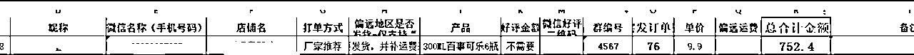

# 抖音食品店单店1.5-2W玩法实操经验总结

> 来源：[https://r2qalpalgj.feishu.cn/docx/Nf4tdTU3Zo44fWxthJOc1rHhn9e](https://r2qalpalgj.feishu.cn/docx/Nf4tdTU3Zo44fWxthJOc1rHhn9e)

# 抖音小店玩法

项目成本：起店拉分1K左右，食品执照400，流动资金单店8.9W左右。

利润：利润率15-20%，单店周期15-20天左右，因为不怎么费心去维护，所以一个店铺爆完一波直接不要了，开下一个，如果想一个店铺活得久一点就得费心处理客诉，看个人选择。

## 1，食品营业执照

执照范围参考：

## 2，开店拉体验分

以5.19新开的一家店来做拉体验分示范。

1，上架福利品

上架可乐标价30，库存设置300，第一天上6个链接，第二个上3个链接。修改标题，主图详情页不变。

2，可乐运费模板设置

设置优惠劵:

限时限量购 ：3.1折，一单亏3块。在出300单后就够了，把折扣调到4.1折，这时候可乐出单不亏。

优惠劵：直减7，发放数量1W

2，收货后要好评

可乐在用户确认收货后，因为里面放了小卡片返现2元要好评，大概30-50个左右的好评就能拉到4.8的评分，4.8就可以上架咱们要卖的品了，从执照到起店成本1500左右。

没有可乐代发资源的可以联系我把代发厂家推您。

## 3，上架正价链接+提高20%转化率方法

1，上架20个产品动销一遍+基础评论

先上架20个链接到仓库，在一次上架2个，找人拍下在下架，有朋友找朋友拍即可，或者找刷手，发礼品单物流，到货后晒图好评。目的是让链接有销量+基础评论即可。

礼品单官网：http://taoshen888.lipw.com/register?c=GHVQUA

抖店上架链接软件：

2，设置优惠活动

在店铺评分到4.8后20个链接全部上架并且设置好优惠活动坐等出单即可，同时每天在PDD,淘宝,抖店找3个同行链接上新.

设置优惠活动

1：限时限量购 5折 库存尽量多即可

2: 店铺新人礼金 基准值3 最高值3

3：满减 满5减1

4：优惠劵 直减7 限制有效天数 五天内使用 发送量1W

3,上午把销量前2链接做基础评论，增加20%转化率

电商罗盘-作战室-单店大屏，可以看到链接每日销量排行。给销量前2链接做基础评论。

找人拍下链接，然后发礼品单，过一小时直接确认收货+晒图好评即可，评论的图片和文案可以去淘宝拼多多找。