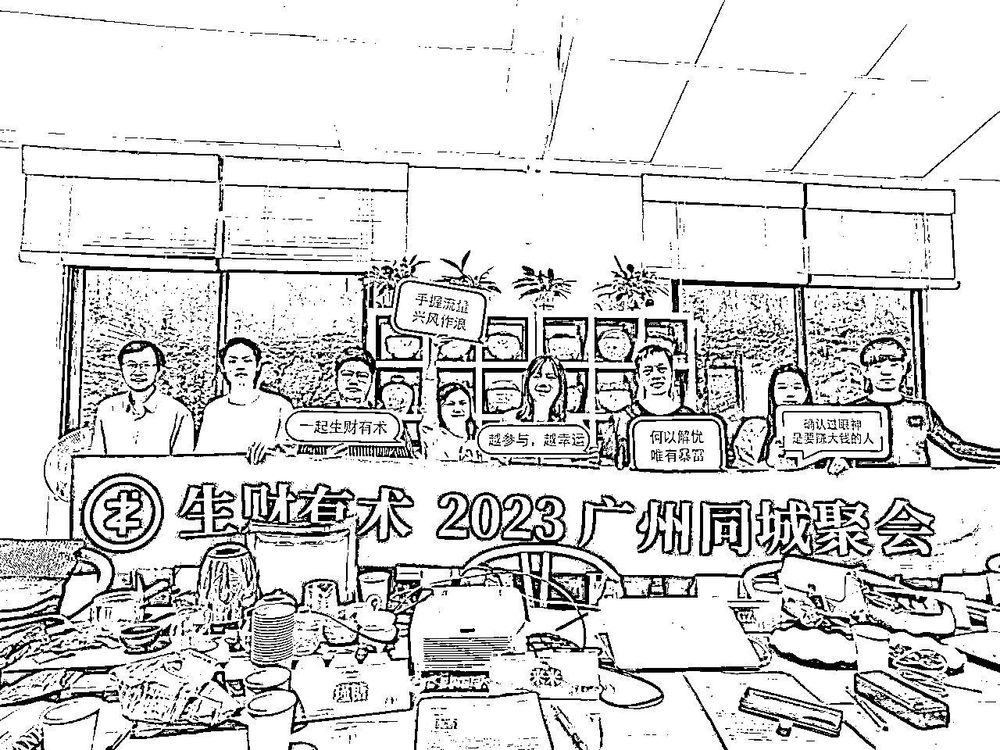

# 阿墨05/13广州线下聚会：AIGC赚钱局交流心得

> 来源：[https://pa4o0hei7be.feishu.cn/docx/Nz18d0VBjo3lVRxWcG1cYKkCnDe](https://pa4o0hei7be.feishu.cn/docx/Nz18d0VBjo3lVRxWcG1cYKkCnDe)

这次的生财线下茶局是在火炉山的艺术园一个叫山舍的地方，环境不错，老板贴心，场地超大，场所方面打5星好评；上山的路有些难找，好在跟着百度导航驾车还算比较轻松，正所谓好物藏深山。

今天最大的期待是见来来，线上群聊很活跃，线下见真人感触更深。AIGC的话题，我研究的不深，能贡献的有价值信息不多。来来分享介绍关于这部分的内容，对于我来说还算是新鲜的，抱着向大家学习的心态了解新兴领域。

其次是其他来的圈友们，英卡和瑾糖是第二次在茶局上见面，其他伙伴是首次见，在自我介绍的环节大家讲得比较high也是展开的比较多，碰撞出不少思想火花，每个人都有自己闪光的地方，透过别人的经历，就像镜子一样折射到自己的人生，或者警醒或者启发或者激励。

一、自我介绍收获

每个人都有自己的节奏，年轻的人敢想敢干、成家有娃的则稳中求进，不同年龄不同生活阅历不同认知层次不同，有很多信息差、资源差，当然，也引发我很多的思考，关于职业、副业、家庭、资产规划等，其中的收获：

1、出书的流程、目的、运作方式——感谢来来、大牙

2、海南封关运作的启发（财税、茶馆、公司注册）——感谢Kane、来来，我还想了个名字：徐海驿站

3、打造百万信用卡，可以做成教程知识付费（例如生财发帖子、试需求、建设群）——感谢瑾糖、墨鱼

4、偏门、投机的事情，短期收益抵不过人性，终究会凭实力亏回去。——感谢 ALL share

二、心得感悟：

茶局线下聚会链接人方法依然有效但需更加精准和高效，花的时间也挺多，至少得要半天，组局官更辛苦要提前准备很多物料；在后面我重点是吸收沉淀生财各种帖子资源，进而链接有结果的前辈们，毕竟对于打工上班还有家庭小孩的人来说一天能剩下的时间相当有限，生财每篇精华帖几乎都是万字长文，好像只有很长很长才能获得精华一样，如何做好有限时间的高效利用（时间管理）是个重要课题，如果阅读此文的小伙伴能有心得也欢迎联络生财阿墨私信指导，先在此叩谢。也许还有另外一种方法，就是让自己成为有结果的人，吸引更多人主动链接，有个前提是自己跑通了商业模式并获得结果、写成精华帖子被看见。

三、获得的点子：

不是所有的点子都能落地、都适合落地、都值得ALL in 落地，但每个点子，都有其发光的一面，都有其富有潜力的商业价值。我感兴趣的商业模式关键词：要轻运作、能自运转、能积累、且互联网化、可放大。

大家的贡献：抖音视频有软件可以查重（来来）、ChatGPT-4体验、文I（虚拟女友）、小而精的团队（赛马机制、阿米巴模式运作，5人）、结合AI实现活体认证视频（500赚5000）。

四、后续待办：

5/27的航海线下组局我将作为组局官，时间上没有冲突的话，我计划收集目前市面上ChatGPT的变现模式、思路甚至实操拆解，作为主题分享给大家，期望参与者都是已经有所实践者、这样碰撞出更多火花。（感谢大牙、来来、瑾糖）

以上，再次感谢组局官来来，得以认识一班在不同轨道上奋进的小伙伴们，下附生财自我简介，阿墨在生财有术知识星球等您。

* * *

【昵称/姓名】Mo.gz（星球昵称阿墨）

【所在地】广州海珠区客村

【自我介绍】

1、还在企业上班，在软件开发领域10年+，接触过各式各样开发项目；

2、19-20年搞了500个香港券商账号打新股，收益快翻倍；

3、太极音乐网站长、通过SEO实现虚拟资源变现。

【可提供的资源】各种网课资源（100T）、软件开发团队（小到UI设计建站、大到政府大型业务系统）、港股打新（开户、资金处理等）

【可分享的主题】互联网交付项目的各种坑、打造个人信用卡百万额度（低成本融资经验）

【需要的资源/帮助，需解决的难题】

1）需要的资源：认识生财大佬（龙珠1颗以上都算啦），深入链接

2）解决的难题：没少看富爸爸财商书/视频/现金流游戏，着急解决第一桶金、打造多管道收入。

3）想在海珠客村附近有个可以办公/喝茶交流的地方，一起玩玩富爸爸现金流游戏、孵化实践生财好友项目、线下聚会茶局。

4）海南2025要封关运作，过海南需经我家乡湛江徐闻县徐闻港，欢迎有涉及海南业务的（海南人/新海南人）共谋搞钱路子。

阿墨历史主题：