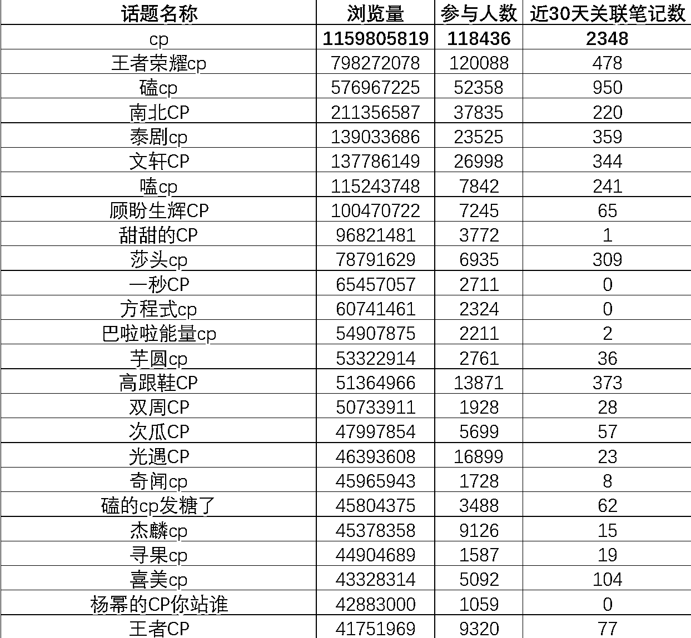
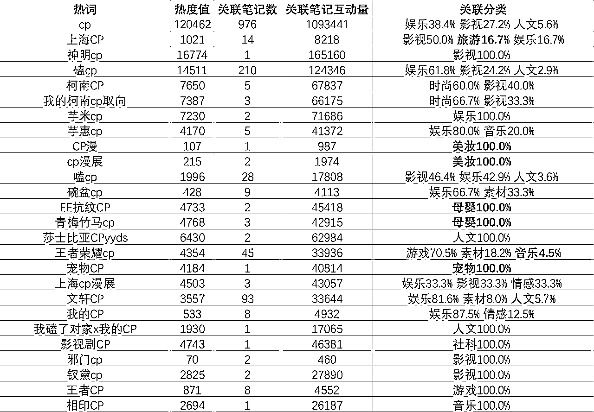
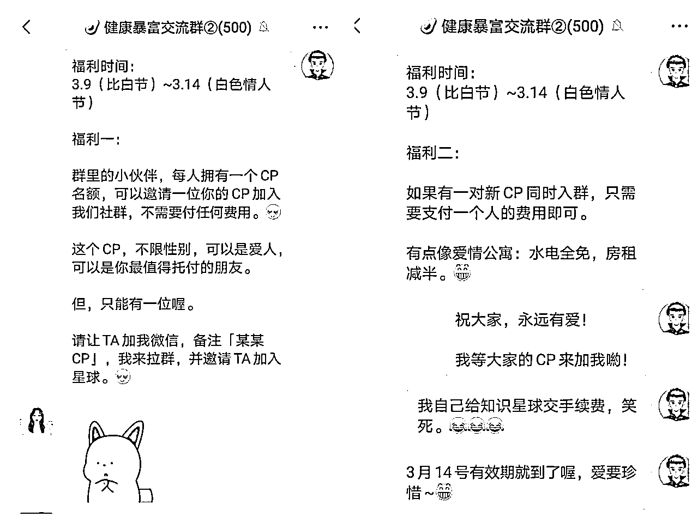
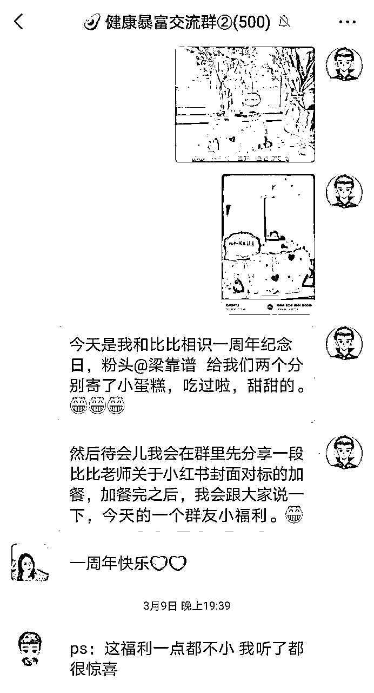
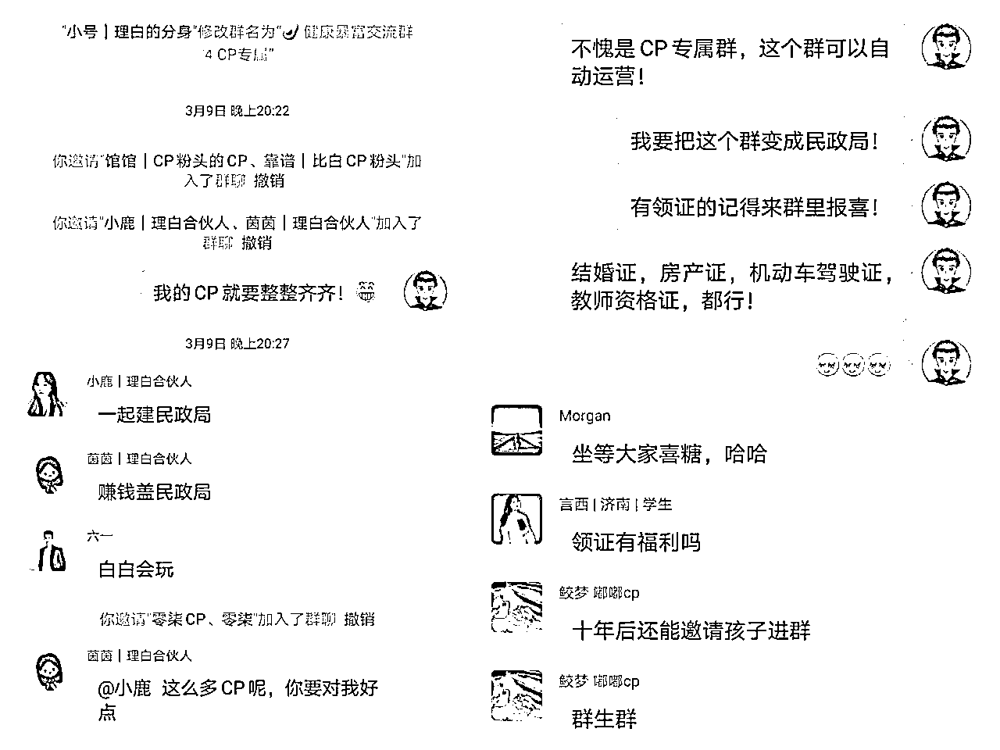
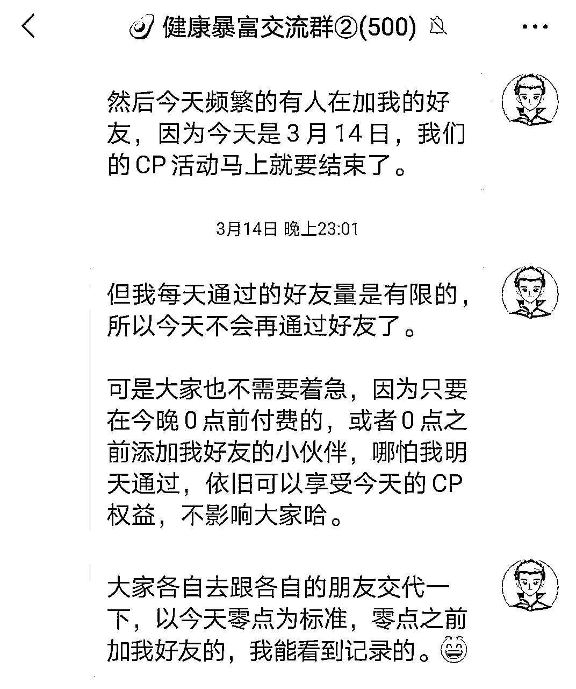
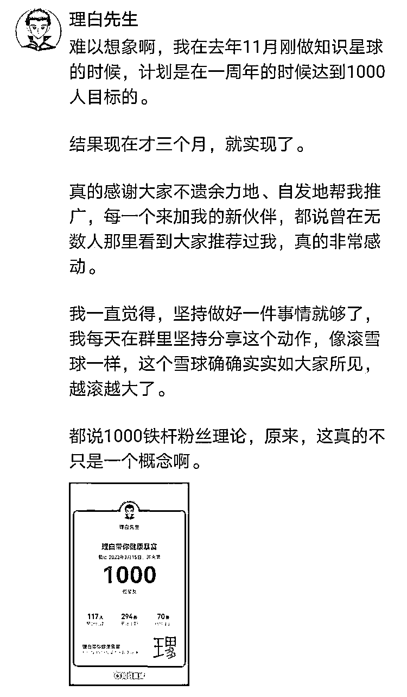

# 214抄作业 | 情人节活动，拉新300+，变现5W+，社群群主如何借助CP经济增加营收？

> 来源：[https://fcjmogm9bc.feishu.cn/docx/OkyOdA1zqo6J7oxQUFBcSDrqnUK](https://fcjmogm9bc.feishu.cn/docx/OkyOdA1zqo6J7oxQUFBcSDrqnUK)

大家好，见贴欢喜，我是理白 ，距离情人节还有2周时间，足够我们布局一场不错的CP社群拉新方案，本文将结合我在上个情人节（3月14日白色情人节）期间，靠CP营销拉新300人，变现5W+的全过程，给做线上社群的小伙伴提供一个发售、营销及承接流程。

本贴方法，可供50人以上陪伴型社群使用，人群基数越大，拉新效果越明显，有高客单价产品承接者尤为适用，可在七夕节、任意月份14日（西方情人节）、上元节、中秋节、圣诞节、女神节等可与「CP经济」挂钩的节日使用，百试百新。

# 一、行业风向

CP，是Coupling这个词的缩写，所谓嗑CP，简单直观地说，就是在两个可能存在的浪漫关系之中沉浸式“上头”，既可以是虚构的“纸片人”、影视剧中的角色，也可以是真实的人物。现如今，CP 文化已经突破了小众文化圈层，来到大众文化和影视剧推广营销的最前线，无论影视剧、各大视媒平台，都可见其营销影响力。

人设包装有两种属性，既有专业属性，又有生活属性，专业属性提供实用价值，生活属性提供情绪价值。CP营销，是生活属性的一种，目的是将2个或多个独立个体深度绑定，实现1+1＞2的效果，辐射影响受众，使其在美好链接场域中获得欣快体验，简称“磕到了”，常见于影视剧、综艺及网红圈。

影视剧当中，CP经济能带流量和话题，商业行为中，CP粉丝能扛销量。观众们不在乎电视剧是否有逻辑硬伤，只在乎主角是否能不断“撒糖、发糖”；恋爱真人秀综艺中，哪怕有剧本痕迹，观众也毫不在意，只要“磕得尽兴”就好，就拿经典恋爱综艺《心动的信号》来看，最新一季，成了4对情侣CP，结盟率远高于前几季，就是得益于CP合体营销的巨大收益。

而后，CP向视频被被切片分发至各大平台后，又成为攫取流量，进而成交商单的重要竞争手段。一方面，快节奏的短视频，可以迅速提纯糖点，为大量粉丝提供情价；另一方面，CP营销所裹挟的巨大流量，又为平台和博主赋能，广告费飞速上涨。

我在小红书上爬取了近30天内的CP经济热词，发现，涉及到CP属性的关键词，有3001条，最高浏览量11.6亿，参与人数11.8万，关联笔记数量702万条，依旧是高频、多发、出爆款。

而在各大小红书赛道中，除了认知中的影视、娱乐、人文外，美妆、时尚、母婴甚至宠物赛道，都在瓜分CP经济的流量。

大牌的520活动，CP营销文案的高强度宣发，无疑再向我们说明，CP经济依旧是资本汇聚之地，抓住风口，特别是520前的营销期，依旧可以赚一波儿风口钱，至少，拉新一批风口用户。

同样，作为自媒体人及知识付费创业者，也要懂得把不同侧面曝光给用户，既要提供专业属性，又要提供生活属性。每逢关节节点、关键节日，必须策划、必要经营、必有回响——在CP属性浓厚的情人节、七夕节或结婚纪念日、相恋纪念日，进行一系列社群福利动作，可以重新激活社群活跃度，实现拉新增长。

3月9日是我和比比的一周年纪念日，因为我和比比的CP属性在很多用户心中有认知，也有一定的知名度，结合纪念日和3月14日白色情人节，我们策划了一次CP福利拉新裂变活动，为社群拉新300+人，变现5W+纯利，接下来，将详细复盘操作流程，模式简单，易复制、好操作。

# 二、规则设定

拉新活动，本质上就是裂变或转介绍，要充分调动老用户的积极性，让活动与之产生符号关系，更要产生利益关系。

所谓符号关系，是指拉新活动的调性，要贴合拉新人群的属性和风格；所谓利益关系，是指拉新活动，要让拉新人群产生“赚到了”的感受。

所以，我在规则设定上，用了两套方案并行。

福利一：情人节活动期间，每一位群友可以免费邀请一位自己的CP加入，享受社群全年福利。

福利二：情人节活动期间，二人联袂以“CP”的身份加入社群，免单一人全部费用。

备注：这里的CP是个宽泛的概念，不一定非要是情侣，闺蜜、要好的朋友、亲人，都可以。

这两个方案的设定，是比较巧妙的：

1、本质上，福利一就是所谓的“100%CPS”，也就是所谓的“极限一换一”。受生财圈友梁靠谱影响，我深知“会分钱的人才能赚到钱，进四出六，增量思维”，所以，我的社群日常开到的CPS就是50%，日常转介绍也很好。但，在重大节日开出100%的CPS，且冠上一个CP福利的帽子，会让用户有一种“不在活动期间赶紧免费拉一个人就亏了”的感受，会Push用户在活动期内“占到这个便宜”。

2、本质上，福利二就是所谓的“二人团购一人免单”，但是赋予了CP意义的团购，就不是普通的团购，而是王维诗里的团购，多了浪漫色彩的营销，就拥有了溢价的空间。

3、如果只有福利二，没有福利一，势必会让老用户觉得自己之前买亏了，会让他们认为新人才有“团购价”，会伤害到老用户的权益；如果只有福利一，没有福利二，那只能社群内部消化，无法扩大影响边界。所以，我们会见到，很多产品在节日期间搞活动，搞促销，看似在拉新，却损伤了老客户的利益，会让老客户觉得自己之前“买亏了”，而一旦出现这种奖惩错逆，会大大降低未来的高客单价客户成交率，得不偿失。故而，两个福利同步进行，既不损老用户权益，又带动了新用户增长。

4、将CP的概念扩大，是为了扩大人员的参与度，不是每个人都有情侣的，但每个人都可以有CP，所以，在这次活动中，除了有拉老公、女朋友进来的，还有拉兄弟姐妹进来的，拉好朋友进来的，拉父母子女进来的，拉团队合伙人进来的。泛领域下的CP概念，激活了每一个用户的“符号认同感”。

于是，无论新老用户，既有“符号认同”，又有“利益驱动”，那这次拉新活动，就自然水到渠成了。

# 三、流程复盘

## 1、提前预热

在福利活动正式开始之前，我就在我的几个陪伴群里进行了预告和预热，让群友产生期待感。

## 2、宣布福利

在每日正常的加餐后，正式宣布福利，并鼓励群友进行推广。刚发布的当晚，老客户就拉新了近100多人，新客户反应比较晚，到第2-3天才开始双双进群。

## 3、物料发布

一是自己在社群里和朋友圈里进行了福利宣讲，并用《爱情公寓》的经典台词“水电全免，房租减半”作为slogan作包装。

二是拉了一个大几十人的分销团队，把一些我准备好的物料发给了他们，他们也是分销的主力。

三是特别拉出一个CP专用群，把一对一对CP拉到群里，并持续发布朋友圈，告知大家这个专属群的存在，引发外围用户的好奇和围观。

四是组织抽奖，本身，我的社群就有每满100人抽奖送礼物的传统，结合情人节，更是选择了一些带有浪漫主义色彩的礼物进行抽奖，为新入客户提供了较好保障。

这四个动作一做，我的朋友圈里就被这个CP活动刷屏了，大量的铁粉和小KOL都快开始做宣传，之前一直在围观我社群而未购买的小伙伴，一听说有CP福利，就赶紧自己找了个搭班的，两人各出了一半钱，纷纷加到了群里。

## 4、节前逼单

我一共做了两次逼单，第一次是提醒时间节点，第二次是缓解时间焦虑。

第一次逼单，在活动截止时间的前24小时，提醒大家还有1天就到期了。

第二次逼单，在活动截止时间的前1个小时，告诉大家不要着急，只要是零点之前加我好友的，都能享受到福利。

这两拨逼单，也带来了大概100的新流量，特别是最后半小时，有40多个新用户在零点前的半小时加我，很火爆。

## 5、后端成交

社群拉新过程中，每一个新客户全部做了标签梳理，发放见面礼、给出适当情价并挖掘用户需求，以社群干货输出+朋友圈产品推荐的形式，进一步成交中高客单价客户，在新增好友的黄金24小时之内，进一步完成成交。

# 四、成果感受

## 1、先说成果

拉新总数300人，其中老客户带新人200人（成本：知识星球手续费，共1400元），新人两两入群共100人（盈利：8400元，完全cover掉成本），社群（星球）人数直接突破1000人大关。

300新人中，购买各类课程及高客单价产品人数，超过30人，转化率超过10%，最高成交客单价15999元，总利润5W+。

## 2、再说感受

### 首先，拉新用户质量高，付费能力强。

这次拉新活动，以CP 之名，与其他促销、打折活动不同，很多群友都是非常慎重选择自己的CP入群的。

一是怕给自己丢人，二是怕破坏群氛围，三是当做礼物送给CP，所以，从始至终，社群管理和维护成本都很轻，只有我本人手机操作，所有新群友沟通起来都很愉快，没有乱七八糟的人进群，反而全部都是高质量人群，要么是对互联网和自媒体有足够认知的，要么就是老客户自己亲密的伴侣或亲人，群氛围变得更好了。

### 其次，用户关系的增进，有利于double成交。

因为有好多人是带了自己的老公、老婆、男女朋友入群的，他们进一步让自己的伴侣知道了自己正在做的事业，给了伴侣信心，有不少人私信跟我说，自己的老公知道妻子在我这里学习，看完我的交付后，放了一百个心，甚至还主动为妻子掏钱，买了我的其它产品，有的还双双报名了我的陪跑产品，成为我的CP明星客户，这也算是意外之喜，一场功德了。

### 第三，交付和陪伴，永远是一个社群的根本。

我之所以能有10%的转化率，归根到底，是我日复一日在群里做30分钟以上加餐，是我每天至少5条高质量朋友圈的运营，是我的重度交付和陪伴，用户看得见你的用心，你的势能就是他们信任的积累，所以，如果平时不咋管群，也不咋运营，没有内容输出为本，做再好的营销，都是无根之萍。

这篇帖子写在情人节前夕，细节已全部讲述，各位群主可根据自身社群情况，进行细节微调。如果这篇关于CP营销的小帖子，对大家有帮助，那是我的幸运。

但我更想说的是，请大家珍惜眼前人，珍惜那生命中流淌的爱意和幸福，这远远比几万块的营收，要重要得多。

提前祝大家情人节快乐，祝有情人终成眷属。

理白

2023.8.16