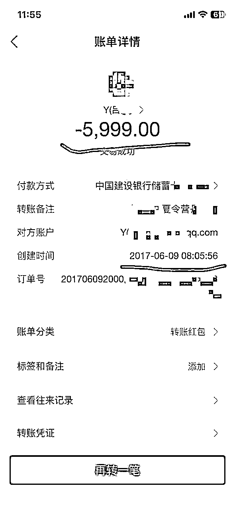
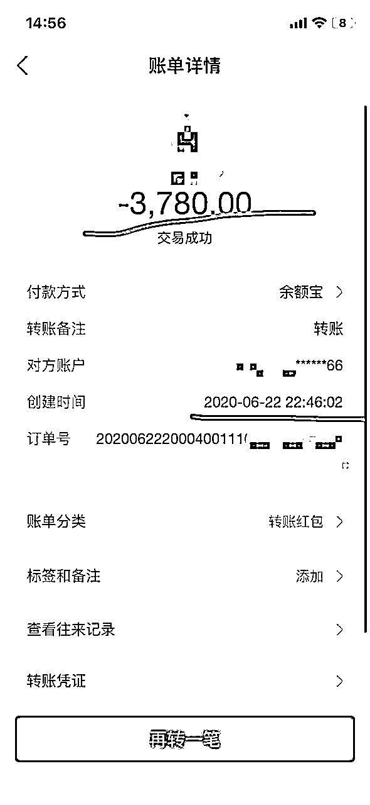
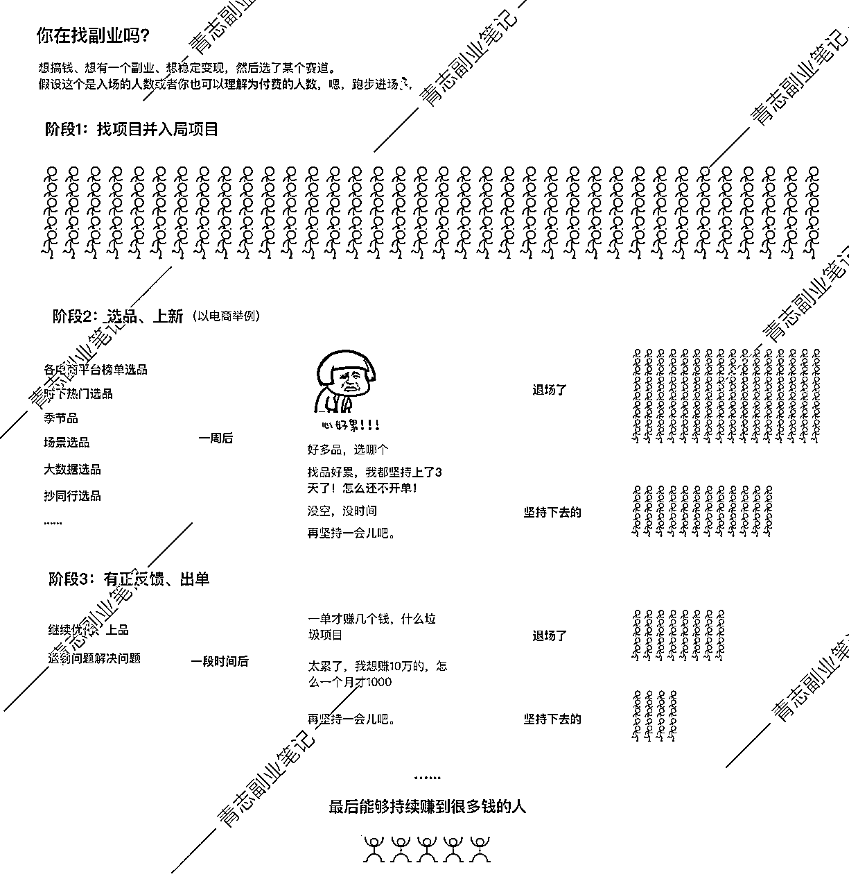
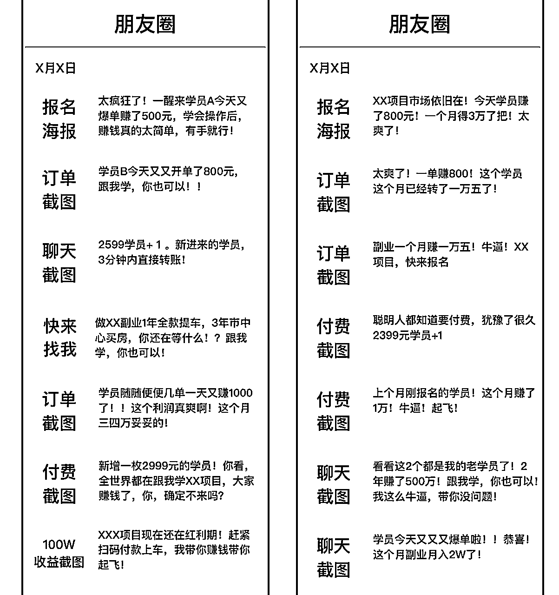
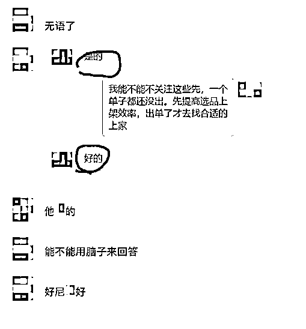
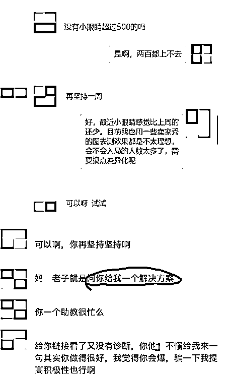
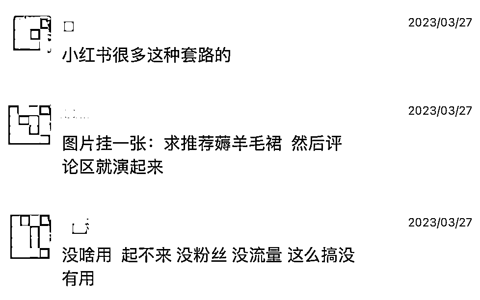

# 从入行设计师到跑通副业IP，知识付费2W+，我学到了哪些？

> 来源：[https://p2ls2mp3ij.feishu.cn/docx/PDWLdy74BoJcjnxjjRGcwuSvnjc](https://p2ls2mp3ij.feishu.cn/docx/PDWLdy74BoJcjnxjjRGcwuSvnjc)

# 一、青志的付费记录

高考毕业后没做功课，专业瞎填 — 信息与计算科学，翻译一下，就是80%数学+20%计算机，属于理学。嗯，我高中数学150的卷子，最低考过78。

数学考78，报了数学专业。数学考78，报了数学专业。

当然了，从小就被灌输，要好好读书才能有出路，才能赚大钱。愣是硬着头皮念了下去，几乎天天自习，卷了近3年，甚至还拿了2次奖学金。

现在想想，真是读书读傻了的典型代表。那会要有现在这赚钱的觉悟，现在少说也是个百万级别的I......

开个玩笑，别当真。

接着，到了大三，身边无非就3类选择，数学老师，码农，考研。这都不是我想做的。

因为打小就有一股艺术梦，所以就想着从事设计行业，搜搜找找，偶然的机会，让我了解到了UI这个行业。更偶然的机会，我了解到了某个设计大佬在开课，听了几节直播课，果断的入了。

很好，第1笔高额付费给了求职：5999。

（叫的夏令营，其实就是现在的训练营）

只看金额，放在现在来说都不算低。更何况是17年，当时家里父母还觉得是诈骗，我好说歹说才同意的。不过运气好，师傅人好，教的也不错，3个月带我成功跨专业入了行。

再后面，自认为其实水平也过了新手期了吧。也可能是天天听一老师讲课听腻了（上个老师的课不设时限），也可能是被朋友圈某学员入职BAT给刺激到了，抱着一点点期待，想感受感受所谓的高阶课知识，加上自己也想了解一下到底都是些什么水平的人在做IP做课。

所以，第2笔高额付费就当做是为了升职：3780。

这次效果就没那么好了，对我来说内容很基础，甚至很多都是上个老师讲过的，只是换了一种演绎的方式。倒不是课程差，只是不适合我，整个过程体验下来，感觉更适合设计小白。

当然了，这钱肯定不能白交，最初报名的时候就是想了解人家的交付模式，所以也验证了我自己的想法，那就是

就这？那我也能教。设计师的终点，果然还得是卖课。

当然是有前提的，刨去流量端，仅仅只是搞PPT上课教学，我在公司做过那么多技术分享，不吹牛，我确实可以。

还是那句话：

“80分能教70分，70分真的能教60分”。

其实做设计的老手都知道，底层的那些基础和方法论，说来说去无非就那些，换个皮，换个教授的方式，仅此而已。这也为后面自己入局设计IP打了个底。

然后，设计圈甚至是自媒体圈家喻户晓的某日记星球，大家都知道吧，那不得进去学习观摩一下？还有其他七七八八的旁系星球和资料什么的，仅主业设计相关的，加起来保守估计算个1.2W吧。

觉得多吗？还没完，下面，展开讲讲，副业路上，我花了哪些。

上文已经讲了，我做过哪些项目：

外卖CPS、淘客、IP训练营、视频号、闲鱼、小红书虚拟、小红书无货源、写作课（没错，别看我这么能叭叭，付费过学的）......还有各种知识星球，太多太多了，分布在不同的时间段。。。

少的三四百，多的三四千。有被割韭菜的，也有老师很负责的。当然不是所有的项目我都是报课了，有部分我仅仅是买了盗版的几块钱课程就去下场干了，有的也就是买了看个大概，了解一下玩法操作。

就当是1.5W吧，实际上肯定不止。

（嗯，这本书我已熟读并背诵了）

所以，2W+大概就是这么过来的吧。

以上，就是我为知识付费的投入了，唠这么多，就是想说，我应该够格来谈点小感想小总结了。

# 二、知识付费的形式

形式其实非常多，小到一份文档，一份音频，一次直播。大到训练营，到私教陪跑。可以按不同的交付程度或者目的去分，青志主要来说一下，当前最主流的2个形式。训练营 + 私教。

## 2.1 训练营训练了个啥

因为上周发了文章上了精华帖，有好多个新手小白过来和我说道这个事情，我概括下，他大概意思就是：

训练营，就是你付费后，拉个群，丢资料，丢课程，然后剩下的，看你自己造化了。对新手小白特别的不友好。

这句话，也对，也不对。

训练营，本质上你可以理解为小班课。也就是1对多。

一般情况下，就是1个或者是3个左右的老师带班。你可以理解为，资料就是上课的内容，包括但不限于文档、录屏、直播教学等。而大部分说交付好的，基本上，也都指的是课程本身的内容交付。即：完整、全面。

另外就是，营主，也就是所谓的老师会负责在群里答疑，你有不懂的可以直接群里问，也可以私聊问。当然，这仅限于正常的不割韭菜的交付。割韭菜的营，进去了就没人管你了。

这种模式一般成才的概率就是二八定律的体现。一个群只有10%~20%的人会做出不错的成绩，剩下的80%大部分就是陪跑的。

不用怀疑，不管这个课程的发布者是哪个百万大佬还是千万大佬，也不管他课程内容多么的完整多么的不一样。谁的课程谁的训练营这个定律，全部试用。没错，我也做过那80%，我承认我没有那么牛逼做啥成啥。

我没做过真实数据分析，但你如果报的多，应该也多少看得出来。

我不是想说做训练营的导师都不好，其中的原因各种各样，青志来浅浅的和你唠一下。

### 2.1.1 要不要报训练营？

很多人在报名之前，并没有了解过项目，了解过课程，了解过老师的授课能力。

所以，多数人只是觉得，嗯，跟着报名，就有机会赚个十万八万的。冲动付费后，很多人的现状却是：

没有正反馈、坚持不下去、不知道问题在哪里。

群里不敢说话又不敢问、鼓起勇气问了，听了回答好像似懂非懂。

可能是怕显得自己没面子也可能是碍于那一点都不值钱的自尊心作祟、所以又不敢继续在群里追问了。

社群里的活跃永远与你无关、闷声自己做，短期内看不到成绩，也没有人交流，沮丧失望，觉得被割韭菜了.....

想想这个场景，是不是和12年义务教育非常相似。

社群就是一个小小的班级。同样的老师同样的授课，但是不同的学生，不同的基础，就是会区分不同的成绩出来。

成年人的世界也是一样的。

个体的差异有时候就已经决定了你的上限。

大家学生时代一定都经历过，总有些人，期末随便复习一下就可以考高分，这是天赋型选手；

而另一部分人，用勤奋也能换个不错的成绩，这是努力型选手。

当然也有一些人，怎么努力也就那样，平平无奇，毫无波澜，这种人，讲真的，就不是学习的料。类比到项目上，其实就是不适合（当然了，一定要先达到努力的标准再谈适不适合）。

现在，你再回过头来想想，训练营的里面老师和赚到很多钱的学生的关系。

在项目上能做到超级高额收益的：几十万甚至百万成绩的，老师的作用更多的是辅助，不要再天真的以为那是老师教得好，起决定性因素的是学生自己。也可说是有点互相成就的关系。

个体本身的硬实力足够，执行力拉满了，甚至于自己也有团队了。人家本身的基础学习能力和悟性都很高。自然可以成事。

师傅领进门，修行靠个人。能带你入行进门，这就是传道授业解惑能做到的，最大的贡献了。

任何项目/技能的学习，都是如此。

再说了，很多人的学习能力/认知能力/悟性真的没有那么高，你就是给了他课程，他也没没办法能全部吸收。

新手需要的不仅是课程要喂到他面前，还得是嚼碎了再喂。所以，很多训练营营主可能是一个牛逼的大老板，但他可能不是一个合格的老师。而且参营人数多，说实话很难兼顾到每个人的权益。

最后，如果你下次想报任何项目的训练营，当你认准了某个人之后，青志的建议是：

1.  一定要降低自己的预期，不要想着一进来那就能赚多少钱；

1.  都交了钱了，不要脸一点，不耻下问，你没那么重要，没人认识你，不问亏的只有你自己；

1.  比较适合有一定基础，一定自学和沟通能力的人；

1.  比较喜欢大家一起搞项目的形式，需要和认可这种社群的氛围；

1.  你甚至可以先去看个盗版课感受下，自己先试着做做；

1.  最后也是最重要的，坚持下去。

## 2.2 私教陪跑陪什么？

其实现在很多新手，包括一些老手。课程某些地方他可能看不懂，可能实操过程也会有各种各样的问题，比如教程某个地方不看懂或者误解了，比如坚持不下去等等。就是训练营里面碰到的某些问题，私教可以解决。

所以私教服务的意义更多的就是在于陪伴，不仅有知识辅导，技能教学，还得有情绪按摩，甚至是持续跟进。另外，有些人1V1被催打卡，会不好意思不坚持，也是相当于被动提高执行力的一种方式。总之，相当于保姆了。

当然了，我说的是不割韭菜的交付。

因此，这类的服务，基本都是两三千，甚至一两万都有的。如果有决心做，又害怕训练营进去了又做陪跑，那可以考虑看看。

最后，赚钱最终靠的是自己，私教也好，训练营也罢，个人主观能动性跟不上，执行力差的，那就是神仙陪跑，你也赚不到钱。

# 三、知识不付费？真的学不会？

很多人说，报了那么多项目，钱没赚多少，就学会了知识付费。

所以，那年今天的韭菜，如今赚了多少钱了？

小白做项目，就一定需要付费学习么？

回答这个问题前，我们先来说说，什么是小白。

## 3.1 啥是小白？适合哪个项目？

普遍理解的小白，就是没有做过任何副业项目，且对互联网项目玩法没有任何概念的人。

所以我认为，“小白”更多的，是针对于项目而言的定义。

但我要说的，是大家都忽略掉的，你身为“普通人”的定义。

最近很多人问青志：

A项目B项目C项目，我报哪个好？我是小白，哪一个更适合我？

你是小白我能理解，但是你身为“普通人”，我不知道你普通到什么水平。

举个例子：

假如你想做视频电商。那么很基础的一个技能就是剪视频，

就以抖音短视频带货为例子吧，没有产出过100个视频，你没有资格说没效果，没爆款，赚不到钱。

那么，剪100个视频的过程中，你会经历：

学习项目的变现逻辑、学习剪视频的技能、学习爆款视频的逻辑、学习选品的思路、学习合理的安排时间....

你要学习各种稀碎的东西....

做项目，不是说看了个文档，听了个课，你就能赚到钱了。

然后，说回普通人这件事，

我不了解你的过往，你从事的职业，你的背景，你的性格…

以及，我不知道你为了搞钱，能坚持到什么地步。

愿不愿意牺牲玩乐的时间。愿不愿意吃苦，能吃苦到什么地步。

咱先不说赚钱，就说学剪视频这个事，

最基础的学习能力你有多少？剪视频这个行为你感不感兴趣，能不能做下去。

因为，学习和坚持是反人性的。

在看到正反馈之前，

我不知道你能不能挺得住，项目前期的那段

## 痛苦、煎熬、暗淡的寂静时光

（我特地加粗加黄加红，一定，一定，多念几遍，因为，所有项目，都是如此，有人说哪个项目赚钱很简单的，那就是在骗你）

负责任的讲，没有人能给出最准确的建议。赚钱这条路，你得自己走，多去尝试，多去体会。

你只有自己下场，才会知道什么适合你。

而事实上，你能比别人多坚定一些，多执行一些，你就已经不普通了。

这是抖音的例子，所有项目通用，你把项目名换了，再把视频改成对应平台的内容产出，通通试用。

比如闲鱼，一样的，不要上来就问能赚到多少钱、项目难不难。

一定要先问自己，为了赚到钱，你能坚持多久选品和上品。而闲鱼的上品对应的就是抖音的视频。

以上的内容，浓缩一下，还是这个图。建议你放大，多看几遍。

## 3.2为什么你会付费？

相信圈友都加了不少IP或者是知识付费从业者了，他们的朋友圈，可能10个里面8个是这样的风格：

（请每一条都看下，报多的你应该会发现这种圈，做啥项目都是这样的套路）

除了订单截图，就是聊天截图，还有一个付费截图。再配合公众号的一套组合拳。当然了，红利项目来临的时候更猛。

真的就差告诉你，你快点给我交钱，这样你就能像他们一样赚到钱。一次两次还好，每天都这么发，很多人就真的信了。

以上，可能没我说的这么直白，但是大差不差的。搞钱的IP吆喝学员个个赚到钱，卖货的IP说各个产品最牛逼，做技能培训的说学员随便就去BAT。自行体会，自己领悟。

这是啥，叫从众效应，通俗讲，就是随大流。好像大家都在跟他学，好像大家还真的都赚到钱了。于是，怀疑并改变自己的观点、判断和行为，掏钱！买它！成为了一份子。

我不是说发这个赚钱的截图内容就一定就都是假的，这个，自行判断。还是那句话，做到牛逼成绩的，背后的付出你是看不到的，当然了，这点他们并不会告诉你。

你看到更多的，是各种渲染付费的重要性，以及付了费后好像多么简单就能赚到钱。

而实际上呢，等你报名了之后，你才发现，

原来要成功，中间还差了那么多的执行。试了几天，没有正反馈，放弃。于是，寻找下一个项目，被对面的吹的容易赚到钱所迷惑，又掏钱，又试了几天，又放弃。无限循环......

总是迷恋付费与开始新项目，却不思考每个项目到底为什么失败。

其实，多数冲动报名的背后，都是觉得跟着做就可以简单赚到钱，几万甚至十几万。

醒醒吧。不存在的。

你有没有想过，实际上你付费前，你根本就不知道产品的服务是什么样的。也许就是看了几个订单截图，就开始抱着我也能马上赚到钱的幻想。

大多数情况你只是被营销而付的费，你甚至连想过自己愿意付出多少的时间都懒得思考。

## 3.3 所以到底要不要付费？

### 3.3.1 付费的好坏

如果自己自学能力差、获取信息的能力也不行，在经济条件允许的情况下，付费确实是可以短期内快速上手的。

青志入行设计时深有体会。这么说吧，在你还是小白，根本啥也不懂的时候，隔行如隔山，进入一行最快的方式肯定就是找人带。比起你花大量的时间去探索研究，付费效率就是最高的，没有之一。一样的，你看我现在叭叭叭一顿写，做IP也有正反馈，这些我都是交了学费的。

所以，问题就回到了，如何选择付费对象？

没办法，割韭菜的太多，防不胜防，是要交钱，但不能不明不白的交吧。知识付费水深， 甚至现在很多人，直接将知识付费和割韭菜画等号。

### 3.3.2 如何选择IP

#### 3.3.2.1 少关注结果，多了解过程

不要只看他说了什么、有多少人付了费、哪个学员1个月赚了多少钱。

也不要被他开了什么百万豪车、做了什么千万生意所迷惑。

我不是说这些都是假的，我要强调的是：

这些，和你自己能不能做成，没有太大关联。不管这些是不是事实，都只能是参考，和你能赚到多少钱无关，要学会自主过滤。

因为你跟着混，能不能做成，最应该关注的，

一是先找自己问题，执行和付出能有多少，二再看IP的交付过程和服务质量。

就看这两点，真的足够了。

其他东西，都是为了吸引你付费而产出的营销内容。

比如上面的内容，就是利用人性懒惰、贪婪和慕强的心理。

这就买彩票一样，你明知道你中不了，却还是想去试一下。

所以，现在能明白为什么很多时候你明知道是坑，还是前赴后继往里跳的原因吧。

那，难道真的没有一个IP可以教出随随便便就赚几十万百万生意的学员吗？

那当然有啊，肘，上床盖好被子，梦里什么都有。

不过有一种特别明显的，大家可以直接过滤了。

如果，你看到某个人的朋友圈，真就除了晒单晒学员收入，其他内容一个都没有，那不用看了，大概率就是割的。

不信可以去付个费试试，被骗了再来文章点个赞。

#### 3.3.2.2 大V陷阱，盲从权威

前面说过了，只要关注那2点就可以。权威和大V并不代表就一定是最好或者最适合你的。

前几天一个设计师朋友跟我聊自己做的小红书无货源（已经坚持1个多月了还没出单，这是很多人都会碰到的）。

他付费了某IP小红书电商陪跑的，某社交平台粉丝20W+，算大V了吧。这是他和我吐槽的一些聊天。

说好百分百全程陪跑的，最后安排了助教，进去后问问题，回得慢不说，给到的基本都是好的、是的、可以呀。这种服务你说割不割？但实际上，很多很多。

实际内容全部都打码处理了，言尽于此，不能说太多，容易得罪人。青志只能说，这行水深，你把握不住。还是要多思考，多对比，多分辨。

### 3.3.4 关于试错

不管你是第一次还是第几次做副业项目。失败也好，没做大也罢。都要尽可能的多参与，过程中学会的技能，提高的认知，都是对未来你再探索下一份副业有帮助的。

总之，跨出第一步，就已经迈出了舒适圈，在我看来，都是成长和进步。

## 3.4 付费了就一定能赚到钱吗？

这个问题，几乎是所有新人报项目前，最爱问的一个问题。

能理解，毕竟付费的。问烂了，也答烂了，赚多赚少，真的靠自己。

这里举一个例子，大家感受下。

青志也免费带过一些朋友做项目，对，免费，也相当于是陪跑吧。本来不想带的，但是他硬要我带，碍于关系和情面，不好拒绝。

他本职是Java开发，和我都是从事互联网行业的，所以我本能的认为，他应该有一定的基础认知能力的。然而，打脸来的太快，做了三天后，他这么回复我。

（淘客项目）

后面这个否认4连着实是震惊到我了。

看了账号一共才发了4篇，甚至没有一篇图文是按教程走的。鉴于关系，我也没回他什么。

所以，即使有人愿意带，不配合，自己不努力，什么项目给你都是扯淡。

大多数人，都想要两三天就能看到结果。青志告诉你，整个地球上都没有这样的项目，死了这条心吧。

做电商也好，其他项目也罢。多数都会有波动，有时山峰，有时谷底。

很多人想改变，想暴富，有赚100万的野心，却连坚持一周的耐心都没有。

如果是这样的，那算了吧，放过自己。

真的，躺平也是一种生活方式，不是所有人都需要副业，需要搞钱。躺着有时候挺好的，何必要折磨自己，又想搞钱， 又不想付出和坚持。

相信我，放弃，生活也会轻松很多，并不是说赚很多钱生活才能幸福。

这也是一种选择，一种生活方式。

最后：坚持，是最难的基本功，请好好修炼。

# 四、IP角度看知识付费

## 4.1 为什么那么多IP都做训练营？

前面说过了，一对多教学，自然是最省成本的，一次时间卖多次。而对于用户来说，人性都是懒的，你去观察那些个训练营打卡营。有成绩的，或者坚持打卡的，肯定不是百分百。所以，训练营相对来说，交付成本低一些。

再说，量够大，有成绩的那20%的数据，完全足够当成招下一批学生的素材。所以，很简单的逻辑，做知识付费一定要做训练营。青志也会做，这没什么问题。

问题就是，付了费，怎么解决自己懒的问题。毕竟赚钱是自己的事情，报个训练营，总不能要求人家追着你去做。

想努力做20，还是躺平当80，掌握在你自己手里。

## 4.2 少做比较，别人的成绩与你无关

青志自己在做知识付费也有一段时间了，实话告诉你，实际情况就是前文说的，哪怕是我的交付做到了每天跟进你的产出，验收你的成果。但坚持，还是很难，有客观因素，也有主观因素。

同一起跑线的，有悟性高一周内出单的，有还停留在如何正确上品的。这个，是不同背景导致的不同的学习进度和效果。

所以，报训练营也好，其他服务也好。赚到钱的过程都不是轻松的，不能只关注那些出成绩的。尽量不要被其他人的收益、进度和时不时的红利项目影响，保持专注，做好当下，脚踏实地前进就是最好的进步。不然你只会被焦虑裹挟。

## 4.3 割最旺的韭菜，赚最狠的钱

我很深刻的感受到，只要一晒这种截图，咨询率就会明显提高。所以，知识付费最快的招生方式，还得是晒单，没有之一。

你要不晒吧，别人不知道你的成绩，甚至不知道你的产品。但你要晒吧，总有一些人缺乏思考，冲动报名，即使是确认过是否有足够的时间和执行力，毕竟最终的决定权在用户自己手里。老实说，这块，我目前也在权衡和学习当中。

而割韭菜的逻辑是：流量在，够精准，那么不用发公众号写文章，也不用思考怎么做交付，每天发订单截图，发用户报名的付款截图，发各种正反馈截图。

剩下的，只管精准引流。

割一波是一波。是真的总会有那么一批缺乏理性思考的韭菜生生不息，前赴后继，一批又一批。这也是那么多营销号还能一直存活的原因。

作为设计师，青志今天就告诉你了。这种记录，我能一天批量给你导个几百张，你还一点都看不出来。

诶，好像发现了个生意。

有这方面需求的IP老板加我备注割韭菜，我给你打骨折收费，收完钱拉黑曝光的那种。

# 五、总结

以上，这些话，做知识付费的会告诉你这些的，据我所知，屈指可数。

毕竟，说这玩意影响捞钱啊。

叽叽歪歪说这么多，就是希望大家再次报名付费的时候，三思，后行。

多多了解一下IP，多多观察一下IP，多多辨别信息真假，多多思考自己现状。

最后，建议收藏下这篇文章，如果你下次想要再去付费某个项目，多看几遍，再做决定。

下篇，我们来唠唠......？ 评论区说出你的想法。

———————————————————————

穷且益坚，不坠青云之志。

我是青志，感谢你阅读到这里。

说的比较多，也没什么实操干货，码字不易，如果对你有帮助，帮你省了钱，那感谢留个赞，老规矩，50个赞下一篇。

全文，完。