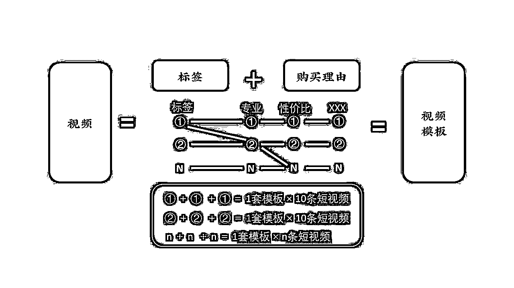

# 实体商家同城抖音短视频爆款视频打造

> 来源：[https://mgwbx803sq.feishu.cn/docx/PcWudoTDjoGvZGx5pExcKCGBnMc](https://mgwbx803sq.feishu.cn/docx/PcWudoTDjoGvZGx5pExcKCGBnMc)

我是做美容行业，传统实体店。去年在抖音上做了一个同城账号。累积卖了6000+份团单，到店体验顾客，成交300W+。

今天就花一些时间，和大家聊一聊，我们实体商家做抖音，怎么样打造属于自己的爆款短视频。

# 1、做成抖音

首先我们要理清一个概念，就是我们做抖音的目的是什么，是为了更多的流量和关注，还是说想在抖音上获得顾客，目的取决了我们短视频内容的生产。

就像我之前刷到一些美容的账号，里面的内容是一位小姐姐跳擦边的舞蹈。这样有流量吗？肯定会有，但是美容院的顾客都是女士，看擦边舞蹈的大部分都是色皮粉，这样账户虽然有流量，但是对最终的结果，却没有多大的意义。

但是如果是一家足浴店，店里有个漂亮的小姐姐穿着性感的衣服，在店里不断出镜，这种就很容易吸引一些LSP到店里去做足浴，因为视频流量和你的目标用户匹配了。

所以我们做抖音之前，就要先明确自己的目标，是为了做抖音，还是为了做成抖音。从目的出发做抖音，才能拿到结果，作为商家做抖音的目的究竟是什么？

当然是通过抖音引流更多人到店里买产品！！！

卖什么产品？卖什么项目？

你的目的会决定用户的状态，这个事情值得被写下来，确定完目的，你所有的⼀切，都是为了完成这个目的。不要基于你拥有的去做事情，基于你要做的事情去找你需要的东西。

# 2、在成交的基础上做视频

当我们明确了我们做抖音的目的，接下来，就一点一点拆解，一个能获得顾客的抖音号是怎样做出来的。

## 2·1 抖音的机制

既然要做抖音，就简单跟大家说一下抖音的机制，了解它的机制，可以提高我们成功起号的概率。

抖音是什么：内容和渠道

内容平台：

在抖音上没有流量⼀定是因为内容没有做好，而内容的核心只有两个：

1.  用户停留：用户刷到不划走、用户完播，用户看完

1.  唤起用户行为：用户互动（点赞，评论，收藏，分享），用户核心互动（私信，购买，到店）

渠道：

商家做抖音的核心，是通过抖音引流到店=在抖音上通过做内容的方式让用户看到之后想到店里来

所以，我们接下来做所有的短视频的大前提，就是在成交的基础之上。

像这种就是非常符合抖音调性的内容，开头用一些网络上已经爆过的搞笑视频，自己在接动作进行剪辑。然后在接动作的同时，在去宣传自己的团单，宣传自己的门店，又有流量，还有不错的转化。这就是搞懂了抖音的机制，也知道自己的目的是让顾客到店。

## 2·2 提炼产品卖点

现在做视频的前提明确了，接下来就要问我们自己：

我需要什么东西用来吸引客户的注意

换句话说：你卖的东西，用户会因为什么理由而到店。不要把抖音想的太复杂，因为抖音本身来源于用户行为，人是简单又复杂的生物，在抖音上的各种行为，都是异常简单的。

他到你店里来，只需要被某个点触动，好吃，便宜，老板良心，专业，想要，适合。

产品的本质：是购买理由。

既然抖音是⼀个渠道，我们想要在抖音上卖东西，就是打广告！！！

所以把我们的产品变成广告就是获取流量的第⼀步，怎么做？

1.  商家的产品是什么（引流品）

1.  商家产品的卖点是什么（购买理由）

1.  把产品的卖点，变成内容（文字、音乐、视频）

把产品的卖点找出来，就是把产品广告化了。

卖点：足浴店里的特色美食

卖点：115层的靠湖餐厅

卖点：68元配一副眼镜

这些就是把产品里的卖点找出来之后，然后通过视频的不同镜头，把它呈现出来，这些视频就我们门店的广告，而这些卖点，就是我们作为商家，给到用户的购买理由。

## 2·3结合卖点给出顾客到店理由

上面只是列举一些，我用ChatGPT整理了一些不同行业的产品卖点，大家可以根据自己的行业，在自由发挥一下：

这里可以好好想一想，我们家的产品，有哪些卖点。顾客是因为你的人过来，还是因为产品过来，又或者，你满足了她什么样的情绪价值。

## 2·4 把卖点变成内容

当我们把产品的卖点确定好之后，接下来就是把卖点抽离出来进行组合：

比如一家烤鱼店的卖点是：好吃，性价比

什么可以体现好吃：

视觉：镜头拍摄烤鱼冒热气，烤鱼翻开鲜嫩，烤鱼很大只

什么可以体现性价比：

视觉：老板娘现场捞鱼，这么大的鱼猜这个价格

听觉：活鱼先杀，平均只要4、50，打工人都能吃得起

一家美容院的卖点是：产品品质高，服务好

什么可以体现产品品质高：

视觉：一个小姐姐拿着海蓝之谜的产品

什么可以体现服务好：

视觉：一个人趴在床上按摩的视频

听觉：小姐姐做完之后舒服的睡着了

视频引流无非是听觉+视觉营造的感觉让用户看到之后愿意到店，简单⼀句话：把购买理由，用短视频的片段表现出来。

找到引流品的卖点之后，用脚本来落地需要拍摄的内容。

## 2·5 打造能稳定出单的脚本

一条有效视频，是需要推送给精准的人看，让她们看完之后，就想下单购买。

所以开头一定要有让人看下去的欲望，也就是大家说的钩子。

这里帮大家整理了50几条常用的爆款钩子视频开头：

大家可以根据自己的行业，选择比较适合自己的视频开头。

怎么样会让视频推送给我们门店需要的精准用户呢，这就需要我们给视频的内容打上标签。

比如：这家开在苏州木渎商场里的美容院

这个标签里面就有：地域+行业+人群。

你的门店开在什么地方，你在这个行业做了多久，你的门店做的是什么业务，这些可以结合上面的钩子开头，来给我们的视频打上标签，这样获取到的用户，就会比较精准。

标签：淮安、美容院

标签：淮安普通话、全息（美容项目）

通过标签，就可以你的短视频推送的顾客，越来越精准，这样后期成交转化相对来说就比较容易一些。

当然如果你不知道标签怎么找，你可以多搜一搜抖音同城的那些探店达人，多看看她们的高赞视频。她们无论是找卖点，还是找标签，相对来说比我们更精准一些。我们可以多参考参考她们的视频。

当我们把标签确定好之后，就可以用标签+购买理由，来打造属于我们的视频模板。

标签是用来找精准用户，而当有精准用户看到我们的视频时，我们要给她理由，让她心动，来购买我们的产品。这些理由就是我们上面的产品卖点，然后把这些卖点，变成声音、文字和画面，就可以做出，属于自己门店的视频模板。

我们可以把不同的标签+不同的产品卖点，组成不同的视频模板。

大家可以根据上面的格式，按照这个表格，自己写几条属于自己门店的视频脚本，自己拍着试一下。

## 2·6 优化视频

在正确的路径下专注和重复训练是唯一有可能在抖音拿到结果的方法。

当我们写好自己的视频脚本之后，就要开始堆量了。我们要用有质量的数量来冲破概率，产出爆款视频。

做抖音没什么技巧，大力出奇迹，把自己当驴一样去做。

每天更新个2-3条视频，坚持1个月。在挑选出产生结果的视频，就是出单的视频。在用这些视频做成模板，再去推量。重复这个过程，持续去优化，一定会打造出属于自己门店的有人看，有人买的视频模板。

