# 从0-1，参加小红书航海，1周卖资料变现4000+

> 来源：[https://jegjd0iktt.feishu.cn/docx/QPXydAae2o8nYFxuMdbcx8xhngf](https://jegjd0iktt.feishu.cn/docx/QPXydAae2o8nYFxuMdbcx8xhngf)

大家好，我是瑞克，是这次生财航海中的一员，本次小红书运营通过收集爆款笔记数据，并且模仿爆款笔记标题、封面和内容，最终由小红书笔记引流微信公众号卖资料，一周变现4000+

在这里要非常感谢本次航海我们组的志愿者琰姐@琰（Joyce），极其的认真负责，在本次航海的过程中为我提供了极大的帮助和支持！并且帮助我们组成员快速上手，成功上岸！

小白进了生财请注意分辨，建议老老实实的航海，完成从0到1的过程，切记不要想着一飞冲天。

本次航海店铺部分收益如下，一周变现4000+，后续3天变现1000+，目前转换模式为辅导服务，单价在1000-2000。

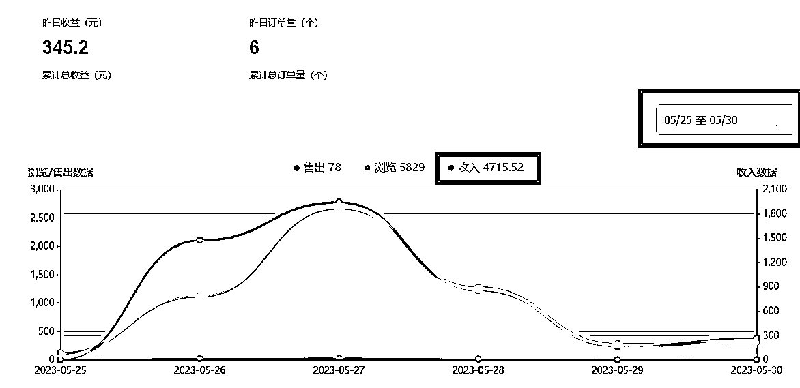

做了两个账号数据如下：

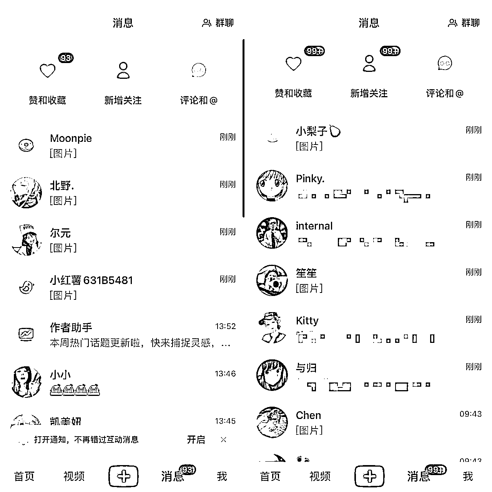

# 一、准备期

## 1.定位

首先大家要知道，定位的目的是什么？

是要找到适合自己的赛道，找到属于你的用户群体

那我们定位可以从哪些方向选择呢？航海手册给了大家建议：

从擅长的领域选择离钱近的

从喜欢的领域寻找相对擅长的，在选择离钱近的领域

做小红书之前一定要规划好最终的变现方式，要做一个值钱的账号，如果你不知道如何变现，有两个方式：

1.去看看同行是怎么做的，看看他们的引流、转化、交付，整个流程是怎么跑通的

2.看生财的优质文章，在里面找你想要的相关领域变现方式，或者参考同类型行业的变现模式

我在参加航海之前，阅读了生财大量的小红书文章，来确定我应该选择的赛道和变现模式

尤其是航海手册，我反复阅读了好几遍，定位要垂直、精准、细分，要选择能赚钱的，离钱近的

最终，我选择切入的是大学生学习相关的赛道。

想问题简单一点，航海手册就是最好的指路方向，只用记住一点：听话照做，把执行力拉满

我将一部分对我有帮助的大佬帖子标记如下，大家有时间也可以去阅读和研究，会对你选择赛道以及迈出第一步非常有帮助：

@拱卒 《小红书资料引流虚拟电商项目保姆级攻略》

https://wx.zsxq.com/dweb2/index/topic_detail/214528181525521

@九京 《实操复盘：小红书资料号新玩法，深度运营月入5w+》

https://wx.zsxq.com/dweb2/index/topic_detail/814515211518452

@漫漫mansi 《32万小红书博主的小红书涨粉变现之路复盘》

https://wx.zsxq.com/dweb2/index/topic_detail/181484215242412

@常常 《100天涨粉14万，小红书爆款笔记经验分享 》

https://wx.zsxq.com/dweb2/index/topic_detail/181444182511412

@杨星城|水水 《如何实现小红书「矩阵引流」到「商业变现」的小闭环？》

https://wx.zsxq.com/dweb2/index/topic_detail/585145848122284

@星月 《引流效果暴增10倍！历经3个月迭代出的小红书爆款笔记框架》

https://wx.zsxq.com/dweb2/index/topic_detail/584115844185284

大学生学习这个赛道涉及范围非常广，有学科类、考研、考编、考公、技能学习（java、python、c++等）、竞赛保研等等，每个类目里面都有更加垂直细分的赛道

为此，我列了一张初步的思维图，来从中挖掘我能够做的细分领域（有一些领域我直接pass掉了）：

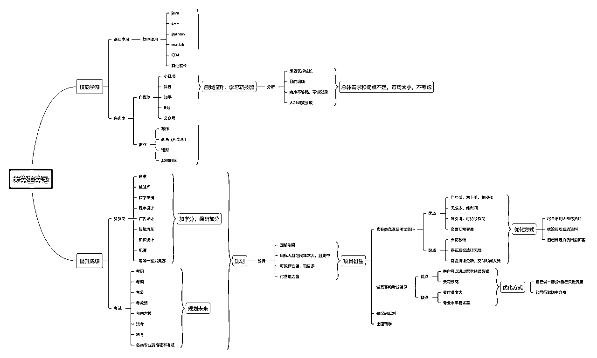

点击放大查看

我将它分为了技能学习和提升成绩两个方面，由于技能提升需要比较强的专业性，并且人群受众相对于提升成绩差距过大，所以，我毫不犹豫的选择了提升成绩这个板块，不管是卖资料还是后续的辅导、规划、培训都存在相当多的玩法以及比较高的收益。

建议大家在做定位的时候，也可以列一张思维导图，把你能够想到的有关赛道细分领域统统罗列出来，然后做分析，找数据，从喜欢的、擅长的先选，如果都没有，再去找能赚钱的赛道。

在这个板块中我选择了一个我比较熟悉的板块，跟我大学所学专业相关（我选择的赛道专业性要求比较强），这里我这里就以考研、考公为例，因为我本身内容都是参考它们的模式去做的。

最终，我设定的变现模式分为两个：

1.卖资料：将自己以前的资料库和淘宝pdd等平台购买的资料进行整合、洗稿（注意版权）

2.接辅导/培训：如果没有专业团队和知识直接去找到做得较好的同行，让他们做交付，你只需要做好前端流量即可

我的建议是想要快速得到反馈，赚第一块钱，最简单的方式就是卖资料，当然优点跟缺点也很明显，毕竟有多大能力，吃多大碗饭。

## 2.找数据和对标

不会做小红书，一个字“抄”，当然不是让大家直接照搬，而是用别人的内容形式来套自己的产品

大学学习和提分类的爆款内容火的逻辑都差不多，标题和封面永远是最重要的一环，所以我们只需要去优先模仿别人的标题和封面。

要记住，永远像有结果的人学习，因为结果不会骗人

做内容一定要善用工具，相信大家参加本次航海，一定能够在实战工具包里面找到很多的工具使用。

我们在这里通过后羿采集器收集考研、考公的爆款笔记来进行参考模仿，不会使用的可以看下面的文章：

保姆级小红书爆款选题最简采集流程

https://www.gaoyuip.com/1770.html

然后我们得到这样数据（完整的数据我已经整理在飞书： ）

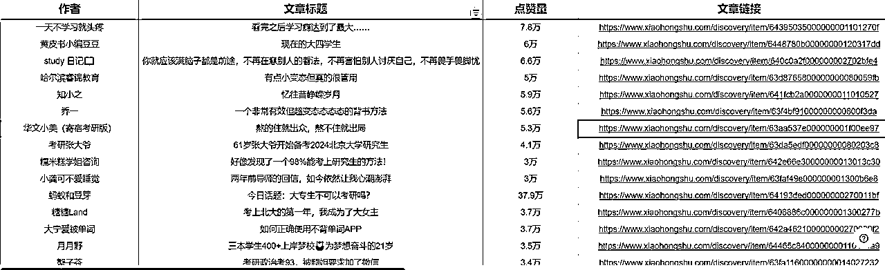

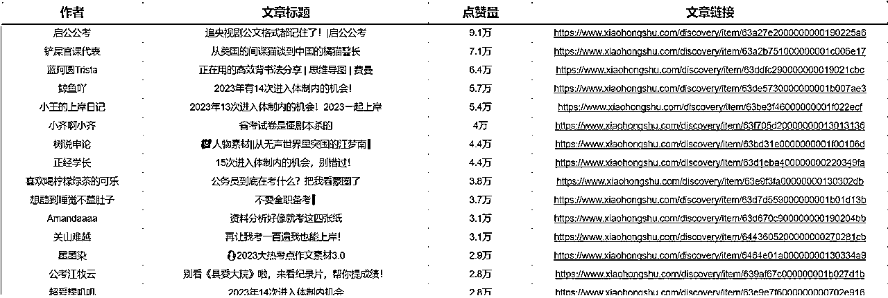

我们可以看下面的爆款笔记，封面都包含大量的知识点，这就是我们可以参考的一种模板

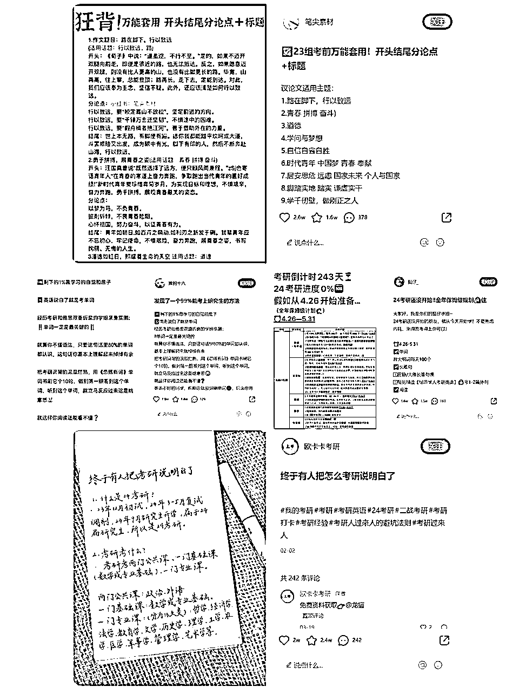

那我们如果把上述内容换成考编、教资、四六级，是不是一样的效果呢？

我又重新扒了考编和教资的内容，发现如出一辙，往往以这种封面知识点的内容形式进行分享，很容易打造爆款。

当然，这只是其中一种模式，但是，我们可以通过找共性去做出类似的爆款笔记，通过模仿打造爆款的内容生财上有非常多的文章，大家可以自行去阅读。

你想要做成一件事情，一定要主动去学习，去做，去思考，从0-1你需要付出很多努力。

通过数据筛选出来我们想要模仿的账号之后，接下来就是打造封面头像昵称了

这些前期的准备，我们依旧可以参考同行的做法，比如名称可以取xx说考研，xx考研学姐，对应你所要做的领域。

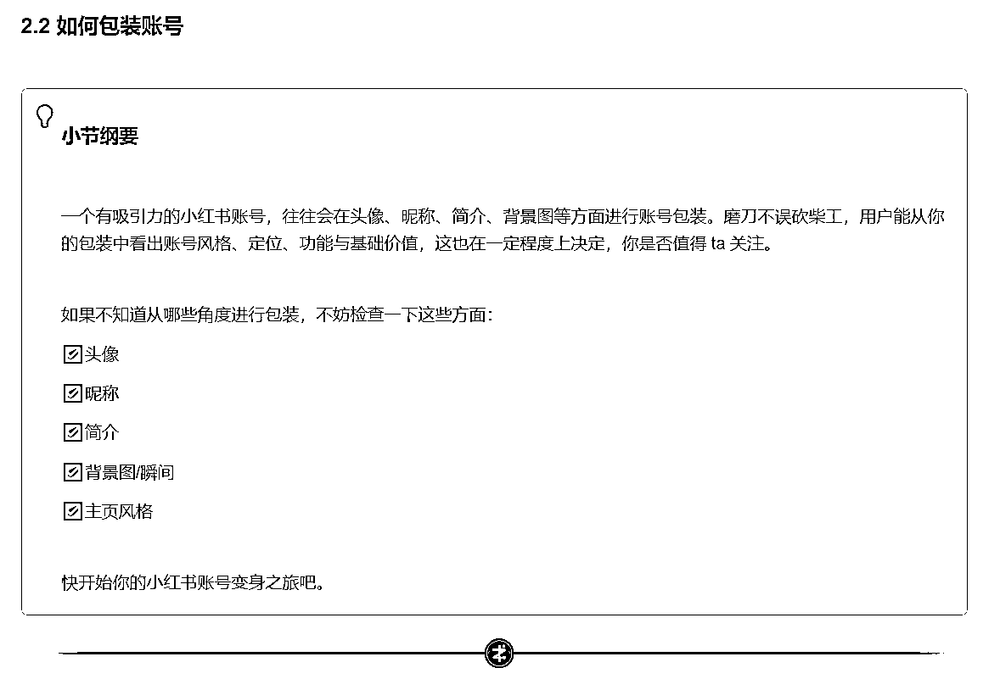

这些准备工作，在航海手册的2.2部分里面已经讲的非常清楚了，大家自行查阅（建议多读几遍航海手册）

# 二、实战期

## 制作笔记

以我为例，我用了两个小红书账号去做同一个领域的内容，下面是标题、封面和内容的制作过程

### 1.标题

怎么写标题，有下面两种方式

1.直接在收集来的爆款笔记中，改标题，或者直接使用爆款标题

2.通过chatgpt生成爆款标题，教程如下

@深度思考的瑞克《chatgpt训练小红书模板》

### 2.封面

制作封面，我个人是直接进行1:1的模仿，如下图，左边是我做的，右边是对标账号的文章

有朋友会说，这也不是1:1啊，其实是因为我没找到之前对标的帖子了，只能找一篇相似的笔记供大家参考，原贴我仅仅修改了封面中的几个字和一张表情包

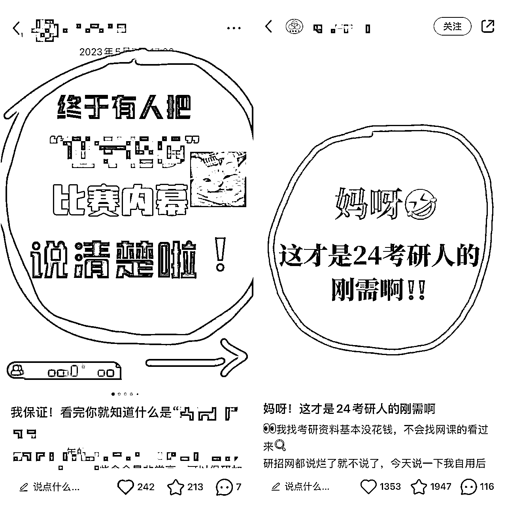

更加详细的如何制作封面大家可以去看@比比先森 在6.1日分享在小红书运营大群的内容，应该有很多朋友没有仔细看，具体的内容我已经做成飞书文档，大家可以自行查看：

@比比先森 《6.1小红书爆款笔记分享》

### 3.内容

内容的制作也非常重要，给大家分享我自己的创作内容的方式

1.通过gpt生产，给出爆款标题，让他模仿并生成高质量内容

不会调教chatgpt的，可以看下面这一篇内容：

@比比先森 《0基础新手，用ChatGPT创作90分高质量小红书笔记，提高30倍神仙效率！》

https://wx.zsxq.com/dweb2/index/topic_detail/814455412118512

2.在知乎，B站等平台找到相应的内容，整合到小红书内，或者用gpt洗稿

## 安全引流

我们最终的目的是为了卖资料，为了成交，那么我们前期一定要设置好钩子，让用户进到你的私域

以考研资料为例，我们可以送公共课资料，然后专业课资料是需要付费的

或者是赠送某几个老师的全套课程，其余的课程收费的（这个需要根据自己的产品测试一下，哪种引流效果好就用哪种），相信大家应该这方面都有自己的心得，我就不过多赘述了

我们引流的方式一定要特别注意，为了防止被限流和被举报，我将我个人所用的引流方式总结如下：

1.在评论区留言不要直接让它后台私信你，回复踢我，T我等等

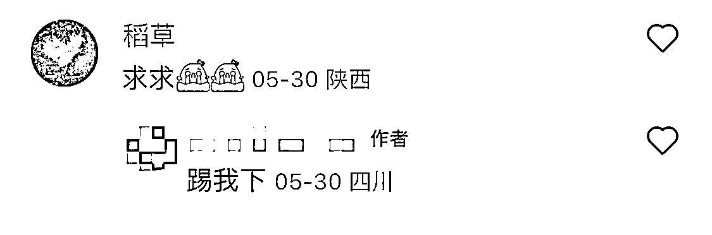

引导评论非常重要，我大部分转化都是因为评论的人数多，帖子浏览量变高，私信人数非常多，可以看下两个号对比数据

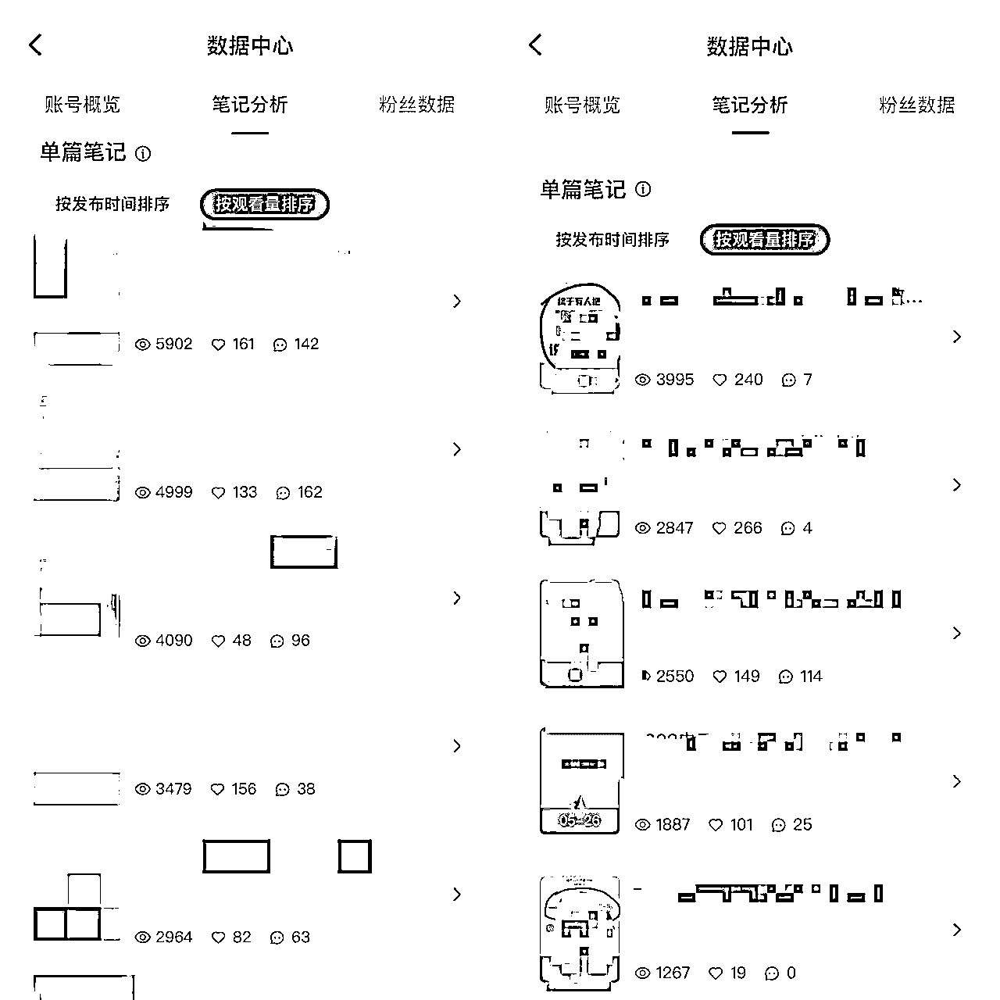

2.私信尽量不要去留微信，公众号之类的，可以把他们做成一张图，然后每次用不同的图回私信

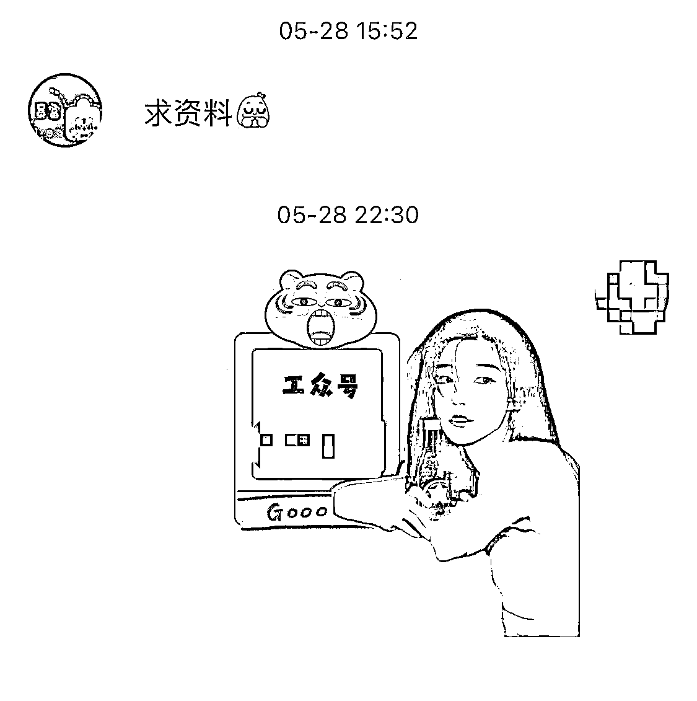

3.【最安全】用小号发帖子，留下微信或者公众号，大号收藏，私信或者群聊公告，让他们看你的收藏

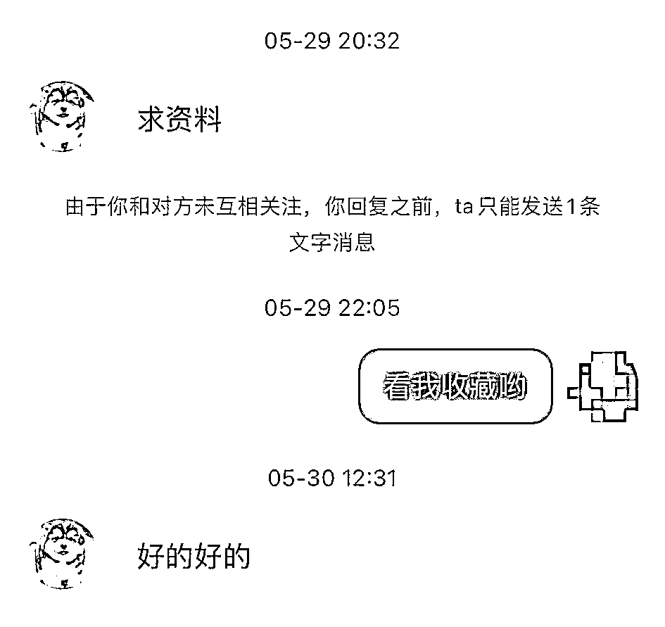

4.小红书群聊，发群公告，或者每次新人进来后，留自己的微信

引流到了私域之后，就是看你的聊天话术和朋友圈了。精准客户，我测试转化率还是蛮高的。

# 三、心态问题

## 1.用数量去解决问题

从0-1必定是很难的事情，我做的小红书开了4个号，尝试了好几个赛道，最终有两个号的数据跑出来了

所以，很多问题的根本在于解决数量问题，不止是账号，还有笔记也是

换个角度去想，很多烦恼是来源于钱的数量不够多；而人的认知无法提高，也是来源于读的书、看的世界、个人经历不够。

当然抄也会失败，比如下面这种账号，也是模仿的，数据就非常差

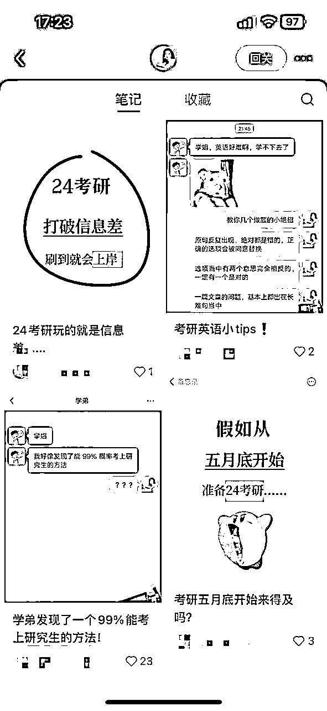

所以，我们在做小红书这件事上面，定位、找对标、模仿，如果你全都走完了，并且做的还不错的情况下，笔记数据还是很差，排除掉内容的原因，去试试走量吧

## 2.学会寻求帮助

像易仁永澄老师说的：少说“难不没”，多说我需要，可以像教练、志愿者、圈友多提问，提出你的需求

在航海的过程中，我们的志愿者琰姐@琰（Joyce）多次给予我心态和认知上的帮助，我非常感谢！

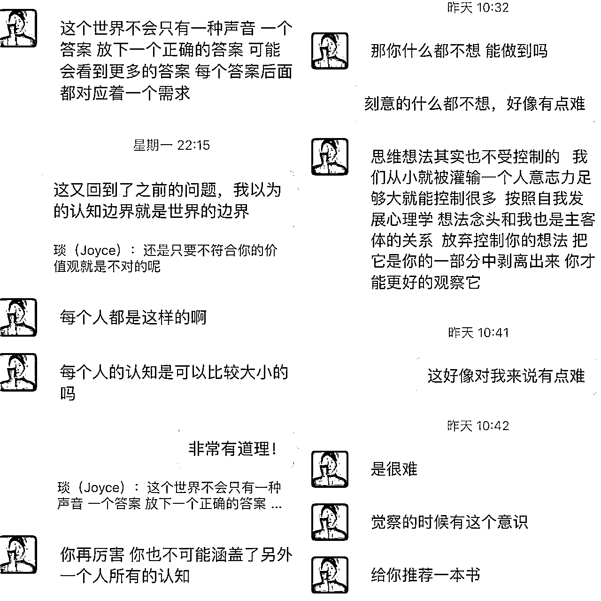

生财很多大佬都是各个领域的精英，大家一定要利用好这次航海的机会，多请教，多问，多提需求

送上易仁永澄老师的一句话：你内在的英雄战无不胜。祝大家本次航海都能有所收获！

# 四、工具使用

我在以往的帖子中总结了Ai工具大全以及Ai工具的使用方法，下方链接可以直接查阅

有关任何Ai+小红书相关的问题，也可以找我一起交流

《Ai工具合集，一定有你需要的！》

https://wx.zsxq.com/dweb2/index/topic_detail/214455411554481