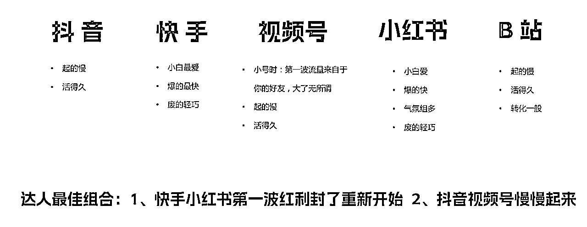
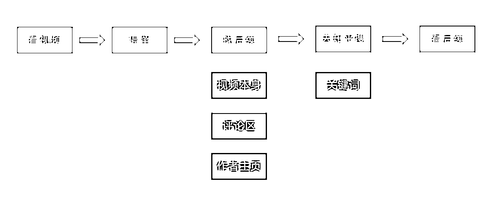
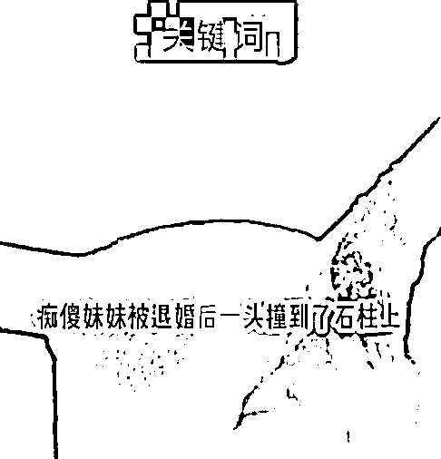
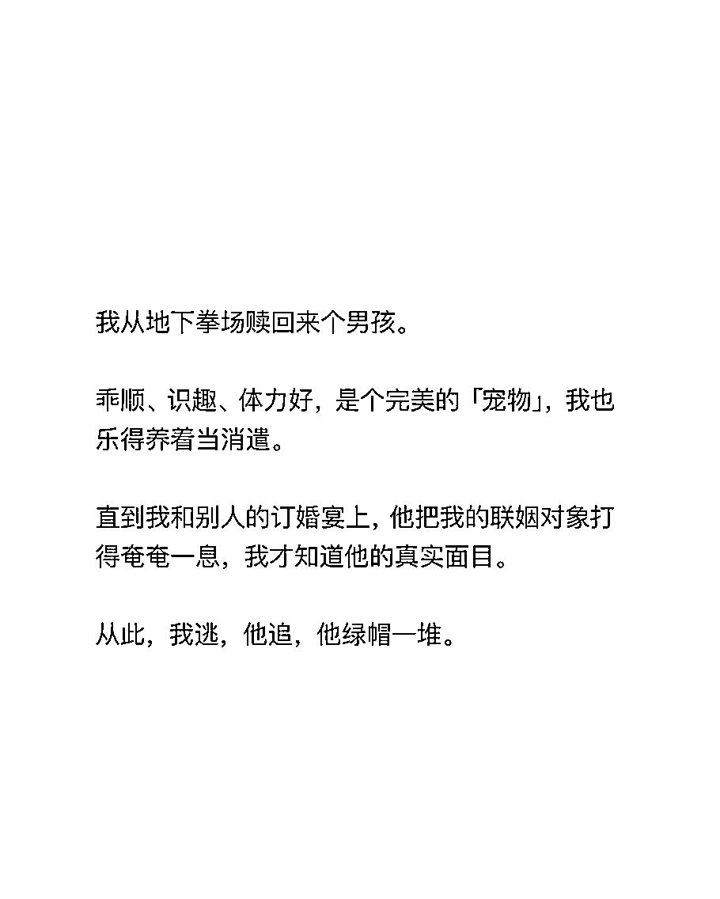
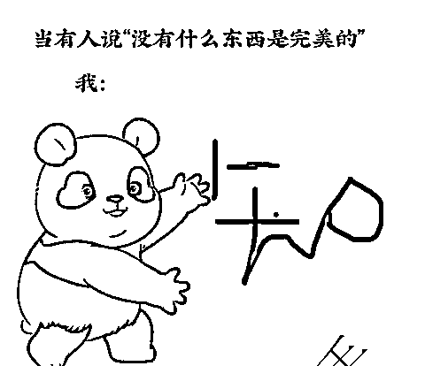
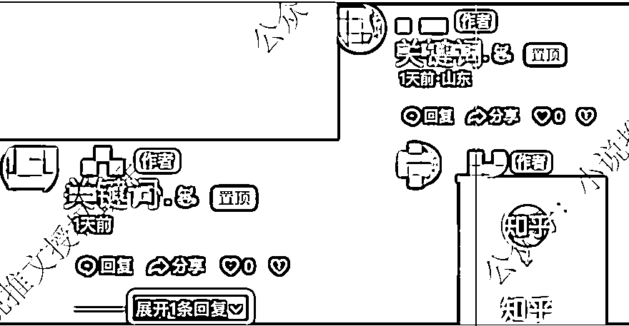
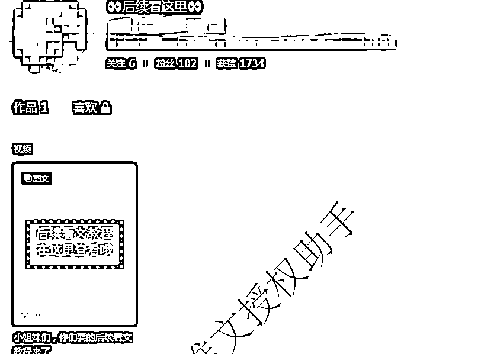
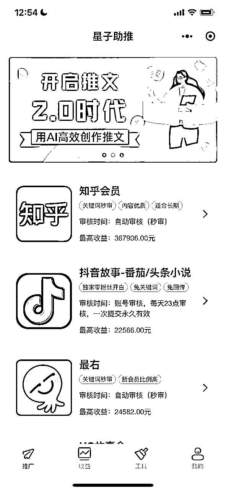
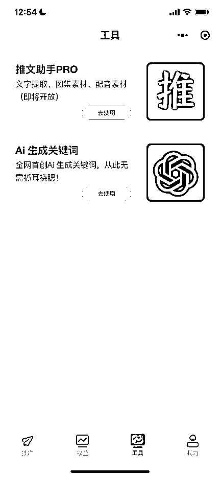

# 《从平台角度，聊一聊推文技巧及高效化引流》

> 来源：[https://dvfan273t0n.feishu.cn/docx/QlUMdZfACoJhFNxp97RcvXygntf](https://dvfan273t0n.feishu.cn/docx/QlUMdZfACoJhFNxp97RcvXygntf)

今天跟大家分享的是在做推文之中最重要的一个环节，就是引流。

做推文的时候，我们一定要了解不同平台的特性，因地施策，避免出现平台选择错误的情况。

### 一、小说推文在不同平台的特性

我们在做小说推文的时候，不要只是专做一个平台，要做“海王”，并且需要有一些策略在里面。

#### 1.1 抖音

抖音是咱们一定要做的，他的特点是【起号慢】但是【活得久】，除非特别出格或者频繁被人举报，否则生命力是最长的。可以把号逐渐养起来，然后收益就会比较稳定了。

#### 1.2 快手

快手其实适合的是“短平快”，尤其我们在做图文素材的时候，很快就能起号，运气好的可能两三天就会爆单。所以快手是【小白最爱】【爆得最快】。

但是快手的审核比较抽，我们叫【废得轻巧】，爆完基本上就会限制发布和限流。运气不好的可能一上来还没发几条就被限流了。这种其实也不用懊恼，平台特点，不行就注销或者换绑手机号再注册新的。

#### 1.3 视频号

视频号起的慢，关键起号节点是微信好友，如果想让视频号起量，在前几个作品中，一定要分享到朋友圈、群，让好友点推荐。这样号才有机会起来。同样的，跟抖音类似【起号慢】【活得久】。年初的时候视频号里面微信对话的素材样式效果比较好，现在不太行了，大家可以继续摸索。

#### 1.4 小红书

小红书的特点之前其他教练也进行过分享，小红书最主要的就是做好自己的预期管理，做好不断“转世”的准备。【小白喜爱】【爆得快】【废得轻巧】在小红书上比较适用。

#### 1.5 B 站

B 站其实也比较有意思，基本上不怎么，或者几乎不会封号。但是流量很难起来，转化率也不是很好，可能跟 B 站用户付费习惯也有一些关系。

#### 1.6 总结

上边是推文最常用的五个平台，所以，咱们再做推文的时候，大家准备平台账号的时候要有策略：

1.  快手、小红书第一波流量红利吃到，封了再来。

1.  抖音、视频号有耐心，做成中长期主阵地。

### 二、引流的底层逻辑和思路

#### 2.1 找到引流关键节点

通过上边各平台的特点有了初步了解之后，我们再来看一下用户在各个平台看推文的路径。

用户整个看推文的路径是：用户先在流里面刷到【视频】，看到吸引的视频进行【停留】。

如果对内容感兴趣，会【找后续】在哪里，然后在“视频本身”、“评论区”、“作者主页”里面看到要去知乎（或其他平台）看后续，用户就【去知乎搜】对应的关键词，然后继续【看后续】。

其中重要的漏斗转化节点为“找后续”、“去知乎搜”两个动作节点。我们的目标就是提升这两个节点上的用户转化率，让想看的用户不流失、更顺滑的进去下一步。

所以接下来我会沿着这个思路来看，对应每个节点上，我们应该如何去做，有何技巧。接下来我整体介绍的都是以抖音平台为例，其他平台的底层逻辑一致，根据不同平台情况大家要灵活运用

#### 2.2 引流技巧

##### 2.2.1 找后续

我们引流用户让用户看后续的转化的点在三个地方：视频本身、评论区、作者主页。也许未来还会有除了关键词和挂载链接以外的推文形式，但都是按照这个逻辑，先明确好引流转化的 key，然后再做下一步。

###### 2.2.1.1 视频本身

核心目的：传达关键词，让用户下意识的就知道你给出的某个地方是关键词。

平台角度：平台想要通过视频里的关键词很难给你进行限流，因为关键词没有固定规律，即使在固定位置，除了推小说以外，其他很多视频都有类似的文字，不好区别。所以关键词你就大大方方的放，视频本身投入的精力要放在视频的去重和素材选择上。

1）视频素材

在素材的顶部、水印等地方固定下来。且每个作品的位置、大小保持一致。

2）配文

用 tag+关键词的形式，或二者选其一（老号文案可以只有关键词） 如：我是守夜人#小说#悬疑#宝藏小说

注意：tag 不要乱用，如果内容不相关，不要硬蹭热点。tag 是为了让算法更好理解你的内容标签，用以更好的推给不同的人群。

配文中@小助手 @官方 类似这种也不需要，有的人会说@完 官方，会给流量。 没有太大的依据，试想如果你是平台分发策略的产品经理，你会去建立个规则策略是@我的就给流量倾斜吗？

###### 2.2.1.2 评论区

评论是引流的关键中的关键，也是很多新人卡住的地方。同样也是平台重点“关照”的地方。所以我们也要看一下

核心目的：先来说评论区的我们引导的核心目的“让用户知道去哪搜什么”。去哪=指向平台，搜什么=关键词。 除了这两个关键要素以外，不要有其他的动作，比如写自己看小说的真情实感什么的，不会对转化产生任何正面影响。

平台角度：

平台识别这块用两个手段：

i：文本：平台一般都会有个库，触发后有不同的策略，所以咱们的目标就是避免触发这个库。不能让一些固定的规则猜到我们是指向的知乎（或其他平台）

ii：识图：图片本身也是会有规则，平台好识别，比如直接放一个知乎的 logo，平台很轻易识别出来。还有一种是用 OCR，识别图片上边的文字，再通过上边说的文本库识别出来。

我们的核心策略：1、让平台识别不出来；2、不要大量用，大量用了平台就会放到“库”里。

接下来再看一下依据这个策略，我们可以做的一些技巧。

1）表情包

每个视频评论区需要使用不同表情包，以下表情包仅供参考，【禁止全部使用同一个】。表情包制作：美图秀秀，可搜集任意模版+盐选会员。蓝色软件、🈯️🐯有指向性话语 或只在评论区发布书名+空格、书名+🌹等 emoji

先发关键词，再回复关键词表情包，正常状态下为折叠

2）其他用户评论并点赞

尊敬的盐选会员先走一步；xx 会员已看完。

3）建一个单独的小号

叫后续在这里等类似的。别的号在评论区@它。或者平台已经有别人建好的号，你可以直接@ 。

4）其他

粉丝养起来的老号不用引导去知乎，用户已习惯，或者自己能找到。

###### 2.2.1.3 作者主页

昵称、背景图、签名 这三部分随意写即可，不强求，因为这块现在审核的比较严，不带有明确指向性来“知乎”等平台看文。新号不要更改主页简介，随便写点鸡汤什么文案就行。

尽量避开“推文”“小说” 这类关键词，主要是避免一些“友商”黑手举报。

###### 2.2.1.4 找后续引流的总结

以上是一些常规操作，但背后是我们要多想一步，就是站在平台角度。如果你是抖音的产品经理，你要限制大家引流的话，你会怎么操作。这么样去思考，就能想到我们如何去规避了。

另外就是再强调一下，认清原理，不要照搬，根据自己情况灵活应用。因为任何方法只要用的人一多，限制起来就更方便了。

##### 2.2.2 关键词

在“引流”路径上，最容易被忽视的就是关键词了，很多人认为关键词随便起就可以了。而没有注意到，其实在这一步流失也是很严重的。

举个例子：我们这边有个博主，流量还不错，但是有个作品最后的转化很差，十万播放只出了 3 单。就是因为他的关键词出现了问题。她起的关键词叫做“落落娇阳”，大家不知道有没有看出来，这个词为什么引流的转化率很低？

问题出现在“娇”这个字。本身“骄阳”是个固定的词，大家输入法打 jiaoyang 的时候，出来的是“骄阳”，马字旁的“骄”。所以很多人在搜的时候，搜的是“落落骄阳”，然后看到的内容就是另外一篇小说，所以也不会有转化。

我后来也问了这个博主，当时是出于什么考虑起的这个词，他说他当时本来用的是马字旁的，后来发现被占用了。就换了个差不多的字。

这个案例说完，相信大家都能理解为什么关键词也是转化的关键了：用户是懒的，是在闲逛，而不是在考试：我们不能要求用户 100%记住你起的关键词，所以在起的时候注意以下几点：

###### 2.2.2.1 避免同音易错字

例如 骄/娇、手/首 等类似的。

###### 2.2.2.2 避免增减助词

的、了、着这种，例如关键词如果是美丽的笨蛋，有的用户真的会搜美丽笨蛋，用户把“的”字自己去了。

###### 2.2.2.3 可以用固定词+一些常见短语的形式

比如你的账号叫 落落，那你的关键词都可以是“落落+xxxx”的形式，比如落落不知道、落落没烦恼等等，这样一些用户看了你的主页作品，很容易记住你的关键词然后去搜索。

最后，今天要告诉大家最重要两点是：1、找到关键节点； 2、站在平台角度想，他会怎么限制，你的应对方法自然就出来了。

希望今天的分享也能给大家一些启发，大家要“灵活运用，不要照搬”。

小说推文行业逐渐从粗放式赚钱，进入到“精细化”运营阶段，这个时候一些想通过小说推文“赚快钱”的团队和个人会被筛掉。

而小说推文一定是一个长期的项目，就像淘宝客一样，只要抓住变现的核心路径，逐渐扩大规模，相信大家都能在这个方向收获到自己想要的成绩。

### 三、链接我

#### 3.1 小说推文新人：

想做小说推文的朋友，我这边自己的小程序【星子助推】可以直接在微信上搜到，本来我们是设置了门槛费，咱们的生财的朋友在注册时填写邀请码 8X25K 就可以了。一些日常操作和教程，可以关注“小说推文授权助手”公众号，会更新一些信息。

#### 3.2 已经在做小说推文的人：

如果你是小说推文或者是想做小说推文的团长，可以在星球私信我