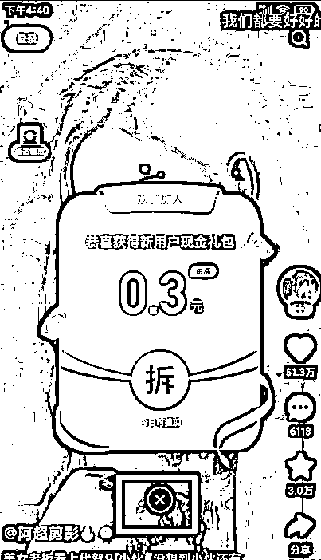
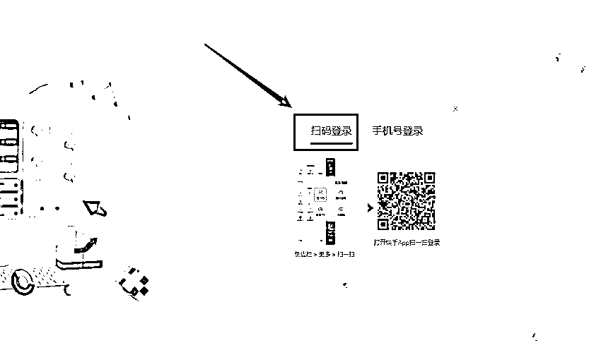
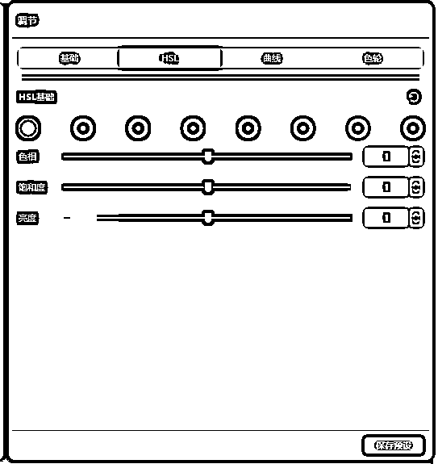
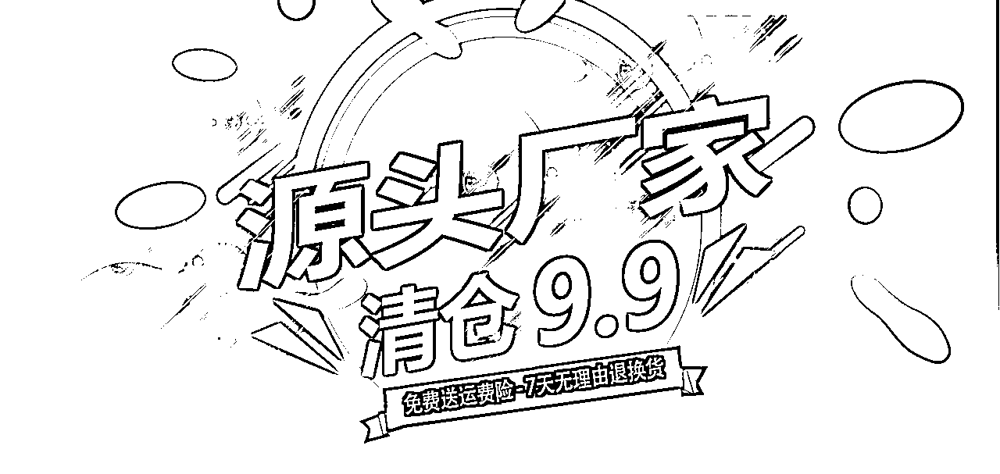
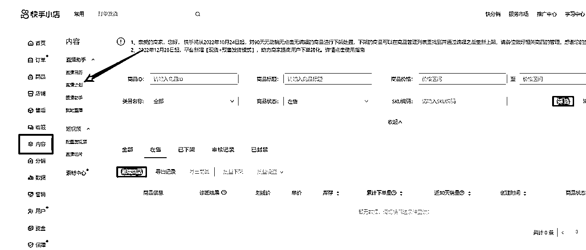

# 快手无人直播技术[C级]

> 来源：[https://qv4zhbe2wa.feishu.cn/docx/Qzd8dBqErofp9axqQRCckvWKnog](https://qv4zhbe2wa.feishu.cn/docx/Qzd8dBqErofp9axqQRCckvWKnog)

阅读后，

可以获取快手无人直播技术，

快手无人直播模式，

重点：该模式可以照葫芦画瓢，照猫画虎......举一反三，快速起号，

希望对你有帮助！

## 前言

### 平台乱象

这篇文档以【C级】为后缀，在我这里表示的是生财有术，同时也表示我对这个搞钱氛围浓厚社群的认可。

我空闲时间浏览了一些帖子，有包装个人成为超级个体的，动不动就抄盘几十万上百万的，还有一些无人直

播动不动就纯利润就上好几W的，看的我都有点心动。

PS：如果你恰巧浏览到这篇文章，又刚好在这个几万到几十万上百万的区间，请不要对号入座，我心里真实的为你高兴能赚取到这些财富。

最近还发生了抄袭文章包装自己的，尤其是同平台搬运的，这是对原创作者智商的侮辱，也是对自己的不负责。

互联网上，其实大家都是在搬，这个没啥讨论的。就是看谁搬运的高明。初级的跨平台搬，中级的洗稿搬，高级的借鉴原创搬，你要是有能量场，直接找对方要，顺手就给你了。

同时我也看到了一些圈友付费学习，但是没有得到结果；也在隔壁星球看到圈友在收费培训，结果是名声不是那么好，付费学习的圈友截图指明道姓割韭菜。

对于付费学习的人，其实我是非常尊重的。

这一部分人，其实比不付费学习的人更容易成功，他们是一群执行力非常强劲的人，对金钱、对提高生活质量的渴望比那些不愿意前进的人更有希望成功。

我曾经也是这样的一名生财有术圈友，很多项目看起来都能赚钱，也加过好几个圈友的星球，甚至圈友的圈友的星球，也有向所谓的大佬话还没说一句，先把钱砸他脸上。尤其是最后一种，我非常反感。

缺少辨别能力，但是这又是一个在知识付费领域氛围中必须成长的经历，这就是没有真心大哥带的问题。

这个问题如果换一个场景来说，就是家里没有矿，我爸不是*刚。所以有些经历必须是要经历的。

我最近加入了生财内容巡逻，看到一些在规则之外留微信引流的，也看到有些被割的人，发完帖子就在生财里面找不到ID了的，也不知道被踢了还是自己主动退出了。

如果是主动退出，我个人觉得完全没必要。在我的认知里，可能比生财还有更好的社群，但是我目前只够的着生财有术这样的社群，在外面没有比生财有术性价比更好的社群了。

相信我，每次的航海比外面5000以下的课有价值。

每一次的航海不会让你暴富，也不会让你升级为技能高手，但是在下一场风刮过你身边的时候，你在航海中锻炼的面对风浪岿然不动的身法，会助你有机会借风生财。

虽然生财官方会放大某些个人在生财航海中取的成绩的人的曝光度，这是社群运营的手段，社群也需鲜活的案例才能激发大家的积极性，成为这样人极少。

这些人能够异军突出，绝非偶然，而你肯定是少了一些“绝非偶然”。

如果你不幸被大老割了，不要气愤，保持搞钱的心态。换句话说，这也是一笔财富，一笔持续被防割的财富。在未

来的日子里，你会持续遇到更多大佬，会助你练就火眼金睛，瞄一眼就知道是大哥还是大割。

如果你被割好几次了，那就说明是自己的问题了。

知识付费，本来是一个积极向上，对生活进取的代名词，但现在在大家的意识里就是割韭菜的意思。

我个人非常痛恨这样的人，我也有过这样的经历：

这篇原文是我在生财有术的首篇龙珠文，里面有我被割的经历，但同时也有我愤起搞钱的方法。

在我们凭借各种手段无法挽回被割韭菜的事实时，我们唯有搞钱，才能抚平心中被欺骗的创伤。

等你越过这个坎的时候，看到另外一片风景的时候，成就感油然而生，你会欣慰的说：不过如此！

所以，跌倒也是一种财富！

### 补充：原文地址

星球地址：https://t.zsxq.com/0ecP8HaP3

飞书直达：

我今天特意去看了一下这篇文章的评论，发现有一些表面现象的评论；

原谅我称之为“表面现象的评论”，因各自立场不同，所表达的意思也不一样，理解也不一样。

下面的“你”不针对任何人，仅仅方便摆设一个虚拟对象，请勿对号入座。

从文章的风格来看，确实是一篇从0到1的爽文，如果把自己放到当时的场景，你也可以完成0-1？

文中涉及的的视频号部分，代表了我比一般人的人有执行力，这一点生财有术里面时常说就打败了60%的人，你是否是60%分以上的人？

小说推文被不二学院割韭菜，并且被他们踢出社群，这种心情犹如最近爆出被割韭菜的人那种感受，但我是否有停下来抱怨，当你遇到这样的场景，你该怎么办？

被割了一次又一次，还能拔云见雾又能抓住身边的风，你是否还敢付费学习的魄力？

面对曾经航海教练也要收费我150一张的营业执照，注销还要收费的手法，而我需要大量的执照，我又是如何从淘

宝挖掘的0成本注册执照的？

从0到1的保姆级文档在生财好几只手都数不过来，又有几个真的能从0-1的诞生？

以上的几个重点，不仅仅是爽文吧？

上面的几点，对于整个闭环来说，缺一不可！

### 关于付费

在我发了上述文章以后，很多人都过来咨询我能否付费学习。

培训收费比自己干苦力收益来的太实在了，不动心是假的。甚至有一个圈友链接过来，好心的给我上了一课。虽然

口语比较犀利，但从商业变现的角度来看，由衷的感谢你！

有一些人看到我发了文章，热血沸腾，太他么的简单了，我也能搞！

有些人咨询了我以后，被我拒绝了，也有一些觉得我实力不行，转投别处付费。结果很显然，冲动的付费，不认清

事实只看表象的付费，注定全军覆没。

这里不是贬义，前文说了，我非常尊重这种愿意付费学习的人，因为这种人更容易成功。

耐不住每天这些人的持续的“高薪”诱惑，我挑选了几个符合条件的人准备大干一场，我也要学习大佬的风格，尝试

做做知识付费。不仅能有直接的经济收入，还能聚拢一批搞钱的人，而且还是这个能量场的主理人，想想是不是很惬意？

我想很多人和我一样，有这样的想法！

这个时候我已经收费了，并且整套手法已经在线手把手传授了，就差下场实操了。

这个本该是一帆风顺的，在这个节点上，平台想灭了我这个星星之火。

回顾【无人直播的理解】何为星星之火。

第一个信号是厦门那边传来的信息，陆陆续续各个工作室开始反映了，直到我这边也出现问题。

这个时候我意识到，平台估计是想换火苗了。

新的挑战开始出现了，于是这个想法被迫终止，各位的钱原数奉还，并且附赠当时的实操保姆级操作文档。

直到今天，执行力强的人时不时的添加我，希望通过我帮助他们赚到钱。

有一些人学着生财有术倡导的，红包开门，但我个人从生财有术通过这种方式并没有得到好的体验，有些人收了钱随便敷衍。

也有可能在他的认知里，我这种红包对他来说是廉价的劳动力，从他的角度来说，这是对他的侮辱也说不定。我要是日入几万，我也看不上，哈哈哈....

也有一些人，咨询了问题后，顺手把钱拍我脸门上。但我感觉并没有给对方带来实质性的帮助，既然别人这么尊重我，领了这些红包又发不了财，又何必呢？那就相互尊重吧！

至此，不管是直接用红包砸我的，还是咨询完后用红包甩我脸上的，我都没有去点过。

个人建议：如果你不在乎那个钱取得收获，那么见面就用钱砸对方，快速取得好感，让对方说话！

如果你希望这个钱要取得对应的结果，那么先咨询后，感觉值可以顺手意思一下；领不领是别人的事。

当然，白嫖也可以。大佬的胸襟不会在乎你这点钱的，只是你下次应该就不会那么好意思问问题了。

如果你还能继续白嫖，我们一定要添加个好友。

### 无人直播的理解

为了大家都看的懂，我会用非常普通的方式阐述

无人直播和真人直播一样，其实是允许的。

站在平台的角度来看，平台是需要盈利的。只要有资金的流动，那么就需要给平台付费，尤其是卖货方面，每单快

手收费5%。

假如快手是你的，一个是正常体系内的创作者在快手平台淘金A，一个是体系之外的在快手平台淘金B，那么可以

说，B就是你的额外增值财富，你想哪个时候取就哪个时候取，何乐而不为！

所以，无人直播，我称之为不受保护的直播，因为那些钱，在还没有到你口袋里的时候，平台可以随意要过去。

其实就是后台一个按钮的事，只是平台背后的人作为一个智者，不会杀鸡取卵，它会留下星星之火，不会一下子把你这团火给灭了，更不会把鸡放到火上烧烤。

张三：你这是扯淡，我按照一些大佬的教程，开播还没开几分钟就凉了？

快手：你可能遇到的是所谓的大佬。还有，你那开播手段一点都不尊重我，不干你干谁。

李四：我花钱找到了真正的大佬，并且还去了所谓了线下培训，我亲眼看到大佬就在我眼前赚米，那方式真有效。

按照成交金额我们都是给平台服务费了，为什么还要干我？

快手：首先我很佩服你们的手段，竟然能过我们算法上的一些风控，你们很有敬业精神，同时也给了我们算法上漏洞测试的宝贵经验。快手的无人直播还需要你们继续去播种，恭喜你们升级为星星之火。

由于你们的的火烧的有点大，都烧到影响投流付费的人了，要是我不干你们，以后那些投流付费的金主爸爸、那些千奇百怪的原创作者谁还认我做大哥？

只要你们不要过分，我默许你们，反正你们的钱都是我的。同时很遗憾的告诉你们，算法最近就会修复，赶紧研究新的漏洞帮我们投喂算法吧，要不你这星星之火可就灭了，铁子加油！

站在曾经写过代码的从业者角度来看，平台方面没有不知道的秘密！你所有的的动作，平台方的后台都是知道的，尤其是这种顶流级别，代码之下无秘密。

以上，没有什么GMV、什么流速、什么千次.......仅我对快手无人直播浅显的理解。

你会发现，每个人对于自己的说辞都有一套说服自己的理由，希望你保持自己的思考，做正确的选择。

假如你是一个原创作者、一个致力于在直播行业深耕的，那么建议不要阅读下面的内容，我怕这一套行之有效的方

法乱你道心。

### 关于快手无人直播

大家可以去搜索一下快手方面的文章，相比其他平台的文章是比较少的，为什么少？因为赚钱啊。

很多文章，只能给予方向，是不是感觉一看就会，一做就废。

哈哈哈！原因无他，你没去拜访大佬！大佬希望你去拜访他，不懂规则，他当然不能随便教你。

话又说回来，不能怨大佬没教你颗粒度的手法，你又是谁，凭什么教你？

之前我在阅读生财有术发家史的时候，从2017年开始看，了解到里程兑换飞机票这个行业挺暴利的。

这个信息来源于大牛Caoz，但是当我去追这个信息的时候，在公众号发现，这个玩法是他用不了了才分享出来的，遇到这样的你又作何感想？

在搞钱的圈子里，能告诉你方向，已经千恩万谢拱手作揖了。所以，不要抱怨任何人没带你搞钱，他们没有义务，

除非收了你的费用。

最近看到大家都很躁动，动不动就是说割韭菜，其实这在搞钱的圈子里面是非常不好的导向！

这一篇文章发出来，对这个赛道的人感兴趣的，不少人应该会来添加我。如果你感兴趣，获取文档末尾唯一的付费

工具，我也给了方便之门，工具完全免费，自己就可以实操起来，完全没必要添加我。搞钱的路上，我不干活就会

饿死，我平时也挺忙。如果你们问题太多会做一个统一的回复；

如果你有好的项目，欢迎指明方向，合适可以付费上车；

我愿意分享出来，更多的是愿意帮助像我一样的没有资源，没有背景，没有靠谱的大哥带.......

这是一篇纯纯的技术文，只要你有行动，你就能赚到认知里面的钱！

祝你好运！

下面是快手无人直播详细的教程，该方法截止发文今天依然有效，账号 必 起！

## 目录总纲

让那些虚无缥缈的底层逻辑先放置一边，直接开干

1.  账号准备

1.  素材准备

1.  直播准备

1.  出单发货

1.  风险提示

1.  神兵利器

前言：请携带这个逻辑去看这篇文章，你会发现 “就这，我也会.......”

逻辑：

第一步培养用户爱好，也就是所谓的养号给用户打标签。

第二步使用低价商品，给直播账号打标签，让平台认可直播间，是能给平台带来价值的账号。这里的低价是一个相对的，比如100元的产品只卖20元，60元的只卖9.9。其实这里卖的是人性，低价商品是不会发货的。

第三步用第二步拉起来的账号，在流量高峰直播处嘎然而此积蓄流量，用来正常直播带货。

本文会以从养号开始为线索，怎么去开店铺、怎么去搭建直播、怎么去发货，直到赚到钱的视角来描述。

记得，把逻辑带上。

## 一、账号准备

### 直播类型账号

#### 1.1注意事项：

*   注册过程全程使用手机流量（手机卡没有流量，可以用没有注册快手的手机开启热点）

*   注册时不允许获取手机置信息，把手机位置GPS关闭、注册过程中通讯录等权限获取都拒绝

*   如果批量账号注册，每个账号注册期间、注册地点相隔1KM左右，做公交或者开车出去逛逛

#### 1.2关闭手机位置信息

#### 1.3下载并打开快手，通过手机验证码创建快手号

##### 1.3.1会弹出这种弹框，一律全部不要领，点击X闭弹窗

##### 1.3.2 个人信息全部跳过，不用设置

##### 1.3.3 通讯录拒绝，红包弹框不要领取，关闭，跳过即可

##### 1.3.4 个人信息界面如图，快手号就创建好了

#### 1.4 快手隐藏位置

##### 1.4.1 打开设置界面

##### 1.4.2 打开隐私设置界面

##### 1.4.3 关闭位置

##### 1.4.4 隐私设置界面，显示隐藏，就成功了

#### 1.5 账号实名认证

##### 1.5.1 账户安全界面，点击实名认证

##### 1.5.2 上传身份证照片信息，人脸识别，实名认证。

##### 1.5.3 人脸认证过后，如图快手号就已经实名认证成功了

#### 1.6 手机端快手小店开通流程

##### 1.6.1 点击快手小店

##### 1.6.2 关闭各种弹窗

##### 1.6.3 申请带货权限

##### 1.6.4 申请个人带货，确认身份信息，进行人脸认证

##### 1.6.5 包装账号

PS:实名后再来改，有助减少风险

把账号昵称也设置成 XX鞋业、简介也要修改，凸显出你是源头厂家

#### 1.7 开通直播带货权限

##### 1.7.1 点击进入直播功能页面

##### 1.7.2 拒绝获取权限功能

##### 1.7.3 切换视频直播

##### 1.7.4 申请开通赚钱

##### 1.7.5 正常情况是下面这个截图

ps:如果没有出现下面这个页面，请看接着往下看

##### 1.7.6 如果你的页面是下面这种情况

PS : 请直接关闭快手，间隔30分钟再打开快手进入到这个页面，就会出现上一个页面

##### 1.7.7 直播带货考试

##### 1.7.8 带货权限验证

PS : 如果没有商品，请看下一步

##### 1.7.9 添加快分销商品

#### 1.8 养号操作

1、这里养号，是为了培养用户端标签

2、后面还有一次直播养号过程

点击蓝色字体直达：

### 卖货类型账号

#### 2.1 账号注册

这里的账号注册比较随意，这种类型的账号是拿来卖货的。

这里的操作和1.6.4步骤有一点不一样

PS：也可以直接开通【个体工商户店】

#### 2.2 开通电脑端快手小店

PC端电脑登录 https://s.kwaixiaodian.com

选择主播工作台登录

选择身份

手机快手APP扫码登录

跳过各种弹窗，申请开店

选择个人，扫码申请开通

手机申请，店铺名称 ：【XX鞋业】，之后进行人脸验证

PS:你要卖啥就选择啥行业名称，如果不想别人轻易找到你，也可以用繁体+生僻字

现在把账号昵称也设置成 XX鞋业、简介也要修改，凸显出你是源头厂家，参考下图

### 辅助类型账号

把【卖货类型的账号】开通流程再走一遍流程，创建一个新的账号

### PC端店铺升级

这一步，我们需要把【卖货类型账号】和【辅助类型账号】升级为个体工商户店铺

按照官方步骤填鸭式完成即可。

PS:升级的过程中，有用到店铺同意授权书+采购凭证。

如果自己有公章或者会PS，可以直接造一个，当然，也可以找万能的淘宝，不高于50都是市场价格。

记得是一套材料，总共3张纸，不要被别人忽悠了。

如果你看了我上一篇文章，个体工商户+采购凭证+店铺同意授权书，都不是门槛，三样材料，50以内解决。

传送门：辞职2个月，通过快手无人直播组建了3个工作室(厦门)，目前在湖南筹备第4个工作室

### 店铺商品分销

填鸭式开通，按照流程来就行。这里会有个500的保证金。

如果店铺评分太低，会拒绝开通分销商品权限

至此，总结一下准备工作

1个直播用户端打上标签的直播账号

1个用于卖货的账号，并且开通PC端店铺商品分销权限

1个用于辅助的账号，并且开通PC端店铺商品分销权限

PS:辅助账号的作用至关重要，后面的直播过程会说明

## 二、素材准备

#### 素材寻找

这里，我们只要寻找两种直播间：

*   我们在快手正常卖货的直播间

*   我们在快手起号的直播间

正常卖货的直播间：比如抖音卖69价格，你找到的货源假如只要39，并且符合下面找直播间的要求；

起号卖货的直播间：不管抖音卖多少价格，只要直播间人数够多，并且符合下面找直播间的要求；

*   用抖音自己刷同类型的产品，抖音就会持续给你推荐同类型的，这里我们需要找的是直播间；

*   使用考古加、蝉妈妈等等第三方工具，只要你能找到的工具都可以，去查找直播间的数据

*   朋友给你推荐的直播间

不管你怎么找到的直播间，请遵循以下要点，当然不限于以下几点：

1.  如果你是用手机刷的方式找的直播间，那么直播在线人数至少也要过100+，至于主播行不行，有没有留住用户的能力，就看你自己的判断了。问问自己，我是一个买家，主播能留住我？

1.  说话结巴，方言口语重的直接放弃。

1.  如果你是用第三方工具找的，那么用户停留至少也要60秒以上。

1.  在你觉得抖音直播间挺好的，那么你要看看是不是有品牌的，品牌的直接放弃。

1.  在你觉得抖音直播间挺好的，那么你去1688上看看或者淘宝看看，有没有同类型的产品，没有放弃。

如果你找到了直播间，那么就把它24小时录制监控起来。

注意：比如抖音直播间卖的产品是69.9，那么你去1688找的产品价格是32，这个时候，你需要去1688找几个卖家谈谈.....

*   请问代发吗？我这边是做直播带货的。------大部分的支持代发

*   请问每天发货吗？什么时间发货？--------没有每天发货的都是二手贩子，谨慎或者放弃

*   请问售后你们怎么处理？-------有一些只支持10%的退货率，谨慎或者放弃

*   请问可以添加微信吗？我出了单导出给你们？-------能添加就添加

#### 素材录制

这次直播中使用的工具，我收集在了一个文档中，自行查看。除了一个淦核需要35/月，其它的都是免费的。

淦核可以自己去市面上买。目前我们已经开发出新的替代工具，已经把35的成本切除了。

#### 素材剪辑

##### 3.1 剪映操作

使用剪映打开，页面素材排版如下

序号说明

1.  调节参数，自己配置

1.  滤镜->清晰

1.  图片，建议自己手机随意拍一张，不要拍颜色鲜艳的，当然，你也可以随意找

1.  视频，建议自己手机随意录制一段长达1个小时的视频，不要拍颜色鲜艳的，当然，你也可以使用工具去平台下载。

PS:我在工具文档中放了一个下载B站视频的工具

1.  直播间录制的素材，建议时长8小时起步

直播素材请用剪映把直播中出现主播引导用户加入粉丝团，点关注的手机画面剪切掉，不剪切会增加直播中断风险。

提示：

*   为什么不能用颜色鲜艳的？比如红色、黄色等

透明度参数1%-2%，颜色鲜艳会影响直播间

*   为什么直播录制素材要8小时起步

视频素材太短了，持续循环直播，会增加风险。

导出制作的视频

鉴于直播素材都需要剪切，并且直播素材都是8个小时起步的，最近也做了一款自动剪辑视频的工具

原理：基于违规词剪切画面，出现手机的地方一般都会出现违规词，会把整段剪切掉；

*   自动去掉带违禁词的句子，音频做到无违规

*   基于语义/间隔自动切割句子

*   有去重方案，实测能过快手、淘宝直播

##### 3.2 音频分离

使用音频分离工具分离剪映制作的素材，这里分离出来的是MP3文件音频

至此，总结一下准备工作

1个直播用户端打上标签的直播账号

1个用于卖货的账号，并且开通PC端店铺商品分销权限

1个用于辅助的账号，并且开通PC端店铺商品分销权限

1个起号用的8小时起步剪辑完成的直播间素材，视频+音频

1个正常卖产品用的8小时起步剪辑完成的直播间素材，视频+音频

包括一些使用到的工具：

## 三、直播准备

#### 直播环境搭建

下载快手直播伴侣并安装，地址：https://live.kuaishou.com/live-partner

扫码登录快手。

如果不登录，那么其中一个【视频】的功能没法使用。

添加干扰视频，联系添加2+个，至少两个。

干扰视频需要扩充满屏幕，尽量选择颜色浅的干扰素材。如果有其它平台的水印，请放在屏幕的外面。

干扰图片。自己手机拍或者自己找一张颜色不鲜艳的，透明度调1%-2%。

安装QQ影音播放器。自己去下载或者这里找现成的

QQ影音设置调节

找到自己剪映剪辑好的素材，使用QQ影音播放器播放起来，并且调节如下所示，注意看整个屏幕

ps：现在的参考物是电脑屏幕和QQ影音播放器的位置

打开声音伪原创，按照下面页面去配置。自己去下载或者这里找现成的

PS：还记得之前使用的【音频分离】工具，把剪辑好的视频进行音频剥离出来的MP3文件吗？

音频+视频 同步操作

直播伴侣获取视频

直播环境搭建完成页面效果

提示：

*   自己可以选择添加无人直播标志性【时钟】，自己去下载或者这里找现成的

*   自己可以选择添加直播【广告页】遮罩层。记住，图片建议使用PNG，比如下面这样的

#### 辅助商品上架

打开快手，选择【辅助类型的账号】登录

找到服务市场，进入

搜索【1688】，选择合适的插件，把本次直播中出现的商品，通过1688链接铺货

提示：可以先用完一个再去用其它的，能省钱，不限于下面两个插件；

超级店长：1688链接非常方便【试用7天】

大泽云：抖音+1688的都可以铺货【试用7天】

编辑商品，上架商品

注意：价格设置：9.9~19.9，，预售：15~45，具体自己拿捏

商品分销

#### 直播计划创建

打开快手，选择【直播类型的账号】登录

创建直播计划

添加【辅助类型】分销的商品，直播计划就创建好了

PS：如果这里添加不了商品，可以去需要直播的手机上，通过快手小店，选品中心添加商品

#### 开始直播

回到直播伴侣，正式开播

打开【直播类型账号】PC端

场控助手-快助手。

PS:这个工具是唯一一个花钱的，目前35元/月，比淦核便宜还好用，自研。当然，可以使用同类型工具替代。

目前【快助手】工具首次对外，为了对得起有执行力，并且还一直看到这里的人，

这里释放100个兑换码，兑换码放在文末。

使用后记得反馈，最好是提出使用不合理的地方，我们会持续更新。

QQ音乐

使用QQ音乐播放电台，音量调节到6%-15%，晚上可以小一点；

至此，总结一下目前的进度

1个直播用户端打上标签的直播账号【直播中】

1个用于卖货的账号，并且开通PC端店铺商品分销权限

1个用于辅助的账号，并且开通PC端店铺商品分销权限【产品上架】

1个起号用的8小时起步剪辑完成的直播间素材，视频+音频【使用中】

1个正常卖产品用的8小时起步剪辑完成的直播间素材，视频+音频

直播使用了若干工具

## 四、直播

#### 起号标准：

*   场观15000左右，超过18000相当于浪费下一场直播3000的场观。这里说的浪费不是绝对，只是希望理解这个原理。

*   5000-8000GMV，这里记住，要控制住速度。0-200，可能会消耗掉20个小时，但是200-5000估计就只要1小时。

如何才能控制住场观达到15000，刚好GMV也达到5000。这里可以去【辅助类型账号】PC端后台改商品的价格，商

品价格高了，买家消费速度自然就降低频次了。

至于如何操作，这个要根据在线人数、直播人数流速来决定，大白话就是改价格：增加价格、降低价格；

#### 正常直播

直播起号后，请立即开始部署直播。

按照【辅助类型】商品上架、商品分销、创建直播计划，在【卖货类型】的账号进行操作，直播账号换素材搭建直

播间，直播素材的商品里面说价格是69，那么【卖货类型】的账号价格就是69。

注意：只要直播素材没有问题，用【辅助类型】账号培养的直播账号，1小时之内必出单，开播必进人。

如果没有出单，检查素材，检查商品设置，检查快助手工具......为此，曾经，我拍了很多次大腿，麻了。

最高成绩，1小时不到冲到3000+GMV。本篇文章不涉及任何投流，补单，纯自然玩法。

至此，总结一下目前的进度

1个直播用户端打上标签的直播账号【直播中】

1个用于卖货的账号，并且开通PC端店铺商品分销权限【产品上架】

1个用于辅助的账号，并且开通PC端店铺商品分销权限【产品上架】

1个起号用的8小时起步剪辑完成的直播间素材，视频+音频【消耗】

1个正常卖产品用的8小时起步剪辑完成的直播间素材，视频+音频【使用中】

直播使用了若干工具

## 五、出单发货

发货这里从简描述

直播出单了，不要太高兴，发出去货买家不退还，那个钱才是你的。

我们找素材的时候，千万要记得去找上家，否则发不出货，就等着哭吧！接下来就是罚钱、店铺评分降低、分销权限收回、关店。

#### 发货方式：

##### 店管家

有实力的上家，一般使用这种方式；他们会和快递签约，把你快手店铺通过店管家关联

自己快手店铺把某个商品授权给店管家绑定的上家，那么这个商品出单了，上家就会看到订单，直接可以发货，物流信息会同步。

[退货物流不会同步，需要自己去找上家处理]

##### 微信订单

把快手订单导出来，在微信转给你找的上家，退货订单也一样找上家就行。

这里有个题外话：任何平台估计都不允许导出订单信息的或者导出订单信息，关键点的用户信息都是加密的。

快手在去年11月份就限制了，导出的订单用户信息是加密的。为此在去年11月份，导致微信很多的上家都舍弃了，这些上家基本都是好几手的货，没有实力去和快递对接，就算给了单子，也发不出货。

这个限制，导致那个时候收益被砍了很多。

后面只能通过店管家去发货，能走店管家的都是有实力的上家。

鉴于这个问题，后续技术兄弟针对这个痛点，自研出了【快手小店订单导出】插件，同样的本次首次面向大众。

有需要可以免费提供

#### 谨记

能走店管家的上家，记得保持好关系，说不定在哪个时候能救你。

同样的，不管你和上家关系怎么样，货款请通过1688购买同等价格商品结算，要不你迟早有一天会后悔的。

至此，一个基本的模式到这里已经完毕了，我们来总结一下：

1个直播用户端打上标签的直播账号【直播中】

1个用于卖货的账号，并且开通PC端店铺商品分销权限【产品上架】

1个用于辅助的账号，并且开通PC端店铺商品分销权限【产品上架】

1个起号用的8小时起步剪辑完成的直播间素材，视频+音频【消耗】

1个正常卖产品用的8小时起步剪辑完成的直播间素材，视频+音频【使用中】

直播出了第一单，去1688付款32，快手卖69.9，不退货的话赚了37.9

获得了一个从养号到赚钱的完整模式

掌握了工具 系列工具的使用

有一句话说：

想赚更多的钱，要么批量做，要么花钱买量

那么在这个模式中，想赚更多的钱，就尽可能的去批量做号。

还记得这句话吗？

希望你有所收获。

也许你会照着这个方式去执行，

也许你看到这个模式触类旁通迁移到其它的赛道或者品类上面去，

也许你仅仅感叹了一番，默默的点了个赞继续下一篇文章.......

不管怎么样，感谢阅读到这里。

## 六、风险提示

做任何项目，我们都要预估风险！都要想想，我投出去的钱，能赚回来吗？

所以，赚钱没那么简单，我们来聊一下风险。

*   成本

1.  电脑主机+显示器+喇叭+键盘+鼠标

1.  1条独立IP网络

1.  3个快手实名号+3个手机卡

1.  1000保证金(两个店铺 = 辅助店铺+卖货店铺)

1.  35块场控助手-快助手

1.  1台手机

1.  采购凭证+同意转让书合计50

1.  时间成本(沉默)

*   损失

1.  平台打压，全军覆没

1.  辅助店铺500保证金丢失

1.  辅助店铺快手实名丢失

1.  卖货店铺上家发不了货保证金扣除，3元/单

1.  直播账号限制直播(目前没遇到过永封，仅限制直播权限，最长30天，解封后流量没限制)

1.  执照实名在快手平台丢失

1.  啥也没捞着，0收益

注意：

最近快手在整顿环境，建议使用插件铺货的，请勿铺低价劣质产品，有关联风险。如：张三卖的A货在快手商品池子里反馈不好，那么李四上传了A货或者相识度和A货相似，那么也会被张三拉下水。

这个现象，四月份持续到现在，每个平台每一年都会地震几次，每一次地震都会伴随新的机会诞生。

改善方法：

1.  寻找快手卖的好的产品拿来当辅助产品、寻找1688高价产品拿来当辅助产品。弊端，没法和直播间商品一致，转化没有之前那么好。

1.  改变策略，寻找高价抖音产品，在快手用作辅助商品低价卖。

1.  从1688铺货后，把商品图片、商品属性修改，比如，牛皮改为人造革

1.  目前我的做法是去铺1688国际外贸商品[这个方法分享出来，估计也活不了多久，同行谨慎下手]

总之，环境的好坏有利有弊。

环境严格，能帮你干掉对手，同时对自己赚钱也提高了难度，你能越过去钱就是你的。

至于怎么看，就看自己的角度。

到这里，快手相关的就讲解完了。

每个人对颗粒度理解不一样，在我看来上面已经完全清晰了，就差我给你操作了。

如果你觉得不是颗粒度，谨慎下手！

如果你觉得这就是手把手教了，不要到处去乱付费，免得又被割菜。

可以使用下面的兑换码自己操作，这也是我搭建直播间唯一付费的产品，没有什么花里胡哨什么爆单神器！

*   圈友权益赞助码，[表格有编辑权限]: 使用了记得到表格备注一下，防止重复使用，方便他人就是方便自己。

