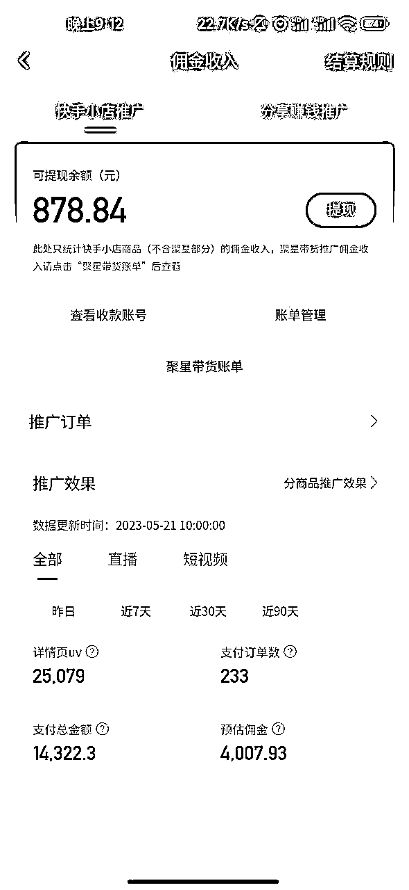
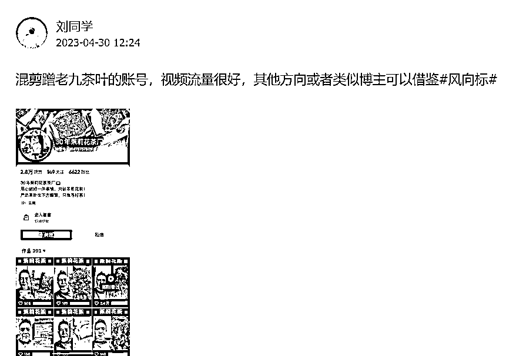
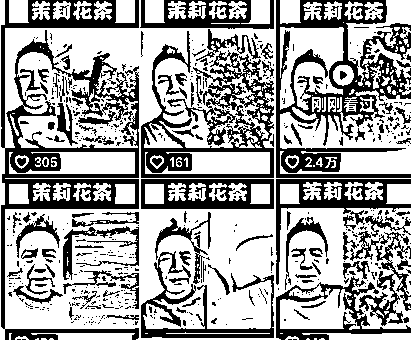
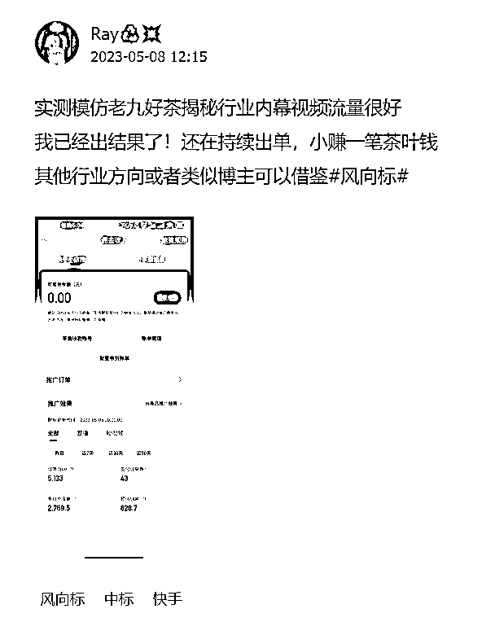
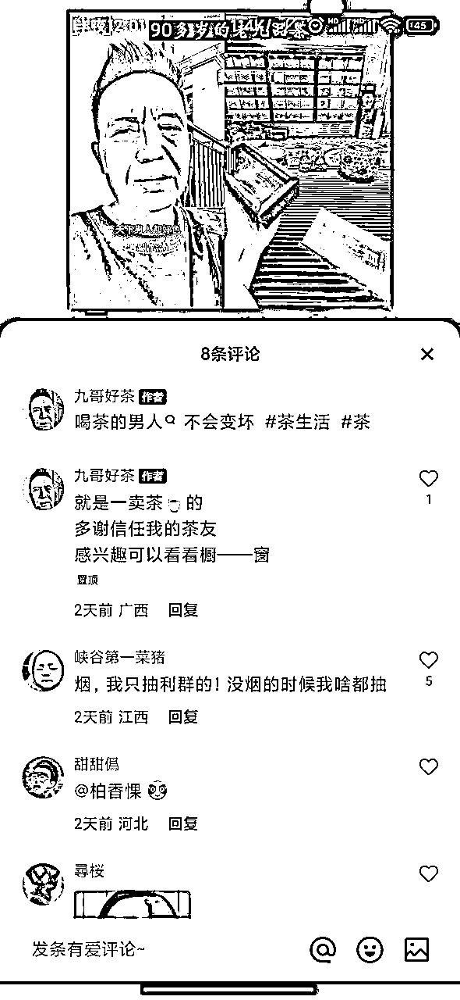
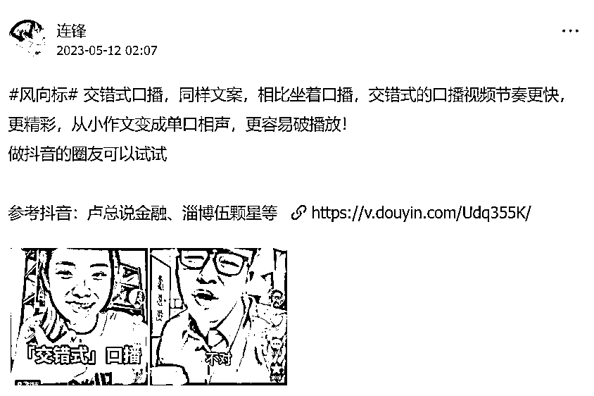
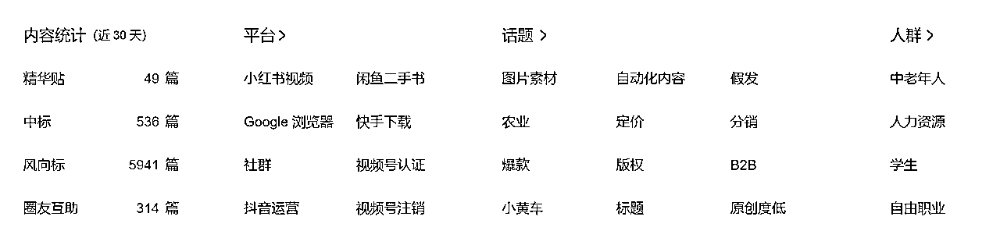
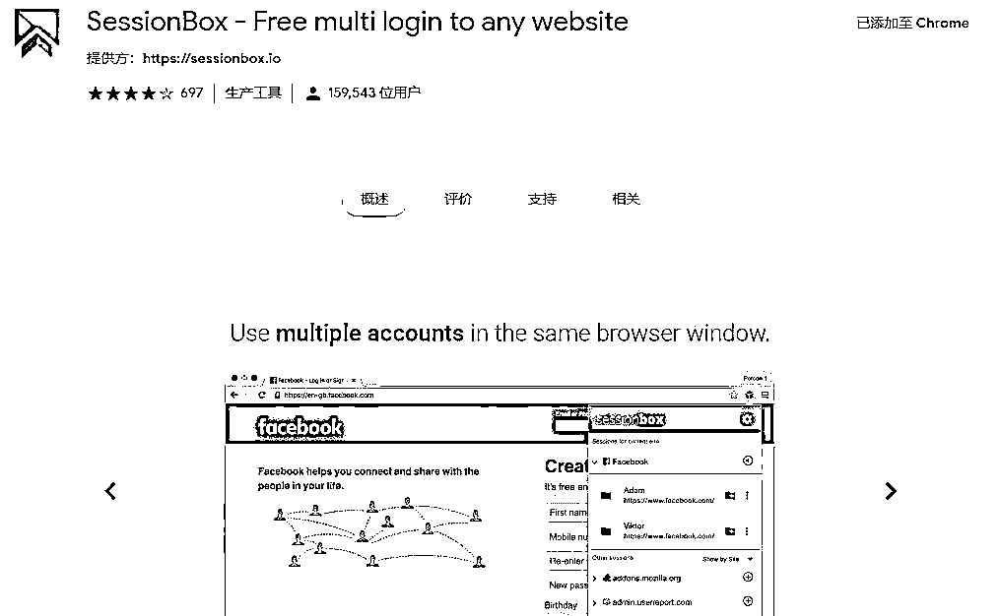

# 1条没中标的风向标，让我多赚了4位数

> 来源：[https://gq2psr73l6v.feishu.cn/docx/RPpmdimVwoz0VLxjMdlcVRKqnme](https://gq2psr73l6v.feishu.cn/docx/RPpmdimVwoz0VLxjMdlcVRKqnme)

# 一、引言

亦仁：江湖赚钱看生财有术，生财有术赚钱看风向标！

第七期中标风向标合集：https://qr19.cn/E2fmDr

大家好，我是Ray，第七期新人，之前成功通过白嫖生财在4.3号前赚到第一张门票钱。更多细节，可移步先前文章 ：第七期还没开始，我已经通过白嫖生财赚到第一张门票了。

今天看到亦仁发帖说一位圈友，因为在生财看到了一条信息差，多赚了 8 位数，这条信息差还藏在一篇文章里面不起眼的小角落里面，发的人可能本身也没意识到。

恰好上两周我也是看到一个风向标，然后立刻模拟执行，实操几天多赚了4位数。

这种收入对于圈友来说就是九牛一毛，没什么好说的，但是本着举手就能被看见想法，分享一下我这个萌新也能跑通的风向标项目给大家，希望多多指教。

如果您是新加入生财但还没有项目，或者参与了许多但实际上没有真正获得收益的项目，我认为您完全可以开始行动并尝试。由于试错成本极低，所以不妨一试！

# 二、快速落地风向标

## 发现可执行风向标

五一放假期间刷到这条混剪蹭老九茶叶的账号，视频流量很好，下面评论还说橱窗已经卖了一百多单茉莉花茶。

## 梳理是否适合自己

当时第一时间看到这个风向标就感觉到这个风向标的操作玩法非常适合我这种刚刚入门的小白，而且模式容易复制且可以执行。

*   我有注册多个视频账号

*   我有视频混剪基础

*   我有视频带货经验

（再一次验证每一步都没有白走）

## 快速执行落地

### 账号准备

一般建议是用新号，平台打标识别比较快。我目前手上账号不多，只有五六个，所以还是用了以前发过视频的老账号，也没有进行过养号操作。

视频带货不需要配置很好的手机，几百块或者以前的旧手机就可以，不建议用虚拟卡，容易封号。而且一张卡月租也就十块钱以下，成本非常低。

### 剪辑去重

直接混剪原创老九的视频，关于剪辑去重生财里面已经积累了非常多的教程，我这里就不赘述了。我是一比一复制对标账号的剪辑手法，基本过重没问题。

### 一鱼多吃

确定好以后直接开干，其实自己也不确定能不能火，我能做的其实就是不停的去测。视频做好了以后分发到视频号，抖音，快手平台，结果前两个都反响平平，快手第二天早上起床发现已经爆了，一直不停的有点赞和评论。

### 开橱窗

当时已经是5月3号，我在老家返程广州的火车上果断改昵称，删以前老号作品，实名认证，开橱窗，上产品一气呵成。

快手带货我先前没有接触过，但是触类旁通，跟视频号大差不错。而且快手门槛更低，不需要交保证金即可开店带货，更骚的是还可以在视频爆了以后再挂商品链接，避免一开始流量池过小。

### 评论引导

视频爆了一定要去回复，评论引导下单。实测下来引导橱窗购买和纯粹发视频不引导下单差距还是蛮大的。

### 多发视频

这时候其实趁着热度得赶紧再发视频。但是我们那边绿皮火车去广州要5个小时，而且还得坐一小时地铁回租房那里。也管不了那么多了，晚上回来顾不上疲惫，又继续剪了几个视频，凭借着爆款视频的热度，又爆了几个。

这里有个小tips: 一定要趁着视频爆了，多发几个混剪视频，因为大概率这个混剪号后面流量会越来越少。最后当天成交了十几单，纯挂橱窗，无直播，无引导的状态下。

## 中标反哺圈友

后面账号每天都有几十单的成交，我也把这个操作分享到了风向标。比较戏剧性的是先发这条消息的没中，我这条反而中标了。这两天也发现混剪老九的越来越多，其中还有模仿我文案的。（有可能是执行力强的圈友hhh）

为什么这么肯定是模仿我的呢？因为当时看了一圈混剪的视频，都是没有橱窗引导的，所以我自己创了一个引导橱窗文案，还加了表情包，每条视频置顶。

然后我发现有几个账号也是根据我的文案简单修改去引导橱窗购买，并且有的出单量比我还猛。（再一次验证简单可执行且容易复制）

## 可持续性评估

这就是一个赚快钱的项目，谈不上积累，容易侵权且不道德，混剪本身就是一个很low的项目，但是大家也不要看不上瞧不起这种小项目，我知道你很急，但是你先别急。

小白先建立信心，先攒一点资源，先把自己的能力垒起来，慢慢地我们才去做越来越好的一个项目。

就像一个群友说的：蛇有蛇道，猫有猫道，狗有狗道，每个人都有自己的路要走，每个人的角色也不是一成不变的，路也不会是一成不变的。有些人知道自己的大道在哪里，但是前期就只能靠走小路去积累自己的第一桶金，也无可厚非。

写到一半刚好看到亦仁回答关于搬运这个项目的问题，顺便贴上来。

亦仁：

1\. 第一阶段先加油赚到钱，把钱赚到手，这是你下一次尝试的本钱；

2\. 通过第一阶段的实践，提升认知，总结经验，多付费出去学习和交流；

3.一个人积累了多个第一阶段之后，才有可能直接跨入第二阶段，否则第二阶段所需要的各种能力、资源、认知也不足，还是会跌下来。

所以我的建议是，还处在第一阶段的人，做好第一阶段的事，赚好第一阶段的钱，当认知提升时，你会自动觉得看不上第一阶段的钱，转而等待第二阶段的到来。

## 风向标思维迁移

继续深挖这个风向标，如果不能接受混剪，完全也可以模仿他的风格文案，揭秘不同行业内幕。老九之所以火一个是因为诙谐搞笑的反差文案风格，另一个是剪辑技巧，这个可能比较少人注意。

如果你细心一点去拆解他的视频，会发现他基本说一句话就换一个场景，这种剪辑手法有人给你总结了，叫交错式口播，同样文案，相比坐着口播，交错式的口播视频节奏更快，更精彩，从小作文变成单口相声，更容易破播放！

参考抖音：卢总说金融、淄博伍颗星等 https://v.douyin.com/Udq355K/。所以你模仿他不火一个是文案不行，另一个就是剪辑的手法。

不知道你有没有发现，上面的内容其实已经被优秀的圈友发到风向标上去了，这也是我后面想阐述的。风向标之间都是有关联性的。把这些可以迁移的操作同步起来，就会得到新的项目灵感。

# 三、如何梳理拆解风向标

在生财风向标中，充满着来自各行各业的项目机遇。如果您正在寻找新的项目机会，可以从每天刷风向标开始。

沐文哥说当一个新产品或服务出现并且有很高的流量时，通常也会存在新的财富机会。由于资金是在不断流动的，因此关注新的趋势和风向标非常重要。

## 风向标主要分为四类：

### 商业认知类

### 工具类

### 实战类

### 流量思维类

*   商业认知类

商业认知类风向标主要是以商业认知为核心，包括商业模式、商业战略、商业发展等方面的知识。这些风向标能够更好地了解商业世界，提高商业认知和洞察力，以便更好地规划和执行商业模式，提升商业思维。

*   工具类

包括新平台，新工具，以及更高的提升工作效率的工具。能够帮助更好地掌握工工具类风向标主要是以实用工具和网站为主具和技巧，以便好的使用在自己的项目中去。

*   实战类

实战类风向标主要是以真实案例为主，包括抖音、快手、小红书等自媒体平台，以及线下实体玩法等的实际案例，操作方法等。能够帮助更好的理解真实实战的赚钱逻辑。

*   流量思维类

流量思维类风向标主要是以在各个平台获取流量为主的风向标，例如川、广点通投放等，以及在自媒体平台通过内容引流到私域和在私域进行流量转化的案例。

------- 米笠

新手建议多看实战类和流量思维类。做拆解实战类的风向标的时候，只拆解是什么，怎么做，怎么变现。不要做过多的引申，因为你的引申可能是错的。

## 如何快速筛选可变现风向标

### 每天看不少于50条风向标

不要觉得很多，每天碎片时间可以当做朋友圈来看，很快刷完了，我进生财前的习惯是看微博和知乎，现在替换为风向标，爽太多了。正常情况下，我每天都会把当天所有的风向标都看一遍，因为我真的不想错过任何一条。

### 找到适合自己的风向标

一开始我刷风向标的时候，感觉信息太多了，到处都是项目机会，让我不知道该尝试哪一个。但是，随着阅读和筛选的不断深入，我逐渐建立了自己的筛选机制，开始更关注自己兴趣领域的风向标。

如果您没有足够的时间，也可以只浏览自己感兴趣领域的风向标。后面当您明确了想要实现的项目方向时，可以进一步精简筛选。

### 项目可实操、可复制

在一个平台火过的内容，在其他平台大概率也会火。信息不复杂可操作的；信息已经有人验证过；利用这个信息赚到了钱的，遇到这种风向标直接无脑跟就行。

当一个信息变现的流程被验证并形成模板后，可以在不同的平台上复制该模式。

我个人比较喜欢实战型风向标。对于一些容易上手并且能够实际操作的风向标，我会动手尝试，看看它们是否适合自己。通过这种方式，在观察和操作的过程中，可以逐渐了解自己的项目偏好，知道哪些项目不适合自己，哪些需要更重点地关注。

### 遇到有启发的风向标做好收藏表格

我一般看到有亮点的风向标会收藏起来，然后有空的时候再看这些风向标，其实你就会发现，这些风向标之间都是有关联性的。把这些可以迁移的操作同步起来，就会得到新的项目灵感。

就像沐文哥说的玩法变的只是载体，不变的是原理。现在趋势从抖音到视频号小红书电商，变过么？其实很多时候大家要做的事情，大方向上都是一致的。

### 执行力拉满

何以生财，唯有实战。不要仅仅在想法上，要落到行动中去。生财里面有很多人分享他们丰富的经历，看多了以后你会发现其实都是差不多的。

比如你要做短视频，就把内容做好，大家都跟你讲，要做好定位，都跟你讲，要做好内容，都跟你讲，怎么去养号，怎么去选题。大方向有区别吗？没差！

区别是什么？区别是在于每个人在做这件事情的细节，他把这个事情细化到了一种程度。他在这个事情上坚持了多久，这个其实都已经可以有很大的差异化了。有的人可能坚持了一个月就放弃了，有的人可能坚持 3 个月，有的人坚持半年。这就已经区分出很大能力了。

# 四、目前风向标存在的问题

根据生财现有的板块分类。可以看出来中标、风向标、这两个栏目的位置非常靠前。说明生财产品经理包括亦仁对风向标是寄予厚望的。目前来看可能也是存在一些问题。

由于风向标特性，这种短平快的输出相较于长篇文章，非常容易撰写且带有一定的激励措施，导致大家对风向标都热情不减，每天产生大量的风向标出来，而且这中间还有禁言期。从最近30天来看已经有接近6000条，中标的仅仅只有10%。

而这些风向标的内容又没有经过分类。”刷风向标的时候，有时候会感到有点杂乱无章，当然你可以只看中标的，但是每个人思路想法不一样，没有中标的其实也可能具有很大的价值。

如果彻底放弃不看只看“中标”的话，又会害怕错失一些重要的内容。所以目前风向标的内容过于庞杂。

并且我观察到有大量的重复信息（这里不包括同一个信息解读不同玩法思路），比如视频号新政策一出来大家都想争先发，这个无可厚非，但是对于观看者来说就是清一色批量的刷屏，经常有看到评论区说不是已经发过了吗，这种体验是否还有更进一步的改善机会？

# 五、五月扬帆起航

*   何以生财，唯有实战：2023积极参加航海。是的，我进生财的一大目的就是奔着航海来的。

*   古人云：众行者远：一个人可以走很快，一群人可以走很远。拒绝一个人自己瞎摸索，今年积极主动寻找更多同频/同城的人/组织交流。

进生财前我给自己立下上面两个目标，一个是航海，一个是同城聚会，目前都在慢慢地参与和践行，广州同城已经参加了3次线下聚会，收获良多。

而五月的万人巨轮也下海开航了，希望这次可以躬身入局，挽起袖子，把手弄脏！

# 六、彩蛋小工具

最后，送大家一个实用的工具，做搬运混剪的一般都有多个号，平时登录起来非常不方便，需要一个个扫码或者验证。最近发现一个神器，支持任何网站的多账号登录。

所需插件：SessionBox。

首先在 Chrome 浏览器中安装 SessionBox 插件。有两种安装方法，一种是通过 Chrome 的官方应用商店直接下载安装，但是打开 Chrome 应用商店需要梯子才行。

另外一种就是利用压缩包，有需要的可以找我发给你。下载好后打开浏览器的「扩展程序」页面，点击右上角的三条杠的图标，再点击更多工具，点击扩展程序，然后将crx 文件拖进去就安装好了。

目前我用的还挺顺手，分享给大家，祝大家在此次航海中多多爆单哈哈！

* * *

以上，全文完……

我是Ray，base广州，希望能在这个大神云起的时代，和你见证一个人平凡人的努力……欢迎链接交流：cj1357901