# 如何生成自己的儿童绘画故事

> 来源：[https://ycgc2f717o.feishu.cn/docx/SIDRd6VqIorKSTxzMnxckTWWnyf](https://ycgc2f717o.feishu.cn/docx/SIDRd6VqIorKSTxzMnxckTWWnyf)

不需要你有绘画功底，也不需要你很会讲故事。只需要一行prompt就可以生成一个儿童绘画故事。

想不想试试，跟我一起来

例子：The Lost Boy and the Rainbow Pig

### 第一步：打开ChatGPT，点进插件市场，搜索“Stories”

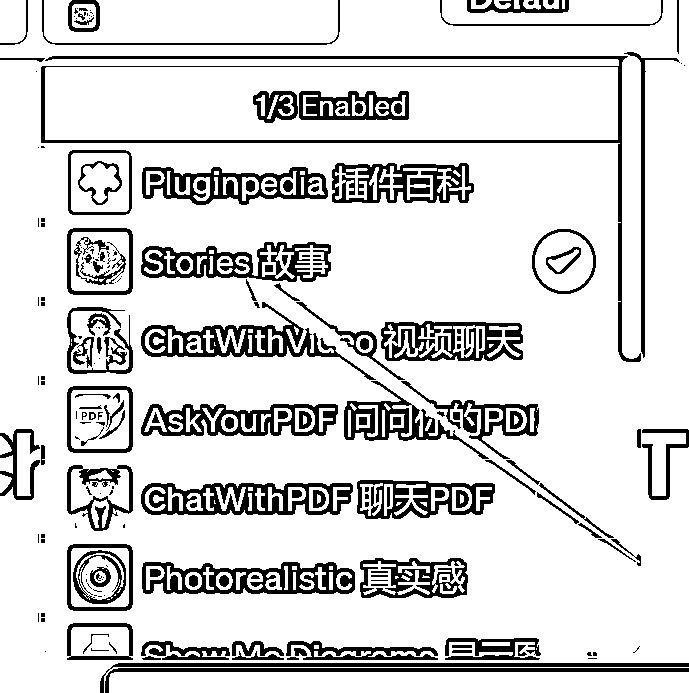

### 第二步：选择插件后，输入：迷失的男孩和彩虹猪

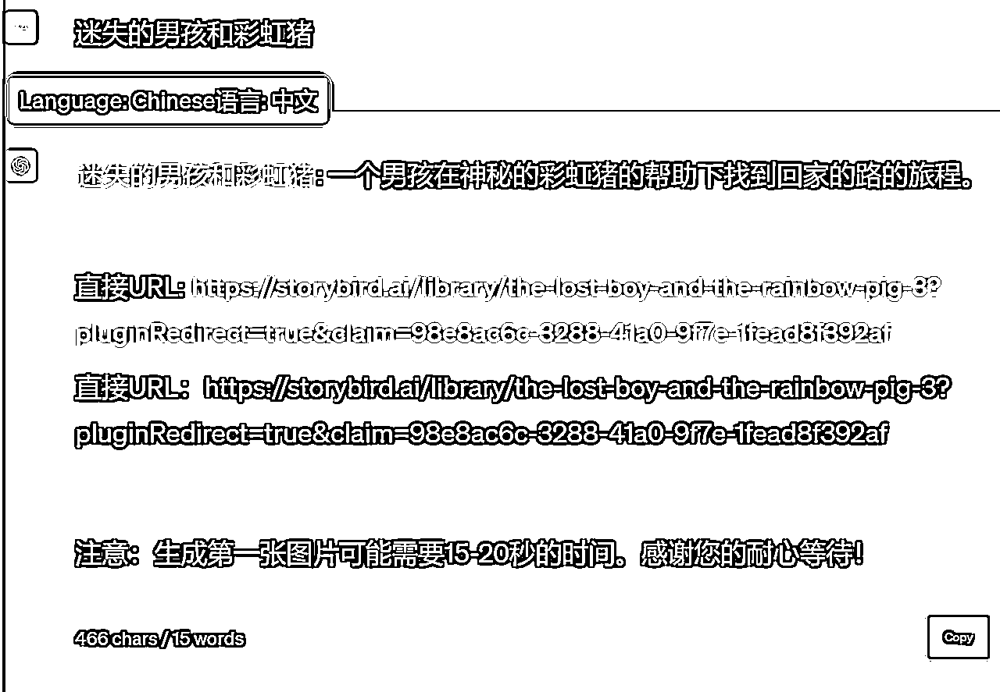

### 第三步：点击链接，进入绘本页面。正在生成....

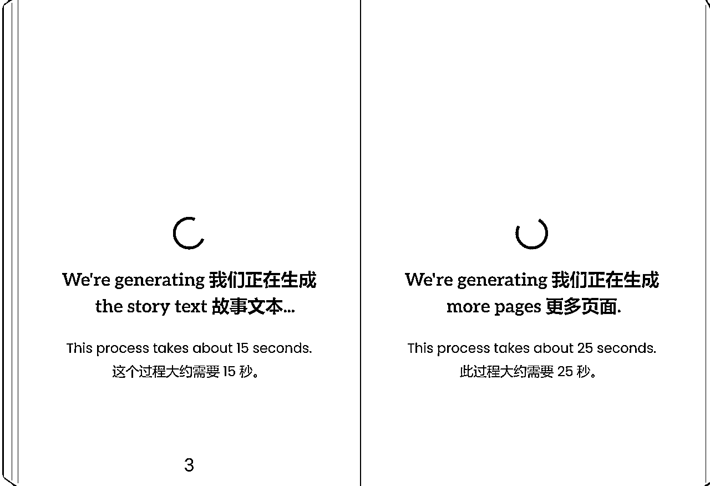

等待一会，故事出来了

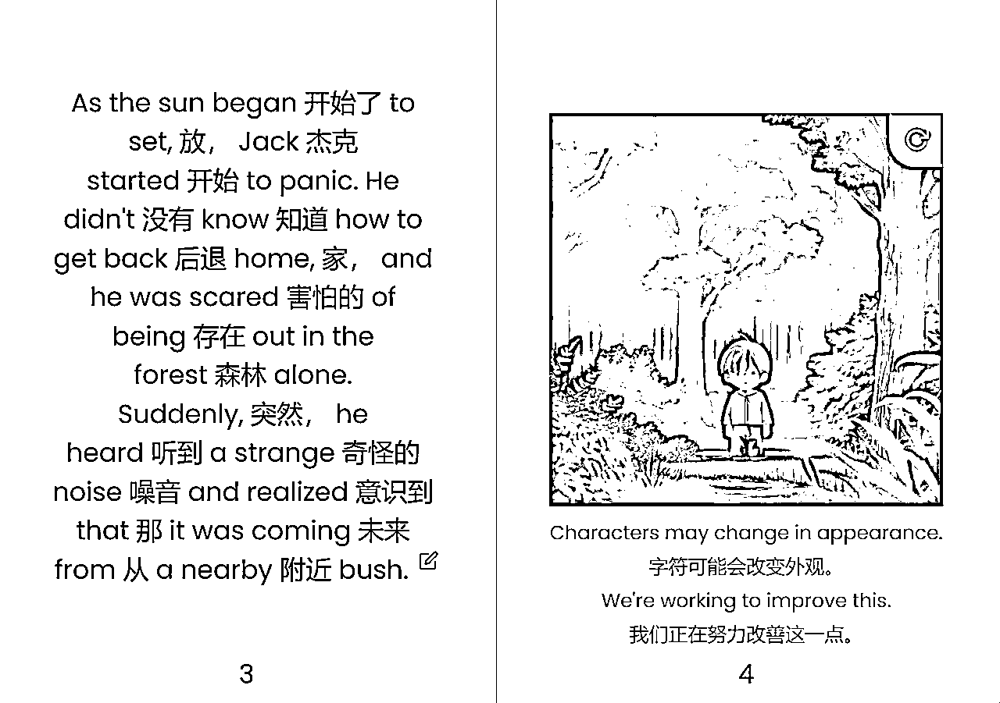

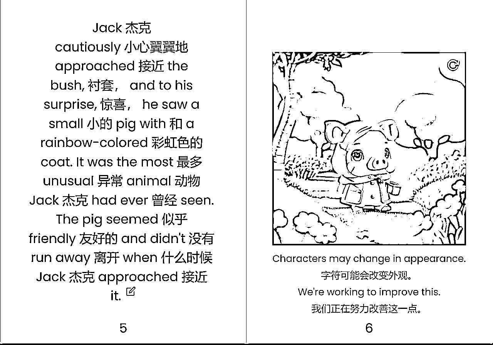

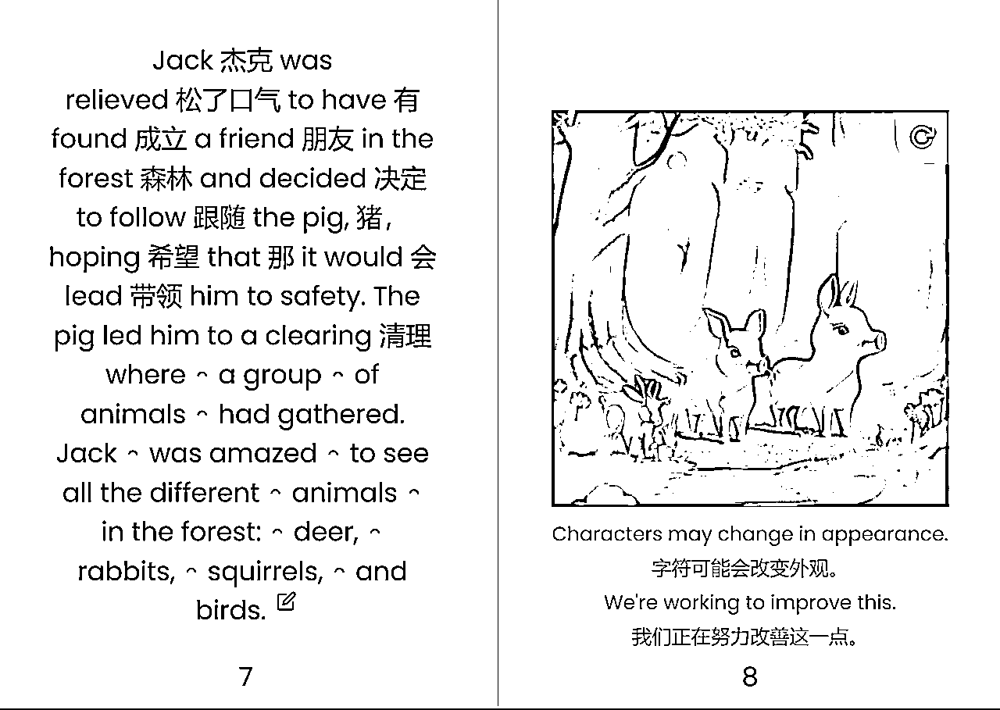

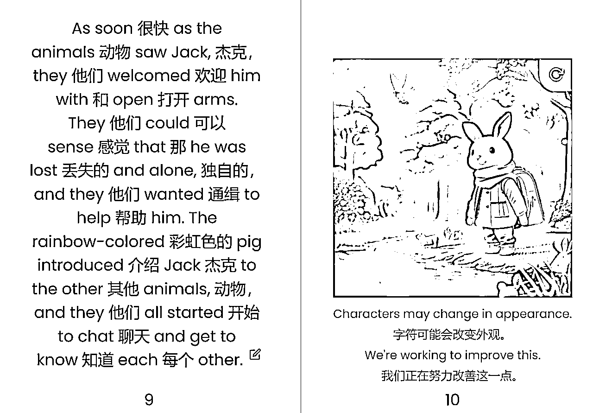

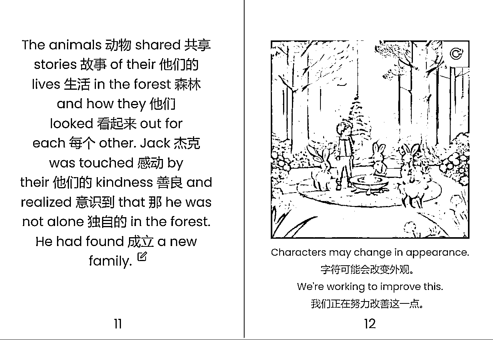

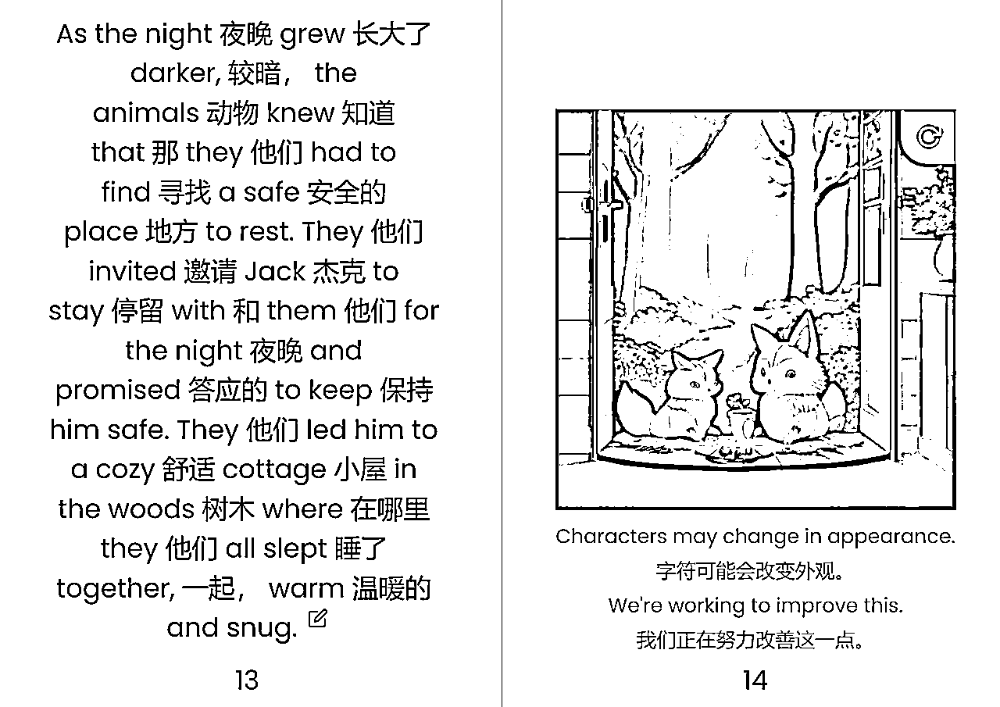

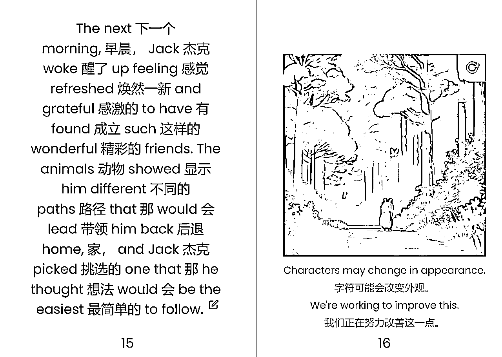

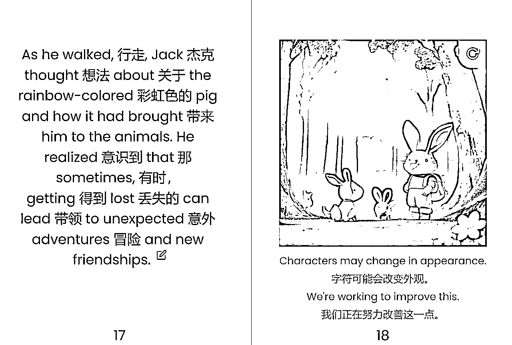

有2个注意点：

1.暂时只有英文显示，可以用翻译软件。

2.可以要求几页的绘本。

### 总结：创作的故事后，可以定制精装本（仅限美国），发布到亚马逊赚钱。在国内做母婴、图书这块的可以用作引流。

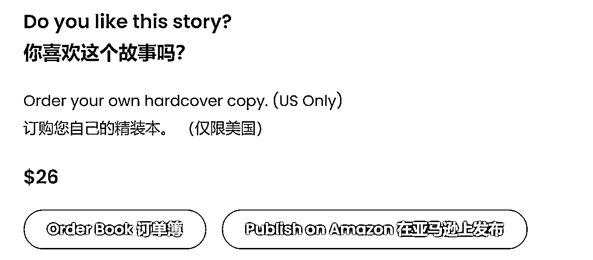

一个完整的操作就完成了，谢谢阅读😁