# 618暴利风口项目：得物球鞋搬砖实战月入4w+

> 来源：[https://i11zdua80f.feishu.cn/docx/SKTxdQaFTopK60xxvHwcYQWynYd](https://i11zdua80f.feishu.cn/docx/SKTxdQaFTopK60xxvHwcYQWynYd)

简单来说球鞋搬砖就是从一些电商平台例如京东淘宝唯品会等电商平台搞活动时通过活动低价买入球鞋，然后在二级市场得物APP或者nice咸鱼等平台卖出，赚取中间的差价。

废话不多说直接上我的得物收益图，我上个月的销售额是55w，毛利率在10%左右，到手利润预估4-5w，总体还是非常可观的

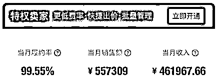

尤其是马上618也即将来临，各个品牌的促销满减活动也都上架了，现在正是商品成本价和二级市场平台售卖价格差价最大、利润最高的时候！赶上风口吃一波红利

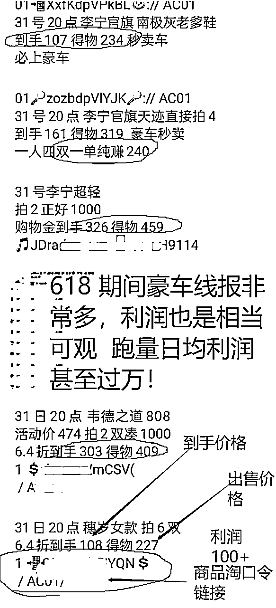

## 超完整视频教程，建议搭配文字教程一起观看

观看完视频教程能保证您对这个项目有一个十分细致的了解

https://www.bilibili.com/video/BV1f24y1B7B1/?share_source=copy_web&vd_source=de9b1716843d9bf18d7bd94fc7cf13ef

# 什么是得物球鞋搬砖

## 问题一：首先了解得物APP这个交易平台是什么？

任何人都可以申请注册成为得物平台的个人卖家，可以将自己从其他电商平台例如京东天猫唯品会等购买到的球鞋服饰上架到得物上，我们卖家自由定价。买家拍下后你只需要将球鞋寄送给到得物仓库鉴定通过就会帮你发货给买家。可以理解为一个供我们个人卖家交易的平台！

## 问题二：买到球鞋后如何在得物上出售，得物出售的两种方式：现货出售跟寄存出售

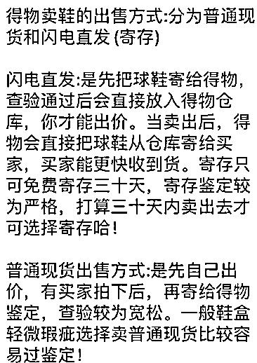

## 问题三：购买到的球鞋会不会存在卖不出去的问题？或者会不会买到假货？鞋子会不会砸价导致利润下降？

群里推荐的球鞋，差价都是高于100以上的，销量也是非常大的，只要球鞋没有瑕疵，价格合适基本都是很容易就卖出去了。而且都是正规大代理或者官方品牌旗舰店的，比如耐克阿迪李宁等官方品牌旗舰店不存在有假货的情况。并且有电商平台假一赔三担保，所以肯定不用担心！

砸价的意思：大促销活动过后打折的款，可能会一定程度得降价(砸价)。因为搬砖的不止是我们，会有人想早点急着卖出球鞋周转资金，一段时间的供过于求必然导致价格下降。砸价的时候，只要稳住不慌，等砸价的慈善家先出掉手上的球鞋，当市场上砸价的球鞋出售消耗得差不多的时候价格自然就会涨回来。(销量高的鞋子大概2，3个星期价格就完全恢复了，可参考得物历史价格)。

# 得物卖家如何注册、出售商品

## 一、登入得物app，注册成为个人卖家

### 【注意·重点】注册成为个人卖家时，一定不能勾选 支持七天无理由退货 和 支持开具发票 这两项。

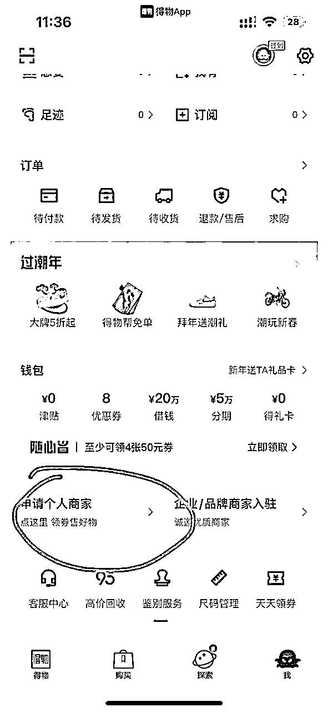

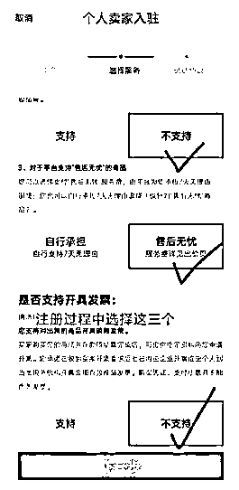

然后就注册完成了

## 二、出售

### 第一步，商品搜索比价，输入货号或名字

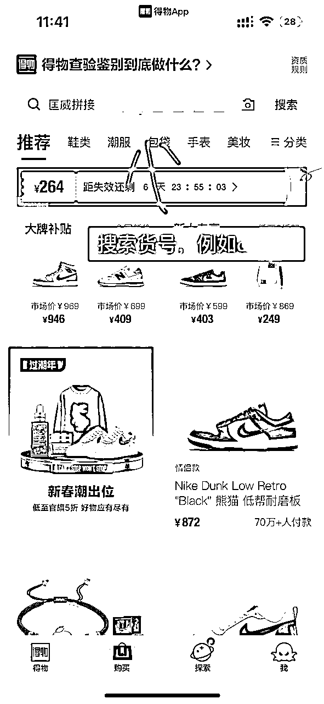

### 第二步，进入商品详情页，进行比价和出售

点击出售按钮后，出现下图

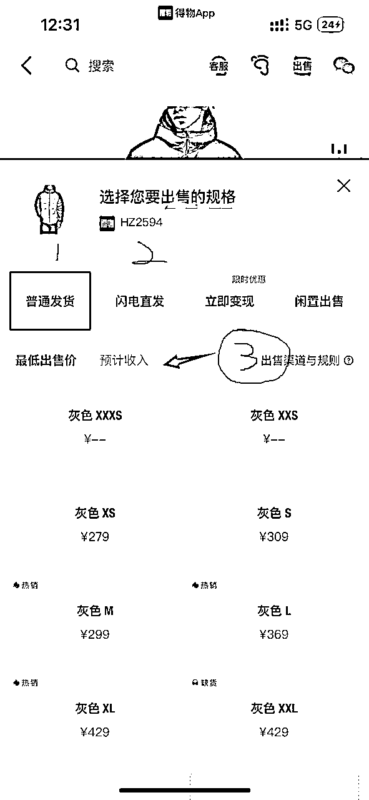

图里的①为现货出售

【注释】 现货出售就是直接上架物品出售，自己定价，排队出售，也就是谁出的价格低谁就先出，如遇与他人出售价格相同，则看谁先上架，只要有卖家拍下半小时后即可寄出（寄出时间不得超过1.5天，否则扣保证金），比价的话只需点击码数(如37码)，输入金额即可，平台扣掉各种手续费后，即是你的收入。

图里的②为寄存出售（及闪电直发，以下统称寄存）

【注释】寄存既是把货发到得物仓库，放在得物仓库出售

寄存的手续费比现货更低(如果现货比价后有利润，那么寄存利润就更大)。如有商品需要寄存时，先点击图里②的框框进入详情页面，看看有没有鞋子或衣服的码数，如有寄存位，选择码数后付定金即可，第一次的话请看看寄存协议。

寄存鉴定通过后，也属于排队出售，与现货同理；另外，寄存寄出超时（也是1.5天）不会扣除保证金。提醒：能寄存的物品尽量寄存。

图里的3可以预测一下自己的收入

得物只接收京东、顺丰的快递，切勿使用其它快递

如遇到寄存没有你想要的码数，就说明寄存位已满，可等待或出现货，另外，何时放寄存位，得看商品的销量，销量高 补的就快。

### 京东商品无货如何加入购物车刷库存

进入无货商品页面后

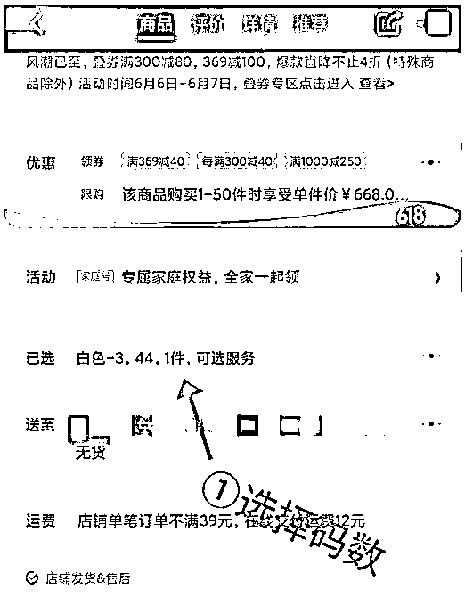

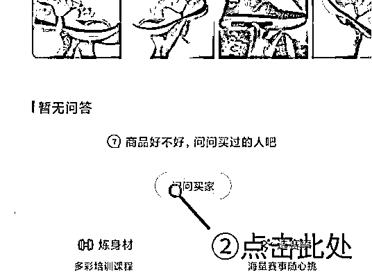

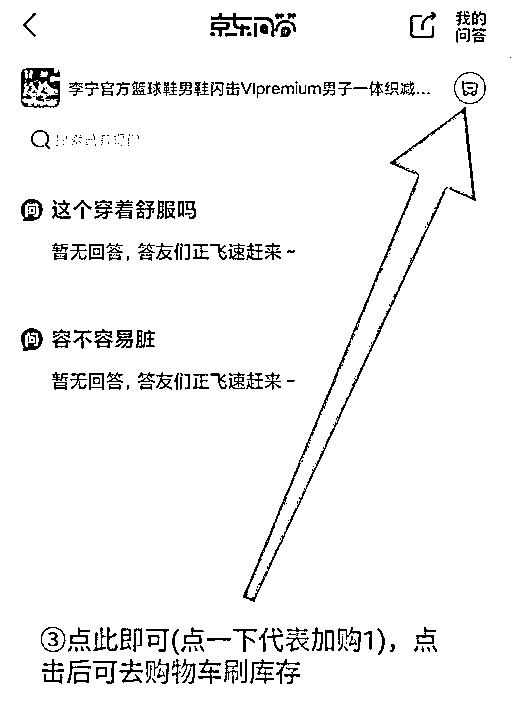

### 活动攻略中的名词解答

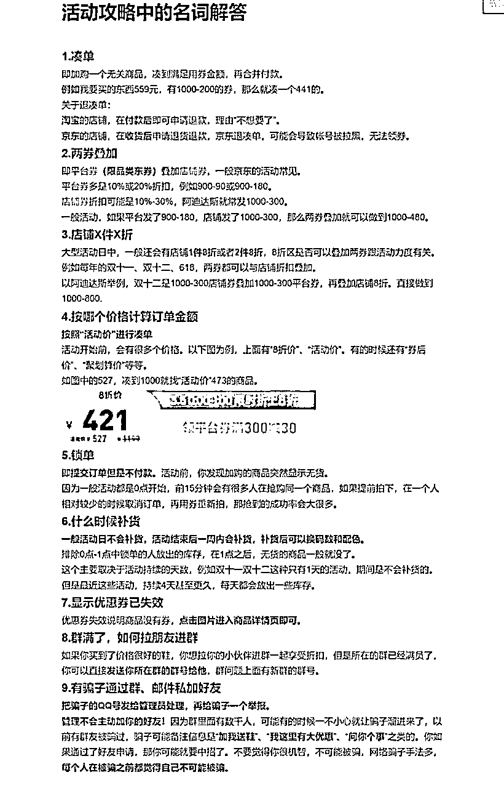

# 从购买到卖出

## 群里都会发方案，例如阿迪达斯的车

第一步先领卷

第二步加购物车

第三步需要凑单就加购凑单款

第四步付款

第五步退掉凑单款

（京东的凑单款需要到收到货后申请售后退货）（淘宝的凑单，付完款就可以直接单独退凑单）京东跟淘宝退凑单的区别

关于抢不到鞋子：

很多鞋子并不是没货，只是被锁单 ，锁单的意思就是拍下不付款 ，很多好鞋发出来就提示没货，首先点一下到货通知，另外使用无货加购的办法把无货商品加到购物车，然后使劲刷新，能刷出来的

无货加购的办法看注册教程有详细解释

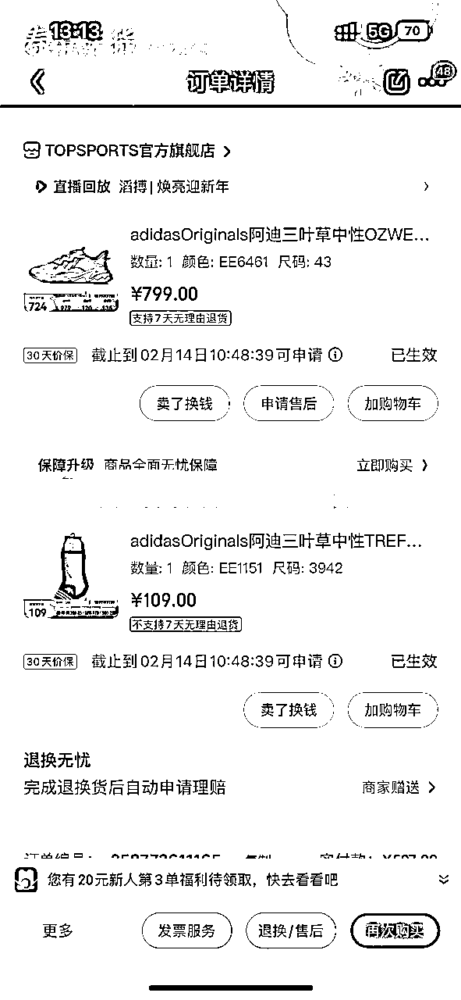

## 拍下商品以后如何看自己有没有利润能不能卖出鞋子，害怕卖不出去咋办

首先打开得物找到对应的商品： 点击出售价格，输入价格，预估收入就是我们的最终收入

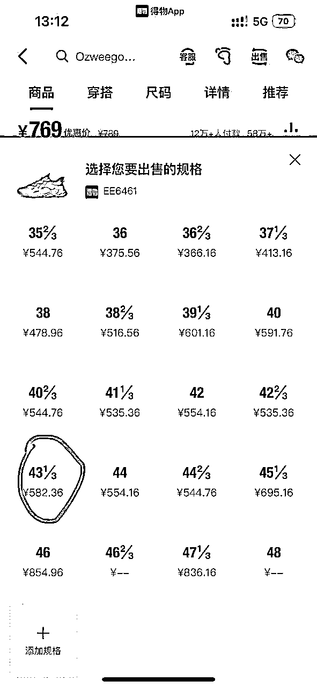

就例如这单，预估收入582，鞋子拍下价格500，利润是82，寄存利润大概在70，扣去快递费能赚60

害怕卖不出去鞋子咋办

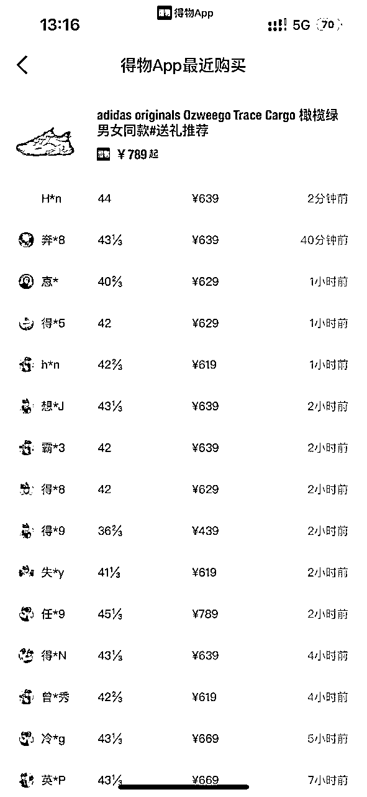

得物有个最近购买可以看该鞋子最近的销量，销量火爆根本不愁卖不出去，销量好和销量中等只需要等待一两天，销量较差的需要拿的住的人才能玩，一般销量好不好，利润多少群里发出方案的时候会说

除非紧急车，很快就没得车，遇到这种车就几时拍下锁单，再来得物对比价格和销量

## 寄给毒以后害怕无法过毒，亏本，亏运费咋办？

首先，鞋子到手一定要仔细看，首先看鞋盒有无裂开，褶皱的没事，然后看鞋标对货号尺码，在看鞋子，鞋子先看鞋底有无污渍，如果有污渍可以用牙膏加不掉色的湿毛巾擦掉，在看两个鞋边，后脚筋处，对比一下有无氧化（就是两个鞋边以及鞋内侧后根，是不是存在两种颜色，存在一双偏黄的现象），然后看看鞋带以及鞋整体有无污渍，大块胶粒，勾线现象。

在这里说下，如果你的鞋盒破损了，你可以选择出现货,不要发寄存，现货检查比较松，昨天我有一双烂的完全不像一个盒，像一块纸板，拿502黏-起大胆发出去还是通过了

鞋子脏的记得擦-下，检查好了再卖毒，货号要对准，别卖错了，卖错会被扣保证金,鞋盒成色较好的可以选择申请闪电直发，可以多赚点钱,有小瑕疵的推荐卖现货，鞋盒开裂可以用胶水粘一下，鞋盒烂的不能看了修不了了再申请售后,能换货尽量换货。

## 如果检查没问题了，还是被退了导致亏掉了运费咋办？

首先不要慌，也不要觉得麻烦，单双鞋子利润高，搬砖一次够几双鞋子退回的运费

说一下我的个人经验，搬砖以来，搬了几乎上万双鞋子，也就3%左右的退回率，，所以大家真的不用慌，没有大家想的那样风险高！也没有那么麻烦！就是点点手机，寄快递收快递，不麻烦！

## 利润跌没了咋办，活动的时候明明看有一百多利润，结果鞋子到手了，得物价格变了，没多少利润了：

有些兄弟看着价格降了点就在担心了 ，活动过后砸价是肯定的 ，只要你多拿几天，赚的就就多，活动临之际提醒下，到时候买到的鞋子,都会短暂砸价，砸价之后销量会爆高，待货量少了，后-段时间价格稳步上涨，到了你心里价位在卖，这就是市场规律

## 此外如果鞋子有瑕疵，但是好不容易活动，利润200+的鞋子不想退货，换货又没货了怎么办？

普货搬砖瑕疵换鞋方法:

大家搬砖也许会到一些瑕疵，我来教你们怎么轻松解决。

收到的鞋子如果发现有瑕疵，就再买一双同款同尺码，然后申请退货，把瑕疵鞋退给商家，好鞋留下来。

例:闪击6原价688元，搞活动的时候你488元买到了，但是收到却发现是双有瑕疵的。这时候你就再买一双同款同尺码的闪击6，然后申请退款退货。把有瑕疵也就是之前买的那双退回去，把后来买的完好的那双留下来，退款退货。相当于价格还是488元买到的，只是换了双鞋。

# 市场行情解析教学

一般两种鞋子是极为安全的（利润比较稳定的）

## 第一种：有销量 差价大

以闪击6为例子吧 ，每天几百双的销量，平常价格是650-750，一个活动把tb jd到手价格拉到400多，自然而然

有人为了快速卖出于是下调价格，你十块，我十块，最后拉倒得物500多，但是销量好的消化一般都很快，假如有1w双，每天几百双得销量，扣去自穿的，假如能有百分之50的货源到倒卖市场上，也不过十来天就消化完了，但是一双鞋热卖不可能只持续十天，所以平常活动，一个星期半个月，就回涨了，双十一力度大的原因，可能会久一点（当然你到手成本也更低，且货量较多）

简单来讲就是活动价的鞋子被市场消化了

但是市场需求不变，还是🈶很多人要买

而且鞋子是消耗品，并不代表着这些人不会回购

于是乎没有人这么便宜卖出了

自然涨回去了

## 第二种：差价大销量差的

这其实就是品牌效应和性价比的问题 ，比如之前开车的踢不烂，得物1100+的时候无人问津，总销量就10+，活动价690到手，得物砸到799，销量立刻每天几十双了，然后陆续回涨到900左右，鞋的牌子可能大部分小白不懂

这么说吧，4000块钱的小米手机让你买你可能会犹豫，但是如果是1999，你可能就会天天抢，然后还抢不到，最后可能部分人加价买了

很简单的道理，通过价格换取热度，平时1000的aj，突然500，谁不想了解呢？因为砸价导致销量起飞，有人到手了，那自然而然，关于这鞋子的评价，晒图就多了，人是有从众心理的，并且看到好看的照片，是带有主观臆断的，于是乎当市场消化完以后，没有人愿意砸价了，价格便开始回涨了，哪怕无法涨回被砸之前的价位，但活动低价入手的我们怎么样也亏不了，毕竟非活动的时间一定比活动时间长

这两个案例基本适用于绝大部分的鞋子

只要有大活动，基本都是送钱车

每年都有新入门的小白朋友怕，

但我告诉你过来人的经验:

入门的时候都这样想，砸下去怎么可能又涨回来

但是球鞋文化嘛，踩在aj上亲你，市场就这么受欢迎

赚到钱有经验的老手，都想着怎么上更多的车

以上就是得物球鞋搬砖的整体思路，祝各位老板在这个618能赚到属于自己的第一桶金

下面是一些日常撸鞋搬砖的小技巧，我按顺序整理成了单独的文档方便大家查阅