# ChatGPT 投喂指南

> 来源：[https://k0z8o16zas8.feishu.cn/docx/SUTKd7wdDoAg2Exv7hoc8m0BnOK](https://k0z8o16zas8.feishu.cn/docx/SUTKd7wdDoAg2Exv7hoc8m0BnOK)

关于作者：

昵称：黄小刀

内容发布平台：生财有术 知识星球

作者介绍：

《人人都能玩赚ChatGPT》作者 （京东有售）

生财有术ChatGPT自媒体航海 教练

### 我想要让 ChatGPT 做这些事：

*   给它一份 PDF，让它分析摘要、提炼内容；

*   让它去看某个网页，帮我查询最新的信息；

*   给它一份数据表格，让它分析出数据的变化；

*   给它一份文本，让它总结、模仿出相似的风格；

*   给它一个聊天记录，让它把你的好友进行分类和打标签；

*   给它一本书，让它快速读完，并且告诉我书里都讲了什么；

*   给它亦仁的公众号，让它告诉我亦仁对于某个问题是什么看法....

是不是觉得，哇，原来 ChatGPT 还能做这些？

为什么自己在使用 ChatGPT 时没发现这些功能？

这些动作，都离不开一个动作：投喂。

相信你在 ChatGPT 的使用中，也遇到过相似的问题。

这阻碍了你很多自媒体创作进程，如何解决上面的问题呢？我们今天来谈谈投喂。

### 今天的分享将主要分为：

一、为什么要喂资料给它？

二、都能喂给它哪些格式的资料？

三、它吃掉资料后，是怎么进行工作的

四、投喂的方式和方法

五、如何输出想要的结果/提问和设定

## 一、为什么要为资料给它？

我们知道，ChatGPT 本身的公开数据库更新到 21 年 9 月，4.0 版本最近也支持了联网插件。

但是，我们想要使用 ChatGPT 分析的数据/文本往往存在两种状况：

1、这是私人数据，未被公开，ChatGPT 没有

2、这是联网公开内容，但是未被 ChatGPT 收录

也就是说，并非我们询问的问题资料都在 ChatGPT 的数据库中，因此我们需要教它。

家里来了一个机器人，还不会使用洗碗机。

你把洗碗机的使用手册投喂给他，它就能迅速掌握这些知识。

不但可以立刻帮你洗碗，还能针对洗碗机的原理、构造和你侃侃而谈。

为了让 ChatGPT 更能明白我们的指令，我们有必要进行知识投喂。

甚至我们畅想，未来我们每个人脖子上也有一个接口，可以接受这样的知识投喂。

数据传输后，我们迅速掌握了这些知识，再也不用死记硬背。

## 二、都能喂给它哪些格式的资料？

### 1、投喂这些资料都支持什么格式？

原则上：各种电子书或者文档都可以，pdf、excel、ppt、word...统统没问题。

也就是说：只要是文本，都 ok。

比如：图像、图片形式的内容，我们也可以通过 ocr 转换成文本，投喂进去。

比如：短视频的内容，你可以通过飞书妙记把视频转为文字，投喂进去。

比如：公众号、网页里的内容，只要是文本，也可以直接复制投喂进去。

### 2、投喂有没有限制？

文件的大小：

理论上文件大小没有限制。

难点不在大小，而在于如何对长文档进行处理，切分。

比如你喂了 1M 的文件，它很快可以处理完并协同你工作。

你喂了 30M 的文本，半天过后它仍然在分析文档……

ChatGPT 网页版对话的长度：

受限于 OpenAI 接口对 token 数量的限制，最常用、也最廉价的 ChatGPT 3.5 的 token 限制是 4096 tokens，可以简单粗暴的认为是 2000 字。

超过了会怎样？网页会直接提示红字超过token限制，需要把字数控制在2000字以内。

## 三、它吃掉资料后，是怎么进行工作的

注意：这个部分涉及原理，非开发人员请远离。

【普通用户可以出去溜达一会儿，到第四个章节你们再回来】

在 ChatGPT 界面中，我们可以尝试使用如下的方式进行数据的投喂

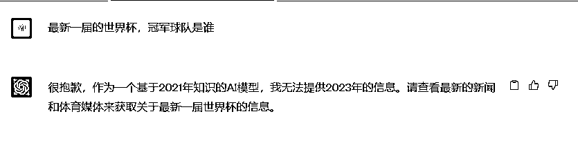

我们通过在对话中提供更多的信息，来实现最简单的数据投喂

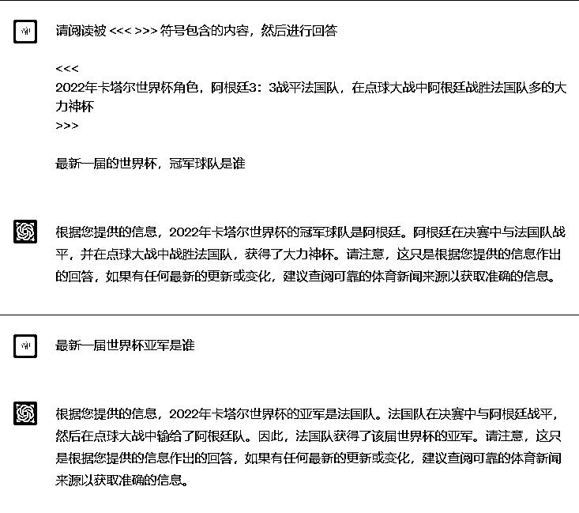

如果是更多的内容则很难、无法在对话框中进行投喂。此时我们需要别的方式来进行处理：

*   Fine Tuning 微调

*   Embedding

借用圈友白先生的比喻：

finetuning是捏了个小人，会自主回答。

embedding就是做了个说明书，只回答说明书里边有的，没有回答不了。

一个非常发散，一个则更加收敛。

### Fine Tuning

这种方式是在 OpenAI 训练的模型之上，使用自己的小数据集来进行微调。这种方式会让模型在特定的领域（取决于数据集）成为专家。但是训练的效果需要不断的去检验，而且检验的数据集也必须覆盖面很大。

例如使用这种方式训练出来的：

提问：我们家的到家月嫂和别人家的月嫂有什么不一样？

它回答：

```
到家月嫂是一个纯洁的工作
```

你会觉得？？？嗯？什么意思？它说这话是什么意思？怎么还能联想到那里！

这就是典型的发散型回答。

### Embedding

Embedding 是对文本进行向量化处理，从而对两端文本可以进行向量比较，获取两端文本的相似性。

通过这种方式，就可以把长文本切分成小块（Chunk），通过对用户问题的命中来选取相应的内容，然后交给 ChatGPT 进行后续处理。

如，汉堡的向量和三明治的向量相似性，就要大于和桌子的向量相似性。

如一段文本是，“我家快递用顺丰”，这句话就和“你家物流用什么”这个问题具有强相似性。

所以这种方式也往往用于在线客服的开发。

### 一般工具的处理方式（粗）

大量的工具如 ChatPDF，都是使用 embedding 的方式进行处理，处理的流程为

1.  用户输入长文本，工具对长文本按照策略切分成为文本块

1.  对每一个文本块进行向量计算（Embedding）并存储到向量数据

1.  用户提问进行向量计算

1.  从向量数据看寻找和用户提问相似度最高的内容

1.  整合命中的内容，连同用户的问题，调用 OpenAI Chat 接口进行处理

1.  返回用户回答

好了，枯燥的原理部分我们说完了。乡亲们可以回来了！

## 四、投喂的方式和方法

我们根据不同的文件格式，来谈谈投喂的具体方法。

首先，投喂区分为：网页端的投喂和 api 的投喂。

其中 ai.com 是我们最常使用的场景，而 api 涉及部署、开发，在本次航海不讨论 api 的投喂（上面那个环节已经谈的差不多了）。

### 1、较短的文本

如果你想告诉 ChatGPT 的教育信息较短，你直接在 new chat 就可以进行投喂。

例如，我们将一个小红书的文案发给它，让它学习这种风格，开始模仿，就就是最简单的投喂。

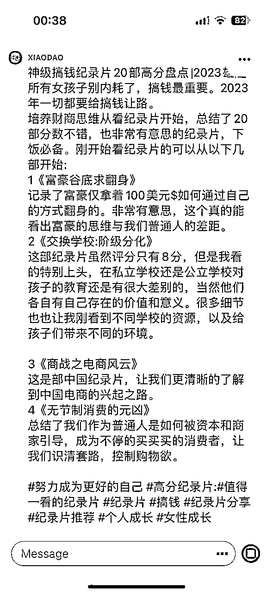

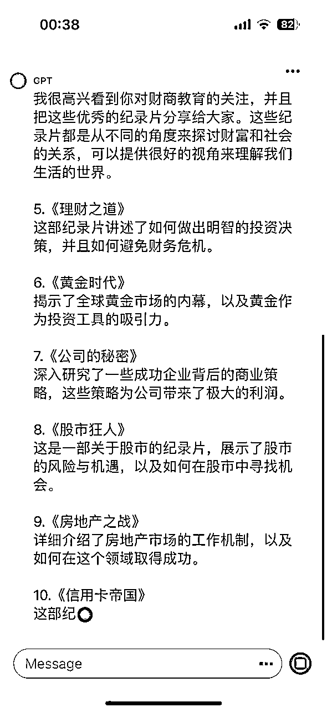

看，甚至我还没有发布任何指令，GPT4 已经基于我的风格乖乖写下文了。

### 2、网址

事实上，我们需要网址，并不是需要这个链接，而是需要 ChatGPT 来访问链接内的文本内容。

例如微信公众号的文章，就是典型的使用场景。

使用 ai.com ，有不同途径可以访问网址、爬取网页文本信息。

这里有 3 种办法：

#### A 使用 New Bing，最简单

因为 New Bing 使用的是 ChatGPT4.0，New Bing 作为一款搜索引擎自然支持联网。

那四舍五入你用 New Bing 就等于在用 ChatGPT...

【如何使用 New Bing，动动小手搜索即可快速解决。在此不赘述】

优点：快捷，免费

缺点：因为基于搜索引擎，所以它的答案指向很短，你没办法和它唠嗑。它还很傲娇，总是动不动就拒绝和你继续下去了。

#### B 基于谷歌浏览器的插件

好处：不用花钱，即装即用

缺点：如果 gpt 页面有变动，插件可能会失效

比如 WebChatGPT 这个基于 chrome 的插件，它将互联网浏览功能直接整合到 ChatGPT 中。

地址如下：https://chrome.google.com/webstore/detail/webChatGPT-ChatGPT-with-i/lpfemeioodjbpieminkklglpmhlngfcn

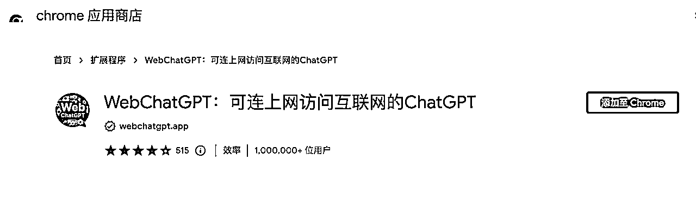

#### C 基于 open ai 的插件应用市场的联网插件

在航海手册中我们谈到了，ChatGPT 开放了 plugin，这个 plugin 指的是基于 open ai 的插件应用市场。

只要安装了相应的插件，就可以访问联网内容。

优点：plugin 要经过 openAI 审核，所以稳定性和好用度都不错。

缺点：需要你是尊贵的 plus 用户才能使用。

【如何开通 plus，手册里有详细的解释】

开通插件需要在设置中手动开启，如下图：

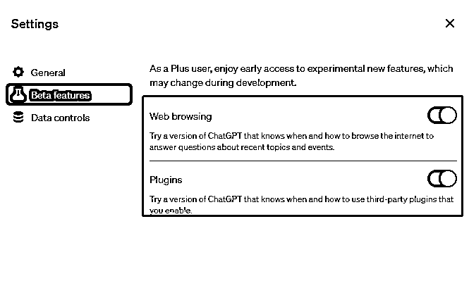

搜索应用“WebPilot”这款插件，就可以使 ChatGPT 能够访问网页。


看， ChatGPT 已经去 ESPN 抓数据了。

题外的（这段小白用户撤离，让开发者进来看）：

如果你不是使用 ai.com 网页端，而是调用 OpenAI 的 chat 接口，则需要自己去处理网址。

可以通过爬虫抓取网址的内容，然后自己分析其中的内容。可以使用 readability 等工具。然后把内容整合进 chat 接口的上下文即可。

如果是一个长文档，已经超过 chat 接口的 token 限制，那么就需要对长文本进行切割，选取和用户提问相关的内容组合到 chat 接口的上下文中。

### 3、PDF

PDF 格式的文件，也和网址一样，我们可以通过官方和野生的插件来实现访问。

这些工具可以帮助我们浏览 PDF 的内容，并实现互动提问。

如 plugin 中的 AskYourPDF、ChatWithPDF，就是可以帮你访问 pdf 的插件。


如果你还不是 plus 用户也没关系，你可以使用 ChatPDF 这款工具：

网址：https://www.chatpdf.com

当然，也有圈友自制的文档访问工具 Chatpan

https://chatpan.ai/


我就把亦仁的过往发言丢进去，然后随时随地问亦仁问题。

这个亦仁助手非常有耐心、而且秒回。

### 4、Excel

对于 Excel 表格的数据投喂也比较简单上手，直接用自然语言对 Excel 表格中的数据描述清晰，把想要实现的需求表达清楚就好。例如下面一张 Excel 表格：

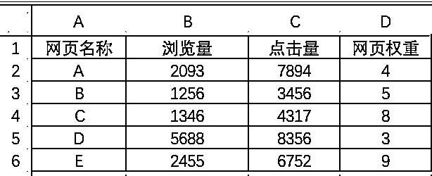

如果我们想要找出这些网页在不同指标中，表现较好的情况，我们直接对 ChatGPT 用这样的语句发问即可：

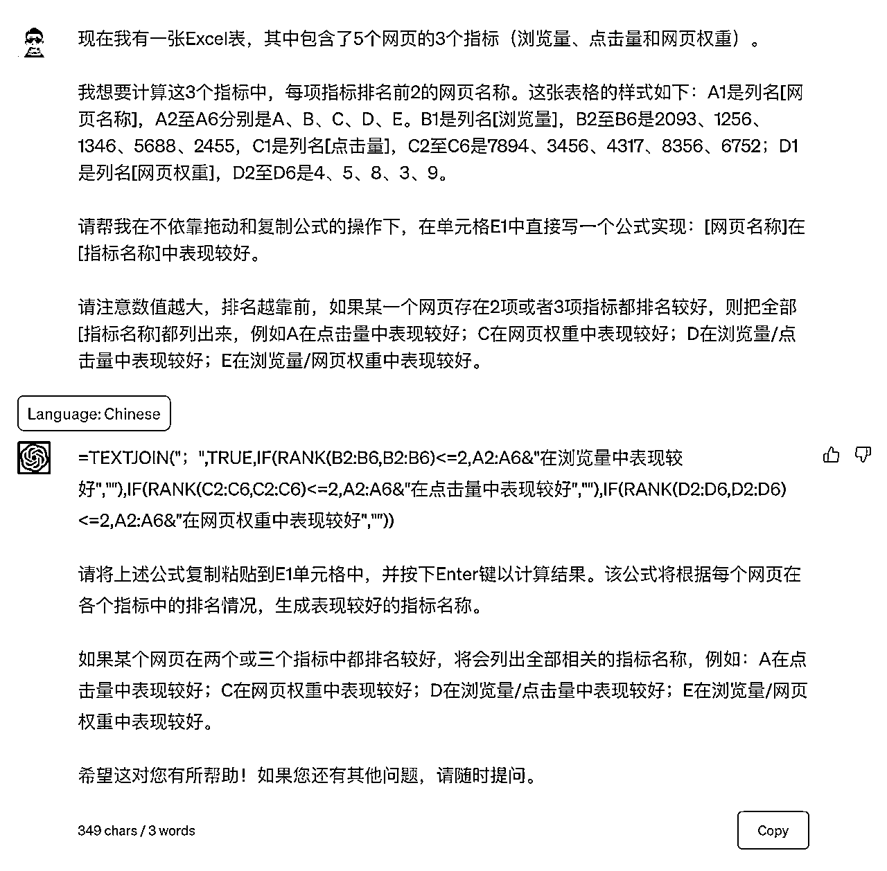

可以看出来 ChatGPT 可以理解我们的意思，根据它提供的公式，我们直接将公式复制，粘贴到 E1 单元格中，

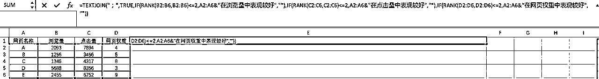

回车即可得到以下结果：

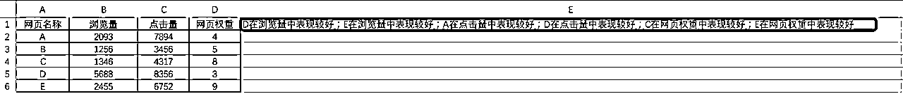

当然这张表格是虚构的，通过这样的描述举一反三，可以解决大部分的 Excel 难题，甚至不用进行拖动和复制单元格的操作。不过从结果中可以看出，结果呈现并非最完美的结果，鉴于我们谈的是数据投喂，剩下的调教优化大家可以接着完成。

### 5、图片、短视频等格式

ChatGPT4.0 发布会的时候宣布了支持多模态，即音频、图片、短视频格式的输入和输出。

但是目前为止还没放出来，静候佳音吧。

如果你的图片是文本类而非图形类，你可以使用其他工具识别图中文字、再复制给 GPT。

图形图片（如一只大猩猩和一个有色人种），gpt 是无法完成输入和识别的。

## 五、萌新如何输出想要的结果

### 1、提出一个好问题

相信我们都有一个共识，ChatGPT 最难的就是：如何提出一个好问题。

一个好问题就意味着一个高分的答案，人和人的能力区分也正是由于提问能力的差异。

在我看来，掌握如何提问分为两种：

A、知道在哪里找到好的提示词，为自己所用；

B、自己掌握了提问的底层逻辑，本身就可以问出一个好问题。

如何提问事实上就是我们通常说的“调教”，我在上次航海是有专门的分享，大家可以进行回看。

其他教练也会陆续在航海中分享自己的调教方法。

今天我们不谈底层逻辑，跟大家分享一些“抄作业”的提问模版。

AI 爆炸的时期，我们自己就算不动脑子，厉害的大神们也已经把饭喂到了我们嘴边。

例如，我需要分析一篇公众号到底讲了什么，我需要怎么做？

1、联网，让 GPT 可以访问这个地址

2、提出一个好问题，让 GPT 根据这个格式来为我分析。

以这篇文章为例：

https://mp.weixin.qq.com/s/guBFNFtwR9WdmYlFDKtJNg

对 ChatGPT 输入了提示词后得到的结果：

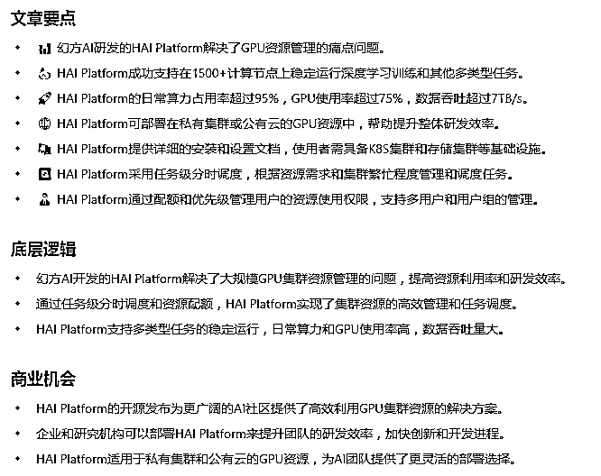

提示词是什么呢？

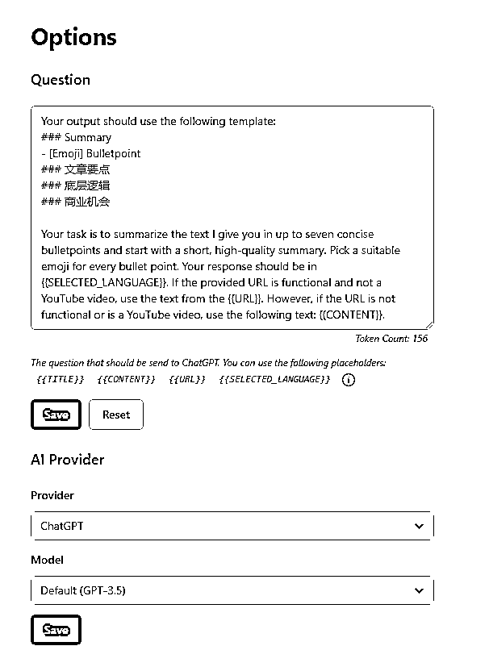

我们再来一套提示词，帮助我们分析问题

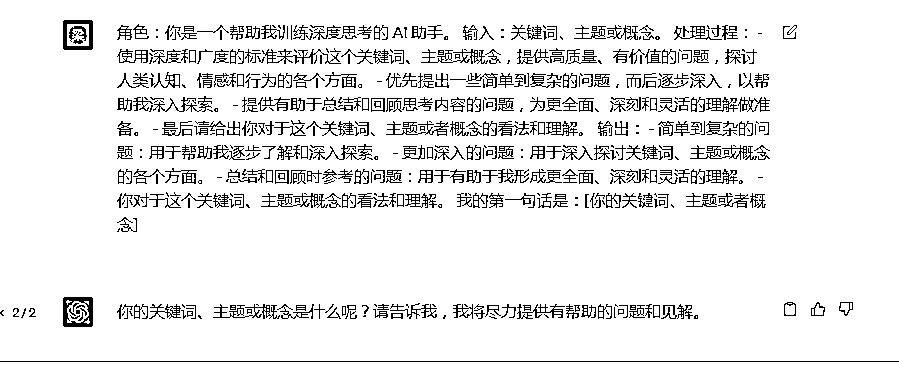

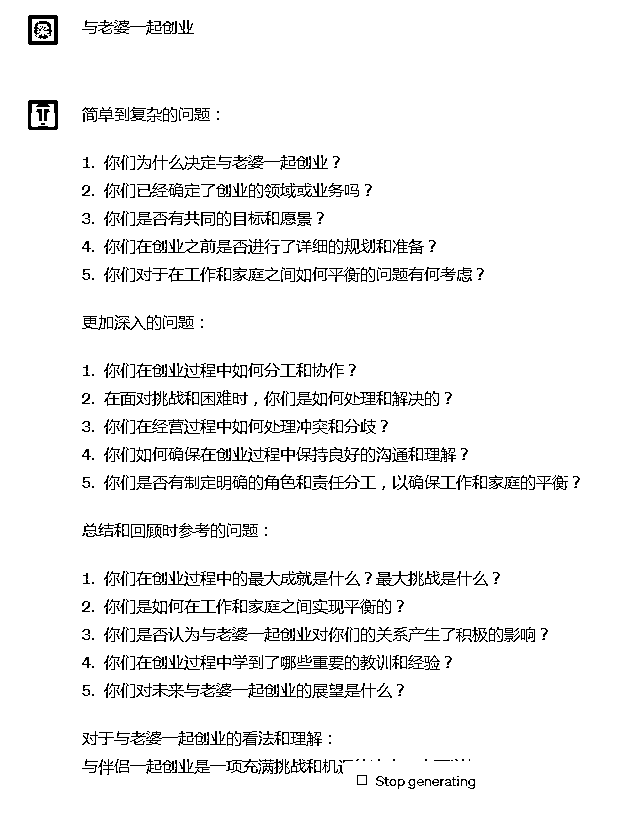

看，理智的人看完这通分析，不但不想和老婆创业、甚至还有点想离婚。

### 2、找个学霸抄作业

再说回我们自媒体创作，在我们没有熟练掌握“调教”技能之前，我们当然可以抄作业，例如这样：

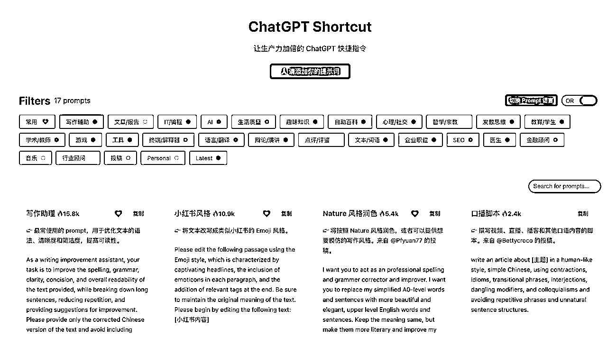

https://www.aishort.top/

这个网址，直接内置好了 200 多套提示词的模版，你根据需求直接复制粘贴。

很容易就能生成你自己的自媒体内容。

如果写一篇不够，你就命令 ChatGPT 再给你生成 10 篇重叠度不超过 5%的文章。

没啥，费点电而已嘛。

如果你仍有很多小问号，我建议你使用易仁永澄老师教的话术，多说“我需要”来解决问题。

比如：

我需要更多提示词模版

我需要更多调教专题分享

我需要针对某自媒体平台的变现拆解

.....

只要你需要，你就举手发布在群内。我们会汇总后，再安排那个领域的前行者为大家分享。

好啦，今天的投喂专题就分享到这里，如果你也喜欢教练，欢迎点赞投币关注。

你的一键三连是我最大的骄傲，笔芯。

## 六、文中提及资料

### 1、生财有术星主亦仁的电子书

### 2、生财有术星球介绍

在知识星球上万个社群中，生财有术的活跃度多次位列第1名，从2017年连续运营至第七期，累计有4.6万人加入。

市面上看到的各行各业的赚钱项目，基本都可以在生财有术找到成熟的流量、产品、变现方法论。

因为赚钱信息前沿、内容质量高，且官方会带请高手带队实战，众多圈友在其帮助下赚到了钱，所以续费率连年新高，最新一期提前续费率已接近70%。

有人说，生财有术是赚钱领域的黄埔军校。

✅内容质量高

✅实战项目多

✅成员之间交流氛围好

✅价值观正

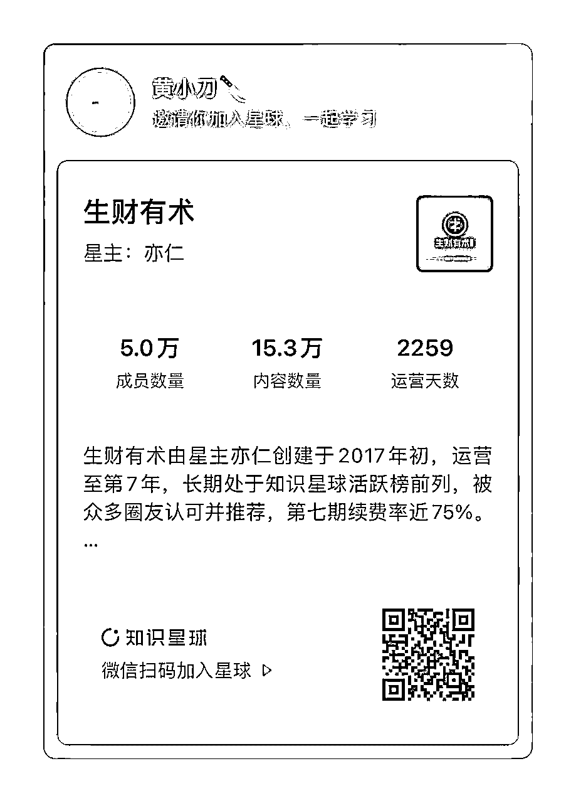

### 3、ChatGPT风向标 星球加入方式

ChatGPT风向标 星球是免费的GPT、AIGC交流社区，截止目前已经拥有4万用户。

大家一起在这里交流、碰撞最新的场景和机会。

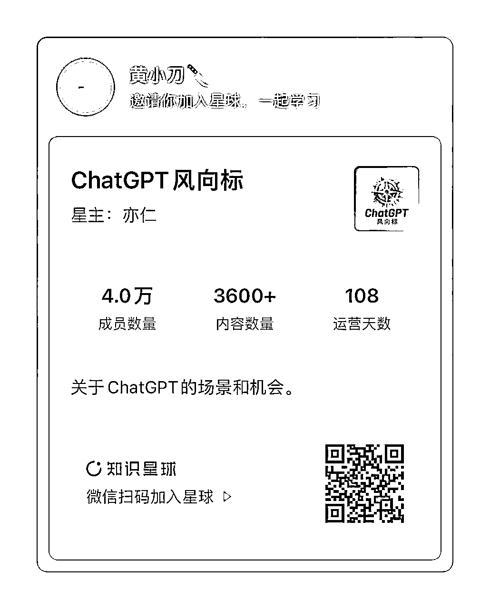

### 4、ChatGP相关电台

在各大播客平台（如网易云、小宇宙等）搜索“AI探索家”，即可找到地址。

每周五一期，来和黄小刀一起唠嗑，谈谈“黄小刀懂个屁的gpt”，关于应用场景探索、关于投喂、关于你我关心的aigc。

### 5、关于风向标拆解的问题模版

```
Q：你今天关注的风向标是哪一个？请填写参考案例:
A：船员填写：
Q：请给出这条风向标的1-3个知识点？
A：船员填写：
Q：请说出它的商业模型是什么？
A：船员填写：
Q：请判断它的盈利状况，如有可能，请说出月盈利预期。
A：船员填写：
Q：请判断为什么它是机会/为什么它不是机会？
A：船员填写：
Q：如果你要来做这个项目，它的最小 MVP 是什么？你会怎么开展工作？
A：船员填写：
```

你是我的商业助手，需要帮助我分析赚钱的风向标。请基于给定的风向标从一个创业者的角度填写以上模板并进行相应扩展，可以从变现空间、异常值、商机、用户需求、变现手段等角度进行分析。

ps.本文档更新于2023年5月25日，工具在未来可能会有调整或更新。