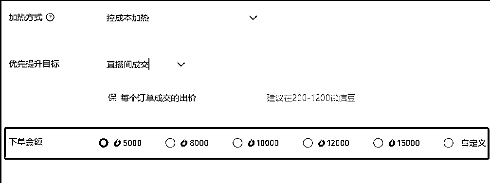

# 视频号直播投放介绍【视频号09篇】

> 来源：[https://i6mtbju8w7.feishu.cn/docx/SXGvdR22do5QUmxqjCucpcnanmg](https://i6mtbju8w7.feishu.cn/docx/SXGvdR22do5QUmxqjCucpcnanmg)

这一篇主要是全面介绍视频号直播的投放情况，包括投放的各种方式及投放工具，各投放方式的投放效果，投放基础知识以及投放配置详解。

放一下昨晚 618 活动第一名达人郭亿易的带货情况，还有她的直播打法，大家先感受下后就开始今天的分享。

## 一、投放目的

投放最终目的是保证直播间有持续，稳定，精准的流量进入，促使直播成交量冲突原有的层级，上升到更高的一个量级，同时为了有更好的利润，综合ROI更大。投放的人群会更加精准，促使转化会更加容易一些，因此成交量更容易提升。

## 二、投放类型介绍

我们都知道视频号其实是分为短视频和直播两大块，短视频有 MCN 机构，而直播有服务商体系，整个直播类型是分为秀场，游戏，带货这三种类型的直播间。

所以视频号投放分两种，一种是短视频投放，另一种则是直播间直投，也叫加热直播间或红点投放。

短视频投放，可以针对挂商品的视频进行投放，投放后是呈现在短视频广场，你在刷短视频的时候会看到一个商品链接入口

直播间投放，它是展现在直播广场或者是短视频广场，直播间广场这里面的直播间大部分是通过加热后在这里呈现，而你刷短视频的时候也会看到一个直播的实时画面，可以点进去观看直播，这里也是通过投放出来的。

今天主要讲的就是直播间直投这一块，主要介绍微信豆加热的使用方法。

我从一些渠道了解到这两个月短视频带货的投放效果很不错，很多大佬都在往死里放大去投放，投放日消大几十万。去年年底也是有过一波，投放 ROI 都很不错，有一波人应该赚了一大笔，年后又息火了，直到这两月又重新开始了。

而直播投放的效果在一些品类上也很不错，去年底 12 月应该是最疯狂的时候，海鲜菌菇滋补干货类等等。我们投过一些海参号，纯投放的 ROI 能达到 30，而且是持续了一个来月，每场都是大几十万上百万的成交额，当时主播们都非常香，每天都是关心投放能否跑得动起得了量，只要起量，成交是完全不用担心了，那会真是通投拉满。

## 二、投放工具介绍

第一，创作者流量包，这个工具也叫做微信豆投放工具，也可以叫做加热工具或是红点工具，它是用于直接加热直播间，当前使用最多的一个工具，也是效果最好的一个工具，ROI 是所有工具中最好。属于视频号团队内部开发的一个小工具，相对没那么复杂，比较简单易用，类似于抖音的随心推。目前最大的问题是比较难起很大的量，上百万场观比较难投放出来。（投放网址：https://channels.weixin.qq.com/promote/pages/platform/login)

第二，ADQ，也就是视频号原生广告，这个工具是由 AMS 部门（腾讯广告）提供的一个投放工具，它主要用于投放短视频带货这一块，近期也开放了直接加热直播间的投放。

第三，MP 广告主，也就是以前的广点通，微信广告，那这个工具主要是投放于朋友圈，公众号或者小程序。近期我在朋友圈一直有看到一个叫珀伦姿的一个美妆号，一直在进行朋友圈的投放，直接投放加热进入直播间，效果应该还挺不错，因为这个号已经投放了一段时间，持续在投放就表明它一定是有效果。这种投放也比较能起量，能大场观，但 ROI 值得商榷。

我给大家放一下这三个投放工具相关的一个效果图跟示意图，大家可以看一看。

## 三、投放流程及投放效果

接下来我主要以这个微信豆加热工具为主来介绍它的整个投放流程及投放效果。

我先放两张流程给大家感受一下，一张是整个投放配置页面及操作步骤，另一张则是它的一个投放效果及相应的数据。

首先，投放可配置的关键参数维度有 6 个，分别是【投放目标】【目标出价】【投放时长】【投放方式】【观众类型】和【下单金额】，大家可以看一下这下面这张图。

接下来，我分解一下各个配置参数的用法以及所代表的意思。

【加热方式】：主要有两种，第一种叫控成本加热，它主要是以 ROI 效果为主，消耗量看 ROI 效果，如果 ROI 不太好，它不会消化很快，有点保 ROI 的意思。目前大部分投放，也是主要以这种加热方式为主。

第二种则叫放量加热，这种方式主要是以快速增加直播间人数为主，快速涨场观，消耗的很快，流量相对会比较泛，比较考验主播的承接能力，相当它是不保 ROI 的。它还有一个叫加速加热的一个选项，如果勾选，当投放计划还不起量的时候，它能在短时间内就快速进行一个提速加热，为直播间快速涨人气，直接消耗掉计划的所有额度才会停止。这种方式 ROI 效果一般都不会很好。主要是用于快速在直播间涨人气，以便能带动其他投放计划跑量的作用。

【加热目标】：有 5 种类型，成交，互动，涨粉，商品点击，观众。我给大家详细讲解下各个加热目标的用法及效果。

成交，主要以订单成交为主要目标，考核目标为订单成交数，要求账号需要有一定量的成交数据跟用户行为标签，ROI 比较有保障。目前用得最多并且是投放效果最好的一种。

官方建议出价在 200-1200 微信豆，不同品类，出价会有所不同，如海参目前出价需要到 800 以上，竞争大的品类出价会越高才能抢到量，最高价是 9999。现在投手就是在拼出价来区分投放效果，合适的出价表现在即能让投放计划起量又能保证好的 ROI。

互动，以直播间互动数据为考核目标，适用于直播间比较能调动观众互动的主播，ROI 比较依赖于主播的互动能力，互动强，ROI 会比成交的效果好，但量没那么稳定，量级没上面说的成交那么大。官方建议出价 40-220 微信豆，目前一般出价在 60-80，品类竞争比较大的已经出到 180 以上。

涨粉，以帐号涨粉为考核目标，适用于新号起号时丰富帐号权重与标签，也可用于为直播间快速涨场观，以带动其它投放计划起量，从开始投放到起量需要一定的时间。官方建议出价 100-900 微信豆，一般以最低 100 出价投放即可，曾经有一度投涨粉的 ROI 很不错，但今年以来，这种目标效果下滑了很多，大多用于打辅助的作用了。

商品点击，考核直播间商品的点击情况，ROI 效果一般，比观众好，比观众有更多一些行为数据，但没上面三种目标好，除非品很好，刚需。但有一点是它能快速起量，消耗很快，能给直播间快速带来场观，一般用于来带动其它投放计划起量。官方建议出价 30-300 微信豆，一般以最低 30 出价投放即可，这个加热工具最早期的时候，这个投放目标，出价 2 个微信豆（当时没限出价），能跑出大几万场观来，比较适合追求场观的直播间。

观众，主要用于快速引流观众进入直播间为主，能为直播间快速带来观众，以观看为主，即快速涨场观，出价在 2-10 微信豆之间，ROI 较差，但它的作用在于当直播间投放计划跑不动里，能带动其它投放计划起量，相当于辅助作用。

目前这 5 种投放目标，比较常用投放的是投成交，次之是投互动，涨粉商品点击会作为辅助角色进行配比投放，以拉动整个投放组的跑量为主。分享大家一个常用的投放配置占比，成交：互动：涨粉 为 6:3:1。

【出价】：目前出价有两种方式，一种是智能出价，另外一种叫自定义。

智能出价，系统会根据算法跟账号情况进行预估出价，不会有固定出价价位，最终也是看不到计划的具体出价价位，这种方式比较适合一些新账号，账号本身没有标签数据，成交数据和粉丝数据，让系统自己根据算法策略去判断，然后进行一个测试投放，投放过程中会动态调整，以摸索账号的人群画像标签为主。

自定义出价，根据不同的加热目标，系统会建议出价不同。所有的出价不可低于投放目标的建议价，但是可以高于建议价。具体目标建议出价上面有讲过了，可以回看下。目前大部分投放都会采用自定义出价的方式，效果会更可控更容易出好的投放效果。

出价并非出的越高越好，或者越低越有性价比，而是根据你所在的品类的竞争程度来决定你的出价，高低主要是为了能抢到量，让计划能投放消耗出去，这样才能有更好的成交 GMV。

【下单金额】：也就是这一条投放计划的预算金额是多少。注意，下单金额不等于消耗金额，一般情况下，一条投放计划大概只会消耗下单金额的 60%左右。

不同的投放目标规定最低的下单金额也不相同，例如投观众最低的下单金额是 100 块，相当于 1000 微信豆，除了观众以外，其他投放目标最低的下单金额则是 500 元，也就是 5000 豆。而最高的下单金额则是 3 万，即 30 万微信豆。

目前下单金额越大，计划能跑量的概率也会越大，更有可能能抢到量，依据是平台背后的算法逻辑，但是这样做呢，会占用比较大的投放预算资金。这也就说明为什么说投放也是人民币大玩家的专长。

【期望观众类型】：也就是用户画像标签，投放系统人群圈包的依据。提供性别，年龄，地域，兴趣 4 个大项。

性别有男女两个选择，年龄只有 5 个阶段，18～23、24～30、31～40、41～50、50+。其实大部分主要消费群体的年龄是在 30 以上，也就是 31～40、41～50 跟 50 以上这三个年龄层次。

地域则可以按一线、二线、三线、四线、五线城市划分，或者可以按省份去划分，维度可以具体到城市级别。其实很多时候，除了一些偏远地区除外都会全选。

兴趣则分为十几个类目，像个人护理，厨具，宠物生活，家居，日用，家用电器等等。最基础的类目选择就是根据你直播间产品对应的类目去匹配，而相对高级点的做法就是把这些类目看作消费力强弱来进行选择，例如你卖的客单价比较高，如海参，就需要选择一些比较高消费力的类目，像珠宝，文玩，酒水这些，这些类目对应下的用户人群消费力会比较强。

这里有个小误区可以提一下，例如你是卖珠宝的，那这个时候你如果选择相应的类目是珠宝。那他们这些人是有购买珠宝的经验，在现在新平台视频号这里想收割他们并不容易，反而你的目标群体，可能更为合适的是那些知识付费或高档家具的人群，想买珠宝但还未买珠宝的这一类人群，相对来讲会更容易收割一些。

人群这里面还有两个特殊的选项，一个是可以选择你的竞品直播间，把它直播间的粉丝人群圈起来去投放，还有一个是相应的粉丝群，你可以选择 10 个微信群，然后投放给这 10 个微信群里面的人。当然，这里需要考量一个问题就是你直播间主播的承接能力是否强于你的竞品直播间的主播，关乎到是否能把人抢过来。

【加热时长】：有 0.5、1、1.5、2、 2.5、3、3.5、4、 4.5、5、5.5、6、12、 14 小时。这里有个关键点要认清，投放时长并不等于直播时长。投放时长的长短决定着流量进入直播间的快慢与消耗的快慢。

以过往的经验来看，你投放时长越长，效果会更好一些，也就是我们常说的，你需要去拉直播时长来提升你整体的 ROI。

【支付方式】：目前支持微信豆，人气卡，流量券三种方式。这三种方式不能混合支付，只能独立单独支付。也就是每一个投放计划只能选择其中一种支付方式。

那这三种方式的换算逻辑是怎么样的呢？

10 个微信豆=1 元=1 人气卡=1 流量券，1 流量券=5UV，相当 0.2 元一个用户。

微信豆是通过充值人民币换来，人气卡只能通过微信豆兑换而来，但它是支持进行赠送，例如兑换人气卡后可以赠送到另外一个帐号上。而微信豆当前是不可以赠送。

而流量券，来源只有官方派发，可以是活动的激励券，平台政策激励券或是私域激励卷等等这些。流量券同样也是不可以转移或赠送。

关于微信豆大额充值，我发一下链接，大家感兴趣可以去尝试一下看看，这里主要是能支持大额充值，支持对公充值。

电脑充值链接：https://webeans.url.cn/#/

手机充值链接：https://webeans.url.cn/mobile/pay

好了，给大家看一下投放后的一个效果图是怎么样。那整个投放计划的配置就是这样子。

## 四、如何创建第 1 条投放计划

### 4.1 投放前调研

在创建投放计划前，你需要对直播账号有所了解，那怎么了解呢？有几个维度供大家参考一下。

第一、投放直播间的目标人群画像，包括性别，年龄，地域和兴趣。可以通过以下方式进行了解收集。

第 1 种，查看投放账号后台关注粉丝的画像。可以清楚了解到帐号粉丝的性别、年龄、地域分布等信息。

第 2 种，根据小店历史订单收货地址，按省市区为维度进行统计得出主要目标人群的地域。

第 3 种，其他平台的用户人群的画像，如抖快猫狗用户的画像，再结合视频号平台主要人群画像，做一个交叉集合，重合的这部分就作为投放人群的画像。

第二、了解直播间的客单价是多少，毛利润有多少？这个决定了地域的选择跟投放目标的一个出价。高客单只能选择一二三线城市，高利润率可以提高出价范围。

第三、你的投放预算多少？这个是决定你可以投多少条投放计划，还有你的投放策略。

第四、帐号是什么时候开播？播多久？这个决定了你的投放的时长，包括你的策略是需要怎么去叠投还是一次性投。例如你的直播时间段是在晚上 19:00～24:00，这段时间的流量竞争会比较激烈，需要把你的出价提得更高一些，才有可能获得一定的流量。

### 4.2 制定投放规划

前期调研了解完之后，接着就要需要做一个投放规划。

第 1 是确定投放策略，是批量一次性创建投放计划还是根据节奏去叠加投放，每隔多久加一轮新投放计划。

第 2 是确定投放目标，是以投成交目标为主，还是成交加互动加涨粉加商品点击的这种多组合为主，或是各个投放目标占比多少去分配投放计划。

第 3 是出价，需要根据直播间产品的品类跟客单价来定义你的投放目标出价。产品的利润空间决定了投放出价的上限，过高的出价会导致你的利润偏低，所以出价高低是根据你的品类客单价还有利润所决定。

第 4 是投放时长，根据直播时长跟直播间流速的快慢来定投放时长。投放计划组里面需要有一些时长短的计划，也需要一些时长长的计划，短时长的计划是为了保证你开播后有持续的流量进入，而时长长的计划是为了保证你整个直播期间有持续的流量进入。

最后是用户兴趣画像。根据上面收集到的用户信息来进行一个设定。性别年龄地域兴趣，可以按先严后松的原则来测投，再逐步根据投放情况进行优化调整。

这样一条全新的投放计划就创建好了。如果是在开播前创建的，那开播后投放计划就会自动执行投放了。

注意，开播后需要及时检查一下投放计划组的每一条计划是否都在正常运行，看看是否有失败的或者不通过的计划。失败的计划一般是开播前没有添加商品到直播间的小黄车上，直播前是先需要进行挂商品再开播。

开播半个小时之后，同样要看一下计划是否正常。开播两小时之后需要观察计划是否能跑得动，是否有在开始起量。如果跑不动或者消耗很少，这属于空跑，或者如果消耗很快，但场观没怎么涨或 ROI 很低，属于跑飞或空烧。要及时去终止这类计划，重新进行一个新的投放，这时候也可以调整一下投放计划的一些标签兴趣等条件。

那在整个投放过程中你需要及时的关注每一条投放计划的一个详细数据，决定是否终止或叠加投放计划，以此来保证比较好的 ROI。

### 4.3 跟踪投放计划

最后，如何跟踪投放计划呢？

可以在数据分析上查看所有的投放计划的整体投放情况，主要有几个关键的指标数据，像【直播间曝光进入率】【商品观看点击率】【商品点击成交率】【下单成交率】，还有【直播间的互动数据】及【GPM】。

从这几个维度数据去分析出直播间在哪一环节还做得不够好，针对性进行优化调整，迭代升级，在下一次直播就能越播越好，效果越来越好，让直播以正向循环的方向进行下去。例如曝光进入率比较低，大概是在 10%以内，那就是直播间的封面图或直播间内的实景场景有问题，可以进一步进行优化，提升这个直播间的曝光进入率。

以上就是关于如何从 0 到创建投放计划，跟踪分析投放效果的整个投放流程，不知道大家一路听下来是否消化的了？能消化的不妨拍一拍我。

## 五、投放的底层逻辑

投放相当于大家在一个共享用户池子里面去争抢符合自己直播间目标的精准客户。它本质上一方面受账号的标签权重的影响。如成交GMV，订单量及人群画像，标签和行为。

另一方面，它受投放策略，出价，人群设定以及直播间人货场的影响。例如投互动，出价80，直播间该如何做出互动动作。投点击，出价40，主播该如何作出引导用户点击商品的动作等等。

投放比拼的是谁的出价更合理，设定的人物标签更准确，直播间人货场更能吸引人。最终看哪个直播间几个关键指标数据完成的更好，UV值跟GPM更大，就越能获得平台算法的精准流量，投放ROI就越好。

## 六、投放经验分享

最后，给大家分享一些我对投放的感受。

1.在整个直播项目中，投放只是锦上添花的放大器，人货场才是扭转乾坤。只有在人货场跑通的情况下，通过投放才能放大效果，脱离人货场，再厉害的投手都不可能能投出好的效果。

2.投放过程中，并不是出价越高，就烧得越快或者越容易抢到量，合适的出价+合适的人货场才能最大化 ROI。

3.无需过度关注单独每一条投放计划的 ROI，要通盘去看整体投放计划的 ROI，包括成交额量级。在利润可观情况下，ROI 为 10 成交额为 5000 的计划，并不比 ROI 为 5 成交额为 10000 的好。

4.投放也是一个拼心智的过程，胆大心细，敢于尝试，ROI 才有可能保持在一个较高的水平，平台的算法是一直在调整变化的，特别是新平台。投放的技巧与经验，都是靠大量实战投放过程中不断总结分析挖掘出来的，踩过坑，交了学费，才能不断在投放这条路一直走下去。

5.投放最高层次，大家都在同一个高水准里，其实最后拼的只是品的供应链能力、直播场景的打造能力、投放资金规模大小。

由于篇幅太长了，剩下的关于投放不了，计划消耗不动，起不了量，消耗过快 ROI 不好，如何卡赔付，店铺 Dsr 评分影响等等的内容就只能下次有机会再给大家继续交流分享了。