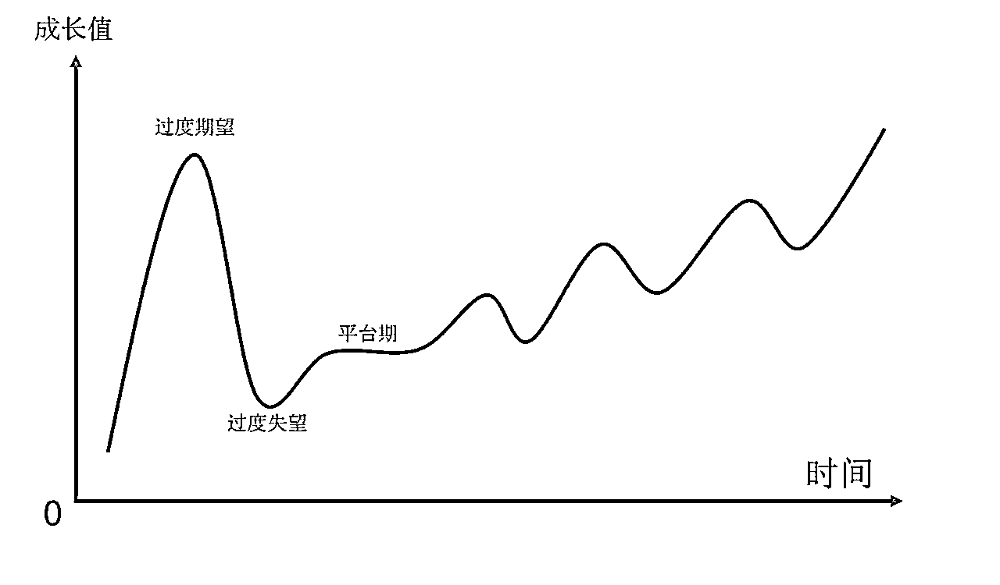

# 《视频号纯小白参加小航海：7天5W利润》

> 来源：[https://fratpz6j6z.feishu.cn/docx/Eix9dCAI4oHeUxxRkEGcoYWUnFd](https://fratpz6j6z.feishu.cn/docx/Eix9dCAI4oHeUxxRkEGcoYWUnFd)

# 自我介绍：

### 大家好呀，我是阿鸡，于今年2023年418进的生财。我永远忘不了，进生财的时候，我付了那2000块钱，直到下个月发工资之前，生活费怎么省，都还差300多块。可没想到5月5从公司辞职，拿了5000块工资，再次开启我的创业之旅。5月10号，开始在视频号发布第一条作品，5月24号开始产生第一笔收益，直到5月31号，一共利润是46000元。以下这是我的介绍。

### 虽然说运气居多，但是在这次的破圈中，我还是收获了很多东西的，接下来我将把我的心得感想和大家分享，本次分享中，仅讲：我的过程，方法论，心得，不涉及选品（选品方法生财优秀的帖子实在是多，我就不班门弄斧了）。

# 成绩

### 这是我的成绩，7天利润46000，但我对外吹嘘，7天利润5w哈哈哈

# 过程

### 因为我是第一次接触视频号这个领域，然后利用了在抖音上学到的一些门槛，开始随便玩玩的，没想到拿到一个怎样的成绩。可结果往往出乎我的意料

### 第一：我是如何发现这个领域的呢：说来也巧，是在某天刷生财的风向标时，偶然看到的。因为那时刚进生财没半个月，天天沉浸在风向标和精华帖上，信息嘎嘎涌上来。（真不得不说，一定要好好利用生财的风向标以及中标，这都是检验过的！）

### 我怎么确定这个账号能做的呢：因为看到了一个同行，一个月出了1200多单（他的第一条作品，以及到目前的作品），我估算大概挣了2w多元，然后观察了几天，从私信了他那天起我们的故事就发生了。后面又找了很多对标的同行，发现都是他做的，而且各个销量大几百，我就算那，那岂不是这个月一个月七八万？

### 结果如下图所示！他一直拖着没出教程。这里我可以告诉大家，我当时就是个小白，连模仿能力都没有（主要是不敢），一定要人带，不然不做。到了10号我就开始自己尝试搞了，对照着做了点视频，看了很多生财的文章（做项目最重要的是出来），我就非常非常潦草的做了一个，就真的很潦草，然后就发，什么都不想。

### 起初是没想着做什么成绩，随便玩玩，发发视频，一天发一两条，没流量（200左右）的话，两三天都不做一条，出了一个1w播放的，涨了几十粉，高兴的一天做三四条。因为当时还在做小红书运营，视频号这块根本不上心。

### 后面呢，就这样断断续续的发，然后有一天打开账号，视频号那显示（...），相信大家都知道就是爆了视频，然后直冲1000粉，开了橱窗，上架商品。然后到处去询问，该怎么办怎么办，有的说：去评论区做评论让他们去橱窗下单，有的说去开播。反正我都做了，最后一天下来也出了几单，挣了两百元

### 直到后面就一发不可收拾，每天的流量跟不要钱一样，呱呱的就来，下单数呱呱的涨，第二天800，第三天5800，最高的一天有1w+

# 踩坑/总结/解决办法

### 就是中途遇到一些被系统判的（有的时候是误判）：字体过大/图文轮播...这些问题，我都是直接申述的，大部分都会过，如何申述呢？1.说明这个是我有加入我的创意的 2.剪映的剪辑图截图发上去 3.知道错误了，会及时更改

### 到了31号被同行投诉了，带货权限被下了，然后开始走下坡路了。直到今天这个账号这个月就出了一单。我尝试用了"怼脸实拍"这个方式去开带车权限，也成功打开了。

### 这里我踩坑了：就是我解封过了一小时之后，我就发了一条带货视频，结果没一个小时，发来通知，我购物车分享权限又被下了。所以：账号怼脸开了带车权限，不要当天发带货视频，隔天或者两天后再发。看账号权重（受东东教练的启发）

### 中途呢浪费了很多流量，比如一开始爆款了视频，没有及时去开直播，东东教练说我浪费了好多流量，后面想想也挺可惜的

### 想做投流，但是每次挂车的视频播放到了10w 20w这样子，就会被同行举报，然后被隐藏了，也没了办法投流，所以很难放大，想要放大只能矩阵去做。（目前正在想别的办法变现【比如就做不挂车，评论区+直播成交模式】）

### 新号不要上来就连着发视频，养几天账号，养号完之后：

*   第一天：2条

*   第二天：2条

*   第三天：3条

*   第四天：3条

*   第五天：5条

### 账号被禁止挂车之后，可以上传11条“怼脸录制情感语录”的视频

1.  注：一小时一条

# 心得

### 发现了一个能打的类目，ALL IN 去做吧，及时批量矩阵的去做别犹豫。因为你不一定能做多久

### 视频爆了直接开直播，不管你会不会直播，你就开着把车挂上，讲讲废话也行，注意别违规就行了，出不了单你就当给自己的账号加权限了呗。别太给自己心理压力。

### 及时的更新迭代，做互联网，唯一不变的就是一直在变，我从一开始一个账号，到现在6个账号，我安排是4个打自然流量走老路，2个账号做付费流量，后续还会加。所以既然要做互联网这个项目，那就尽可能的去做到你能做的最好吧

### 及时多在群里发言，多请教高手，别担心你问的问题是小白问题，只要这个问题是你有疑问的，就去问，去查就好了。小白就小白呗，学到的东西都是自己的。

### （这条不一定适合所有人）跟好大哥，跟上团队，多付费，多学习，多破圈！

# 方法论：这几条很重要：

### 评论很重要，非常重要，超级重要！打磨好评论区，有蝴蝶效应的。带货的视频，可以开几个小号去底下评论，多好多好，暗示购买等！引流的视频，可以去找几个号唱反调，引发互动。（别担心负面的评论，这都是在给你视频做热度啊）亦正亦邪，有说话难听的，底下就会有反驳的

### 做混剪（不是原创的），创作成本不高的视频，剪映单个号，发3条以上的视频，而不是磨一两个视频。

### 一定一定要批量做号，别以为你那几个视频能保证你挣钱。我这个号是偶然，天时+地利+人和了。用数量去打败概率！

# 选修课：投放（这块，大家选择性看，我咨询几位大佬得出来的总结）

## 毛利润：

### 毛利大于70%再打付费，最好>80%

## 心法：

### 视频号投流一开始要出高价，把视频热度就是流量打起来后，在这个基础上，逐步降价到目标出价和roi才考虑放量的。

### 测素材/测品->测出价->放量

### 玩视频号投流有一个核心点，就是不要让视频流量断了，意思是每个时间段至少要有一个计划在跑，加热时长基本也是围绕这个核心点在玩。测品都是早上开始测，早上容易跑量，选智能定向通常加热时长是8h，一般来说加热时长6，8消耗流速差别不大。唯有晚上12点是建12h的计划，目的就是不让视频热度下来，除非你能凌晨4点起床建计划。

### 低客单好打，不好盈利。高客单不好跑量，但是不容易亏。新手建议先跑高客单。99的品。

### 投流赚的就是快钱，而且投流的曝光跟自然流曝光带来的价值不一样。

### 阿鸡：定向都不选吗？全部智能推荐？答：放量阶段才做定向，前期除非特殊人群都是通投。 阿鸡：明确了人群在30-50呢，也不限定吗？答：嗯嗯，因为你通投的话，90%以上圈选的人群也是30岁以上。

### 付费投流视频必须强营销性。

### 付费投放：商品点击率的及格线是2%

### 那你要等这个视频的自然流跑完，再付费。因为只要付费了，视频就不会被推荐流量，只有用户点赞后的好友流量。----付费流量不能带动自然流量（待考证）

### 发货后+10天自动确认收货，+7天收益打款。（例子：1号购买，2号发货，2+10=12号自动确认收货，12+7=19号收益到账）

### 要卡赔付，尽量把单量控制在6单以上

### 计划何时终止

1.  阿鸡：单品利润60元，计划出价是70元，预算200元。

情况：消耗到50元出了一单，然后继续消耗，消耗到120还没出单。这个时候剩下的80元是让他跑完还是终止？或者是说要不要在她消耗到120元之前终止？

1.  叶迪峰：终止，提前终止，每次计算都要按出单后，重新计算。好的计划和素材，成本都会一直保持得很好（ps:一测不合适，因为一测本身可能出价高，而且为了消除偶然性（避免损失部分优质素材），还是要消耗到出单为止，或消耗完。）

1.  东东：消耗70，不出单停止；空耗70 但是出单了，并且roi小于一也停止

## 测素材/品：

### 第一步测试这个品和素材能不能打，上3条素材测试，每条素材3条计划，假设99客单的品，智能加热900/1000豆出价。

*   疑问：三条计划，是同时跑，还是定一天的不同时间段。答：视频发布过了审核期，建三条通投计划，同时跑

### 测试预算设置最低，一般最低是出价X2，按整数计算。比如出价700豆，最低预算2000豆。

### 出价为：1.2倍的客单价（/1.2倍的利润【测试】），能跑然后再压价

### 什么时候终止计划？

### 叶迪峰：消耗到你的盈亏线

### 小纸壳：

#### 单品利润>100,消耗到利润的1/4-5元（利润120，消耗到120*1/4-5 = 25元）

#### 单品利润<100,消耗到利润的1/3-5元（利润60，消耗到60*1/3-5 = 15元）

### 阿鸡：

#### 消耗到利润的1/2（利润60，空跑，消耗到60*1/2 = 30元）

#### 消耗到利润的1/2-5元（利润60，空跑，消耗到60*1/2-5 = 25元）

## 测出价：

### 假设第一批计划出价900，那么第二批测试出价，就可以3条850豆，3条800豆，3条750豆，3条700豆，这样去跑。看哪条计划能正常消耗起来，在这个出价的基础上再次复制.比如750豆3条，然后再搭配700豆3条，650豆3条这样去慢慢跑到目标出价。这个阶段，如果连续3次降价，roi还是亏的（或者roi没有随着降价而升高的），换素材换品，别留念。

# 最后讲讲：心态

### 在没有结果的日子里，多坚持一会儿吧！

### 失败是必然，成功不过是失败路上的一缕阳光

### 做互联网呢，还是要多体验几次：极致的快乐，以及极致的失望（今天挣1w，明天挣零蛋的日子）

### 在一帆风顺的日子里，很难分出胜负。只有在企业（个人）出现问题的时候，才能看出来这个人的能力！

# 结尾

### 感谢：东东教练、叶迪峰、李诚Sonic教练、Rico领队、大兵哥的不吝赐教帮助我；感谢生财有术，真的是一个宝藏地，搞钱的氛围，满是高手围绕，让我深刻认识到自己的渺小。这是我到目前为止ROI打的最正的一次投资！

### 希望大家都能找到属于自己的那一条航线，深耕下去（2米的宽度，2公里的深度）。阿鸡在这里祝所有上船圈友在视频号航海都能得到正反馈，祝大家爆单！！！爆！爆！爆！

### 到此我的今天的分享就结束了，感谢大家的耐心聆听，在此的拙劣文笔若能帮到大家，我甚是荣幸。若有需要，也希望大家积极找我沟通，一起加油！