# 一篇随生财精华帖，大二纯小白快速上手副业项目两周变现1W＋，分享我的生财精华掘金秘诀

> 来源：[https://eo7n0qipwx.feishu.cn/docx/UOviddqFLo82H8xOUX9cgHBLnNK](https://eo7n0qipwx.feishu.cn/docx/UOviddqFLo82H8xOUX9cgHBLnNK)

# 前言

大家好我是纸鸢，02年大二学生，一位互联网小白，今年刚刚加入生财有术。下面是我的自我介绍：

【昵称】纸鸢

【坐标】北京

【标签】阅读爱好者 AIGC研究者

【经历】

✔北京电信校园合伙人，两周时间跑通推广“天翼云”产品项目的闭环，获利1k+

✔一小时跑通天涯掘金项目，两周收入1w+

【提供资源】

✔AIGC相关资料

相信很多小伙伴和我一样，进入生财，就好像新手来到了高手云集的江湖武林。各个大佬分享的各式各样的项目看得我们眼花缭乱。

项目的确数不胜数，但好像都有一定的难度与门槛，对于还是小白的我们来说并不友好，这就导致我们有一种“守着金山却不知道如何开采”的苦恼。

如果你也有这样的感觉，那我推荐你做天涯掘金或者是类似的虚拟资料项目。为什么呢？小白如我，都能在天涯掘金项目上两周不到赚到1w+。

第一次写项目复盘，如有不妥之处，希望大家多多担待，批评指正。

首先感谢我的大哥@付一 @任平生，为我开启了互联网网赚的大门，在这里衷心说一句，跟着平生付一有肉吃！

# 第一部分 首次听闻 立即执行

## 一.事情缘起

2023.5.18，在军训休息之时，我正刷着手机，打开生财有术星球，看到@付一 在星球分享了天涯神贴项目的完整思路并给出了具体的sop文档。

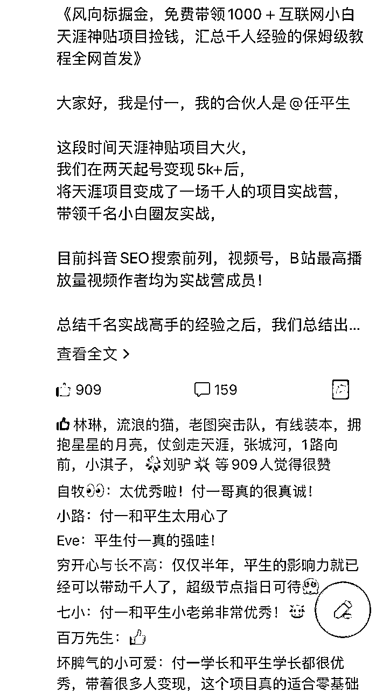

我点开文档细细看了一会儿，发觉这个项目流程明确，难度较低，很好上手，且收益不菲，对于我这种从未接触过互联网项目的小白来说再合适不过了。

于是我决定当天军训完马上动手。

## 二.说干就干

回到宿舍后，我先加了付一哥的微信，在加入了训练营之后，我立刻照着文档一步一步操作。

付一哥的训练营文档里有抖音、小红书、B站等各个平台的图文和视频玩法，其中图文类是最简单的，抖音这个平台是最好做的。

对于小白来说，越简单粗暴越好，先做到从0-1，把项目跑通是最重要的。

我跟着文档里的教程，从设置账号昵称、简介、背景图，到选择内容、制作图文、发布作品，每一步都进行像素级的模仿，它怎么说我怎么做。

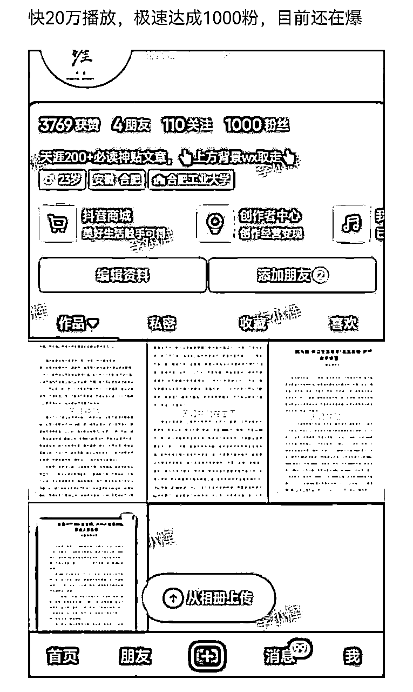

## 三.极速闭环

连续发布了两个作品之后，在不到一个小时的时间里，就有五个人加了好友。

第一次面对这种情况，惊喜之余也有一些紧张。

在和第一个客户交谈时，我将原价为19.9的天涯资料降到了18.8，成功卖出第一单！

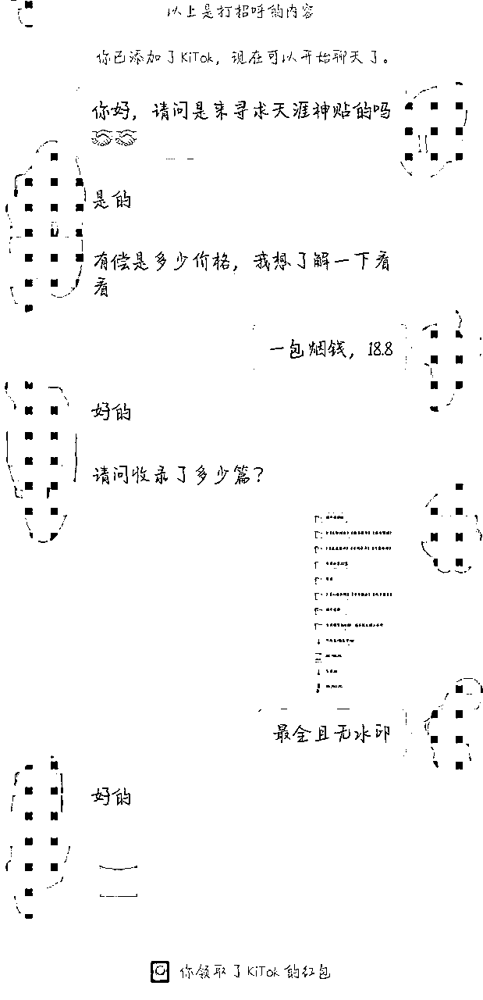

从图中也能看出我当初话术的稚嫩，但胜在运气挺好，成功出单！

至此，我跑通了这个项目的闭环，用时仅仅一小时！

这是我第一次在互联网上赚到钱，也是我第一次体会到一个互联网项目的完整流程与闭环。

“动动手指就能赚钱”，这种感觉真的很奇妙，也很爽。也让我第一次觉得赚钱如此简单。

再去点开抖音，我被吓了一跳：第二个作品的播放量达到了1.3w！粉丝数达到了60。

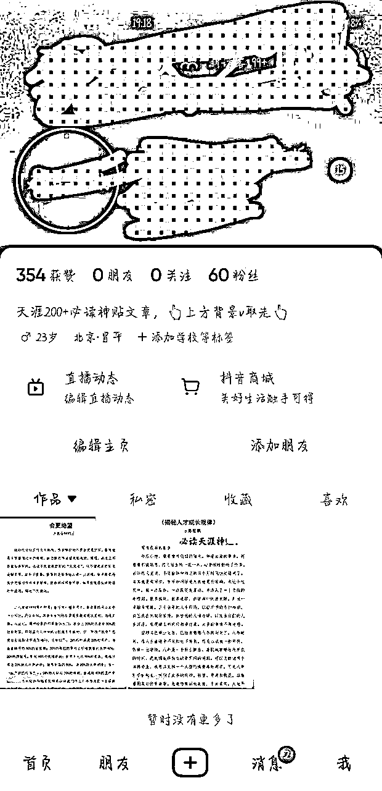

2023.5.18 跑天涯项目的第一天，出了4单，收入80+。

# 第二部分 迭代优化 迎来爆发

## 一.持续学习

做项目的第一天，时间有限，学习得也不够深入，很多细节也没有做到位，再加上被跑通项目的喜悦冲昏了头脑，没能更进一步。

到了第二天，我冷静了下来，发现自己还有很多地方可以优化改进，于是我继续钻研学习文档教程。

同时，平生哥和付一哥邀请了很多这个领域的大佬来到群里进行经验分享，给到了我很多启发。

### 1.作品缺陷

①看了许多对标账号的许多爆款作品，我发现这些作品的内容很多都是一样的，来来去去都是开悟、kk预测、灵宠等等那几篇，这就为我接下来的作品提供了素材，什么内容爆了我就发什么内容，这也印证了一个点：爆款是重复的。

②爆款作品的形式及模板各异，但都有一个特点，十分抓人眼球，很容易吸引用户的注意力，再加上让人上头的BGM，完播率很高，我把这些模板和音乐都搜集记录下来，用在自己的作品上。

③那些爆款作品当中有各种各样的水印、标注、下划线等等，我寻思着，既然他们都有这些东西，我能不能反其道而行之，直接原汁原味，截取原图后制作图文发布，既能节约时间又能与众不同。

④爆款作品有一个共性，除了浏览量和点赞量很高之外，它们的评论区也十分热闹。我观察了一下，发现这些作品的作者十分善于引导评论，我的作品也有评论，但我没运营好、引导好，导致作品不能进一步加热，这点需要改进。

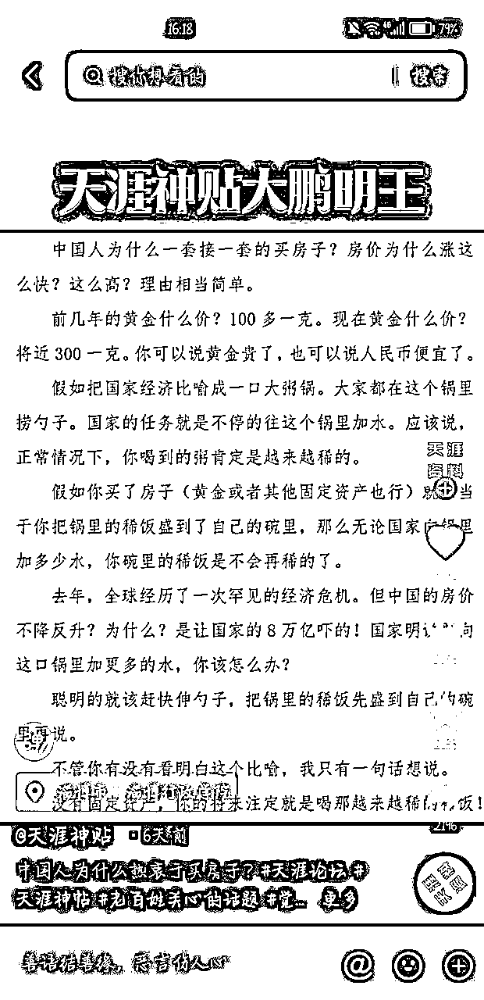

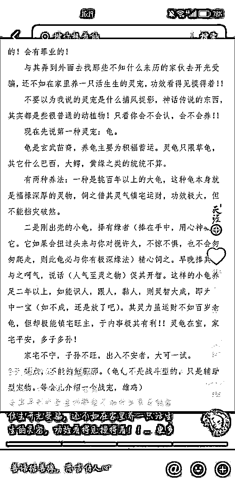

### 2.后端缺陷

①话术稚嫩。在与顾客交流的过程中，话术不够成熟，不能勾起顾客的购买欲望，导致成交率较低。

于是我做了两件事，一是找到同行，装作是他们的顾客，去“被营销”，学习他们的话术和成交流程；二是向训练营里的前辈们提问，他们指点了我许多，给予了我莫大的帮助。

②一次性生意。成功成交之后，我和顾客几乎就没有交集了，从此形同陌路。这样的一次性生意，不能发挥私域的最大价值。

于是我向@付一 哥请教了一下，他给出了一个很棒的思路：将卖天涯资料的教程玩法卖给顾客，价格自己定，能再赚一笔的同时还能与顾客产生后续的交流与互动，提升信任感，为后续打造个人IP积累原始粉丝，奠定基础。

③天涯资料是通过夸克网盘分享卖出去的，但用夸克网盘的人比较少，大多数人还是比较熟悉百度网盘，于是我把夸克网盘和百度网盘一起分享给顾客，或者以邮件的形式发给顾客，顾客能直接接收到并下载，为顾客提供便利、避免麻烦、省下时间。

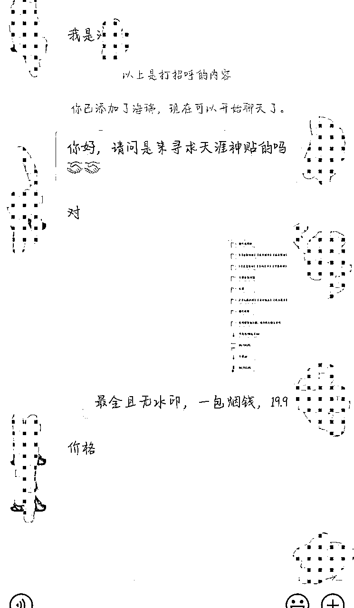

## 二.更新换代

意识到上述问题之后，我立即想办法改进，或是继续钻研教程，把更多小细节做到位；或是咨询大佬或者群内小伙伴，寻求他们的帮助；或是找同行，体验他们的完整流程。

这是我改进后的结果：

第二代：

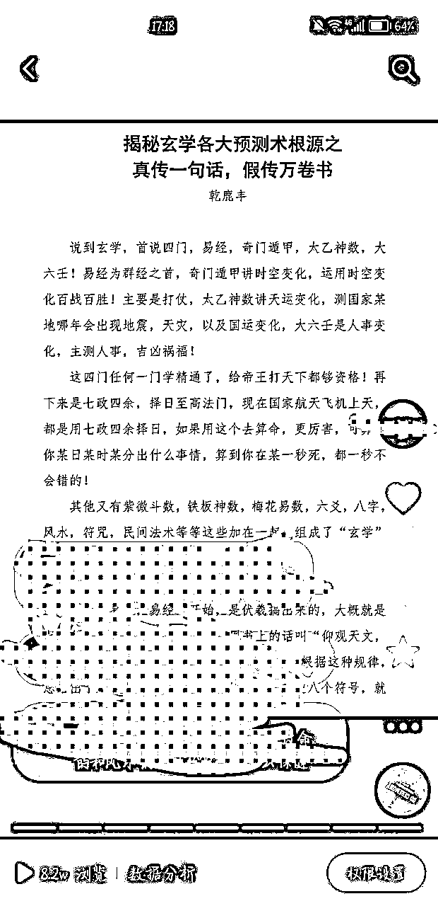

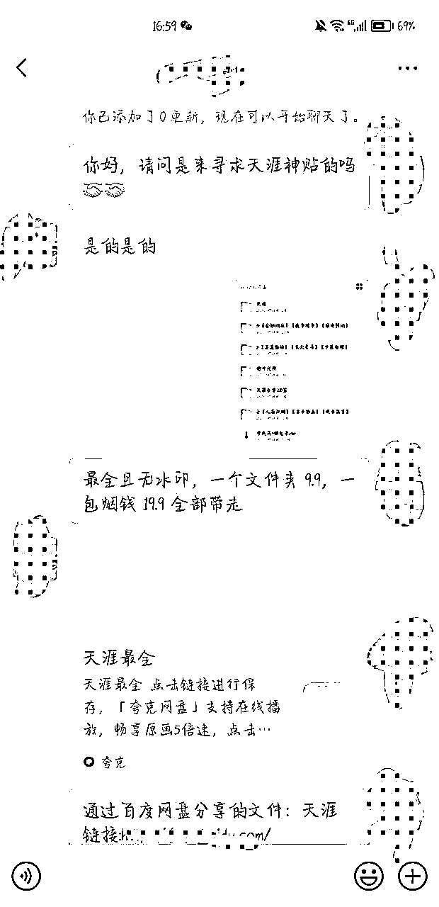

第三代：

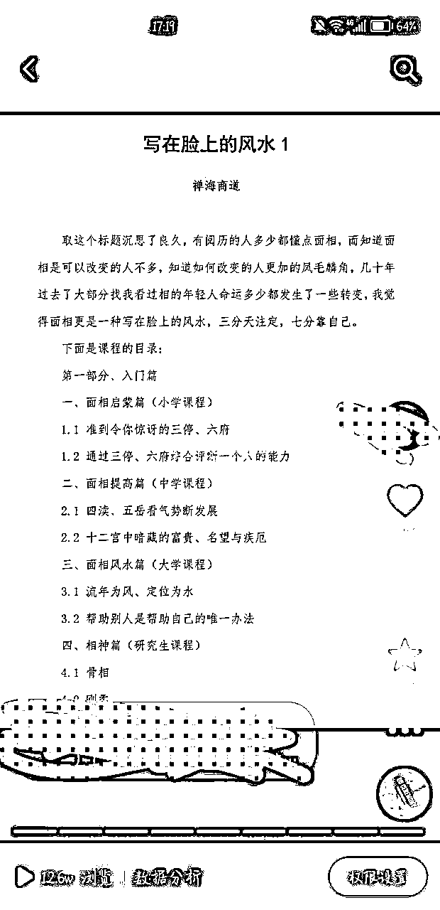

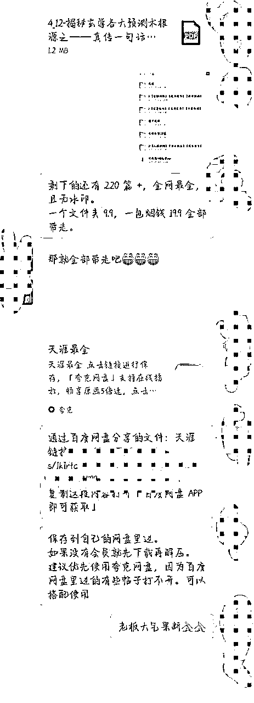

其中还有一些比较有趣的案例，一起放上来给大家分享分享

一个爽快人：

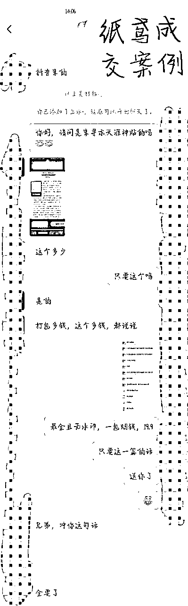

运用训练营大佬的教导的方法一单卖到99、66元！

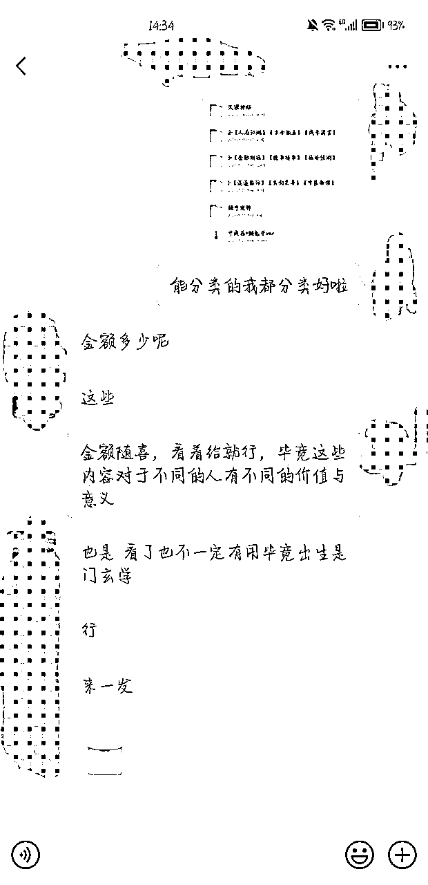

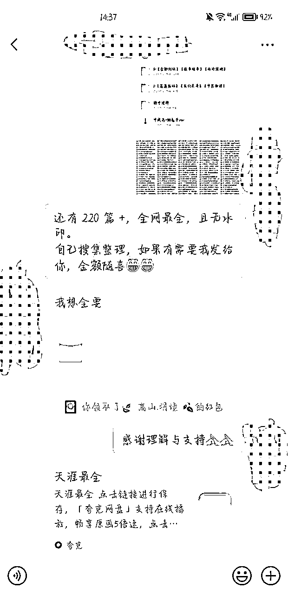

## 三.爆发增长

经过了几天的持续学习和更新换代，我迎来了爆发期。

### 1.作品方面

27个作品有19个超过了1w浏览量，作品最高浏览量达到了12.6w，粉丝数突破4k！

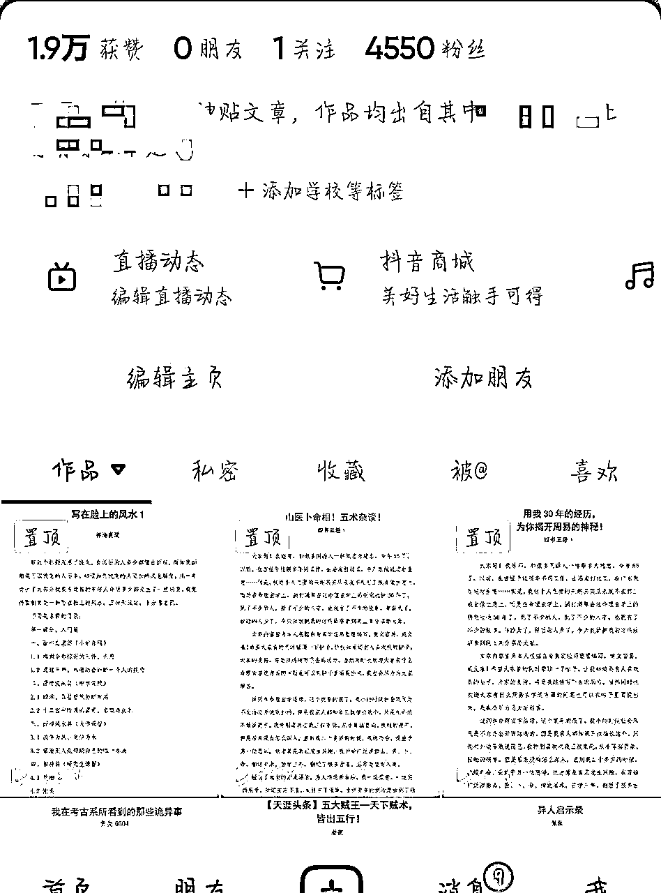

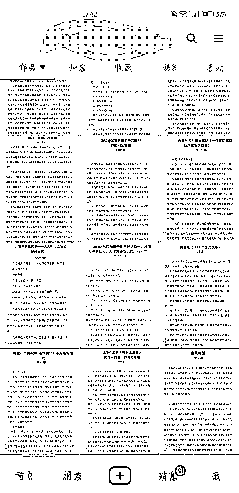

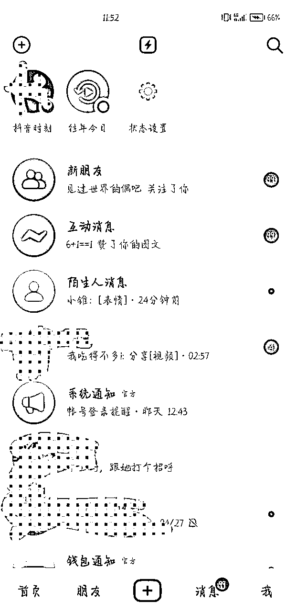

### 2.引流方面

第一天引流7个人，第二天引流40个人，第三天70个，第四天100个······

我用的是小号承接流量，这个号原本只有50不到的好友，现在已经700+了。

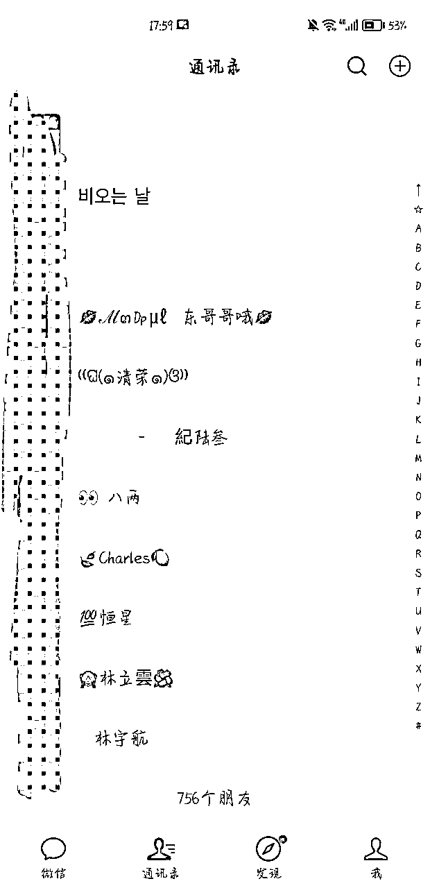

### 3.出单方面

第一天，收入80+；第二天，收入400+；第三天，收入600+；第四天，收入900+；第五天，也就是有一个作品大爆，达到了12.6w浏览量的那天，收入1200+，后续基本稳定在800+。

怕小号承接流量太多被限制，我分了流量一些到自己的私人号上。

两个号，源源不断有收入进账。

之后，又在付一和平生哥的帮助下开通了自助入群系统，流程自动省力，专心做流量。

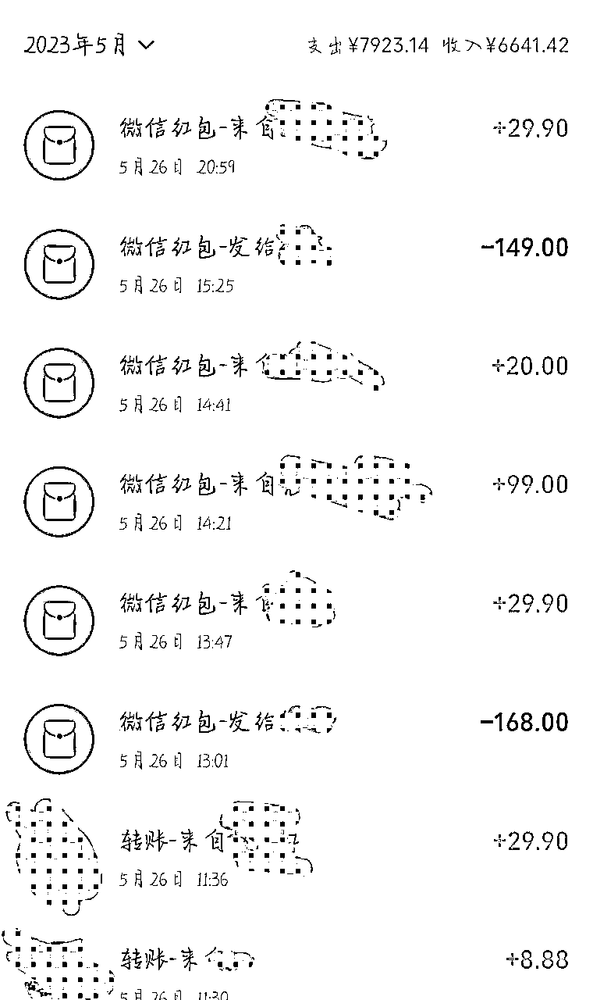

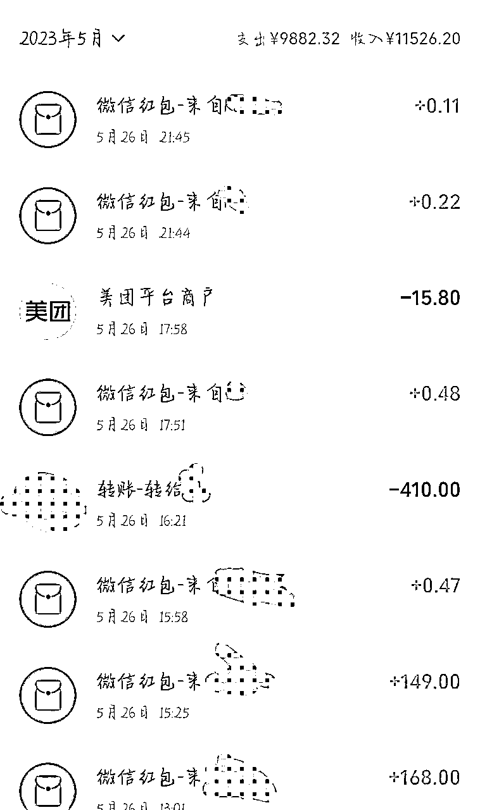

# 第三部分 持续盈利 感悟复盘

## 一.执行为王

有想法就马上干，完成比完美更重要。可能是初生牛犊不怕虎吧，在看到这个项目的时候，我并没有想太多，直接就上手实操了。

对于小白来说，选择什么项目其实没有那么重要，最重要的是躬身入局，亲身下场体验，并坚持下去。

前期得到的正反馈可能少之又少，但入门这一段路其实是最难的，跨过了这道坎方能一飞冲天。

执行的过程中不断发现问题、思考问题、解决问题，吸取每一次经验教训，一点一点地优化改进，从1.0版本到2.0版本再到3.0版本，一直更新迭代，没有最好，只有更好。

## 二.先抄再超

### 引用最近看到的一句话：没有慧根，但我会跟。

这其实是做互联网项目最好的思路之一。有教程就跟着教程一步一步来。

找到对标账号进行像素级的模仿，从昵称、简介、头像、背景图、作品内容、音乐、文案、标签等等细节入手，一丝一毫都不要放过。

抄完之后要有自己的思考与创新，正如我上述的反其道而行之，把原图直接做成图文，什么东西都不加，这便是我的创新点与独特之处。

### 另外一点就是要善于观察，保持敏锐。

天涯资料里面有很多写玄学的东西，在发完第一篇玄学的内容之后，我发现它的浏览量和点赞数都比其他作品高出许多，于是我就怼着玄学这个话题发，大获成功。

相信我，别人做这样的账号能挣到钱，你也可以。相信我，我这样的互联网小白都能挣到钱，你也可以。

## 三.积攒经验，提升能力

对于小白来说，第一次做项目，盈利多少并不是最重要的。最重要的是能在实操的过程中积攒多少经验，增长多少才干，提升多少能力。

在天涯掘金这个项目中，对我来说，最有意义的是我对自媒体的底层逻辑有了更加清晰的认知，从公域引流到私域，从陌生人到客户，到最终的成交与复购。

### 这样一个完整的项目流程与闭环，这样的做事逻辑，我体会了，掌握了，之后再有类似的风口与热点，我都能迅速反应，再创新高。

这样的经验与能力，于我们来说才是最有价值的。

### 另外，与人打交道也是一门学问。

在跑这个项目的过程中，我遇到过形形色色的人，有爽快大气，直接打钱的，有磨磨唧唧，来回扯皮的，有只想白嫖的，有加好友之后来搞人心态、举报账号的······在接触了各种各样的人之后，真是感慨世界最大，无奇不有。我们只能做好自己，不断打磨话术，提升自己“看人下菜”的能力，遇上实在是很不对付的，拉黑删除就好，切勿被他人影响了好心情。

# 第四部分 懂得感恩 真诚利他

### 小白第一次写复盘，文字水平有限，

### 这里表白我的大哥们 @任平生 @付一

### 一句话，跟着平生付一有肉吃！

### 最后感谢生财有术平台给我这样的互联网小白提供的开眼和赚钱实操机会！生财有术，致富之路！

#### 我的微信号：lzh1610946571 欢迎小伙伴链接，一起探讨项目玩法，一起交流，一起加油！