# 考试第一、保送读研、写作出书、创业有果、恋爱甜蜜|自律10年，人人可复制的时间和精力管理心法

> 来源：[https://fcjmogm9bc.feishu.cn/docx/UbKbdMDUEoXFbCxCcVycQa1cn6f](https://fcjmogm9bc.feishu.cn/docx/UbKbdMDUEoXFbCxCcVycQa1cn6f)

🎯 不做自律的奴隶，做生活的主人。

大家好，见贴欢喜，我是 ，如果你总是面临，被ddl追着屁股跑，时间不够用，工作副业生活都想兼顾，但力不从心的现状，我想这篇文章可以帮上你。

其实，大多数朋友，对「自律」有误解。

你以为的自律：把时间计算到分厘。

实际上的自律：用自己喜欢的方式过一生。

比如，有的人的目标是儿孙满堂，有的人的目标是家财万贯，有的人的目标是自在无拘束——针对不同的人群，我们所需要的自律方法截然不同。

我们最终希望得到的，是幸福的生活，自律只是实现这一目标的工具而已。

我们该如何实现自己的人生目标呢？

举个例子，假如你的目标是：可以不工作，在家躺着就行。

那你就必须去找到适合自己的路径。

1.  比如，你可以找一份体制内的工作，干到50岁退休，之后的日子就能躺平了。

*   这样，目标拆解下来，就是：我要如何进入体制内？

1.  再比如，你可以趁着年轻拼命赚钱，赚到足够的钱之后，你就可以靠复利养活自己了。

*   这样，目标拆解下来，就是：我该如何尽早赚到能满足我人生需要的钱？

1.  还比如，你可以找一个富有的伴侣，靠他/她养你。

*   这样，目标拆解下来，就是：我该如何找到一个能养活我的伴侣？

你看，我随便举了个例子，就能拆出不同的达成路径，而每一条路径，又能拆出更多的步骤。

《高效能人士的七个习惯》这本书告诉我们，我们做事要遵循「以终为始」原则。

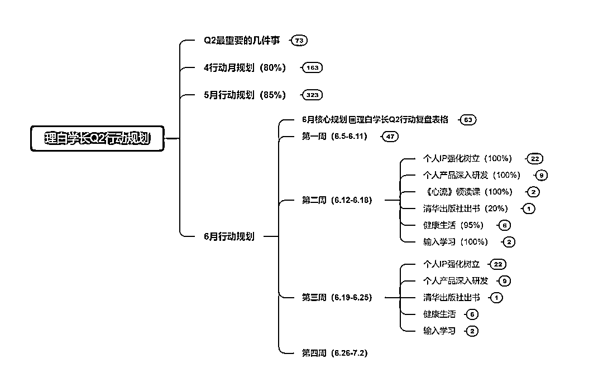

/理白的阶段目标/

以人生目标为导向，我们更能清醒地知道自己想要什么、不想要什么，所有与自己的人生目标背道而驰的行为方式，都应该让路。

我的人生由我自己定义，通过一系列必要的手段，达成我的人生目标。

我们把这个过程，叫做「自律」。

所以，本贴12000字，最重要功能就是：让每名圈友通过一系列适合自己的管理工具，尽快拥有梦想中的生活。

本贴阅读指南

1.请尽可能使用电脑阅读，效果更佳。

2.我的一切观点都不重要，你的舒适度最重要。

3.先学习，再模仿，而后创新，最终超越。

4.以3个月为周期，完成一次行动蜕变。

# 一、计划篇|易执行，才是好计划

在制定计划之前，我们需要重新审视自己：

1.  我现阶段的最重要目标是什么？

1.  我该如何实现自己的核心目标？

1.  我的每一天、每一周该如何过？

## 1.以三个月为周期

为什么要以3个月为周期？

因为这是理白用个人经验测试出来的最理想状态。

一年太久，久到我们持久作战出现疲态，最终一无所获；一月太短，短到只能养成一个习惯，距离实现目标还有很长路途。

3个月的时间，可以好好策划、制定计划、集中时间办大事、攻克主要矛盾，这样的结果导向更明确，执行可行性也更高。

更重要的是，一年分4个季度，每个季度办好1-2件大事，到年底总结的时候，会惊喜地发现：这一年的我，竟然如此闪耀。

## 2.不同维度找目标

说清楚了以3个月为一周期的好处，我们来聊聊该如何找到自己的目标。

找目标不是空想，而是有逻辑地思考与碰撞。

如果你当下有非常重要的工作、目标与梦想，需要抛弃一切杂念去达成，比如考研、考公、减肥等等，那么，你直接把他们定位你的目标就好，无须多想。

但，当你自己处于迷茫阶段，不知道自己该定啥目标的时候，可以尝试用我的方法来找目标。

接下来，给大家提供几个不同的维度，帮大家更好地梳理思路。

前面这张思维导图，只是给大家基本的思路，不需要每个部分都有目标，某个部分也可以有多个目标，且导图挂一漏万，一定存在覆盖不到的层面，大家还是要多结合自身实际情况，认真思考后，书写自己的目标。

## 3.目标的标准量化

找目标的过程中，我们要合理进行发散、合并同类项、筛选过滤等必要步骤。

下面以理白的Q2目标为例

### （1）确认核心

无论你要做的是多长时间的规划，你首先要做的一件事是：确认核心。

即：这个阶段，我最重要的、一定要完成的几件事是什么。

而后，在「飞书」打开一个思维导图，开始分类敲出来。

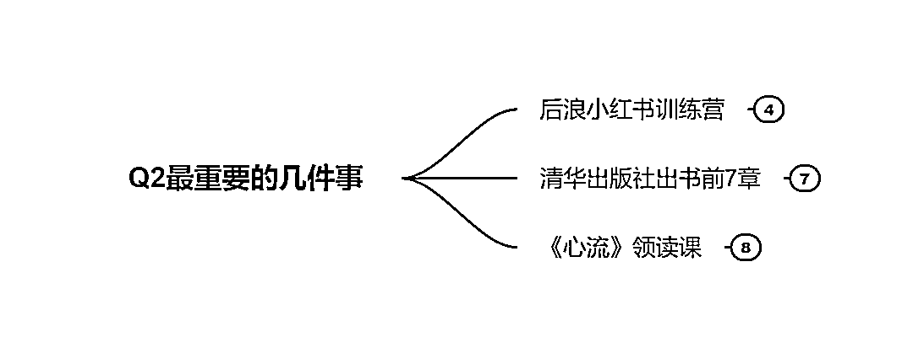

这个过程一定要慎之又慎，确保自己写进去的，是现阶段自己必须完成、对自己帮助最大的任务。

*   比如，我Q2最重要的三件事，分别是：

*   其中，训练营是新开辟的战场，需要投入50%以上的精力；

*   与清华出版社的对接出书，截稿日期在8月底，所以只需要在Q2完成前7章的撰写工作，需要30%的精力；

*   另外20%的精力，挪给了年初欠下来的账，需要完成领读课的录制。

而在这个过程中，我又发现：

1.  如果要完成训练营的招生，必须要增强自己的账号粘性，留住更多对我有足够信任度的学员，所以，我需要把现有的账号资源通盘梳理，进行重新整合。

1.  在大量工作同时并行的情况下，我个人的精力管理需要更加精准有效。 故而，我做了新的调整。

### （2）调整目标

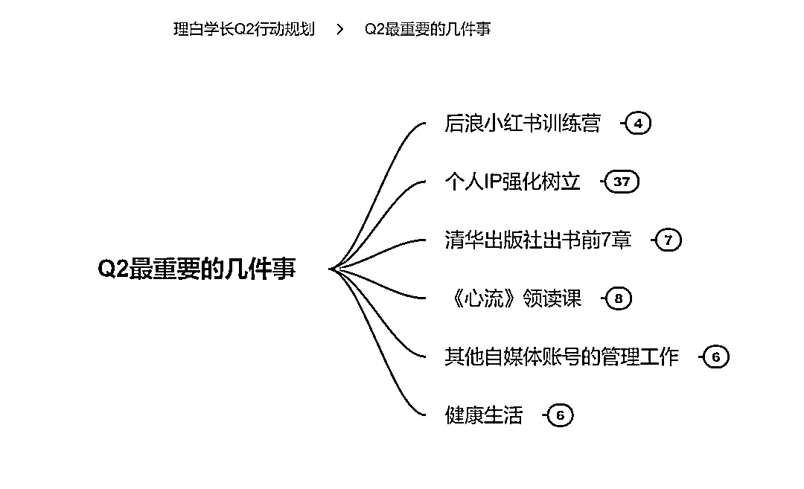

在新的Q2重点中，我把自媒体的管理、IP的强化梳理以及健康生活三个板块，也纳入了我的重点之中。

很多人问我：做计划的时候，只是放工作，还是也可以放生活？

我的答案是：看你自己，你觉得有必要，就放。

但原则是，无论工作还是生活，都要做到：可量化。

### （3）量化任务

量化任务，就是化虚为实，把目标结果，转化为数据和行动。

很多人在做计划的时候，为什么后期难以执行？

就是因为在计划执行过程中，找不到可量化的标准，进而无法判断自己任务的执行程度。

进而，拖延到DDL，还迁延未愈。

所以，量化任务，势在必行。

大部分的任务量化，相对比较容易。

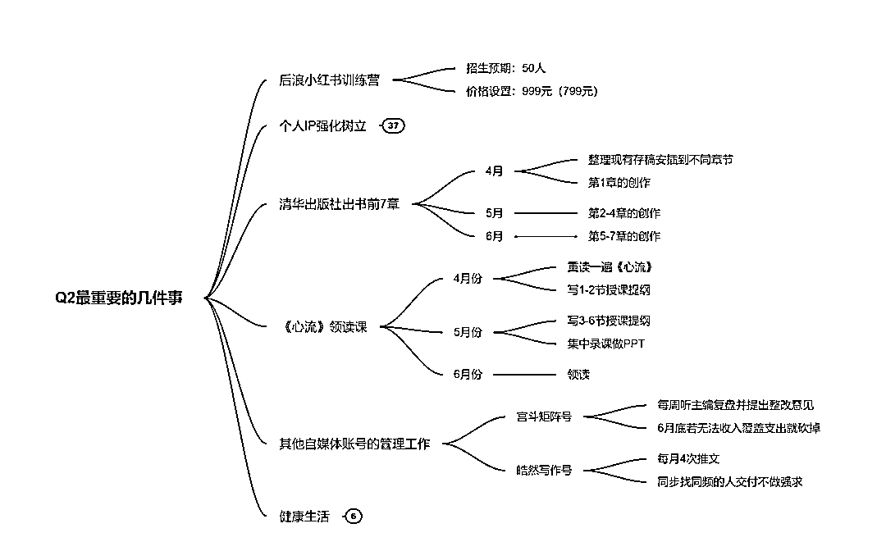

如上图所示，对招生来说，只要确定招生人数和金额，就算是量化；对出书而言，只要确认完成章节数量，就算是量化；对录课而言，只要确认录制时间，就算是量化。

但是，也存在难以量化的表述，比如「个人IP强化树立」是一个很虚的概念，这该如何量化呢？

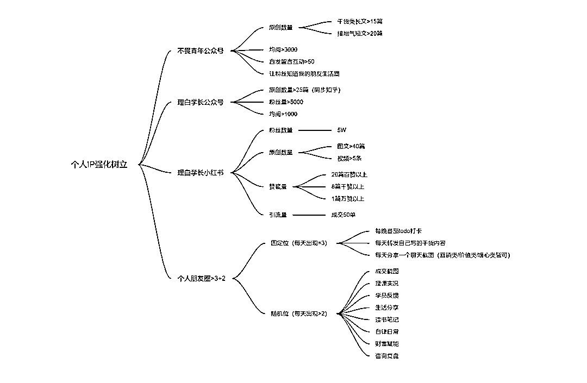

### （4）落为行动

这时，我们需要将任务拆分成「可执行的行动」。

比如，我自己有3个做得还不错的自媒体平台：不畏青年公众号、理白学长公众号、理白学长小红书。

而我需要做的，就是将这几个平台的数据进行量化，进而拆解成一个个可以攻克的数据点。

特别要提的一点是，针对「个人朋友圈」的部分，我做了非常全面的分析梳理，每天要发的朋友圈将做到大于3+2。

3个固定位是：

而2个以上的随机位，将从上图中的8个选项中随即选择，这样，我每天就不需要纠结朋友圈需要发布什么样的内容，只要对着导图，就能有源源不断的发圈灵感。

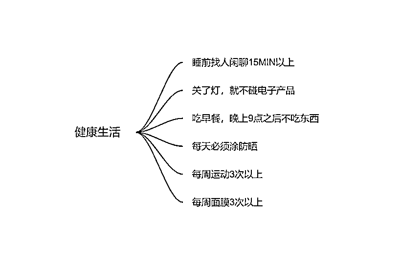

这时，我们再说回「健康生活」这个板块。

健康生活很难用数据衡量，因为你很容易就写「早睡早起」这种空话套话，或者写「每天6点起床」这种很难坚持下来的具体时点。

所以，我们的选择是：找具体的、生活化的、强提醒的「行动」，而把需要精准数据的部分，用周的时长代替日的时长——你很难拥有完美的一天，但你可以拥有完美的一周。

这样，任务，就彻底被我们量化了。

### （5）通篇复盘

量化的任务，记得要再通篇回看一下，因为你在给单个项目做量化的时候，经常会高估自己的行动力。

所以，在所有目标全部写完的最后，要进行一次通篇复盘，适当结合整体任务量，给自己减负，最终形成完整的必做之事清单。

## 4.拆分为单元目标

接下来，是比较“爽”的一Part：任务拆分。

一般来说，阶段性的大任务，我们要拆成几个小阶段会比较好。

这里记住：我们是把长时段拆成小时段，而不要拆成孤立的点。

意思是，建议最少以周为单位进行拆分，而不要拆分到每一天。

以周为单位，既可以整体调控，又方便及时复盘。

像年度计划、季度计划，可以分成：长时（年/季）-中时（月）-短时（周），三个梯度。

像月度计划、28天计划、100天计划这种，就分成：中时-短时，就足够了。

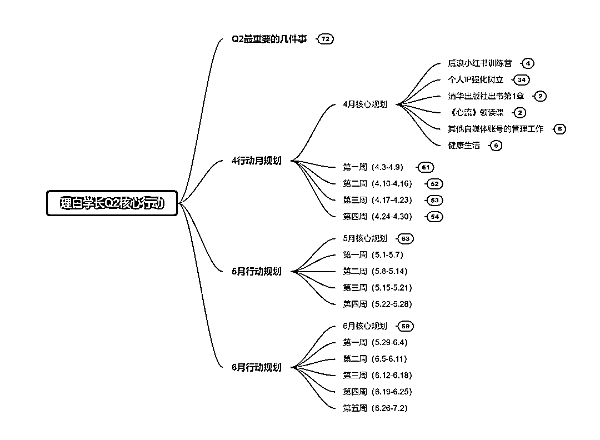

做任务拆分的时候，我们先把每一个短时长节点划分出来，而后从由大及小的顺序进行内容填充。

如上图，在「Q2最重要的几件事」基础上，先拆分成4月、5月、6月的行动规划，进而把每个月拆出当月核心规划及4周的短时长。

然后，把已经量化的大任务，先分配给不同月份的「核心规划」。

比如，我的大计划是：不畏青年第二季度要发布15篇干货长文。

那么，分配到不同的月份，就是4月5篇、5月5篇、6月5篇。

以此类推，每个月的「核心规划」，就是大规划的缩小版。

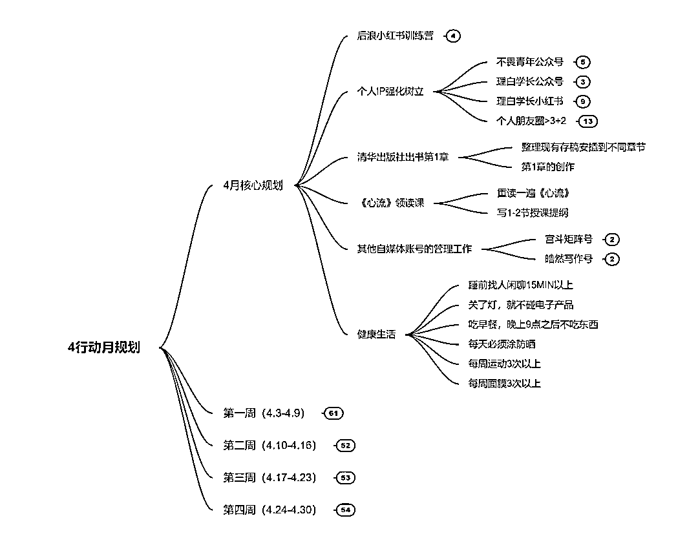

接下来，把所有的内容全部折叠，只针对即将开始的这一周（对我而言就是4月的第1周）进行规划。

规划的逻辑与前文大同小异，我就不再赘述了。

总之，我们做到本周要做的内容就可以停止了，不需要再去想第2周、第3周，甚至是下个月的第1周要干什么。

有两个原因：

1.  周复盘的作用，就是解决这周的问题，制定下周的计划的，提前做好没有意义还浪费时间。

1.  一周的时间太短，变量太多，稳定性不强，一旦有干扰项，大主线一动，小细节都要跟着动，耗时耗力、得不偿失。

所以，我们最多把中时规划（每月计划）的每个关键环节做好，就够了。

# 二、行动篇|用机制，倒逼行动力

要顺利完成目标，按部就班完成自己的计划，需要科学的机制来维护。

## 1.打卡机制

通过打卡，形成固定动作，让我们可以清醒知晓每天的行动安排，帮助我们快速进入自律状态。

接下来，需要大家提前制作自己的日打卡模板。

要特别说明的是，这个模板随时可以变动、丰富、完善、更新，所以一开始的模板粗糙一点没有关系，我们首先要做的，是形成惯性，完成比完美更重要，惯性形成后，逐渐完善我们的打卡工具即可。

给大家提供几个打卡模板，大家从以下模板中任选一个作为打卡工具就好，也可以在我提供的几个工具之外，自行研发、自我融合。

### （1）文字打卡模板

文字打卡是最简单的方式，只需要在微信里打字，提供三种比较常用的文字打卡方式，大家可以自行选择。

#### 「1-3-5清单法」

这种方法适用于每天的任务相对复杂，需要区分重要等级的人群。

1代表全天最重要的一件事；3代表全天相对重要的三件事；5代表全天较轻松可完成的五件事。

#打卡模板如下

Day X 2022年7月X日 XXX打卡

【1】必须做的一件事（占比60%）

阿巴阿巴阿巴阿巴（√）

【3】很重要的三件事（占比30%）

阿巴阿巴阿巴阿巴（√）

阿巴阿巴阿巴阿巴（×）

阿巴阿巴阿巴阿巴（√）

【5】尽量做的五件事（占比10%）

阿巴阿巴阿巴阿巴（√）

阿巴阿巴阿巴阿巴（×）

阿巴阿巴阿巴阿巴（√）

阿巴阿巴阿巴阿巴（√）

阿巴阿巴阿巴阿巴（×）

【今日完成度】

60+20+6=86%

明日要做的事：

【1】阿巴阿巴阿巴阿巴

【3】阿巴+阿巴+阿巴

【5】阿巴+阿巴+阿巴+阿巴+阿巴

#### 「三只青蛙法」

三只青蛙法与清单法类似，同样适用于对任务有分级的人群，但「三只青蛙法」对任务的分级更倾向于任务的难易程度而非重要性，三只青蛙讲求优先做完最难啃的工作。

#打卡模板如下

Day X 2022年7月X日 XXX打卡

【三只青蛙】

呱呱呱（√）

呱呱呱（√）

呱呱呱（×）

【四条蝌蚪】

呱呱呱（√）

呱呱呱（√）

呱呱呱（×）

呱呱呱（×）

明日青蛙：

1.呱呱呱

2.呱呱呱

3.呱呱呱

#### 「时间清单法」

时间清单法，适用于日常工作不会被打扰，更能完全掌控自己时间的学生党、自由职业者、考研考公党等等。

时间清单法的要点在于将任务分配至不同时间段，并按计划完成。

#打卡模板如下

Day X 2022年7月X日 XXX打卡

06:30-08:00 XXX

08:00-11:00 XXX

11:00-14:00 XXX

14:00-19:00 XXX

19:00-22:00 XXX

22:00-23:30 XXX

### （2）文档打卡模板

文档打卡可以自行设计好看的模板，并把各类内容自行整合，同时形成打卡图与思考输出，优先推荐大家使用。

提供两种基于飞书的文档打卡方式，大家可以自行选择。

#### 「个人打卡日报」

适用于任务导向型人群。

#模板：

#### 「学习计划日报」

适用于学习导向型人群。

#模板：

### （3）图表打卡模板

图表打卡采用思维导图或表格的形式，将打卡内容与宏观计划的关系直接体现。

提供两种基于飞书的图表打卡方式，大家可以自行选择。

#### 「四象限法日报」

适用于复杂任务型人群。

#模板：

#### 「行动复盘日报」

适用于月计划导向型人群。

#模板：

### （4）工具打卡模板

工具打卡可借助各类APP，帮助我们快速记录时间、完成打卡目标。

依旧提供两种打卡方式，大家可以自行选择。

#### 「滴答清单打卡」

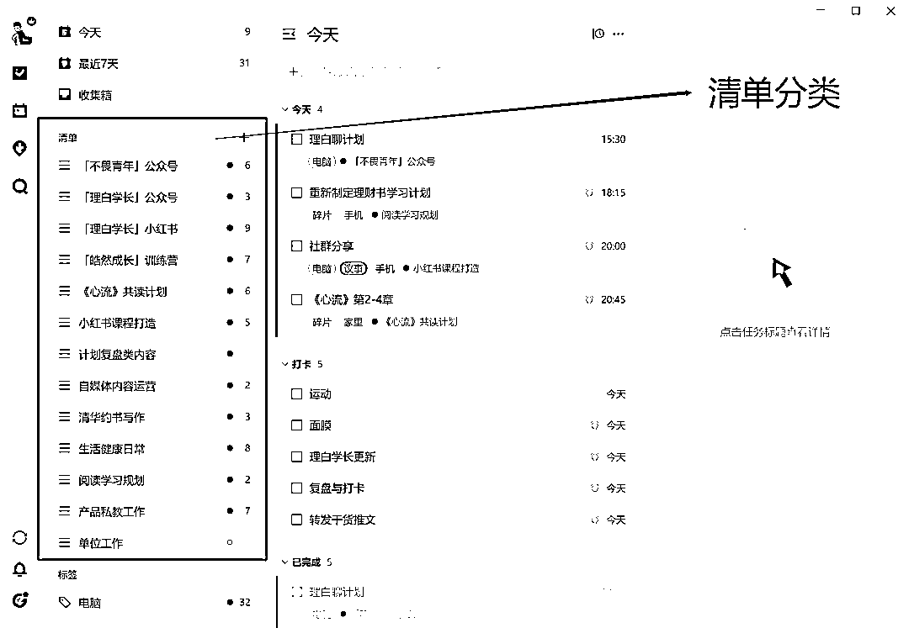

##### 第一步：设定清单类别

首先，把你的几个重要项目，以清单的形式分类设置好，这是方便我们查询某一个具体项目进展进度的入口。

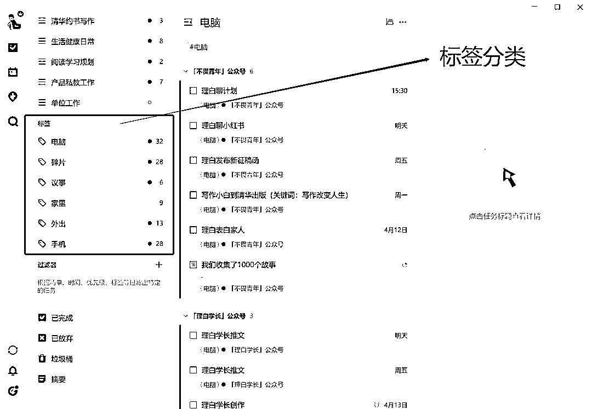

##### 第二步：设定标签类别

任务的使用场景，可以通过标签来进行区分。比如我把标签设置了电脑、碎片、议事、家里、外出、手机这几个板块，那么，无论我在什么环境当中，我都可以快速查到在当下环境中，我适合做的工作有哪些。

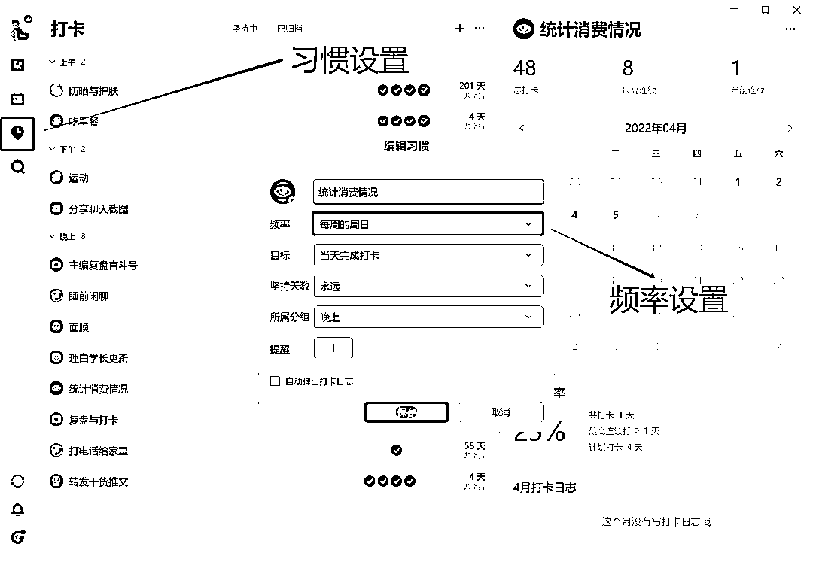

##### 第三步：设定习惯打卡

每天和每周固定会出现的板块，直接设置成习惯，比如要发的朋友圈、健康生活板块等等，习惯可以设置成每天一次、隔天一次，也可以设置成每周一次、每周三次等等形式。

##### 第四步：完成行动规划

结合当周的计划，安排每一天的大致行动，如有变动，可以随时拖动光标调整。已经完成的部分，可以顺手做成时间流的形式，方便复盘的时候回看自己在哪块时间做了哪些事，时间利用效率如何。

#### 「番茄todo打卡」

可以利用「番茄TODO」记录自己的专注时长，且它生成的打卡图真的炒鸡漂亮，还会自动生成金句，给你正向激励作用。

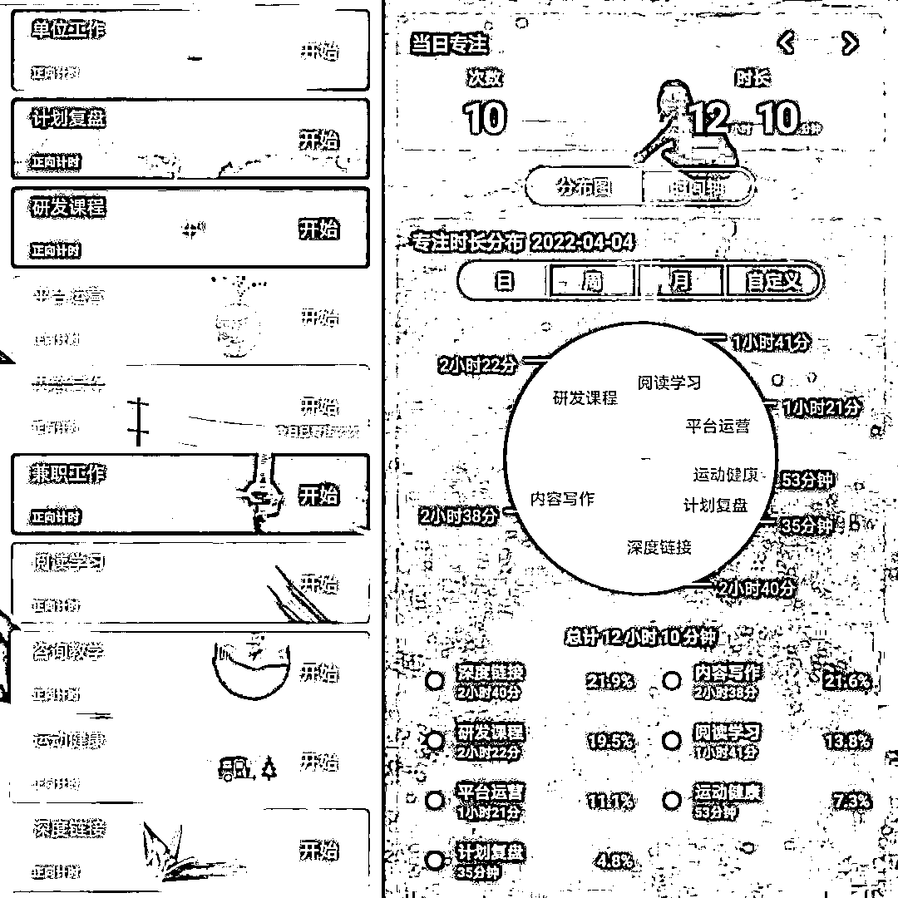

## 2.复盘机制

及时有效的复盘可以让我们找准自己的位置、明晰自己的问题，能让我们更好地完成目标。

接下来，需要大家提前制作自己的复盘模板。

与打卡模板相同，复盘模板同样随时可以变动、丰富、完善、更新，所以一开始的模板粗糙一点没有关系，我们首先要做的，是形成惯性，完成比完美更重要，惯性形成后，逐渐完善我们的复盘工具即可。

复盘模板，给大家提供我的周记模板，大家要结合自己的实际情况来进行周复盘、月总结。

理白周记模板：戳我

理白的建议是：新注册一个公众号、微博或小红书，直接在公域平台上进行复盘。

可以把一周内的日打卡进行汇总，也可重新排列组合。

复盘的原则是：

1.  模板要适用于自己，再高的颜值、再复杂的设计，都一定要符合自己的需求。

1.  做完复盘，要清醒地知道自己处于目标达成的哪个位置，也要明确知道自己未来该怎么走。

1.  要拿出整块时间进行深度思考，不要浮于表面、应付了事。

## 3.曝光机制

我们可以选择在朋友圈、公众号、微博等社交媒介公开自己的目标与计划，曝光行为本身会带来关注，关注会带来压力，压力会带来动力。

## 4.抱团机制

一个人或许可以走得很快，但一群人才能走得很远。有压力的时候，有成果的时候，有思考的时候，及时互动，小伙伴们的相互赋能，会为你保驾护航。

## 5.奖惩机制

奖励机制可以设置成：完成月度目标，给自己买个啥啥啥；完成季度目标，给自己奖励一个啥啥啥。（一定是平时不舍得自己买的又真正喜欢的东东）

惩罚机制可以设置成：如果一周打卡次数小于多少，就在群内发100元红包等等。（一定是要让自己确实肉疼的惩罚机制）

##### 友情提醒

任何机制都要在适合自己的前提下展开，我们当然可以不打卡、不曝光、不复盘、不抱团、不奖惩，一切都要以自我意愿为出发点，任何违背本心的自律手段，都没有意义。

# 三、技巧篇|八句话，降本又增效

## 1.两分定律

我们每天会遇到很多事，大到写一本书、完成一个课题、跑完一场马拉松，小到回一封邮件、去门口拿个快递、随手整理一下书桌。

所谓的「两分钟定律」，就是需要我们在遇事之时，立刻判断这件事需要多久完成，当一件事所耗费的时间不超过两分钟时——立刻做掉。

接到快递消息立刻去拿，想到回个邮件立刻就回——不需要思考这件事的重要性。

因为一旦你没有做，这件事就会一直积压在你的大脑里，时时刻刻占据你大脑空间的某个位置，会增加你的思考压力，降低工作效率。

把能快速做完的事立刻做完，是第一步。

## 2.清空大脑

我们的大脑为什么会疲劳？

因为我们既要思考「怎么做当下的事」，又要惦记着「还有这样那样的其他各种各样的事没来得及做」。

读高中之前，大脑主要用来记忆：背公式、背单词、背理论。

而上大学之后，大脑需要用来思考。

用大脑来记事，太傻了。容易记不住、容易记混，还让自己很累。

所以，才需要我们「清空大脑」。

所谓的清空大脑，指的是我们需要事无巨细地把所有待办事项，逐一放在「收集箱」中。

「收集箱」可以是一张纸，可以是一个本子，也可以是一个Excel表格，更可以是一个好用的时间管理APP（我们要讲的「滴答清单」就自带收集箱功能）。

收集箱的最大功用，是代替大脑，起到「记忆作用」。

这样一来，我们就不需要时时刻刻思考「下一步需要做什么」，随时打开收集箱一查，就立刻知道了。

这样，我们大脑的全部力量，都用以处理关键性任务，而不会在纠结和焦虑中，消磨时间了。

## 3.时间折叠。

碎片化的时间的，特别是那些不需要动脑的时间，可以被折叠。

*   比如如果是在打扫卫生做家务，我就会同步去放一个听课的音频。

*   比如每天晚上固定的泡脚时间和敷面膜时间，我会找最近有卡点的合伙人打电话，帮他们去做梳理和下一步规划。看似我有很多合伙人要交付，实则我利用每天固定的养生时间就交付完了。

*   比如我每天闲着无聊刷短视频或者是刷小红书的时间，我会顺手截图或者是保存下来，当做在咱们的陪伴群里加餐的素材。

*   比如每天吃饭的时间，我是一定要打开一部综艺或者是热播剧去看的，所以很多小伙伴会发现我跟每个人聊天，所有的话题基本上我都能参与，因为基本上市面上的热播剧和热播综艺我都看过，而且都追完了，就是因为我把时间用在了这里。

同一份时间可以折叠出用脑的部分和不用脑的部分，那这段时间就被你高效利用了。

当然，不要同时做两件都需要用脑的事情，我不建议大家一边刷着综艺或者是剧，一边去写一些内容创作，这需要非常高度的聚焦能力。

## 4.时间外包

有一些你不擅长做的事，或者你做起来会心烦意乱的事，或者做起来价值没那么高的事，或性价比比较低的事，都可以外包出去请别人帮你做。

*   比如我的连载小说，都是我给作者提供思路和大纲，然后作者把它完善成细纲，并一章一章把小说内容写好，我发在我的平台上，我们一起分钱。这既满足了我想要创造故事，建立大逻辑大框架，引导人物走向的欲望，又规避了我不想一个字一个字打字的懒惰。

*   比如我的公众号。排版是小助理做的，内容是编辑审的，广告是商务谈的。

*   比如说我锻炼完，以前我会自己用筋膜枪敲敲敲，现在我会直接找一个师傅帮我推。

单位时间内我能够把时间发挥到最大效用的方式，就是找专业的人做专业的事，或我付费请专业的人协助我做更有效率的事。

## 5.时间复利

所谓的时间复利是你还是得沉下心来做一些基础性的，相对无聊，但又有长远价值的事情。

比如学一些最前沿的知识，比如说掌握一些赛道行业的理论，比如说多看一些对自己有帮助的书，或者是多见一些对自己有帮助的人。

包括像健身啊，控制饮食啊，每日坚持喝营养品啊，坚持护肤啊，都不是立马能够看到成效，但长此以往长期坚持下来，会得到复利价值的事。

还是那句话，新手都在学高难度技巧，而老手都在修炼基本功。

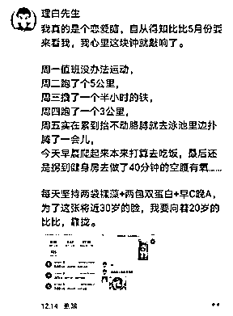

比如健身和护肤。

比如每天在群里做分享。

比如每天的打卡。

相信时间和复利的力量，和时间做朋友，而非做一个短效的人。

## 6.时间颗粒。

时间颗粒是一个新词，意思就是，每个人对时间的感知力是不一样的。

有的人，会把30分钟，也就是一个番茄钟，作为时间颗粒度。

有的人的时间颗粒度会很大，他会把一周当做一个时间颗粒度。

有的人的任务呢，就是用周为单位去执行的，每周给自己做一个核心计划表，一周之内呢，你只要完成了这3~5件事，你就认为这周过得还不错。

有的人是用天的，是每天我要吃掉这三只青蛙，吃掉了之后呢就认为过得还不错，这是以天为单位的。

有的人会以小时为单位，特别是学生党或者是考研复习的这些人群，会规划自己8:00~9:00要做什么，9:00~10:00要做什么，这也是OK的。

总之针对你现在所处的职业环境，工作特点，以及你需要实现的目标的类型去设计，你应该怎样去做自己的每日每周每月规划，每个人的情况是不一样的。

## 7.做好平衡。

我们追求时间管理，本质上其实是在追求高效率，但是这个高效率的背后一定得是：稳定。

不是说我这个周突然开始变得非常的卷，下周就开始躺，这样的状态呢是比较难持续的，你的身体也会吃不消，你的情绪也会受不住，我个人的建议就是用一个相对稳定的姿态去面对未来的人生。

所以需要大家去维持好平衡，维持主业与副业的平衡，维持与工作与生活的平衡，维持职场与家庭的平衡。

这些平衡是在我们日常生活中不断去发现的，平衡的手段有很多啊，比如说限定具体的环境，找到适合的场域，建立自己的sop，都是不错的方法论。

要有应对突发情况的plan b，也要有处理重复性工作问题的sop。

就比如说甄嬛传里的大橘是吧，逢初一、十五要想着去睡大老婆皇后，然后要顾及着华妃的小性子，还要跟自己的白月光甄嬛你侬我侬，偶尔还要去偶遇个什么安陵容啊，淳常在啊，还要去安抚一下敬妃啊，安抚一下端妃，忙得很，也凶得很。

大家在日常工作生活中也要找到，谁是自己的皇后，谁是自己的华妃，谁是自己的甄嬛，谁是自己的端妃敬妃，谁是自己偶遇的小妖精。

跟渣男学时间管理，跟舔狗学目标管理，准没错。

## 8.目标管理。

刚聊完了渣男啊，我们再聊聊舔狗。

目标管理上，请大家一定要跟安陵容学习。

如果以睡到皇帝为核心目标的话，安陵容学了唱歌，学了调香，学了冰嬉，成了后宫最伟大的才艺家、歌唱家、舞蹈达人，还可以委曲求全，总而言之就是，为了一个核心目标，用各种迂回战术，最终拿下大龙。

安陵容可能在情感上，在安全感上，是弱势的，是小家子气的，但她在目标管理上，一定是有大将风度的。

遇到问题，先想怎么样通过一个具体的方法论去解决。

出现卡点，比如说嗓子被人毒哑了，就及时复盘，找到另外一条滑冰的新路径去继续突破。

这就是我们在今年大家需要死磕的点：目标管理就是冷静但不顾一切，投入巨大的时间成本，去完成一个看似微小的目标。

# 四、人群篇|你是谁，就去成为谁

人和人真的很不一样。

比如，理白的盖洛普中，纪律、前瞻、战略都靠前，是一个天生喜欢「做计划」的人，我的每一年、每个月、每一周、每一天，都有固定要做的事儿，如果一天起床，我没有规划好这一天该怎么过，我就会不知所措、浑身难受。

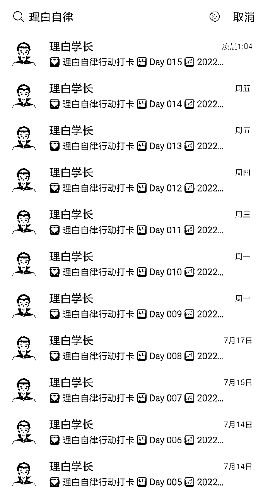

/理白的每日打卡/

但也有一类跟理白完全相反的人，他们讨厌做计划，讨厌把时间计算到分分秒秒，他们更喜欢随心所欲地达成目标，以肆意昂扬的状态，过好一生。

其实，这两种状态都是「自律」的。

因为「自律」从来不拘泥于形式，而是：用自己喜欢的方式，过好一生。

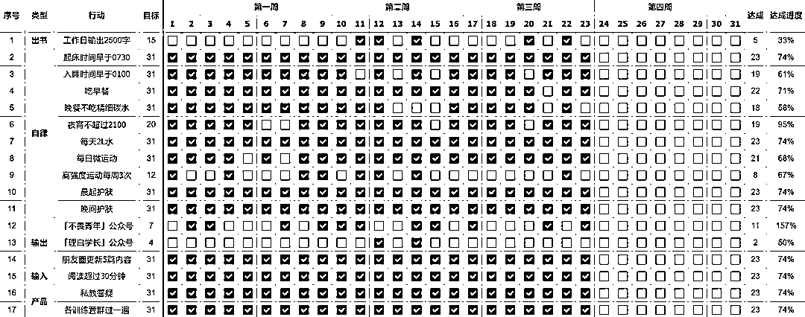

/理白自己设计的打卡模板/

无论是「时间规划」还是「目标导向」，甭管哪种方法，只要能实现自己的富足人生，就都是好方法。

而不同的人群，会有更适合他们的工具和方法。

不同身份、不同人群，有不同的分类模式。

比如，按职业属性区分，可以分为：学生党、上班族、宝妈、自由职业者、斜杠青年等。

比如，按时间充裕程度，可以分为：时间完全可支配者、下班时间支配者、碎片时间支配者等。

比如，按目标清晰程度，可以分为：有目标有方法、有目标没方法、有方向没想好、完全迷茫等。

比如，按目标执行状态，可以分为：坚定信念者、间歇摆烂者、情绪不稳者、他律者等。

不同的人群，无非就是在不同类型之中排列组合而已。

所以，最后一章，来跟大家聊聊：不同身份、不同目标的人群，用哪种自律工具更适合自己。

## 1.学生群体时间管理

聊聊「考试党」。

从职业来看，他们一般是学生党，也偶有上班族和宝妈，想要兼职考一些证书之类的。

从时间来看，考研、考公等人群一般会请假专注复习，考证、考博等人群一般会半工半学，所以这类人群一般要么是时间完全可支配者，要么是下班时间支配者，每天总会有可以被支配的时间。

从目标来看，他们既然决定了要参加一个考试，除了为逃避象牙塔或漫无目的随便报名的人之外，大多人都有了相对明确的目标，也可以通过教科书、辅助资料、辅导视频、线上课程等多重方法达成目标。

从执行来看，考试党是最容易陷入情绪焦虑问题的人群之一，因为他们长时间处于重复单调的生活中，所以在做规划的时候，一定要提前设置好休息时间，不然会让他们的身心遭到双重打击。

这类人群，往往拥有整块的复习时间，拥有不太容易被打扰的节奏，他们要做的是「拆解式规划」，要完成的是「精准时间打卡」。

#### 什么叫「拆解式规划」呢？

比如我的私教学员小光（为保护隐私，本文出现的所有人物均为化名），打算在今年年底考研。

那么，他首先需要做的，就是「拆解式规划」。

横向拆解复习内容：把考研这个目标，拆解成专业课+英语+时政+健康身体+日常生活5大板块，一一规划。

在横向拆解的基础上，继续把专业课按章节区分，把英语按知识点区分，把日常生活的时间计算清晰，比如：

三餐在哪里吃，怎么吃？运动要保持多少的量？洗漱要不要和运动结合在一起？运动可不可以和去吃三餐的路程结合在一起？

把自己的每一天计算清楚，才会拥有「行动惯性」。

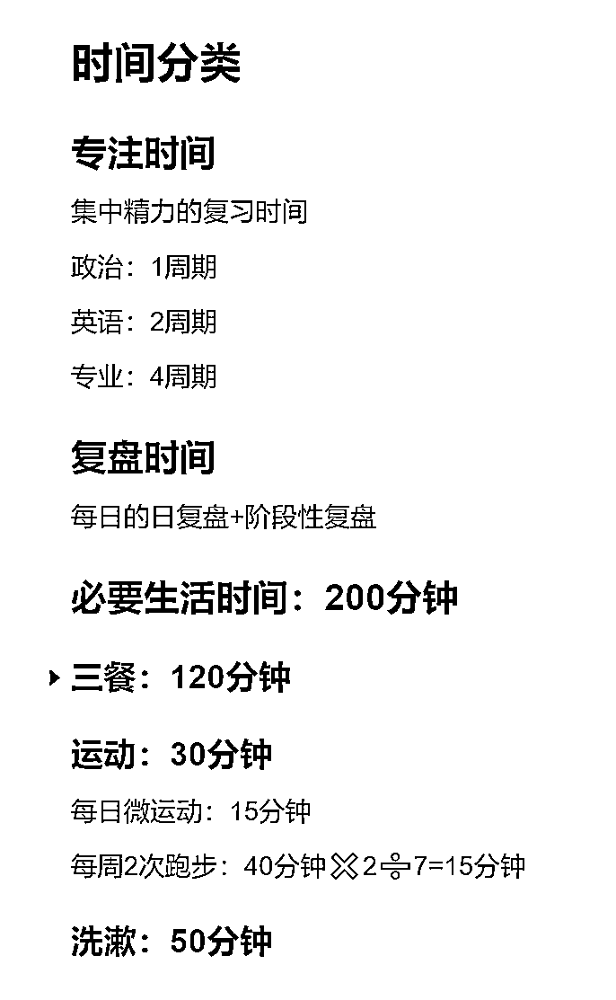

/给小光计算时间/

纵向拆解复习周期：不以时间序列为单位，而把从即日起到考研当日的时间按一轮复习、二轮复习、冲刺复习的阶段进行拆解。

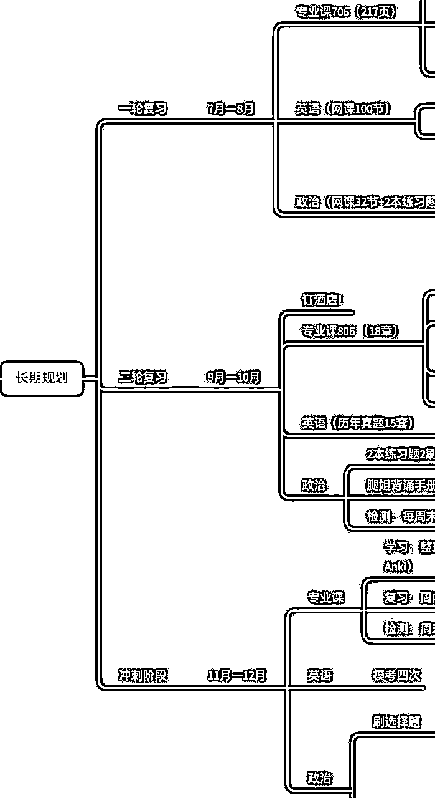

/小光的目标拆解/

在纵向拆解的基础上，要适时给自己设置正反馈机制，比如奖励机制、惩罚机制。

同时，要有阶段性的复盘和梳理，必要时，可以寻求教练的帮助。

我的私教学员小光，就会在适当的时间跟我约适当的服务。

比如前段时间小光的睡眠不太好，我就让他每天单独给我发睡眠记录，直至恢复日常状况。

/监测睡眠/

前期拆得越细，后期执行就会越稳。

#### 什么叫「精准时间打卡」呢？

在「拆解式规划」的基础上，我们需要把时间进行分配。

首先，需要提前给自己设置好每天的「非专注时间」，包括洗漱、三餐、运动、休息、复盘等。

其次，需要提前给自己设置好每周的休息时间，便于劳逸结合，休息时间一般放在周末。

比如，我给小光设计的休息时间，就是在周末，完成模考后，进行周复盘，顺便出去玩，彻底放松自己。

不要觉得考试就是每天24小时不间断背书，好的身体和情绪是一切的基础。

而后，要把一天的时间刨去「非专注时间」后，以番茄钟的形式规范「专注时间」。

比如，下图就是我给小光设计的每日安排。

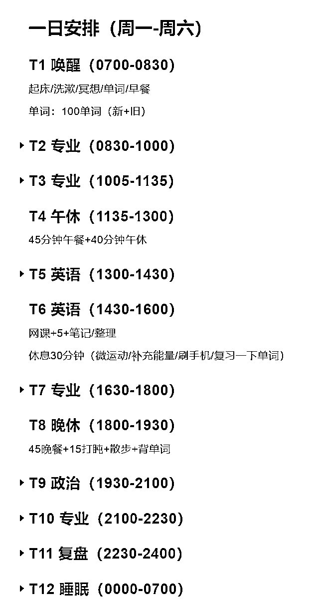

/一日复习/

考试党的生活很简单，不需要「滴答清单」这样的复杂多线程APP工具。

我们只需要制作一个表格，把任务拆解清楚，而后利用「番茄钟」强制进入专注状态，最后每天用手写或使用简单模板的形式进行复盘就好啦。

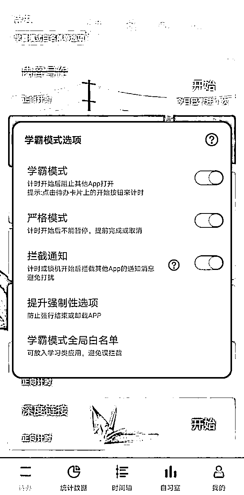

/番茄todo学霸模式/

## 2.宝妈群体时间管理

从职业来看，大多是一边带娃一边工作或者创业。

从时间来看，要么是早起时间支配者，要么是睡前时间支配者，总是时间挤一挤还是有的。

从目标来看，兼顾家庭的同时，有一项核心竞争力的技能或者稳定的工作。

从执行来看，宝妈党因为他们长时间处于琐碎的事务中，很少有属于自我的专注时间，一定要利用好碎片化时间和主动去创造属于自我的时间。

这类人群，他们要做的是「日常清单记录」，然后将代办的事情分别放入到「场景规划」，要完成的是「精准时间段打卡」，然后在不同的时间段进行优化复盘。

#### 如何罗列「日常清单」呢？

比如宝妈小莉（为保护隐私，本文出现的所有人物均为化名），打算工作的同时学会线上写作赚钱。

那么，她首先需要做的，就是罗列「日常清单」。知道自己日常是什么样的状态，才能够制定出适合自己的计划。

比如：洗漱、做早餐、陪孩子吃早餐、送孩子去上学、工作、下班后接孩子放学、做晚饭、吃晚饭、陪孩子、看书、写作。

这一步你要做的把每天大概率会做的事情写下来，也可以加入自己想做但是没有开始的事。

如果没有思路，就根据自己每天起床到入睡的顺序来写。

不用去思考目标会有变化，因为做计划就是为了应对变化，所以只需要思考近三个月内想做的事就好。

趁现在拿出纸或者笔，又或者打开你手机备忘录，把你的日常记录下来，不然你会忘记的。

为什么要把计划列出来？

因为，如果你不做计划，你的预定目标会很容易忘记。

不信，我们来一起做一个实验： 你把下面这三种水果按体型大小排队：西瓜、梨子、李子。

很容易对吧？

接下来，你把下面这七种水果按体积大小排列：苹果、梨子、红毛丹、荔枝、佛手、芒果、灯笼果。 突然变难了。

为什么只有三种水果的时候就会很轻松，我们只是增加了四种水果，就变得费劲了？

因为我们在思考的时候，用到的是我们大脑的“工作记忆”功能，它的容量有限，只有四个单元，再多就会吃不消了。

但是，如果我们把7种水果同时摆放在我们面前，体积大小就会一目了然，同样的，如果把我们每天要处理的事务罗列出来，就会清晰明了多了。

#### 什么叫「场景规划」呢？

《哪有没时间这回事儿》的作者提出来一个概念，把我们的一天根据时间、地点、物品、环境、他人和自己的身心状态6大因素来划分成不同的时间段，就能更高效的完成计划。

比如以学员小莉为例：

05:00-07:00（晨间） 瑜伽，整理清单，看书，写稿

07:00-08:00（早间） 做早餐，叫家人起床，吃早餐

08:00-09:00（通勤） 听课

09:00-18:00（上班）

18:00-19:00（通勤）听歌放松、发呆

19:00-22:00（晚间）晚饭、 陪伴家人、洗漱、准备早餐

22:00-22:30（睡前）和老公聊天、 看书、写稿子

晨间时光，天还未亮，四周一片寂静，没有任何人干扰，属于自由支配时间，可以先做一些基础运动，唤醒身体状态，开始看书写作等学习类事项。

到了早间就要好好和家人互动并享受早餐时光，在通勤碎片化时间，可以听音频课也可以看书。 因为工作之后会消耗大量的能量，所以下午的通勤时光就可以听听歌放松一下。

睡前时光也属于自由支配时间，可以安排学习，也可以增进夫妻感情。

场景规划可以更全面地帮助我们思考执行计划中的变量，高效的安排目标任务。

#### 什么叫「精准时间打卡」呢？

在「场景规划」的基础上，执行过程中我们要做到如实记录，并严格控制截止时间。

皓然自律手册中有讲到，每日打卡最重要的就是做到持续性，所以打卡方式，可以是计划app的截图，可以是手帐的拍照，可以是自律社群的模板，选择你最容易做到的方式，才更容易坚持。

在执行过程中，你会发现除了晨间和睡前的时光完全可控之外，其他的时刻会因人物和环境变化会有突发情况产生，每一次的突发情况都有可能打乱你的计划。

而每日的打卡记录，会让你在周复盘的时候查看到自己的目标完成进度，对突发情况的每一次总结都会增加你对目标执行的掌控感，为你制定下一周的目标计划提供更可行的依据。

长此以往，计划就会成为你缩短现实与目标差距的有效工具，而不是一张废纸。

为什么一定要强制执行任务的截止时间呢？

因为将每一天划分出时间段，其实就是帮助你划清界限，固定的任务在固定的时间段完成，才能保证整体目标的推进。

比如，小莉在晨间时光写文章已经写到了90%，如果继续写就会占用晨间做饭和亲子互动的时间，甚至会影响后面所有任务的进度。 及时停止，让全天计划稳定进行，到睡前写作时，目标只留下了90%时，就会有更强烈的执行冲动。

不要为了某一刻完成目标的爽感，而忽略了整体目标的进度。

宝妈党的生活很简单，不需要「滴答清单」这样的复杂多线程APP工具。

我们制作一张备忘录，把任务拆解清楚，每进入一个时间段就执行相应的任务，每天用手写或使用简单模板的形式进行复盘就好啦。

关于「宝妈党」的时间管理方法就介绍到这里啦，另外，社群中有很多宝妈反馈，在参与自律打卡的同时，把孩子的计划也纳入了进来，让孩子同样取得了不错的成绩。 所以，我们增加了宝妈和孩子的绑定打卡模式。

具体规则如下：

家长可绑定孩子参与打卡，孩子的打卡记录在成人的打卡模板中体现（孩子没有具备完全行为能力），完成打卡目标的孩子，将获得一份盲盒惊喜礼物。

亲子套餐价格是：单人报名价格基础上，每名孩子+50元。 例如：自律营的9月报名价格是299元，亲子套餐价格就是299+50=349元。 备注：如果带两个孩子，就是399元。

## 3.搞钱群体时间管理

我每年都会梳理一次财务状况，进行深度财务复盘，摸清自己一年以来所有的收支平衡，并为第二年的侧重方向打基础。

只有知道自己哪个板块成本最低、收益最高，才能在不断反馈中，找到自己的核心目标，及需要重点投入的项目。

这是我2020年的财富复盘，也是一套方法论，提供给大家。

### 先上思维导图

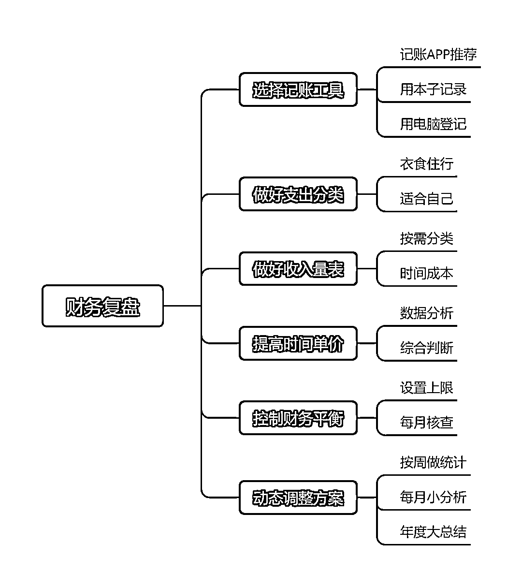

### 选择记账工具

要做复盘，首先要做的就是记账。 如果你没有记账的习惯，就趁这两天放假，把2020年一整年的收支记录整理一下。 有人适合用记账APP，有人喜欢用本子誊下来，有人喜欢用电脑登记——都可以。

*   记账APP推荐：随手记、圈子记账、鲨鱼记账。

*   用本子记录：找到适合自己的手账本就好。

*   用电脑登记：建议用Excel自己做个表。

我自己一直在用电脑登记，有3点原因： 1、我的副业与写作挂钩，电脑使用频繁。2、我的收入来源多，APP没办法完全同步。3、任何模板都不完全适合自己，自己亲手制作的表格最贴心。 适合自己的，才是最好的。

### 做好支出分类

支出记录，大同小异，我做了个思维导图，供大家参考：

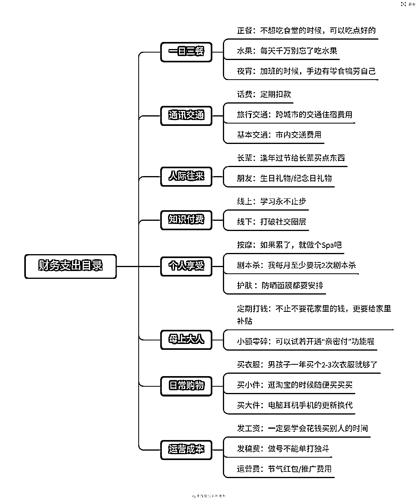

说白了，支出就是衣食住行，只不过，每个人侧重点不同罢了。

比如，

对我而言“吃穿用度”都是次要的，那就放在某个栏目的板块当中；

也许对很多女孩子来说，化妆品的消费是大头，那就把化妆品啊、衣服啊、保养品呀都放在“变美美美”的版块里；

有些朋友早早就有了娃，那“画画的baby”也许就成了你消费的重点，一切都要围绕孩子；

有些朋友崇尚“低欲生活”，那你的支出栏目可以更少……

适合自己的才重要。

### 做好收入量表

请注意，我们一直强调的都是：通过财务复盘，提升赚钱能力，而不是攒钱能力。

所以，收、支，都要记录。

老样子，我先放一个自己收入量表的思维导图：

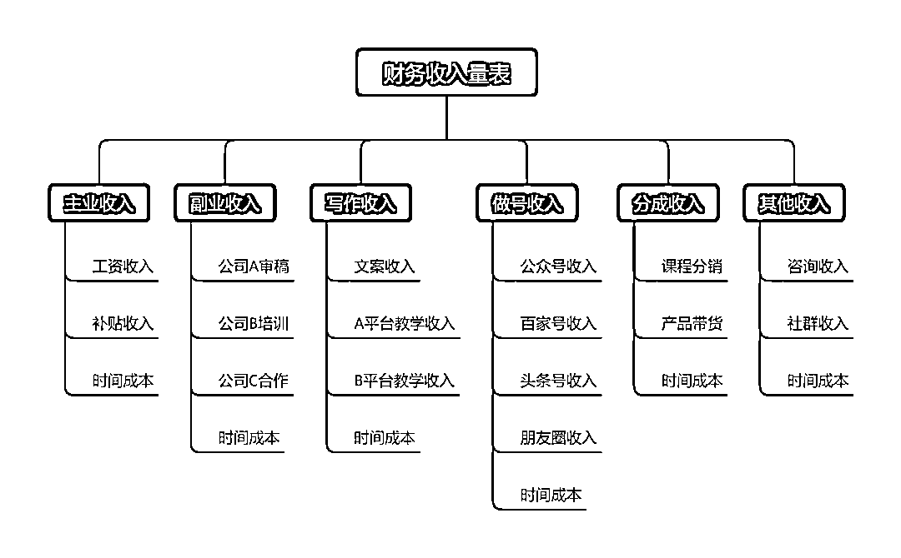

通过这张图，大家可以明确看到，我的收入全部是以“写作”为轴进而衍生出来的，无论是做号、文案、教学还是咨询，都与写作息息相关。对你而言，你的收入来源也一定有自己的分类方式：

如果你单纯是一个投稿作者，你可以把栏目按照“亲子文、职场文、认知文”类别来设计，也可以按“约稿、投稿、比稿”这样的栏目设计，甚至可以按“洞见、十点、有书、不畏青年”这样的平台来设计；

如果你是一个单纯的号主，你可以按“恰饭文、CPC、流量主、赞赏、获奖作品”来设计，也可以按“头条、百家、知乎、小红书、微博、公众号”来设计；

如果你是讲师，你可以按“卖货收入、团队收入、咨询收入、授课收入、会员收入”来设计

……

你的收入来源，是根据实际情况来定的。

但值得一提的是，在收入分类中，每一条都要设计一个“时间成本”，这是为什么呢？ 先卖一个关子，后面就讲。

### 提高时间单价

接下来的内容，是重头戏。

我凭什么说，我靠财务复盘，把收入提高了？

其实，关键就在于“控制”。 收入控制，靠的就是刚才提到的“时间成本”。

一年收入汇总下来，我们会得到这样一个表格：

而一年的“时间管理”，还可以得到这样一个数据：

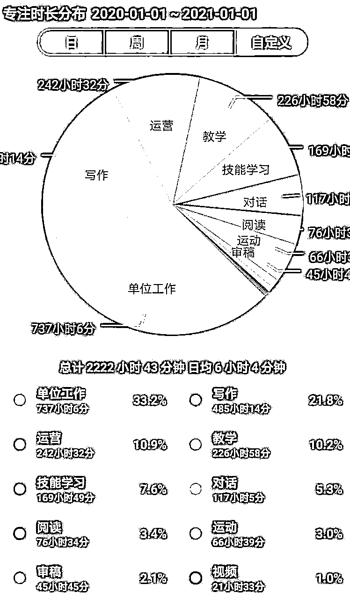

用收入除时间，数据不会欺骗你：

我把这几个数据，称为独属于你的“时间单价”。

发现了吗？

你的有心栽花，并没有带来应有的收益；

你的无心插柳，反而让你走向人生巅峰。

你对时间的控制越“精细”，得到的结论就越“准确”。

当然，计算“时间单价”，并不是唯一的决策依据。

你的情感投入、你的热爱程度、你的联动能力以及隐形价值，同样重要。

但计算“时间单价”，可以对自我有更清醒的认识，不然，忙忙碌碌一整年，一觉起来等于零，必然不是你想要的未来。

### 动态调整方案

我的财务复盘一般是这样进行的：

1、每周用Excel做好统计，不做过多分析。

2、每月在进行整体月复盘的时候，把财务作为一个子项目进行简单思考。

3、大型财务复盘，我一般都是放在年末或年初进行，目的是梳理前一年的财务状况，并依托“时间单价”及“支出控制”制定新一年计划。

你依旧可以选择适合自己的方法。

相信我，如果你还没有做财务复盘的习惯，就赶紧行动起来——你的数据和结论，也许会让你大跌眼镜，但也一定会带给你惊喜和新的可能性。

在这里，我想提醒的是：

如果你的工资过于稳定、收入结构也过于稳定，那说明你的岗位已经是一个日渐饱和的岗位，你更需要熬的是“资历”而非“能力”。这样的岗位没什么不好。

但，如果你对未来还有信心，对自己还有期待，我依旧建议你找到那些“熬能力”的工作。

特别是，你还是学生，你还没有那么多社会责任，你还有选择的机会，你还有兼职试错的可能。

哪怕每个月的收入不稳定，只要做好复盘，都会有一个整体向上、向好的态势。

更关键的是： 在这个过程中，你会拥有“掌控自己”的能力，也会养成“善待财富”的习惯。

这项能力、这个习惯，你将受益终生。

# 结语

自律不是标签，而是习惯。

自律不是目的，只是手段。

从依赖工具到适应工具，从掌控工具到脱离工具，每个人都可以用三个月的时间，狠狠完成一次蜕变。愿我们都能用好自律工具，实现想要的人生。