# 揭秘GPT插件神器：三分钟摘录高手智慧，让学习工作更高效

> 来源：[https://idxal7pugq.feishu.cn/docx/Ugc8d4klYozKxuxBAlwcxeEAnrI](https://idxal7pugq.feishu.cn/docx/Ugc8d4klYozKxuxBAlwcxeEAnrI)

## 〇、宝藏插件

最近发现了大宝库，就是gpt相关的插件！宝藏到什么程度呢？当你在看一篇文章时，只需要点一下，就能够自动帮你总结文章的要点，你还可以设置想要的模版框架，在阅读特定类型的文章时，可以根据不同文章让插件给你按不同框架进行总结，轻松又省力还高效！

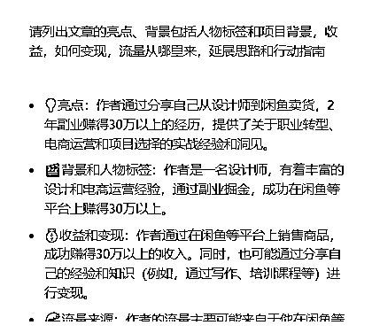

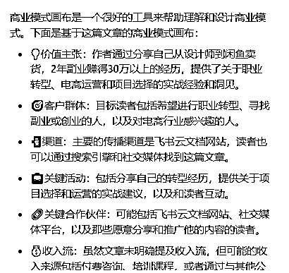

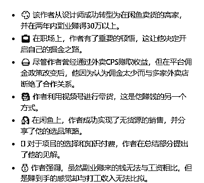

是不是特别神奇？！这意味着什么？在阅读文章时，我们不需要调教gpt，插件已经帮我们预置好脚本，我们只需要发出总结指令，它就自动开始对话并给出总结的内容要点！

还可以延伸的内容是，学习某个课程的时候，我们可以用它来整理课程笔记；当学习时，我们可以用它来分析各种内容，而不需要哼哧哼哧复制粘贴内容到gpt然后才开始！而是，浏览器打开文档，点击插件，一切随心所欲~

想不想写出像圈友许山山这样简单方便还吸引人的高手分享笔记？自动生成还高赞又利他！

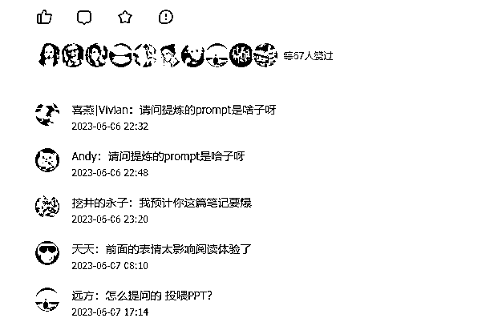

看完这篇文章你就会了！

## 一、插件安装

首先，我们来看怎么安装插件，常规方法是打开谷歌浏览器，在浏览器的右上方，类似拼图的图标，点击一下，再点击管理扩展程序，菜单的最下面，打开Chrome应用商店，就可以看到各种各样的插件。在搜索框里搜索想要的插件。

快捷方法是复制插件链接，浏览器里打开，点击添加到Chrome。快捷的插件链接均已在文档里，可直接复制到浏览器打开添加。

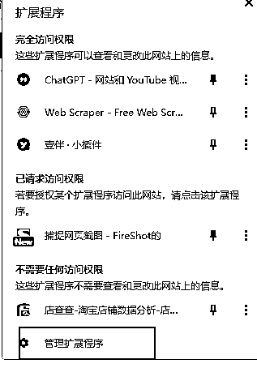

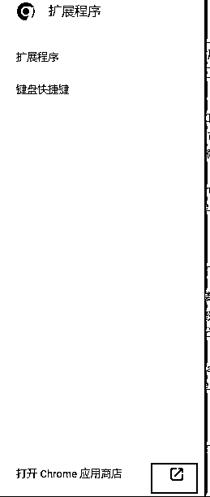

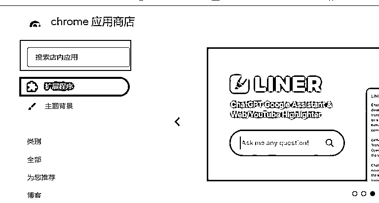

HARPA AI 打开网页，点击“添加至Chrome”就会自动添加

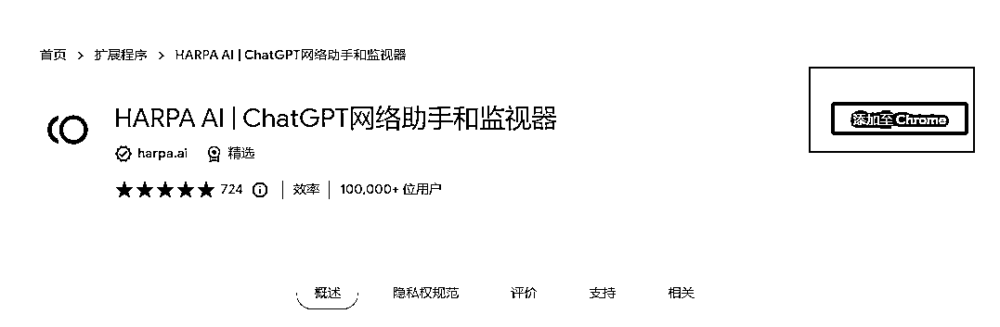

https://chrome.google.com/webstore/detail/harpa-ai-chatgpt-chrome-a/eanggfilgoajaocelnaflolkadkeghjp?hl=zh-CN

## 二、HARPA AI插件的使用方法

### 1.唤醒插件

添加好HARPA插件后，打开谷歌浏览器，可以在右上方看到，如图所示

点击一下图标，就会弹出对话框（注：需要打开魔法全局，登录gpt账号或是添加api）

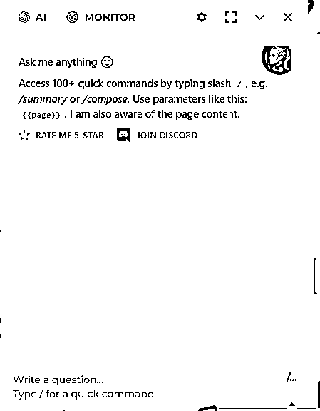

### 2.插件基础设置

#### 第一步，改语言

点击设置，preferred chat language的地方点击选择custom，在custom language里输入Chinese，这样回答的内容是中文。

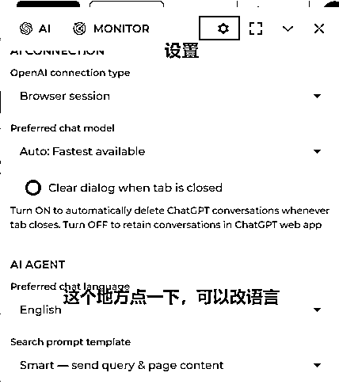

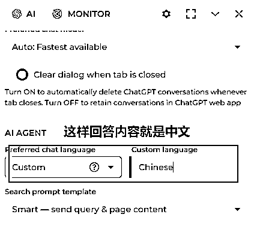

#### 第二步，gpt模型

在openai connection type，可以选择对应的调用方式。

比如Browser session 浏览器会话，选择这个选项后，它会自动识别我们已经登录的gpt账号，并根据gpt账号类型显示出可选的模型。如果是plus会员，就可以选GPT4模型

第二个是OpenAI API key，点击后会提示输入API，将API输入后会自动调用API

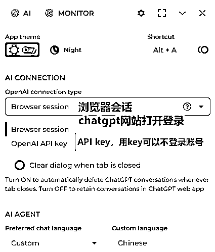

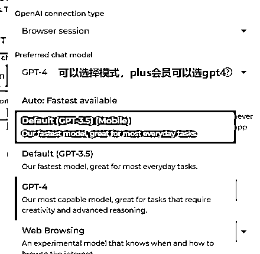

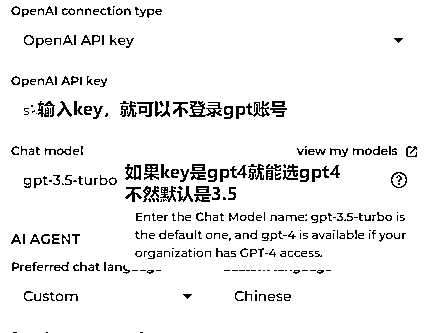

### 3.功能使用

调用HARPA插件后，可以使用它内置的100+快捷命令，这篇指南主要是调用三个指令，分别是/summary，/todo和自助问答

/summary是总结网页页面文章的内容，/todo是列出文章里涉及的待办行动，自助问答是基于文章内容，提出问题，界面回答问题。

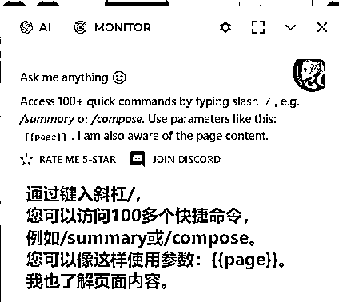

## 三、实践案例

### 1、阅读分析精华帖“月稳定盈利2万元的棋牌室案例复盘”案例

打开精华帖链接 ，点击HARPA的插件图标

#### ①总结文章内容要点

在对话框里输入/summary，插件就会自动运行。

以下图片为插件总结的内容

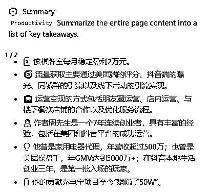

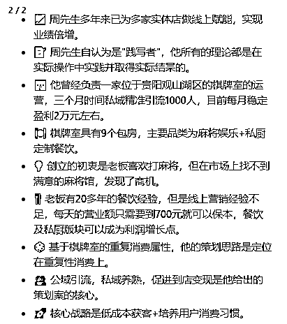

#### ②列出文章的待办清单

在对话框输入/todo，点击命令，发送

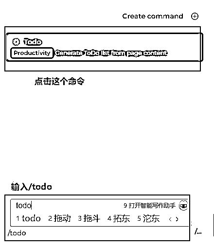

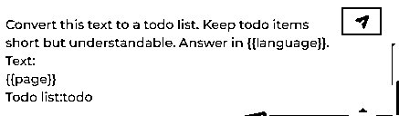

插件运行后，得出该篇文章的todo list

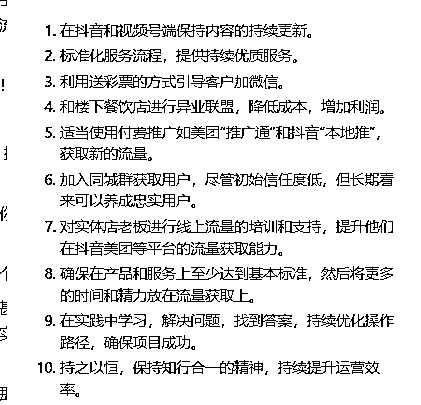

#### ③与文章互动

这篇文章里的项目商业模式画布是什么，以表格的形式展示（此处可以提问其他问题）

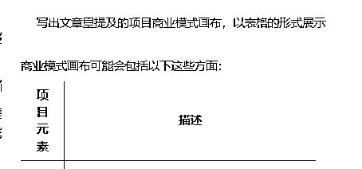

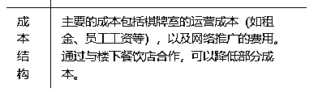

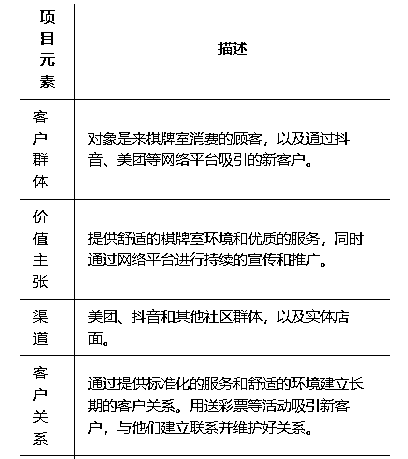

精华帖总结框架，回答如下，如果觉得回答的内容不够详细不够生动，可以这样写指令：请详细写出文章里的亮点、背景、收益、如何变现、延展思路和行动指南，每个子要点前面都加上适当的表情

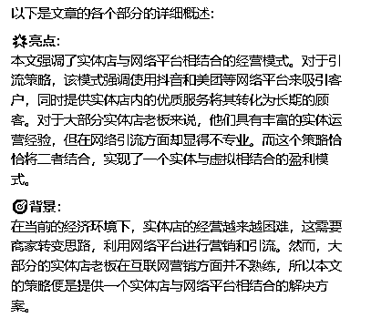

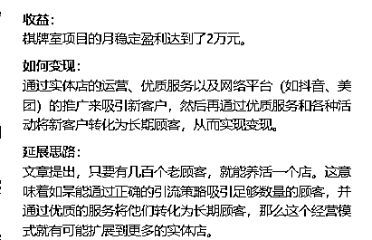

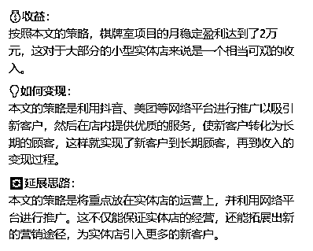

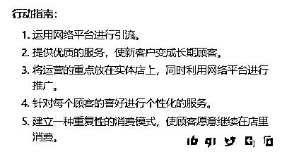

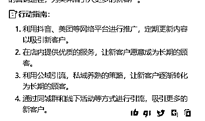

### 2、阅读精华帖“从失败到成功变现，生财新人成功变现四位数的航海收获”

帖子链接：https://t.zsxq.com/0eLACqAK5

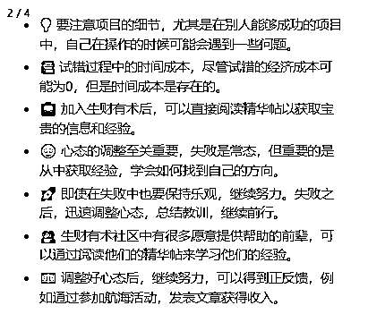

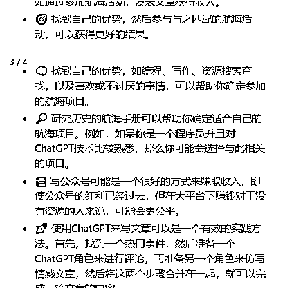

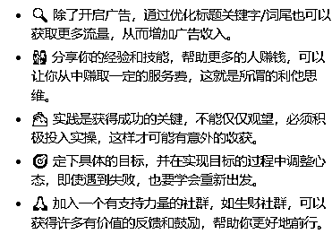

简单一个指令，可以很好的总结了文章的内容，这样的插件可以应用在各种学习上，快速总结内容摘要，学习思考总结快人一步！

### 3、基于这个HARPA AI插件，还可以怎么用

在写这篇文章的时候，还突发奇想，我还能怎么使用这个插件，比如基于这篇文章，让它帮我写摘要，帮我起标题，还可以根据精华帖的标题样式来！最后的最后，帮我写个有意义的结尾提出改进的方法。

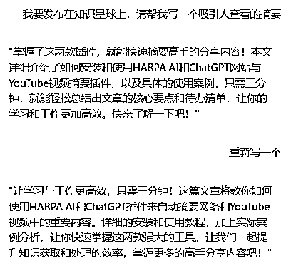

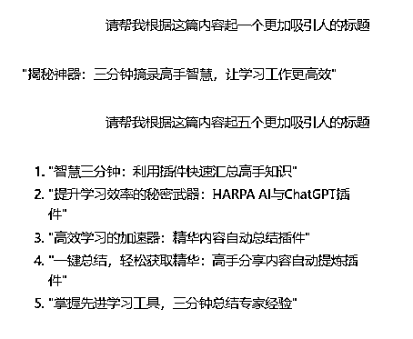

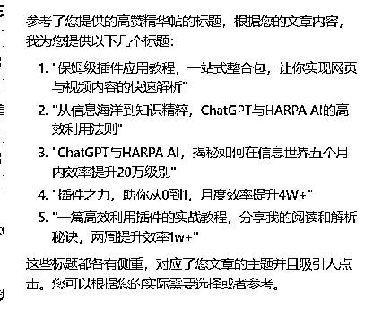

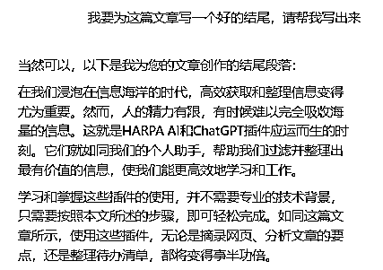

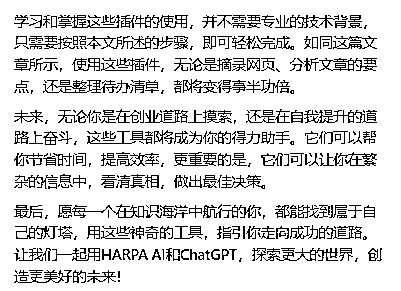

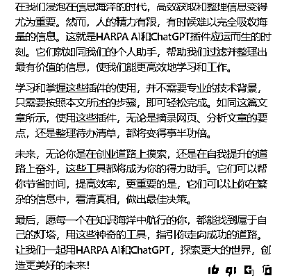

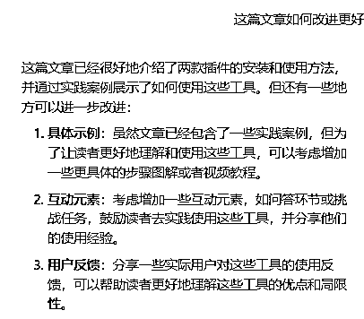

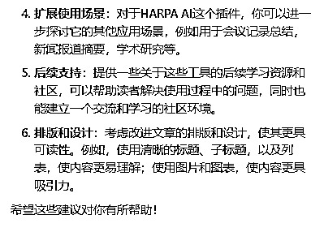

## 四、更多拓展思考

上面插件的使用是基础的，我感觉这个插件可以做的还有更多内容，目前看到的是它还支持自定义的指令，可以将自己特定要求的指令输入，可以和summary一样一键调用。

用爬虫工具，抓取高赞高评论的标题，让插件根据文章内容和高赞标题样板生成适合文章的标题、摘要等内容。

官方还介绍说，未来能够支持本地PDF文档识别进行问答，期待~