# LeiaPix Converter ：免费将图像 2D 转换为 3D

> 来源：[https://esouqpttmy.feishu.cn/docx/V3NWdI08Yo4R9lxcIdScEMwanWb](https://esouqpttmy.feishu.cn/docx/V3NWdI08Yo4R9lxcIdScEMwanWb)

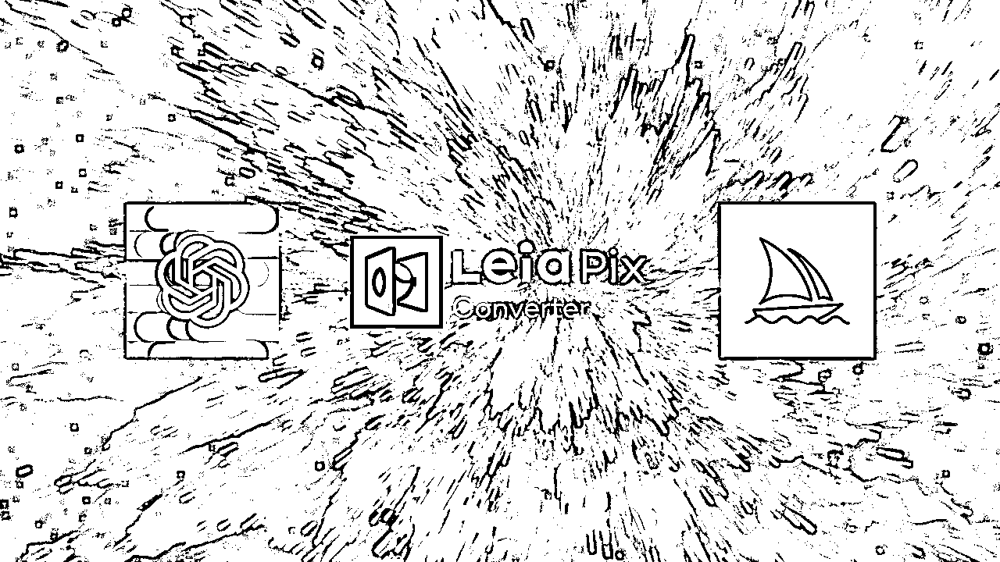

LeiaPix Converter是一款免费的在线图像处理工具，可帮助用户将2D图像实时转换为精美的3D光场图像。它使用由Leia开发的专有算法，为照片、插画和艺术作品等2D图像添加深度和立体感。目前，LeiaPix Converter 是完全免费的。下面让我们使用LeiaPix Converter探索照片中的3D世界！

## 本文包括两个部分：

LeiaPix Converter 的介绍及基础使用

ChatGPT + Midjourney + LeiaPix 实操做一个视频

## LeiaPix Converter 的特点

多格式转换：LeiaPix Converter支持将多种图像文件格式转换为LeiaPix格式，包括JPEG、PNG、BMP、GIF等。

高质量深度图像转换：LeiaPix Converter使用深度学习算法根据场景计算深度信息，将2D图像转换为具有逼真景深感的3D深度图像。

自定义调整：LeiaPix Converter提供各种参数（如视差和景深）供用户自定义所转换图片效果。

快速转换： LeiaPix Converter采用高效算法快速将2D图像转换为3D深度图像。

用户友好界面: LeiaPix Converter 的用户界面简单直观，易于使用而不需要专业技能。

## LeiaPix Converter 如何使用

访问 LeiaPix Converter 官网

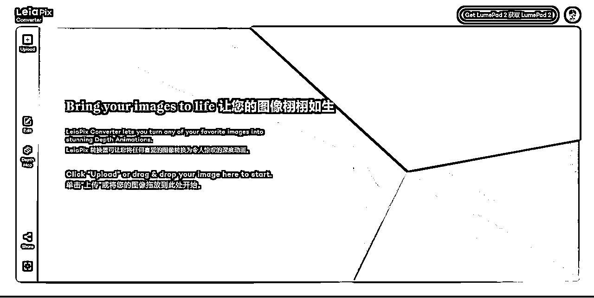

点击“上传”按钮上传，或者直接拖拽一张要转换的2D图像进来。

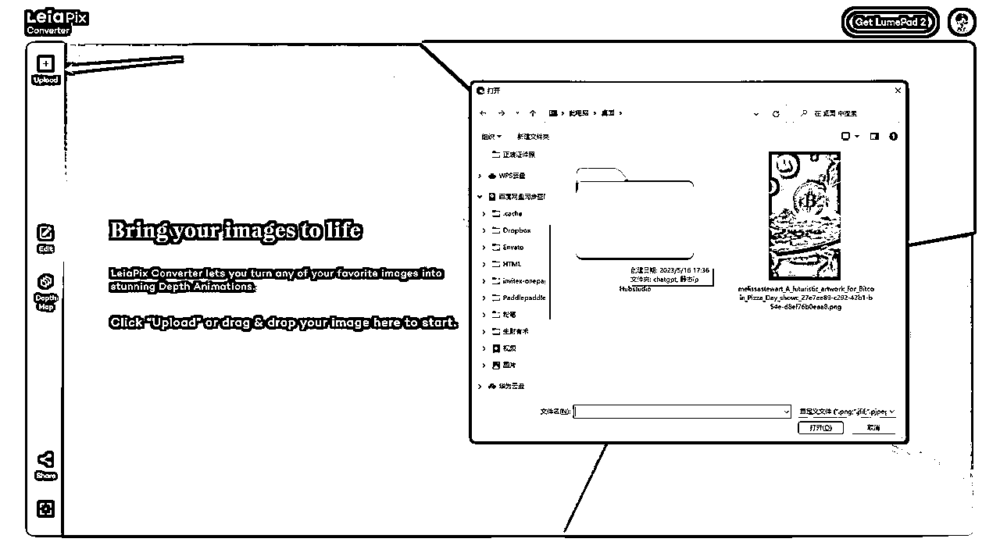

单击“编辑”，调整几个选项以获得所需效果，包括：

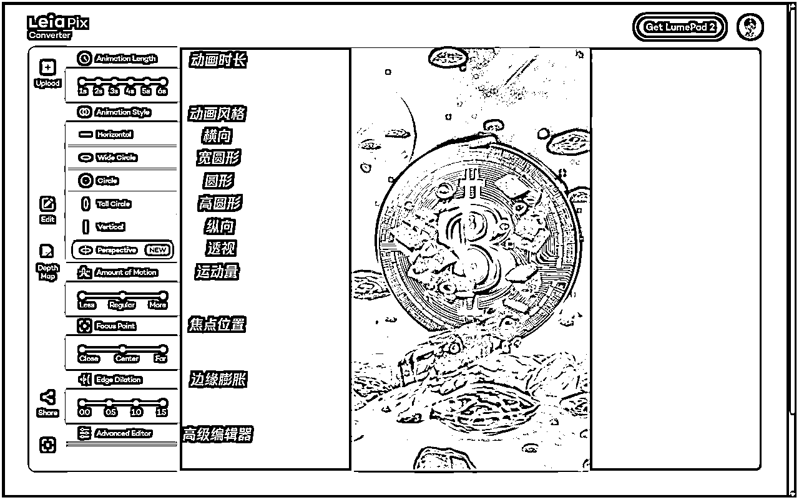

动画长度：1,2,3,4,5,6秒

动画风格：横向，宽圆形，圆形，高圆形，纵向，透视

运动量：小，中，高

焦点位置：右，中，左

边缘膨胀：0--1.5

高级编辑器：振幅-X，相位-Y

单击“深度图”，调整图像深度和立体效果等。

单击 “分享” 按钮查看生成的3D效果，支持多种格式下载。

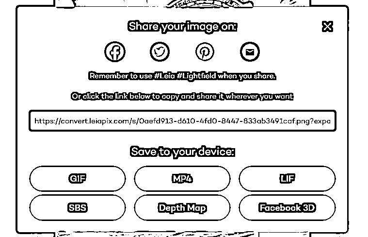

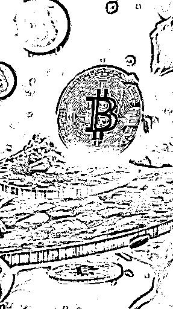

## 应用场景

### 动态壁纸

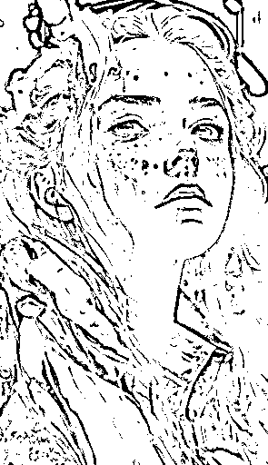

### 动态头像

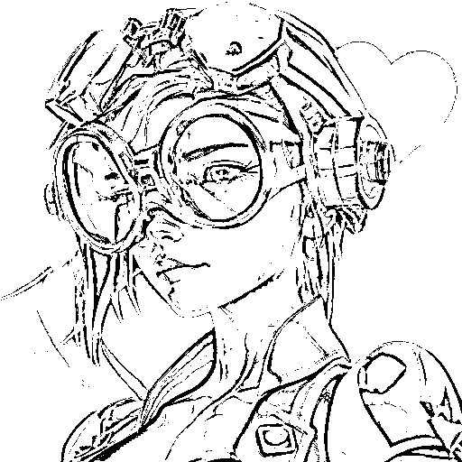

### 动态logo

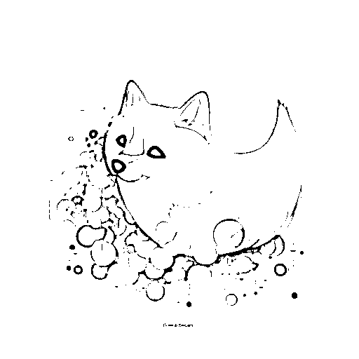

### 建筑与室内设计

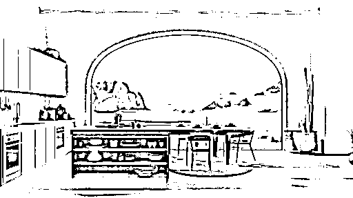

### 广告和营销

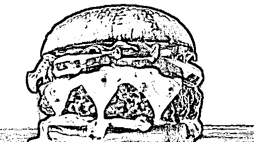

### 艺术与摄影

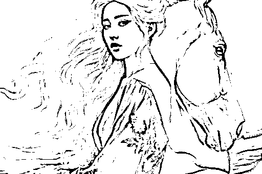

### 游戏

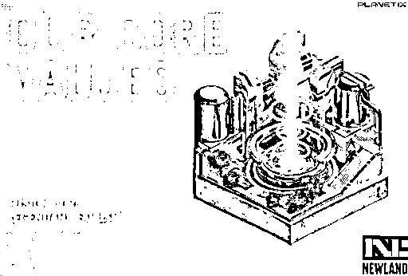

等等。。。

## LeiaPix Converter 技术原理

LeiaPix Converter 的实现原理基于Leia 公司的专有技术和硬件，包括LeiaLoft软件和LeiaDisplay硬件。 LeiaLoft软件可以将2D图像转换为3D光场图像，而LeiaDisplay硬件可以显示3D光场图像。用户可以直观地感受到图像的立体效果。

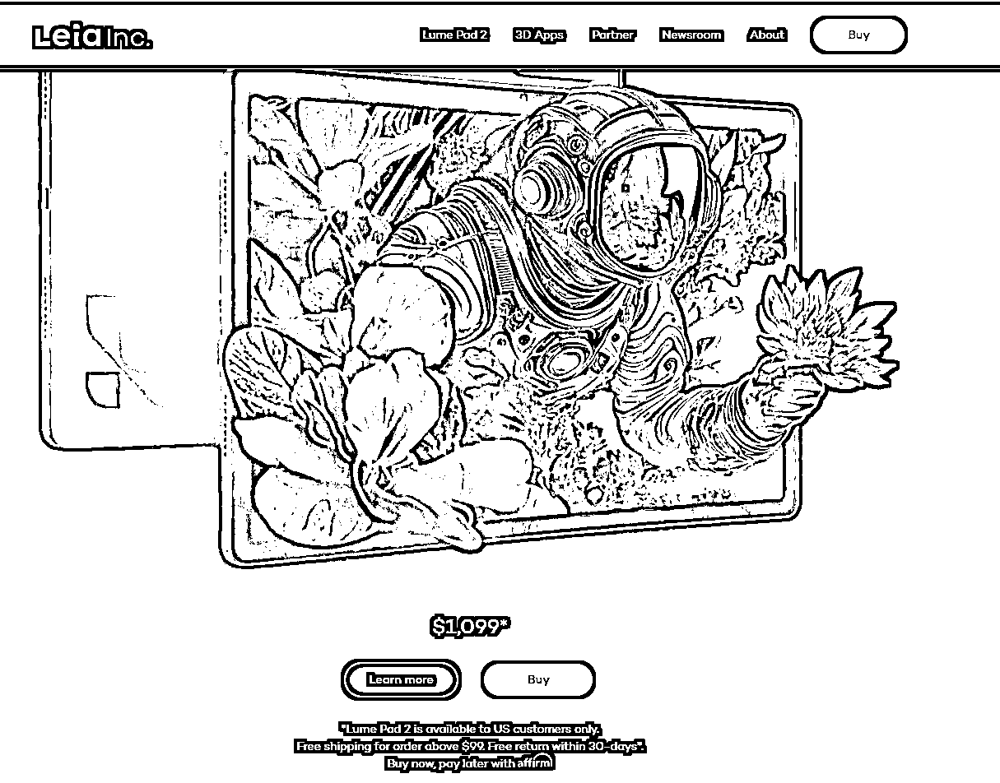

## LeiaPix Converter对行业的影响

*   降低 3D 内容创建的成本和障碍

LeiaPix 的出现使得将2D图像转换为3D效果的过程变得简单高效。它降低了3D内容创作的成本和技术门槛，让更多公司和个人轻松地创建高质量的3D内容。这有助于在各个领域推广和应用3D技术。

*   促进创新和多样性

LeiaPix 通过将2D图像转换为3D效果，为艺术家、设计师、摄影师和其他创意人才提供了一种新的创作方式。这有助于激发创新思维，促进各行业的发展，并为观众提供更丰富、更多样化的视觉体验。

*   提高工作效率和产出

LeiaPix 的快速处理速度和易用性可以帮助企业和个人在更短的时间内完成3D内容创作。这有助于提高工作效率，降低生产成本，并增加总体产出。

*   扩大3D技术的应用范围

随着LeiaPix Converter的推广和应用，越来越多的行业采用3D技术来改善产品和服务。从电影制作、游戏开发到建筑设计和广告制作，LeiaPix Converter为这些行业带来了新的机遇和挑战。

*   推动人工智能技术发展

LeiaPix 的成功应用展示了人工智能和深度学习技术在图像处理领域中巨大的潜力。这将进一步促进人工智能技术的研究和开发，为未来科技创新提供更多可能性。

## 实战：做一个小视频

步骤流程如下：

首先，使用ChatGPT创作一段小故事。接着，将该故事转化为视频脚本，并将其分割为各个镜头。通过镜头描述，运用Midjourney提示词来绘制每个画面的想象图，然后将每个画面输入LeiaPix，将2D图像转变为3D立体效果的视频。重复这个过程，直到得到所有3D画面的视频。最后，将所有视频片段连接在一起，并添加字幕进行朗读。同时，为视频添加背景音乐以增添氛围。完成这些步骤后，就大功告成了。

### 步骤一：创作小故事

使用ChatGPT编写一段小故事。

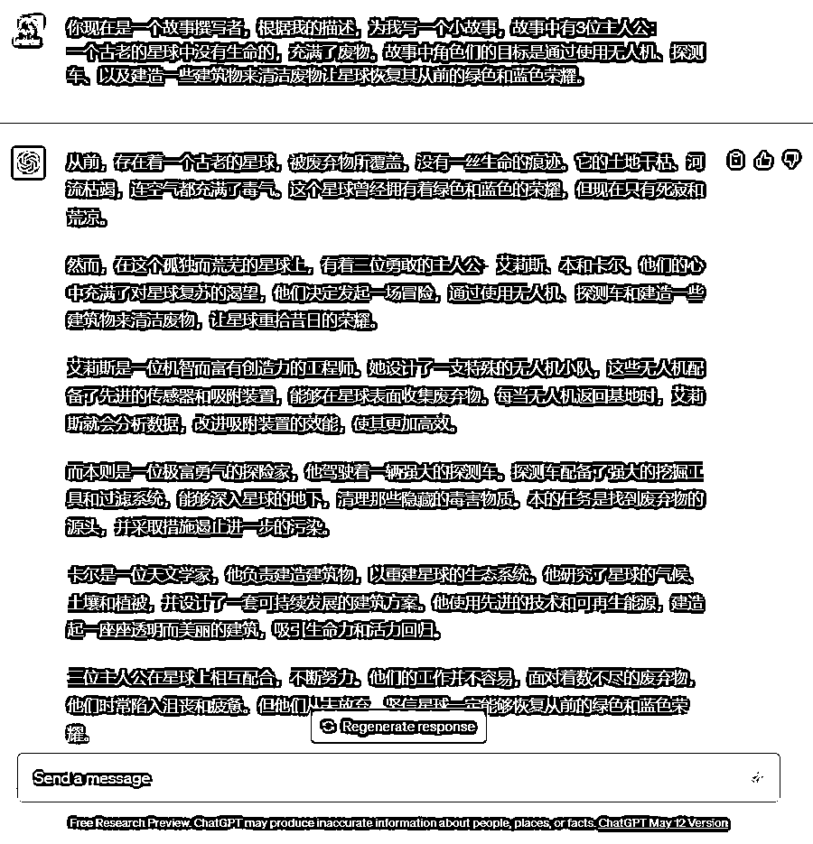

### 步骤二：编写视频脚本并切分镜头

将小故事转化为视频脚本，包括场景、音乐和镜头描述。每个镜头描述一个特定的画面。

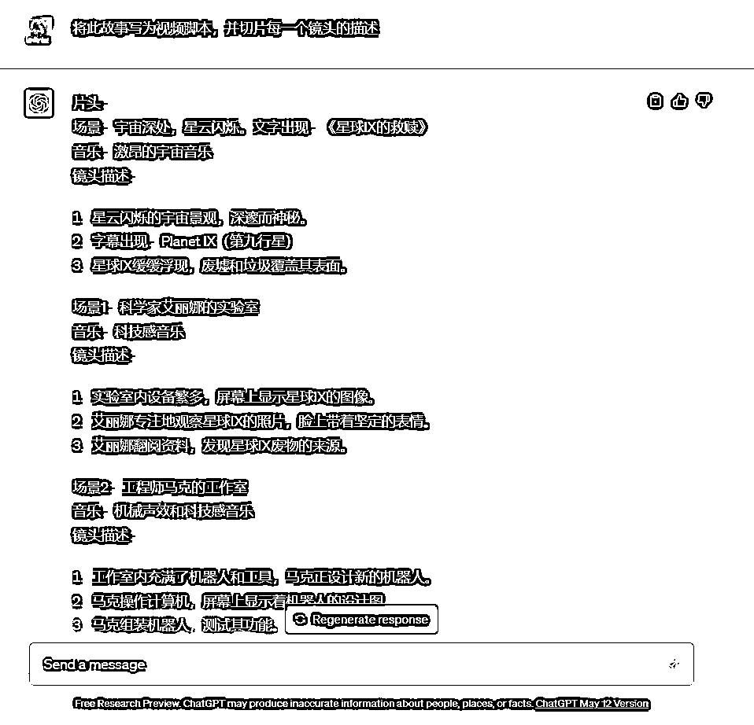

### 步骤三：绘制Midjourney提示词

使用Midjourney提示词为每个镜头绘制想象图，以便更好地理解和表达镜头的内容。

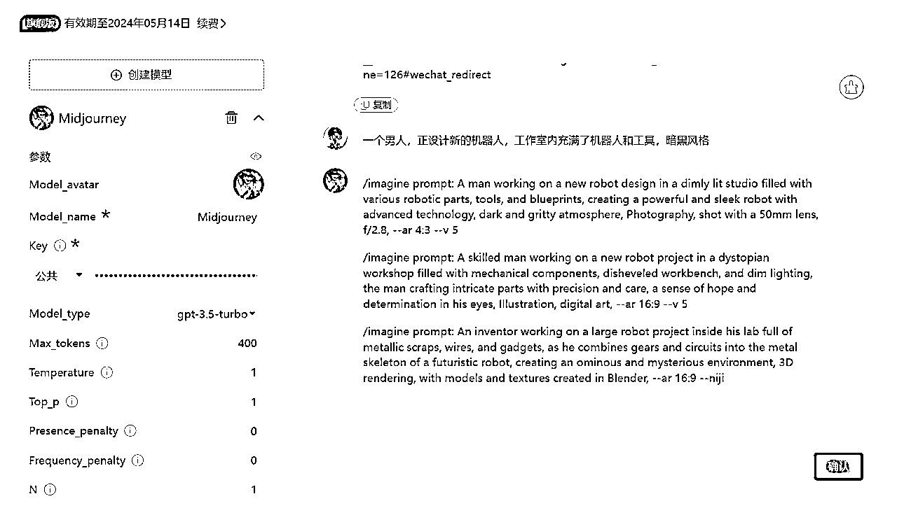

上图中这个工具，是一个我写的用来输出 Midjourney 描述词的 ChatGPT prompt，已经打包为了 AI 小应用（微信打开）：https://zelinai.com/s/kavvHSjs2nZSiufjajw2vT

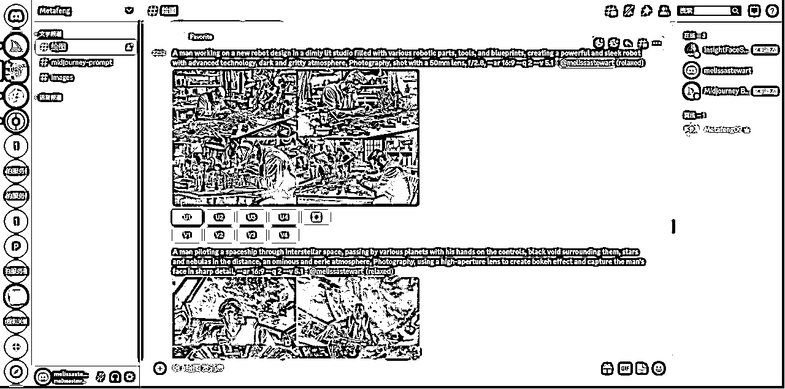

### 步骤四：将画面转为3D立体

利用LeiaPix将每个画面转换为3D立体效果的视频。

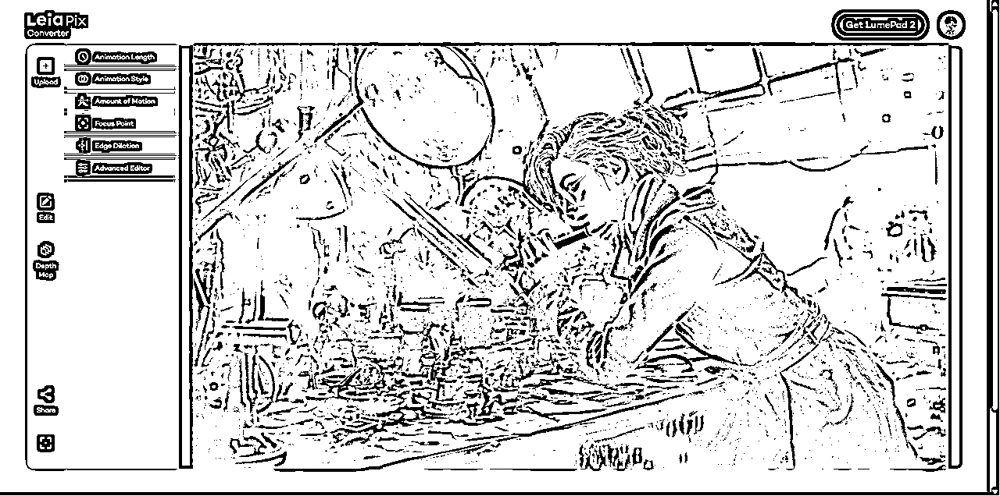

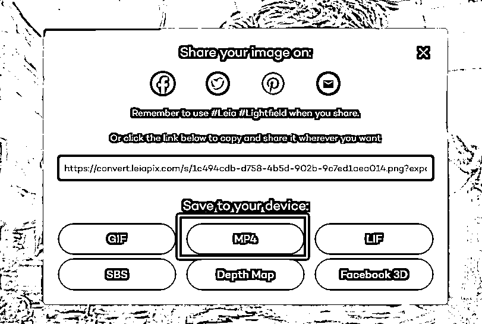

### 步骤五：重复步骤三和步骤四

重复步骤四和步骤五，直到所有画面都被转换为3D立体视频。

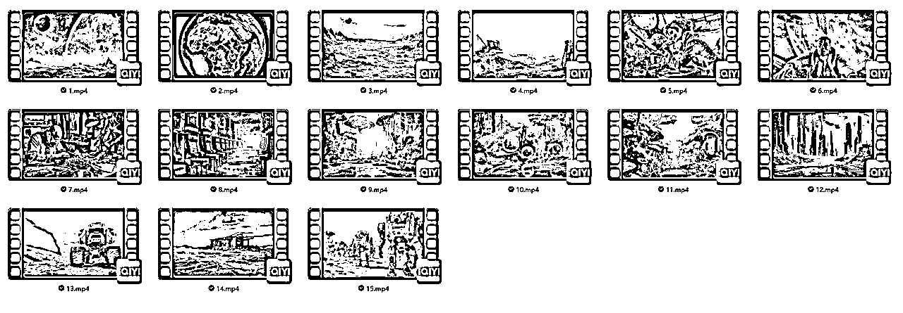

### 步骤六：连接所有视频片段

打开剪映，将所有3D画面的视频片段连接在一起，根据故事情节以及实际出图效果将它们排序。

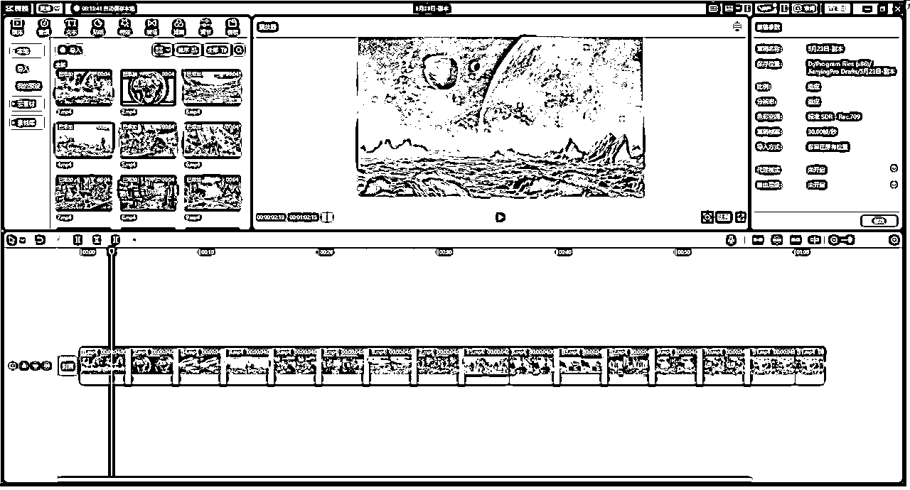

### 步骤七：添加字幕和朗读

为视频添加字幕，并进行朗读以便观众更好地理解故事内容。

选择文本，智能字幕，文稿匹配

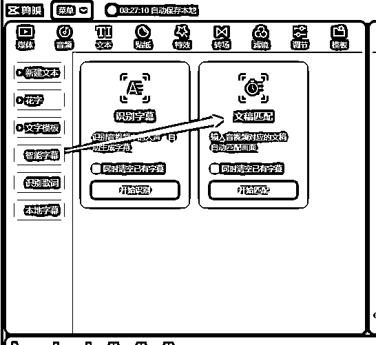

把我们的故事复制粘贴进去，等待匹配完成。

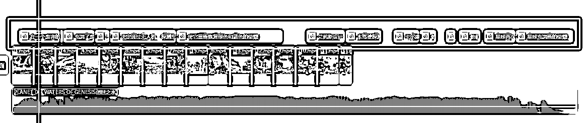

PS：输入文稿之前，需要先随便添加个音频进去，否则会识别失败。

朗读字幕，全选所有字幕，到朗读标签下，选择一个音色，开始朗读，即可为所有字幕匹配声音。

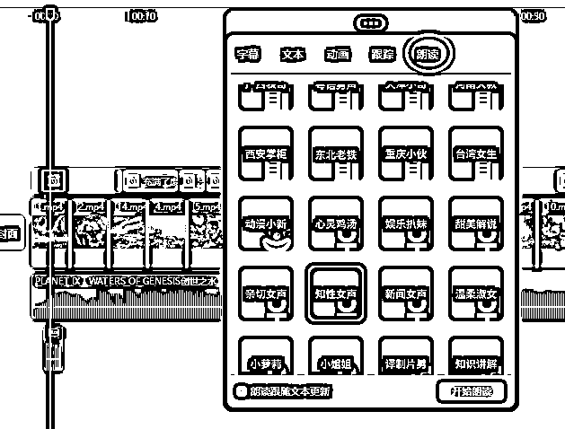

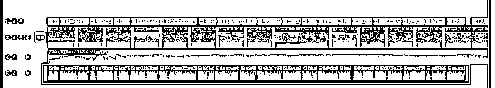

### 步骤八：添加背景音乐

为视频添加合适的背景音乐，以增强氛围和情感。

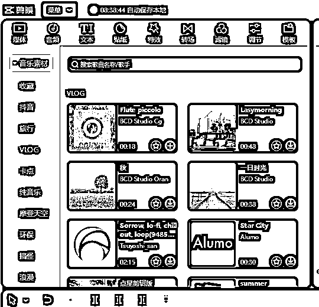

### 步骤九：完成最终视频

添加一些其他标题，转场，滤镜之类的内容。将所有步骤完成后导出视频。

整个流程结束，Show time！

整个过程下来，思路都是比较清晰的，只不过 Midjourney 出图是随机性的，要想达到自己脑海中想要的风格，可能要花点心思。我是利用 ChatGPT 来帮我写提示词，这里面我认为就是大力出奇迹，要么就得自己提示词功底特别强，能准确描述自己想要的画面。

LeiaPix Converter快速易用，提高了工作效率和产出，并扩大了3D技术的应用范围。它的成功应用推动了人工智能技术的发展，为未来科技创新提供了更多可能性。通过使用ChatGPT、Midjourney和LeiaPix Converter，我们可以创作令人惊艳的3D视频作品，探索图像背后的立体世界。期待未来LeiaPix Converter和类似工具的创新，为我们带来更多视觉艺术的惊喜和创造力。

参考资料：

https://aitoolmall.com/image/leiapix-converter/