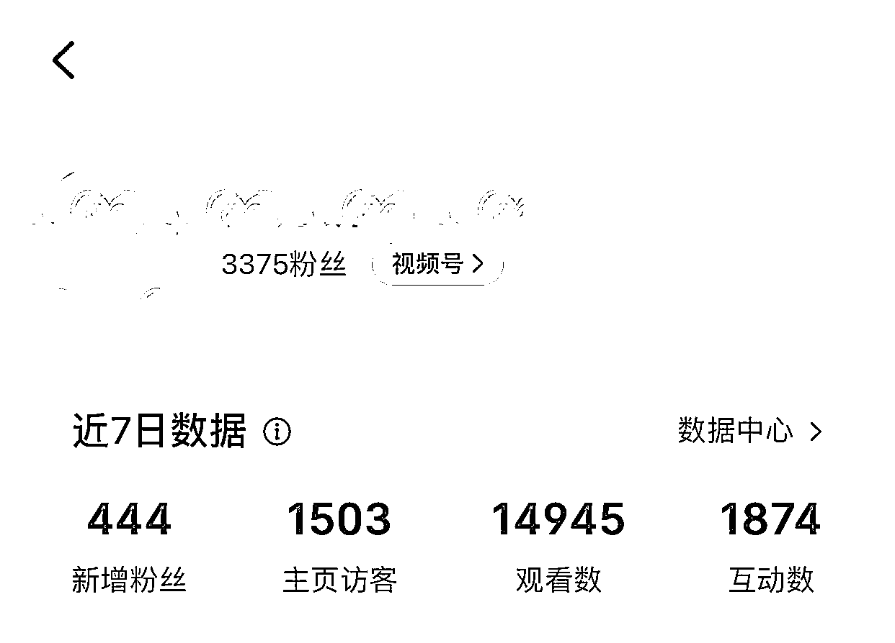
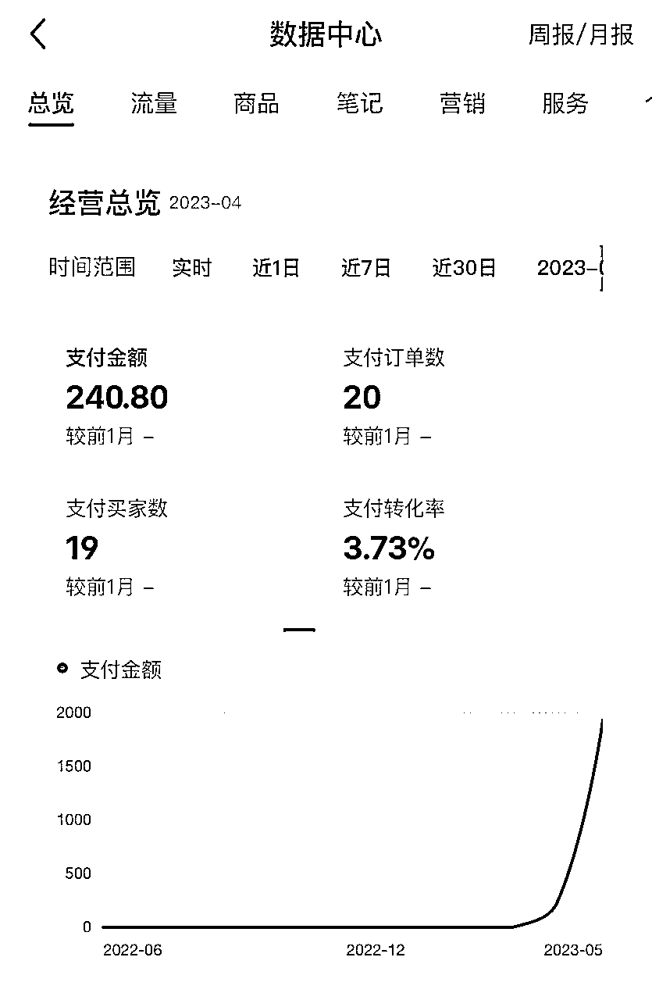
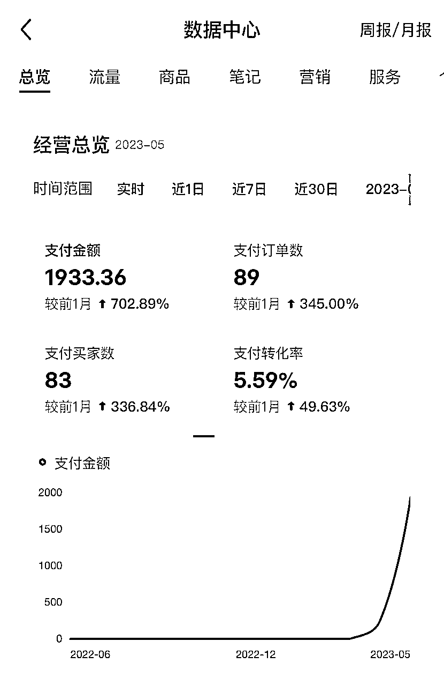
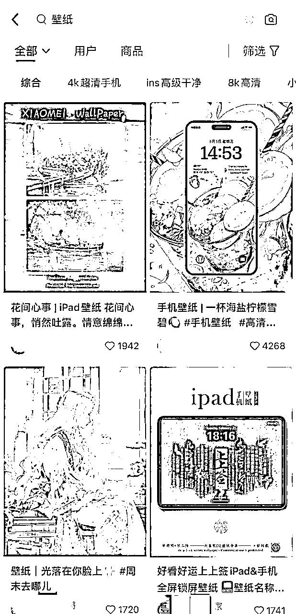
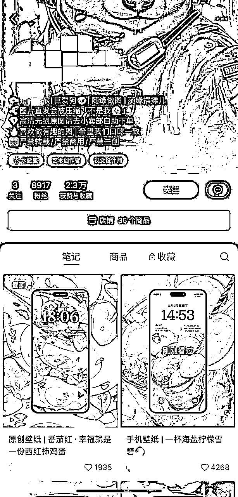
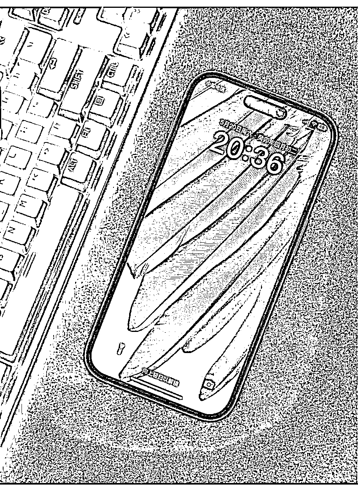
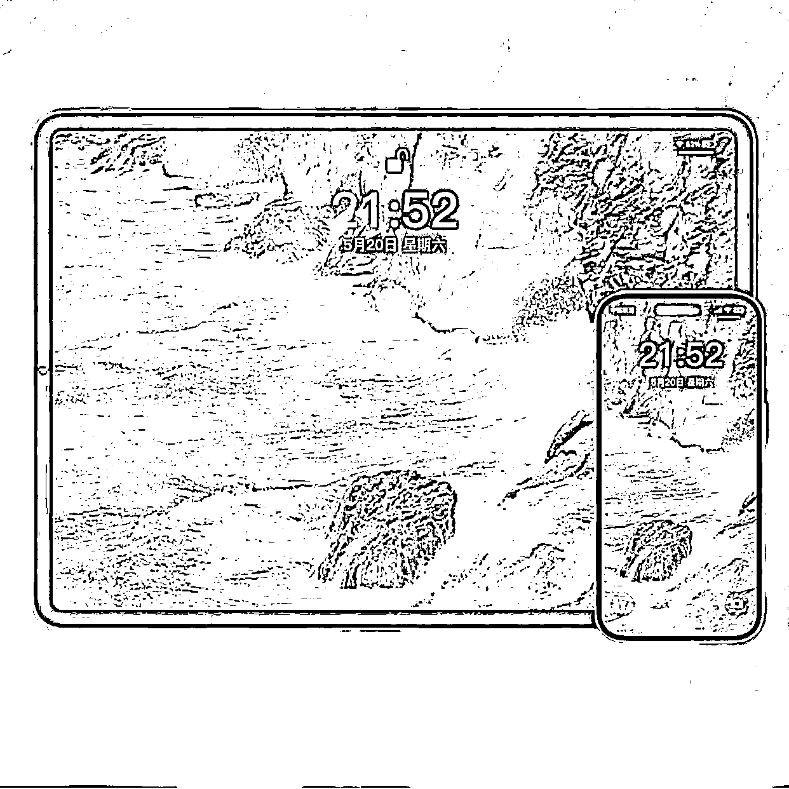
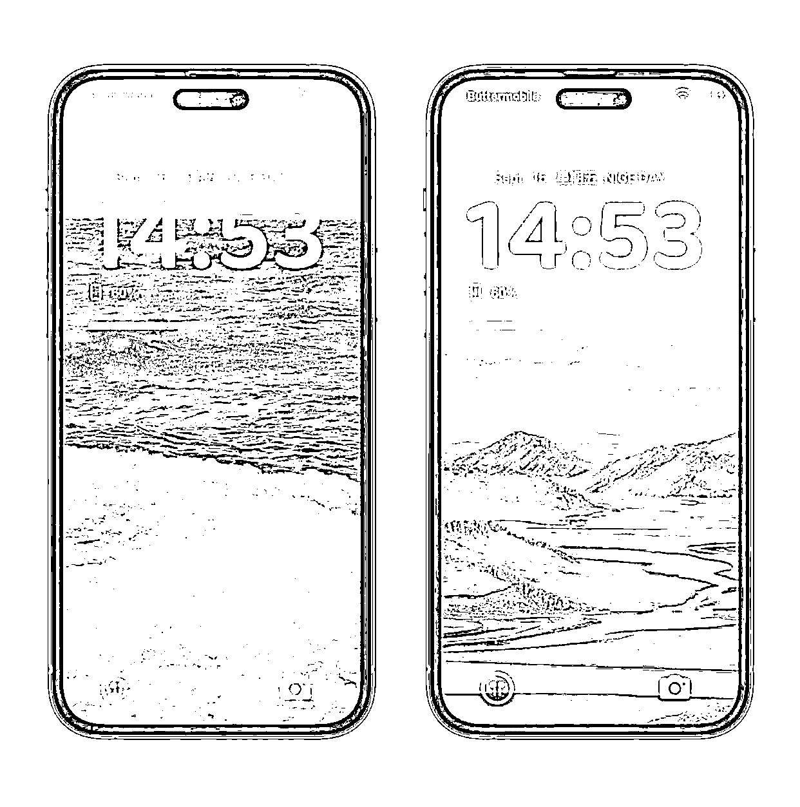
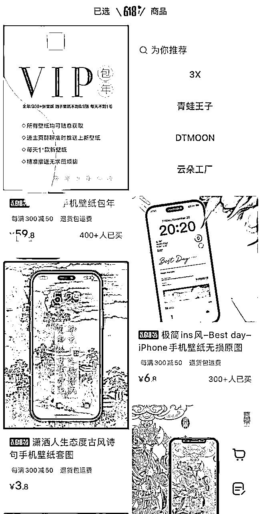

# 小红书壁纸号从 0 到 3000＋粉丝，变现 4 位数的保姆式教程

> 来源：[https://e4qkx5gj56.feishu.cn/docx/VGqDd4WMjoel5HxQFd2chn5znvm](https://e4qkx5gj56.feishu.cn/docx/VGqDd4WMjoel5HxQFd2chn5znvm)

大家好，我是蜗牛向前冲，大家叫我蜗牛就好啦☺️

今天给大家分享一下自己做小红书壁纸号的经历和感受。

虽然跟很多大佬动辄几十上百万的经历差了很多档次，但是也有值得借鉴的地方。

很适合兼职或者刚开始起步的朋友，付出的成本不多，包括时间成本和金钱成本。

分为以下几个方面来分享😊

# 一、成绩

我是从 4 月底开始做小红书壁纸号的，从 0 开始，到 6 月中的时候，粉丝已经 3000➕了

4 月刚开始做的时候，大概 3 天左右，收入了 240 块钱，心情很激动，因为这是一个很好的开端，有正反馈，就会有动力💪

整个 5 月份，收入 1900 多块钱，实际上自己每天花的时间很少，如果执行力强的朋友，完全可以做更多。

# 二、小红书壁纸号全流程

## 1、账号创建

### ① 就一个原则—— 100%模仿。模仿永久是最好的老师，尤其是 100%模仿。先研究小红书上做得好的壁纸号，包括风格，头像，昵称，简介。

首先，小红书上搜索壁纸，就会有很多优秀的同行，尤其是点赞比较多的，更值得我们学习。为了保护隐私，图片涉及到名字的，都打码了，大家可以自行搜索了解。

其次，可以看到图片搜索框下面，有很多标签。这个标签很重要，可以作为我们选择的类型，比如 4K 超清、ins高级干净、高级氛围感，等等。

确定好自己的风格，这个很重要！！！

大家都知道做账号最好是垂直的，细分的，越是垂直，粉丝越精准，后面变现越容易！

比如，二次元，国风，高清风景，宫崎骏风格…

主要看自己喜好，这个没有什么好坏，无论哪一种风格，都有很多人喜欢。这里不太建议一个账号做多种风格，会影响数据。

### ② 头像和昵称。风格定好了，就可以选辨识度的头像和昵称，这个不展开说了，无论做哪个平台，都差不多，就是让大家容易记住，增加粉丝粘性。

### ③ 简介。这个很重要。

举个例子，下面这种就是比较常见的，写得比较详细，写得比较详细，一般会说明自己做壁纸的风格，以及引导粉丝到店铺里下单。通过我在店铺里上传链接引导。

这里说一下，为什么简介比较重要。因为小红书的壁纸号，主要是以出售高清图片以及包年会员等方式进行变现。经过一段时间，我发现通过图文以及主页进行下单是比例最高的。

## 2、发布作品

用到的软件主要有几个：

壁纸生成软件：Midjourney，之前小航海这方面的资料非常全，这就不展开讲了，有需要交流的，可以私我。

主要就是生成尺寸需要注意，一般电脑壁纸推荐16:9，平板壁纸推荐3:2，手机壁纸推荐9:16。

画质提升软件：upscayl（电脑版）、bigjpg（bigjpg.com，可以手机操作），推荐用电脑版的upscayl，效果更好一些。，主要是把画质提升到4K，这样的壁纸更加清晰，粉丝接受度更高。

发布作品模板软件：推荐醒图，模板很多，比如下面这样的，如果没有找到自己想要的模板，也可以找人定制，我自己就找人定制的，这样更适合自己，也防止别人简单的模仿。

## 3、变现方式

这部分也是很多圈友关心的，壁纸号在抖音、快手、公众号都火过一遍了，所以变现方式也差不多。

①引流私域，加微信好友，沉淀粉丝，广告或带货等等。但是小红书引流一定要慎重，很容易被举报封号，所以可以用小号在评论区引导加微信，取图。

②小程序变现。可以把壁纸上传到壁纸君等小程序（微信、抖音），引导大家去看广告或充值，下载图片，然后分佣。这方面我也尝试过，效果不是很好，主要是上传到小程序里的壁纸也是被平台压缩后的，所以清晰度不够高，对于小红书用户，大部分都是走高端精致路线的，所以不太适合。

③小店变现。目前常见的几种：

→单壁纸单价格，好处就是好看的价格高点，也有人买，坏处就是店铺SKU太多了，不便于粉丝在店铺寻找。

→统一价格，根据不同张数不同价格。比如1张1.99元，5张9.99元，10张15.99元，等等。简单粗暴，省事，不过爆款的价格也要保持一致，不利于价格差异化。

→会员版。包年的，永久的，都可以，这样便于提高客单价，小红书用户购买力比较强，还是可以尝试的。

④周边。一个作品爆了的话，可以试着做手机壳，做装饰画，这个看自己情况了。

## 4、作品运营

主要有两方面：

一方面：就是引导大家点赞关注收藏评论，提高作品的曝光度。

刚起号的时候曝光度不高，所以在评论区可以引导大家点赞+收藏+关注，来取图。

还有就是可以建一个免费的粉丝群，每次发布新作品的时候，可以在群里发一下，类似抖音那种粉丝群，提高粉丝点击率。

新发布的作品，一般有个一段时间的免费期，这段时间内按照要求（点赞收藏等）求图的粉丝，可以在平台上私信或者粉丝群发给大家，因为平台发会被压缩，也就有了店铺下单的需求，毕竟很多朋友喜欢高清的画质。

另一方面：可以投薯条，说实话，投过几次，但是感觉效果不佳。

作品发布的频率：一般一天2-3次，少一点也可以，主要看你出图的速度了。

## 5、店铺运营

这方面讲的不多，因为不是真正的带货，店铺也不需要太复杂，只要几个图片就行。作品可以上传到网盘里，或者其他云盘，方便发给消费者。建议可以搞个网盘，如果购买会员的，可以实时更新，比较方便。

# 三、关于壁纸号的思考

1、快钱和慢钱各有优劣，看个人情况，虽然这个钱赚的慢，但是粉丝粘性高的话，基本上是个长期的生意。

2、小红书的粉丝们消费能力够强，大胆的去有价值的事情，一定会有人买单。

3、同行永远都是老师，尤其是刚起步的朋友，一定一定要去像素级模仿。

4、一个号跑通了，可以尝试做个矩阵，不同风格都覆盖一下。

5、正反馈永远都是最能激发一个人勇敢的走下去的方式，共勉。