# 3000粉丝月变现5W，同城眼镜店短视频拆解

> 来源：[https://xsej9se9cv.feishu.cn/docx/VeW2dpUs3oJ46jxtAfncuqChnSW](https://xsej9se9cv.feishu.cn/docx/VeW2dpUs3oJ46jxtAfncuqChnSW)

好吧，这个标题是标题党。

「同城实体店引流到店成交，不是老板的话，是不可能知道利润的」

但是，这个眼镜店，数据非常好，基本坚持日更，且数据非常稳定，七八十个赞起步，稳定在一百左右。

评论区绝大部分都是当地的IP，非常精准。

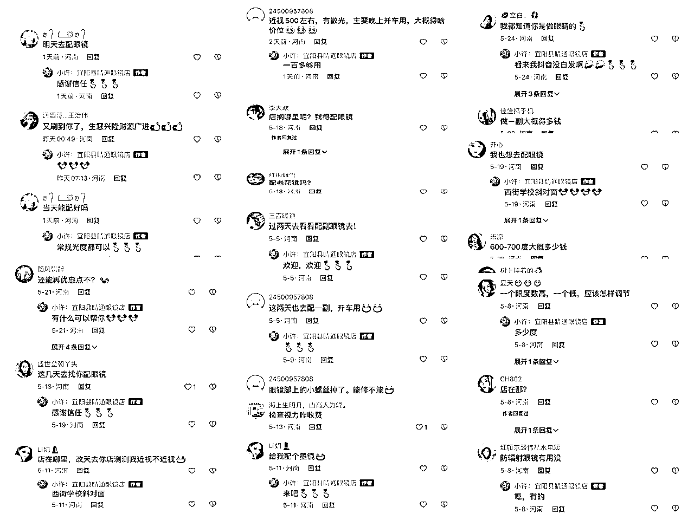

而且，每条视频的产出效率非常高，都是按照模板来拍的，单条视频产出时间不超过20分钟。

所以，这样一个号，对于同城实体店来说，非常值得学习。

「投入时间少，产出效率高，而且套模板可复制」

「99.99%的实体老板大半辈子都是跟自己的行业在打交道（装修、餐饮、美业、工厂等等），完全不懂线上流量，而这个时候你只需要比同行多懂那么一点点，你就几乎垄断了方圆6公里甚至是整个同城线上的流量」

昨天我发了条朋友圈：

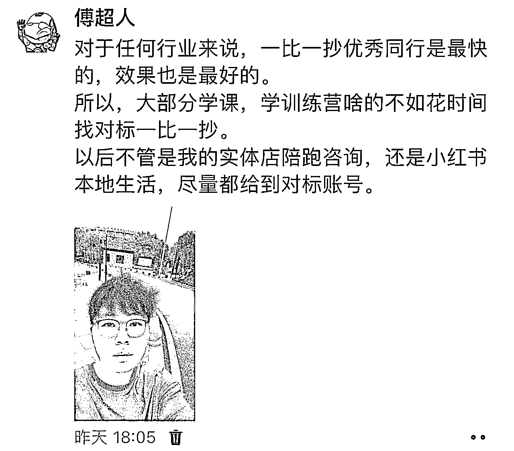

武汉的一家眼镜店账号做的好，我是长沙的，也是开眼镜店的，是不是直接翻拍就行了。

那么岳阳的呢？杭州的呢？

所以我把这个眼镜店的号仔仔细细的拆解了一下：

（其它行业也找了一些对标账号，之后继续拆）

像很多优秀的同城实体账号，其实我们刷一辈子短视频都刷不到，因为它做的只是同城的生意。

你不是本地的，根本刷不到。

「往往粉丝量只有几百上千的量，点赞数据也只有几十上百的数据，但是，变现却非常猛」

至于我是怎么找的，这就是独门秘诀了😎

# 同城实体店，只需要反复拍三类视频：

人设视频、流量视频、客户服务评价视频。

为什么要拍三类视频？

人设视频，增加信任力。

流量视频，打开同城播放，迎合算法，打同城标签。

客户服务评价视频，让客户看到你是怎么服务的，客户评价。（服务专业，性价比高，效果好）

一般是四条客户服务评价视频+一条人设+一条流量视频。

这样循环下去发。

想要把线上内容平台（抖音，小红书）做好，你的内容产出效率一定要高，且持续。

「因为我们做生意，需要源源不断的流量，绝大部分情况下，不是一条视频，一篇好内容就能吃几个月，甚至几年的」

那么，我们就得套模板，套框架去填文案，塞素材。

## 人设视频又可以细分为：

第一人称口播人设、第三人称素材人设

## 流量视频可以细分为：

第三人称正能量流量视频

第一人称正能量口播视频

第一人称蹭热点口播视频

## 客户服务评价视频可以细分为：

第一人称口播服务过程展示

第三人称口播服务过程展示

第三人称素材服务评价展示

当然，还可以细分下去，不过没必要，掌握这些就够了。

同城眼镜店是这样拍的，其实同城绝大部分的店，都可以这样拍，逻辑都是一样的。

当然，最好还是一比一抄同行业的，完全就不用动脑子了。

# 同城第一人称口播人设视频：

## 第一条：

### 视频时长：

12S

### 场景：

配眼镜的场景（视力表，擦眼镜）

### 文案：

好多人都认为在宜阳（地名）配副眼镜（行业名）很贵（前三秒，字体突出，打精准用户痛点）

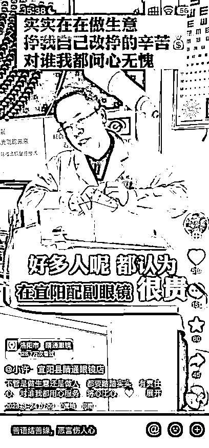

那是因为你没有认识我，认识我的话我就不会让你多花冤枉钱（性价比高），并且呢，我还是终身免费维修（服务好），前面已经有很多人帮你验证过了（口碑好），我是小许（昵称），我在精通眼睛等你。

### 作品描述：

不管是做生意还是做人，都要踏踏实实，有责任心，对谁我都用心服务，将心比心，真心换真心。对谁都问心无愧，挣自己该挣得。#宜阳#宜阳县精通眼镜店（加地域标签，加店铺标签）

（体现老板靠谱）

### 画面标题：

实实在在做生意，挣我自己该挣的辛苦钱

对谁我都问心无愧（体现老板靠谱）

### 引流方式：

左下角POI地址

### 视频链接：

https://v.douyin.com/UuA6g6n/

## 第二条：

### 视频时长：

11S

### 场景：

0场景（应该按第一条视频那样，视力表，擦眼镜）

### 文案：

我是在宜阳（地名）做眼镜（行业名）的小许（昵称），没有能说会道的嘴，也没有损人利己的心，全靠坚持不懈，诚信经营，感恩客户的信任，定当不负众望（体现老板靠谱）

### 作品描述：

在宜阳配眼镜找小许

（加地名，行业名，系统识别关键词）

诚信经营，不玩套路，售前放心，售后舒心#宜阳#宜阳县精通眼镜店（加地域标签，加店铺标签）

（体现老板靠谱）

### 画面标题：

在宜阳配眼镜，找小许，诚信经营，不玩套路。

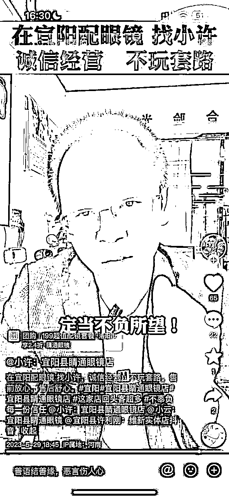

### 引流方式：

团购

### 视频链接：

https://v.douyin.com/UuUgF45/

## 第三条：

### 视频时长：

27S

### 场景：

眼镜店场景（验光室，验光资料）

### 文案：

最近十天呢，店里来了200多位粉丝（生意好，说明产品服务过关）

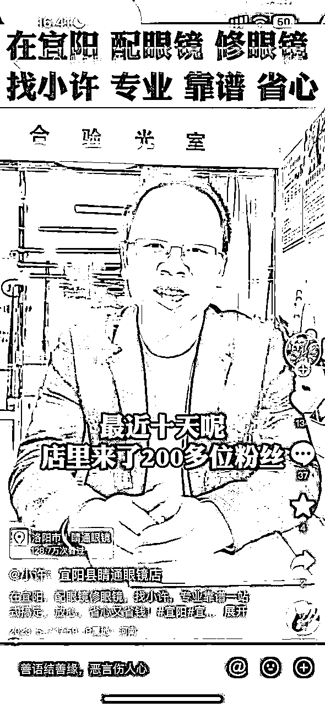

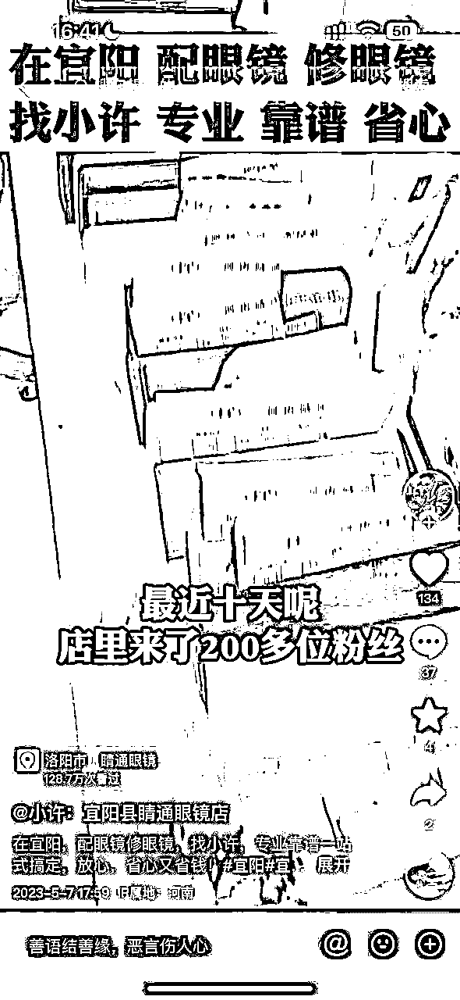

（展示订单画面）

有这个赵堡过来的（赵堡，地名，同城话题，归属亲切感，别人都大老远跑来找我配眼镜了！）

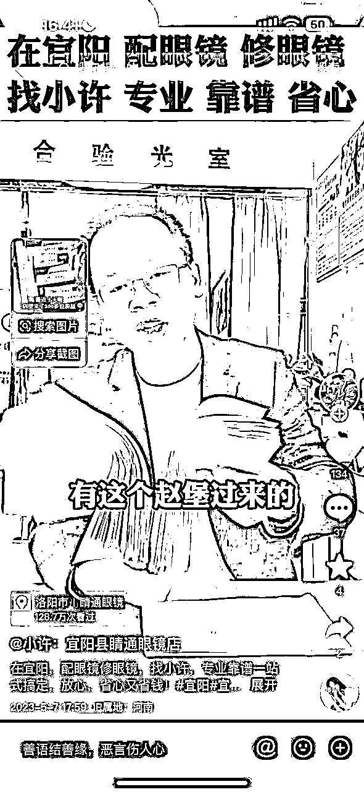

（展示验光表多，显示生意好）

还有韩城过来的（韩城，地名，同城话题，归属亲切感，而且别人都大老远跑来找我配眼镜了！）

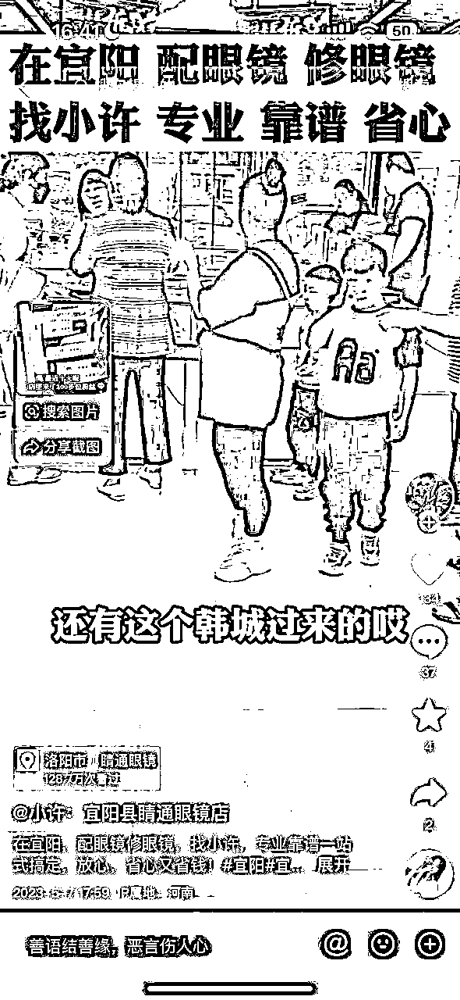

（展示来的人多，显示生意好）

从连庄过来的（连庄，地名，同城话题，归属亲切感，而且别人都大老远跑来找我配眼镜了！）

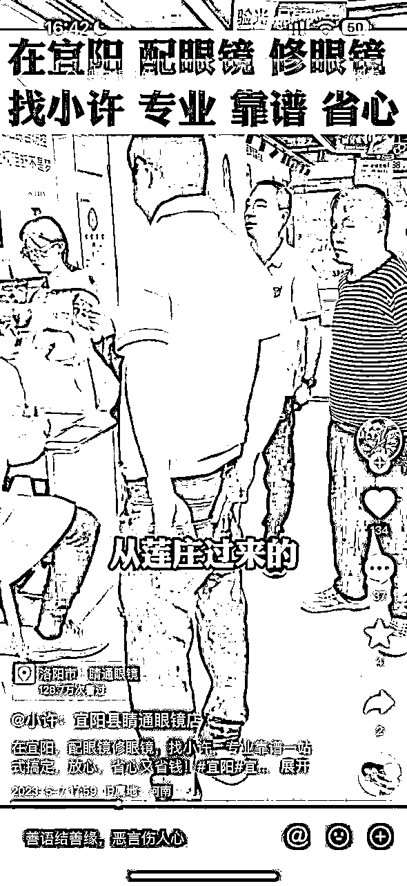

（展示来的人多，显示生意好）

感谢大家这么相信小许啊，借这个视频，我再说一下，咱们店里配眼镜呢，都是实实在在的，就是您适合什么，给你推荐什么。不玩套路，不玩虚的啊。

（体现老板靠谱）

不管您是不是在我店里配的眼镜，只要是能修的，小许我这里都免费给您修。

（体现老板服务好）

大家有需要的话，都可以来我店里看一看。

### 作品描述：

在宜阳，配眼镜修眼镜，找小许，专业靠谱一站式搞定

（加地名，行业名，系统识别关键词）

#宜阳#宜阳县精通眼镜店（加地域标签，加店铺标签）

（体现老板靠谱）

### 画面标题：

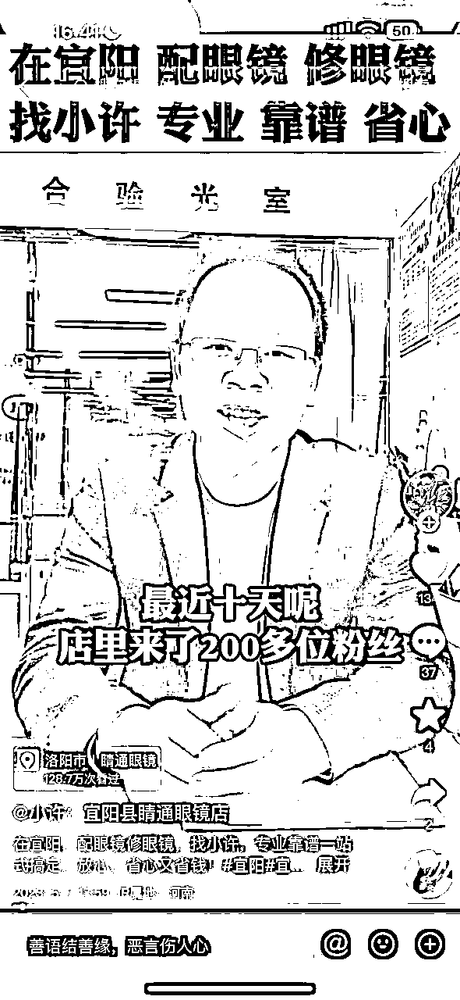

### 引流方式：

POI地址

### 视频链接：

https://v.douyin.com/UuyxMEe/

# 同城第三人称素材人设视频

跟口播的区别是，只放视频素材，产出效率更高。

## 第一条：

### 视频时长：

7S

### 场景：

店铺人多，服务客户过程的素材

### 文案：

无

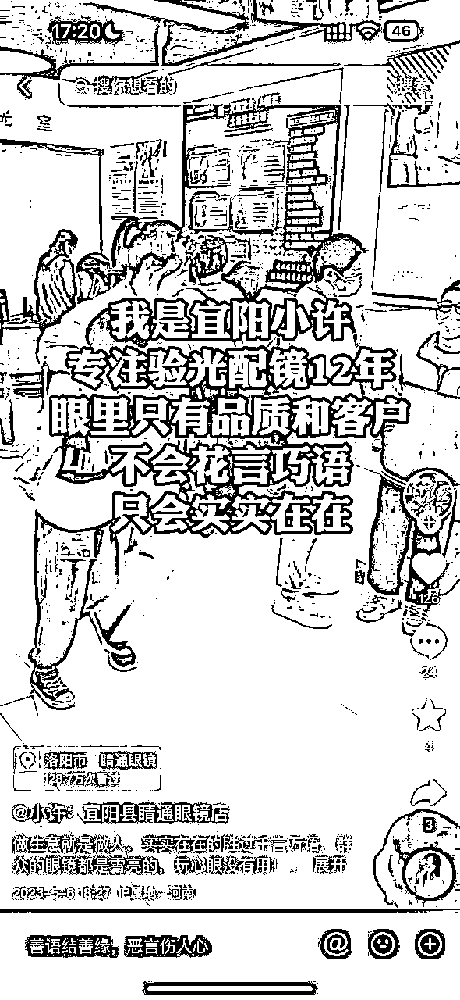

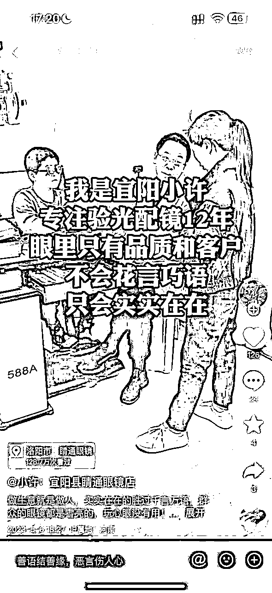

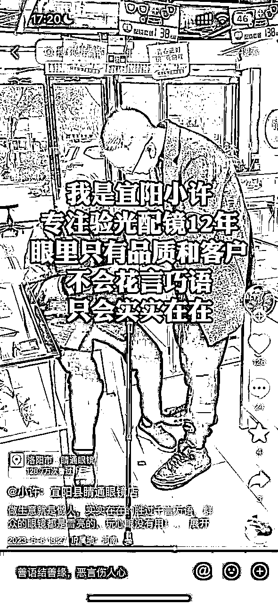

（视频素材体现生意好，展示服务过程）

（画面文案体现地址，昵称，行业，专业，老板靠谱，口碑好）

### 作品描述：

做生意就是做人，实实在在的胜过千言万语，群众的眼睛都是雪亮的，玩心眼没有用。

#宜阳#宜阳县精通眼镜店（加地域标签，加店铺标签）

（体现老板靠谱）

### 引流方式：

POI地址

### 视频链接：

https://v.douyin.com/Uu5ejgg/

## 第二条：

### 视频时长：

7S

### 场景：

订单多的素材

### 文案：

无

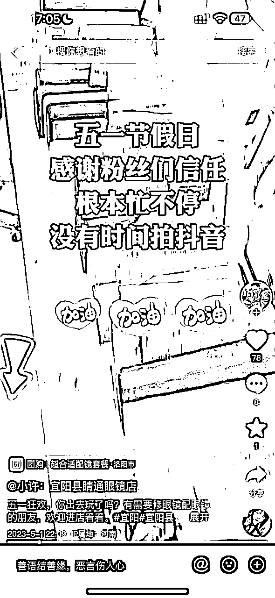

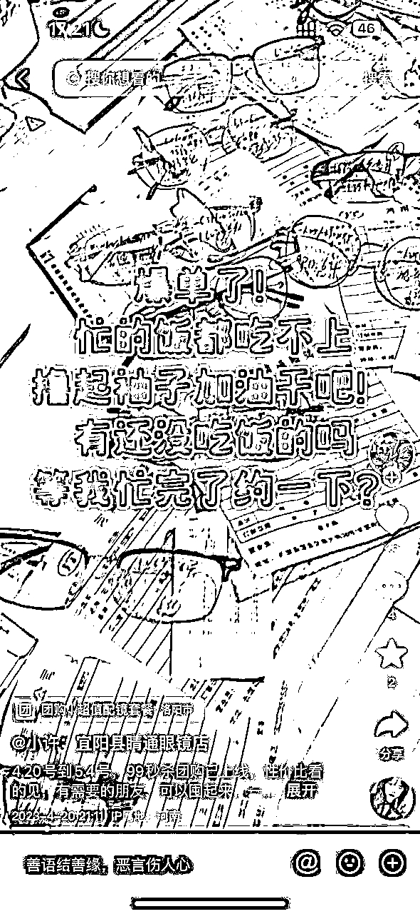

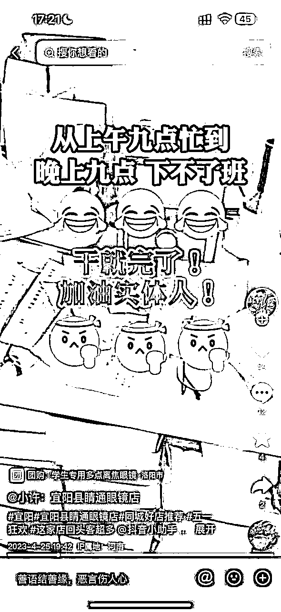

（体现生意好）

### 作品描述：

五一狂欢你出去玩了吗，有需要修眼镜，配眼镜的朋友欢迎进店看看

#宜阳#宜阳县精通眼镜店（加地域标签，加店铺标签）

（体现老板靠谱）

### 引流方式：

团购

### 视频链接：

https://v.douyin.com/UuUgF45/

## 第三条：

与第二条同理，只是文案和音乐上，是曝光的语气和音乐，引起好奇。

### 文案：

宜阳（地名）出怪事了

这家店天天双十一

有白杨的，赵堡的（韩城，地名，同城话题，归属亲切感，而且别人都大老远跑来找我配眼镜了！）

因为老板实在，配镜放心。

赶过来找小许配眼镜（行业名）

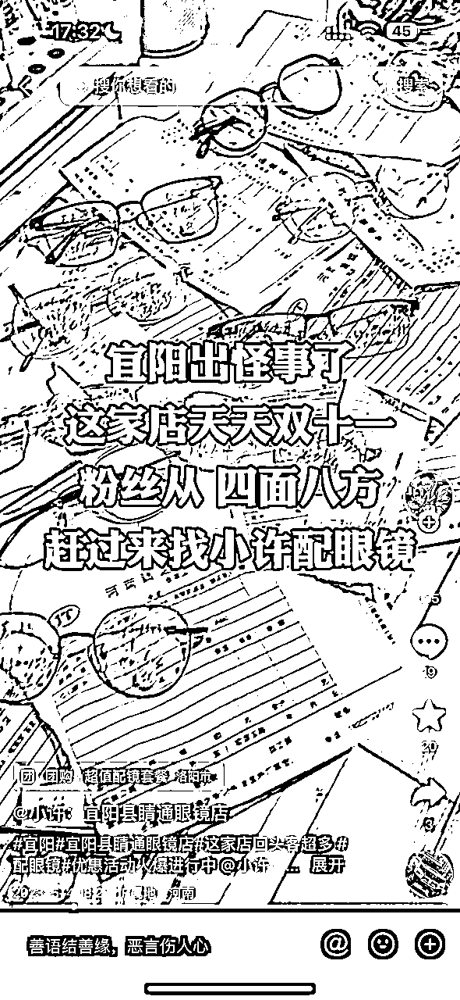

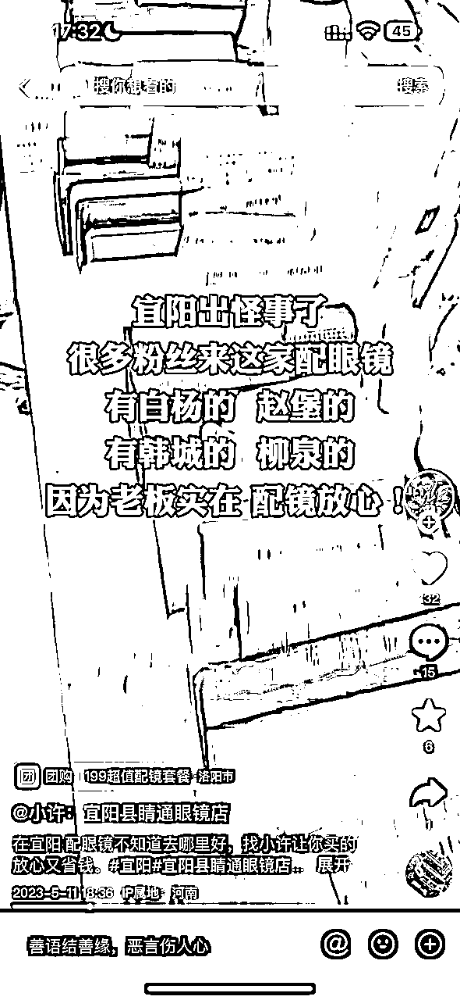

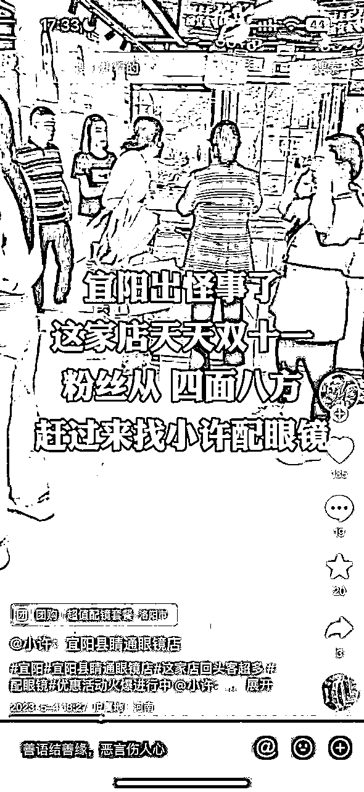

# 同城第三人称正能量流量视频

正能量视频，就是通过正能量文案，正能量音乐，来引起共鸣。

当然，也可以口播。

## 第一条：

### 视频时长：

7S

### 场景：

眼镜店场景（店内客户多服务过程场景）

### 文案：

无

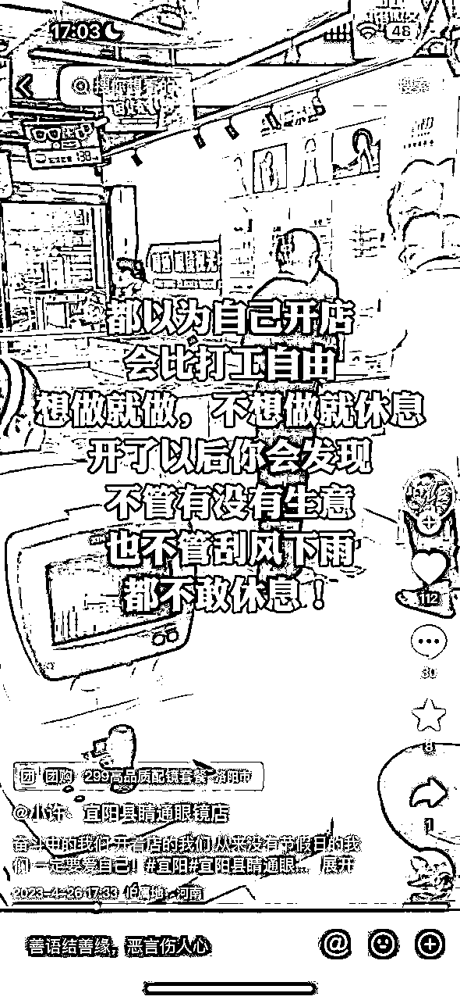

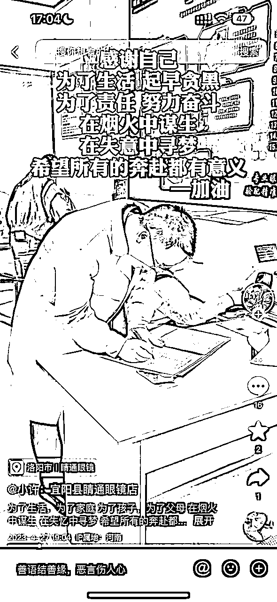

### 作品描述：

为了生活，为了家庭，为了孩子，为了父母，在烟火中谋生

奋斗的我们 开着店的我们，从没有节假日的我们一定要爱自己。

#宜阳#宜阳县精通眼镜店（加地域标签，加店铺标签）

（正能量，引起共鸣）

### 引流方式：

POI地址

### 视频链接：

https://v.douyin.com/UufKoS9/

## 第二条：

### 视频时长：

7S

### 场景：

傍晚开车场景

### 文案：

无

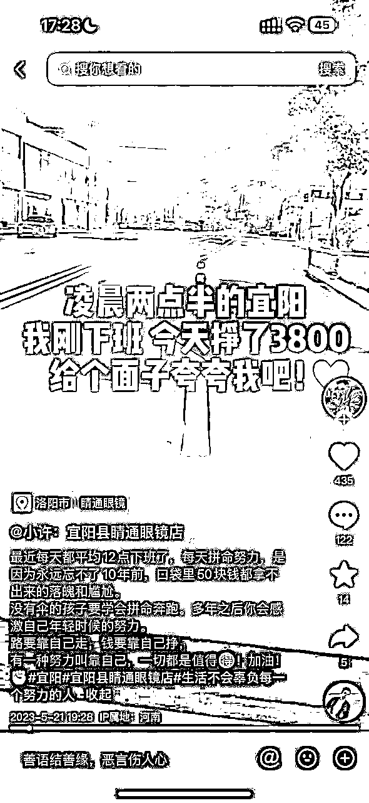

### 作品描述：

最近每天都平均12店下班了，每天拼命努力，是因为永远忘不了10年前，口袋里只有50块钱的落魄。

没有伞的孩子要学会拼命奔跑，多年之后你会感激自己年轻时候的努力。

路要靠自己走，钱要靠自己挣。

有一种努力叫靠自己，一切都值得。

#宜阳#宜阳县精通眼镜店（加地域标签，加店铺标签）

（正能量，引起共鸣）

### 引流方式：

POI地址

### 视频链接：

https://v.douyin.com/Uu5nWHS/

# 同城蹭热点流量视频：

节日热点，同城热点。

## 第一条：

### 视频时长：

24S

### 场景：

眼镜店拿着很多儿童眼镜

### 文案：

哈喽小朋友们大家好，马上就是六一儿童节了。

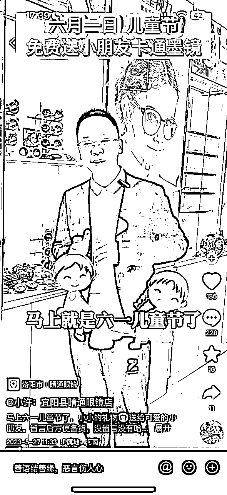

小许呢，给大家准备了很多的儿童节礼物。

有漂亮的小心心，可爱的小蚂蚁，还有大家都喜欢的小猪佩奇。

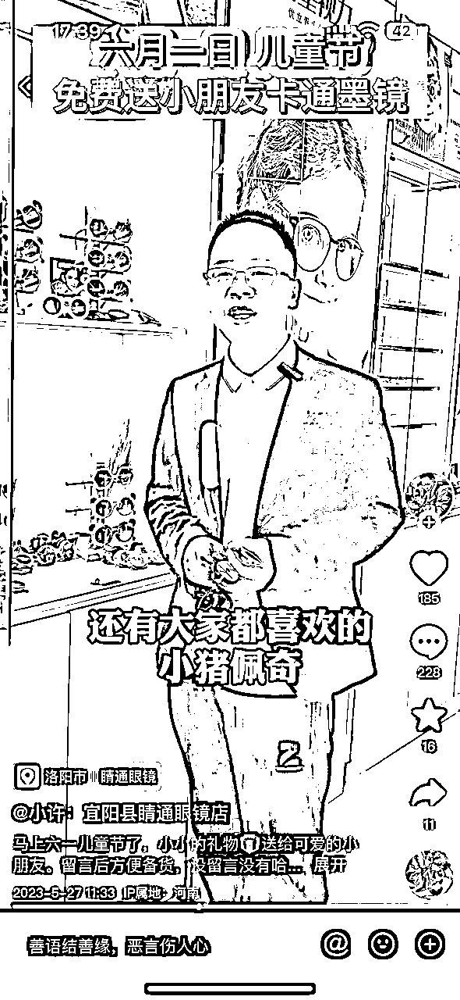

后续还会有很多的新款到货，大家只需要点一个赞，并且在视频下方留言。

（引导互动）

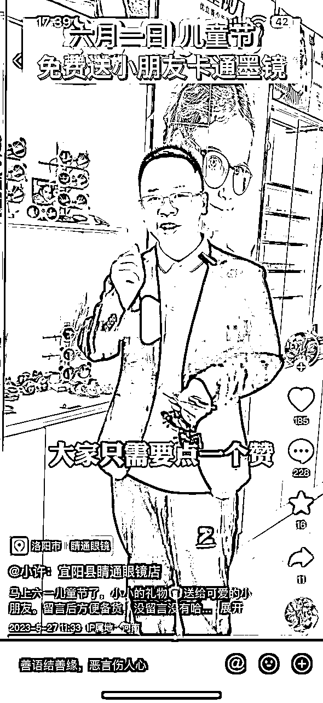

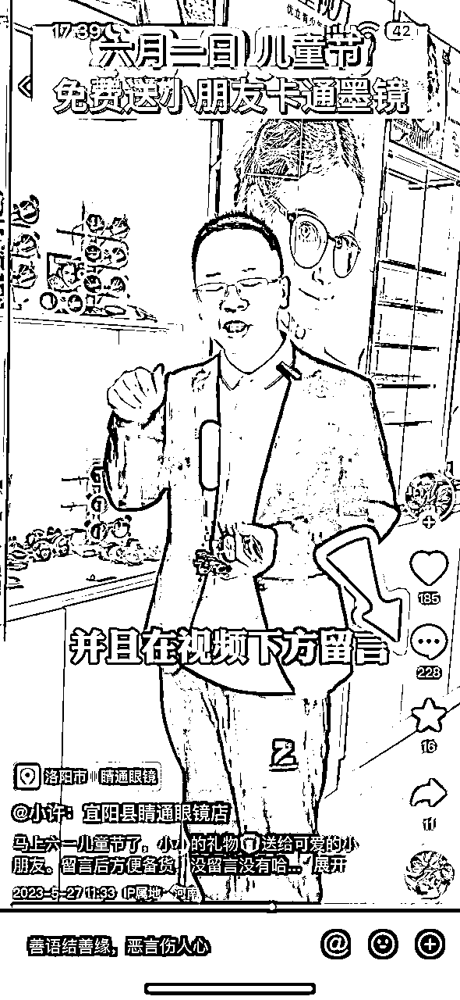

我想要六一儿童节快乐，就可以在六月一号到六月五号之间。

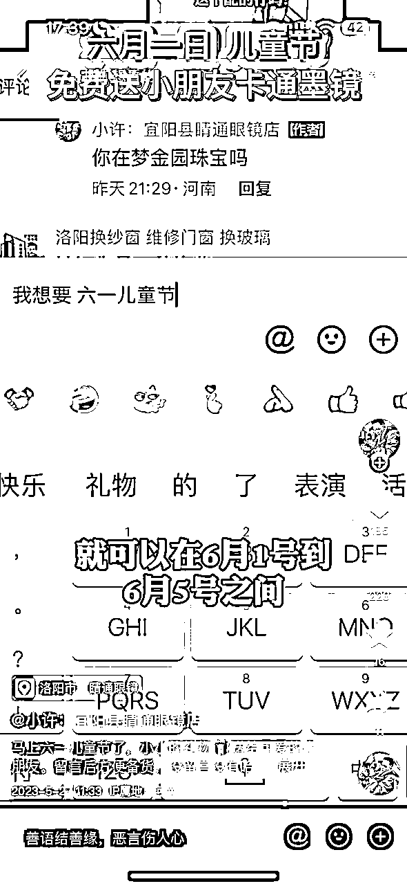

来店里免费领取。

（引导评论）

（展示效果）

### 作品描述：

马上六一儿童节了，小小的礼物。

留言后方便备货，没留言没有哈。（引导评论互动）

#宜阳#宜阳县精通眼镜店（加地域标签，加店铺标签）

（体现老板靠谱）

### 引流方式：

POI地址

### 视频链接：

https://v.douyin.com/UuaQKk2/

# 同城第三人称口播服务过程视频

## 第一条：

### 视频时长：

12S

### 场景：

眼镜店场景（客户试镜，客户评价，服务客户场景）

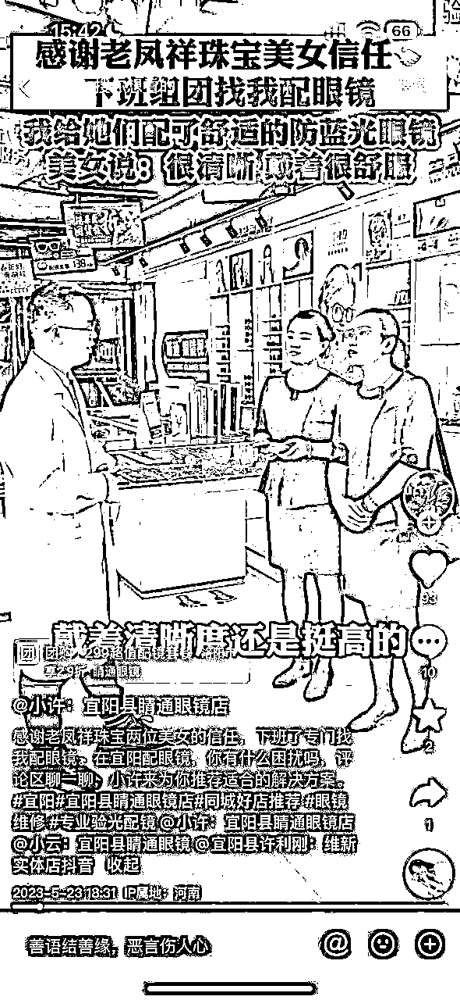

### 文案：

戴着清晰度还是挺高的。（效果好）

配的行吗？满意吗？

满意。（客户满意）

就是如果你的同事，需要修眼镜，都可以过来。（服务好）

感谢你们信任。

### 画面文字：

客户是干嘛的，哪里过来的，有什么需求

我提供了什么解决方案

客户的评价

### 作品描述：

感谢老凤祥珠宝两位美女的信任，下班了专门找我配眼镜。

在宜阳配眼镜，你有什么困扰吗？评论区聊一聊。

#宜阳#宜阳县精通眼镜店（加地域标签，加店铺标签）

（体现老板靠谱）

### 引流方式：

团购

### 视频链接：

https://v.douyin.com/UH4S3SC/

## 第二条：

### 视频时长：

10S

### 场景：

眼镜店场景（客户试镜，客户评价，服务客户场景）

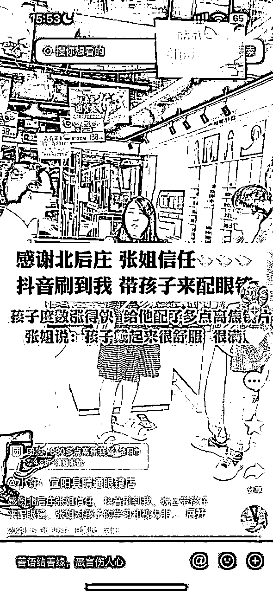

### 文案：

咱老板这服务态度真是好呀（服务好）

配的行不行，还满意吗？

满意。（效果好）

你是从哪过来的，姐。

俺是后庄的。(地名亲切感，我也是后庄的，我要不要也去他那配？)

以后你同学们，谁需要修眼镜，都可以来我这修，都可以免费修。（服务好）

### 画面文字：

客户是干嘛的，哪里过来的，有什么需求

我提供了什么解决方案

客户的评价

### 作品描述：

感谢北后庄张姐的信任，抖音上刷到我，晚上带孩子来配眼镜。

在宜阳配眼镜，你有什么困扰吗？评论区聊一聊。

#宜阳#宜阳县精通眼镜店（加地域标签，加店铺标签）

（体现老板靠谱）

### 引流方式：

团购

### 视频链接：

https://v.douyin.com/UHVh8sj/

## 第二条：

### 视频时长：

10S

### 场景：

眼镜店场景（客户试镜，客户评价，服务客户场景）

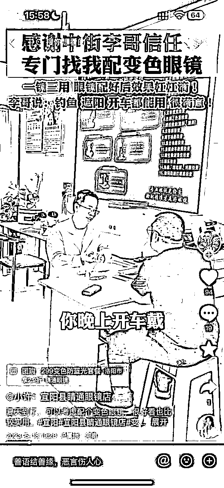

### 文案：

你晚上开车戴，钓鱼戴，走到路上遮阳戴，一镜三用，比较OK（性价比高）

配得满意吗？

满意满意（效果好）

### 画面文字：

客户是干嘛的，哪里过来的，有什么需求

我提供了什么解决方案

客户的评价

### 作品描述：

夏天到了，可以考虑配个变色眼镜，很好看也比较实用。

#宜阳#宜阳县精通眼镜店（加地域标签，加店铺标签）

（体现老板靠谱）

### 引流方式：

团购

### 视频链接：

https://v.douyin.com/UHVu2jy/

## 第三条：

### 视频时长：

10S

### 场景：

眼镜店场景（客户试镜，客户评价，服务客户场景）

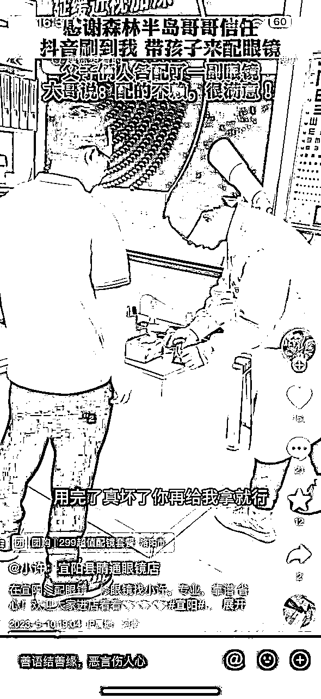

### 文案：

基本用不上几个。用完了真坏了，你再找我拿就行。（服务好）

感谢你信任啊哥，以后家里面谁要是需要这个修眼镜，直接过来就行。（服务好）

这个昨天配的行不行，满意不？

满意！（用户评价好）

### 画面文字：

客户是干嘛的，哪里过来的，有什么需求

我提供了什么解决方案

客户的评价

### 作品描述：

在宜阳，配眼镜，修眼镜找小许，专业，靠谱，省心。

欢迎大家进店看看。

#宜阳#宜阳县精通眼镜店（加地域标签，加店铺标签）

（体现老板靠谱）

### 引流方式：

团购

### 视频链接：

https://v.douyin.com/UHVu2jy/

# 同城第三人称素材服务过程视频

跟口播相比，素材获取更简单。

## 第一条：

### 视频时长：

7S

### 场景：

眼镜店场景（客户试镜，客户评价，服务客户场景）

### 文案：

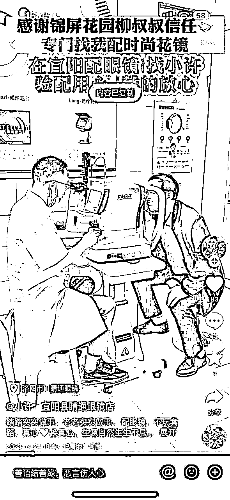

这个昨天配的行不行，满意不？

满意！（用户评价好）

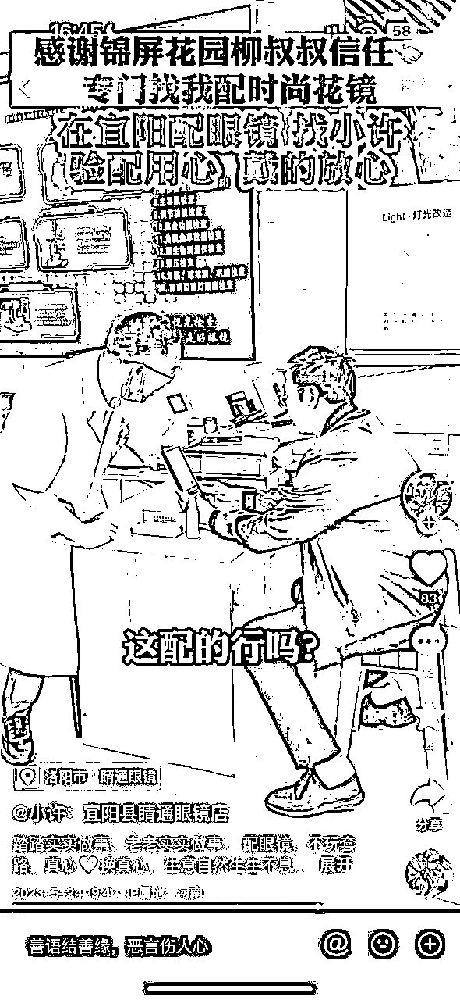

### 画面文字：

客户是干嘛的，哪里过来的，有什么需求

我提供了什么解决方案

客户的评价

### 作品描述：

踏踏实实做事，老老实实做人，配眼镜，不玩套路。

#宜阳#宜阳县精通眼镜店（加地域标签，加店铺标签）

（体现老板靠谱）

### 引流方式：

POI地址

### 视频链接：

https://v.douyin.com/UHgVp3x/

## 第二条：

### 视频时长：

7S

### 场景：

眼镜店场景（客户试镜，客户评价，服务客户场景）

### 文案：

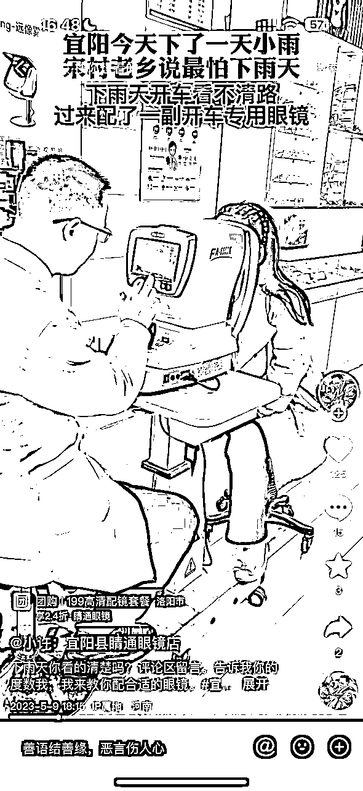

这个配的行不行，满意不？

满意！（用户评价好）

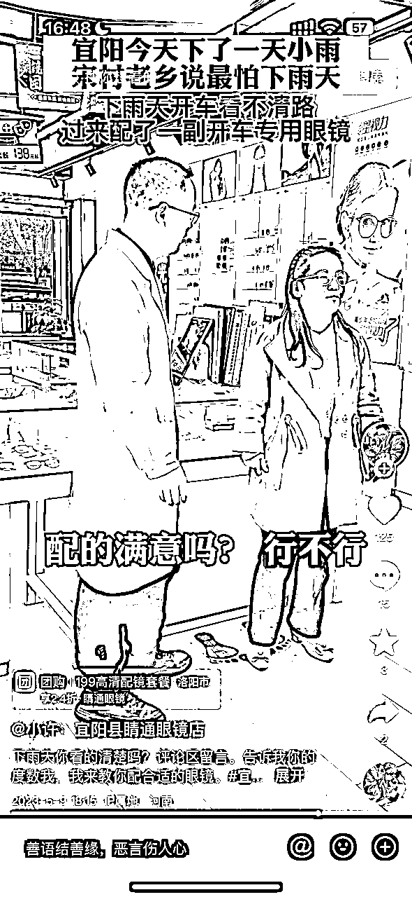

### 画面文字：

客户是干嘛的，哪里过来的，有什么需求

我提供了什么解决方案

客户的评价

### 作品描述：

下雨天你看的清楚吗？评论区留言，告诉我你的度数，我来教你配合适的眼镜。

#宜阳#宜阳县精通眼镜店（加地域标签，加店铺标签）

（体现老板靠谱）

### 引流方式：

团购

### 视频链接：

https://v.douyin.com/UHggqCj/

# 总结：

这篇文章，我自认为非常的干货，绝大部分同城实体店看完都能一比一抄直接上手的。

一直在犹豫，要不要发出来。

因为我做的是陪跑咨询的服务嘛，发出来了，其实很多人都可以自己上手做。

但是我认真思考了一下，还是得发。

我这个人，目前还是不太擅长交际，主动链接和销售。

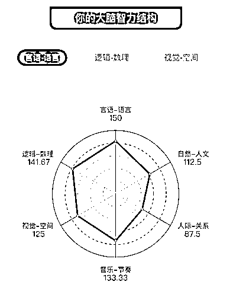

前几天的测试，也是如此结果。

那我只能，通过输出干货来获得被动链接。

（之前的知乎好物2.5W字攻略也是一样的道理）

对于大部分拿到结果的人来说，有个靠谱，懂业务，还能持续迭代的人，能够去咨询给方向，其实价值也挺大的。

毕竟自己摸索还是效率非常低的。

欢迎链接沟通 abcfjj123

我会在这个赛道里面深耕，专注于搞实体引流这个大方向。

但是，市面上的短视频呀，培训，课呀，其实对于实体老板来说，看了也很难学会。

最有效，最快的学习方法是什么？

就是在弄懂概念和底层逻辑后，直接一比一抄对标。

像很多这样优秀的同城实体账号，其实我们刷一辈子短视频都刷不到，因为它做的只是同城的生意。

「往往粉丝量只有几百上千的量，点赞数据也只有几十上百的数据，但是，变现却非常猛」

从今天开始，我会持续分享各个实体行业，如何做好线上短视频流量，直接拆对标账号，一比一抄就完事，评论区可以留下你的行业，我下一篇就分享你这个行业的玩法。

新圈友可以看这几个帖子再认识我一下，熟悉下名字，交个朋友。

看完如果有帮助的话，记得点赞支持一下，哈哈。

22岁，毕业半年，我赚了50W

https://mp.weixin.qq.com/s/2Ia-bdYlfRKUXHbhO8aP7g

小白如何快速成长

https://mp.weixin.qq.com/s/ScsBsTeHnbCIBlO0KBZUHw