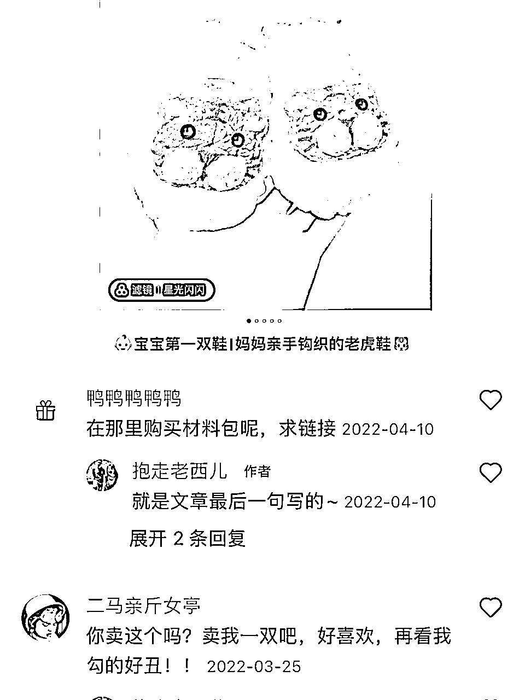
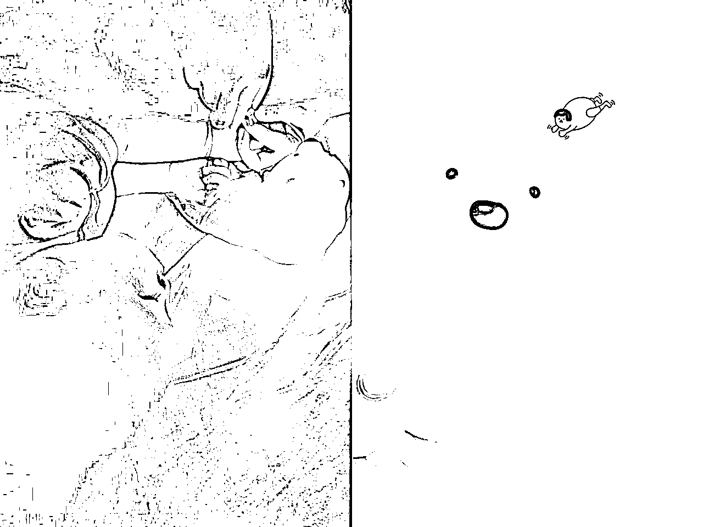
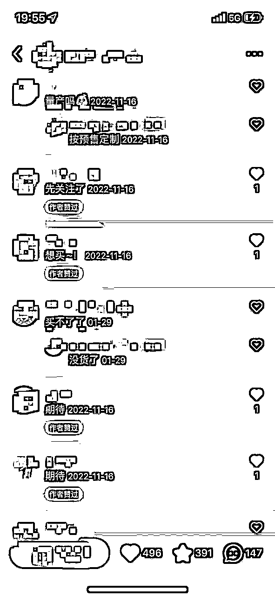
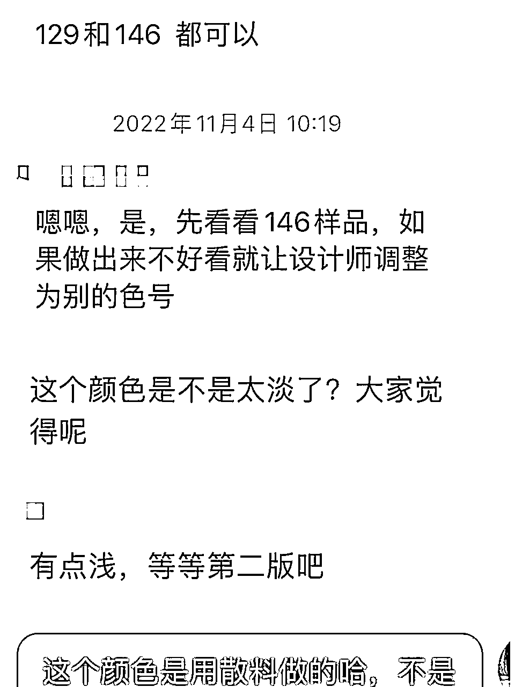
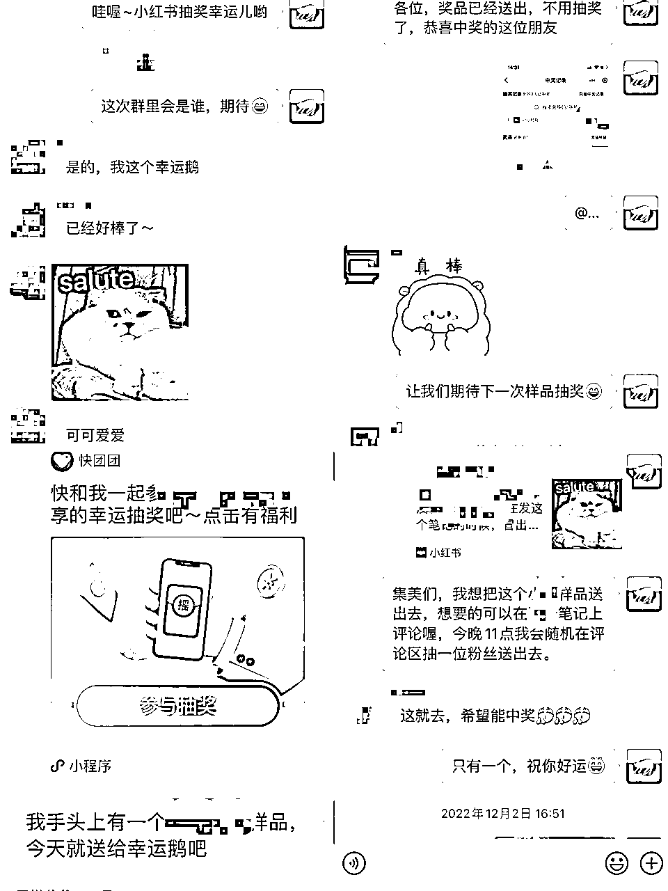
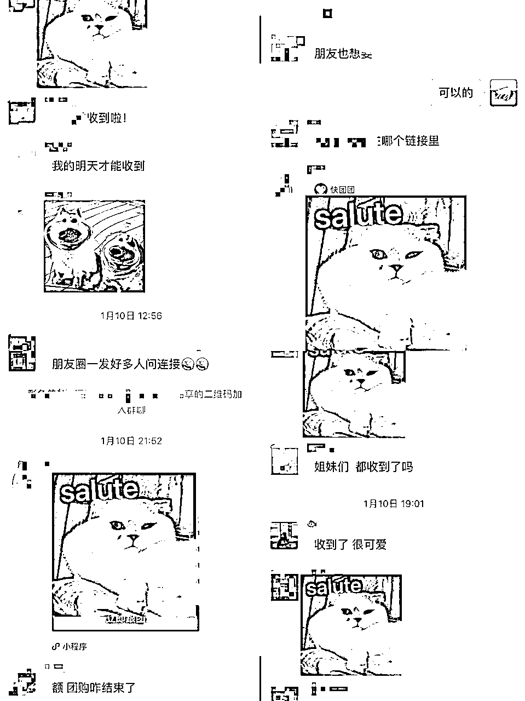
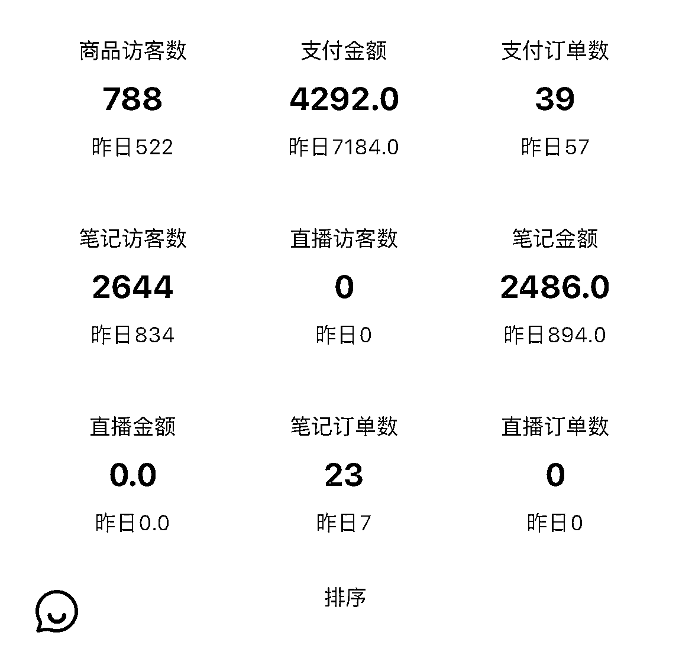

# 自制手工玩具在小红书爆文后迅速批量生产，单枪匹马入局小红书店铺半年单店月盈利稳定10w+

> 来源：[https://yie7pvohee.feishu.cn/docx/VpwOdDNgxo4QKrxCmO1c5288naf](https://yie7pvohee.feishu.cn/docx/VpwOdDNgxo4QKrxCmO1c5288naf)

大家好，我是Jing。一个财务出身的产品经理，为自己提供工作机会的全职妈妈。

目前小红书店铺售卖的产品是自主设计的玩具，自有货源的优势不言而喻，例如亲自把控产品质量、产品差异化避免了同质化、库存稳定可控等等。

之前在生财分享了自己做小红书店铺实操过程中总结的经验，受到很多圈友的关注，今天来做一个补充，主要讲讲如何做爆款玩具的过程。

# 一、小红书和用户一起做爆款玩具的几个阶段

## 阶段一：发帖分享自己做的玩具，测试用户反应

笔记模版：真实图片拍摄（真实场景拍摄）+标题（关键字：宝宝、妈妈、原创）+内容（搭建过程，尽可能描述简单，看似可以模仿）

举一个案例：

以下总结测试爆款的3个小步骤：

①先拟定你要推的产品。

首先先明确一点：如果你要走产品定制的路，这个产品一定是你设计的或者你根据别人的产品改进迭代的。

如果只是把产品从其他地方搬运过来例如1688或拼多多，打造个人原创人设，会很快露馅的。最后伤害的是你自己。

那自己是否有能力去做这个事情呢？首先要对自己有清晰的认知。

例如自己很会钩织，那可以为自己的孩子钩织鞋子或者帽子，得到认同后可以找服装厂生产定制。

例如自己很会画动物，那可以把自己的画做成英语点读卡，得到用户认同后可以找印刷厂定制。

例如自己从小玩乐高很会拼搭，那可以用乐高拼搭出小汽车，得到用户认同后可以考虑找工厂出大货。

②结合场景分享产品，主打情绪价值，引起目标用户代入、共鸣

这个笔记内容怎么说，说什么，不重要，引起用户情绪共鸣才重要。

举个例子，如果你想打造一个治愈可爱的小夜灯，你应该分享一个什么笔记引起妈妈们的共鸣？

那么你就要挖掘你的目标用户使用小夜灯的场景都有哪些，哪些是痛点，哪些能引起妈妈们的共鸣

如果，你仅分享黑暗中有个小夜灯真的太方便太好用了，会引起共鸣吗？不会。

但是，如果你分享一个图片，这个图片是妈妈跪在床上打着这个小夜灯为熟睡的宝宝剪指甲的画面，是否会引起妈妈们的共鸣?

以上图片对比，你认为哪个图更能拉动用户情绪价值？

你要做的是拉动目标用户的情绪价值，引起种草并购买的冲动。而不是宣传你的产品多好用多可爱多精美。

③爆品确定：评论区出现整齐划一的“上链接”、“怎么买”、“蹲一个”。当时我的笔记出现了很多求购评论，我才敢下定决心尝试找工厂定制。

## 阶段二：联系供应商，进一步落实玩具制作

①做最坏的心理准备，这个项目可能会止步于打样

我当时的想法很简单。即使打样出来的效果不如意，可以换一个工厂，可以项目停止。最坏的结果就是亏个打样费而已。

②联系工厂，准备打样需要提供的资料

一般工厂都是来图定制，正面侧面底部的图片。如果能提供三视图，能大大降低和工厂沟通的成本。

③选择一个愿意配合你打磨产品的工厂

理想与现实是有差距的。好产品是迭代出来的。

如何一步步和工厂实现你的产品构想，一个愿意配合你反复迭代的工厂尤其重要。

我梳理了一个打样的工作流程：

1.  认真梳理自己的需求、图片，一次过传递过工厂。

1.  明确设计师交稿时间，什么时候出第一版什么时候出第二版第三版

1.  当设计师出初稿的时候，认真去看产品，哪些需要改进的，先文字记录下来。

1.  电话沟通，把你的想法传递给工厂业务。

1.  电话沟通完，让工厂业务整理产品修改意见发你确认。这里主要看工厂业务是否get到你的需求。

1.  最后文字落实修改意见，避免产品第二版出来不如意工厂踢皮球。

④切勿追求完美，记住迭代思维、小步快跑。

时间就是金钱。你的爆款笔记已经展示在大众面前了。要模仿你、窃取你的图片文案轻而易举。你要做的事情是打一个80分的产品，上架售卖抢占商机。

后面再继续迭代优化产品即可。

## 阶段三：打样过程怎么链接用户，增加用户粘性

打样的过程很长，短则十天，长则一个月。

那这么长的时间，如何让用户等你

三个小技巧：

①引导用户进群蹲进度，及时更新打样进度条。

②引导用户参与打样，帮你做一些简单的决策，每一个用户都是设计师。例如投票选出原材料、产品的颜色等等。

③抽取新品试用官，免费寄样品给用户体验，并在群里分享体验产品的感受及修改意见。

## 阶段四：开启预售，用户全额支付定金

回到主题：为自己的孩子做一款玩具。

与其说这个玩具是做给孩子的，不如说是做给妈妈的。

①持续的打样笔记更新， 把妈妈们投票选出的外观、选料等结果，以图文笔记的方式采纳并记录下来，让妈妈感受到你的真诚与用心。

② 打样的过程中，积极采纳妈妈们的意见。你的人设，是帮大家执行这些想法而已。妈妈们感受到你的执行能力。最后打磨的产品符合预期，价格合适。一定会为此买单。

③切勿玩起淘宝那一套先付定金后付尾款的方法。大家都很忙，付全款等收货，是最简单不过的了。

## 阶段五：如何增加销量或复购

前面4步的打样，已经让社群活跃度达到一个高峰。那么这个时候需要你持续的社群运营，笔记种草，才能出第二波销量高峰。

①引导用户晒单，反馈质量、宝宝喜欢这个玩具的程度

怎么引导？

我貌似没有进行过多的干涉，因为妈妈们前面打样参与了打样设计，我及时告知打样进度、生产大货的进度、发货进度，有了前面的铺垫，那妈妈们收到货了晒单也是自然而然的事情了。

如果没有自主晒单，证明前面做得不够，我认为有几个维度可以操作：

①小号引导晒单，小号自主带头晒单

②私聊活跃用户，问下实际收到货的感受，并邀请用户在社群晒单，那这里是否给予晒单奖励，如何奖励，主要看自己的判断及用户的意愿。

③积极的售后服务，表明你的售后态度

你不可能让所有人满意。大批量生产的产品肯定也会存在少量不满意的用户，这群用户有些会拒绝私聊直接在群里发布不满意的言论，目的是给你压力让你无条件售后的。

那当出现这种情况怎么办？既然用户在群里公开对这个产品有意见，你也无需逃避，也公开你的售后态度，承担邮费寄回换货等等，然后再私聊用户即可。

有售后就有烦躁的心情，心里默念：你一定会在我这里买一千遍一万遍的！

这个信念会引导你去积极地提供售后服务。实践后，我发现了有不少售后的用户都有回流的情况。

④新进群的用户或者犹豫不决的用户看到真实晒单也会引起购买冲动

小红书出单的底层逻辑：真实的图片拍摄、真实的用户反馈

这里说一些题外话：切勿用淘宝刷单的那一套去玩小红书，目前小红书店铺是完成可以靠内容，靠免费流量出单的。真诚地呼吁大家，切勿刷单，切勿扰乱自己的目标账号人群，切勿欺骗自己~

# 二、如何筛选供应商，建立合作关系

供应链都是坑，怎么让坑踩得少一些，无非从三个方向出发

①打磨产品，一个愿意配合你打磨产品的工厂

②品控，一个注重品控出品，有问题的产品都愿意售后：重做或返修

③工期：一个愿意把订单排期靠前的工厂

仅从我的经验去谈一下，和你对接的都是工厂的业务，打磨产品属于设计部门，品控属于品控部门，工期属于生产车间，以上三个部门，业务都做不了主，即使和你对接的是老板，他也未必能管得动生产车间的事情。因此沟通的过程中，必须反复让业务和相关部门沟通确认再确认，能文字落实到合同就写在合同上。

# 三、社群如何运营，保持粘性

既然走了自主货源这条线，那用户回流就变得很重要了。用户怎么复购怎么知道你出了新产品，一是关注你的账号二是进入你的社群。目前按最近7天的数据而言，复购的用户环比率为20%，在只有5个SKU的玩具类目，我认为这个数据还是挺理想的。

我们来看一组数据。附图。图为3月第四个新品上线的数据，与上一个产品售罄的时间大概隔了10天。昨天57单的数据，笔记订单数只有7单，其他订单流量从哪里来的？

答案是：小红书社群。小红书社群运营，一个丢店铺链接最直接最安全的地方。

如何去运营一个母婴小红书社群呢？这个和微信社群有很大的不同。

①小红书禁引流，很多文字一不小心就违规了。

②用户并不是时刻在线，群运营的信息也不会及时有人给予反馈

③小红书群只能当做一个博主公告栏及晒单群使用，其他无关的信息，尽量少发。

④不要发自己的笔记到群里求赞，喜欢的自然会赞会收藏

⑤偶尔分享一些干货，例如最近京东书香节，你可以按年龄分类整理书单发到笔记再转发到群里。也可以大方一点，分享一些头部大V的书单笔记链接。让用户花更少的时间获取最大的资源。因为妈妈们买买买就是喜欢抄作业呀。

⑥不需要追求社群活跃度，特别是要禁止用户畅聊家长里短婆媳关系。因为这些无效的社交内容，都会覆盖掉你发的重要信息。

⑦社群运营的最高境界，你很少说话，但说的都是用户想看的内容，发的链接用户都会买。

⑧用户给你发的私信，抽个时间处理，尽量全都回复。但一些敏感词：蹲、求链接🔗，V、微信，为了避免同行举报和平台限流，就不要回复了。

# 四、新人想做的门槛和建议

如果你想做自主设计自主货源的小红书店铺模式，看看下面这些可能出现的问题自己是否有能力处理：

①自有货源需要垫付资金，自己手里是否有充足的流动资金。

之前有圈友说刷信用卡去维持的，我建议还是要再斟酌一下。小红书账期是发货日期起最长10+7天，工厂货期一般都要30天左右，这个回款的日期是否能顺利把信用卡账单填上？

②工厂出货量大，单品几乎是按500、1000这个数量起定，是否有信心用预售的模式，用30天时间在发货前全部售罄？如果没有，是否做好准备有压货滞销的可能？

③是否能承受无缘无故的用户情绪发泄？是否有能力处理繁琐的售后服务。

④遇上工厂延期出货，发货订单超期等等这些因素，自己是否能承受住压力去寻找应急方案？

。。。。。。

说实话，我在打样阶段根本就没想那么多。后面其实我是真的遇到了流动资金的压力。

销量越大，垫付的资金越多，流动资金的压力就越大。

但如果你也遇上了一个爆品，并且数据让你非常自信能全部销售出去，那就别犹豫了，只要能销售出去，其他问题都会随着你的能力增长，经验、人脉的积累，迎刃而解！