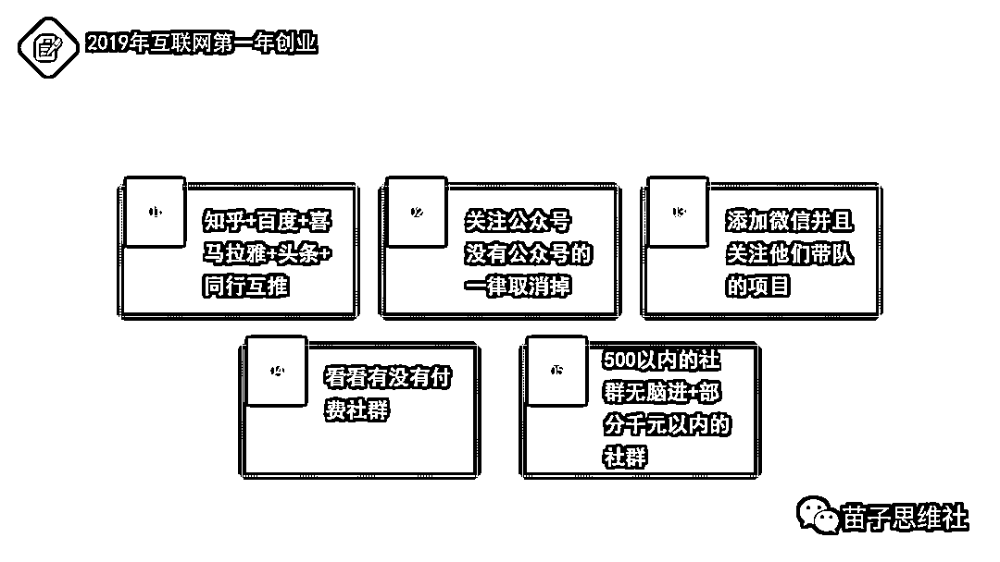
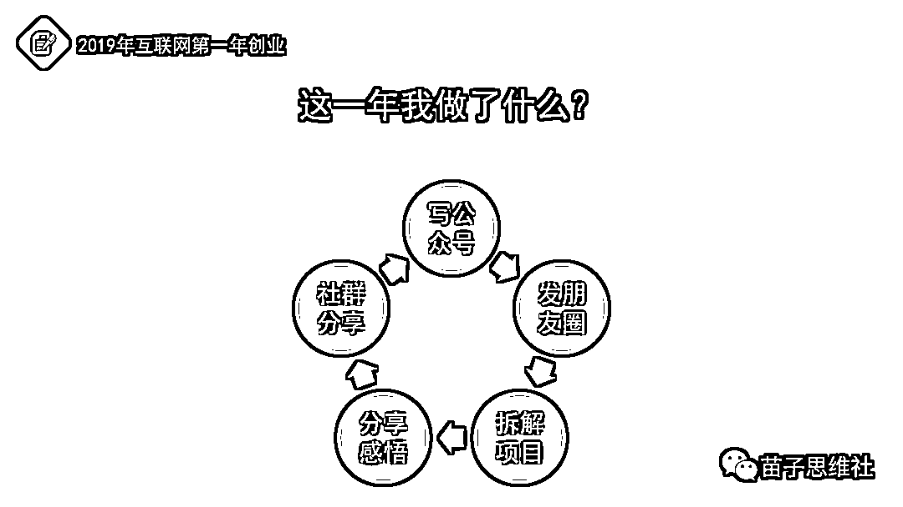
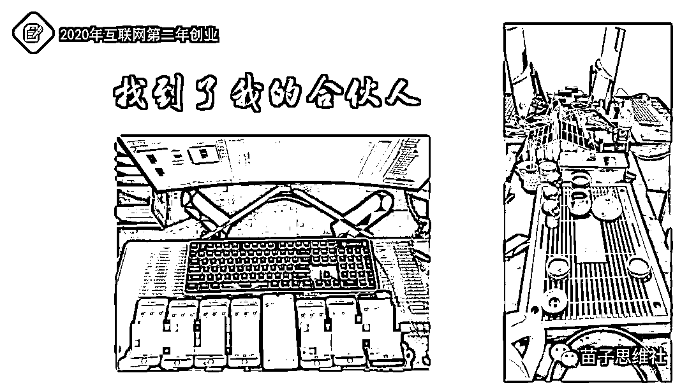
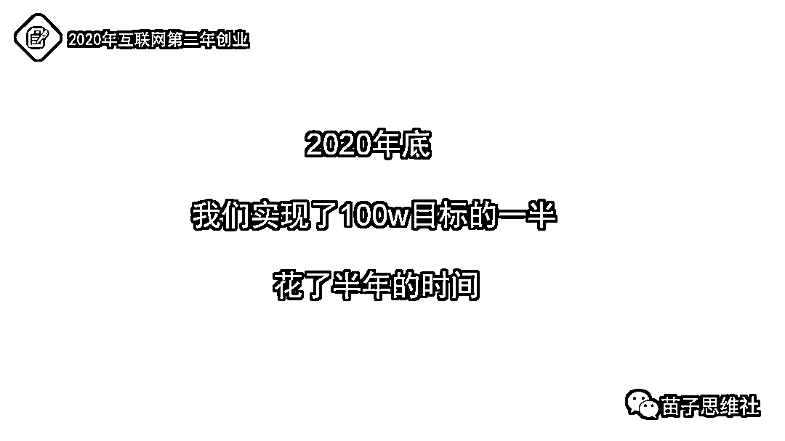
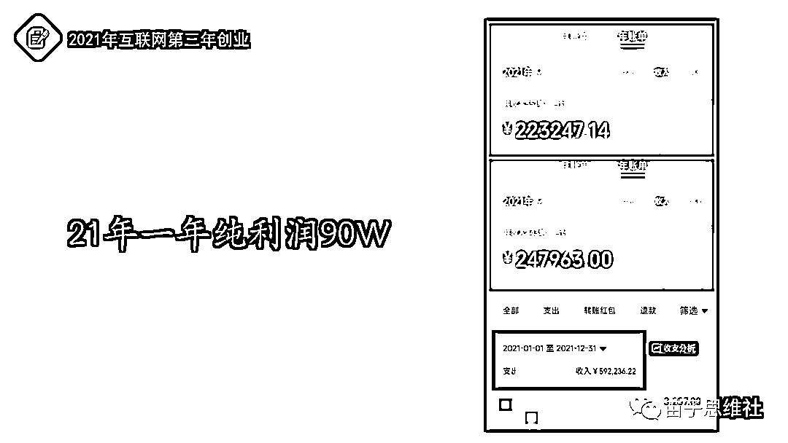
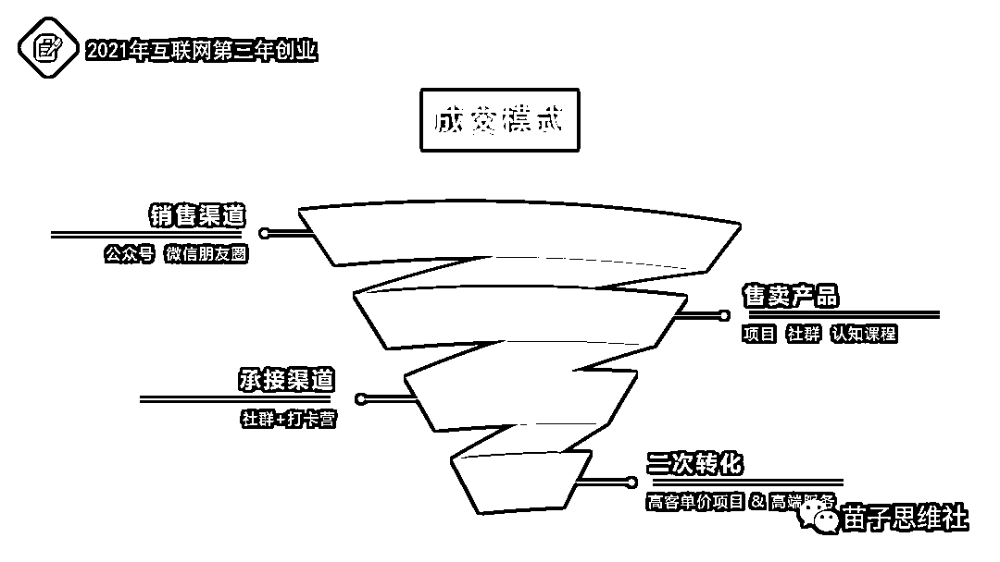
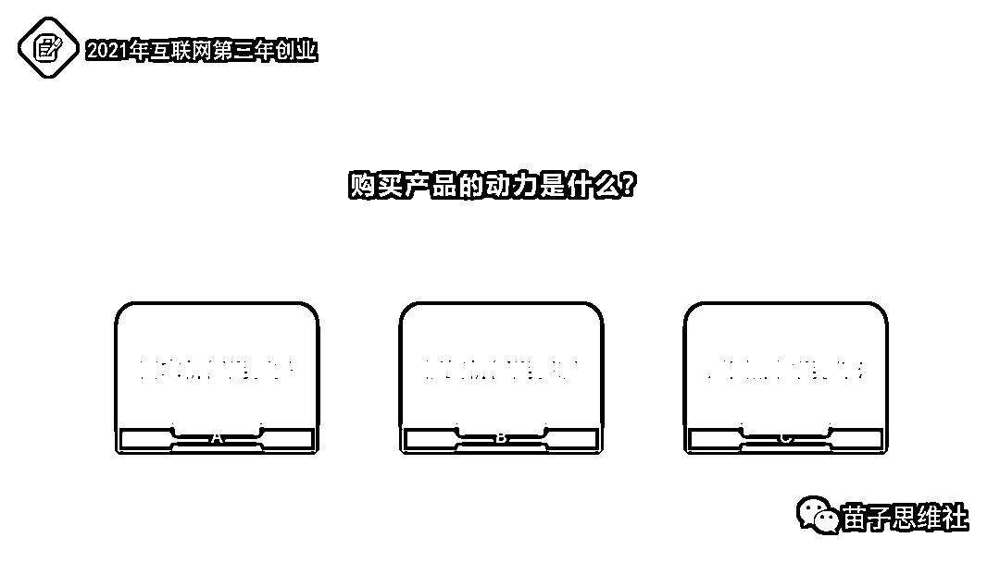
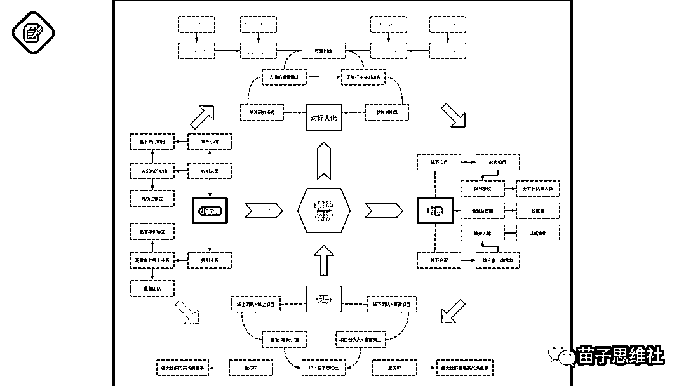
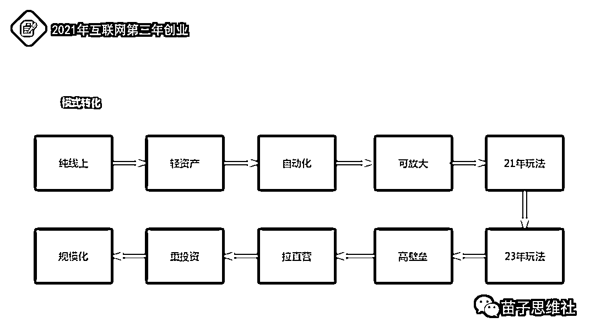

# 苗子：三人团队如何去赚第一个100W（5000字长文自残式拆解自己）

> 来源：[https://mv61xmj001b.feishu.cn/docx/WBsWdTm7uoOXICxiHDncFMdDnvb](https://mv61xmj001b.feishu.cn/docx/WBsWdTm7uoOXICxiHDncFMdDnvb)

圈友们好，我是苗子，也是一个连续创业者。

今天分享的主题是【三人团队如何去赚第一个100W】，也是从零到一记录我整个互联网起盘的步骤，很有价值，也对我自己非常有意义。

很多时候我们不一定要埋头的去努力向前跑，偶尔停下来看看之前走过的路，看到的风景，也是对自己心灵的一次升华和警醒。

进入主题：

# 概述一下我的创业经历，这里就简单的写一下：

2015年出社会。

2016年开装修公司----2018年9月份退股。

2019年开始摸索互联网----一直到现在的全职互联网创业。

相对于其他老哥的创业过程而言，我的创业经历很中规中矩，没有什么激情四射，也没有什么大起大落，可以用两个词来概括：平淡，平凡。

从出社会到现在只做过两个行业，线下和线上，但这两份行业却是包括万象。

细数一下我从事互联网创业满打满算应该是有4年的时间，而我真正能赚钱的是后面的三年时间，而我的第一个一百万却是我足足用了两年半的时间才去赚到的，准确的来说，第一年不赚钱，从第二年开始赚钱。

那接下来是我从19年到今天的一整个复盘，同时也是我互联网创业路上的一些心得和干货，希望我的经历可以对于想入局互联网创业朋友有一些帮助，同时对一些互联网大佬们可以勾起你们刚刚创业是那段艰苦岁月的回忆。

# 2019年互联网第一年创业。

当时的网创领域相对于还没有现在这么正规，各种妖魔鬼怪的项目层出不穷，只有想不到的，没有出不来的项目，各种坑都有，什么养龙养猫养狗养猪赚钱的，还有一些卷轴模式的项目，一不注意就会白白的浪费时间和浪费金钱。

所以当时我也是比较迷茫的，不知道那个靠谱，不知道哪个可以去做，所以我做了一件事情，直接去对标，找到10个相对于比较靠谱的互联网创业博主。

当时为了去寻找和搜集这些博主，我足足花了两天多的时间去各大平台去搜寻，然后不断地去筛选和去重（有一些人是同一个人孵化的IP），最后锁定了10个。

## 当我找到了这10个博主，就开始正式的开展我的网络创业之旅。

1，寻找博主。

2，没有公众号的一律取消关注。

3，添加私人微信，持续关注。

4，看付费社群。

5，给自己定一个付费额度然后无脑的进。

当然这一年我陆陆续续的进了十几个社群，其中不免有些踩坑的，当然这些踩坑的社群并不是指项目不靠谱，或者让我必须赚到钱，而是真的一点服务都没有。

## 第一波进了10个社群，花了我差不多4000大洋。

说一句题外话，付费我是从头到尾都是认可的，而并不是我现在做了培训方面的业务这样说，我之前做线下装修也经常去做参加一些装企类的培训班，总裁班 等等。

这里引用枭哥的一段话，咱们赚钱就是为了进高层的圈子，然后去赚更多的钱，然后再用更多的钱去进更高层的圈子，去赚更多更多的钱。

虽然是玩笑话，但是如今赚钱就是这个样，想在一个行业里面去赚更多的钱或者想去放大自己的盘口，那就必须去寻找高人指点和模仿高人，花钱，这就是最快也是最直接的方法。

## 那我进了社群有两个目的：

1，第一时间去了解行业的实时动态。

2，第一时间去对标和模仿前辈们的运行模式。

包括我到现在都非常喜欢的去干一件事情，那就是每次遇到一个牛X的大佬，我都会去扒一下他的运行模式。

现在信息很透明，无非就是那几个自媒体平台，短视频三大傻 抖快小，知乎，微博，所有的平台都去搜一遍，最后再去关注一下公众号，到这里还是不够透明，最关键的一步也是有点无耻的一步，那就是去盗版网站，里面去搜一下这个人所有的课程，这时候从头到尾才扒的很干净，至于后面是加入还是继续观察那就看自己了。

取其精华去其糟粕，模式能套的就套一下，套不了的就换下一个，最差的结果那就是他的这套模式我可以当做以后的谈资，美名曰我有一个朋友一年赚了5000w，无中生“友”。

其实我19年是真的没有赚什么钱，当时记得带一个咸鱼的项目9.9元，一下午赚了一千多，把我高兴坏了，其他时间就是在啃老本和积累资源和去对标同行。

因为我进入互联网的目标从来就不是去简简单单的做一个项目，而是一开始就是奔着组建自己的工作室目标来的，最终的想法就是当一个小老板。

## 那为了当上这个小老板，我19年做了那些事情？

一共就5点，每一点我都在做，那通过5点，我这一年得到了什么？

1，我进了十几个社群，和十几个社群的群主关系都还不错，包括很多人现在都还在联系，比如圈内的战劲，王一书，九京他们，有时候偶尔还聊聊天。

2，练成了随手就可以写出一两千字文章的能力，这个能力也是对于我帮助非常大。

3，练成了我任何项目只要去研究几个小时就可以明白他的底层逻辑，只要不是台高壁垒的项目。

4，学会了跑任何项目一个星期大概率的会出结果。

5，得到了可以给予别人价值的能力。

6，得到了之前仰望的大佬价值的认可，可以和我同频对话和交换想法。

7，得到了各行各业资源的链接。

8，我积累了我的第一波私域流量2500+好友，公众号接近4000粉。

当然还有很多很多其他的，比如见识，比如模式的学习，必须风口的敏锐度，这些我觉得都是用钱直接买不来的，必须要时间的沉淀。

那如果要总结20年之后我为什么能赚钱，那就是我用了19年一整年的时间去做了积累。

# 时间来到2020年，互联网创业第二年。

同样，第二年关键词也是花钱，到现在我都很感谢我自己当时花的这两次的钱，可以让我在以后互联网的道路上和很多前辈大佬一起奔跑。

前面说了19年没有赚钱，20年不可能一上来就掏老本，积累了一年也该变现了，那我20年的目标就是：空手套白狼。

和大多数创业者一样，我都是采取“边赚边花”的方式。

我一直在等一个机会，2020年整整等了8个月，在8月初我遇到了我的合伙人墨羽，机会终于等来了。

和合伙人在一起做事也非常偶然，因为一个项目通话两个小时，然后我直接买票去找他，第三天就被我“忽悠”过来一起创业了。

这里说一下我对于合伙人的想法，有很多小伙伴都问我怎么去找合伙人，其实我也不知道，可以说是缘分，第二点就是如果要在一起合伙做事，那必须在一起办公，什么线上先合作合伙，后面必会出现矛盾或者大概率坚持不下去。

之前合伙人也提到过，能不能线上，我直接回绝，要么直接线下，要么还是各玩各的，以后可以项目上的合作，我的强势，加上的合伙人的敢于尝试，才能碰到一起。

OK，这是题外话，来了我这边，我们就开始成立第一个属于我们自己的工作室，同时我的第一个三人小团队正式的成立，我，合伙人墨羽，加上他的老婆。

而我们当时定的目标是非常简单的，那就是从8月份到年底，距离过年6个月时间，目标是赚10万，过年的时候可以一人分个5万。

这是我们当时办公的小房间，一件次卧，两台电脑，三个人，十几部手机，买了一个泡茶的玩意，没事就躲在里面干活，累了就喝喝茶，聊聊人生梦想，还时不时的吐槽一下哪家外卖难吃。

也就是为了这个10万的小目标，我们拼尽全力，用了半年时间足足赚了5倍的目标。

## 而我们的第一个100w就是从这个时候开始起航。

同时我们的第一个线上社群【思维社】正式成立，第一批一共招募了100人左右，当时的价格是365，用了几天的时间去完成了第一次招募，也是这时候让我第一次感受到了线上赚钱的魅力，被人信任的魅力。

一晚上就收入了快3万多，3万多是什么概念，说好半年的10万小目标一下子就实现了三分之一，当晚我们就花了200多吃了一顿小龙虾。

这也是我们这个团队的第一笔启动资金。

既然有社群，那必须得有项目，当时还是处于项目带人的层次，一开始带社群成员去做豆瓣引流，这个确实没有问题，但是长时间去做这个，不经发出灵魂拷问，引来的人干嘛，百分之九十的人都没有后端变现，而且这些人大多数都是白嫖的，没有价值。

就在遇到这问题的时候，很幸运，碰到了直接让我们出圈的一个项目，也是当时独家的项目。

## 小红书起号卖号项目。

就是现在这个项目我们还一直在做，只不过没有花那么大的精力去做了，同时也是这个项目，让我第一次去线下花钱去学项目。

这也是为什么我2020年的关键词是：线下敢于花钱。

一共跑了两个地方，具体的东西就不说了，一路上吃喝拉撒，加上其他开销一共花了7000大洋。

其实我们出去之前就估算到了这个数目，也是比较心疼的，但就是花了这个钱，我们半年才能去赚到50万。

## 收入一共分为三种：

1，社群收人，从365一路上涨到1980。

2，自己做号收入，后面添加到了50部手机，每个月都可以起万粉号差不多20-30个，一个月差不多有几万的利润。

3，学员出号我们拿一定的差价，每个月也是有万把块钱。

当然这个就不细说了，就是这三个方面收入，当然能赚到这个钱肯定要付出一些东西。

一个是把项目做到极致；一个是把项目后端资源打通。

我们当时其中一个月做了一个打卡营，社群200+成员和我们一起去做号，我们统计了一下账号的数量，一共有解决6000个账号，什么概念？

我们做号都是一机一号，也就是一共有6000部手机再做号，当时我们主要做游戏，动漫，音乐三个领域，当时只要去小红书刷到这三个领域，10个视频最少有4-6个视频使我们这边的账号，这是项目做到极致。

第二个资源打通，学员有这么多账号，怎么去帮他们卖掉变现，从而不会出现号多了卖不出去，为此我们去跑了很多城市，北京，广州，佛山，济南，南京，对接了6家MCN机构，也同时对接了大量的小红书个人博主，才能实现把这么多账号给出手。

这半年就是这样不停的收人，不停的做号，不停的卖号，不停的去对接资源，循环往复。

## 那2020年这一年中我得到了学到了那些东西？

1，第一次感受到了有壁垒思安道带来的甜头。

2，第一次搭建了一个小规模的基本盘。

3，第三次感受到了做社群的魅力。

4，第一次感受到了人脉资源的重要性。

# 时间来到了2021年，关键词：团队 模式

其实我到了这个阶段，说句装X的话，我已经不缺项目了。

这个时候我每天都在考虑怎么让三人团队去发挥到最大化的效率。

其实这个时候我的创业关键词有四个：纯线上，轻资产，自动化，可放大。

模式纯线上：坚决不拉自营项目。

投资轻资产：坚决不会碰重投资。

人员自动化：有一套完整的成交系统。

项目可放大：一人可以矩阵化的工作。

其实21年的这个时候我是比较惶恐的，我清楚的明白20年半年可以赚50w是有运气成分在的，虽然这个时候的势头还是比较好，但还是会比较焦虑，所以才能定下这4个关键词。

所以我们也是非常的小心和干劲十足，一直到年底我们也是非常幸运的去干到了90w的小目标。

21年我主要就是两手抓。

## 抓团队：

其实我的管理方法就是三个词：定时，定量，定人。

确定时间落实，确定工作量的划分，具体的责任指定人员，我把这套模式定为最小三人模型，我把这三人的群体叫做 增长小组。

这种小团队的作战模式适用于非常多的场景，比如测试一个项目，比如跑一个渠道的数据，比如去提高某一方面的转化率，都非常适合用这套小团队去攻破，包括我现在工作室还是一直再用这种方式来去跑项目。

## 抓模式：

好的模式搭建好了，可以节省很多的人力物力精力的浪费，而我的最小模式也是非常的简单。

非常简单，就是这么一个简单的模式就可以让我不用专门配一个客服去盯着，从而可以去做很多其他的事情。

剩下的就是不断的去围绕这个简单的基本盘去：弄流量，跑数据，晒收益。

这里说一个我做了很久才想明白的一个题外话：那就晒数据，很多人讨厌晒数据，突然有一天我想明白了，晒数据它只是一种实力的展现，它不一定是晒收益，可以去晒团队人数，可以去晒社群人数，可以渠晒公司规模，可以渠晒人脉，可以渠晒豪车，一切可以渠证明的自己实力强大的东西都可以去晒。

所以说，我们有实力就一定要晒，咱们可以去接受一切可以便于我们营销的东西，因为这个是一个酒香也怕巷子深的时代。

理解下面这张图，一通百通。

到了21年的中旬，其实我的三人团队第一个一百万已经实现了，也是我从19年到21年足足用了两年半的时间去实现这一百万。

## 如果要我总结21年这一年我学到了获得了什么？

其实我没有做其他多余的动作，我只不过把19年和20年所学所得更加用心的去用时间和心思去深耕了而已。

这张图包含了我目前整个工作室的运营架构。

OK，今天我分享的是我如何去赚到的第一个100万，那我为什么要去分享我的创业过程？

而不是去分析和拆解我通过某某项目去赚到100万？

因为我一直奉行一句话：

项目不会永远赚钱，

一直赚钱的永远是我们自己。

我用了两年半去赚到一百万，对于很多大佬来说很漫长，但对于我们自己来说却是很满意，因为只有自己强大了，能力提升了，思维开阔了，这才是赚钱的根本。

包括我从21年到23年的一个模式的转变，也是同样的道理。

22年是一个关键，当然这个有空我会后面的文章里面去分享。

总结一句话：

在合适的时间去做合适的事情，

在合适的阶段去挣合适的Money。

最后再送给大家一句我的座右铭，也是送给自己。

# 博观而约取，厚积而薄发。

这是宋代诗人苏轼《稼说送张琥》里面的一句话。

大意是：只有见识广博才能择其精要而取之，只有积累丰厚才能得心应手为我用。

放在自己的创业之路上也是一样，博观约取，才能厚积薄发，大家共勉！！！

感谢阅读。