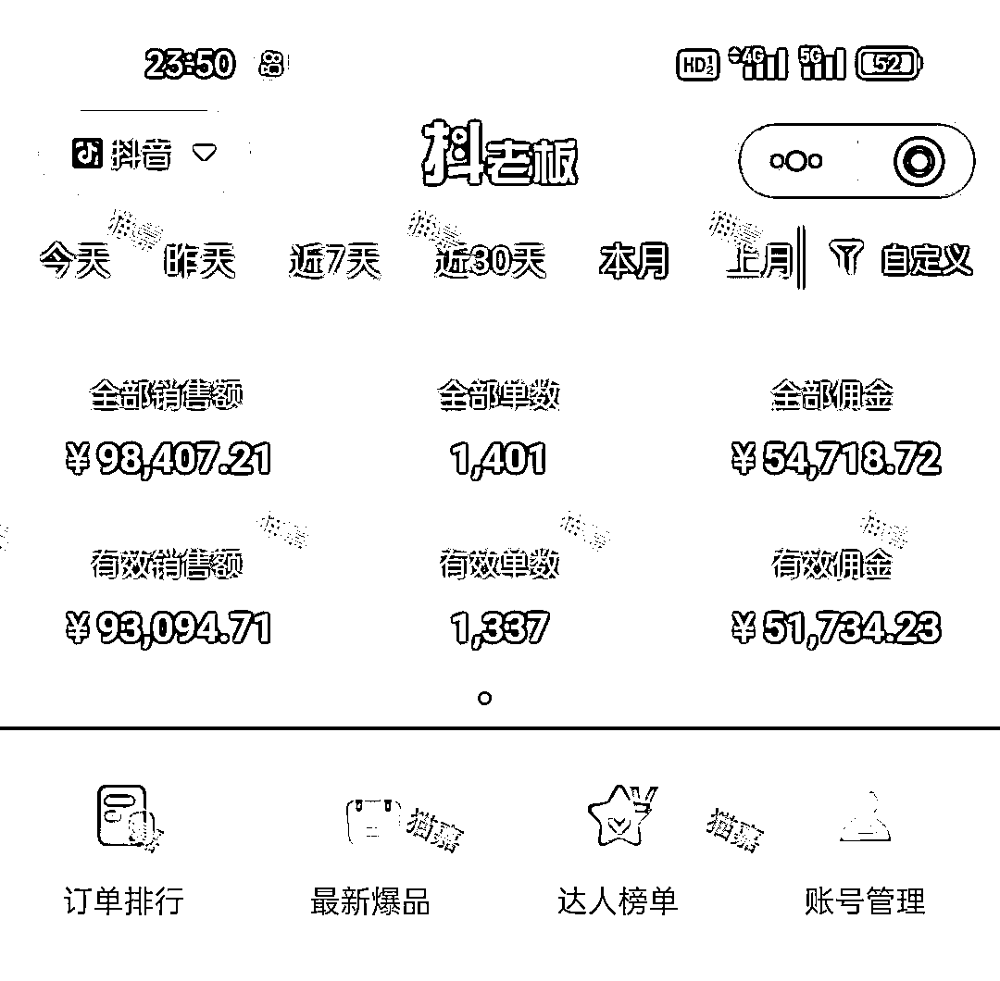
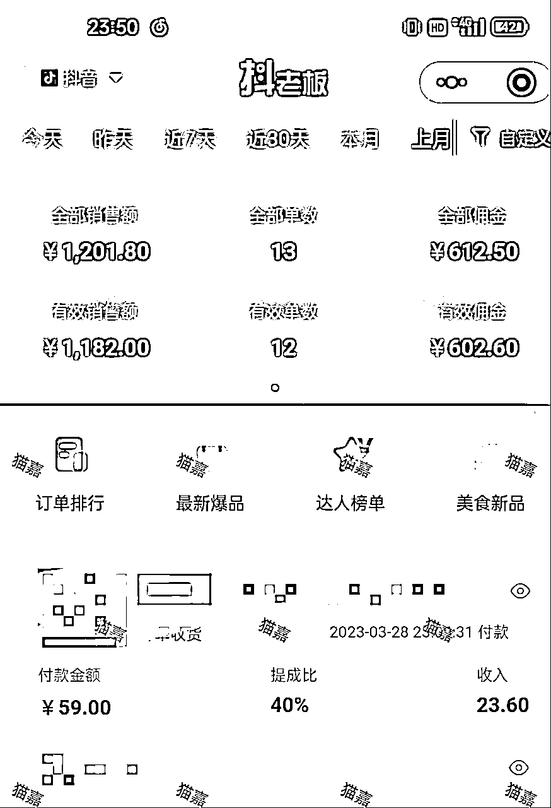
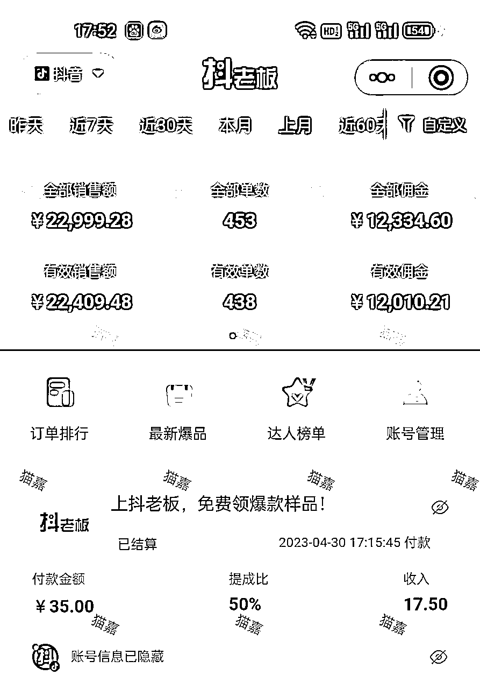
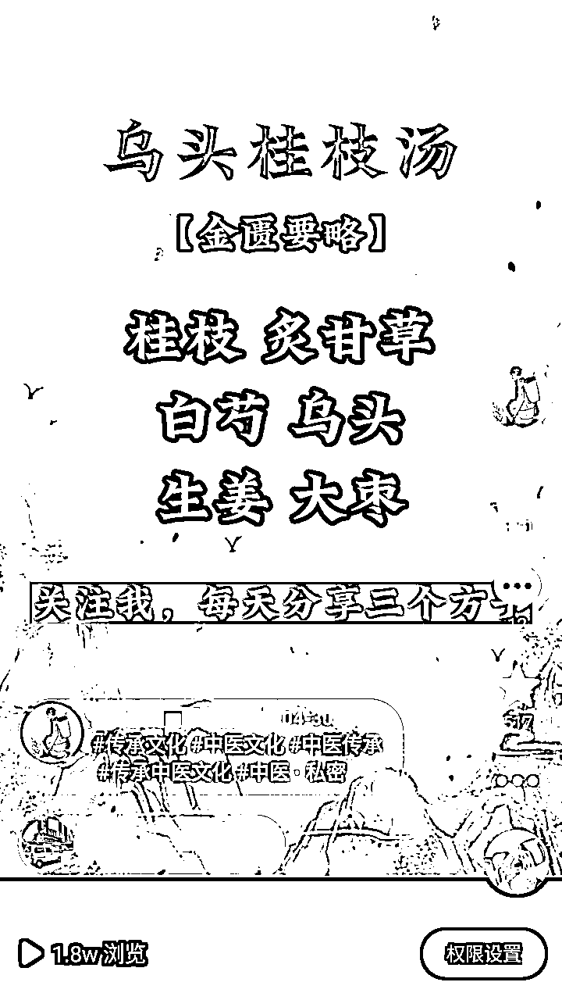
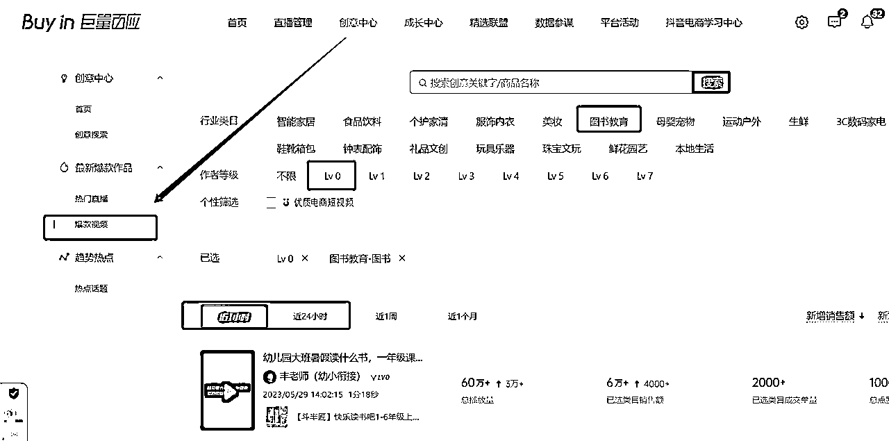
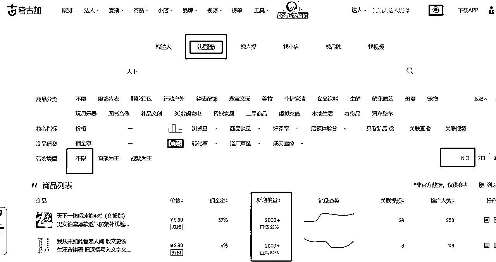
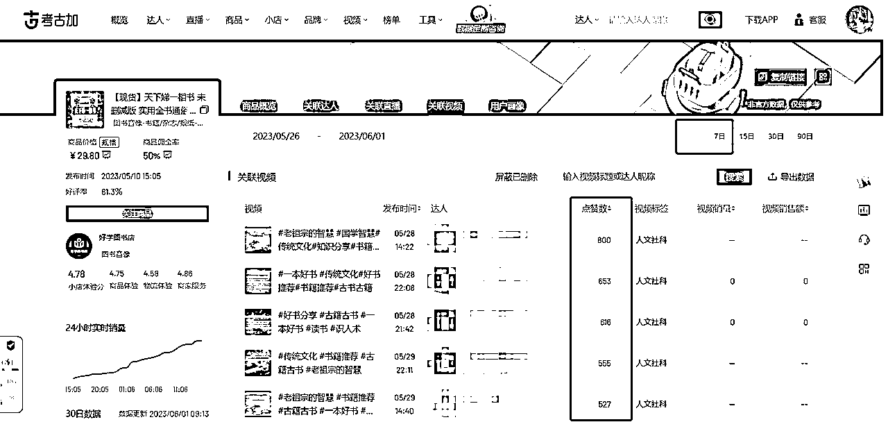
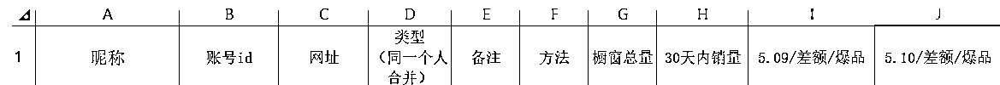
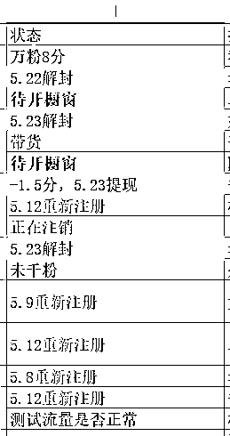
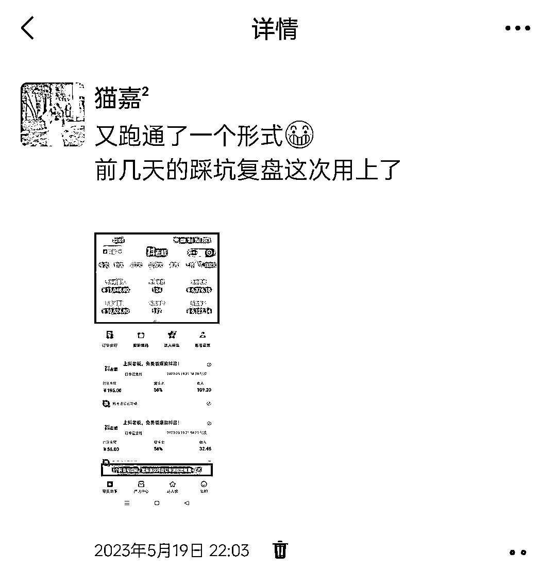

# 从3月月佣602到5月月佣5w+,我是如何从众人口中的内卷赛道低谷爬上来的

> 来源：[https://s31nx3n9vr.feishu.cn/docx/WPV8dkx5NoSXArxQd9YcfBAvnQc](https://s31nx3n9vr.feishu.cn/docx/WPV8dkx5NoSXArxQd9YcfBAvnQc)

大家好，我是猫嘉，一个去年本科毕业即全职投入网赚的01年女生，目前在广西

现在做的是抖音养生号，没有真人出镜，只做实拍+混剪，纯自然流打法，5月份破了我的历史最高月佣2.7w，最后拿到5.1w。

在这个赛道有一个流行的风气，就是很多人觉得不能做了，或者说很不好做，下面我会对这个项目进行一个整体的复盘，并拆解出可复制的操作给大家。

### 一、过往经历

着急看实操流程的朋友可以跳过这一段，想了解我或者寻找共鸣的朋友可以看一看哈哈哈。

#### 1.踩坑经历

非常惭愧，我已经算是这个赛道的老鸟了，去年4月跟着我的第一位师傅拱卒哥的训练营接触了这个赛道，当时妥妥的小白，专注力不行，做了1个月之后我陆续转去做了3个项目，在这些变更的赛道上，用时3个月我总共挣了不到5k块。去年9月重新转回抖音养生号，也是在那一个月拿到的2.7w，可以说小白常走的“不专注”的坑我无一例外走了一遍。

而今年踩的坑主要踩在了所谓的“长期主义”，随着抖音养生号的判罚越来越严，我的账号基本上都 禁言30天，以及私域概念越来越火，有人劝我别再搞快钱了，没积累，去做点长期的项目吧。

以我当时的认知，我信了，于是开始找那些和私域相关的项目。

当时确实做了一波引流，两周内引了1000多人，但是后续的维护让我觉得烦恼，而且短期内收益很小，前期投入成本很高，于是我决定暂时放弃做私域，今年3月份转回我最擅长的领域——抖音养生号。

小提示：在你还没赚到第一桶金时，莫谈长期主义。

重回这个赛道我却做错了选择，我选了更长期却不适合我的形式——真人出镜。

出于性格对出镜的抵触，每次点开录像我都会觉得很勉强。我的错误在于不是“取长”而是“补短”。

出镜尝试了1个半月，收益为0，3月月拥602块是吃老本，那一刻我迷茫了，这是我做这个赛道以来最差的一个月。

#### 2.转折点

4.18号我去找了微笑，他告诉我应该去做可复制性强且概率更大的事，于是我转回了实拍+混剪。

转回实拍混剪的第一天就出单了，4.18到4.30号，总佣金是1.2w。

5月份为什么进步比较快，一切要源于微笑5月初说的要定一个月预期目标和月理想目标。

我的预期是2000，第一周就完成了。理想目标是10w，有点狂，但我不要求自己一定要完成。整个月的收入，我是按照月佣10w的标准去做事情拿到的结果。

下面我开始介绍我的操作流程，以及除了基本操作外我还干了哪些事。

### 二、实操流程（可复制）

#### 1、起号

（1）图文经方

以图片的形式展示经方内容。这是我5月初用的起号方法，一周内起了3个千粉号，速度快风险也高，起号过程中禁言30天是正常的事。

（2）倪师讲课语音+对应图文

这种方法比图文经方风险小一些，起号也快，速度不亚于图文经方

（3）刷粉

找抖音服务商给你刷，1k粉价格在一百多到两百多，看你选择的粉丝质量，我选的是最便宜的。刷完赶紧开橱窗，建议直接刷2k粉，因为掉粉快。刷粉的操作适合带通用品，比如书。

自第一种图文经方起号陆续干掉了几个新号后，考虑到我要快速做好账号轮动，我决定全部刷粉，一共刷了6个号，出单正常，带货视频发两三天后就能出，带的全是书。我有两个刷粉号爆过单，各给我带了1w+的佣金。

#### 2、选品

工具：巨量百应+考古加。

（1）巨量百应：看新品或者新爆的视频

“图书教育-图书”，只要受众是中老年的书，我都会提前找商家拿样品，在稳定收益的额外时间测试蓝海品，包括中医和玄学类。5月份我带的99%是书。

（2）配合使用考古加：看这个品的整体带货情况，寻找可能遗漏的爆款视频

“找商品”—“昨日”—“按新增销量排序”

我现在看的是不限视频和直播，因为视频和直播带货我都能做，就看这个品更适合什么类型

点进选择好的商品—7天内—按点赞量排序，找离今天最新且爆的视频，建议再点达人的头像进去查看他有没有更新的爆款

（3）跟对标

除了看榜单，多去找对标，每天记录橱窗数量，留意异常值，你会发现有些账号在发一些不同的品偷偷赚钱哦

#### 3、带货形式

（1）图文带货

带书的就自己拍，带汤包的直接上网找图片。

（2）混剪

如果你的样品还没到，可以拿人家的实拍做混剪；真人抠像如果出单不理想，也可以尝试把他做成混剪，因为每个品有属于他更好的带货形式

（3）无人直播

这是我原来一直不会也不想学的，但是学会了之后是真香啊，我有一半多的收益来自无人直播。

我主要用无人直播跟大爆的品，逻辑就是：

全部发流量视频，测出能爆的流量视频，然后开播，一边直播一边原封不动重复发这个视频，每天发10个流量视频，间隔1小时。

但这样的操作容易让视频显示待优化，有概率导致你的账号禁言，所以重复发的次数多了之后我会将视频背景换一换，把静态图片换成动态风景。

按理说应该做日不落直播，我最多开了69h。但是我房间太小了，有打光灯会影响睡觉，之后晚上都关播了，不过第二天开播其实也不太影响流量。

直播间搭建参考对应那个品的直播同行，一比一复制即可。

常见的违规是判你录播或者没有展示商品，所以有必要加下时钟（可以摆个手机显示时间），出现违规把直播间布置大换一下，样品要露的显眼一点。

用新号测试。无人直播开始之前先发流量视频热一下账号，最好是有破千的流量，然后开播。我是观察流量视频有跑起来的趋势才开播，如果卡四五百播放就不开。

新号容易做爆直播间是因为刚开始开播有流量扶持，所以你会发现开播后不久直播间会疯狂上人。

直播间精细点的运营就是找个账号当托儿，在底下评论：“老师，我买了全套**，帮我加急发货”

#### 4、如何跟爆品

别小看了这一点，我是吃了三次亏才认真学会跟爆款的

跟爆品的四大要点：对标视频爆且新、跟的速度快、一比一复制、多账号怼

（1）对标视频爆且新

出现在巨量百应上的视频较新，参考上面用巨量百应找品的方法，看近1h内和24h内的。然后配合考古加找更多这个品的爆款，观察有无更新的视频。因为有些达人会隐藏自己的巨量百应账号，所以很有可能别的账号在偷偷爆单

（2）跟的速度快

爆款在爆的时候，就要开始跟了，晚一天可能损失的能有上万块钱，这个坑，我踩了三次

（3）一比一复制

爆款长啥样你就做成啥样。真人爆款怎么跟，先直接抠像，建议提前跟原作者打声招呼。做抠像的账号，有的会爆，你就看看他是怎么抠的，背景是什么，一比一抄。我这边是不做微创新的，因为我相信同行总会比我更聪明，事实也是如此。

（4）多账号怼

用数量对冲爆单的概率，一般碰上爆品我会把所有账号都怼上去，同时也是为了放大收益

### 三、我还做了什么，才让理想目标10w完成了5w+

还是那一句，我是按照月佣10w的标准去做事情的

#### 1、大量起号

除非你非常走运选到一个巨爆的品，否则扩大账号数量才能更好的放大收益。

我要如何才能做到月佣10w？我的答案是增加账号数量。

4月末我手上一共有5个号，5月我办了5张卡，加上我爸妈的号，回家两趟搞了实名。5月底我手上一共有18个号，其中12个能够带货，6个还在起号。

下面这张图是我5月5号的情况，9个号被关小黑屋，当时选的品高风险高收益

被干到还剩2个带货号，怎么办？我是一边起新号一边办新卡一边精细化运营剩下的2个号，每天把视频怼满。

#### 2、每日复盘

我每天的复盘写的都很认真，记录今天干了什么，做的好的动作是什么，不足是什么，改进计划是什么。

自去年没跟上医案和甘草干姜汤的爆款之后，5月中旬我又继续错过了爆款。大家都在爆单，我自己佣金一两百，有时候为0，真的是摔得不够疼就不会深刻反省

第一张图是5.15号的复盘，这是我自己的微信矩阵群

第二张图是深刻反省后跟上爆款后发的朋友圈，那天的收益是6k+，之后三天都是6k-8k

#### 3、极度专注

这个月有人劝我去做小红书电商、ai绘画等等，我丝毫没有动摇，依然选择在抖音上深耕，因为这个赛道才是适合我的。

#### 4、保持乐观

即使账号被关小黑屋，或者有几天收益不佳，我也会保持乐观。号没了可以再起，钱不是不好赚了，只是它没有流进你的口袋。

观念影响行为，行为影响结果，如果抱着做不好、不好做的观念，那么行为自然也会受阻，消极的观念导致消极的行为，结果自然不会太好。遇到问题我会先内观，找自己做的不足，而不是着急抱怨大环境。

#### 5、断绝所有无用社交

首先学不到东西，其次浪费我时间，最后影响我心情的社交我称之为无用社交。之前比较优柔寡断，没有拒绝和别人闲聊。这个月不再去聊日常琐碎，没用的群也都退了。

断绝无用社交后，我把空出来的时间花在了锻炼身体和看书上，少了很多情绪困扰，做项目也顺利很多。

#### 6、不要赢在局部输在全局

这个月除了爆单兴奋得有点睡不着外，为了保证第二天的工作状态，我没有一天是熬夜做项目的，创业到最后拼的都是体力，我得保证身体健康才能走到最后。

### 四、感恩

非常感谢星主亦仁提供了这么高质量的平台，打开了我的新视野，作为生财新人，在生财有术我看到了更多的牛人，更新更快的搞钱信息，学习到了很多创业心法，希望今年能认识更多同频的爱搞钱的朋友！

感谢拱卒哥@拱卒，他是我互联网创业路上的第一位师傅，把我领进了网赚的大门，并且带我选中了这个长期的项目，没有他就没有站在抖音养生号的猫嘉。

感谢微笑@微笑，是他在我低谷的时候用力拉了一把，给我指明了正确的方向，在项目全局和认知上都给了我很受用的指导建议。

还有大家对这个赛道感兴趣的，欢迎找我交流，一起进步~