# 《瞬息全宇宙——穿越之旅终极教程》

> 来源：[https://ry5hwpuf7b.feishu.cn/docx/WbFVdvGkAoo38ZxDumwclWEynRg](https://ry5hwpuf7b.feishu.cn/docx/WbFVdvGkAoo38ZxDumwclWEynRg)

《瞬息全宇宙终极教程，手把手教你做出百万点赞视频》

大家好，我是吴东子，用奶奶都能听懂的方式分享可以落地实操的干货

我的所有资料都在公众号「吴东子AI」

最近一种叫“瞬息全宇宙”的视频火了，抖音一期视频百万赞，各个博主视频都在带瞬息全宇宙这个标签，于是就有很多朋友催我出教程了，在琢磨了几天之后，终于整出来了

教程包含了插件的安装，界面的讲解，基本看完之后是能做出来和爆款一样的效果的

如果你想定制化操作，也有进阶的知识点让你玩出花样

另外，模型和预设也给大家准备好了，放在文章的末尾，希望能帮助到大家

严禁抄袭搬运，势必追诉到底！

# 一、瞬息全宇宙

最近这段时间，一种叫瞬息全宇宙的视频火了

抖音一期视频百万赞，各个博主视频都在带瞬息全宇宙这个标签

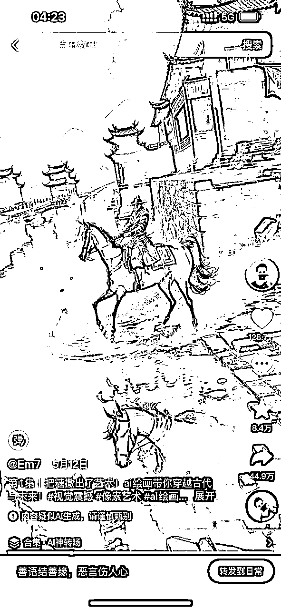

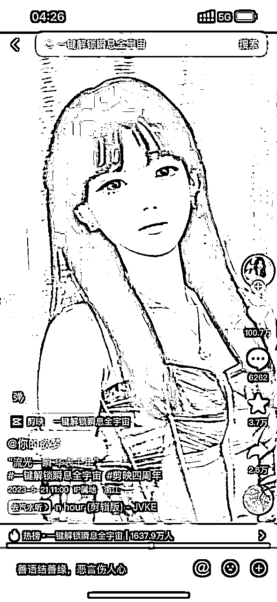

瞬息全宇宙分两种：

一种是【穿越之旅】，另一种是【平行宇宙】

“穿越之旅”就是这种画面不断变化，变成新场景，看起来像一个穿越旅途一样的视频

“平行宇宙”就是固定着原来的照片轮廓，变成不一样的风格的视频

就像是一个人在平行宇宙，平行时空的形态

制作穿越之旅，用到的是Stable Diffusion里面的deforum插件

制作平行宇宙，用到的则是一个叫runway的网站里的功能

两种视频都叫“瞬息全宇宙”，但做法是完全不同的

于是你会发现网络上很多文章，其实都没搞懂两者的区别就教别人做了，甚至很多是教大家用做“穿越之旅”的方式去做“平行宇宙”的效果，结果最后观众其实做不出自己心中想要的效果

所以希望这篇文章能带给大家更准确一点的认识，如果我有说错的地方也欢迎大家指正

这篇文章主要是跟大家分享“穿越之旅”的制作方法

“平行宇宙”的制作方法可以看这篇文章

# 二、“穿越之旅”怎么做

穿越之旅用到的是Stable Diffusion（简称SD）里面的deforum插件

这个deforum插件的使用方法跟我们用SD生成照片其实是差不多的

如果还没安装SD或者不会用SD的朋友们，可以看我之前写的这篇文章

想要快速生成一个视频其实只有两步：

1.安装插件

2.写提示词

其他所有的设置都只是为了让这个视频更加的有趣，比如：

1.增加视频时长

2.制作视频运镜

3.定制开头

4.做网上的爆款视频

5.可以照抄的一些参数设置

接下来我就跟大家分享每一个部分的详细操作！

# 三、快速生成自己的第一个视频

## 1.一分钟快速安装插件

先安装Stable Diffusion！！

接下来我们就开始安装插件啦！

1.打开SD，在状态栏里面点击“扩展”

2.点击“可下载”

3.点击“加载扩展列表”

4.在搜索框里面输入“Deforum”

5.看到“Deforum”，点击右边的“安装”

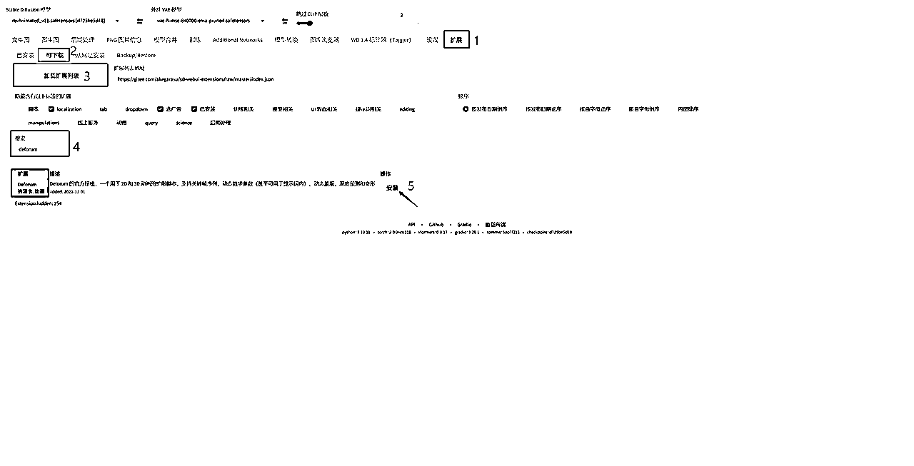

安装完了之后，关掉SD

下载网盘里面的《1.deforum模型》

复制里面的两个文件到SD文件夹，放到“models”里面的"Deforum"文件夹

（添加这两个文件是为了减少后续使用的时候出现报错）

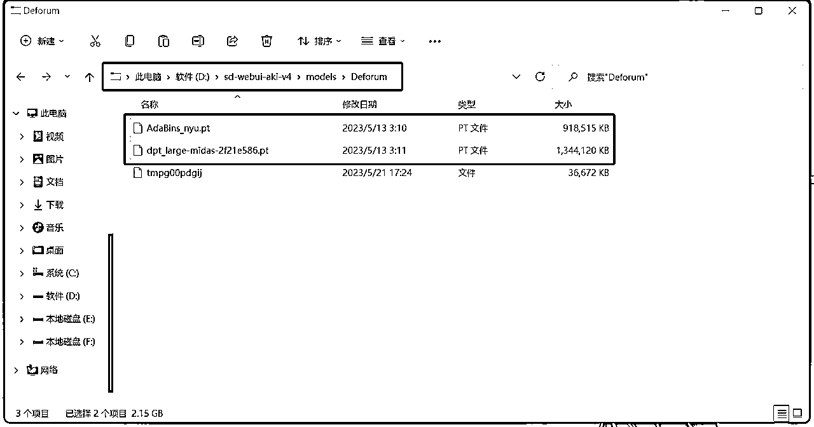

这时候再重新打开SD（重新启动web ui），我们的状态栏里面就多了一个“Deforum”的界面

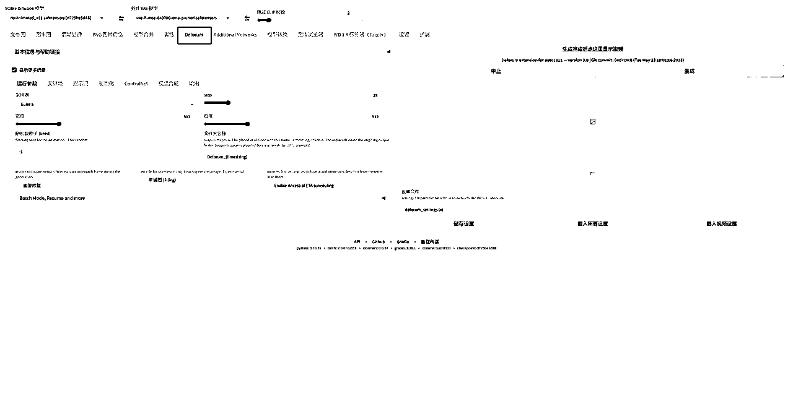

看到这个界面我们的插件就安装好啦！

如果重启之后还是没有Deforum的界面，那是因为SD和deforum的版本不适配

有两种解决办法，选一个就行：

1.升级SD版本

找到“版本管理”，切换SD版本

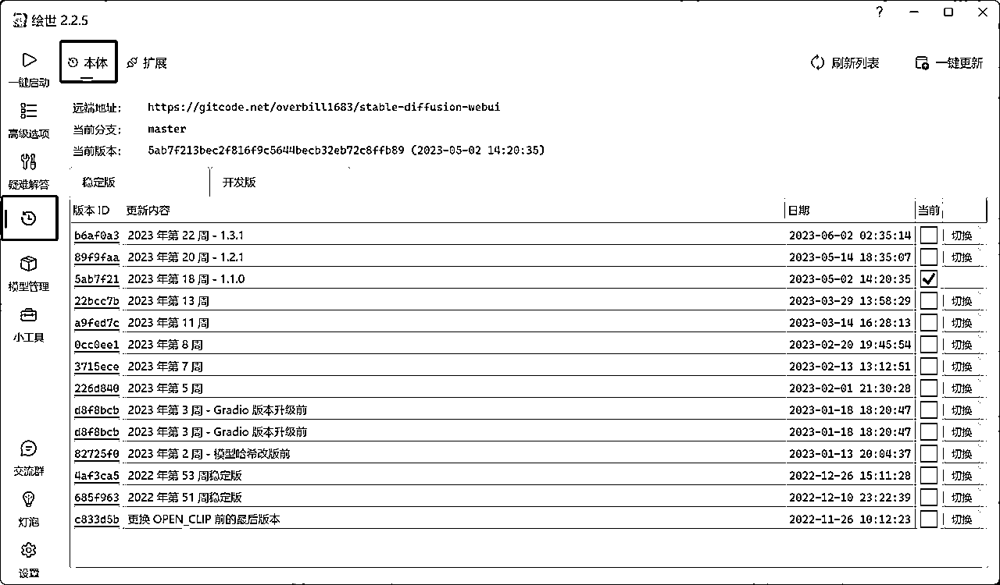

2.降低deforum版本

在“版本管理”——“扩展”——找到deforum，切换版本

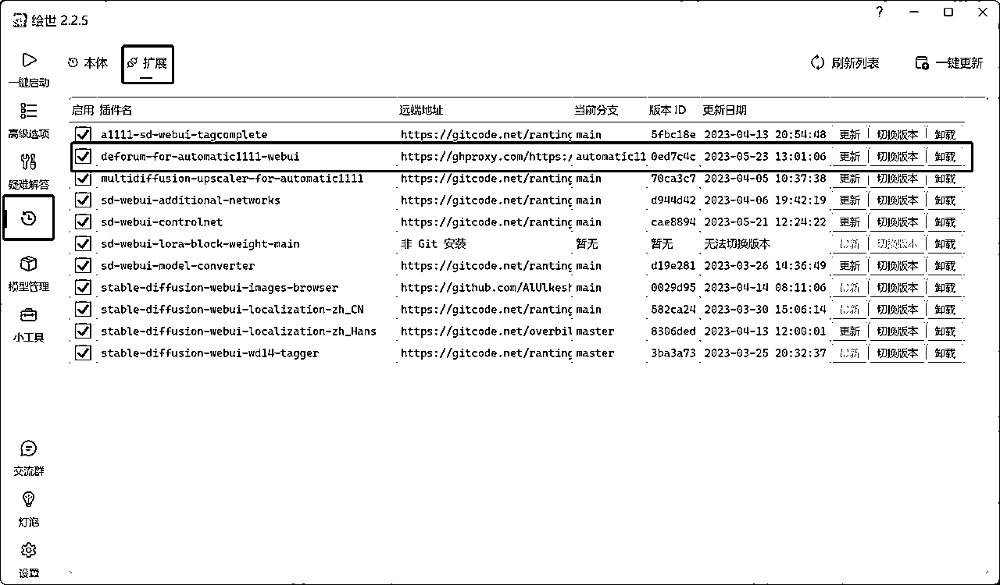

## 2.写好提示词才是最重要的

不管是做图还是做视频，最重要的就是提示词

只有通过提示词告诉SD我们脑海里的想法，才能生成出来想要的视频

写提示词可以分为以下几步：

1.选大模型

2.写提示词

3.写正负向提示词

### ①选择合适的大模型

和做图一样，做视频之前要先选择我们视频的画风，是二次元、真人3D还是水墨画

而在SD里面，大模型就控制着我们照片的画风

在左上角选择切换模型

在我自己试验下来发现有些大模型出来的视频效果是不太好的

目前来说，照片里的这个模型做这种特效视频出来的效果是最好的

（模型已经放在网盘啦！）

模型如果不会存放的话得回头看这篇文章补一下SD的知识噢

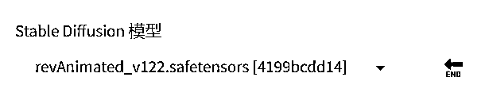

### ②写提示词

我们平时用SD做图的时候，提示词写的都只是在描述一张照片的

而做视频就是需要把几张图的提示词拼到一起

我们打开deforum的提示词界面

里面已经有系统默认输入的一大段提示词

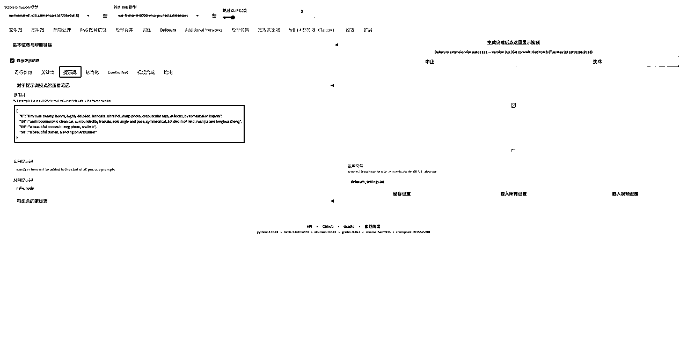

翻译成中文是这样的：

{

“0”: “小巧可爱的沼泽兔，高度细致，复杂，超高清，清晰的照片，黄昏的光线，聚焦，作者 Tomasz Alen Kopera”

“30”: “拟人洁净的猫，被分形所包围，史诗的角度和姿势，对称，3D，景深，阮家和风华中”,

“60”: “一个漂亮的椰子——阴性照片，真实”

“90”: “一颗漂亮的榴莲，在艺术站上走红”

}

我们可以看到一行就是一张照片的提示词

把四张照片的提示词放到一起

出来的视频就是从一张照片演变成另一张照片的过程

像上面四行提示词出来的视频就是一只兔子慢慢变成一只猫，再变成了一个椰子，最后变成了榴莲

接下来我们重新写提示词，生成一条新的视频

最简单的，我想视频开头是一束花，然后变成一个漂亮的女孩，再变成一只猫，最后变成一个可爱的男孩

那这四张照片对应的提示词就是：

a bunch of flowers

a beautiful girl

a cat

a lovely boy

把提示词填进去就是这样的👇

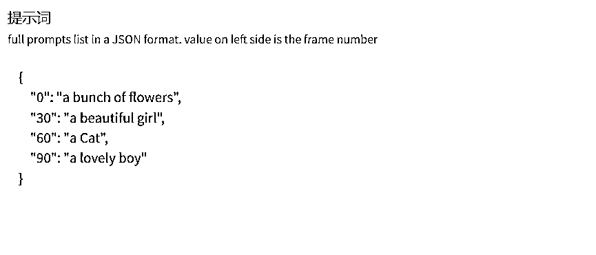

这里一定一定要注意格式！！！

1.所有的提示词都在{ }里面

2.前面的数字代表的是照片的帧数（下一节会讲）

3.每一行的提示词都要在“ ”里面

4.每一行最后要有一个逗号（最后一行不用）

5.所有符号（双引号、冒号、逗号）都是英文状态下输入的（如果最后生成视频出现报错，很有可能是符号出错）

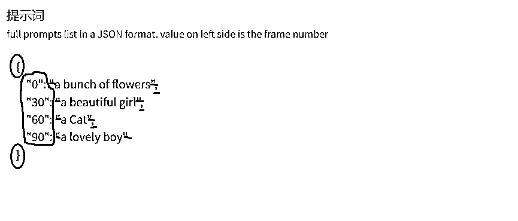

输入完提示词，就可以点击右边的“生成”生成视频

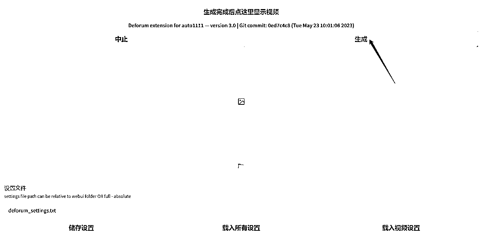

生成出来之后，点击上面的地方就可以看生成好的视频

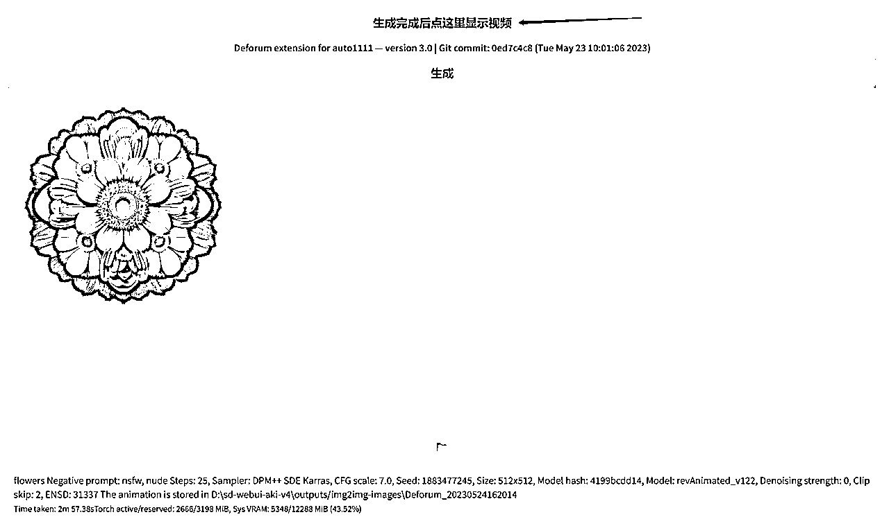

点击视频右下角的三个点可以下载视频

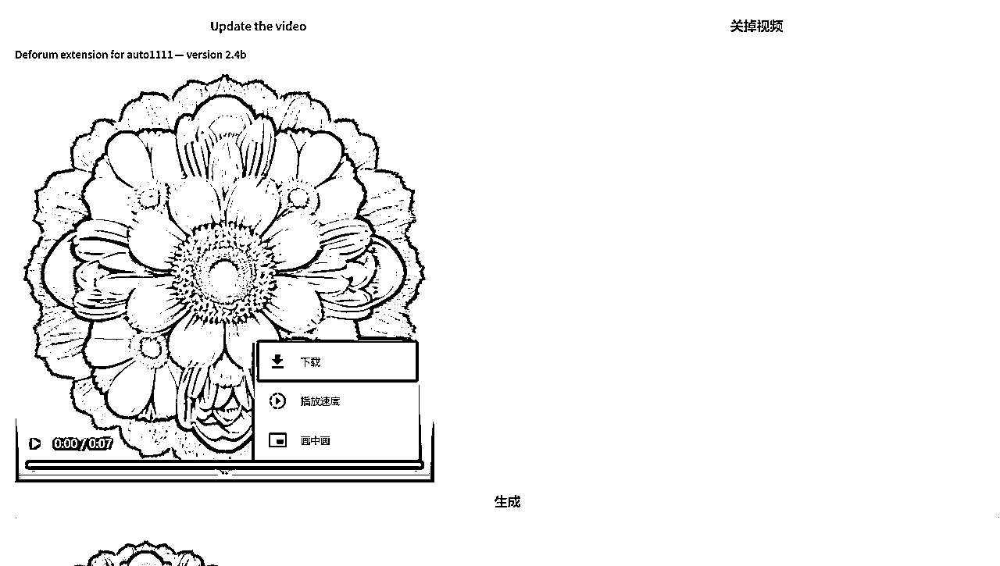

这样我们的第一条视频就做好啦！

现在出来的视频效果还比较差

因为我们的提示词输入的太过于简单了，出来的画面也就比较简单

而且要配合上视频运镜才会出来好的效果（后面会讲）

那怎么样才能写好提示词呢？

其实写提示词也是有模板的：

主体+主体的细节+周围环境+画风

比如我想要生成一个女孩

那我的提示词就可以写成：

主体：一个女孩

细节：长发，穿着白色裙子，站在马路上

环境：背景是城市建筑、白天

画风：现实风格

变成英语就是：a girl, long hair, wearing a white skirt, standing on the road, the background is urban architecture, daytime, realistic style

每一行的提示词都可以按照这个模板去写

提示词描述的越准确，出来的视频才会越接近我们脑海里的画面！

### ③正向提示词和负向提示词

为了让视频出来的质量更高

我们还可以输入一些正向提示词和反向提示词

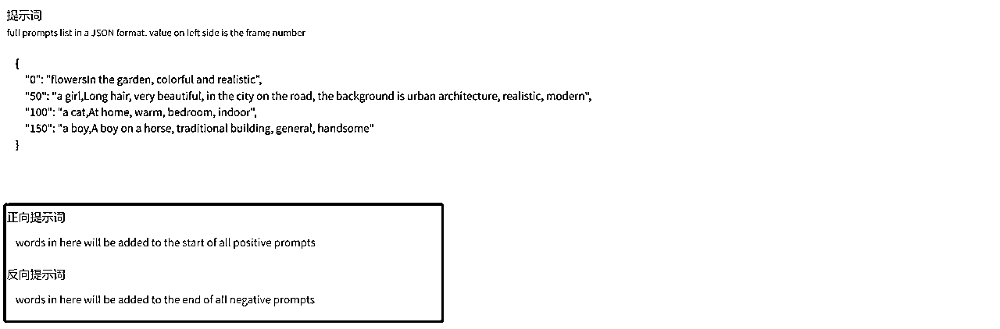

正向提示词就是你希望视频会出现的东西，比如最高质量、高清画质之类的词语

反向提示词就是你不希望照片会出现的东西，比如低质量，多余的手或脚之类的词语

这里的正反向提示词是作用到整个视频的

所以不要写某一张照片里面的细节，不然整条视频都会出现这个东西

这里我把提示词放出来，大家直接复制上去就可以

正向提示词：

Highest quality, masterpieces, extreme detail, 8K, HD qualit

反向提示词：

nsfw, nude,(worst quality:2), (low quality:2), (normal quality:2), lowres, ((monochrome)), ((grayscale)), bad anatomy,DeepNegative, skin spots, acnes, skin blemishes,(fat:1.2),facing away, looking away,tilted head, lowres,bad anatomy,bad hands, missing fingers,extra digit, fewer digits,bad feet,poorly drawn hands,poorly drawn face,mutation,deformed,extra fingers,extra limbs,extra arms,extra legs,malformed limbs,fused fingers,too many fingers,long neck,cross-eyed,mutated hands,polar lowres,bad body,bad proportions,gross proportions,missing arms,missing legs,extra digit, extra arms, extra leg, extra foot,teethcroppe,signature, watermark, username,blurry,cropped,jpeg artifacts,text,error

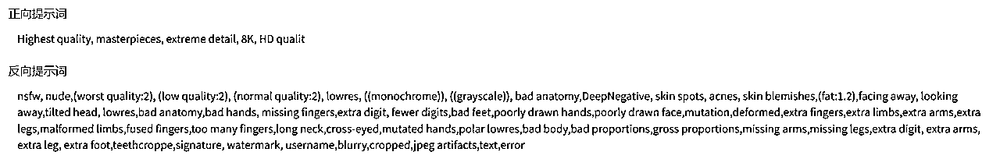

# 四、自由控制视频时长

我们已经可以生成出来一条视频了

但是现在我想让视频时长更长一点，生成更多的照片，该怎么办呢？

我们可以通过调整deforum里面的两个参数来改变视频的时长

打开deforum的关键帧页面

下面的“最大帧数”就可以控制我们的视频长度

这里的一帧我们可以理解为一张照片

200帧就是生成200张照片

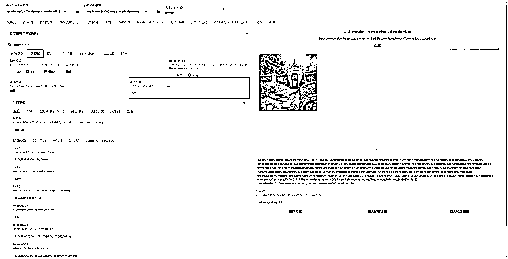

再打开“输出”页面

这里的“FPS”控制的就是视频的速度

把参数调到15，就代表着1秒钟生成15帧（也就是1秒钟生成15张照片）

参数调到30，就代表着1秒钟生成30张照片

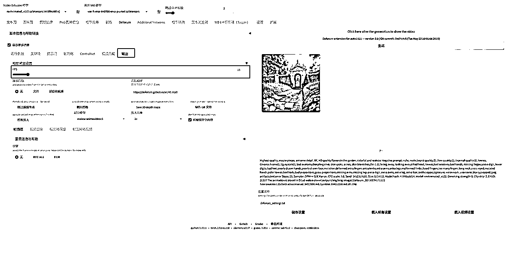

假如我们现在的最大帧数设置成200，FPS的参数设置为15（也就是总共200张照片，1秒播放15张照片）

那我们的视频时长就是：200÷15=13.33秒

那也就是说，我们可以通过设置最大帧数和FPS来调整视频的时长

但正常情况下，FPS调到15就可以了，我们只要设置最大参数就行

比如我想要一条30秒左右的视频

30×15=450

那我的最大帧数就要设置成450帧

了解了这个帧数之后，我们再看回提示词前面的数字

这里的数字代表的就是帧数

“0”代表的就是一开始的照片：一束花

“30”代表的是第30帧照片：一个漂亮的女孩

所以第0~30帧就是一束花变成一个漂亮女孩的过程

30~60帧就是一个漂亮女孩变成一只猫的过程

60~90就是一只猫变成一个可爱的男孩的过程

这里的数值是可以根据我们设置的最大帧数去调整的，或者生成更多张照片

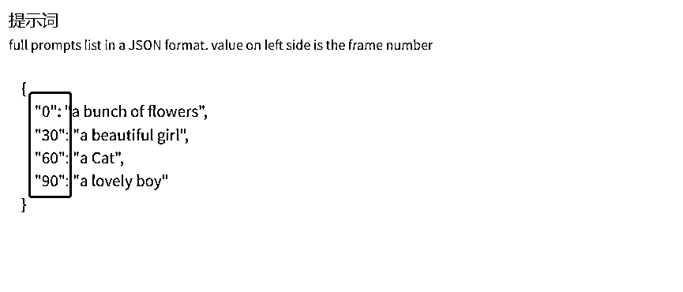

# 五、掌握视频运镜，做出大师级别的作品

前面我们生成出来的照片都是固定在一个视角的

在deforum里面，我们可以通过设置参数

让视频跟着我们设置的参数动起来，让视频变得更加有趣

打开deforum的关键帧界面

先把动画模式设置成“3D”，右边的参数设置成“wrap”

往下看，运动参数里面的所有设置都是为了让我们的照片动起来的

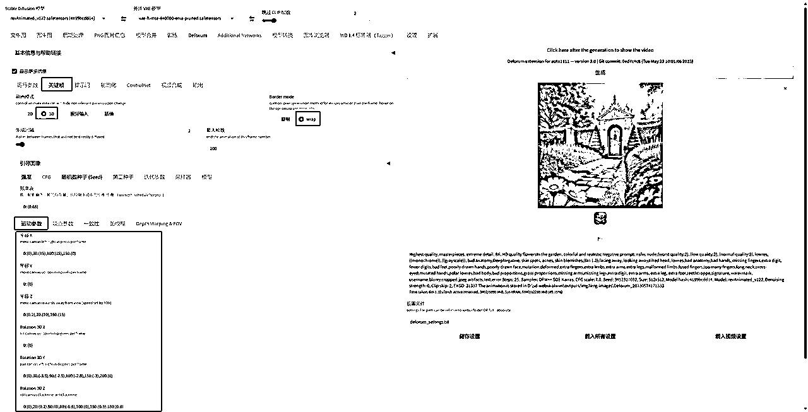

接下来我们来看看这些参数到底怎么控制视频运动

我们以“平移X”为例子，看看视频镜头是怎么运动的

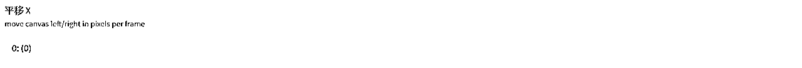

默认状态下的参数是：0:(0)

前面的0代表的是第0帧，括号的0代表的是不运动

当括号里面的数值大于0的时候，视频镜头向右移动

当括号里面的数值小于0的时候，视频镜头向左移动

比如现在我想让视频镜头前半段向右移动，后半段向左移动

那就是从第0帧开始，速度为2向右移动

一直向右移动直到第60帧，变成速度为2的向左移动

写出来就变成：0: (2),60:(-2)

要注意的是：中间用逗号隔开

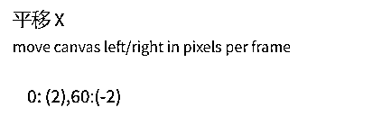

那如果说现在镜头从第0帧开始一直向右运动，运动到一半我想让镜头定住不动了

写出来就变成：0: (2),60:(0)

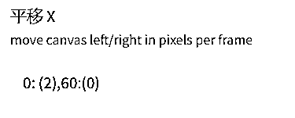

下面的其他参数格式都是一样的

不一样的就是镜头运动的方向不一样

大家可以看下面的表格，当参数大于0或者小于0时，镜头是怎么运动的

|  | 平移 Y | 平移 Z | Rotation 3D X | Rotation 3D Y | Rotation 3D Z |
| 大于0 | 向上 | 放大 | 从远到近旋转 | 从右到左的旋转 | 逆时针旋转 |
| 小于0 | 向下 | 缩小 | 从近到远旋转 | 从左到右的旋转 | 顺时针旋转 |

具体的运动方式大家可以自己去试试看

这里就不具体演示了

上面说到的全部参数都是可以混着调整的

在网盘里面也给大家准备好了预设

直接套用也可以

# 六、定制开头，玩出花样

还有一种更有趣的玩法就是给视频加一张开头的照片

这样后续的视频就会根据我们给的这张照片继续演变成下一张照片

具体的步骤：

1.导入照片

2.写提示词

3.设置镜头运动

4.生成视频

就以这张大家都熟知的照片作为开头第一帧的照片

看看最后究竟能生成出什么样的视频

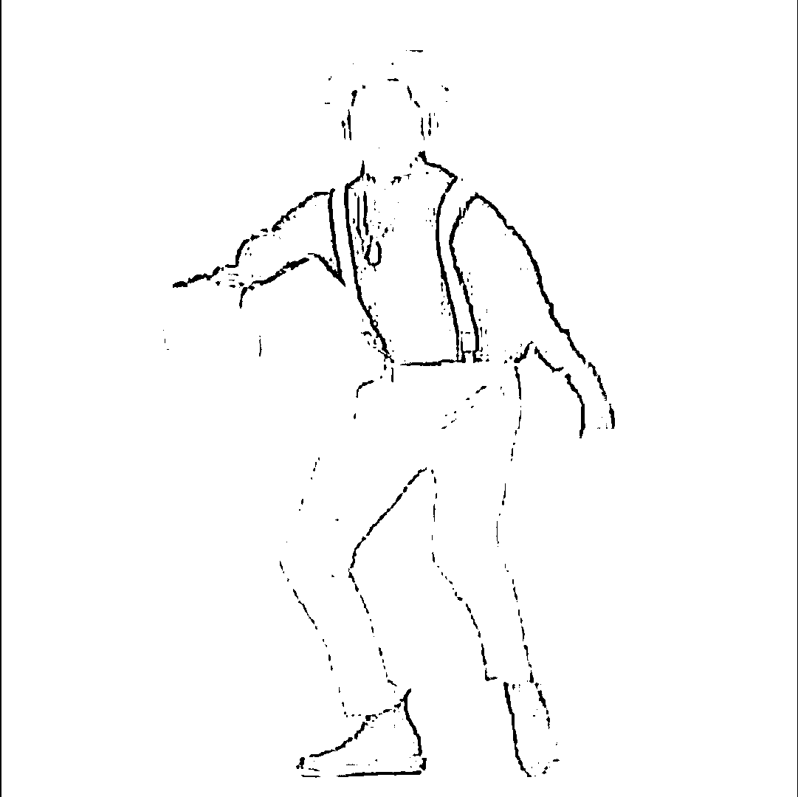

## 1.导入照片

首先要把这张照片先导入到deforum里面

鼠标右键点击照片，点击“复制文件地址

打开deforum的“初始化”界面

勾选“使用初始化”

然后把刚刚复制的文件地址粘贴到“初始化图像”的文本框里面

然后把前后的两个双引号删掉，不然会出现报错！！！

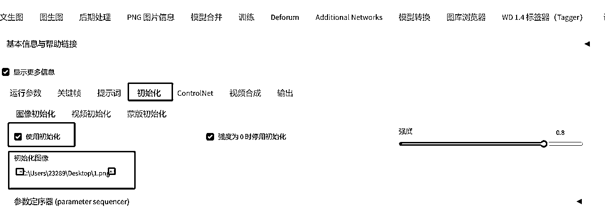

这样的我们的照片就导入进来了

## 2.写提示词

接下来就要想一下我们要生成一条什么样的视频

把它变成提示词输入进去

这里需要注意的就是第0帧的提示词

因为我们已经给了一张初始照片，就不用再去描述一个画面了

所以这里可以填上一些照片质量的提示词（比如大师杰作，高清，极致的细节，现实风格等等）

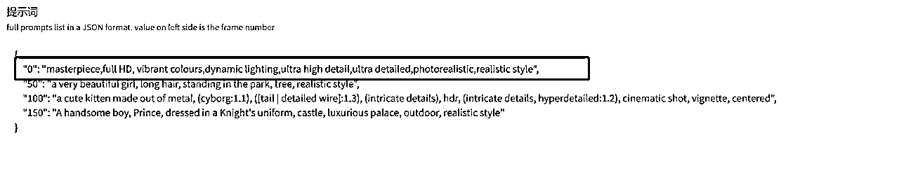

然后直接把前面给正负提示词复制上去

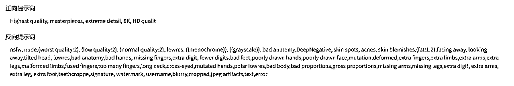

这样我们提示词就写完了

## 3.设置镜头运动

接下来为了让视频更加有趣，稍微设置一下镜头运动

大家一定要注意：运动参数里面的冒号、括号、逗号都要是英文状态下输入的!!

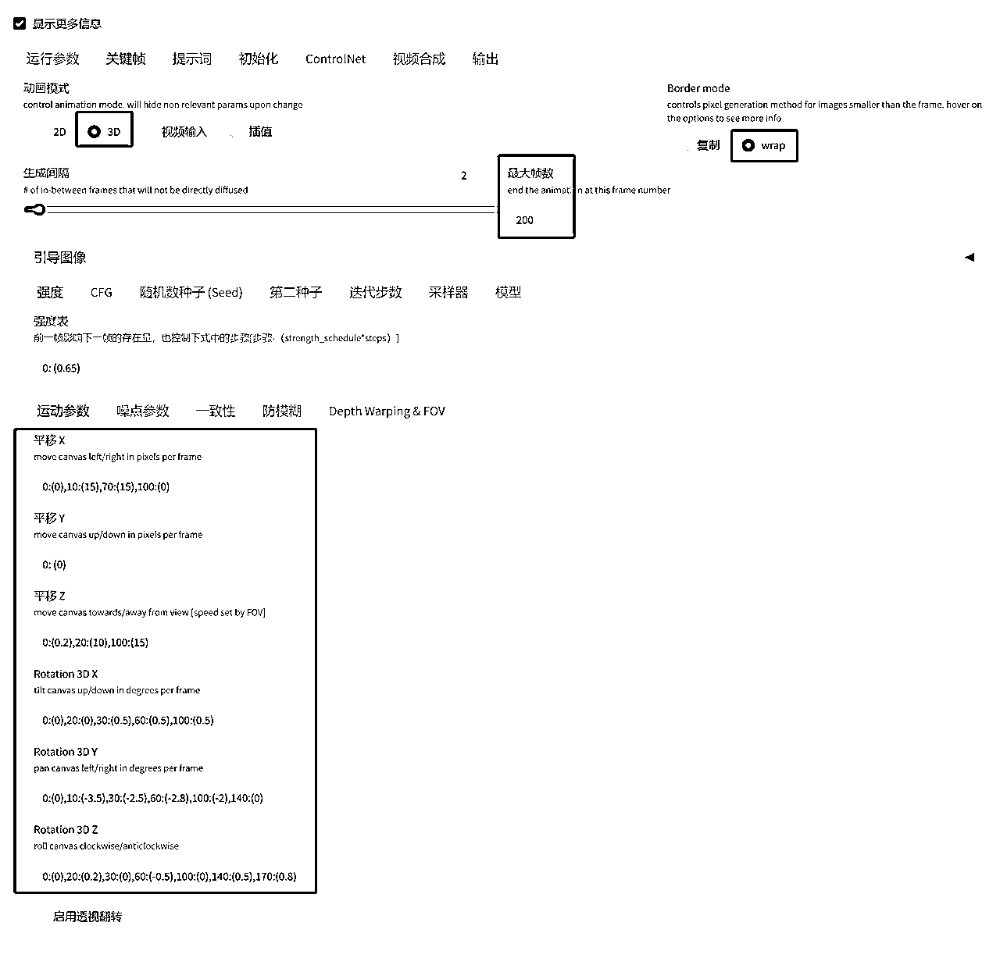

## 4.生成视频

全部参数设置好了之后,点击“生成”，就可以生成视频啦

# 七、制作网络爆款视频

我们平时在网上看到的视频还会有一段开头

然后再卡点变成AI生成的视频

这个又要怎么做呢？

在剪映导入一段有趣的视频

可以是自己拍的，也可以是网络上的视频

点击选中视频，找到想要截取的那一张照片

然后点击工具栏里面的“帧定格”

这时候视频后面就会多出一段定住的视频

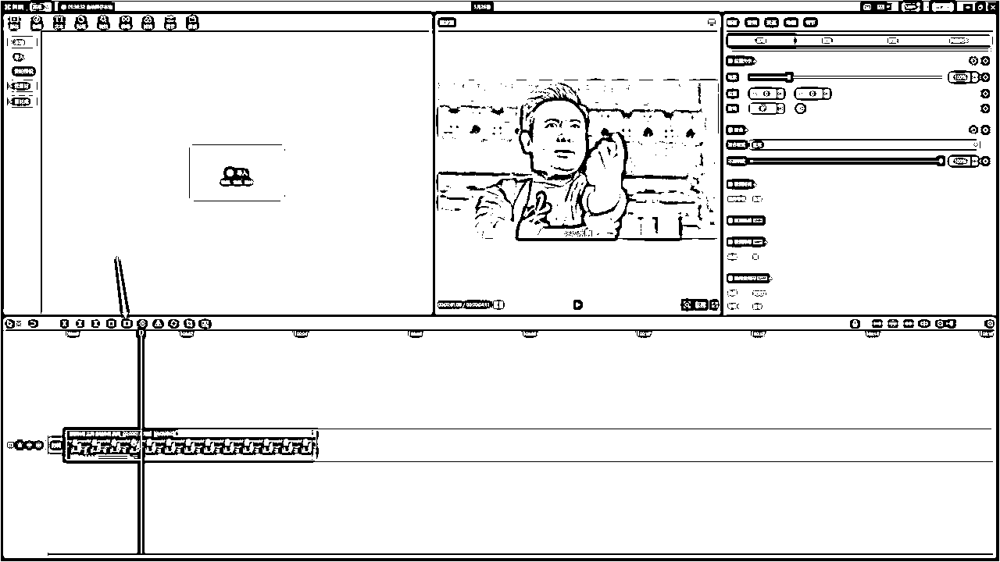

选中刚刚多出来的那一段定格视频

点击播放器的右上角的三条杠

点击“导出静帧照片”

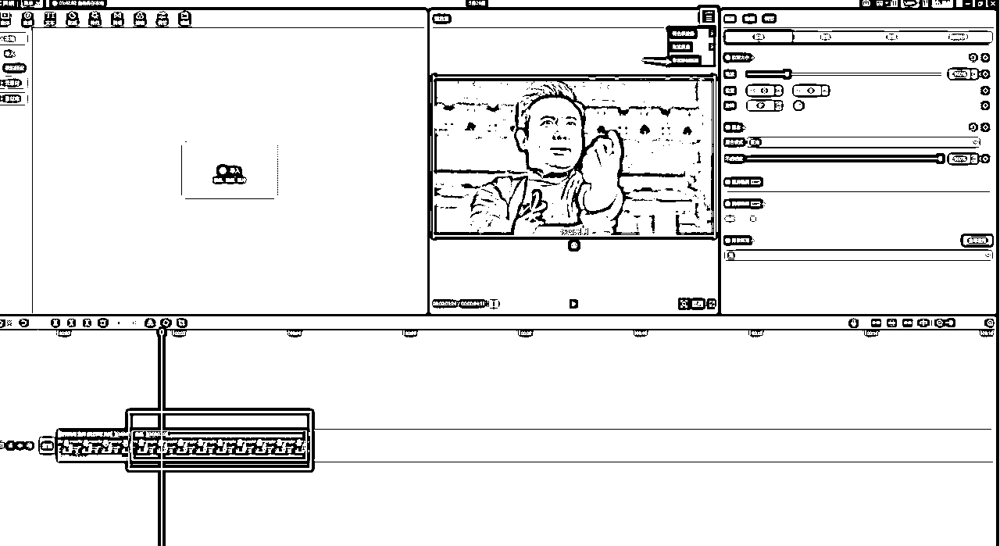

这时候就会导出来一张照片

接下来就按照文章第七部分去生成出来一段视频

等视频生成之后，把这个视频导入到剪映

把刚刚定格的那段视频和后面那段删掉，只保留开头

把开头和AI生成的视频拼到一起

加上BGM

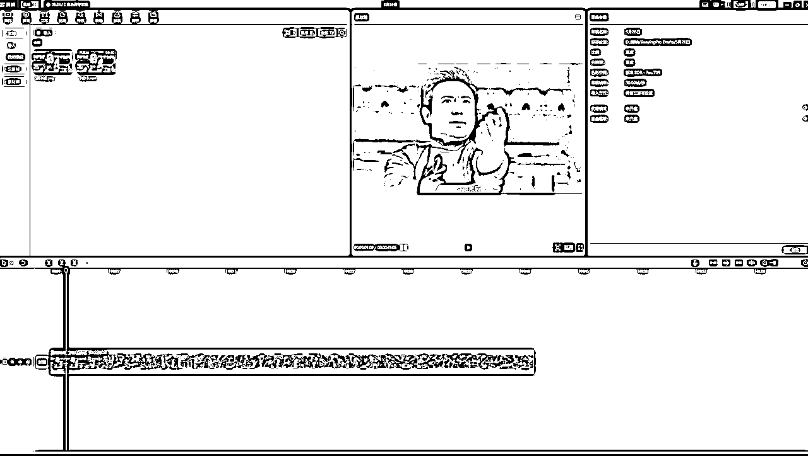

点击右上角的“导出”保存视频

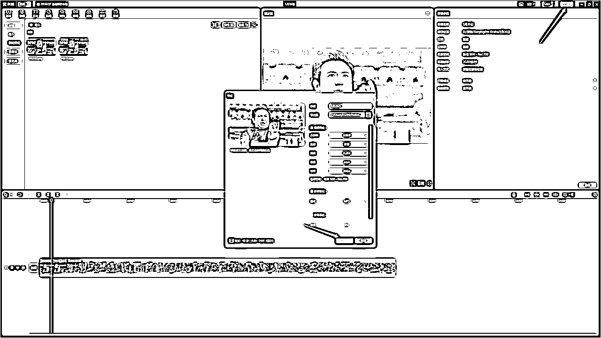

一起来看看最后的成片吧！！

# 八、知识补充

大家可以看到deforum里面还有很多参数是可以调整的

大部分和我们使用Stable Diffusion是一样的（如果想详细了解的可以去看SD的那篇文章）

我们直接照抄就行

## 1.采样器

首先是采样器，比较常用的就是图片框起来那个

出图质量比较高，而且速度也比较快

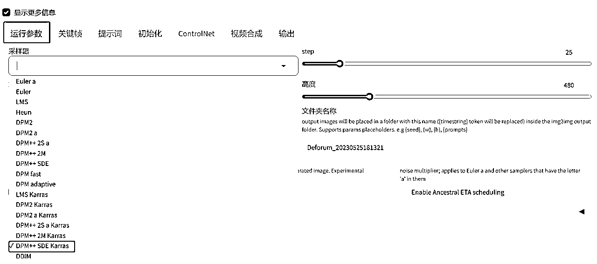

## 2.迭代步数

电脑配置稍微低一点的就设置在20~25

电脑配置比较好的就可以设置在25~30之间

但是不要超过30步，不然出视频会很慢

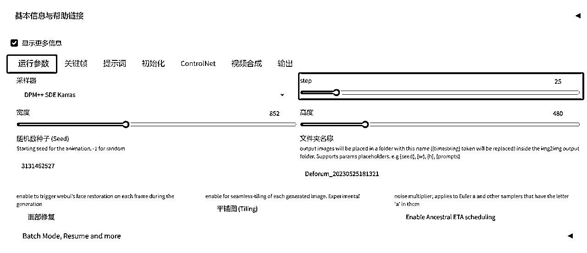

## 3.视频大小

这个宽度和高度是用来调整视频大小的

宽度512*高度512出来的就是正方形的视频

9：16的竖屏视频可以设置成 宽度576*高度1024

16：9的横屏视频可以设置成 宽度1024*高度576

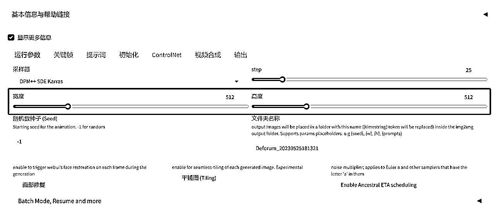

## 4.保存预设

大家可以看到deforum里面可以设置的参数很多

而且每一次重新打开SD都要重新去设置，非常麻烦

所以大家可以在第一次设置完参数之后，把它保存成预设

之后每一次要应用的时候就可以直接使用预设了

设置完参数之后，点击右下角的“储存设置”

然后点击上面的文件夹图标

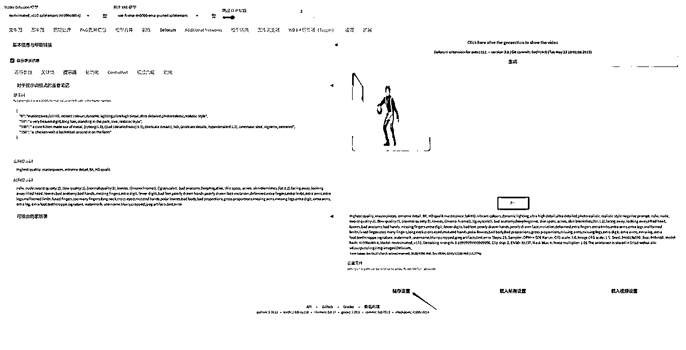

在弹出的文件夹窗口就可以看到我们保存的预设

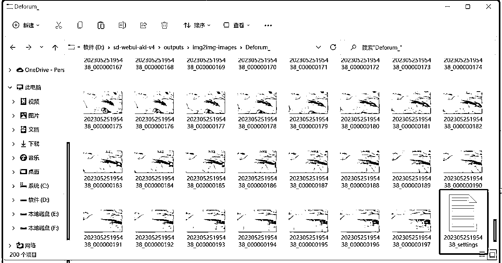

等到下一次需要用这个预设的时候

找到这个文件夹，鼠标右键点击文件，然后复制文件地址

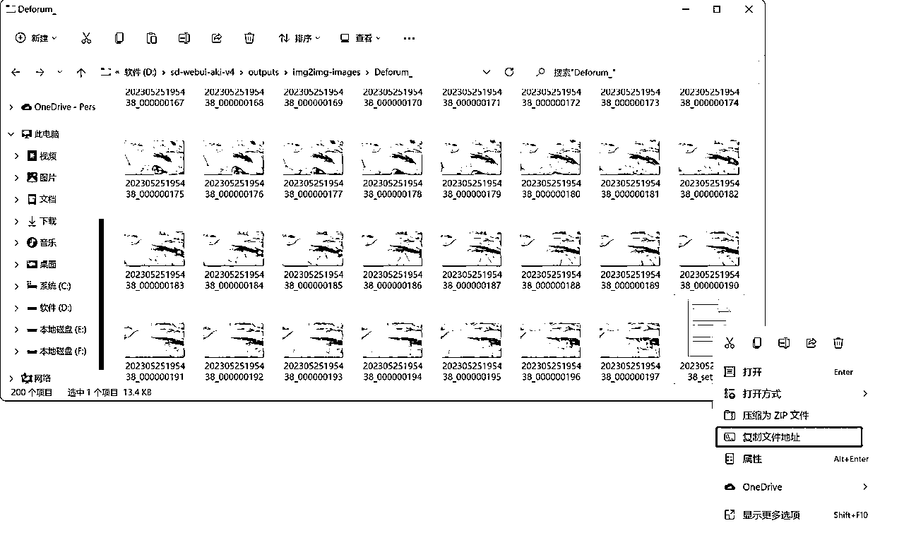

然后把地址粘贴到右下角的文本框

点击“载入所有设置”

这样我们的参数就会自动填充上去啦！

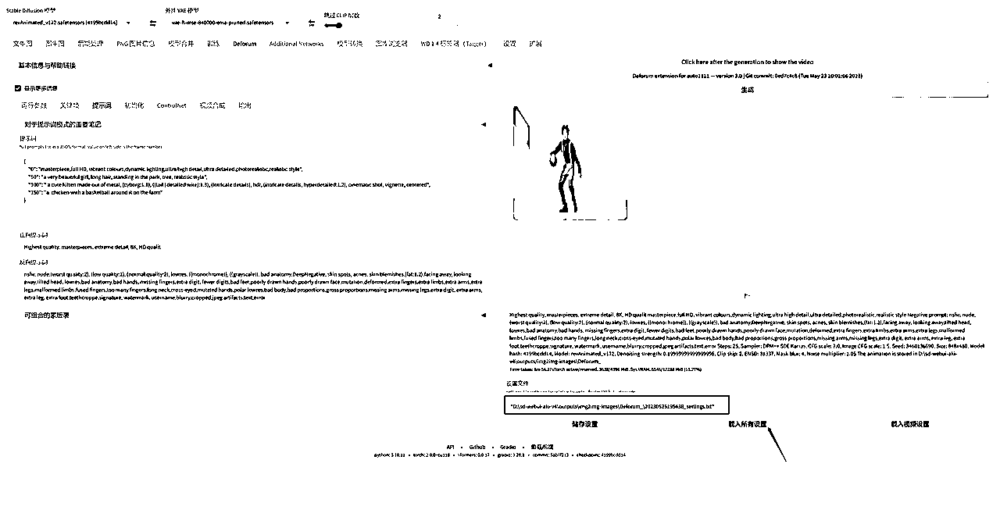

# 九、结尾

好了，以上就是我们这篇文章的全部内容

如果你对AI感兴趣的话，可以关注我的公众号：吴东子AI，也欢迎分享给你身边想学AI技术的朋友

里面有我之前发过的所有文章，之后也会持续给大家更新实用的AI干货教程

我是吴东子，用奶奶都能听懂的方式，分享可以落地实操的干货，我们下篇文章再见！

模型、预设点击链接获取

链接：https://pan.baidu.com/s/1ltBtZ1c6evzdZM5ZOtl9rQ?pwd=lkhc

提取码：lkhc