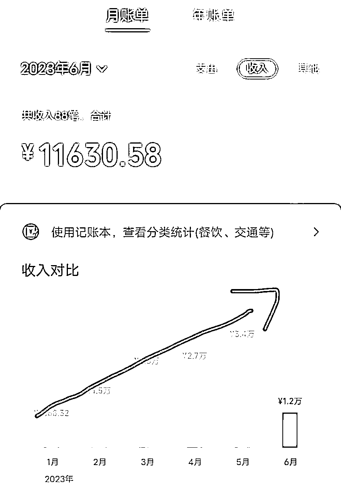
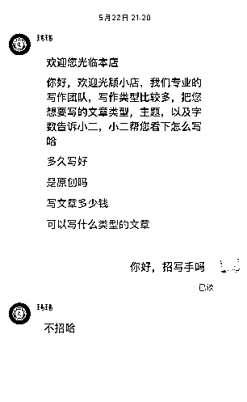
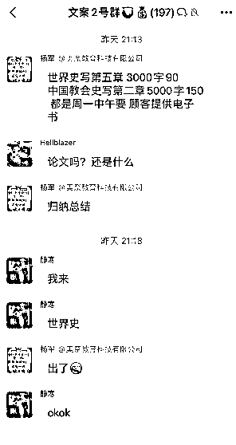
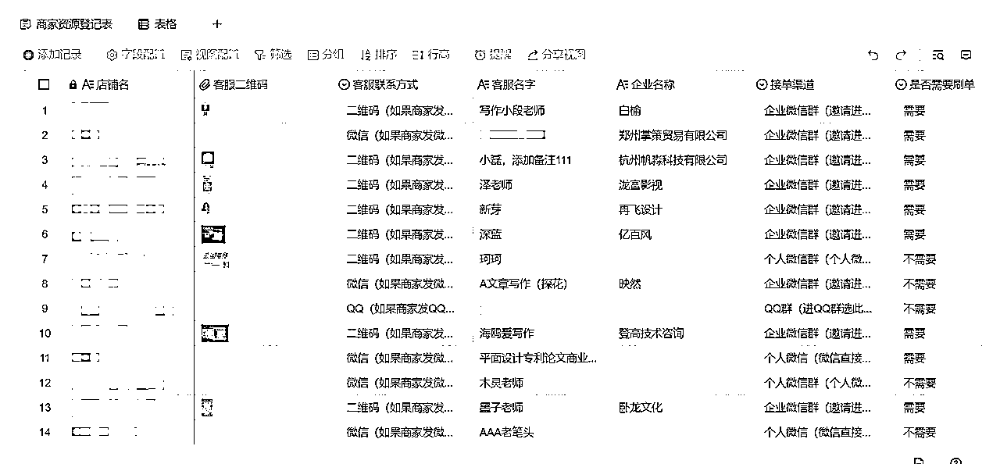
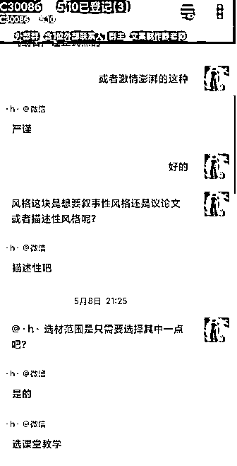
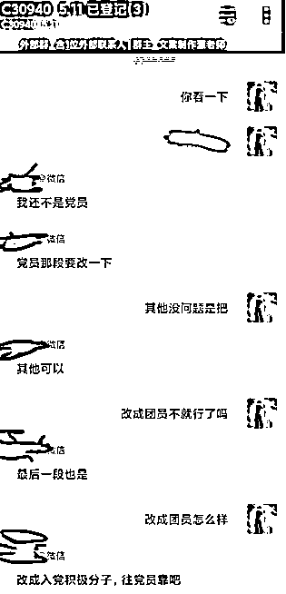
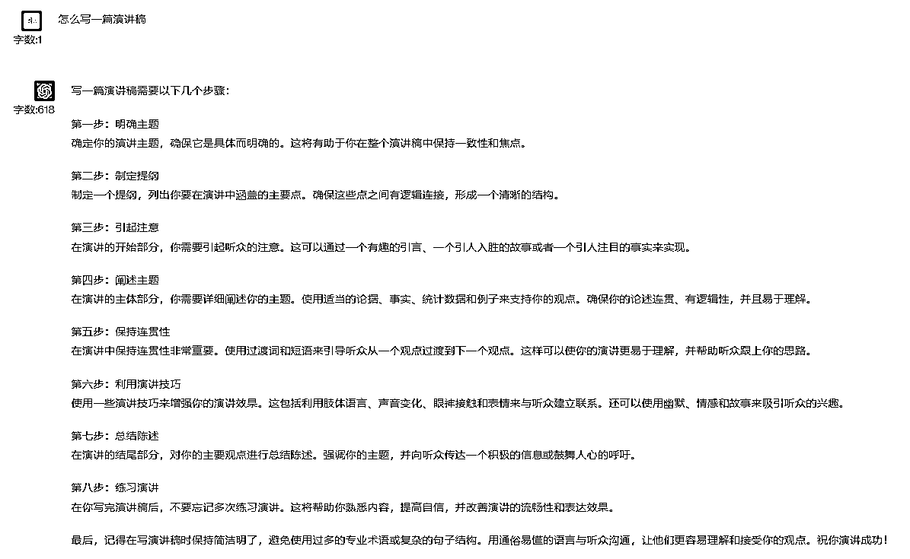
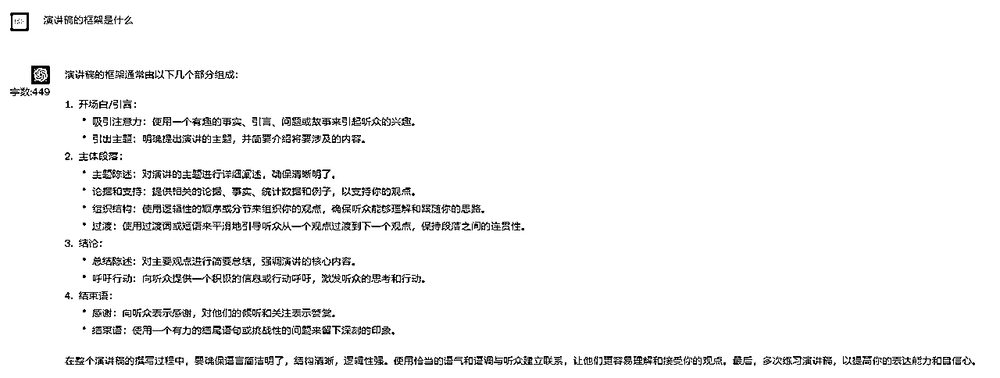
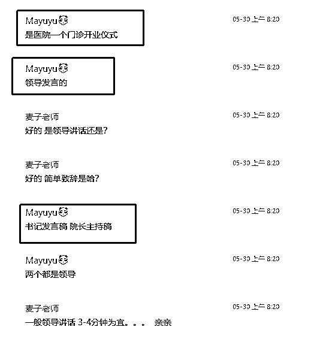
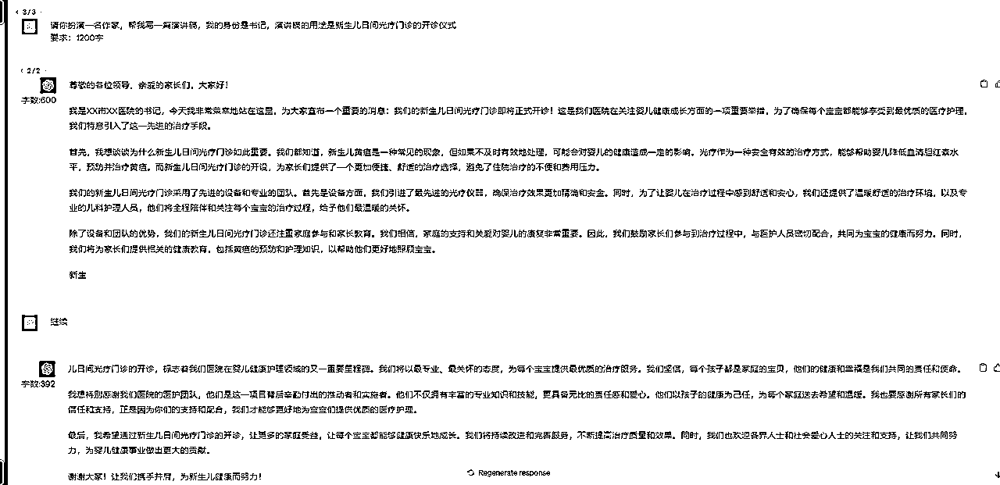

# AI写作，一个稳定小富的成长型副业

> 来源：[https://y9r93uo8au.feishu.cn/docx/XHNNdajhloRsH2xt2MKcWEXSnic](https://y9r93uo8au.feishu.cn/docx/XHNNdajhloRsH2xt2MKcWEXSnic)

# 一、前言

我一直相信一个理念，AI只是一种新的技术，有人嗤之以鼻，有人用来提高效率，但我相信利用AI可以让普通人做成一些之前做不到的事情，甚至直接变现。

后来在圈子里认识了向南和荷包蛋糕，两人对写作都有经验，于是我们一拍即合，组成了AI写作团队，目前已经跑出了一点成绩。

糕老师拥有三年写作经验，之前稳定月入1w+，后来在GPT的加持下，效率提升，再加上迎来毕业季，增长到月入近3w，如下图。

这两个月跑出的成绩：新人第一天开始做就可以直接变现几十，一个月左右可以稳定在日入200~300，想要做大就需要往个人ip、开店铺、引流方面去做了。

写这篇文章是一次复盘，覆盖所有实操的细节！

希望能让大家看完后，直接无脑实操赚钱钱！

# 二、尝试用三个问题说清这个项目的盈利模式

1.问：整个项目的流程是怎么样的？

答：接单——跟客户确认需求——AI写作——交付，修改——结单。

2.源源不断的单从哪来？

答：目前最稳定的渠道是淘宝店，搜写作、代写等关键词，直接问客服招不招写手。

3.一单的利润有多少？

答：低价的短篇的文章如演讲稿一两百一篇，高价的如论文几百几千一篇，主要还是看到手比例。

一般店铺会拿走40%，剩下60%给客服，客服再给到写手，可能只有15%~40%。

所以这个副业我分为三个不同的赚钱阶段，初级阶段当写手锤炼技能，赚点小钱，做到日入200~300；中级阶段当上客服，提成提到60%；高级阶段分两条路，要么搞个人ip弄私域，接一手单；要么开店铺，弄好淘宝店接单。具体内容，下面详解。

# 三、实操细节

## 1.接单流程

1.1 加入写手群：

1.  直接在淘宝去搜写作、代写之类的关键词，直接问客服是否招写手。

1.  招的话他会直接让你加好友，进写作群。

1.  不加的话就会拒绝地干净利落，整个过程两句话解决。

1.2 加入写手群后，客服就会在群里发单出来，选择自己感兴趣的单去接

1.3 接单以后，客服就会拉群，接着就是跟客户确认需求。

PS：这里要提一点，尽可能多加一些写手群，四五十个群都不算多，这样你可选的单就很多了。

记得要把各个群整理下，以便后续结算，如下图：

## 2.跟客户确认需求关键点：

客户很多时候并不清楚或者说不出自己的需求，需要我们去挖掘。掌握了这些信息，喂给GPT会更容易写出符合的文章。但问法不是一成不变的，要根据不同文章灵活处理，比如：

*   确认题目

*   确认字数

*   确认文章风格

*   了解背景

*   了解客户的岗位

*   了解客户的用途

*   更多......

你确认的越多，一般返稿修改的概率就越低，争取一遍过，如下图。

## 3.用GPT开始写作。

为什么说这个项目是可成长型的，因为他可以写的文章类型太多太多了，比如演讲稿、实习报告、函授、征文等等，哪怕论文都分为文科、理科，每科都有不同的专业技能。

在这个过程中，你是需要不断去学习各种类型文章的要点，你学会的文章类型越多，你可接的单的类型就越多；你写的文章难度越高，你的收入就会越高。

具体文章案例，我们放到下面第四节讲解。

## 4.修改文章

如果遇到客户不满意需要修改的地方，需要确认的内容如下：

*   确认是哪一段不满意

*   想要达到的效果如何

*   跟客户提出你初步的修改方向

*   更多...

## 5.交付，结算

到了结算这一步，我们之前做的这张Excel表就派上大用场了：

你要记住每个店铺的结算周期，一般周结、月结的居多，日结的比较少，所以记录下结算日期和对应的联系人就很重要，到了结算日期记得去找人结算。

# 四、文章详解

准备工具：ChatGPT官网。

尝试过很多AI工具，目前国内自研和GPT镜像的写作逻辑还是不如人意，所以还是使用GPT官网是目前逻辑最好的。

AI写作关键就是提示词，同样的文章不同的问法，写出来的东西是完全不一样的。

这里以【演讲稿】为例：

## 第一步：询问GPT演讲稿的框架和定义

以上我们就知道了演讲稿该怎么写和演讲稿的框架是怎么样的

## 第二步：确认客户的要求

以上这张图片客户已经把要求、角色、用途、演讲主题告诉我们了，那接下来我们只需要对客户的要求进行梳理即可写出文章

角色：书记

主题：门诊开业仪式

文稿：演讲稿

要求：3-4分钟（1000字左右）

## 第三步：利用GPT生成文章

我们按照上面客户的要求让GPT来生成文章，GPT调教这块我习惯用GPT身份+我的身份+要求的公式来写

## 第四步：对文章进行润色修改

一般我们调教GPT生成文章后，会出现两类问题

1、文章AI感太强，不像是真人写出来的文章

2、文章的要求达不到用户的要求

出现以上两类问题就需要我们对GPT进行反复调教修改，比如对某一段内容进行扩写，同时去除掉一些同时、其次、最后的这类词语

最后就能完成我们的初稿，接着提交给客户，再根据客户的要求进行修改即可

# 五、工具提升效率

在基本流程跑通以后，那么就是在细节处打磨，每天提升一点点效率，日积月累下来也能节省不少时间。

于是我们联系了一位开发老哥，给我们开发了一款网页插件，主要功能就是把我们各类型的文章模板存起来，然后把关键要素做成参数，使用的时候只要修改这个参数就好了。

# 六、持续发展

## 1.当上客服，接二手单

这个没用什么特别的技巧，就是跟店铺混熟了，然后在招客服的时候去应聘。

给到客服的分成是60%，这个你可以自己写，也可以给出一定的分成给到下面的写手，15%~40%，这个就看自己了。

注意：店铺大多对客服有要求，一天至少要在线三小时，这个可以尝试跟店长沟通。

## 2.打造个人ip，打造私域，接一手单

打造个人ip是一个时间积累的过程，市面上随处可见各种ip课程，这里分享一个我们觉得最重要的一个点：

认真对待每一次你接的单子，如果你的口碑做好了，你的客户就会不断推荐身边的朋友来找你，这些是精准度、信任度极高的客户。

## 3.开店铺，接一手单

这个目前我们还在探索中，新人不建议一开始就往这方面去发展，现在淘宝的规则变得更多更杂了。

但是对于有实力的人来说，这的确是一个很好的变现路子。

2023.10.14更新：经过测试，淘宝开店铺焼直通车太烧钱了，不建议新人入局，大家先从基本开始吧！

本文分享就到这里啦，看完马上行动起来，先从加50个写手群开始吧！