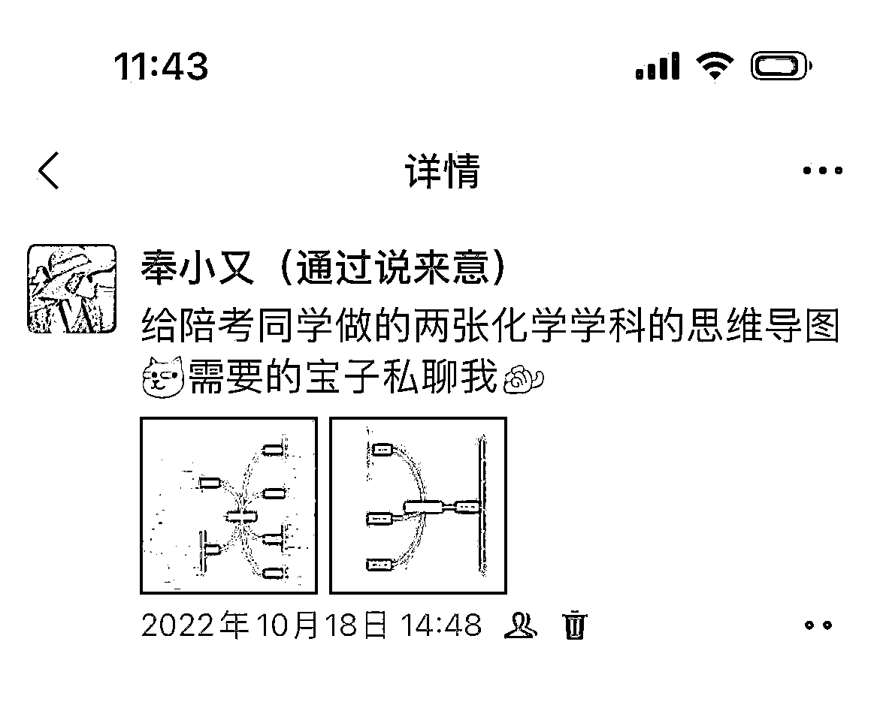
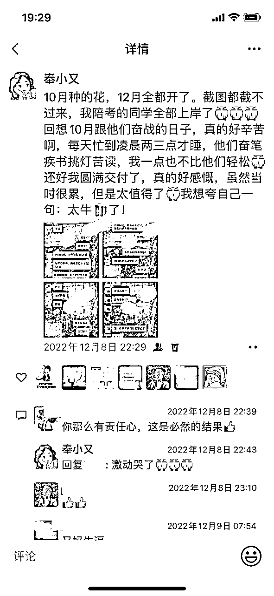

# 从职场宝妈到自媒体创业者，裸辞一年，月入过万，活成想要的样子

> 来源：[https://jvx6nnxr4va.feishu.cn/docx/XfMUdz0TQopqJvxQjducjPKynSf](https://jvx6nnxr4va.feishu.cn/docx/XfMUdz0TQopqJvxQjducjPKynSf)

你好呀，我是努力追求“左手育儿，右手事业”的小又。

2022年6月~2023年6月，我裸辞一周年了。从职场宝妈到自媒体创业者，从0收入到月入过万，这一年有太多的感慨。

作为一个没颜值没技能学历也不高的中年裸辞宝妈，此前我从未想过我居然可以自己带学员，做自己的知识付费课程。

我也没有想过，自己在黑暗中举起的小小火把照亮了一部分人自媒体的道路。

一、因老公生意失败，债台高筑，我打算做自媒体

我来自桂北山区，2011年大学毕业。像大多数女孩子一样，只想找个安稳的工作，工资不用多高，覆盖日常开销就行。如果可以的话考个公或者考个编，到了合适的年龄遇到合适的人，结婚生子，毫无波澜地过完一生。

步入职场，我换了几份工作，说热爱谈不上，说讨厌也没有，就不咸不淡地做着，感觉也没什么不好。

后来遇到现在的老公，没有任何意外的结婚生孩子。在我休产假的时候突然得知老公生意失败，欠了几十万外债，且没有人可以帮到我们。

那段时间我一边带孩子一边疯狂在网上找兼职，意外得知自媒体博主这个行业。我当时就想，如果我能做自媒体，既可以照顾孩子，又可以赚钱，那真是太好了。

但由于我没有什么专长，也不知道在哪可以找到靠谱的老师来带我，自媒体这个梦暂时熄灭了。

产假结束后，我又回到了职场。

面对一天天长大的孩子和高筑的债台，我再次燃起了做自媒体的决心。刚好那段时间看到朋友圈有人分享一个小红书体验课，我就报了，这次差点被割韭菜。

对方的套路是给你说一些不痛不痒正确的废话，想要学真正的知识就得花一千多报课，因为贫穷我最终没报。后来听报了的同学说那个课程并没有什么干货，每节课都是不同的老师上的。

通过这次经历，对自媒体知识付费我就谨慎很多了。

我在各大社交平台上搜索可以做知识付费的老师，又通过朋友介绍找到一个投稿公众号，本意是想通过投稿赚点钱，后来加上了这个号的创始人陈舟Amber，了解到她有一些自媒体课程。

我观察了很久，看了她所有社交平台的账号，以及她过往的成绩和学员案例，且十分确定所有的课程都是她本人亲自授课，于是我连着报了她的公众号写作课、小红书训练营。

这次由于定位问题，我的自媒体创业之路再次失败了。

二、瞒着家长裸辞做自媒体创业，却被现实狠狠打脸

去年，由于单位组织架构调整，很多同事开始辞职，公司也开启大面积裁员模式。但原本的总工作量丝毫没有减少，离职同事的工作被平均分到了在职的人身上，我开始有了加不完的班，周末也没法正常休息。

为了赶进度，我就差住在公司了。我当时觉得公司对我的工作比较认可，且有意给我升职，让我当项目负责人，当时干的也是负责人的活，再加上客户对我评价也比较高，现在工作量这么大，我是不是可以顺势提一下涨工资了？

但公司其实压根没想涨工资，说给我升职，只是为了让我更好地为公司卖命罢了。而我在这家公司已经没有再上升的空间了，继续工作下去对我个人发展而言，已没有太大的意义，另外找工作也难，裸辞做这媒体这个念头就这样冒出来了。

或许这次我能闯出一点名堂了呢？

在征得老公的同意与支持后，我瞒着父母辞职了。辞职的那个月为了孩子以后上学方便，我们还买房了。

当时的情况是我们一边要还房贷，一边还要还剩下的债务，而我没有收入，压力之大，可想而知。

那段时间，为了不让我爸妈发现我辞职了（不想让他们担心，更不想让他们操心），我天天早出晚归，背着电脑去图书馆“上班”。因为图书馆有免费的空调、桌椅、电源。

为了抢到靠近电源的位置，我每天顶着35度以上的高温，在图书馆门口跟一群人排队等着进馆。

由于没有收入，为了省钱，我甚至都不舍得吃外面12元一碗的生榨粉。每天自己用保温盒带午饭去图书馆。不能在馆内就餐，我就在走廊站着或者用报纸垫在地上坐着吃饭。

我想，不管过多久，不管我以后取得什么样的成绩，我也永远不会忘记2022年那个汗流浃背的盛夏，我电脑包的重量，排队进馆时用书扇出来的热热的风，以及中午在图书馆走廊一边吃饭一边擦汗的自己。

当然，这中间我也犹豫彷徨过，自媒体这条路，我选对了吗？我要不要继续再走下去？我是不是再找一份相对清闲的工作，一边打工一边研究自媒体？这样至少有点稳定的收入。

但是我又担心，如果继续在职场工作，我会不会又没有时间做自媒体了……

在那段纠结我裸辞这个决定正确与否的时间，我又报了公众号训练营，重启了小红书账号，在图书馆上完了课，写了无数篇小红书笔记。

我打算给自己半年的时间，半年后如果自媒体还是一事无成，我就再找个工作好好上班，从此不再踏入自媒体。

由于长相普通，没有什么特殊技能，学历也很一般，我只能从最简单的育儿读书博主做起。我学过小红书运营，知道爆款标题怎么写，文笔做自媒体也比较够用，账号很快就做起来了，涨粉很快，赞藏评数据也很好，也因此引流了一波粉丝到微信上。

但是我无法变现。

因为我做账号之初就没想过如何变现，只能接一些零零散散的书籍置换合作，偶尔会有一些付费合作。这个时候我才意识到，我居然没有一个可以承接流量的产品，并且我的粉丝习惯我免费的分享了，一提付费就没影儿了。

我又陷入了深深的自我怀疑：自媒体，我到底能不能做好？

三、找到适合自己的产品，自媒体终于从0到1了！

就在我纠结是不是该重新投简历的时候，从我的自媒体引路人那里知道了虚拟学习资料这个副业，这个项目的出现给了我一束光。

我没有自己的产品，但是我有一定的做号及引流的经验，那我直接去卖别人的产品不就好了？

于是我转换赛道，开始认真研究虚拟学习资料项目。

但是我又遇到了另一个难题：我没有任何考证的经验，对这些考试也不熟，我也还没有到直接卖代理的程度。我该如何快速跑通这个项目呢？

按照我以往的工作方式，我应该是先学会这件事再去实操。但我也深知我的缺点，如果学会了再去做，我肯定会半途而废。

所以我打算选一个热门考试，一边做公众号引流一边学专业知识。而教资这个赛道每年考4次，我身边也有不少老师，学这个对我来说应该不会很难。引流来顾客我要是不会聊，就当练手，前期也不用多在意，先开始后完善再完美。

说干就干，我开始全网搜教资相关的干货，为了加深印象，我再把在网上学到的用自己的话写出来发到公众号上。这样我既学到了知识又解决了公众号的选题问题。

没多久我就迎来了第一批顾客。

不出意外，成交的很少，因为我教资相关知识熟练了，但团队下单流程、资料、课程相关问题还不熟，所以流失顾客也是很正常的。

于是我又补团队流程相关的知识，花了两天时间，把团队所有教资相关的资料和课程以及下单流程都弄明白了。

终于，我开始有成交了！虚拟学习资料项目，我跑通最小MVP了！

破0那个月我赚了七八百，那是我当时职场以外赚到的最大的一笔钱了！

四、提升专业度，做差异化，终于月入过万了！

为了赚更多钱，我又扩大了引流渠道，开始在小红书上引流。

当时爆了几篇笔记，那个月我通过这个项目赚了四千多。我觉得我应该可以吃得下自媒体这碗饭了。

这个时候，我不再满足卖别人的产品了，我要赚得更多，在对顾客的服务上就得做差异化产品。

正好有几个顾客看到我发的干货比较专业，问我能否给他们做督学服务，我想：这机会不是来了嘛！

但是我说到底没有考过教资，也不敢贸然接，接了就要对人家负责。为了让自己更专业，我又花钱买了教资笔试所有学段的课程自己学。

那段时间我没日没夜上课，一边学一边划重点给顾客做计划。因为学习任务是一天一天发的，我只要提前一天准备好第二天的就行了，跑通了这个服务，下次我再做督学就会比现在轻松。

因为是第一次做督学，我也不敢接太多，那次只收了10个，但是跟他们说好了我只接公共课的督学，因为科目三学科太多了，我学不了。

印象最深的是有个顾客考化学，她请求我给她找一些化学相关的资料及备考经验，我一个文科生，硬生生地把教资高中化学给啃下来了，给她做了思维导图整理了考试重点。

功夫不负有心人，这次督学的10位同学全部上岸了。

22下教资笔试成绩出来那天，我哭了，那种感觉就像得知自己考上了大学一样。

与此同时，因为我经常在朋友圈分享我做这个项目的心得体会，被一些姐妹看到了，她们想付费跟我学着做这个项目。老实说，我当时还不敢收，我觉得我还不够格去教别人。

我去问了我的老师，她跟我说先去做，教程可以用她的改，教人的同时，自己也会得到更大的成长。

印象最深的是她那句：“你不需要做到100分再去教别人，100分可以教80分的，80分可以教60分的，60分可以教0分的。”

那我就当我刚60分好了。

于是在我第一批私教学员的催促下，我的第一个自媒体知识付费产品诞生了。

依然是按天解锁教程，我一边用老师的教程来改，一边结合自己的实战经验教学员怎么去做，也有惊无险地把我最初的私教学员带上岸了。

那段时间刚好碰到学习资料团队半价招新，我又通过这次活动招了一批代理，那个月是我做这个项目的第四个月，我终于实现月入过万了！

五、裸辞做自媒体这一年的感受

1.做可复利的事

不知道大家怎么看待“金钱”和“财富”的关系，我认为金钱不等于财富，而财富包含金钱。

《纳瓦尔宝典》里有说到：“财富就是在你睡觉时候也可以帮你赚钱的资产。”翻译一下就是躺赚，而可复利的躺赚也是做自媒体最有趣的事情之一。

所以今年我一直在想，如何把事情做得更有价值，产生更长远的利益，让我的财富不断滚雪球。虽然我现在的规模很小，但只要我在正确的赛道上坚持走下去，我的财富雪球一定会越滚越大。

于是我开始琢磨，怎样让我的学员也可以躺赚，毕竟他们大部分人目前还没有自己开课的能力，如果在做自己的项目的同时还能有一些管道收入，那即便某天不工作也有收入。

比如带学员依托资料项目做百度网盘会员分销、社群团购、美团圈圈和群咚咚等，这些小项目不怎么费时，通过资料项目学会的引流技能刚好也能在这些项目上用到。只要帮助他们把这些项目打通，后续就可以有不少管道收入。

我希望不仅我自己要做可复利的事情，我的学员也能跟我一样，这样大家才能在自媒体这条路上走得更长远。

3.人，要有高级的快乐和幸福感

我们吃到了自己喜欢吃的美食，看了一场期待已久的电影，买到了心仪的衣服等，这种快乐持续的时间都不会很长。

而更高级的快乐和幸福是可以持续很久得，不管什么时候想起来都会让你觉得心情愉悦有成就感。

对我来说，高级的快乐和幸福就是把学员带出来，是有人因为我在自媒体上开悟，并且可以因此改善生活，甚至改变命运。

当然，我目前还不敢说谁因为我而改变了自己的命运，这是我未来努力的方向。

带了一段时间学员，我也真真实实收获了很多很多感动。

搜了一下两个微信号“私教日常”这个标签，才发现原来过去的一年有这么多故事。

有人因为报我的课，学会了小红书运营，因此获得了一份工资不低的小红书代运营兼职工作；

有人因为报我的课，刚上大学就有了自己一份稳定的小事业，实现经济独立，还能偶尔给父母一些钱；

有人因为报我的课，产假期间有了自己的副业收入，修完产假遭受公司不合理待遇的时候更有底气辞职；

还有人因为报我的课，从一个超市收银员成为了在家靠自媒体变现，实现工作照顾家人两不误的勇敢妈妈，让生活有了质的提升……

这些事，不管我以后收多少学员，不管多久以后想起来，都会由衷地感到开心、幸福，会不自觉地嘴角上扬。

3.要有“不切实际”的梦想

辞职之前，我从未想过有一天我能靠自媒体月入过万，也不敢想有没有可能有一天我可以年入百万。但现在的发展，让我看到了，一切皆有可能。

没颜值没技能学历低的我也能做自媒体博主，这些放在以前我真的不敢想。

人，有时候还是得有点“不切实际”的梦想。

作为一条在池塘里长大的鱼，我有了大海的志向，谁说淡水鱼不可以游向大海？我偏不信命。

别人可以，我为什么不行？只要有一个人在这条路上闯出来了，之后再闯出来的，就很可能是我。

写在最后：

经常有朋友问我是如何打开局面的，其实我也没有什么高深的秘诀，无非不断重复前人的成功经验，再加上自己的理解与延展。

我资质平庸，没有高学历，没有高颜值，也没有什么特殊技能。只有满腔热情，以及愿意从底层摸爬滚打慢慢往上爬的决心。

有人说：“没有慧根，就要会跟。”

感谢自己在踏入自媒体的时候跟对了老师，选对了项目。也感谢在这条路上帮助过我的贵人。

最后，感谢看到这里的你，未来希望跟大家一起，让自己的生活变得更美好。