# 从设计师到闲鱼卖货，2年副业赚30万+，我经历了哪些（上）

> 来源：[https://p2ls2mp3ij.feishu.cn/docx/XmpOd4X0Qos10mxeT3pccrKvnad](https://p2ls2mp3ij.feishu.cn/docx/XmpOd4X0Qos10mxeT3pccrKvnad)

# 一、我是谁

各位好，我是青志。来自福建，主业是某互联网公司设计师。

关于副业，我尝试过不下6个互联网项目。

换了很多赛道，失败过、迷茫过，痛苦过。

从副业0收入，到第1单，到100单，2年收入30W+。

我来自农村，没什么背景，也没什么太大的资源。

也没有从欠债几百万到屌丝逆袭年入千万的跌宕人生。

有的是想以此篇文章和所有在赚钱路上奋斗的普通人一起共勉。

# 二、职场顿悟

本着对设计的一腔热血，毅然选择了设计师这个行业，

但因为自己非科班艺术生，所以总觉得自己差人一等，周末都想着去公司加班学习。

没错，我就是那种打工思维根深蒂固，一心想做打工皇帝的人。

当然了，卷王就要有卷王该做的事：

每天下班后1小时的练习 + 设计课学习。

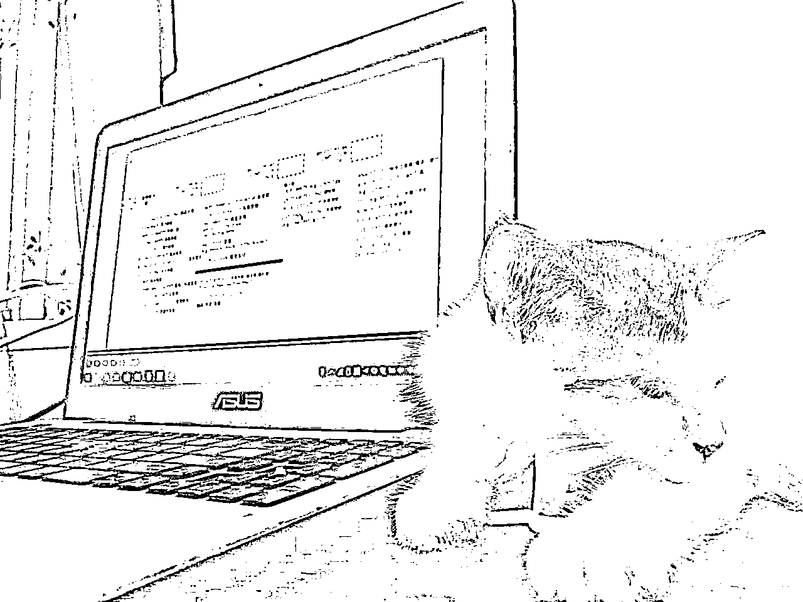

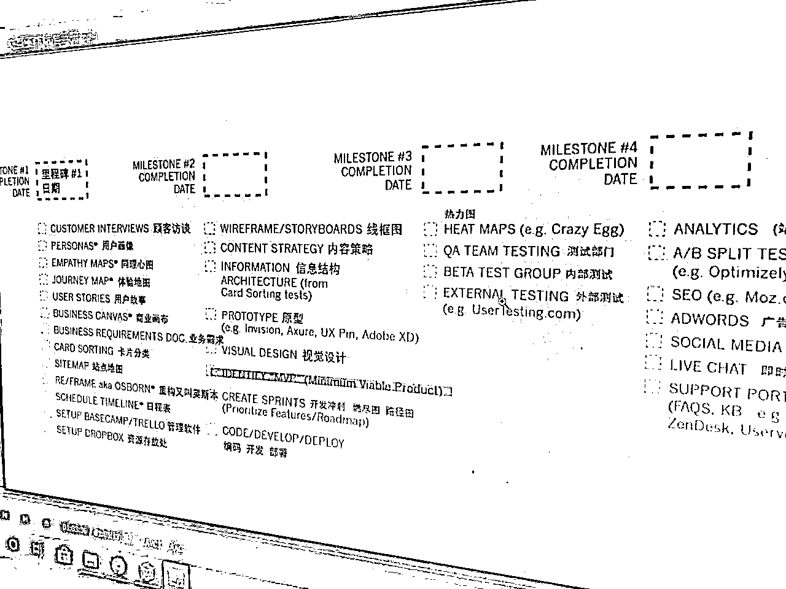

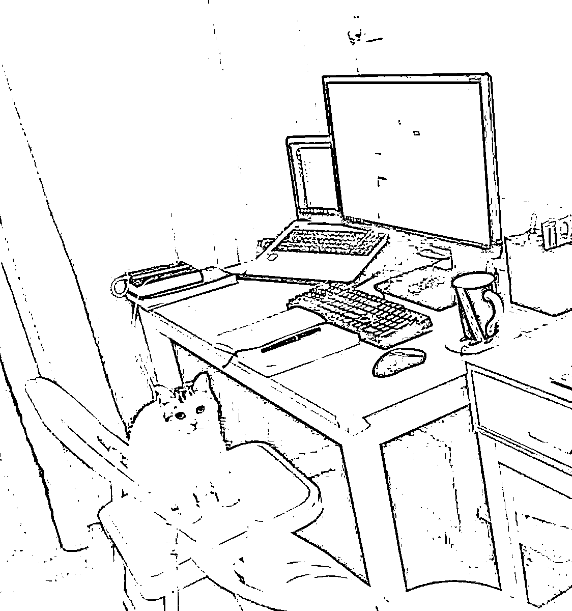

（嗯，我主要是来晒主子的）

3年4跳，终于找到了满意的公司，设计团队11人和还算不错的薪水。（教培行业，年包近25）。

相对大部人来说，这个成绩算是还不错了。

想着好好干两年下份工作一定跳大厂，没错，BAT已经在向我招手了！

然而，甚至还没来得及转正，双减政策下来了。

体会过的人都知道，裁员来的太快就像龙卷风，不能承受我已无处可躲。

周五还在和产品对需求，周一上午公司发通告，下午就打包走人。

一天搞定，就是这么高效。

这就意味着刚跳槽不到2个月，我又得被迫找工作…

在投简历面试的过程中，我也逐渐意识到，打工能达到的收入天花板太低。

这么频繁的跳槽才拿到薪水，也只是过眼云烟。

就算是我跳到了大厂，也一样存在不确定性，仍然会面临裁员的风险；

（虽然我的人品和技术都还算不错......

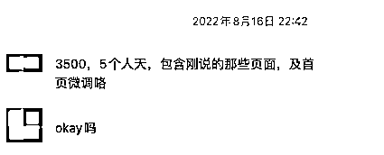

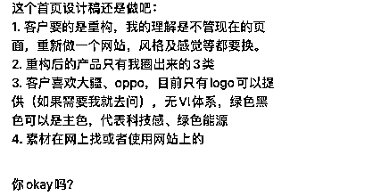

嗯，之前待过的几个老东家每年多少都会找我接几单外包私活也能赚个万把块的。

当然了。总归还是不稳定的。所以我告诉自己，职场不能作为我最终的归宿。

但是看看自己，小白一个，十几年的教育生涯我就学会了要努力打工。

难道去摆个摊？日入9000？这样，日子就会越来越甜？

除了画图，我还能做什么？抬头一看，两眼一黑，好像脱离了公司，我啥也干不了。

于是我告诉自己，先把目标降低，不说创业，至少，能够完完全全通过自己的能力，赚到第一桶金，哪怕是1块钱。

# 三、开启掘金之路

也就是这一刻，我正式开始了副业之路的折腾和探索。

基于自己日常工作的习惯，借助互联网各个平台， 一顿搜索“副业”、“兼职”、“赚钱”相关的关键词。终于让我找到了生财这个平台。（不过当时是和别人合并用的账号）

和大家一样，初次进生财，映入眼帘的就是信息爆炸，各种月入几万、日入大几千的项目，看的我内心无比激动又深感焦虑。

当时几乎是通宵看了2个晚上，最后锁定在了外卖CPS上，看着教程（记得是黄海老板的）感觉每个步骤都能做，并且能够快速有正反馈，也不需要什么太大的成本。

毫不犹豫，直接就下场干了。（关于项目的底层逻辑就不展开说了，感兴趣的大家自行搜一下）

# 四、外卖CPS

## 4.1 先上结果

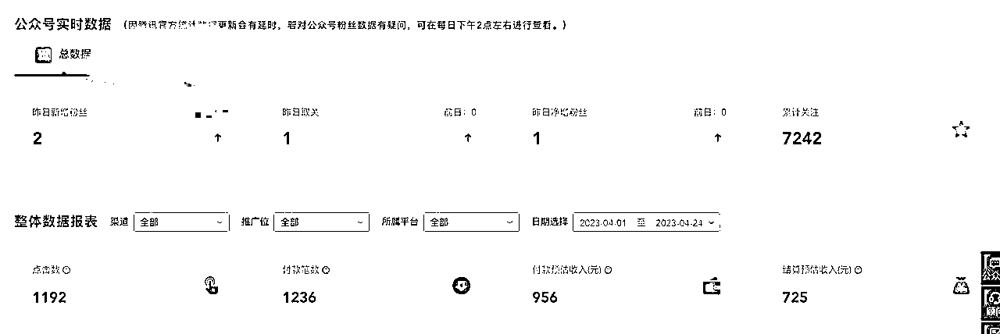

不要觉得这个钱不多，纯睡后收入了，它不香么。

## 4.2 我做了哪些？

从物料设计，到朋友圈第1个广告.... 再到第1张营业执照办理，再到公众号变现系统的搭建......

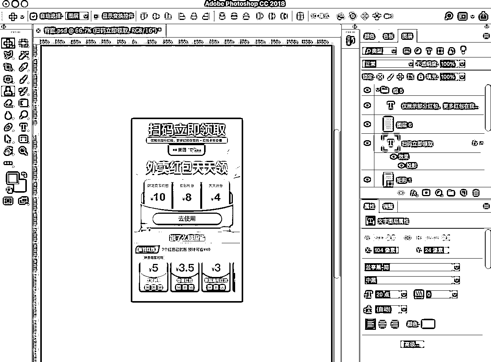

从线上引流到线下厕所贴卡片。。

白天跑各个公司去面试，深夜骑着电驴跑巷子谈合作...

【美团外卖周边榜单前10的老板几乎都被我加到微信谈合作，不过基本都要求面谈（卖的好的基本都是只做外卖的巷子里）】

确定了合作意向后，后面就寄卡片给他们分发出去就可以了。谈妥后就都是线上解决了。

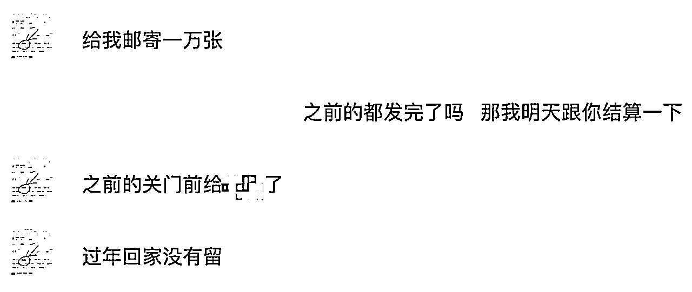

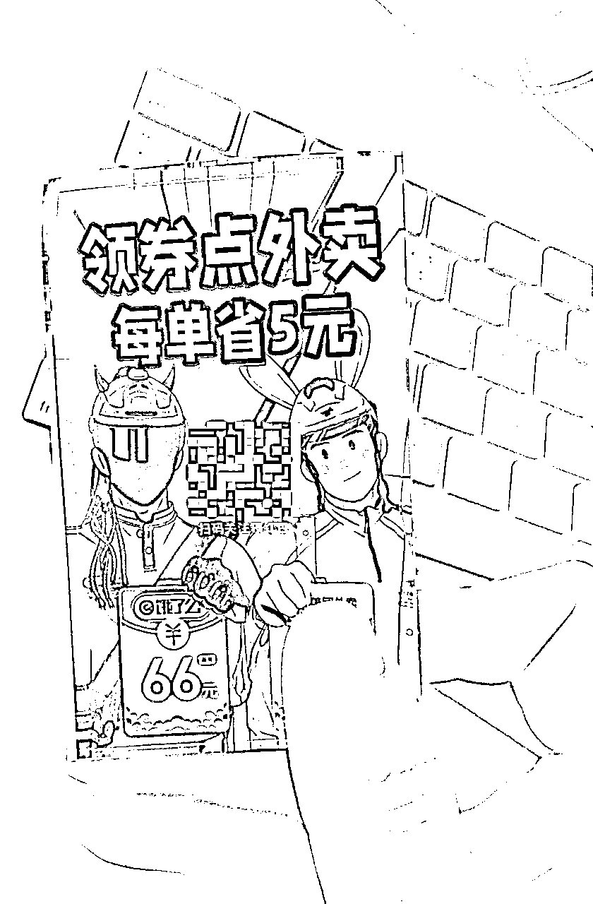

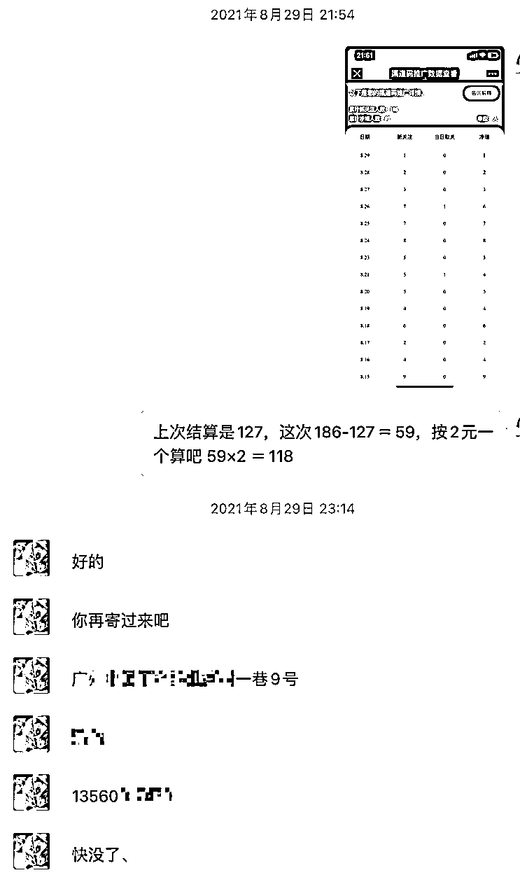

可能读起来也就10秒钟的事情，听起来也确实都不是什么难事，但是对于我来说，所有都是第一次。

真正下场去做就会体会到完全不一样的感觉。当时朋友圈一推广第二天就有收益了，不断引流之后，每天饭点都要时不时的刷新收益列表，看着订单从每天七八笔到上百笔。

第一桶金带来的兴奋感至今都记忆犹新。

这是全靠自己的能力赚来的钱，虽然比工资是比不了，但赚到手的感觉和打工的收入是没法比的。

## 4.3 思考复盘

直到2022年中，平台佣金政策改变，因为嫌佣金给的少，后面和多家外卖店老板陆陆续续断了合作之后就没有再继续引流了。

但即使是现在， 每个月依然都有一笔睡后收入进账。

这是第一次自己真正意义上躬身入局的互联网项目，因为成本问题没有十几万的砸钱投流。

不过很幸运的，我实实在在赚到了钱。

说个题外话，当时让一个朋友关注公众号，也大概介绍了这个项目。但是被人家无情嘲讽....（这个朋友也想搞钱，但是并没看得上，直到现在也还在找项目。）

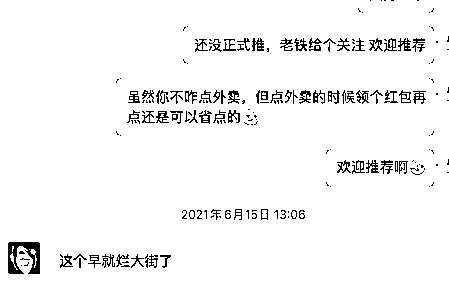

其实关于某个项目做不了，某个项目做的人太多了，没有空间了等等，你做多了会发现这种论调任何项目一直都会存在。

这是很多人的通病。

合不适合，能不能做，只有自己下场了才知道。

多数人都只是在观望，他们只是在抱怨和等待，永远不开始，更不要说坚持了。

而事实上，大部分项目甚至还不需要拼认知，执行力跟上都能赚到钱。

当然，如果你也想入局外卖CPS，这边有几点建议供参考：

1.  前期引流需要投入成本，线上或者线下都要成本。回本周期看投入多少，差不多都要半年起。想赚快钱的就算了。

1.  现在纯外卖佣金被平台打压，流量也被官方本地群薅走，可以结合淘客等项目做二次变现，扩大利润。

1.  纯小白没有任何互联网经验的，不建议入局。

# 五、设计IP

## 5.1 IP初探索

因为自己本职已经是高级设计师，在职场上也算有一定的成绩，虽然频繁跳槽，但也从来都是1个月内找到下家，涨幅也都尚可，加之还报了自媒体IP的课程，觉得应该能够沉淀一些东西的，而且又有点好为人师的性格，带了几个应届生了。

另外，自己也确实挺爱表达，也愿意分享。比如在工作中，我也经常做技术分享。（BUFF叠满了......）

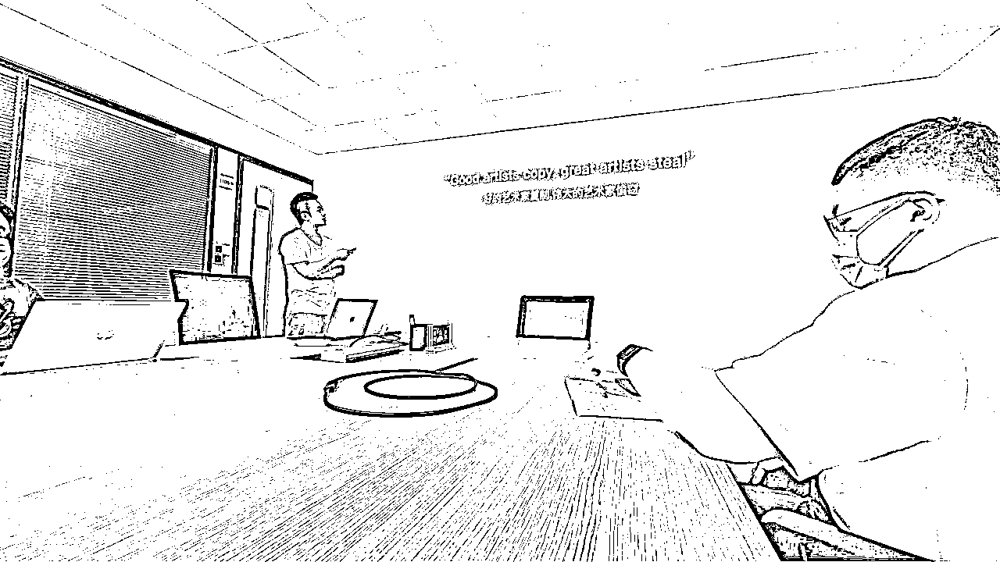

于是我大概思考了一下 IP闭环（为设计小白提供简历指导与职场咨询），本着80分的能教70分，70分的能带60分的IP思维。以及“确定了就是干”的理念，准备好了钩子素材，我就果断又扎进去了...

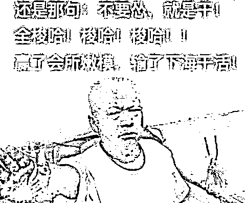

这是当时的一些输出内容的截图。

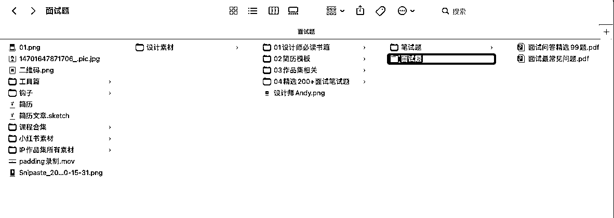

公众号也发布了几篇文章，有一篇投稿还登上了优设（设计师知名论坛，100万+用户）的首页。

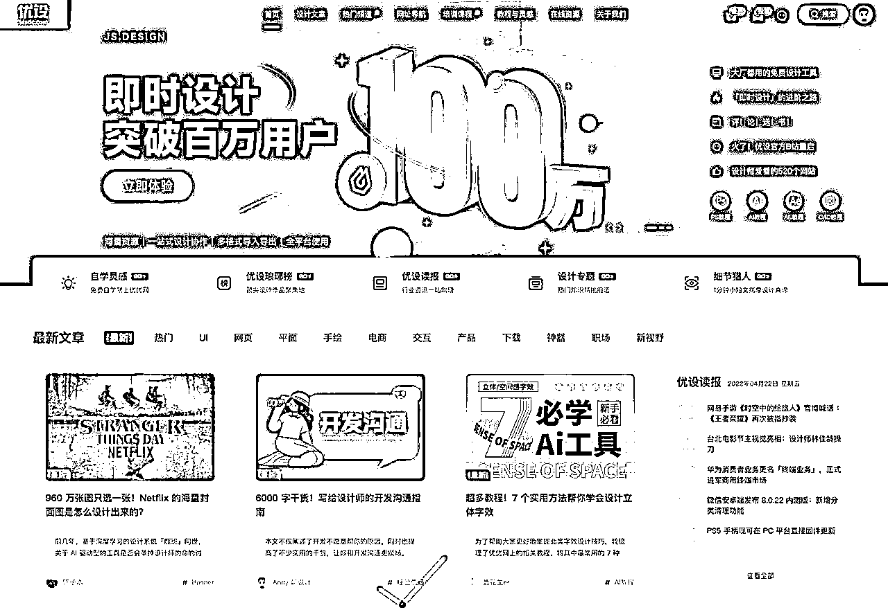

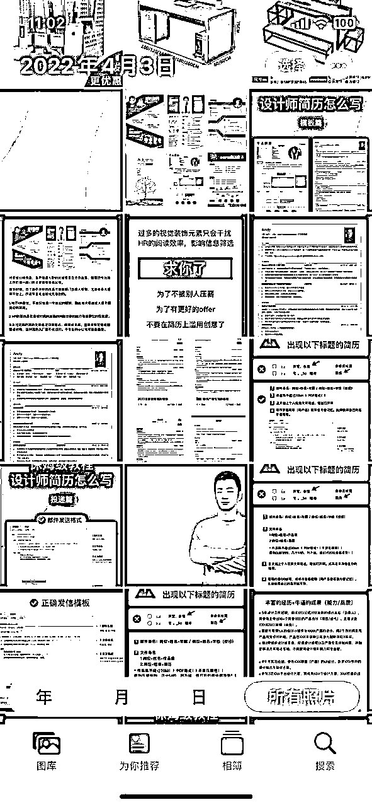

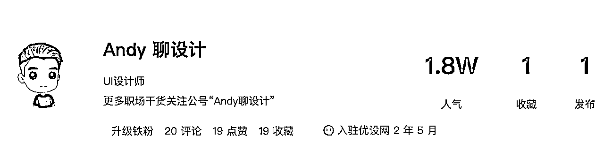

即使是现在，偶尔还能有设计师加好友。

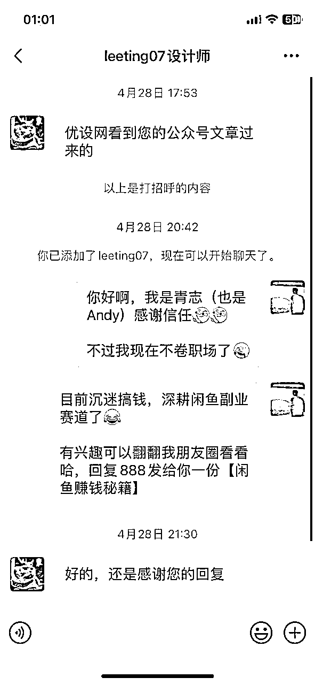

做了1个半月的成绩：小红书引流私域 200+、公众号粉丝300+、变现 0。

嗯，没有然后了。

后面因为刚换工作入职，接手了个大项目改版。主业实在太忙不敢太嘚瑟，就没有继续做了。

加之引流过来的流量，也不知道如何承接，毕竟我当时连产品都没有做就下场了。

不过，更重要的还是我那会儿心态浮躁，做IP来钱太慢了，就想着实实在在的快点赚点钱。

## 5.2 思考复盘

虽然没有赚到钱，但收获和成长是实打实的。

小红书账号搭建、图文制作、引流私域、公众号、写作等等，这些都是我以前没做过的事情。

另一方面，也发现了自己其实对设计这个职业并没有那么热情了。

毕竟商业闭环里，设计本身，还是离钱太远了。

商业的本质，就是产品+流量。

有的卖，有人买。就能赚到钱，就这么简单。

而设计这个工种，在这个链路上，显然不是那么的重要。

况且在大天朝，不管是哪行的设计师，环境多数就是下面这样的。

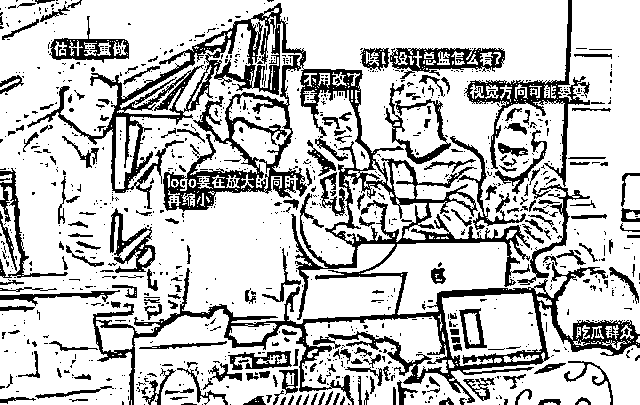

（设计师都懂的痛）

如果我做设计IP，那最后不还是教人怎么打工？不，我内心是拒绝的。

毕竟，我的愿景是让大家赚到非打工收入的第一桶金。没有做出太大的成绩，就不给大家建议了。

很好，咱折腾下一个。

# 六、视频号带货

## 6.1 传说中的红利项目

做过视频带货的，应该都知道，22年4月份的时候，好像全地球的人都在做视频搬运。

整个朋友圈，各种社群到处都充斥着：

红利、捡钱、不能错过、猪都能起飞。

赶快跑步进场，再等2天，黄花菜都凉了！

过了这村没了这店，不冲不是中国人！

话都说到这份上了，我又抵挡不住诱惑，正好又在找项目。

很好，入局。

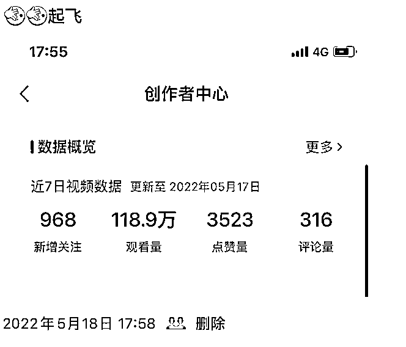

不得不说，流量是真的很猛。一口气注册了6个微信号，每天下班混剪视频到半夜一两点。

早上6点多就会自然醒。因为总觉得一睁眼， 兴许某个号就能爆了。

那会儿真的睁眼闭眼都是在想着选品剪视频，看数据。

看着流量起飞的感觉真的很爽。连着半个月每天都几乎只睡4-5个小时。

相信我，当你来钱这么快的时候，你是舍不得睡觉的。

嗯，是不是觉得我很拼？

我也觉得，所以就扎针了。而且又临近618，公司需要做大屏。

很好，打着吊瓶画图，很酸爽。

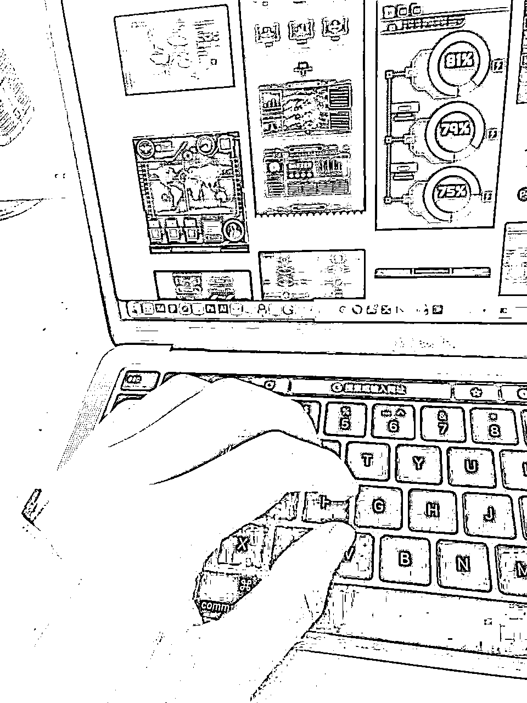

（身体是革命的本钱，建议大家多锻炼平时）

但是不瞒大家说，当时做的几个号，赚的最多的是擦边的品（营销点壮yang的），势头非常猛。

所以说来钱快的事情，要么进去了，要么在进去的路上。

当然了，封号这件事，虽迟但到。

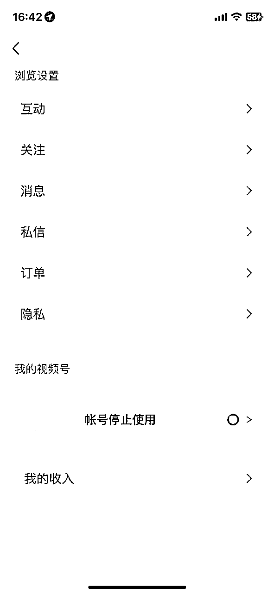

后面陆陆续续搬了监控、女装、老人用品、 母婴绘本等等，都没有怎么大爆了。

怎么都起不来，心态被所谓的“红利”影响。

再然后平台越来越严，流量逐渐下滑，红利基本消失殆尽。

加上白天上班，晚上要剪视频的成本比较高。我发现以副业的形式来做这个项目，显然有些吃不消。

但，如果你也想入局短视频带货，这边有2点建议供参考：

1\. 短视频带货爆发强，爆一个视频能够一个月赚几万甚至十几万以上的利润。但是不爆就会非常的精神内耗，因为可能你剪了1个月一分钱没有。都属于电商项目，非常依赖选品以及你的视频能力。所以，前期的投入成本高（更多的是精力和时间成本）。你可以理解为高投资高回报的项目。

2\. 只要是以视频为载体的内容电商（包括但不限于视频号抖音）都得要学剪辑视频，你可以选择电脑也可以是手机，虽然剪映这类的软件已经是很大程度降低学习成本了，但是剪视频这玩意，需要长时间的专注坐着干，兴趣也很关键。如果想入局，我的建议是，自己先找些基础教程剪几个感受下流程。

## 6.2 思考复盘

干到后面你会发现，真正捡到钱的，短期实现几十万甚至百万收益的，其实还是那些头部的电商玩家。

他们有过往沉淀的经验、有独自的选品方法论壁垒。

甚至是有几个人的小团队。

本身就是有概率性，堆量的玩法，人家一个团队的人，每个人带着十几个号all in 去冲。

不出结果才怪。你呢，拿什么比？

这些都是藏在冰山下面，普通人看不到，短时间也做不到的。

而做到那样的傲人成绩绝非是因为红利本身，也绝非是哪个大佬的课程多好。个人过往的经验占了一半以上，甚至更多。

当然也不乏那1%的幸运儿一发就爆的，可惜多数人没有这个命。

红利确实是红利，量够大，总会起飞。

所以普通人纯小白入局，就不要想着一个月就赚几十万了。

当然了。多少赚点钱还是问题不大的。比如我，也就只捞了几万。

红利项目对于小白来说可能就是这样吧，来的也快，去得也快。

所以，能够沉下去深耕的，才能持续做大。

到此也做了几个项目了，我意识到一直反复横跳项目也不是个办法。

这样确实能赚到钱，但是也陷入了一直换项目的循环中去。

不说稳定变现吧，至少要找到一个可以长期做下去深耕的项目。

嗯，我得找个项目死磕。

# 七、闲鱼无货源

以上的分享其实更多的都是【道】。这个篇章我会分享一些【术】的内容。

闲鱼的项目其实在搞设计IP之后就已经开始做了。

虽然一直寻找项目，但闲鱼确实是随手就能捡起来随手就能变现的项目。

他的魅力就在于，不管你多久没做，只要你保持正确的姿势上新，不管你账号停更了多久，权重都能拉起来。

而操作也没有太限制，可以是地铁上、吃饭的时候、坐公交甚至是洗剪吹等等任何闲暇时间，有网随时随地就能做。

相比其他项目，因为主业的关系，操作闲鱼的自由的时间正好和我的背景也比较契合。

## 7.1 项目成绩

从刚开始的卖一单利润5元，到10元的走量品。

从一台手机一个号，到多台手机多个号。从自己做，到教朋友入局。。甚至是带自己年近半百的老爸入局。

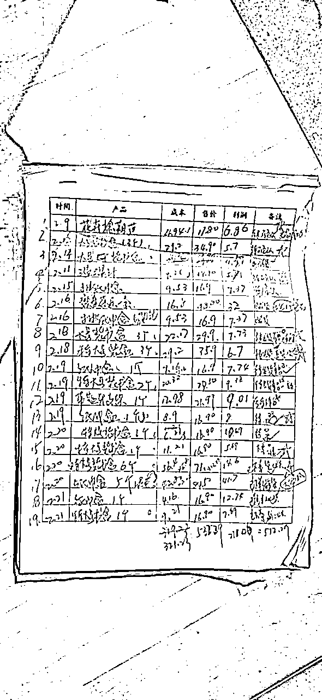

这是当时他自己手写的订单明细（教不会用电脑）

再到后来的高客单100+ 利润，甚至偶尔也能1000+一单。

从月入1000，到2000，到10000+。

接近2年时间，多个账号总利润20W+。

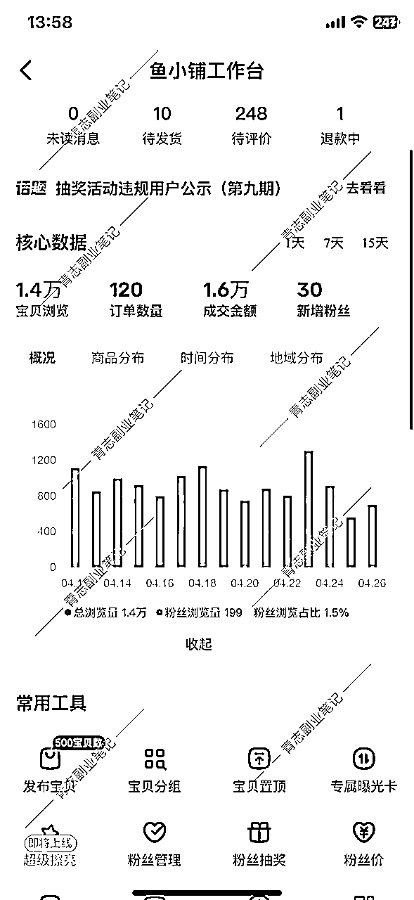

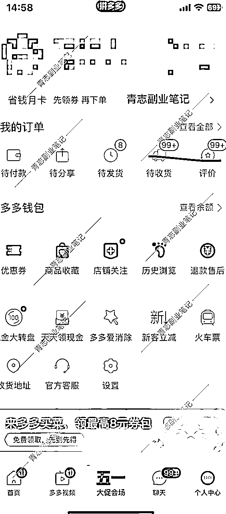

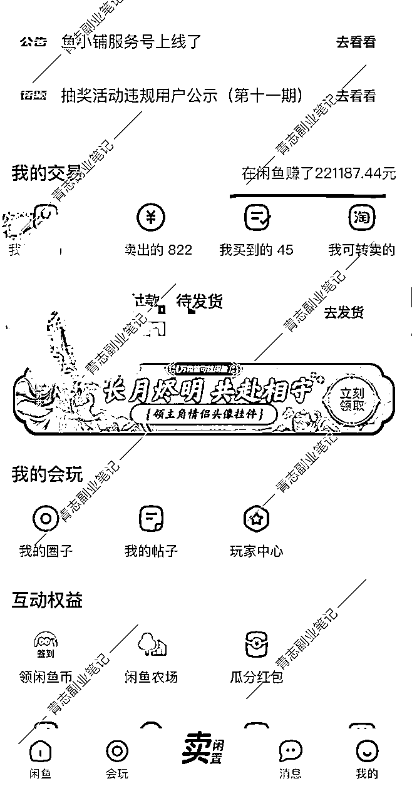

现在也依然在继续做。

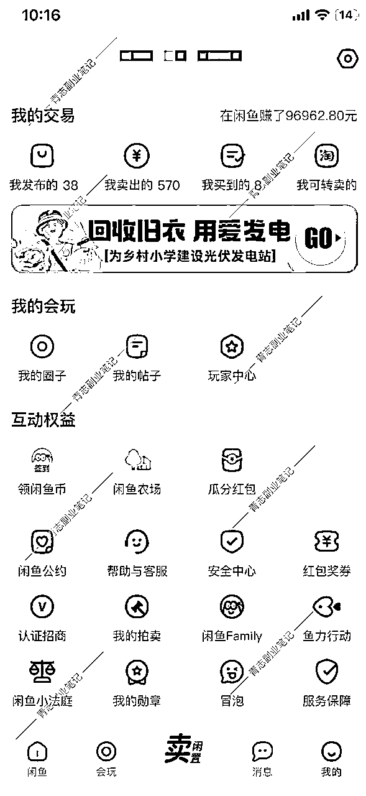

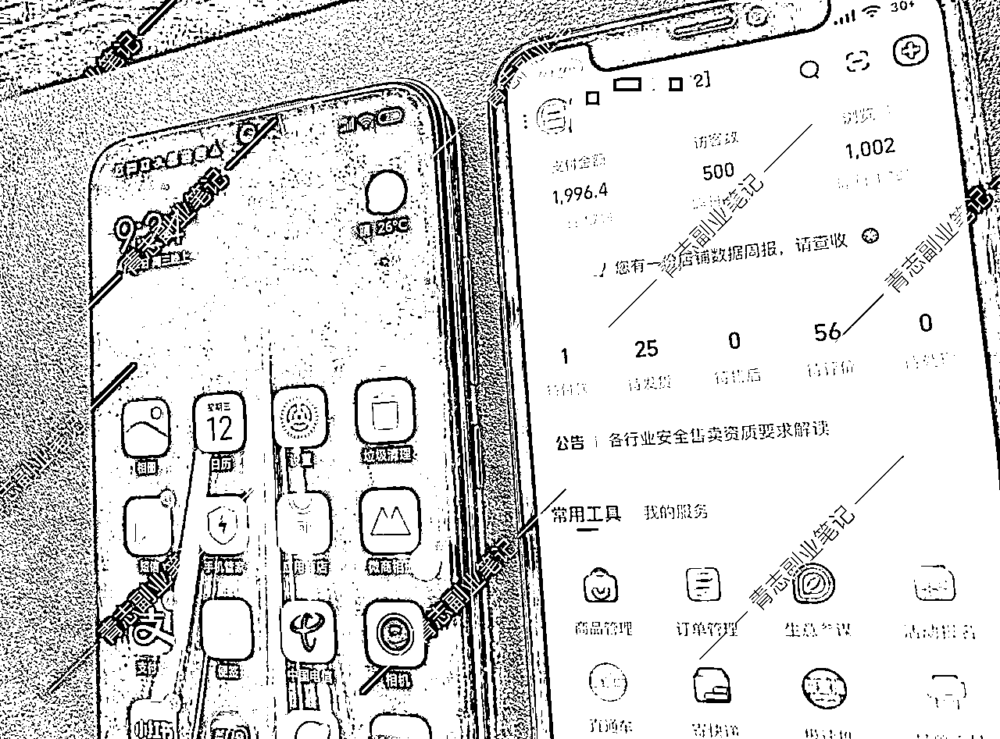

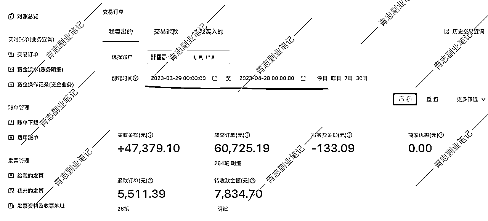

2024年更新，一直在深耕。

（仅部分账号收益图）

算上其他七七八八的项目，纯副业收入，已经30W+。

当然，毕竟是副业，2年多的时间才达到，不算太好也不算太差。

不过现实一点，稳定月入三四十万？

以副业的形式？ 纯小白入局？

两字，梦里。

## 7.2 认识闲鱼

基本上电商都是这个模式。选品为底层能力，每个玩法都能用。

关于项目细节的部分很多圈友都有提到，我就不多说了，从另一个角度，讲点不一样的东西。

### 7.2.1 选品上新，执行为王

刚起号，保证每天上新3~5个品左右就行，时间要错开，不要一口气全梭哈了。你要是编辑好了也没事，存草稿就行，到点发布就好。

品不要太乱，最好是类目差不多的，半垂直。三天一个周期，没有数据反馈就换类目，继续换品测。刚起来就杂货铺就行了，把号权重搞起来，拿到正反馈。

正常品不要太差，坚持上新，同时要保证图文的质量。快的3天，慢的2周，陆陆续续就会有询单客服和出单的。运气好也可能一周内就有爆的链接。

这个过程，我认为最重要的是：坚持每天上新，保证质量的上新。

很多人，上不到10个品没有出单就坚持不下了。后面的流程就更不用看了。

区分是同行还是素人，就看他的产品发布形式：标题、文案、产品图，懂不懂修改定位薅同城流量。

另外适当的干预也重要，数据反馈不错的刷1-2单（一定得是搜索下单，尽量模拟真实用户）。

QA1：多久出单？

看图2曲线图，取决于你上新的质量和数量。随着时间的推移，总能出单的。

QA2：一个月能赚多少？

新人最爱问的问题，浅浅的回答一下。

总利润 = 单品利润 X 卖出数量 X 账号数量。

在闲鱼卖货，既要客单高，又要稳定的大单量难度挺高。很依赖选品。

所以，能赚多少，没有上限。

刚入局的新人，不要想着能赚多少，先坚持上新2周，执行之后，结果自然就来了。

赚多赚少，都是掌握在你自己手里。

以上两句话适用于任何项目。

### 7.2.2 稳住爆品，吃尽老本

首先说爆链接的定义：1\. 搜索权重高（搜关键词第一屏就是你的链接）。2.曝光高。

自然就会带来稳定的出单。

而持续上新后无非就有2种情况：

#### A 没有连接爆

无连接杀出重围，所有链接都平平无奇，毫无声色。

问题一般就3个：没坚持、品不对、图片文案细节没做好。

怎么办呢？

优化优化再优化。继续选，继续上。无他。

#### B 有连接爆

请结合下面的曲线图食用。

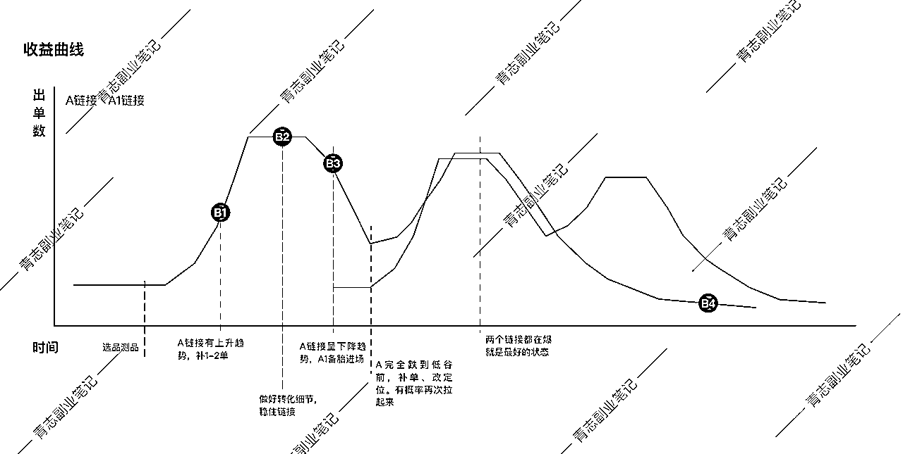

该图为最理想状态的趋势图，实操还涉及很多变量。

B1 快要爆了

爆链一般都会有一个趋势，出单量和咨询量明显递增。

比如第一天2单、第二天3单、然后5单、8单这样（这里特指是同一个链接。）

一定要把握住流量。尤其是刚开始成交的几单，宁愿是少点利润，也要促成交易。

B2 真的爆了

只要客户来了你不骂他。至少至少会有一周的时间可以稳定每天出单。

这个时候怎么办？

一个字，稳住！

停止上新，认真做客服就行。记录流量和转化的趋势，链接始终会变到B3的状态。

B3 流量下滑

因为不管哪个链接都会逐渐熄火，这是任何链接都无法避免的生命过程。

但是我们可以通过方法去干预，让这个链接尽可能的延长爆的周期。

当链接差不多处在B3的位置时，具体表现在客服咨询、单量明显下降。

这个时候就要引起注意了，不能在稳了，备胎立马上起来。

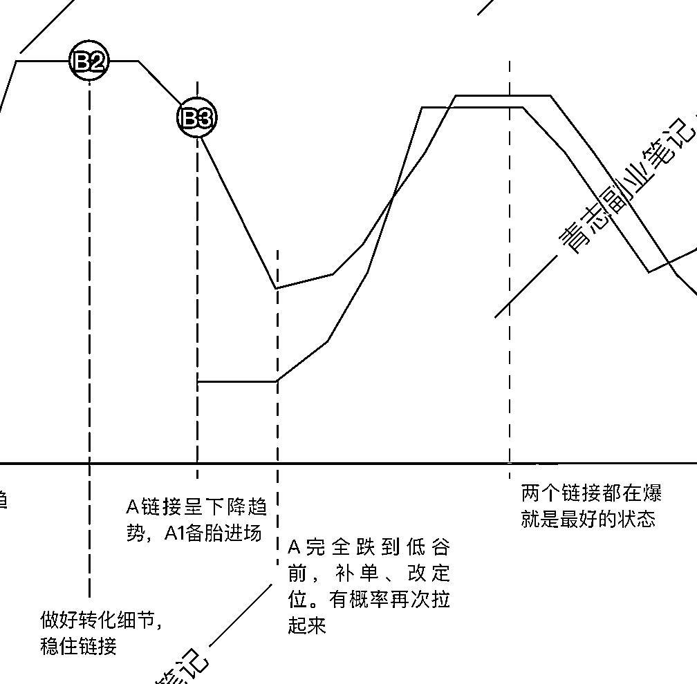

同样的品，再上1个链接。我们称它为备胎1号，也就是新链接A1。

A1需要用不同的图文、不同的定位发布。

同时A链接成交的客户，适当分一些，引导客户去A1链接拍。

（因为是同个品，所以流量标签是非常精准的，这其实也是S单的一种）

直到A1链接有自然流量成交或咨询，渐渐的A1也会爆起来了。

那么就又可以做客服就好了。

同理，当A1链接也快熄火了，同样的操作方式，备胎2号，A2链接跟上。

以此类推，就不举例了。这个方法的底层逻辑就是：

爆了就一直怼，怼到他没流量。

有点类似之前搞视频号的方法，这个方法其实在小红书也是可以用的。

我的一个号曾经同个品爆了接近4个月，一共怼了6个备胎，备胎还一直不同程度的发光发热。

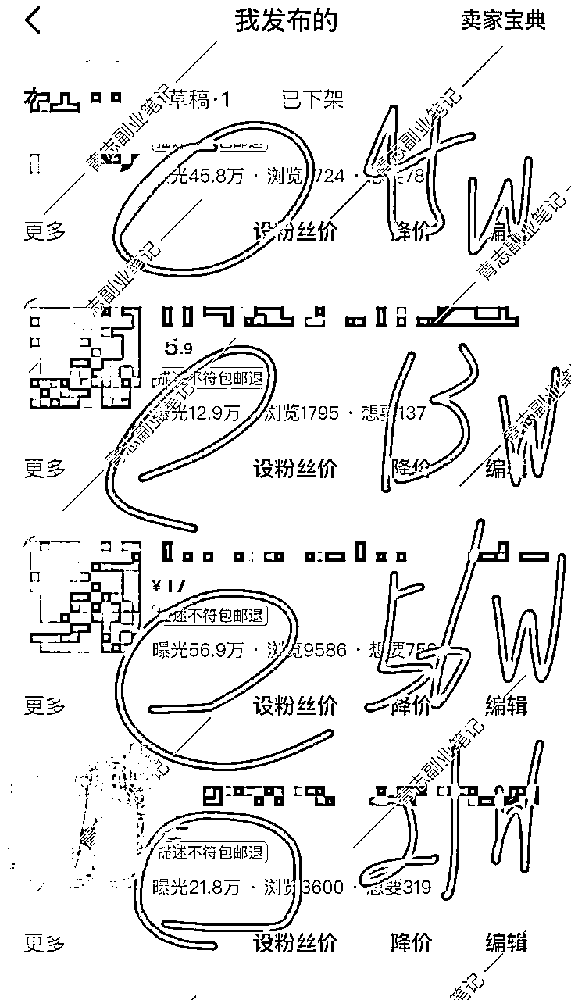

爆的时候，做好客服，转化，售后，回复率这些。

另外，老本吃的越久，这个号就越长时间不用上新品。

最理想的状态：有多余的时间，就去运营其他账号，弥补空窗期。

B4 爆不动了

当这个品通过补单、改定位、子链接都无法挽救，连续2周无人问津。

那么他大概率是没得救了。正泰分布曲线，在任何平台都是适用的。

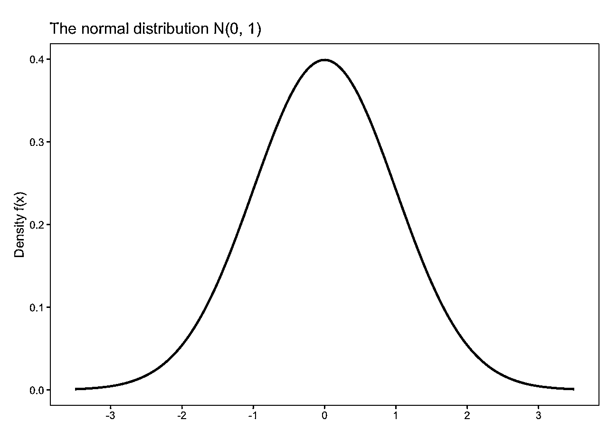

嗯，放弃吧，看最后一点。

### 7.2.3 最后，也是最重要的一点

很好，看到这里你就明白了，一个爆品的循环基本就是这样了。

所以，最重要的一点，请看回第一点（7.2.1）

## 7.3 关于选品

万物皆可上闲鱼。选品方法，已经有很多帖子了。我说下自己觉得比较挺实用的2个方式。

### 7.3.1 条件反射式选品

其实就是日常生活选品， 把选品的练习练成条件反射式的思考。是比较综合的一个选品方式。

简单讲就是自己平时多看多想，把选品当成一个习惯，条件反射的想到这个是否可以当成选品去卖。

要想早起就要刷牙那样的一种习惯，那么你找品，就会像呼吸一样自然。

给大家举个例子。

假如你是个打工人，那么从你睁眼开始一天的生活浓缩一下，很可能就是这样的：

摘下眼罩，掀开被子。洗漱穿衣，出门骑个小电驴，可能今天下了雨你还得准备下雨衣雨伞。在工位开启摸鱼生活：办公室是不是要有绿植发财树之类的？离不开工位办公椅吧，插排充电器要把？开会要有会议桌椅吧？老板办公室都有哪些东西？

午休配一个午休床，可能还要配个耳机带个耳塞吧，上班总要喝水吧，食堂（餐桌椅等）吃饭呢？下班回家看剧打游戏，是不是还得有个书桌，或者电竞桌？洗澡得有个浴室吧，睡觉总得有个床吧......

上面的划线词，再配合闲鱼搜索下拉推荐、多多垂直品类排行榜单等方法结合一下，于是，单这一天上班的这个场景。选品就会有非常多了。

可不要小看些划线词了，里面的某个品也给我带来过上万的利润了。

### 7.3.2 拼多多后台类目选品

非常好用的一个工具。

拼多多注册一个店铺，发布商品时，可以看到很多详细的类目，几乎是涵盖了整个一级类目的选品词。

针对类目的关键词在闲鱼 搜索后也能找到拓展不少品。

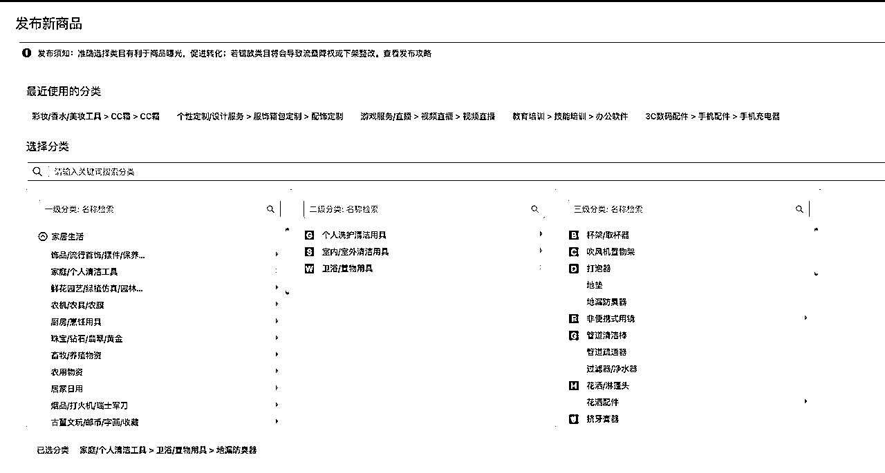

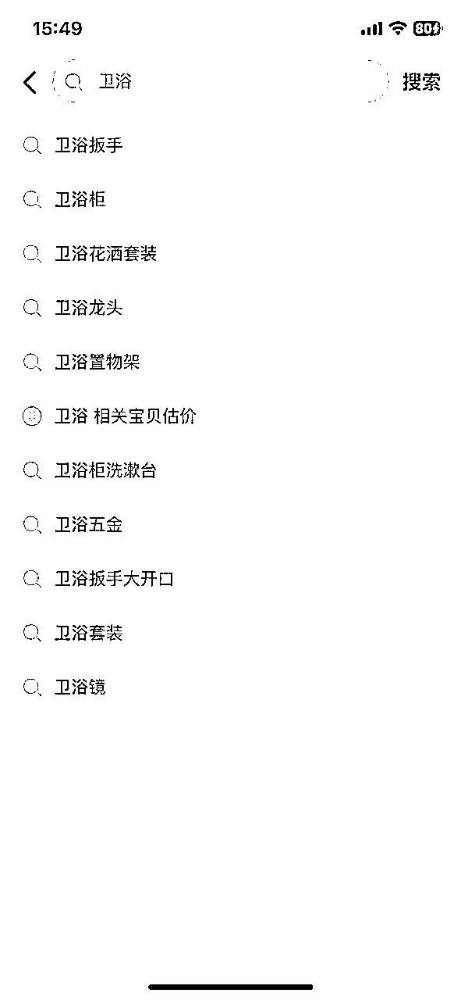

### 7.3.3 搜索引擎关键词选品

搜索引擎：类目关键词 + 官网。

比如，我搜个办公家具（家具品是非常典型的高客单产品），

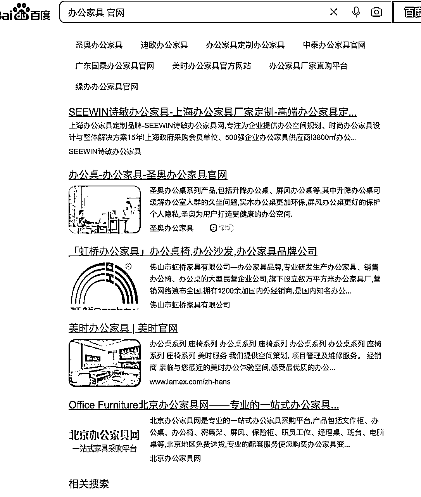

（Google 也可以用）

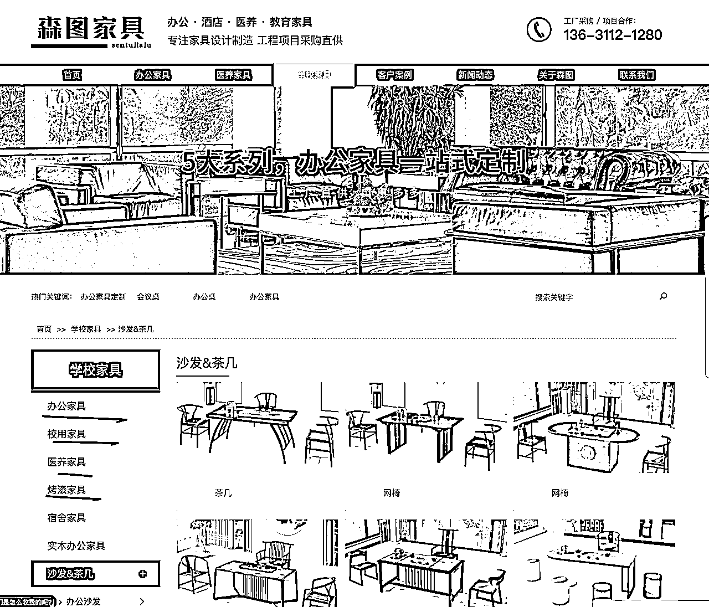

还比如这个网站：整个供应链相关的产品，一站式搞定。发现这个网站，等于发现了一片蓝海词。

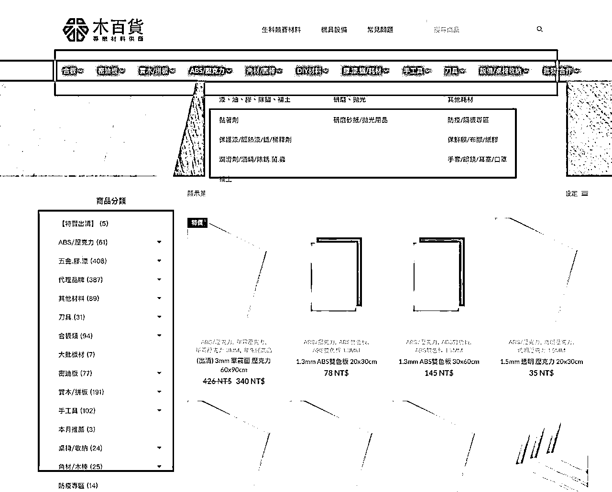

经常搜搜，有时候这种类型的官网会有很多你意想不到的蓝海品。

比如就上面这个图，你就有一堆品可以去尝试了。

### 7.3.4 选品的好与坏

黑猫白猫，能抓老鼠的都是好猫？

其实不然，我认为萝卜青菜各有所爱。

适合的，才是最好的。

谈选品，肯定大家都会提到闲鱼的大类目 —— 电子产品。嗯，我也带过。投影，手机之类的。

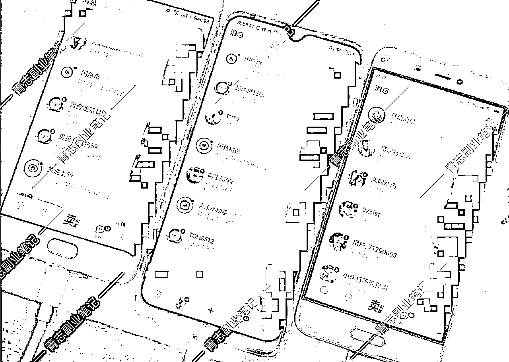

流量确实和常规的品有明显的区别，很多号都能爆，爆了上99+也确实有过不少。

但是对我来说，倒不是赚不到钱，售前和售后太麻烦了，转化实在偏低，搞了一万多后面我就放弃了。

当然，这个就看个人了。这只是我的看法。

鞋子再好看也没用，合不合脚，只有你自己穿了才知道。

选品是电商最基础的底层逻辑，3分运营，7分选品。

一定要学会自己选品，我一直认为不能太过依赖别人给的品。

当然前期带别人的品，甚至直接抄都没问题。总要成长起来的。

选品很重要。很重要。很重要。

授人以鱼不如授人以渔，提供再多的货源，都不如自己会选品。

他是可以迁移的能力。

这样你才能掌握一切，这是电商的通用能力，也是底层能力。

如果想要走的更远，想做大做强，选品至关重要，永远也绕不过去。

### 7.3.4 扩大利润

能从0 ~ 1 ，就能1 ~ 100。

1.  复制模式，店群搞起，客服安排上，无限扩大利润。当然了越高阶付出的成本就越大，玩法就更加复杂了，普通人其实没必要想这么远。先做再说。

1.  另外一个模式就是做IP了，也是青志目前打算冲的方向。我的愿景，让小白都能赚到第一桶金。

# 八、总结

以上便是我2年来所涉猎的相关副业，篇幅关系，并没有全部展示。下面谈谈2个心得。

## 8.1 关于项目的选择

翻了生财很多帖子，大部分都是已经做到很大的生意规模了（嗯，至少看起来真的很大）再来分享的。

像我这种分享失败过程的帖子相对比较少，毕竟人性都对“月入过万”、“躺赚”这种字眼比较敏感吧。

看多了，就会有种错觉，好像大家做项目都能随便月入过万，年入百万。

做个项目，还没有心理准备呢，诶，怎么一不小心就逆袭暴富了。

所以，有很大一部分人总是在项目上反复横跳，看到哪个文章说哪个项目赚钱了，就去冲哪个项目了。

而另一部分人，就是害怕这个项目做不了，担心那个项目不适合。总会给自己设置太多的卡点和理由，其实真的去做了，没有那么多做不了的事。

我自己就是一个典型的例子，从一个设计师到各种副业的开拓，（除了上面的项目，我还做过一些其他项目，小红书带货、淘客也浅尝一点。）

所以，流水的项目，铁打的人。

什么项目红做什么项目，3天打渔2天晒网，什么项目都做不成。

大概率就是训练营里面陪跑的。

你的变化很可能就是：从一颗稚嫩的韭菜，变成一颗成熟的韭菜。

且，你会发现，做久了你永远都是在找项目的路上。就像先前的我。

诚然，找到适合自己并愿意为之深耕的项目，是需要试错成本的。

一旦选定了一个项目，至少要给自己定一个坚持的周期。

再回过头来看前面的项目，其实只要坚持和深耕，都是可以做大的。

## 8.2 关于知识付费

讲个很多人不愿意说的大实话：

不管是哪个课程，8020法则、721法则都是存在的。

能做成的，永远都是一小部分人。

比如这样：

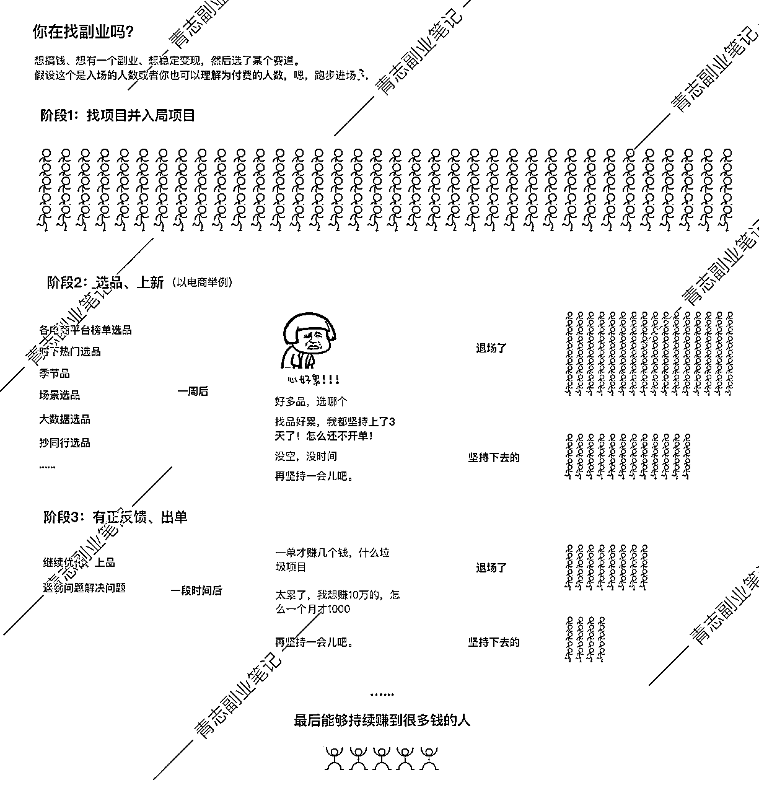

而这最后一小部分人的成功，都是无数个失败的日日夜夜熬过来的。

即使是再牛逼的大佬的课程，也无一例外。

大佬牛逼，不代表你报了他的课，你就能和他一样牛逼。

教和做是两件事。

考上清华的学生大概率不是清华毕业的老师教的。

清华毕业做老师的，也不一定带出多优秀的学生。

这2句话，你细品。

因此，能不能成功，能赚到多少钱，永远靠的是自己。

幸存者偏差，你能看到的，永远都是成功的那部分少数人。

而这部分人做过了无数次的80，但只会告诉你，现在自己就是成功的这20。

（废话，失败的拿出来吆喝那不是傻逼么，诶，我好像在骂自己）

为什么我这么说？因为前文提到的几乎大部分项目，我都是付费学习的。

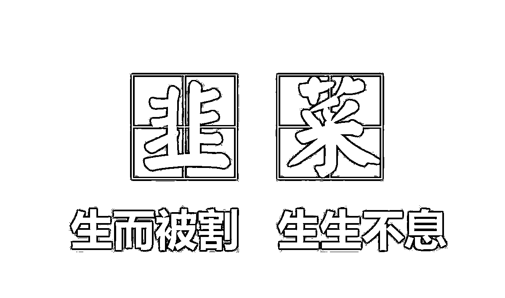

我是一个热爱付费的人，我从来不会在意别人说我是韭菜，我不管。

如果，你也可以像我一样，那我觉得这件事情：

开个玩笑，不是说付费不好，付费更多时候仅是入行最高效的方式。

## 8.3 为什么你会付费

很简单， 看了这个图你就明白了。

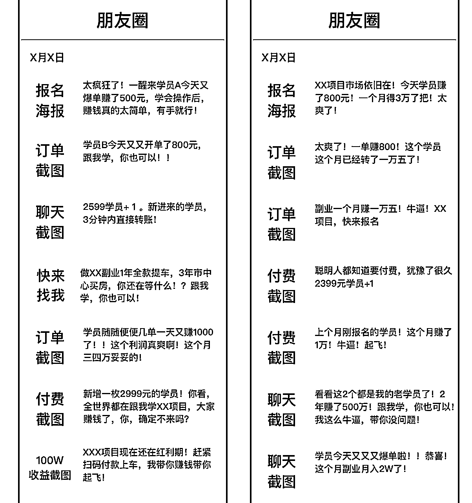

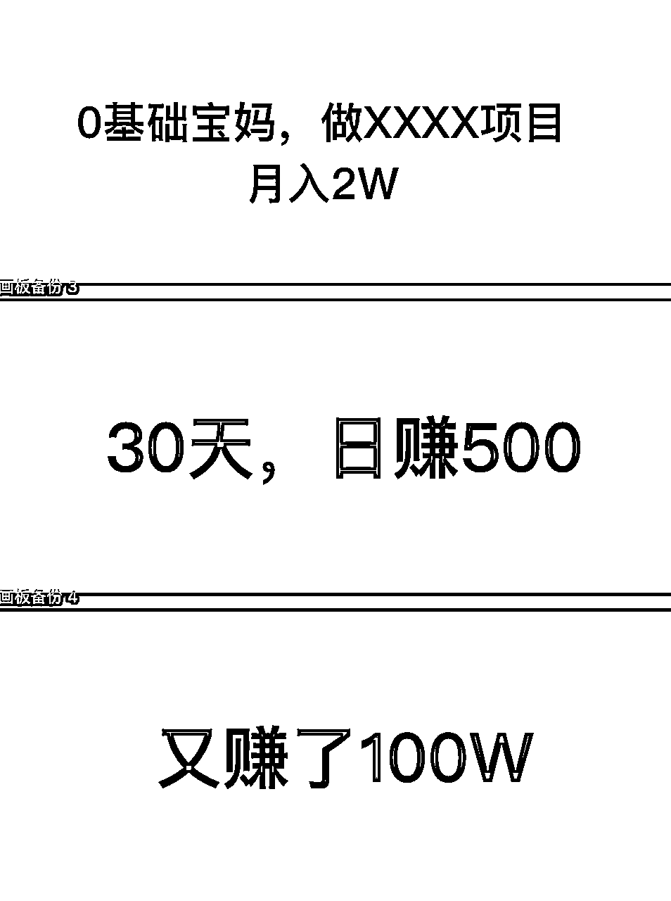

仔细想一下，是不是每次付费，都是被这几个图骗了？

好了，就说这么多。

如果点赞过50，爆肝也要整理一篇，从设计师入行到副业项目，我作为韭菜的自我修养。

（揭秘知识付费的光明与黑暗）

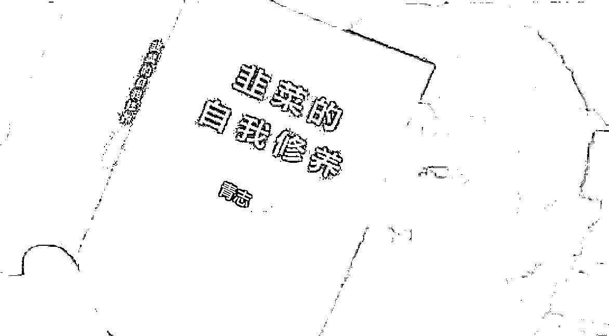

所有人都是从一无所有的新手过来的，水平有限，主打的就是一个帮助启发。

搞钱路上不孤单，一起加油，祝各位看官，天天爆单。

最后，感谢生财，感谢圈友们一路上的交流和帮助~

——————————————————————————————————————

穷且益坚，不坠青云之志。

我是青志，感谢你阅读到这里。

本篇为【上】，若有机会，2年内出个【下】。

全文，完。