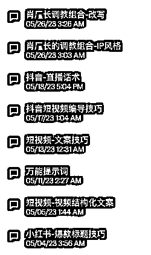
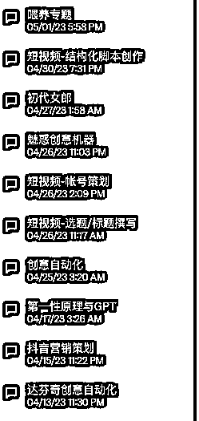
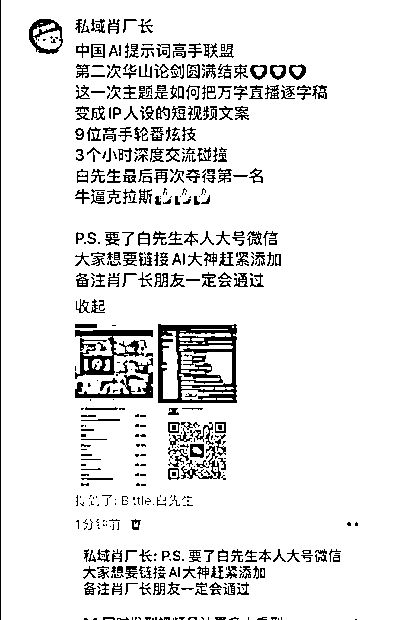
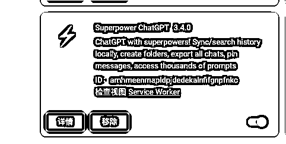
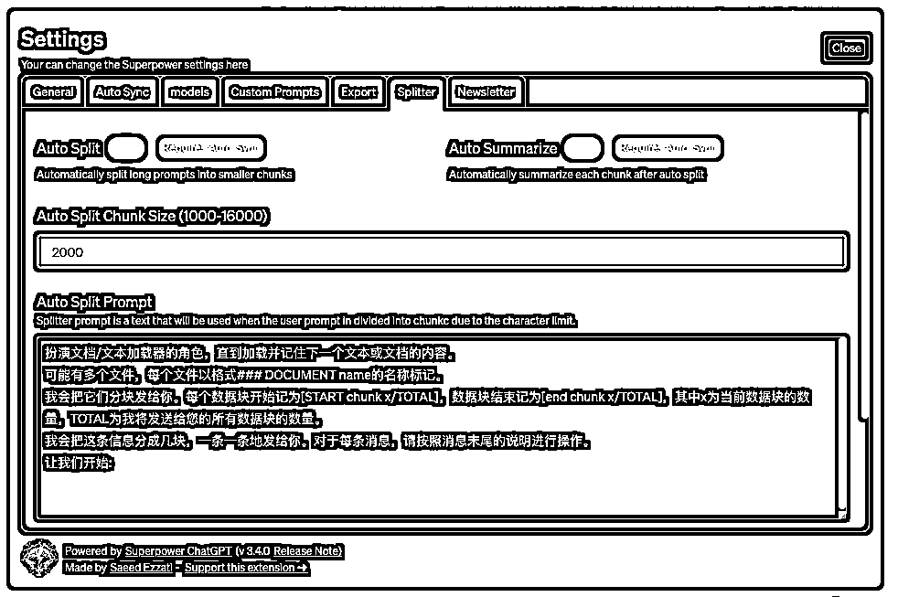
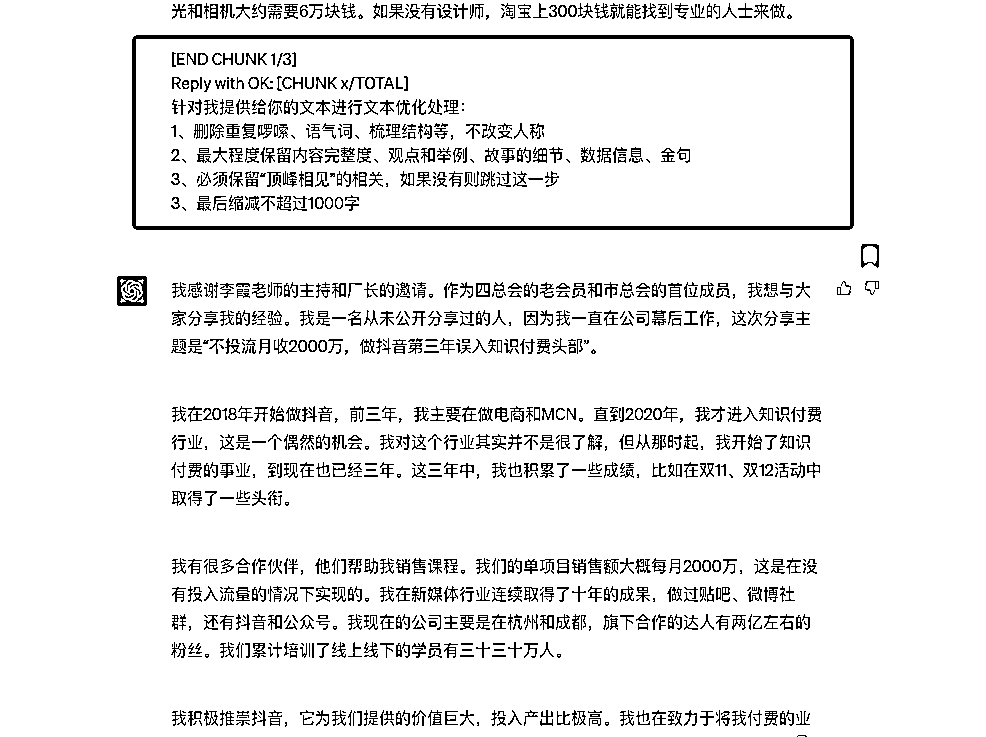
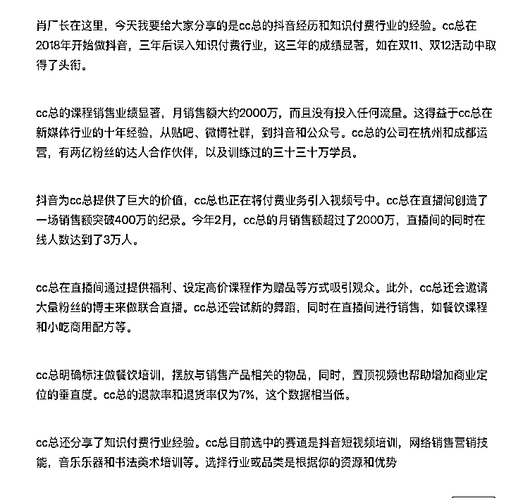
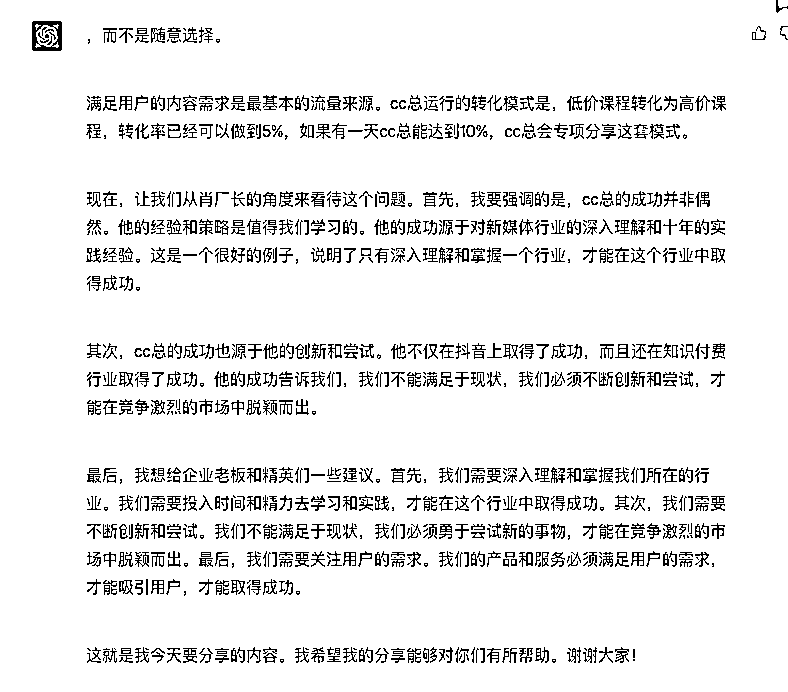

# GPT最强心流调教思路——三体联动！

> 来源：[https://w8jx8flg45.feishu.cn/docx/YiWodiEJuojB70xgK6ncdXHpnmh](https://w8jx8flg45.feishu.cn/docx/YiWodiEJuojB70xgK6ncdXHpnmh)

各位好，阔别两个月，我又来分享《GPT调教心流法》的新大杀器——三体联动！

如果你已经用了一段时间的GPT，你会发现GPT有两个很大的弱点。

1、处理长文案时候经常不是处理信息有误就是无法按要求执行任务

2、提供的内容缺少深刻的主观性

这两个痛点，限制了我们很多场景下的文本创作。即便是你有其他平台作为替代品，但因为底层是3.5的原因，依然没有办法顺畅的解决。以至于 我们想把长文案拆分和整合这个事情，很痛苦。

过去的两个月里，我们做了很多调教对话框的积累，不管是语料收集、调教思路还是提词微调都花了不少的时间试错。

很多都是已经成型的对话框已经能够满足我们日常内容创作从0-1的过程。但我们不满足于此，所以不断深入课题研究，并迎来了一个很大的思路突破——三体联动！

（ps这个思路也在肖厂长举办的华山论剑提词大会里拿到的第一名，受到大家一致认可）

来吧，开始！先引入这个课题：

### “如何把万字直播文稿转写为带有人物IP风格的口播文案”

调教创作者：Btitle白先生&杨子越

# 解决方案：三体联动——通过运用 GPT+谷歌插件+Plugin 组合联动来完成任务。

### 调教思路说明：

这条GPT调教思路凝结了前期多个关于短视频调教、人物调教、插件联动、长文处理等研究思路集结而成，看似只有几个步骤，但实际有大量的测试工作堆叠出来的成果。并且，如果经常玩调教的朋友就会知道，在这个框架思路之下，通过对多个细节的二次创意，你将随心所欲，无所不能！它可以解决的内容创作将会有写公众号文章、直播稿件转写、短视频的创造与拆分、所有文本内容的提炼、文章转写、小说等等绝大部份的问题。当前思路是1.0版本，我们已经在测试2.0。

# 第一步：清洗语料——1.2万字的录播文稿

目标：对本文进行初步梳理，综合各项工具来说，gpt4还是首选

语料：原始视频转文字

工具：谷歌插件superpower chatgpt+chatgpt

## 1、前置动作：插件设置：打开设置的 文档切割器

输入第二个对话框的处理提示词

### 提示词1

针对我提供给你的直播话术进行文本优化处理：

1、删除重复啰嗦、语气词、梳理结构等，不改变视角

2、最大程度保留内容完整度、观点和举例、故事的细节、数据信息、金句

3、必须保留内容：xxxx，如果文本没有这部分信息则跳过这一步

4、缩减文本到1000字以内

（这里是一个可以充分发挥的地方，你可以要求围绕某个主体观点进行总结、可以控制字数、设定一切你想要设定的结果来整理文本）

## 2、输入万字文稿

直接复制粘贴1万字，插件会对自动对原文进行切块、清洗优化的过程，比如12000字拆成8块，逐块进行优化，然后进行第二轮的优化。

一洗成果：简化版本的5千字内容

一洗的结果属于手动汇总，保留程度较高。

二洗成果：1千字以内的文案

# 第二步：转写文本

目标：学习短视频语言逻辑、表达风格、根据语料模仿肖厂长，进行转述

语料：

1、汇总好清洗的文本信息总结控制在2000字以内

2、ip资料：短视频口播文案，最大程度涵盖个性用词、表达风格、语言结构等

3、工具：plusgin插件askyourpdf

## 开启一个新的对话框

### 提示词1：短视频基础调教

请你先学习以下短视频的文案技巧，我会分两部分给你，收到第一部分回复OK，收到第二部分开始分析学习。 第一部分： （一. 必知：短视频平台，两大核心属性 1\. 娱乐性 短视频从诞生开始，就有着极为坚实和强大的娱乐属性。 比如抖音，从名字就能知道，它一开始的定位便是“音乐短视频社区”。 它的初期内容也大多都是结合节奏感很强的音乐，去展示韵律感很强的舞蹈、创意视频等等。 如果对于抖音内容生态足够熟悉，也可以看到这类的内容形式，现在同样是非常大的一块流量。 而随着用户的增多，抖音现在内容生态更加丰富了，出现了更多的内容形式，比如知识、剧情、科普、文化等等，但其根本属性并没有变，依然是娱乐的。 也就是说用户们刷抖音的第一驱动力，依然是找乐儿，如果你认识不到这一点，那么你很可能就会失败。 2\. 去中心化的机器算法 抖音平台和传统自媒体（公众号、微博等）最大的区别，就是“机器算法”，而这一个属性，也很大程度会影响你的内容创作方式。 首先，你的内容除了要满足观众需求，还必须符合抖音的算法规则， 否则你便得不到抖音的推荐流量。 因为在抖音中，大部分的流量都是公域流量，然后按照算法进行分配。 这样一来，坏的一方面是，即使内容做的再精美、再优质，如果不符合算法规则，那么你的“好内容”也不会被推荐给很多人看到，甚至包括已经关注你的粉丝，也不能在推荐页看到。 而好一方面则是，即使你只是100粉丝的小号，如果你的内容符合算法，也依然可以破播放，获得百万甚至千万的流量。 所以，很多账号内容运营的初期，都是以“破播放”为目标的。 而在抖音的算法规则里，关键的是这四个数据：完播率、点赞率、评论率、转发率。）

第二部分：（二、由此衍生的文案技巧 1\. 别废话，上干货 别废话，是短视频内容最重要的准则。 如果在传统自媒体时代，粉丝是在7秒内，决定是否继续阅读内容，那么在短视频平台上，这个时间就缩短为只有2、3秒，甚至1秒。 也就是说，如果你的内容在3秒之内，激发不出观众的兴趣，那么这个粉丝就会划走你的视频。 所以，根据这个准则，短视频内容创作者，必须下大力气去打磨前三秒的内容，尤其是文案。 习惯传统自媒体平台的作者，在文章时，很多都会有一些“起承转合”的结构。 比如我这篇文章在开始的时候，就会交代一些写这篇文章的背景，我要写什么内容之类的，这就是所谓的“起”。 而在短视频平台上，却不允许这样的“毛病”。 尤其 不允许 说类似这样的话：“大家好，我是某某，今天看到一篇很优秀的文案，那么这个文案好在哪儿呢，下面就来聊聊”。 你是谁，一点都不重要，除非你是刘德华。 正确的做法，就是不废话，直接上干货。 比如我很喜欢的一个抖音号“金枪大叔”的每一期内容，都是这样，我们看它每一期视频的文案，都是没有废话，直接重点干货。 比如这个讲“品牌情绪”的视频，文案一上来就说： “品牌一定要带点情绪，最高级的品牌必须要带点伤感，站在道德制高点悲天悯人，中级的品牌要带点温柔……” 毫无废话。 还有这个讲品牌广告的视频，也是一上来就直奔主题，并且抛出了一个很能激发兴趣的话题： “品牌部门在互联网大厂没有什么地位，为什么呢？因为光靠品牌广告实现不了增长……” 依然毫无废话。 所以一个好的短视频文案，必须是将废话剔除干净，把有限的时间发挥到极致。 2\. 大密度、信息点 在短视频运营的规律上，前期内容在30秒以内是比较容易破播放的。 那么30秒，你可以说多少字呢？大概是200字。 到了账号稳定期，短视频的内容，也最好也是控制在1分钟之内（当然，也有长的，3分钟差不多是极限了）。 那么一分钟是多少字呢？大概是400个字。 所以作为前期的短视频创作者，你必须把文案控制在200字到400字以内。 另外你的内容还不能太水，还必须让观众有足够的收获感。 所以为了解决这两大矛盾，就必须让你的文本极其简练、信息点极其紧凑。 而想要做到这一点，唯一的方法就是修改修改再修改、精简精简再精简。 3\. 放钩子，留观众 当你在抖音看一些知识类账号时，肯定会听到过类似的口播文案： “推荐几个谁用谁火的爆款文案套路，最有效的我放在第3个，大家一定要看完……” 这就是短视频平台上常见的“放钩子”的技巧。 因为短视频平台上，“划走”的便捷性，就要求内容创作者，必须极快速的引起观众兴趣，来拉升视频的停留时间，以及完播率。 而上面举例的文案，则是一个“钩子”。 它不但用“谁用谁火的爆款套路”去激发观众看下去的兴趣，还用“最有效的放在第三个”这样的文案，让观众去看完这个视频。 另外，还有类似这样的抖音文案： “普通人怎样做好抖音，如果你没有颜值、没有才艺，怎样才能快速积累10万粉丝，由于方法太实用，劝大家点赞、保存。” 这其实也是在放钩子，是为了拉升作品的点赞率和转发率。 类似的例子还有很多。 总之，短视频文案的一个很重要的技巧，就是在内容的一开始，必须设计一个可以留住观众的钩子，去激发观众的好奇与疑问，让观众停留更多的时间。 4\. 别端着，好玩些 我发现传统自媒体的很多大牛，在抖音里面成功的并不多，比如罗振宇在抖音里的粉丝才一百多万。 这跟他在其他平台的影响力，是远远不匹配的。 那么这里有一点很重要的原因，就是传统自媒体人很容易端着，尤其是一些知识输出者很容易端起来，喜欢给人一种专家范儿、大牛范儿。 但上面说过抖音是一个娱乐平台，有多少人是来抖音正经上课的？很少很少。 即使有人会在抖音吸收知识，也必须是寓教于乐的。 所以，你可以观察到，那些抖音粉丝几十几百万的知识博主，大多都不是正襟危坐的，而是边吃饭边讲、穿着睡衣讲、边分手边讲、化身暴躁大哥的讲…… 再次提醒，观众到抖音是为了开心的，所以知识输出也必须让观众感到开心才行。 这一点极其重要。 5\. 口语化，很重要 我在写在这篇文章的时候，是典型的书面文字，当大家在阅读的候，也许会感觉到挺正常，挺顺畅的。 但如果你是写短视频文案，却依然使用这种风格，那么最终视频化呈现的时候，就很可能让观众感觉到生硬。 因为虽然白话书写语言与口语差距不大，但正是这一点点差距会让视频的观感有所差异。 我随便用本文上面的一段文字，举一个例子，比如这一段： “习惯传统自媒体平台的作者，比如微信公众号，当我们写文章时，都会有一些“起承转合”的结构，比如我这篇文章在开始的时候，总会交代一些写这篇文章的背景，我要写什么内容之类的。” 这样的文字作为书面表达没什么大问题，但如果用口语说出来的话，却是不合适的，必须要修改成这个样子： “我们自媒体平台的作者，写文章的时候，总喜欢有一些‘起承转合’的结构，比如说，第一段先聊聊文章背景啦、大概内容……” 这样一来，虽然不如书面文字严谨，但却更自然，更像是和朋友聊天。 那么想要解决口语化这个问题，有两种方法： 第一种就是上面这种，先书面化表达，再修改成口语。 第二种是创作时，用录音软件口述内容，再识别成文本，最后进行进一步的修改。 这两种方式我都在用，但相对而言，第二种方式是效率更高，看起来也更像口语。）

### 提示词2：人物学习（利用askyourpdf插件调用ip风格或者观点文档）

好的，让我们开始短视频口播文案创作，一步一步来。

首先，我需要你扮演 肖厂长来回答我的提问，尽量模仿他的语言风格和表达方式，你可以在文档中学习到

其次，回答的口播文案要符合以上技巧以及符合文案结构（观点+说明+举例+总结/金句）

最后，注意举例要用到肖厂长自己的例子 文档：3f70a06d-5fc9-4dfa-9fef-d0b9e0e6c9bf 如果你理解，请回答理解。

### 提示词3：转写分步处理（分步逻辑）

用肖厂长的角度来转述以下的直播话术内容，你需要一步一步来处理

1、把直播话术中的第一视角，替换为“cc总”，并最大程度的保留文本内容完整性

2、以肖厂长的身份 转述上一步“cc总”的分享内容

3、根据肖厂长的文档doc_id：xxxxxxxxx，模仿肖厂长的语言风格、表达方式、思维角度，结合cc总的故事，增加肖厂长的观点以及对企业老板和精英的建议

4、输出形成一个完整的短视频文案，1500字以内。

直播话术：

"""我很感激李霞老师和厂长的邀请。作为四总会和市总会的成员，我想分享我的抖音经历和知识付费行业的经验。我在2018年开始做抖音，三年后我误入知识付费行业。这三年的成绩显著，如在双11、双12活动中取得了头衔。

我们的课程销售业绩显著，月销售额大约2000万，而且没有投入任何流量。这得益于我在新媒体行业的十年经验，从贴吧、微博社群，到抖音和公众号。我的公司在杭州和成都运营，有两亿粉丝的达人合作伙伴，以及训练过的三十三十万学员。

抖音为我们提供了巨大的价值，我们也正在将付费业务引入视频号中。我们在直播间创造了一场销售额突破400万的纪录。今年2月，我们的月销售额超过了2000万，直播间的同时在线人数达到了3万人。

我们在直播间通过提供福利、设定高价课程作为赠品等方式吸引观众。此外，我们还会邀请大量粉丝的博主来做联合直播。我们还尝试新的舞蹈，同时在直播间进行销售，如餐饮课程和小吃商用配方等。

我们明确标注我们做餐饮培训，摆放与销售产品相关的物品，同时，置顶视频也帮助增加商业定位的垂直度。我们的退款率和退货率仅为7%，这个数据相当低。

我还想分享一下我的知识付费行业经验。我目前选中的赛道是抖音短视频培训，网络销售营销技能，音乐乐器和书法美术培训等。选择行业或品类是根据你的资源和优势，而不是随意选择。

满足用户的内容需求是最基本的流量来源。我们运行的转化模式是，低价课程转化为高价课程，转化率已经可以做到5%，如果有一天我能达到10%，我会专项分享这套模式。"""

结果1 ：

文案输出涵盖的大部分的核心内容，以及针对肖厂长的资料给出了参考的观点，完成度达到70%。剩下的30%可以通过微调语言风格和人工补充更加深刻的观点来完成。

### 整体流程分析

优点：

1、大大提高了文案过滤，归纳总结的效率。可以进行 局部的要求微调

2、可调教性强，内容锁定、风格、观点补充等都可以自行拓展

缺点：

1、对语料的类型和质量有一定要求

2、有一定概率洗掉原本需要的内容

优化措施：人工记录重点输出的内容细节进行框架要求，如果未被保留择需要自行添加。自动输出观点一直是gpt比较难呈现的效果，可以借鉴，但需要自行补充或主动喂。

# 总结

你可能会觉得，出来的效果一般呀？那只是因为我们还没有做最后的IP颜色微调。但你要知道，把一篇1万多字的文本转写成ip口播文案的工作对于内容创作者来讲有多大的工作量，这里前后的时间不到20分钟，提高的效率是十倍以上的效率。我强调了，这是一个框架的思路，你完全可以在这个框架里去调整任何提示词，以此来完成拆分重组的动作，意味着你几乎可以解决所有的文本处理问题。用台风同学发出的感叹：

没错，这就是开了天眼！玩起来吧朋友们！！

最后我想分享的是，《GPT调教心流》，讲究的不是记住提示词，而是可以把思维链路无限拓宽，gpt是工具，能让我们发挥无限生产力的，一定是你的思维！

掌控GPT三种能力：创造力、感知力、想象力

初级新人类：记提示词、中级：掌握提问心法、高级：灵活掌控提示词、插件和工具的使用。

还没看过《GPT调教心流法》的朋友可以点这里https://t.zsxq.com/0fFbz9oFs

我的介绍：

Bittle白先生

AI思链空间主理人

无忧传媒新媒体学苑GPT导师

生财有术GPT航海教练

自媒体项目操盘手

十年内容营销人

《GPT调教心流法》作者

自主研发《GPT自媒体精英课程》

曾经用一个创意卖出400万合作创造2亿流量

欢迎交流！v：caiba0403