# 低粉高变现：旅拍独立摄影师小红书引流，每月收入近万元丨小红书IP全案100个

> 来源：[https://n28vbku1px.feishu.cn/docx/YsRgdNsJvoAYY3x7gUCcsnudnPc](https://n28vbku1px.feishu.cn/docx/YsRgdNsJvoAYY3x7gUCcsnudnPc)

hi，这里是专注小红书IP全案100个的文静。这份IP复盘是来自全职做本地旅拍摄影师荷娜，从3月份开始做小红书，虽受限于同城本地的精准流量，涨粉1000+，每月收入近万元

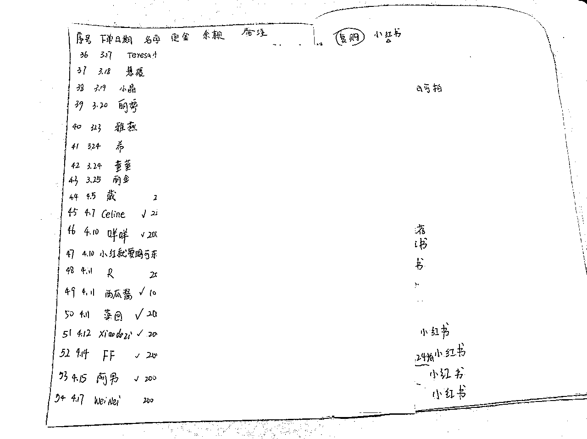

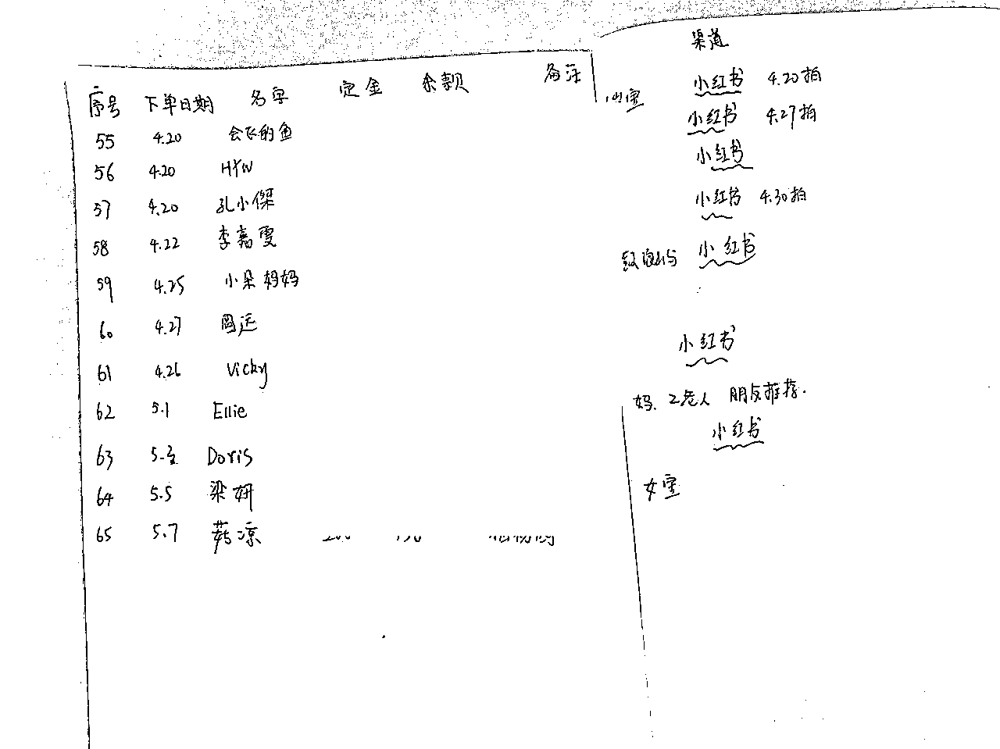

接下来，一起来看看她的小红书IP全案~

# 一、高价值定位

我在问荷娜为什么要做这个（本地旅拍摄影师）定位时，她说这是她很喜欢做的事情，哪怕不做小红书不做自媒体，也想做的事情。果然热爱可抵岁月漫长

所以文静建议她的定位：主要是为旅行者和当地居民提供个性化、原创的旅游摄影服务。对当地文化和景观有深入的了解，同时在小红书平台上分享摄影作品、创作过程、技巧和经验

变现方式：主要向用户提供旅拍摄影服务，如旅游摄影、情侣照、家庭照、儿童照、孕照等。同时也可以通过本地品牌合作、本地广告投放等方式来获得更多的商业价值

在确定定位和变现方式之后，也给确定了她要吸引的客户群体、解决方案，以及她自己本人需提升的IP核心竞争力

# 二、小红书账号4件套

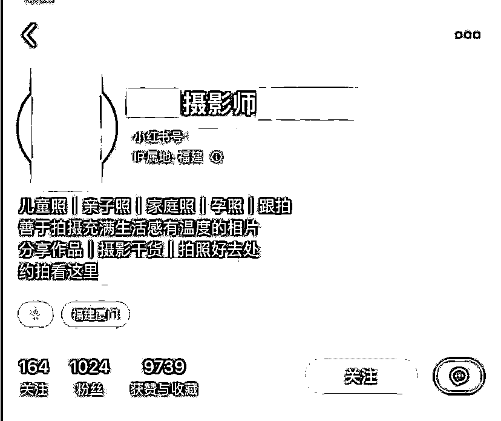

包括了昵称、头像、个人简介、背景墙

个人昵称：xx城市摄影师+人名。简洁易记的昵称，方便用户记住和查找。又与定位相关：例如城市、拍摄风格等。例如：某某旅拍、某某摄影、某某拍客等

头像：真人出镜实拍，更有IP信任感

个人简介：直接介绍你提供的服务内容、服务理念和客户评价

另外还可以写：你的专业领域和摄影技能：例如，你可以描述你的专业领域和擅长的摄影技术，以及你对摄影的热爱和态度。突出你的拍摄风格。展示你的作品和经验

# 三、内容营销策略

首先必须认识到选题决定了你的流量上限，如果你一开始找的对标选题，就是只有几十个赞，那大概率，你模仿写出的笔记，也肯定无法爆到哪里去，因为你的前辈对标已经告诉了你，最好的数据量，就是这了。所以先找到点赞1000+的对标选题（常规类目），这个超级重要！

那如果在起号阶段，即一万粉之前（常规类目），你的第一版小红书的内容体系搭建，至少要包含这3个内容，而且比例是271

## a、工具合集丨蹭热门话题：20%

作用：起号养号更快，数据更好

比如，举例：→摄影师需要下载的软件合集、100个日本摄影师学习

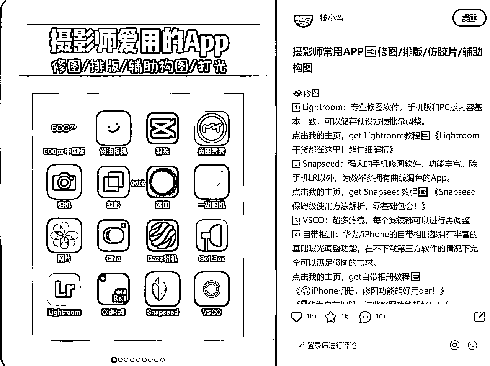

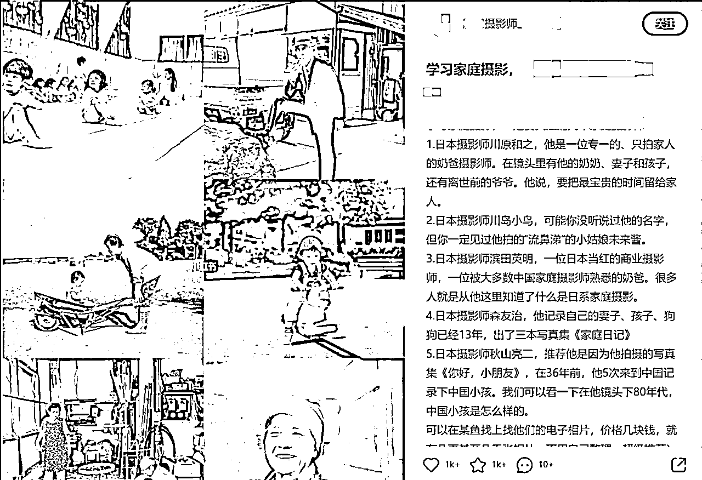

## b、干货知识丨方法论丨案例：70%。

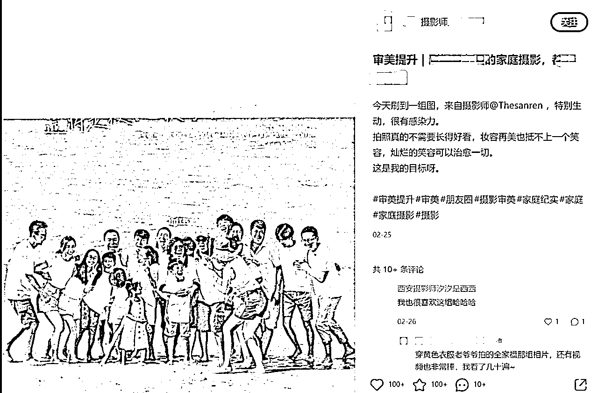

比如举例：

### ①儿童摄影家庭摄影作品分享：

分享自己摄影作品，吸引到该领域的潜在客户，并向用户介绍当地的儿童拍摄场所。例：100个城市儿童摄影、100个城市全家福、100个城市周岁礼…

正文内容：可以包括但不限于：

1.  拍摄场景的选择：介绍拍摄地点的特点，比如景色如何、照片中的建筑或背景有哪些特色，可以在文章中穿插照片，帮助读者更好地理解拍摄地点的美丽之处。

1.  拍摄手法的介绍：介绍拍摄所用的器材以及拍摄技巧，比如如何抓住孩子的瞬间表情、如何捕捉家庭成员的互动场景等。

1.  照片的选择和介绍：选择最好的照片，用文字形容其中的细节，例如光线、颜色和构图等，这可以帮助读者更好地欣赏和理解照片。

1.  选题的多样性：本地旅拍摄影师IP可以根据当地的季节、传统节日、文化特点等，选择不同的主题进行作品分享，比如春天的花海、秋天的红叶、儿童节的庆祝活动等。

选题举例：可以包括但不限于：

1.  "春天的童话世界"：以春天为主题，拍摄孩子们在花海中、在草地上玩耍的场景，介绍拍摄手法和技巧。

1.  "家庭日常"：拍摄家庭成员在一起的场景，例如做饭、玩游戏、看电影等，通过照片展示家庭的温馨和幸福。

1.  "欢乐的夏日时光"：以夏天为主题，介绍如何在户外拍摄儿童，例如在海边、在泳池旁边、在公园玩耍等。

1.  "亲子旅行"：拍摄家庭出行的场景，例如在景区里、在旅店里、在美食街上等，通过照片和文字分享旅行的经历和感受。

### ②带有本地特色的旅拍照片和景点介绍：

分享自己拍摄的带有本地特色的照片，并结合景点介绍，帮助用户更好地了解当地的文化、历史和风俗习惯。甚至是本地美食和购物推荐

### ③旅拍技巧分享：

分享自己的摄影技巧，如如何拍摄清晰、生动的照片，如何捕捉瞬间，如何利用光线等，帮助用户在旅行中拍出更好的照片

### ④线下旅拍活动开展：

报道自己参与的线下旅拍活动，并分享活动的照片和感受，吸引更多用户参与，提升自己在该领域的影响力

### ⑤摄影器材推荐和分享：

分享自己喜欢的摄影器材、使用心得、购买渠道等信息，帮助摄影初学者更好地了解和选购器材

## c、个人IP：10%

作用：为了更高收入更高客单的转化，外显的就是出现真实的人样、真实的线下场景（比如真人拍摄过程、公司工作室、餐厅公园等）。内显，就是内容要写出你对该行业领域的深度思考，深度认知，避坑指南等等

举例：女性家庭摄影师的优势

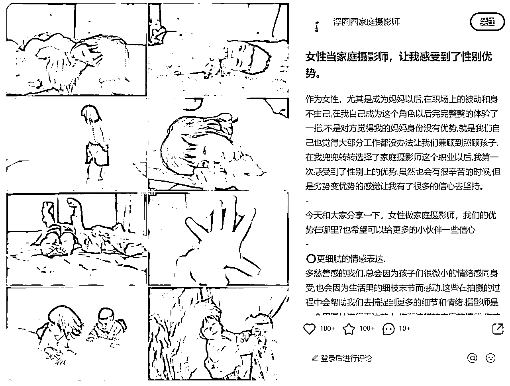

## 爆款封面图小结

1.  以本地著名景点为背景，拍摄客户的照片、客户自己的合影。拍摄客户在景点中的照片，以客户为主角，突出旅拍的氛围

1.  拍摄自己在拍照时的照片，通过构图和后期调整突出自己和场景

1.  将拍摄技巧与本地景点相结合，通过示范性的拍摄演示吸引用户

1.  将自己的摄影器材作为封面图素材，强调自己的专业能力和摄影态度

# 快速做自己内容的技巧

1、每天都刷小红书，收藏可以参考的内容，选题也及时登记在选题库里

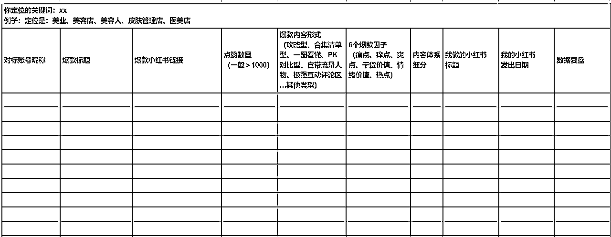

2、爆款标题两两相串法

把2条爆款标题，两两相串，比如搜索厦门拍照植物园

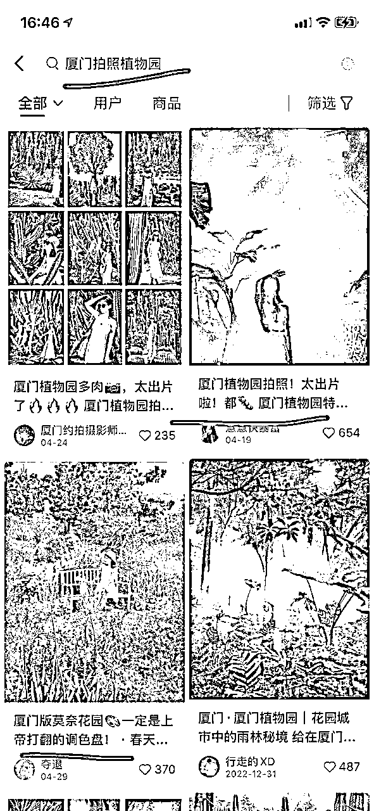

图片组成新的标题：厦门植物园拍照!上帝打翻的调色盘！太出片啦！

# 关键词长尾词

小红书的笔记标题、封面图、正文内容，是由一个个定位产品下的关键词长尾词，组成的。你可以搜小红书的下拉框，免费找到关键词长尾词，也可以买千瓜、灰豚等网站平台来查

1.  目的地名称或景点名称，例如“上海迪士尼乐园”、“杭州西湖”等。

1.  拍摄类型或风格，例如“儿童摄影”、“家庭写真”、“复古风格”、“清新自然”等。

1.  拍摄技巧和经验，例如“如何拍摄美食照”、“如何拍摄夜景”等。

1.  本地文化和特色，例如“品味上海老街巷”、“探索北京胡同文化”等。

1.  服务承诺和优惠活动，例如“免费试拍”、“预约可享优惠”等。

1.  相关话题和热点事件，例如“520情侣游园摄影心得”、“国庆旅拍攻略”等。

# 引流钩子

账号的目标一开始是奔着引流去的，接商业广告为次要。所以大部分的笔记内容尾页，都是直接发了引流钩子

引流钩子用了成本最低的X本电子书，这样成本可控且相对安全

用粉丝感兴趣的文档，引导粉丝到群聊，然后微信小号在群里发微信号，想要的就直接加。也加上了产品服务合集，在前端就用一部分内容，来筛选了用户

1、打卡城市99个必拍照景点及姿势合集

2、跟拍旅拍优惠券200元

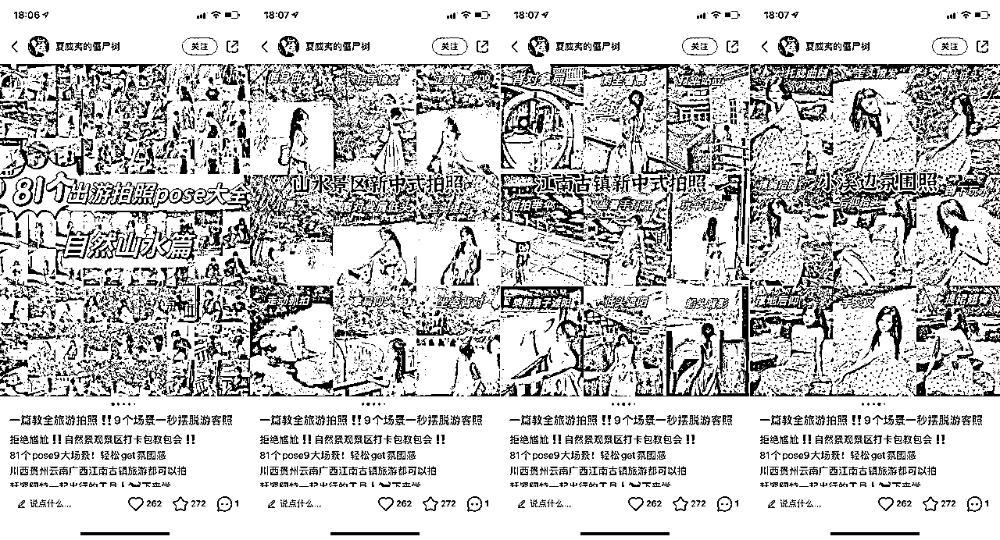

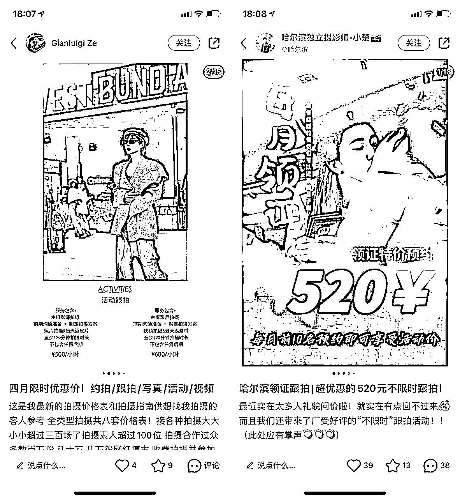

目前还没有计划下一步矩阵号玩法。因为荷娜作为单独一个人，从0开始做这起这个旅拍小事业，已经是很棒的开始。

为每个普通人在小红书找到自己的新生态位，新的商业变现，而共喜恭喜~

如果大家对个人各行各业的小红书IP，更感兴趣，欢迎跟文静说~文静先优先吭哧地复盘写出来~

# 01：美业人X小红书IP全案