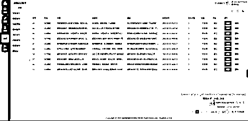

# 超级SEO公测邀请手册 - 公测教程

> 来源：[https://hs741f1tsz.feishu.cn/docx/Z5sDdtIvuoQvacxBnOVcTAlfncc](https://hs741f1tsz.feishu.cn/docx/Z5sDdtIvuoQvacxBnOVcTAlfncc)

SEO没那么神秘，就是一个基本技能，拼的是学习能力和执行力，做好SEO的核心是满足用户需求！

*   - 白杨SEO

## 前言

首先，我非常荣幸能够邀请到你参与到超级SEO助手的公测，或许你是在互联网摸爬滚打多年的专业人士，又或者你只是怀着一颗好奇的心，无论你当下身份如何，你都或多或少的见证了AIGC时代的飞速发展，也体验到了AIGC给我们带来的便利性。

也是因为生成式的对话让我们的思维无限开阔，短时间内，基于GPT的应用遍地开花，有人用来写作，有人用来问答，也有人用来解决垂直行业或某些小场景的痛点。

作为一名多年的软件开发工程师，在去年12月底我有幸参与到了ChatGPT的第一波浪潮，也至此开启了对GPT的深入研究和开发，其中《ChatGPT分销版》作为市面上领先的AI对话项目产品，荣获差不多将近千人的青睐，多次在其他同行的竞品分析中出现，也正因为如此，我们创造了多个累计充值过百万的客户，单日充值超10w+，这些数据也印证了ChatGPT的火热程度，同时也证明了我们的研发实力和对市场敏锐的嗅觉。

不管过去如何，将来如何，现在我们需要做的就是利用现有技术解决实质性的问题，帮助更多值钱的人赚到钱，同时也希望更多的人拥抱AI时代的浪潮，创造更多可能，发现更多机会。

既然是生成式AI，那肯定是和内容有关系，和内容有关系又能直接获取的无疑就是SEO了，互联网时代你的客户基本来源于搜索或者相关内容的触达，从而产生的链接，所以我们决定用ChatGPT的技术来解决这一问题，也正因为这个点，《超级SEO助手》产品项目由此诞生。

经过多个夜以继日的奋战，今天我们正式开启了《超级SEO助手》的公测，这篇公测手册请认真阅读。

## 超级SEO助手

在没有生成式AI出现之前，大多数公司都需要请一个专门的运营和文案，又或者请多个编辑人员，每天都是抓破脑袋的想写什么内容。

当生成式AI出现之后，解决了内容生产问题，也就是能够减少一部分人员开支，但是还是需要有人写，只是成本降低而已。

于是，我们就想通过一种方式，让内容批量自动生产，然后自动发布到指定的平台（自己的官网或者其他各大CMS平台），这样才能完全解放我们的双手，让内容自动化，让成本趋近于0。

在这种大胆的假设之前，我们通过技术+ChatGPT的结合，研发了可以完成这些自动化操作的系统，《超级SEO助手》。希望能够解决目前企业的一些内容上的运营问题，从而为企业带来更多的客户资源。

经过我们前期大量的试验证明，GPT生成的内容是可以搜录的，前提是需要你给出好的标题、关键词等等。

公测结束时间：2023-05-28 00:00:00

## 参与公测福利

本次公测会给出1000元奖金，测试之后的反馈意见通过社区提交，最后按照反馈的内容，获得点赞最多的前3名可以获得奖金，具体奖励如下。

第一名：500元现金奖励

第二名：300元现金奖励

第三名：200元现金奖励

除以上现金奖励以外，根据贡献程度赠送一套超级SEO的独立部署权益，前提是自己购买一套。

## 公测反馈教程

社区反馈地址：https://support.qq.com/products/423209/

1.  进入到社区首页，点击右侧的“我要发言”按钮，如下图所示。

1.  点击“我要发言”按钮之后，会看到如下图所示的弹窗。

选择对应的项目分类，然后选择BUG反馈，输入你要反馈的内容。

1.  反馈的时候做到逻辑清晰，BUG列出列表，不要只说结果，最好是能表述清楚导致的过程。

## 公测操作教程

公测注册地址：http://demo.kfadmin.net/app/ycSuperseo/#/Index/index?appid=1

1.  注册完之后登录到超级SEO的个人中心，可以看到如下界面

1.  新用户是没有任何权益的，所以需要你支付0.1元的测试费用开通会员权益，点击右上角的开通会员之后会弹出如下图所示的界面，默认开通第一个即可。

1.  开通完成之后就可以开始你的创作历程了，你需要清楚的一个逻辑是，当你的套餐用完之后，你的所有任务将会直接停止，在测试结束之后所有数据将会清空。

接下来我将会按功能结构讲解操作方法

### 渠道

#### 数据库

为了支持更多的分发渠道，我们支持直接链接数据库，对你的内容系统数据库直接操作，需要你填写对应的数据库信息，在内容发布的时候会自动链接。

#### 表字段

表字段就是和你数据库的某个表进行关联，一般都是关联你的文章表，这里仅作为映射使用，不会涉及敏感信息的操作。

#### 接口渠道

除了支持数据库通道外，我们还支持将参数提交到第三方的CMS中，如果你的站点是基于其他CMS开发的，你可以选择接口渠道，直接推送内容。

上述内容涉及到技术方面的对接，这里不过多去阐述，可以自行查阅资料。

### 模板

#### 分类

就是对当前操作的标题进行分类管理，你可以把针对每个行业的标题进行分类存放，在生成文章的时候可以选择分类生成，这也是实现批量自动化的关键。

#### 智能生成

在智能生成里面，你可以输入关键词和选择指定的分类，生成对应的标题，还可以指定生成的标题数量。

自动创建：默认是以你指定的数量生成，如果你在这里输入0，那就是无限创建，直到你的字数消耗完为止。

如果你设置的是固定数值，那就是循环次数，比如你数量设置5，这里设置2，那就是循环2次，也就是生成10个标题，以此类推。

#### 标题队列

在智能生成的时候如果自动创建数量是-1，则不会进入这里，如果是固定值或者0，会把任务投递到这里进行生成。

#### 标题管理

所有生成的标题都会归档到标题管理里面，可以看到生成的状态，还可以对其进行编辑和修改，如果生成效果和质量不行，就选择删除。

#### 导入标题

如果你在知乎或者其他地方有批量采集到标题，这里可以直接导入这些标题进行创作。

#### 智能提取

对指定的内容进行总结和归纳，然后对其进行快速原创，相当于伪原创，但是相比伪原创更加人性化，对内容的语气以及表达都换了一个方式。

#### 内容管理

你提取到的内容，会统一归纳到这个地方管理，你还可以对伪原创的文章大纲进行改写之后再操作。

### 内容

#### 标题创作

选择前面生成的标题进行快速创作，还可以在文中插入图片，如下图所示。

#### 快速原创

选择前面内容提取到的大纲进行伪原创，同样也可以插入图片，如下图所示。

#### 自动创作

前面我们知道了标题的自动化，但是只能无限生成标题，这里的自动创作就可以根据前面的标题进行无限创作文章，自动化会消耗一定的服务器性能，所以如果是独立部署的，尽可能的备好一点的服务器。

这里也可以选择创作数量，如果你是想创作指定篇数的文章，就可以自由设置。

#### 内容创作

所有伪原创之后的文章都会在这里进行管理，如下图所示。

#### 标题创作

选择标题进行创作的文章会归档到这里进行管理，还能对生成之后的文章编辑和修改，甚至是删除操作，如下图所示。

### 发布

#### 生产管理

你的所有标题创作、还是内容创作都会在这里体现，可以看到每篇文章的字数，以及耗时，还有当前的状态，如果文章创作失败，还会显示失败的原因。

除可以看到信息以外，你还能对文章进行下载到本地，也能在线对文章进行编辑管理。

#### 快速发布

这里你可以选择指定的文章发送到你指定的渠道，比如目前所支持的数据库模式，也就可以直接推送到你的网站系统，如下图所示。

#### 定时发布

在这里可以完成文章的自动化发布，如果你认真看到这里，你会发现所有的功能都可以自动化完成，比如前面的标题自动化，内容自动化，发布自动化。

在定时发布这里，你只需要设置好对应的发布参数，比如每天什么时候发布，每天发布多少篇，发布到什么渠道，以及发布的间隔时间等，如下图所示。

#### 发布记录

这里可以记录你的所有发布的文章记录，发布到什么渠道，什么接口，发布时间，状态等都会在这里展现。

以上就是整个超级SEO的测试流程，你可以根据你的需求设定不同的发布渠道，从而达到想要的测试效果，或者你可以把你的想法通过社区反馈给我。

本次测试仅测试用户端功能，管理端就是基本的管理操作，暂时不对外开放测试，管理后台操作截图如下。

对用户的基本管理，可以设置套餐，对内容进行审核，还能对系统进行基本的设置操作。

## 结语

每个产品的伟大不是一个人闭门造车，而是通过分享和大家交流，从而更好的改进和完善产品。

我希望后面会有更多利用AI技术实现更多的垂直行业的产品，我也希望通过这次的公测，能够让我们找到更多的方式方法，以便我们改进超级SEO，让这个产品适应更多的内容生产场景。

本次公测的奖金制度在公测完之后公示出来，保证公平公正，最后感谢您能参与到我们的测试，祝您事业步步高升。