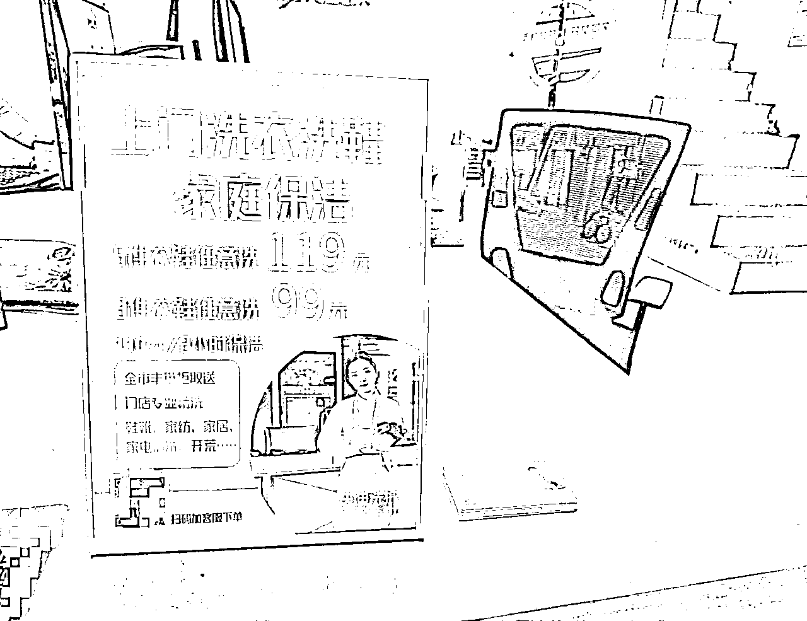
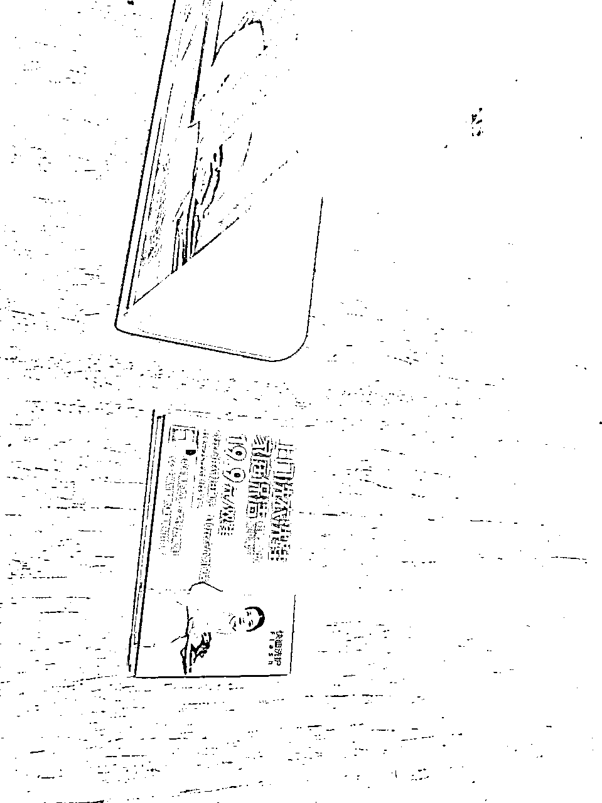
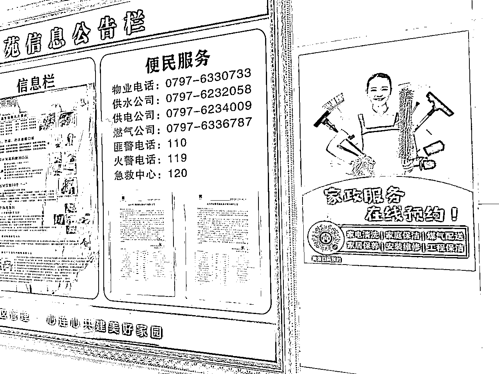
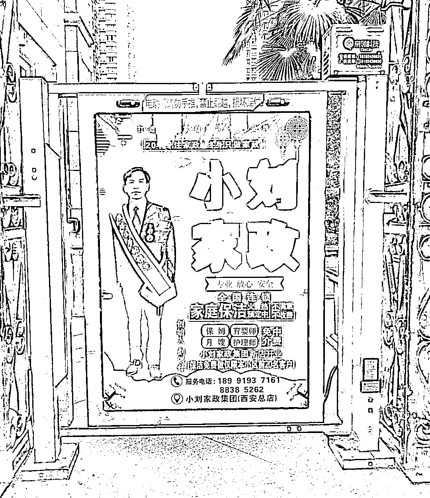

# 我让人人0成本卖洗衣家政每月多赚一万

> 来源：[https://ehvzbnju2l.feishu.cn/docx/ZAV2dmbprovcXvxqVe9cUVfEnKd](https://ehvzbnju2l.feishu.cn/docx/ZAV2dmbprovcXvxqVe9cUVfEnKd)

大家好我是做互联网洗衣的老钱，前年在生财分享过我做互联网洗衣的全过程经验：https://shimo.im/docs/gWcqR9TPkX8QwKKw/，目前我是全国唯一在做全套互联网洗衣经验交付的人，这两年也带了几十个老板在美团等电商平台上做虚拟洗衣店店群，用电商中间商打法做洗衣服务，不用自己洗衣不用开店，只做客服，利用快递外包给洗衣店洗涤。

最近受到一个开社区便利店的朋友的启发，我们跑出了一套云洗衣新业务模式，让做本地生活的老板都能够利用线下人流卖出洗衣、家政服务，老板只做客服中间商工作， 连线上网店也不用开，实现增收。3个月我测试了5个便利店、复印店、饭馆、驿站等业态，每个店每月洗衣+保洁卖出了1万-2.3万销售额，利润六七千起。因为不需要额外的人力成本、场地空间、洗衣极其高频，甚至可以做无人自助下单模式，非常适合有稳定人流的物业老板、门店老板、有本地客户私域的老板当做增收副业做，普通人也可以找线下老板异业合作做中间商挣差价，给大家复盘下整个过程经验，希望多多指教。

## 一、盈利模式是啥，怎么做中间商

洗衣和家政行业有个不为人知的行业内幕：十几年来，这两个都是代工外包非常成熟的行业，很多从业者都不是自己洗衣、不用自己雇保洁阿姨，他们只是中间商、只做客服工作和获客，有的洗衣店看着门脸是个洗衣店，但其实里面没有洗衣机了，只是个收衣点，衣服会集中送到一个大洗衣中心去洗。全国90%的家政公司都是外包给社会上的保洁阿姨灵活接单为主，很少雇全职阿姨。

年初有个有多家便利店的老板找我咨询互联网洗衣业务能不能嵌进他门店里，让店员收银时顺带销售洗衣服务，这个诉求启发了我，到家生活服务这种服务效果拉不开差距的行业，都是有稳定线下人流或者有私域客情基础就一定能转化成交，于是我们决定合作一把，看看效果咋样，同时我还找了街边餐饮店、复印店、快递驿站一起测试。

1、互联网洗衣：

这几年我已经把互联网洗衣各种流程模式都摸透并做了微创新，传统的互联网洗衣是利用快递京东顺丰上门取送，但其实利用顾客附近的丰巢柜、各种形态的快递驿站也能完成服务，还节省了很大一部分的快递费成本。

行业内幕是，大部分洗衣店老板都愿意接外包代工清洗，因为能降低每件衣服的清洗水电成本，我们找到附近的洗衣店老板，挑能力靠谱的进行代工合作。

整个服务流程就是中间商作为接单入口，顾客下单；然后顾客把衣服放门店前台、丰巢柜，或者有的洗衣店老板本身有上门服务；洗好后，洗衣店老板再把衣服送回门店、丰巢柜或者送上门。售后沟通由洗衣代工方负责，中间商老板只做客服工作接单收钱，有店员的可以让店员做客服。一部手机微信和顾客聊单即可，所以客服在哪无所谓。

互联网洗衣单均价100元，因为没有房租人工成本，这行都是定价低于于实体洗衣店均价40%起，5件3件任意洗套餐卖的最好，所以这些年抢走了实体洗衣店大量订单，洗衣家政行业用户消费决策受价格影响非常大，尤其现在消费降级背景下。我们的最低目标只是每天顺便销售几单，基于人流和价格优势就百分百能做到。

成本结构这块，洗涤代工费成本占40%-50%，中间商净利率50%-60%，我们做的几个线下店，有店员参与顺便推销的话，人流量最少的复印店每天成交3单左右，无人推销的话，根据进店人流量不同，每天2单左右。也就是复印店单店洗衣订单每天销售额在200-300元，另外快递驿站、便利店、超市是单量最多的业态，日销售额都能在500-800以上。

2、云家政：

我们测试下来，家政的消费频率比洗衣低太多，毕竟洗衣频率直接和洗澡次数挂钩，很多客户一个月能下单洗四五次衣服，我们为啥同时卖家政保洁呢？因为洗衣和家政的客群是完全重叠的，洗衣是生活服务里最高频人群覆盖最大的服务，消费场景和家庭保洁一致，周末大扫除的时候，很多人习惯洗洗衣服同时搞搞卫生，因此家政保洁非常合适做搭售项目去卖。

云家政是靠进入大量本地的家政派单阿姨群，中间商就是客服接单收钱，然后派单给群里的阿姨，阿姨抢单接单后上门服务，完工后，中间商给阿姨结工钱。

云家政客单价150-200，保洁人员工钱占50%-70%，中间商净利率30%-50%。我们这几个月跑出来的数据结果，这几个业态，单店家政订单每天平均成交1单。如果顾客先咨询的洗衣，搭售家政保洁成功率在15%左右。

## 二、操作流程和难点

1、我首先就教会所有老板和他骨干店员：洗衣和家政的售前售后客服经验话术、行业全部知识、销售话术SOP技巧，这两个行业里客服销售、沟通是最重要的环节，因为行业特性，清洗、保洁标准不一，客服话术经验能力直接决定了销售转化率、售后纠纷率。尤其洗衣涉及衣服磨损或者污渍洗不掉的问题，如果没有几年经验，前期肯定会接很多有风险的衣服而产生退款。所以有风险的衣服的甄别能力是售前这块的培训重点。基本上学1周后，老板们都是合格的洗衣家政客服了，都能做到规避风险客户。

2、学习行业经验的同时，我带着老板们找同城的洗衣代工店，难点在于要挑选出清洗能力不错、承接量合格的洗衣店，另外和他们谈代工价是决定利润的关键点。小白一张口就会被洗衣店老板察觉外行并拿捏报价，我教会老板们谈判技巧和代工市场价建议。一般能接100件衣服代工量的洗衣店，就可以满足30多单的单量了。找人的时候最后考察的指标在于洗衣店老板做事做人的靠谱程度，清洗技术，以及是否有团队协作能力、沟通力，这块比较考验中间商的看人能力了。

3、家政前期主要工作量在于加当地的家政派单群，正好我有现成的客服话术手册，这事儿就是靠坚持，善于和大姐沟通就行。

4、打磨服务流程：要和代工洗衣店协商好衣服取送方式，一般一天来一趟集中取送。家政的服务流程相对简单很多，把顾客和保洁人员信息对接好即可。

5、布置流量入口物料：单店销量的关键点在于店员推销力度和线下广告物料的曝光转化，这是我给几个店做的物料：

什么样的线下入口合适做这事儿，其实就一个判断原则：只要是个有稳定路过人流的地方就行。

没有人工、没有店，我都能做成自助下单模式引导，自助模式在洗衣店行业屡见不鲜了。

## 三、什么资源条件的老板适合做这个生意？

以下几类人群我认为都很合适做：

1、良好的沟通能力和稳定脾气，头脑灵活。

2、宣传场景适合有门店、社区物业、线下高人流量窗口位置、民宿酒店、人流进出口位置资源，这样利用进店人流/路过人流的转化销售。找这些资源去谈合作，在这些地方放广告牌即可，大部分商家都有异业合作的意识。

如果你有能力在线下人流量不错的位置放一个X展架、广告牌等，上面加上客服微信二维码和电话，都可以有稳定转化，就能做这个生意，这点不接受反驳，因为这么多年来大家在很多小区楼大厅、楼道，经常能看到家居装修、家政、搬家开锁等X展架广告，这就是刚需生活服务的获客优势，用户不认品牌，只要有人流就有客资咨询。

比如人流进出口位置、小区物业中心、电梯广告、小区宣传栏、街边底商窗口等.

3、有本地客户的微信私域。

4、做本地生活生意的老板。比如外卖店、本地电商等，外卖也能利用已有订单通过包装里的卡片进行推广。

5、店员沟通水平的人就能做好家政洗衣客服，因为顾客98%的提问都是同一批问题，照着话术手册复制粘贴熟能生巧。

这事也无所谓客服在哪，有人流或者私域就能做成自助线上下单模式，客服线上完成服务，完全不用和顾客线下接触，只有洗衣代工方和保洁人员在做线下工作。

## 四、可以卖的产品

### 洗衣板块：

1、衣服 2、洗鞋靴 3、家纺窗帘 4、皮具洗护

### 家政板块：

1、家庭保洁 2、家电清洗 3、除甲醛 4、收纳 5、家居清洗、抛光（沙发、地毯地板、床垫等） 6、企业开荒保洁 7、保姆月嫂（均是可外包做中间商的行业）

8、搬家开锁通下水等（均是可外包做中间商的行业）

五月份我会帮助30多个朋友落地这个增收“副业”，如果打磨变形出更多新模式我会第一时间来分享。包括预计除了家政，我还会加一些其他生活服务作为洗衣的搭售项目，数据不错的项目我会分享出来。欢迎找我交流沟通。